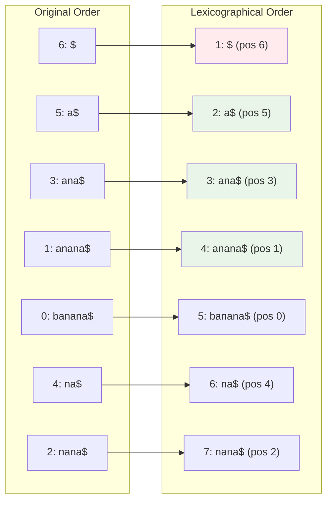
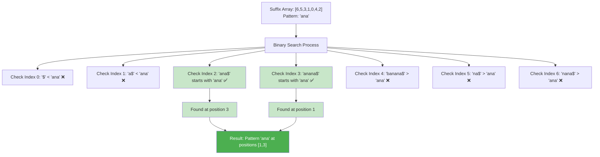

# Building a Simple Suffix Array: A Step-by-Step Guide

## Introduction: From Text to Searchable Index

In this guide, we'll build a suffix array from scratch using the simple example "banana". You'll see every step of the process: generating suffixes, sorting them, and using the result to search for patterns. By the end, you'll understand exactly how suffix arrays work and be able to implement your own.

## Step 1: Understanding Our Example Text

Let's work with the text "banana" and add a sentinel character '$':

```
Text: "banana$"
Length: 7 characters
Positions: 0 1 2 3 4 5 6
           b a n a n a $
```

The sentinel '$' ensures all suffixes are unique and helps with boundary conditions.

## Step 2: Generating All Suffixes

A suffix is any substring that extends from some position to the end of the text. Let's list all suffixes:

```
Position 0: "banana$"  (entire string)
Position 1: "anana$"   (from 'a' to end)
Position 2: "nana$"    (from first 'n' to end)
Position 3: "ana$"     (from second 'a' to end)
Position 4: "na$"      (from second 'n' to end)
Position 5: "a$"       (from last 'a' to end)
Position 6: "$"        (just the sentinel)
```

**Key insight**: We have exactly n suffixes for a text of length n, and each suffix is uniquely identified by its starting position.

## Step 3: Sorting Suffixes Lexicographically

Now we sort these suffixes in alphabetical (lexicographical) order:



**Why this ordering?**
- '$' comes first (smallest character)
- "a$" comes before "ana$" (shorter string is prefix of longer)
- "ana$" comes before "anana$" (same logic)
- "banana$" comes after "anana$" ('b' > 'a')
- "na$" and "nana$" follow similar logic

**Key insight**: Lexicographical order groups related patterns together, enabling efficient range-based searches!

## Step 4: Creating the Suffix Array

The suffix array stores only the starting positions of the sorted suffixes:

```
Sorted Suffixes:    Starting Positions:
"$"        →        6
"a$"       →        5  
"ana$"     →        3
"anana$"   →        1
"banana$"  →        0
"na$"      →        4
"nana$"    →        2

Suffix Array: [6, 5, 3, 1, 0, 4, 2]
```

This array of 7 integers completely represents the sorted order of all suffixes!

## Step 5: Implementation in Python

Let's implement this step by step:

```python
def build_naive_suffix_array(text):
    """Build suffix array using naive O(n² log n) approach"""
    
    # Step 1: Generate all suffixes with their positions
    suffixes = []
    for i in range(len(text)):
        suffix = text[i:]
        suffixes.append((suffix, i))
    
    print("Generated suffixes:")
    for suffix, pos in suffixes:
        print(f"Position {pos}: '{suffix}'")
    
    # Step 2: Sort suffixes lexicographically
    suffixes.sort(key=lambda x: x[0])
    
    print("\nSorted suffixes:")
    for i, (suffix, pos) in enumerate(suffixes):
        print(f"Rank {i}: '{suffix}' (from position {pos})")
    
    # Step 3: Extract positions to create suffix array
    suffix_array = [pos for suffix, pos in suffixes]
    
    return suffix_array

# Test with our example
text = "banana$"
sa = build_naive_suffix_array(text)
print(f"\nSuffix Array: {sa}")
```

Output:
```
Generated suffixes:
Position 0: 'banana$'
Position 1: 'anana$'
Position 2: 'nana$'
Position 3: 'ana$'
Position 4: 'na$'
Position 5: 'a$'
Position 6: '$'

Sorted suffixes:
Rank 0: '$' (from position 6)
Rank 1: 'a$' (from position 5)
Rank 2: 'ana$' (from position 3)
Rank 3: 'anana$' (from position 1)
Rank 4: 'banana$' (from position 0)
Rank 5: 'na$' (from position 4)
Rank 6: 'nana$' (from position 2)

Suffix Array: [6, 5, 3, 1, 0, 4, 2]
```

## Step 6: Searching for Patterns

Now let's use our suffix array to find the pattern "ana":

### Binary Search for Pattern Range

```python
def search_pattern(text, suffix_array, pattern):
    """Search for pattern using binary search on suffix array"""
    
    def get_suffix(sa_index):
        """Get suffix starting at suffix_array[sa_index]"""
        start_pos = suffix_array[sa_index]
        return text[start_pos:]
    
    def suffix_starts_with_pattern(sa_index):
        """Check if suffix starts with the pattern"""
        suffix = get_suffix(sa_index)
        return suffix.startswith(pattern)
    
    def compare_suffix_with_pattern(sa_index):
        """Compare suffix with pattern (-1, 0, 1)"""
        suffix = get_suffix(sa_index)
        if suffix < pattern:
            return -1
        elif suffix.startswith(pattern):
            return 0
        else:
            return 1
    
    # Find leftmost position where pattern could start
    left = 0
    right = len(suffix_array) - 1
    
    # Binary search for first occurrence
    while left <= right:
        mid = (left + right) // 2
        comparison = compare_suffix_with_pattern(mid)
        
        if comparison < 0:  # suffix < pattern
            left = mid + 1
        else:  # suffix >= pattern
            right = mid - 1
    
    first_occurrence = left
    
    # Binary search for last occurrence
    left = 0
    right = len(suffix_array) - 1
    
    while left <= right:
        mid = (left + right) // 2
        suffix = get_suffix(mid)
        
        if suffix.startswith(pattern):
            # Found pattern, search right for more
            left = mid + 1
        elif suffix < pattern:
            left = mid + 1
        else:
            right = mid - 1
    
    last_occurrence = right
    
    # Collect all occurrences
    occurrences = []
    if first_occurrence <= last_occurrence:
        for i in range(first_occurrence, last_occurrence + 1):
            if suffix_starts_with_pattern(i):
                occurrences.append(suffix_array[i])
    
    return sorted(occurrences)

# Test pattern search
text = "banana$"
suffix_array = [6, 5, 3, 1, 0, 4, 2]
pattern = "ana"

print(f"Searching for pattern '{pattern}' in '{text[:-1]}'")
print(f"Suffix Array: {suffix_array}")

occurrences = search_pattern(text, suffix_array, pattern)
print(f"Pattern '{pattern}' found at positions: {occurrences}")
```

### Manual Walkthrough of Pattern Search

Let's trace through finding "ana" step by step:



**The power of sorted order**: We can use binary search to quickly narrow down to the range containing our pattern, rather than checking every suffix!

## Step 7: Verification

Let's verify our results by checking the original text:

```
Original text: "banana$"
Positions:     0123456

Position 1: "anana$" → starts with "ana" ✅
Position 3: "ana$"   → starts with "ana" ✅

Both occurrences confirmed!
```

## Step 8: Complete Implementation

Here's a complete, working implementation:

```python
class SimpleSuffixArray:
    def __init__(self, text):
        # Add sentinel if not present
        if not text.endswith('$'):
            text += '$'
        self.text = text
        self.suffix_array = self._build_suffix_array()
    
    def _build_suffix_array(self):
        """Build suffix array using naive approach"""
        suffixes = [(self.text[i:], i) for i in range(len(self.text))]
        suffixes.sort()
        return [pos for suffix, pos in suffixes]
    
    def search(self, pattern):
        """Find all occurrences of pattern"""
        def compare(sa_index):
            suffix = self.text[self.suffix_array[sa_index]:]
            if suffix < pattern:
                return -1
            elif suffix.startswith(pattern):
                return 0
            else:
                return 1
        
        # Binary search for range
        left = self._binary_search_left(compare)
        right = self._binary_search_right(compare)
        
        # Extract positions (excluding sentinel)
        occurrences = []
        for i in range(left, right + 1):
            pos = self.suffix_array[i]
            if pos < len(self.text) - 1:  # Exclude sentinel position
                occurrences.append(pos)
        
        return sorted(occurrences)
    
    def _binary_search_left(self, compare_func):
        """Find leftmost position where pattern occurs"""
        left, right = 0, len(self.suffix_array) - 1
        result = len(self.suffix_array)
        
        while left <= right:
            mid = (left + right) // 2
            if compare_func(mid) >= 0:  # suffix >= pattern
                result = mid
                right = mid - 1
            else:
                left = mid + 1
        
        return result
    
    def _binary_search_right(self, compare_func):
        """Find rightmost position where pattern occurs"""
        left, right = 0, len(self.suffix_array) - 1
        result = -1
        
        while left <= right:
            mid = (left + right) // 2
            if compare_func(mid) == 0:  # suffix starts with pattern
                result = mid
                left = mid + 1
            elif compare_func(mid) < 0:
                left = mid + 1
            else:
                right = mid - 1
        
        return result
    
    def display(self):
        """Display the suffix array construction"""
        print(f"Text: '{self.text}'")
        print(f"Suffix Array: {self.suffix_array}")
        print("\nSorted suffixes:")
        for i, pos in enumerate(self.suffix_array):
            suffix = self.text[pos:]
            print(f"  {i}: '{suffix}' (from position {pos})")

# Demo usage
def demo():
    print("=== Suffix Array Demo ===\n")
    
    # Build suffix array
    sa = SimpleSuffixArray("banana")
    sa.display()
    
    print("\n=== Pattern Search Demo ===\n")
    
    # Test various patterns
    patterns = ["ana", "na", "a", "ban", "xyz"]
    
    for pattern in patterns:
        occurrences = sa.search(pattern)
        if occurrences:
            print(f"'{pattern}' found at positions: {occurrences}")
        else:
            print(f"'{pattern}' not found")
    
    print("\n=== Verification ===\n")
    
    # Verify results manually
    text = "banana"
    pattern = "ana"
    print(f"Manual verification for pattern '{pattern}' in '{text}':")
    
    for i in range(len(text)):
        if text[i:i+len(pattern)] == pattern:
            print(f"  Position {i}: '{text[i:i+len(pattern)]}'")

if __name__ == "__main__":
    demo()
```

## Performance Analysis

### Time Complexity
- **Construction**: O(n² log n) due to string comparisons during sorting
- **Search**: O(m log n) where m is pattern length, n is text length
- **Space**: O(n) for the suffix array

### Why This Works
1. **Lexicographical sorting** groups all suffixes starting with the same pattern
2. **Binary search** efficiently finds the range of matching suffixes
3. **Position extraction** gives us all occurrence locations

## Next Steps: Optimization Opportunities

This naive implementation works perfectly for understanding but has room for improvement:

1. **Faster Construction**: O(n log n) algorithms like radix sort on ranks
2. **Linear Construction**: Advanced algorithms like SA-IS achieve O(n) time
3. **Enhanced Searches**: LCP arrays for more efficient pattern matching
4. **Memory Optimization**: Compressed suffix arrays for large texts

## Key Takeaways

1. **Suffix arrays transform string search into array search** using lexicographical ordering
2. **Binary search on sorted suffixes** enables efficient pattern finding
3. **The pattern occurrence range** corresponds to a contiguous segment in the suffix array
4. **Simple implementation** provides a solid foundation for understanding advanced optimizations

You now understand the fundamental mechanics of suffix arrays! The core insight—sort once, search efficiently forever—forms the basis for many advanced string processing algorithms.