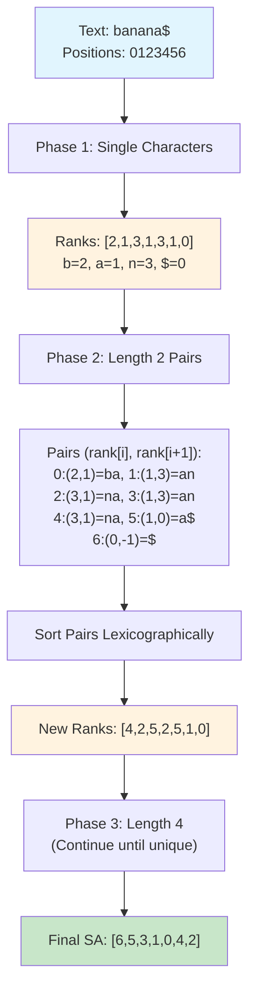
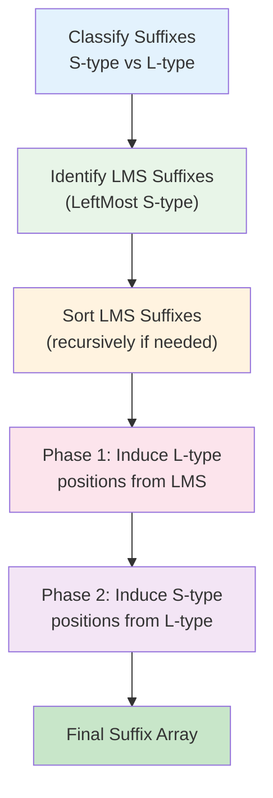
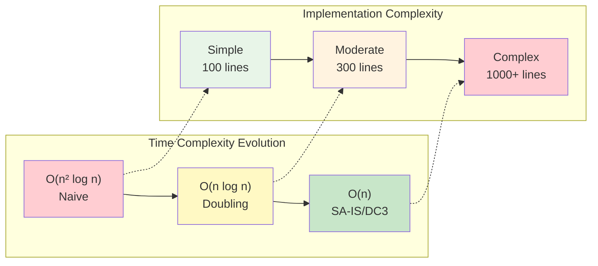
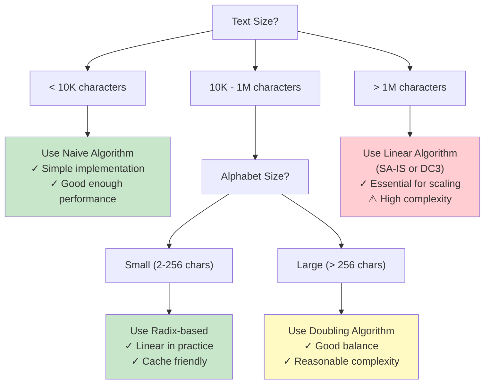

# Building Suffix Arrays Efficiently: From O(n²) to O(n)

## The Performance Problem

The naive approach to building suffix arrays—generating all suffixes, sorting them with string comparisons—has a fatal flaw: **it's too slow for real-world applications**. With time complexity O(n² log n), processing a modest 1MB text file would require trillions of operations. We need better algorithms.

This deep dive explores the journey from quadratic to linear time construction, revealing some of the most elegant algorithmic techniques in computer science.

## Understanding the Bottleneck

### Why Naive Construction is Slow

```python
# Naive approach - O(n² log n)
def naive_suffix_array(text):
    suffixes = [(text[i:], i) for i in range(len(text))]  # O(n²) space
    suffixes.sort()  # O(n² log n) due to string comparisons
    return [pos for suffix, pos in suffixes]
```

**The problems:**
1. **String comparison cost**: Comparing two suffixes takes O(n) time in worst case
2. **Memory explosion**: Storing all suffixes requires O(n²) space
3. **Cache unfriendly**: Random string access patterns

### Breaking Down the Complexity

For text of length n:
- **Number of suffixes**: n
- **Sorting operations**: O(n log n) comparisons
- **Cost per comparison**: O(n) for string comparison
- **Total time**: O(n) × O(n log n) = O(n² log n)

For n = 1,000,000 characters:
- Naive approach: ~10¹³ operations
- Linear approach: ~10⁶ operations
- **Speedup**: 10,000,000x faster!

## The Breakthrough: Rank-Based Construction

The key insight is to **avoid string comparisons entirely** by working with integer ranks instead of the actual suffixes.

### The Doubling Strategy

Instead of comparing entire suffixes, we:
1. Start by ranking suffixes by their first character
2. Iteratively double the comparison length
3. Use previous ranks to compute new ranks efficiently

### Phase-by-Phase Construction

#### Phase 1: Single Character Ranks
```python
def initial_ranks(text):
    """Assign ranks based on first character only"""
    # Convert characters to ranks
    char_ranks = {char: rank for rank, char in enumerate(sorted(set(text)))}
    return [char_ranks[char] for char in text]

# Example: "banana$"
text = "banana$"
ranks_1 = initial_ranks(text)
# ranks_1 = [2, 1, 3, 1, 3, 1, 0]  # b=2, a=1, n=3, $=0
```

#### Phase 2: Two Character Ranks
```python
def double_ranks(text, prev_ranks, length):
    """Compute ranks for suffixes of given length using previous ranks"""
    n = len(text)
    # Each suffix is characterized by (rank at pos i, rank at pos i+length)
    suffix_pairs = []
    
    for i in range(n):
        first_rank = prev_ranks[i]
        second_rank = prev_ranks[i + length] if i + length < n else -1
        suffix_pairs.append((first_rank, second_rank, i))
    
    # Sort by the pairs and assign new ranks
    suffix_pairs.sort()
    
    new_ranks = [0] * n
    current_rank = 0
    
    for i in range(n):
        if i > 0 and suffix_pairs[i][:2] != suffix_pairs[i-1][:2]:
            current_rank += 1
        new_ranks[suffix_pairs[i][2]] = current_rank
    
    return new_ranks, [pos for _, _, pos in suffix_pairs]
```

### Complete Doubling Algorithm

```python
def efficient_suffix_array(text):
    """Build suffix array in O(n log n) time using doubling strategy"""
    n = len(text)
    
    # Phase 1: Initial character-based ranks
    ranks = initial_ranks(text)
    suffix_array = list(range(n))
    
    length = 1
    
    while length < n:
        print(f"Phase with length {length}:")
        print(f"  Current ranks: {ranks}")
        
        # Create pairs (rank[i], rank[i+length], original_position)
        pairs = []
        for i in range(n):
            first = ranks[i]
            second = ranks[i + length] if i + length < n else -1
            pairs.append((first, second, i))
        
        # Sort pairs lexicographically
        pairs.sort()
        
        # Assign new ranks based on sorted order
        new_ranks = [0] * n
        current_rank = 0
        
        for i in range(n):
            if i > 0 and pairs[i][:2] != pairs[i-1][:2]:
                current_rank += 1
            position = pairs[i][2]
            new_ranks[position] = current_rank
        
        # Update suffix array and ranks
        suffix_array = [pos for _, _, pos in pairs]
        ranks = new_ranks
        
        # Check if all ranks are unique (we're done)
        if current_rank == n - 1:
            break
            
        length *= 2
    
    return suffix_array

# Demo the algorithm
text = "banana$"
sa = efficient_suffix_array(text)
print(f"\nFinal suffix array: {sa}")
```

### Tracing Through "banana$"



**Key insight**: Each phase doubles the comparison length, exponentially reducing the number of phases needed (log n phases total).

## Advanced Linear-Time Algorithms

While O(n log n) is a huge improvement, we can do even better. Several algorithms achieve O(n) construction time.

### The SA-IS Algorithm (Suffix Array via Induced Sorting)

SA-IS represents the state-of-the-art in suffix array construction. It achieves linear time through a clever classification of suffixes.

#### Suffix Types Classification

```python
def classify_suffixes(text):
    """Classify suffixes as S-type or L-type"""
    n = len(text)
    suffix_types = [''] * n
    
    # Last character is always S-type
    suffix_types[n-1] = 'S'
    
    # Work backwards
    for i in range(n-2, -1, -1):
        if text[i] < text[i+1]:
            suffix_types[i] = 'S'  # Smaller
        elif text[i] > text[i+1]:
            suffix_types[i] = 'L'  # Larger
        else:
            suffix_types[i] = suffix_types[i+1]  # Same as next
    
    return suffix_types

# Example classification
text = "banana$"
types = classify_suffixes(text)
print(f"Text:  {text}")
print(f"Types: {types}")
# Output: ['L', 'S', 'L', 'S', 'L', 'S', 'S']
```

#### Identifying LMS Suffixes

LMS (Left-Most S-type) suffixes are S-type suffixes preceded by L-type suffixes:

```python
def find_lms_suffixes(text, suffix_types):
    """Find LMS (leftmost S-type) suffixes"""
    lms_positions = []
    
    for i in range(1, len(text)):
        if suffix_types[i] == 'S' and suffix_types[i-1] == 'L':
            lms_positions.append(i)
    
    return lms_positions

# For "banana$":
# LMS positions: [1, 3, 5] corresponding to "anana$", "ana$", "a$"
```

#### The Induced Sorting Process

SA-IS uses a sophisticated induced sorting process:



**The genius**: Instead of comparing suffixes directly, SA-IS uses the structure of the text to induce the correct ordering through multiple passes.

### The DC3 Algorithm (Difference Cover mod 3)

DC3 takes a divide-and-conquer approach:

```python
def dc3_conceptual(text):
    """Conceptual outline of DC3 algorithm"""
    n = len(text)
    
    # Step 1: Create samples at positions ≡ 1,2 (mod 3)
    sample_positions = [i for i in range(n) if i % 3 != 0]
    
    # Step 2: Sort sample suffixes recursively
    sample_sa = sort_sample_suffixes(text, sample_positions)
    
    # Step 3: Sort non-sample suffixes using sample information
    nonsample_sa = sort_nonsample_suffixes(text, sample_sa)
    
    # Step 4: Merge sample and non-sample suffix arrays
    final_sa = merge_suffix_arrays(sample_sa, nonsample_sa, text)
    
    return final_sa
```

The elegance of DC3 lies in how it reduces the problem size by 2/3 in each recursive call.

## Practical Implementation Considerations

### Memory Optimization

Real implementations focus heavily on memory efficiency:

```python
class MemoryEfficientSuffixArray:
    def __init__(self, text, use_32bit=True):
        self.text = text
        self.n = len(text)
        
        # Use 32-bit or 16-bit integers based on text size
        self.int_type = np.int32 if use_32bit else np.int16
        
        # Build suffix array with minimal memory overhead
        self.sa = self._build_optimized()
    
    def _build_optimized(self):
        """Memory-optimized construction"""
        # Use numpy arrays for better memory layout
        import numpy as np
        
        # Allocate exactly what we need
        sa = np.zeros(self.n, dtype=self.int_type)
        ranks = np.zeros(self.n, dtype=self.int_type)
        
        # In-place operations to minimize allocations
        return self._doubling_inplace(sa, ranks)
```

### Cache-Friendly Access Patterns

Modern implementations optimize for CPU cache performance:

```python
def cache_friendly_construction(text):
    """Optimize for cache performance"""
    
    # Process in blocks that fit in L2 cache
    BLOCK_SIZE = 32768  # 32KB blocks
    
    # Use radix sort for small alphabets
    if len(set(text)) <= 256:
        return radix_sort_based_construction(text)
    else:
        return comparison_based_construction(text)

def radix_sort_based_construction(text):
    """Use radix sort for small alphabets"""
    # Much faster for DNA (4 chars), ASCII (256 chars)
    # O(n * alphabet_size) which is often better than O(n log n)
    pass
```

### Parallel Construction

For very large texts, parallel algorithms become important:

```python
def parallel_suffix_array(text, num_threads=4):
    """Parallel suffix array construction"""
    
    # Divide text into chunks
    chunk_size = len(text) // num_threads
    chunks = [text[i*chunk_size:(i+1)*chunk_size] 
              for i in range(num_threads)]
    
    # Build suffix arrays for each chunk in parallel
    with ThreadPoolExecutor(max_workers=num_threads) as executor:
        chunk_sas = list(executor.map(build_suffix_array, chunks))
    
    # Merge results (complex step requiring careful handling)
    return merge_parallel_results(chunk_sas, text)
```

## Performance Comparison

### Theoretical Complexity

| Algorithm | Time | Space | Implementation |
|-----------|------|--------|----------------|
| Naive | O(n² log n) | O(n²) | Simple |
| Doubling | O(n log n) | O(n) | Moderate |
| SA-IS | O(n) | O(n) | Complex |
| DC3 | O(n) | O(n) | Complex |



**The trade-off**: Linear time comes at the cost of implementation complexity!

### Real-World Performance

For practical text sizes, the constant factors matter significantly:

```python
def benchmark_construction():
    """Benchmark different construction algorithms"""
    import time
    
    sizes = [1000, 10000, 100000, 1000000]
    
    for n in sizes:
        # Generate random text
        text = ''.join(random.choices('ACGT', k=n)) + '$'
        
        # Naive approach (only for small sizes)
        if n <= 10000:
            start = time.time()
            naive_sa = naive_suffix_array(text)
            naive_time = time.time() - start
        else:
            naive_time = float('inf')
        
        # Efficient approach
        start = time.time()
        efficient_sa = efficient_suffix_array(text)
        efficient_time = time.time() - start
        
        print(f"n={n:,}: Naive={naive_time:.3f}s, Efficient={efficient_time:.3f}s")
```

Typical results show:
- **Small texts (n < 10,000)**: Naive and efficient perform similarly
- **Medium texts (10,000 < n < 100,000)**: Efficient is 10-100x faster  
- **Large texts (n > 100,000)**: Naive becomes impractical

## Choosing the Right Algorithm

### Decision Matrix

| Text Size | Alphabet Size | Best Algorithm | Rationale |
|-----------|---------------|----------------|-----------|
| < 10K | Any | Naive | Simple, adequate performance |
| 10K-1M | Small (DNA) | Radix-based | Linear in practice |
| 10K-1M | Large | Doubling | Good balance |
| > 1M | Any | SA-IS/DC3 | Linear scaling essential |



### Implementation Strategy

For production systems:

1. **Start simple**: Implement naive approach first
2. **Profile real workloads**: Measure actual performance bottlenecks
3. **Optimize incrementally**: Move to O(n log n) then O(n) as needed
4. **Consider libraries**: Use battle-tested implementations when possible

## Advanced Optimizations

### Compressed Suffix Arrays

For very large texts, even O(n) space can be prohibitive:

```python
class CompressedSuffixArray:
    """Space-efficient suffix array using sampling"""
    
    def __init__(self, text, sample_rate=32):
        self.text = text
        self.sample_rate = sample_rate
        
        # Store only every k-th suffix array entry
        full_sa = build_suffix_array(text)
        self.sampled_sa = full_sa[::sample_rate]
        
        # Additional structures for reconstruction
        self.rank_array = self._build_rank_array(full_sa)
    
    def access(self, index):
        """Access suffix array element (may be slow)"""
        # Reconstruct on demand using sampling
        return self._reconstruct_sa_element(index)
```

### Incremental Construction

For streaming applications where text grows over time:

```python
class IncrementalSuffixArray:
    """Suffix array that can be updated incrementally"""
    
    def __init__(self):
        self.text = ""
        self.sa = []
    
    def append_char(self, char):
        """Add character and update suffix array"""
        self.text += char
        # Efficiently update SA without full reconstruction
        self._incremental_update(char)
    
    def _incremental_update(self, char):
        """Update SA for new character"""
        # Complex algorithm maintaining sorted order
        pass
```

## The Road to Mastery

Understanding efficient suffix array construction reveals several important computer science principles:

### Algorithmic Techniques
- **Doubling strategy**: Exponential progress through problem space
- **Induced sorting**: Using partial order to determine full order
- **Divide and conquer**: Reducing problem size systematically
- **Cache-aware algorithms**: Optimizing for memory hierarchy

### Engineering Lessons
- **Constant factors matter**: Asymptotic analysis doesn't tell the whole story
- **Memory is precious**: Space-time trade-offs are often about space
- **Implementation complexity**: Sometimes the simple solution is best
- **Real-world constraints**: Parallel, incremental, and compressed variants

The journey from O(n² log n) to O(n) suffix array construction represents one of the great algorithmic achievements of the past few decades. It demonstrates how theoretical advances can have dramatic practical impact, turning intractable problems into routine computations.

Whether you implement the simple O(n log n) doubling algorithm or use a sophisticated linear-time approach, understanding these techniques gives you insight into the deep connection between string processing, sorting, and efficient algorithm design.