# The Core Problem: Building Systems That Scale and Survive

## What Makes System Design Hard?

Imagine you've built a beautiful web application that serves 100 users perfectly. Every click is instant, every page loads in milliseconds, and your single database handles all queries without breaking a sweat. Life is good.

Then success hits. Hard.

Suddenly, you have 10,000 users. Then 100,000. Then millions. Your perfect little system begins to buckle under the weight of its own success. Pages timeout. Databases crash. Users complain. Revenue is lost.

**This is the fundamental problem that system design solves: How do you build software systems that work beautifully not just today, but as they grow from dozens to millions of users?**

## The Complexity Explosion

The core challenge isn't just about handling more users—it's about handling the **explosion of complexity** that comes with scale:

```mermaid
graph TD
    A[Scale Increase] --> B[Volume Complexity<br/>📊 Data Size & Request Rate]
    A --> C[Concurrency Complexity<br/>⚡ Simultaneous Operations]  
    A --> D[Failure Complexity<br/>💥 Hardware & Software Failures]
    A --> E[Geographic Complexity<br/>🌍 Global Distribution]
    
    B --> F[Database Overwhelmed<br/>Query Performance Degrades]
    C --> G[Race Conditions<br/>Data Corruption & Inconsistency]
    D --> H[Cascade Failures<br/>Single Point Brings Down System]
    E --> I[Network Latency<br/>Poor User Experience]
    
    F --> J[System Failure]
    G --> J
    H --> J
    I --> J
    
    style A fill:#FFE4B5
    style J fill:#FFB6C1
```

### 1. **Volume Complexity: The Data Deluge**

```mermaid
graph LR
    A["100 QPS<br/>😊 Single DB handles easily"] --> B["1,000 QPS<br/>😐 DB starts to slow"]
    B --> C["10,000 QPS<br/>😟 Response times increase"]
    C --> D["100,000 QPS<br/>😱 Database melts down"]
    
    style A fill:#90EE90
    style B fill:#FFE4B5
    style C fill:#FFA500
    style D fill:#FFB6C1
```

**Real Example**: Instagram went from 0 to 1 million users in 2 months. Their single PostgreSQL database couldn't handle the load, forcing an emergency migration to a distributed architecture.

### 2. **Concurrency Complexity: The Coordination Challenge**

### 3. **Failure Complexity: Murphy's Law at Scale**

**Murphy's Law**: *"Anything that can go wrong will go wrong."* At scale, this becomes *"Everything that can go wrong is going wrong right now."*

### 4. **Geographic Complexity: Fighting Physics**

**Physics Reality**: Even at light speed, round-trip communication from New York to Sydney takes ~180ms. Add network overhead, and users experience noticeable delays.

## Why Simple Solutions Break

Most developers' instinct is to solve scale problems by throwing more hardware at them. "Just add more servers!" This naive approach fails because:

```mermaid
graph TD
    subgraph "Phase 1: The Happy Beginning"
        A[Single Server<br/>✅ 1,000 users<br/>✅ Fast responses<br/>✅ Simple architecture]
    end
    
    subgraph "Phase 2: Growth Pains"
        B[Add More Servers<br/>🤔 Load balancer needed<br/>🤔 Session management<br/>🤔 Shared database bottleneck]
    end
    
    subgraph "Phase 3: Database Crisis"
        C[Shared Database Bottleneck<br/>❌ All requests wait<br/>❌ Single point of failure<br/>❌ Performance degrades]
    end
    
    subgraph "Phase 4: The Split"
        D[Split Database<br/>🆘 Data consistency issues<br/>🆘 Cross-database queries<br/>🆘 Transaction complexity]
    end
    
    subgraph "Phase 5: Coordination Hell"
        E[Add Coordination Layer<br/>💀 New bottleneck<br/>💀 Complex failure modes<br/>💀 Network partitions]
    end
    
    subgraph "Phase 6: Distributed Chaos"
        F[Complex Distributed System<br/>😱 Eventual consistency<br/>😱 Multiple failure points<br/>😱 Operational nightmare]
    end
    
    A --> B
    B --> C
    C --> D
    D --> E
    E --> F
    
    style A fill:#90EE90
    style B fill:#FFE4B5
    style C fill:#FFA500
    style D fill:#FF6347
    style E fill:#DC143C
    style F fill:#FFB6C1
```

### The Complexity Cascade Effect

Each "simple" fix creates new, harder problems:

**The Law of Unintended Consequences**: Every solution in distributed systems introduces new problems that are often harder than the original problem.

### The Domino Effect: How Single Points Become System Failures

You end up with a house of cards where one component failure brings down the entire system.

## The Real-World Impact

These aren't academic problems. Consider these famous failures and their lessons:

```mermaid
timeline
    title Famous Scale Failures & Lessons Learned
    
    2008 : Twitter's "Fail Whale"
         : Ruby on Rails monolith
         : Single database bottleneck
         : Celebrity tweet storms = cascading failures
         : Lesson: Scale vertically has limits
    
    2010 : Instagram Launch Day
         : 25,000 users in first day
         : Single PostgreSQL server overwhelmed
         : Emergency migration to AWS
         : Lesson: Plan for 10x unexpected growth
    
    2016 : Pokemon GO Launch
         : Expected 5x baseline, got 50x
         : Google Cloud couldn't handle load
         : Server outages for weeks
         : Lesson: Load testing ≠ real world traffic
    
    2020 : Black Friday E-commerce
         : COVID + Online shopping surge
         : Many retailers lost millions
         : Payment systems failed under load
         : Lesson: Peak capacity planning critical
```

### The Cost of Poor System Design

```mermaid
graph TB
    A[System Failure] --> B[Direct Costs]
    A --> C[Indirect Costs]
    A --> D[Opportunity Costs]
    
    B --> E["💸 Lost Revenue<br/>$1M-$100M per hour"]
    B --> F["🔧 Emergency Fixes<br/>10x normal dev costs"]
    B --> G["☁️ Infrastructure Scaling<br/>Premium pricing for urgent needs"]
    
    C --> H["😞 User Dissatisfaction<br/>20-40% user churn"]
    C --> I["📉 Brand Damage<br/>Trust takes years to rebuild"]
    C --> J["👨‍💼 Executive Pressure<br/>CTO/engineering leadership changes"]
    
    D --> K["🚀 Missed Growth<br/>Competitors gain market share"]
    D --> L["💡 Innovation Stagnation<br/>All focus on fixing, not building"]
    D --> M["🏆 Market Position<br/>First-mover advantage lost"]
    
    style A fill:#FFB6C1
    style E fill:#DC143C
    style F fill:#DC143C
    style G fill:#DC143C
```

### Case Study: The Instagram Architecture Crisis

**The Problem**: Instagram's explosive growth from 0 to 1 million users in 2 months

**The Solution**: Emergency migration to distributed architecture
- **Horizontal scaling**: Multiple app servers behind load balancer
- **Database sharding**: Split user data across multiple PostgreSQL instances
- **CDN introduction**: Serve images from geographically distributed cache
- **Asynchronous processing**: Move thumbnail generation to background workers

**Key Insight**: Instagram's simple architecture was perfect for 1,000 users but catastrophic for 1,000,000 users. The same code that made them successful almost destroyed them.

### The Hidden Complexity Tax

Every company that scales faces this progression:

```mermaid
graph LR
    A["Simple App<br/>💡 Fast development<br/>😊 Easy debugging<br/>💰 Low costs"] 
    
    A --> B["Growing Pains<br/>🤔 Performance issues<br/>😐 Occasional outages<br/>💸 Scaling costs"]
    
    B --> C["Scale Crisis<br/>😰 Daily firefighting<br/>💀 System complexity<br/>💰💰 Emergency scaling"]
    
    C --> D["Distributed System<br/>🎯 Handles massive scale<br/>🧠 Requires expert team<br/>💰💰💰 High operational costs"]
    
    style A fill:#90EE90
    style B fill:#FFE4B5
    style C fill:#FFB6C1
    style D fill:#87CEEB
```

**The Complexity Tax**: The cost of distributed systems isn't just in infrastructure—it's in the specialized knowledge, complex operations, and sophisticated monitoring required to run them reliably.

## The Mental Model Shift

Building scalable systems requires a fundamental shift in thinking:

**From "Will this code work?" to "Will this code work when everything else is failing?"**

Instead of designing for the happy path, you must design for:
- **Partial failures** (some servers down, network issues)
- **Unexpected load patterns** (viral content, flash sales) 
- **Data corruption** (hardware fails, bugs exist)
- **Human error** (misconfigurations, accidents)

## The System Designer's Dilemma

Every system design decision involves trade-offs between competing forces:

- Make it **fast**? You might sacrifice consistency.
- Make it **consistent**? You might sacrifice availability.
- Make it **available**? You might sacrifice speed.

**The art of system design is making these trade-offs consciously and intentionally.**

## What System Design Actually Solves

System design isn't about building perfect systems—it's about building systems that:

1. **Gracefully degrade** under load instead of catastrophically failing
2. **Recover quickly** from inevitable failures  
3. **Scale predictably** as demand grows
4. **Maintain user trust** even when things go wrong

## The Path Forward

The remainder of this tutorial will teach you to think like a system designer. You'll learn:

- **The 4 Pillars** that every scalable system must address
- **Fundamental patterns** that solve recurring problems
- **Trade-off frameworks** for making design decisions
- **Production-ready techniques** used by major tech companies

By the end, you'll have the mental models and practical knowledge to design systems that don't just work today, but continue working as they grow from thousands to millions of users.

The journey from simple applications to distributed systems is challenging, but it's also one of the most intellectually rewarding paths in software engineering. Let's begin.