# The Guiding Philosophy: The Four Pillars of System Design

## The Foundation: Why Four Pillars?

After decades of building distributed systems, the industry has converged on four fundamental characteristics that every successful large-scale system must address. These aren't just academic concepts—they're the practical pillars that differentiate systems that thrive under pressure from those that crumble.

Think of these pillars like the foundation of a skyscraper. You can't build a hundred-story building on a foundation designed for a house. Similarly, you can't handle millions of users with an architecture designed for hundreds.

```mermaid
graph TB
    subgraph "The Four Pillars"
        A[Scalability<br/>📈<br/>Growing Gracefully]
        B[Reliability<br/>🛡️<br/>Surviving Failures]  
        C[Availability<br/>⚡<br/>Always Responsive]
        D[Consistency<br/>🎯<br/>Data Correctness]
    end
    
    E[Your System] --> A
    E --> B  
    E --> C
    E --> D
    
    style E fill:#FFE4B5
    style A fill:#98FB98
    style B fill:#87CEEB
    style C fill:#DDA0DD
    style D fill:#F0E68C
```

## Pillar 1: Scalability - Growing Gracefully

**Core Question: How does your system perform as load increases?**

Scalability isn't just about handling more users—it's about handling growth **predictably and economically**.

### The Scalability Mindset

**Good scalability** means doubling your capacity doesn't require doubling your complexity or costs.

### Key Patterns for Scalability:
- **Horizontal Partitioning (Sharding)**: Split data across multiple databases
- **Caching**: Keep frequently accessed data in fast storage
- **Load Balancing**: Distribute requests across multiple servers
- **Asynchronous Processing**: Decouple heavy operations from user requests

### Real-World Example:
Netflix serves 200+ million users by sharding user data, caching popular content globally, and processing video encoding asynchronously. Their system scales linearly—2x users ≈ 2x infrastructure.

---

## Pillar 2: Reliability - Surviving Failures

**Core Question: What happens when (not if) things break?**

Reliability is about building systems that continue working even when individual components fail. In distributed systems, **failure is not an exception—it's the norm**.

### The Reliability Principle

**At scale, hardware fails constantly.** A system with 10,000 servers experiences multiple component failures every day.

### Key Patterns for Reliability:
- **Replication**: Store multiple copies of critical data
- **Write-Ahead Logging (WAL)**: Ensure data durability before confirming writes
- **Circuit Breakers**: Prevent cascade failures
- **Backup and Recovery**: Plan for disaster scenarios

### Real-World Example:
Amazon's S3 provides "11 nines" of durability (99.999999999%) by storing data across multiple availability zones and automatically replicating when failures occur.

---

## Pillar 3: Availability - Always Responsive

**Core Question: Can users access your system when they need it?**

Availability is about **uptime and responsiveness**. A reliable system that takes 30 seconds to respond is not available to users.

### The Availability Spectrum

### Key Patterns for Availability:
- **Redundancy**: No single points of failure
- **Load Balancing**: Distribute traffic to healthy nodes
- **Graceful Degradation**: Reduce functionality rather than complete failure
- **Geographic Distribution**: Serve users from nearby locations

### Real-World Example:
Google Search achieves near-100% availability by running identical services in multiple data centers worldwide. If one region fails, traffic automatically routes to healthy regions.

---

## Pillar 4: Consistency - Data Correctness  

**Core Question: Do all parts of your system agree on the current state of data?**

Consistency ensures that your distributed system doesn't show contradictory information to different users or make decisions based on stale data.

### The Consistency Challenge

```mermaid
sequenceDiagram
    participant U1 as User 1
    participant DB1 as Database 1
    participant DB2 as Database 2  
    participant U2 as User 2
    
    U1->>DB1: Update balance: $100 → $50
    Note over DB1,DB2: Replication delay
    U2->>DB2: Check balance
    DB2-->>U2: Shows $100 (stale!)
    DB1->>DB2: Replicate update
    Note over DB2: Now shows $50
```

### Consistency Models:
- **Strong Consistency**: All reads receive the most recent write
- **Eventual Consistency**: System will become consistent given enough time
- **Causal Consistency**: Causally related operations are seen in order

### Key Patterns for Consistency:
- **ACID Transactions**: Atomic, Consistent, Isolated, Durable operations
- **Consensus Protocols**: Ensure agreement across distributed nodes
- **Vector Clocks**: Track causality in distributed events
- **Conflict-Free Replicated Data Types (CRDTs)**: Mathematically resolve conflicts

### Real-World Example:
Bank account systems use strong consistency—you can't have disagreement about account balances. Social media feeds use eventual consistency—it's okay if a post takes a few seconds to appear everywhere.

---

## The Fundamental Trade-Offs

The famous **CAP Theorem** states that in a distributed system, you can only guarantee two of:
- **Consistency**: All nodes see the same data simultaneously
- **Availability**: The system remains operational  
- **Partition Tolerance**: The system continues despite network failures

**The art of system design is making these trade-offs consciously based on your specific requirements.**

## Putting It All Together: The Four Pillars Framework

Every system design decision should be evaluated against all four pillars:

1. **Scalability**: How does this affect our ability to grow?
2. **Reliability**: What new failure modes does this introduce?  
3. **Availability**: Does this improve or hurt user experience?
4. **Consistency**: What consistency guarantees do we need?

### Example: Choosing a Database Architecture

| Approach | Scalability | Reliability | Availability | Consistency |
|----------|-------------|-------------|--------------|-------------|
| Single DB | ❌ Poor | ❌ Single point of failure | ❌ Downtime during issues | ✅ Perfect |
| Primary-Replica | ⚠️ Read scaling only | ⚠️ Primary failure | ⚠️ Read-only during failover | ⚠️ Read lag |
| Sharded | ✅ Excellent | ⚠️ Complex failure modes | ⚠️ Shard failures | ⚠️ Cross-shard complexity |
| Distributed | ✅ Excellent | ✅ No single points | ✅ Self-healing | ⚠️ Eventual consistency |

## The Philosophy in Practice

The four pillars provide a **framework for thinking**, not rigid rules. Different applications have different priorities:

- **Financial systems** prioritize Consistency and Reliability over pure Availability
- **Social media** prioritizes Availability and Scalability over strong Consistency  
- **E-commerce** needs balance across all pillars during different phases (browsing vs. checkout)

## What's Next

Now that you understand the philosophical foundation, we'll explore the **key abstractions and patterns** that bring these pillars to life in real systems. You'll learn the building blocks that power everything from Netflix's streaming platform to Amazon's e-commerce engine.