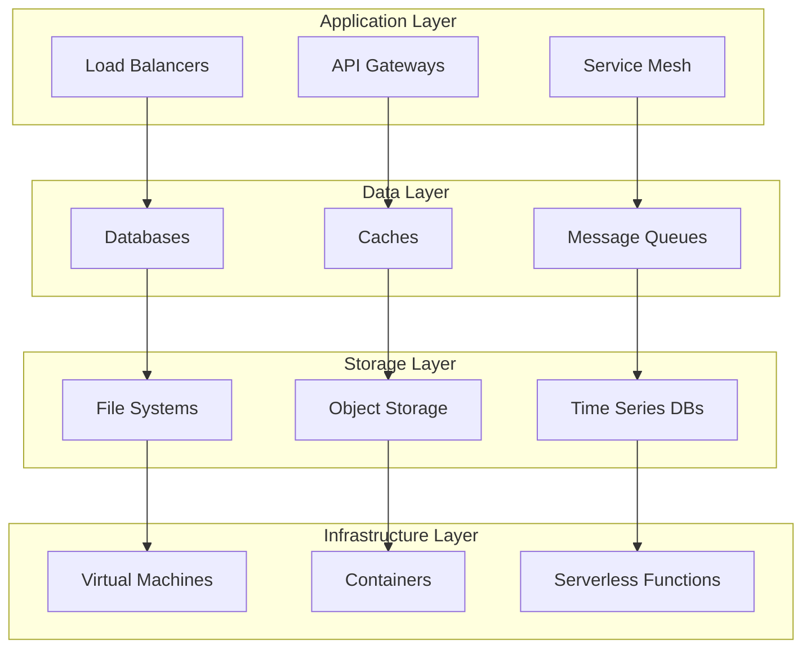
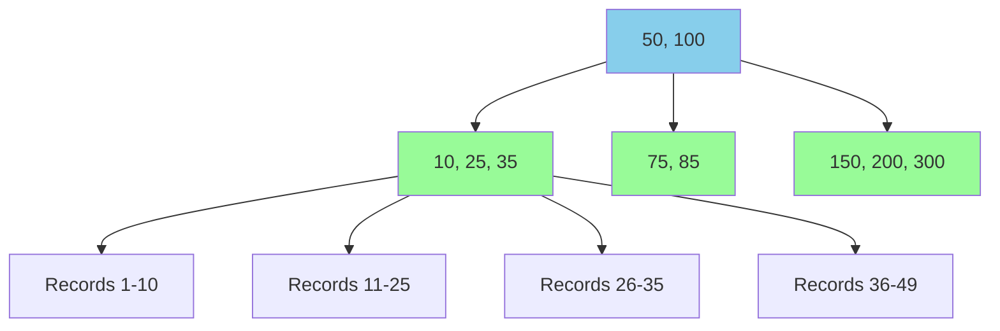
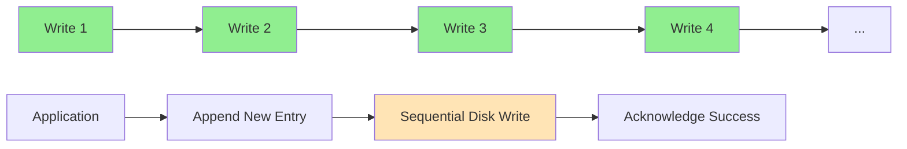
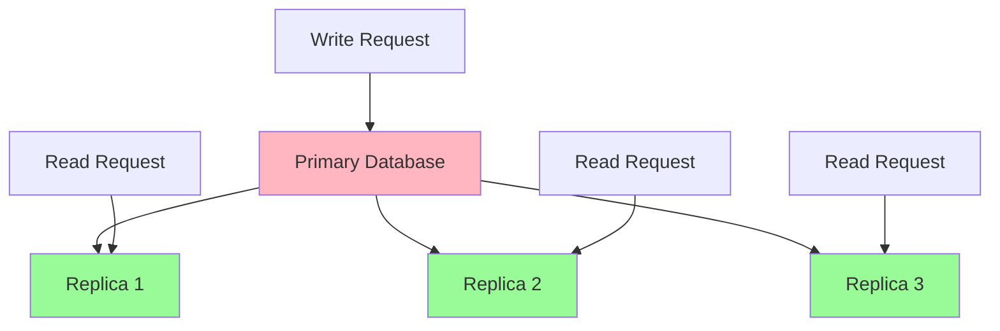
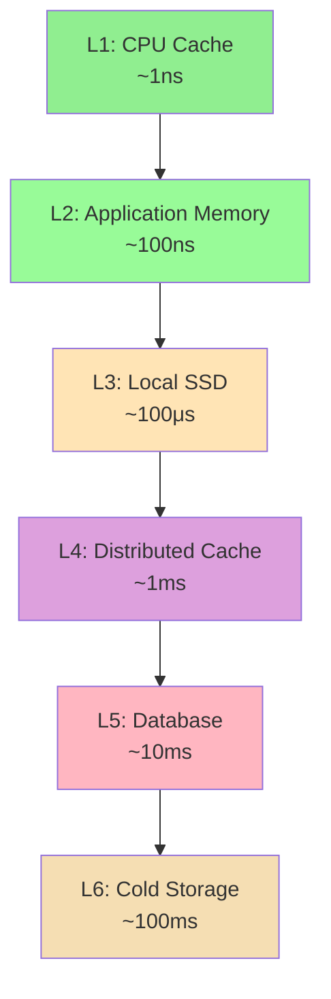
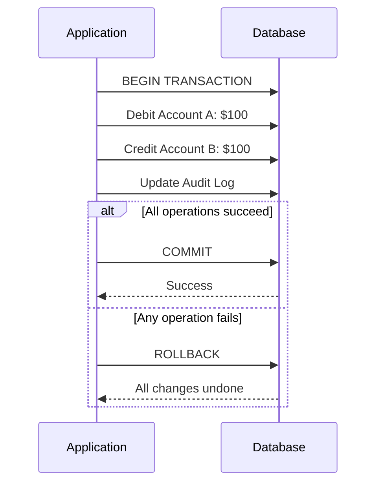
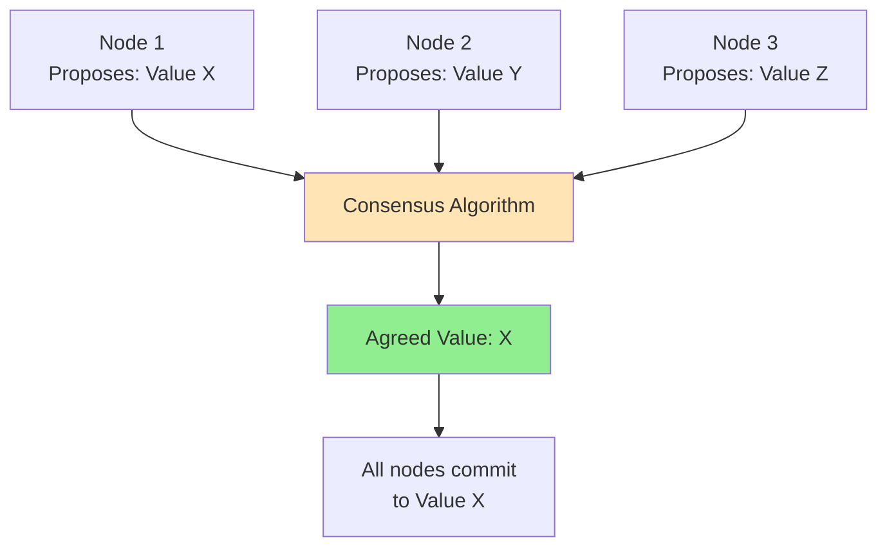
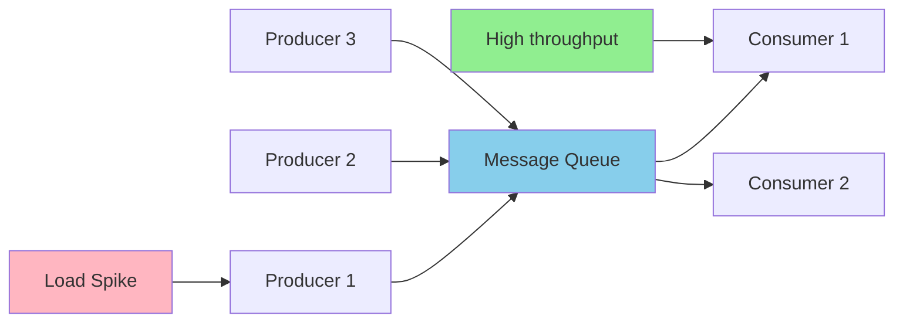

# Key Abstractions: The Building Blocks of Scale

## The Abstraction Pyramid

Just as programming languages provide abstractions over assembly code, distributed systems have fundamental abstractions that hide complexity while enabling scale. Understanding these building blocks is essential for system design mastery.



Each layer builds upon the abstractions below it, creating increasingly powerful capabilities while hiding underlying complexity.

---

## Core Data Abstractions

### 1. Hash Tables: The Universal Index

**Purpose**: Instant data lookup regardless of dataset size

Hash tables power everything from in-memory caches to distributed databases. They solve the fundamental problem: "How do I find my data fast?"

```mermaid
graph LR
    A["user:john"] --> B[hash("user:john")]
    B --> C[bucket 47]
    C --> D[{name: "John", email: "john@example.com"}]
    
    style B fill:#FFE4B5
    style C fill:#98FB98
```

**Production Applications**:
- **Redis/Memcached**: In-memory key-value stores
- **Database Indexes**: B-Tree indexes use hashing for efficient lookups
- **Consistent Hashing**: Distributing data across server clusters

**Trade-offs**:
- ✅ O(1) average lookup time
- ✅ Simple mental model
- ❌ No range queries
- ❌ Hash collisions require resolution strategies

---

### 2. Sorted Structures: Enabling Range Operations

**Purpose**: Efficient range queries and ordered data access

While hash tables excel at point lookups, sorted structures enable powerful range operations critical for databases and analytics.

**B-Trees: The Database Workhorse**


**Production Applications**:
- **Database Indexes**: PostgreSQL, MySQL use B-Trees for primary indexes
- **File Systems**: Modern file systems use B-Trees for directory structures  
- **LSM Trees**: Cassandra, RocksDB optimize for write-heavy workloads

**Trade-offs**:
- ✅ Efficient range queries
- ✅ Ordered iteration
- ✅ Balanced performance characteristics
- ❌ More complex than hash tables
- ❌ Write-heavy workloads can cause hotspots

---

### 3. Append-Only Logs: The Durability Foundation

**Purpose**: High-throughput writes with perfect durability

The append-only log is perhaps the most important abstraction in distributed systems. Every database, message queue, and replication system builds on this pattern.



**Why It Works**: Sequential writes to disk are **100x faster** than random writes. Append-only logs turn all writes into sequential operations.

**Production Applications**:
- **Write-Ahead Logs (WAL)**: PostgreSQL, MySQL ensure transaction durability
- **Apache Kafka**: Distributed log for streaming data
- **Git**: Version control as an append-only structure
- **Event Sourcing**: Store business events instead of current state

**Trade-offs**:
- ✅ Extremely fast writes
- ✅ Perfect durability guarantees
- ✅ Natural ordering and replication
- ❌ Reads require log replay
- ❌ Storage grows continuously (requires compaction)

---

## Distributed System Abstractions

### 4. Replication: The Availability Multiplier

**Purpose**: Eliminate single points of failure and improve read performance

Replication creates multiple copies of your data across different machines, providing both fault tolerance and performance benefits.



**Replication Strategies**:

| Strategy | Consistency | Availability | Performance | Use Case |
|----------|-------------|--------------|-------------|----------|
| Synchronous | Strong | Lower | Higher latency | Financial systems |
| Asynchronous | Eventual | Higher | Lower latency | Social media |
| Semi-Synchronous | Tunable | Balanced | Balanced | E-commerce |

**Production Applications**:
- **MySQL Primary-Replica**: Read scaling for web applications
- **Cassandra Multi-Master**: Global distributed databases
- **Redis Sentinel**: High availability caching

---

### 5. Partitioning/Sharding: The Scale Multiplier

**Purpose**: Distribute data across multiple machines to exceed single-machine limits

When your data doesn't fit on one machine, you must partition it. The key challenge is maintaining query efficiency across partitions.

```mermaid
graph TD
    A[User Data] --> B[Shard 1<br/>Users A-H]
    A --> C[Shard 2<br/>Users I-P]
    A --> D[Shard 3<br/>Users Q-Z]
    
    E[Router] --> B
    E --> C
    E --> D
    
    F[Query for User "Mike"] --> E
    E --> C
    
    style E fill:#FFE4B5
    style C fill:#90EE90
```

**Partitioning Strategies**:
- **Range-based**: Partition by value ranges (A-H, I-P, Q-Z)
- **Hash-based**: Use hash function to determine partition
- **Directory-based**: Lookup service maps keys to partitions

**Production Applications**:
- **MongoDB Sharding**: Horizontal scaling for document databases
- **Apache Cassandra**: Consistent hashing for even distribution
- **Instagram User Sharding**: Shard user data by user ID

**Trade-offs**:
- ✅ Scales beyond single machine limits
- ✅ Distributes load evenly (when done right)
- ❌ Cross-partition queries are expensive
- ❌ Rebalancing partitions is complex

---

### 6. Consistent Hashing: The Rebalancing Solution

**Purpose**: Minimize data movement when adding/removing servers

Traditional hash-based partitioning (`hash(key) % N`) requires rehashing almost all data when the number of servers changes. Consistent hashing solves this elegantly.

```mermaid
graph TD
    A[Hash Ring] --> B[Server A<br/>Position 100]
    A --> C[Server B<br/>Position 200]
    A --> D[Server C<br/>Position 300]
    
    E[Key "user123"<br/>Hash: 150] --> F[Assigned to Server B<br/>Next clockwise]
    
    G[Add Server D<br/>Position 250] --> H[Only keys 200-250<br/>move from B to D]
    
    style A fill:#87CEEB
    style F fill:#90EE90
    style H fill:#FFE4B5
```

**Production Applications**:
- **Amazon DynamoDB**: Distributes data across partitions
- **Apache Cassandra**: Maintains even distribution during scale events
- **Content Delivery Networks**: Route requests to geographically close servers

---

## Caching Abstractions

### 7. Multi-Level Caching: The Speed Hierarchy

**Purpose**: Keep frequently accessed data in progressively faster storage layers

Modern systems use multiple cache layers, each trading capacity for speed.



**Cache Strategies**:
- **Cache-Aside**: Application manages cache explicitly
- **Write-Through**: Write to cache and database simultaneously
- **Write-Behind**: Write to cache immediately, database asynchronously
- **Cache-First**: Check cache before database on every read

**Production Applications**:
- **CDNs**: Cache static content globally (CloudFlare, AWS CloudFront)
- **Application Caches**: Redis/Memcached for session data
- **Database Query Caches**: MySQL query result caching

---

## Consistency Abstractions

### 8. Transactions: The Consistency Guarantee

**Purpose**: Ensure multiple operations succeed or fail together

Transactions provide ACID guarantees that are essential for maintaining data integrity in complex operations.



**ACID Properties**:
- **Atomicity**: All operations in a transaction succeed or fail together
- **Consistency**: Database remains in a valid state
- **Isolation**: Concurrent transactions don't interfere
- **Durability**: Committed transactions survive system failures

**Production Applications**:
- **Banking Systems**: Transfer money between accounts
- **E-commerce**: Process orders (inventory, payment, shipping)
- **Social Media**: Update user profile and notification settings

---

### 9. Consensus Protocols: The Agreement Mechanism

**Purpose**: Enable multiple machines to agree on a single value despite failures

Consensus is required whenever distributed systems need to make coordinated decisions.



**Popular Consensus Algorithms**:
- **Raft**: Easier to understand, used in etcd, Consul
- **PBFT**: Byzantine fault tolerant, used in blockchains
- **Paxos**: Theoretical foundation, complex to implement

**Production Applications**:
- **Apache Kafka**: Leader election for partition replicas
- **Kubernetes**: etcd uses Raft for cluster state
- **Distributed Databases**: Ensure consistent replica updates

---

## Message-Passing Abstractions

### 10. Message Queues: The Decoupling Mechanism

**Purpose**: Enable asynchronous communication between system components

Message queues decouple producers from consumers, enabling systems to handle load spikes and improve fault tolerance.



**Queue Patterns**:
- **Point-to-Point**: One message, one consumer
- **Publish-Subscribe**: One message, many consumers  
- **Request-Reply**: Synchronous-style communication over async queues

**Production Applications**:
- **AWS SQS/SNS**: Serverless application integration
- **Apache Kafka**: High-throughput stream processing
- **RabbitMQ**: Reliable enterprise messaging

---

## Putting It All Together: The Mental Model

These abstractions are the **vocabulary of system design**. Every major system combines them in different ways:

**Netflix Streaming Architecture**:
- **Hash Tables**: User session management
- **CDN Caching**: Video content delivery
- **Consistent Hashing**: Distribute user data
- **Message Queues**: Recommendation engine processing
- **Replication**: Multi-region video storage

**Uber Ride-Sharing Architecture**:
- **Spatial Indexing**: Find nearby drivers
- **Event Sourcing**: Track ride state changes
- **Sharding**: Partition by geographic regions
- **Caching**: Frequent route calculations
- **Message Queues**: Real-time location updates

**Banking System Architecture**:
- **ACID Transactions**: Money transfers
- **Write-Ahead Logging**: Transaction durability
- **Synchronous Replication**: Strong consistency
- **Audit Logs**: Regulatory compliance
- **Consensus Protocols**: Multi-datacenter coordination

## The Next Level

Understanding these abstractions intellectually is just the beginning. The real mastery comes from:

1. **Knowing when to use each pattern**
2. **Understanding the trade-offs deeply**
3. **Combining patterns effectively**
4. **Adapting patterns to specific constraints**

In the next sections, we'll see these abstractions in action through practical examples and real-world case studies.