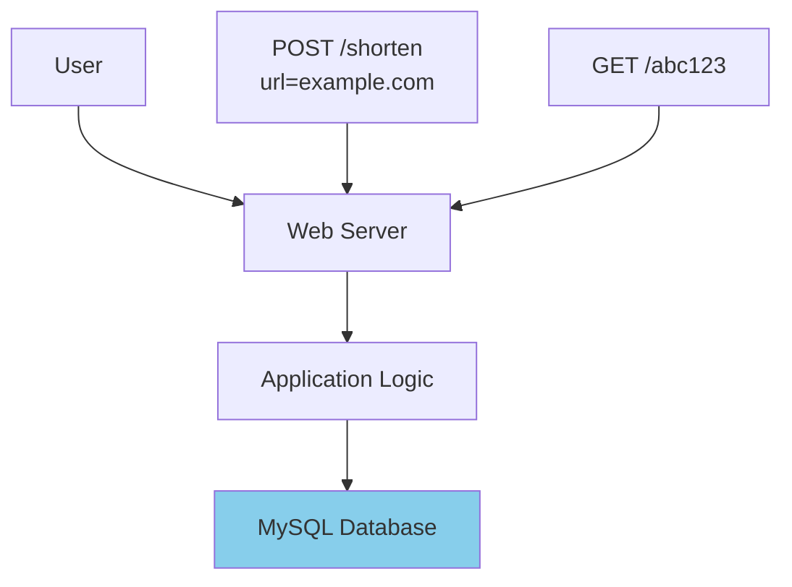
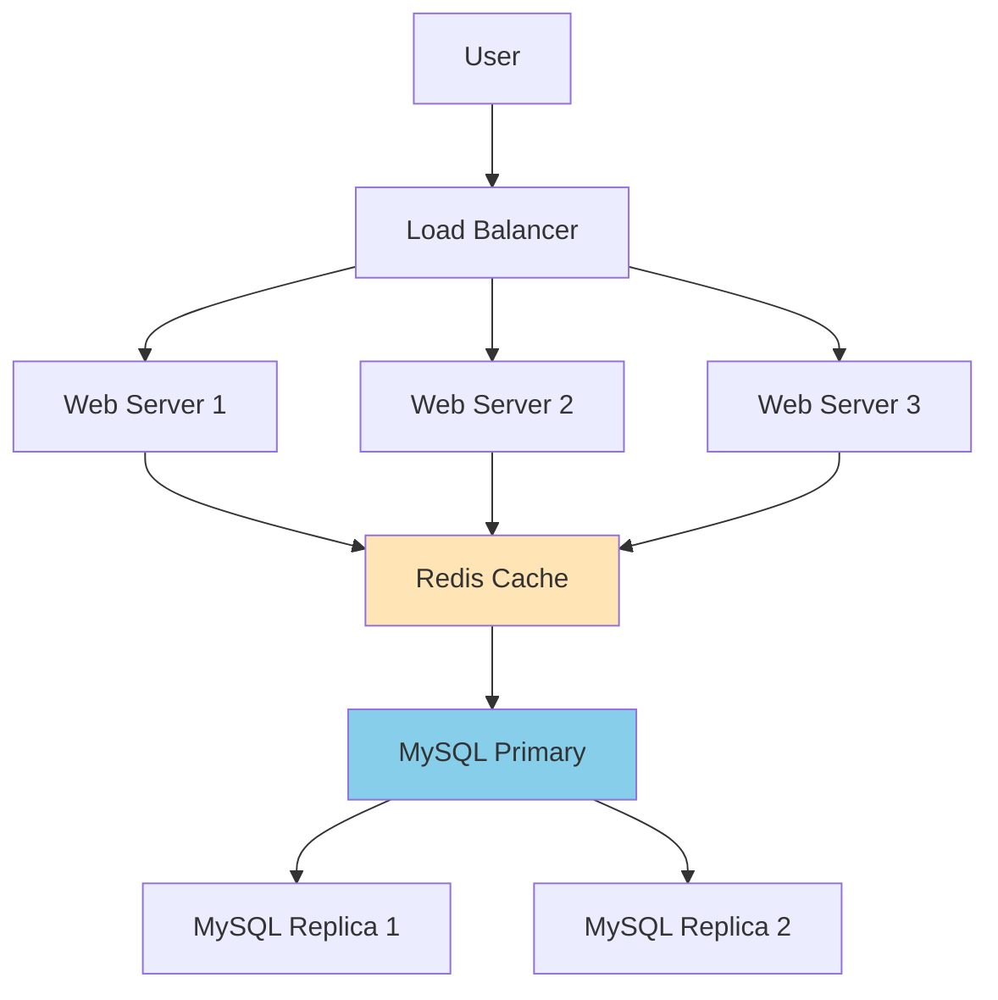
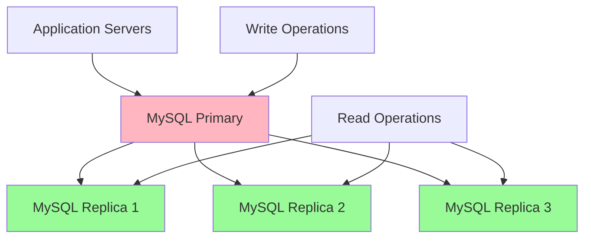
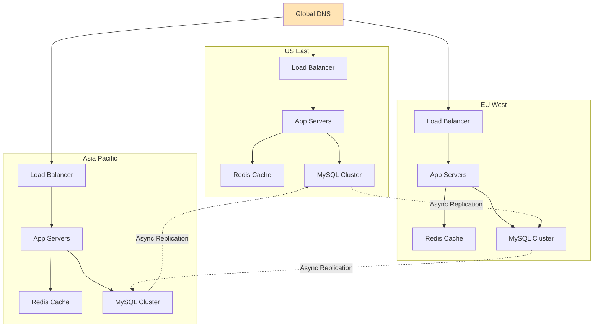
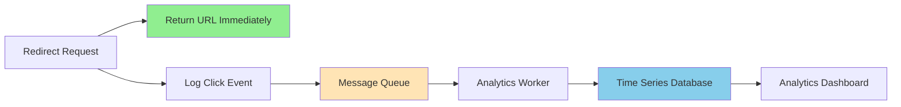
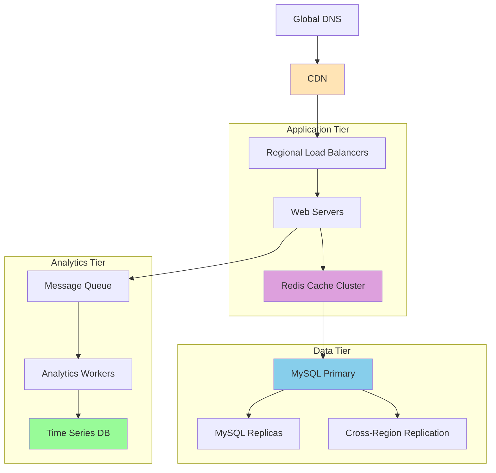

# Getting Started: Your First System Design

## The Scenario: Building a URL Shortener

Let's apply system design principles by building a URL shortener (like bit.ly or tinyurl.com). This is a perfect starting project because:

- **Simple to understand**: Convert long URLs to short ones
- **Real scalability challenges**: Billions of URLs, millions of users
- **Demonstrates all four pillars**: Scalability, Reliability, Availability, Consistency

## Phase 1: Minimal Viable System

### Understanding the Requirements

**Functional Requirements:**
- Shorten long URLs to 6-8 character codes
- Redirect short URLs to original URLs
- Custom aliases (optional)
- URL analytics (click counts)

**Non-Functional Requirements:**
- **Scale**: 100M URLs created per day, 10B redirects per day
- **Latency**: Redirects must be <100ms
- **Availability**: 99.9% uptime
- **Durability**: URLs never lost

### Back-of-the-Envelope Calculations

```
Storage Estimation:
- 100M new URLs/day
- 365 * 100M = 36.5B URLs/year  
- Each URL record ≈ 500 bytes
- Total storage: 36.5B * 500 bytes = 18.25 TB/year

Traffic Estimation:
- Reads: 10B redirects/day = 115K requests/second
- Writes: 100M URLs/day = 1.2K requests/second
- Read:Write ratio = 100:1 (very read-heavy)

Bandwidth:
- Read: 115K * 500 bytes = 57.5 MB/s
- Write: 1.2K * 500 bytes = 0.6 MB/s
```

**Key Insight**: This is a **read-heavy system** that needs to optimize for fast lookups.

### The Simple Solution



**Database Schema:**
```sql
CREATE TABLE urls (
    short_code VARCHAR(8) PRIMARY KEY,
    original_url TEXT NOT NULL,
    created_at TIMESTAMP DEFAULT NOW(),
    click_count INT DEFAULT 0
);

CREATE INDEX idx_created_at ON urls(created_at);
```

**Core Algorithm:**
```python
import hashlib
import base62

def shorten_url(original_url):
    # Generate hash of original URL
    hash_object = hashlib.md5(original_url.encode())
    hash_hex = hash_object.hexdigest()
    
    # Take first 8 characters and convert to base62
    short_code = base62.encode(int(hash_hex[:8], 16))[:6]
    
    return short_code

def redirect_url(short_code):
    # Database lookup
    result = db.query("SELECT original_url FROM urls WHERE short_code = ?", short_code)
    
    if result:
        # Increment click count asynchronously
        db.query("UPDATE urls SET click_count = click_count + 1 WHERE short_code = ?", short_code)
        return result.original_url
    else:
        return None
```

### Problems with the Simple Solution

This works for thousands of users, but fails at scale:

1. **Single point of failure**: One database, one web server
2. **Performance bottleneck**: All reads hit the database
3. **Storage limitations**: Single MySQL instance won't hold 18TB
4. **Hash collisions**: Multiple URLs might generate the same short code

## Phase 2: Adding Scalability

### Caching Layer

Add Redis to cache frequently accessed URLs:



**Improved Redirect Logic:**
```python
def redirect_url(short_code):
    # Check cache first
    cached_url = cache.get(f"url:{short_code}")
    if cached_url:
        # Increment counter asynchronously 
        async_increment_counter(short_code)
        return cached_url
    
    # Cache miss - check database
    result = db.query("SELECT original_url FROM urls WHERE short_code = ?", short_code)
    
    if result:
        # Cache for future requests (TTL = 24 hours)
        cache.set(f"url:{short_code}", result.original_url, ttl=86400)
        async_increment_counter(short_code)
        return result.original_url
    
    return None
```

**Performance Impact:**
- Cache hit ratio: ~80% (Pareto principle - 20% of URLs get 80% of traffic)
- Cached redirects: <5ms latency
- Database load: Reduced by 80%

### Solving Hash Collisions

Replace MD5 hashing with a **counter-based approach**:

```python
class URLShortener:
    def __init__(self):
        self.counter = self.get_global_counter()
    
    def shorten_url(self, original_url):
        # Get next available ID
        url_id = self.increment_counter()
        
        # Convert to base62 (6 characters = 62^6 = 56B possible URLs)
        short_code = base62.encode(url_id)
        
        # Store in database
        db.insert("INSERT INTO urls (id, short_code, original_url) VALUES (?, ?, ?)",
                  url_id, short_code, original_url)
        
        return short_code
    
    def increment_counter(self):
        # Use Redis for distributed counter
        return cache.incr("url_counter")
```

**Benefits:**
- **No collisions**: Each URL gets unique ID
- **Predictable**: Can estimate URL capacity
- **Distributed**: Multiple servers can generate URLs

## Phase 3: Adding Reliability

### Database Replication

Set up primary-replica replication for fault tolerance:



**Connection Management:**
```python
class DatabaseManager:
    def __init__(self):
        self.primary = connect_to_primary()
        self.replicas = [connect_to_replica(i) for i in range(3)]
        self.replica_index = 0
    
    def write(self, query, params):
        try:
            return self.primary.execute(query, params)
        except Exception as e:
            logger.error(f"Primary database error: {e}")
            raise DatabaseUnavailableError()
    
    def read(self, query, params):
        # Round-robin load balancing across replicas
        replica = self.replicas[self.replica_index % len(self.replicas)]
        self.replica_index += 1
        
        try:
            return replica.execute(query, params)
        except Exception:
            # Fallback to other replicas, then primary
            return self.read_with_fallback(query, params)
```

### Write-Ahead Logging

Ensure URL creation durability:

```python
def shorten_url_with_wal(original_url):
    # Write intention to WAL first
    wal_entry = {
        "operation": "CREATE_URL",
        "url": original_url,
        "timestamp": time.time(),
        "id": generate_request_id()
    }
    
    write_ahead_log.append(wal_entry)
    
    try:
        # Perform actual operation
        short_code = create_short_url(original_url)
        
        # Mark WAL entry as committed
        wal_entry["status"] = "COMMITTED"
        write_ahead_log.update(wal_entry)
        
        return short_code
        
    except Exception as e:
        # Mark as failed for later retry
        wal_entry["status"] = "FAILED"
        wal_entry["error"] = str(e)
        write_ahead_log.update(wal_entry)
        
        raise e
```

## Phase 4: Geographic Distribution

### Multi-Region Deployment

Deploy across multiple regions for global performance:



**Geographic Routing Strategy:**
- **URL Creation**: Route to nearest region
- **URL Redirection**: Use CDN for global caching
- **Data Synchronization**: Eventual consistency across regions

### CDN Integration

Cache popular URLs at edge locations:

```python
class CDNManager:
    def __init__(self):
        self.cdn_client = CloudFlareCDN()
    
    def cache_popular_url(self, short_code, original_url):
        # Cache redirect response at CDN edge
        redirect_response = {
            "status": 301,
            "location": original_url,
            "cache_control": "public, max-age=86400"
        }
        
        self.cdn_client.cache_response(
            key=f"/redirect/{short_code}",
            response=redirect_response,
            ttl=86400  # 24 hours
        )
    
    def invalidate_url(self, short_code):
        # Remove from CDN when URL is deleted/updated
        self.cdn_client.purge(f"/redirect/{short_code}")
```

## Phase 5: Advanced Optimizations

### Bloom Filters for Non-Existent URLs

Reduce database load for invalid short codes:

```python
class URLChecker:
    def __init__(self):
        self.bloom_filter = BloomFilter(capacity=10_000_000, error_rate=0.1)
        self.populate_bloom_filter()
    
    def populate_bloom_filter(self):
        # Add all existing short codes to bloom filter
        for short_code in db.query("SELECT short_code FROM urls"):
            self.bloom_filter.add(short_code)
    
    def url_might_exist(self, short_code):
        # Bloom filter: no false negatives, possible false positives
        return short_code in self.bloom_filter
    
    def redirect_url(self, short_code):
        # Quick check: if bloom filter says no, definitely doesn't exist
        if not self.url_might_exist(short_code):
            return None
        
        # Proceed with normal cache/database lookup
        return self.normal_redirect_flow(short_code)
```

**Impact**: Eliminates ~90% of database queries for non-existent URLs.

### Analytics Pipeline

Process click events asynchronously:



```python
def redirect_url_with_analytics(short_code):
    # Get URL from cache/database
    original_url = get_original_url(short_code)
    
    if original_url:
        # Log analytics event asynchronously (don't block redirect)
        analytics_event = {
            "short_code": short_code,
            "timestamp": time.time(),
            "user_agent": request.headers.get("User-Agent"),
            "ip_address": request.remote_addr,
            "referrer": request.headers.get("Referer")
        }
        
        # Non-blocking queue publish
        message_queue.publish("click_events", analytics_event)
        
        return original_url
    
    return None
```

## Final Architecture



## Key Lessons Learned

### Performance Optimizations
1. **Caching**: 80% of requests served from cache
2. **Read Replicas**: Distribute read load
3. **CDN**: Global redirect performance
4. **Bloom Filters**: Eliminate unnecessary database queries

### Reliability Patterns
1. **Replication**: No single points of failure
2. **WAL**: Ensure data durability
3. **Circuit Breakers**: Prevent cascade failures
4. **Graceful Degradation**: System works even when components fail

### Scalability Techniques  
1. **Horizontal Scaling**: Add more servers as needed
2. **Database Sharding**: Partition data across multiple databases
3. **Async Processing**: Decouple analytics from core functionality
4. **Geographic Distribution**: Serve users from nearby regions

### Production Considerations
1. **Monitoring**: Track performance metrics and error rates
2. **Capacity Planning**: Predict and prepare for growth
3. **Security**: Rate limiting, input validation, DDoS protection
4. **Cost Optimization**: Right-size infrastructure for actual usage

This URL shortener demonstrates how to apply system design principles systematically, growing from a simple single-server application to a globally distributed system that can handle billions of requests per day.