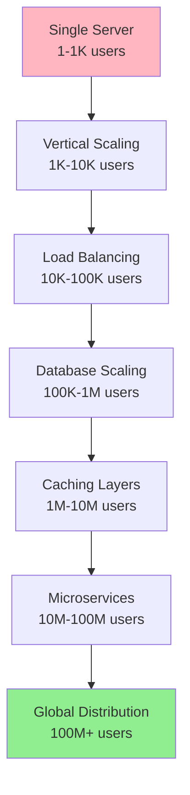
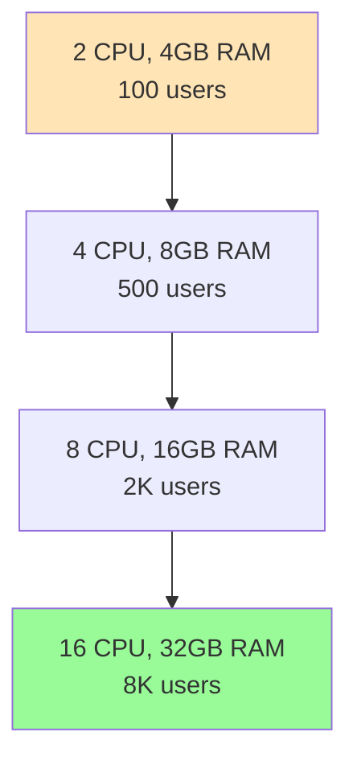
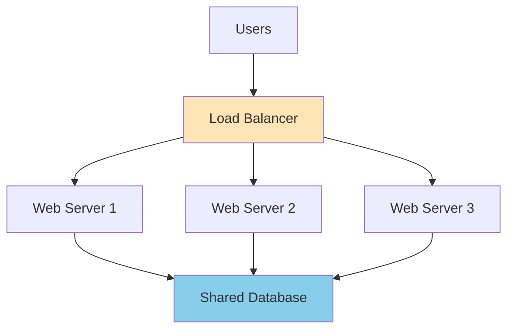
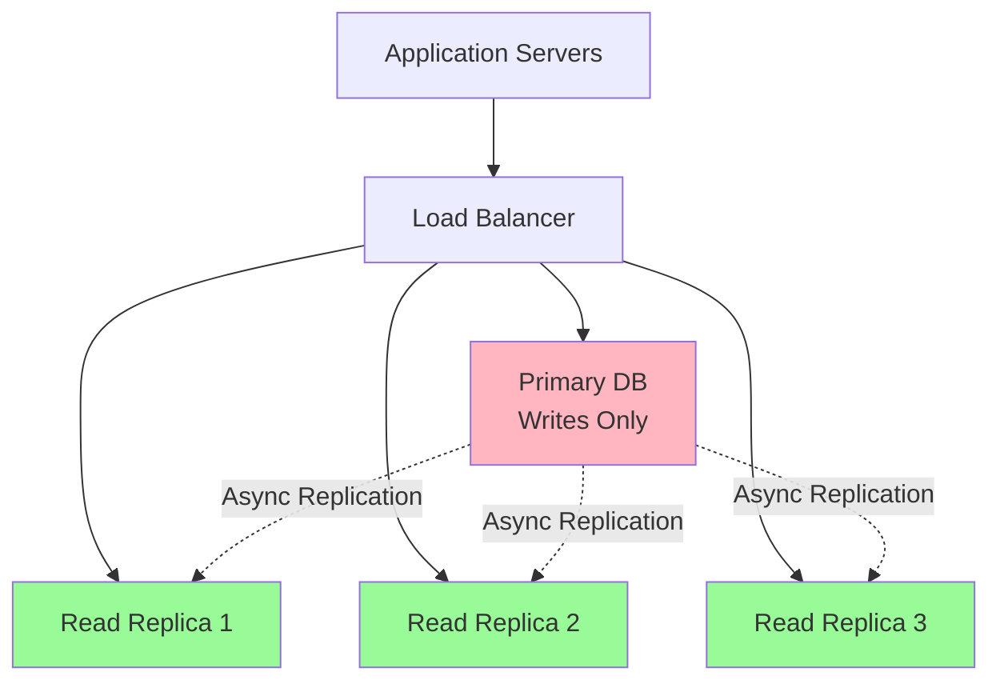
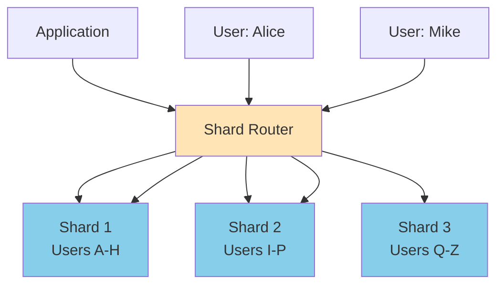
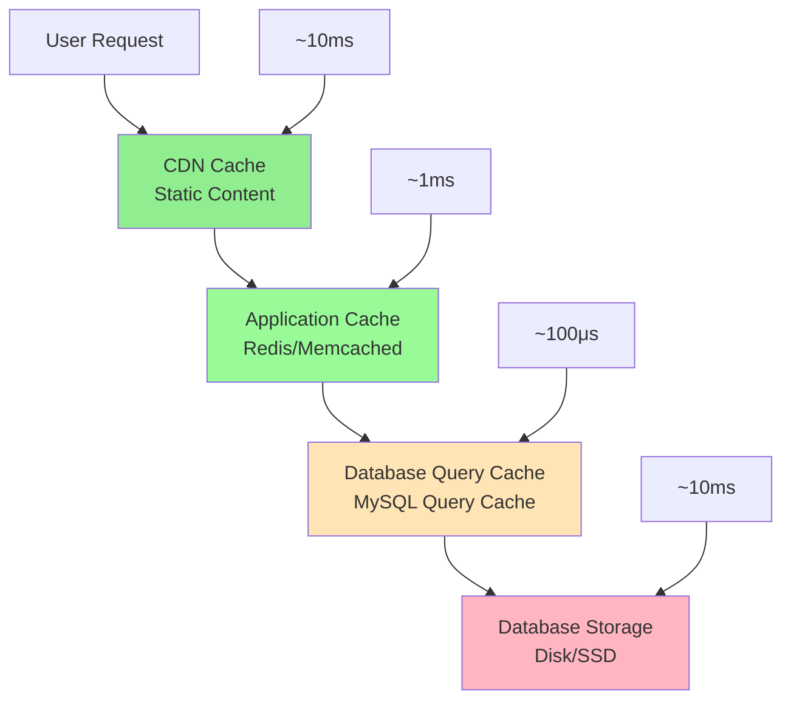
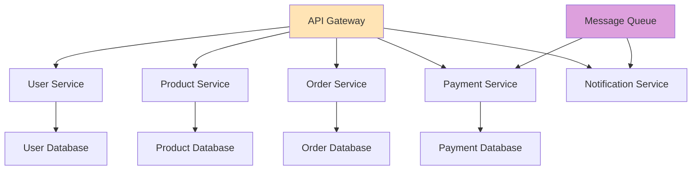
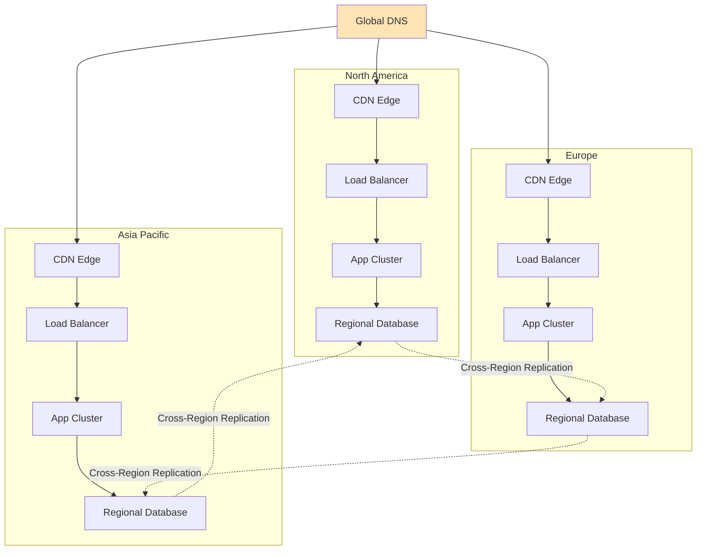

# Scaling Patterns: The Playbook for Growth

## The Scaling Journey

Every successful system follows a predictable scaling path. Understanding these patterns helps you prepare for growth stages and avoid common pitfalls. Here's the roadmap from startup to global scale.



## Stage 1: Vertical Scaling (Scale Up)

**When**: 1K - 10K users  
**Problem**: Single server running out of capacity  
**Solution**: Upgrade hardware

### The Vertical Scaling Pattern



**Implementation Strategy:**
```yaml
# Infrastructure as Code (Terraform)
resource "aws_instance" "web_server" {
  instance_type = var.instance_size
  
  # Scale progression
  # t3.micro  → t3.small → t3.medium → t3.large → t3.xlarge
}

# Database scaling
resource "aws_rds_instance" "database" {
  instance_class = var.db_instance_size
  
  # Scale progression  
  # db.t3.micro → db.t3.small → db.m5.large → db.m5.xlarge
}
```

**Advantages:**
- ✅ Simple implementation
- ✅ No architecture changes
- ✅ Immediate performance improvement

**Limitations:**
- ❌ Hardware limits (can't scale infinitely)
- ❌ Single point of failure
- ❌ Expensive at higher tiers
- ❌ Downtime during upgrades

**Production Tips:**
- Monitor CPU, memory, and disk I/O to predict when to scale
- Use automated scaling tools (AWS Auto Scaling)
- Plan for eventual horizontal scaling limits

---

## Stage 2: Horizontal Scaling (Scale Out)

**When**: 10K - 100K users  
**Problem**: Single server hits physical limits  
**Solution**: Add more servers with load balancing

### Load Balancing Patterns



**Load Balancing Algorithms:**

| Algorithm | Use Case | Trade-offs |
|-----------|----------|------------|
| **Round Robin** | Equal capacity servers | Simple, but ignores server load |
| **Least Connections** | Varying request complexity | Better distribution, more overhead |
| **Weighted** | Mixed server capacities | Flexible, requires manual tuning |
| **IP Hash** | Session affinity needed | Consistent routing, uneven distribution |

**Implementation Example:**
```nginx
# Nginx Load Balancer Configuration
upstream backend {
    least_conn;  # Use least connections algorithm
    
    server web1.example.com weight=3;
    server web2.example.com weight=2;
    server web3.example.com weight=1;
    
    # Health checks
    server web4.example.com backup;
}

server {
    listen 80;
    
    location / {
        proxy_pass http://backend;
        proxy_set_header Host $host;
        proxy_set_header X-Real-IP $remote_addr;
        
        # Connection pooling
        proxy_http_version 1.1;
        proxy_set_header Connection "";
    }
}
```

**Session Management Patterns:**

1. **Sticky Sessions**: Route users to same server
```yaml
# AWS ALB Target Group
target_group:
  stickiness:
    enabled: true
    duration_seconds: 86400
```

2. **Stateless Design**: Store session data externally
```python
# Redis session store
import redis
session_store = redis.Redis(host='session-cluster.abc123.cache.amazonaws.com')

def get_user_session(session_id):
    return session_store.get(f"session:{session_id}")

def set_user_session(session_id, data):
    session_store.setex(f"session:{session_id}", 3600, data)
```

---

## Stage 3: Database Scaling

**When**: 100K - 1M users  
**Problem**: Database becomes the bottleneck  
**Solution**: Database replication and read scaling

### Read Replica Pattern



**Database Connection Management:**
```python
class DatabaseManager:
    def __init__(self):
        self.primary = connect_to_primary()
        self.replicas = [
            connect_to_replica('read-replica-1'),
            connect_to_replica('read-replica-2'),
            connect_to_replica('read-replica-3')
        ]
        self.replica_index = 0
    
    def execute_write(self, query, params):
        """All writes go to primary"""
        return self.primary.execute(query, params)
    
    def execute_read(self, query, params):
        """Distribute reads across replicas"""
        replica = self.replicas[self.replica_index % len(self.replicas)]
        self.replica_index += 1
        
        try:
            return replica.execute(query, params)
        except ConnectionError:
            # Fallback to primary if replica fails
            return self.primary.execute(query, params)
```

### Database Sharding Pattern

When read replicas aren't enough, partition data across multiple primary databases:



**Sharding Strategies:**

1. **Range-Based Sharding:**
```python
def get_shard_for_user(user_id):
    first_letter = user_id[0].upper()
    
    if 'A' <= first_letter <= 'H':
        return 'shard_1'
    elif 'I' <= first_letter <= 'P':
        return 'shard_2'
    else:
        return 'shard_3'
```

2. **Hash-Based Sharding:**
```python
import hashlib

def get_shard_for_user(user_id):
    hash_value = int(hashlib.md5(user_id.encode()).hexdigest(), 16)
    shard_number = hash_value % NUMBER_OF_SHARDS
    return f'shard_{shard_number}'
```

3. **Directory-Based Sharding:**
```python
class ShardDirectory:
    def __init__(self):
        self.directory = redis.Redis(host='shard-directory')
    
    def get_shard_for_user(self, user_id):
        shard = self.directory.get(f"user_shard:{user_id}")
        
        if not shard:
            # Assign to least loaded shard
            shard = self.assign_user_to_shard(user_id)
            
        return shard.decode()
```

---

## Stage 4: Caching Layers

**When**: 1M - 10M users  
**Problem**: Database queries still too slow  
**Solution**: Multi-layer caching strategy

### The Caching Hierarchy



### Application-Level Caching

**Cache-Aside Pattern:**
```python
class UserService:
    def __init__(self):
        self.cache = redis.Redis()
        self.db = DatabaseConnection()
    
    def get_user(self, user_id):
        # Check cache first
        cached_user = self.cache.get(f"user:{user_id}")
        if cached_user:
            return json.loads(cached_user)
        
        # Cache miss - query database
        user = self.db.query("SELECT * FROM users WHERE id = ?", user_id)
        
        if user:
            # Cache for future requests
            self.cache.setex(
                f"user:{user_id}", 
                3600,  # 1 hour TTL
                json.dumps(user)
            )
        
        return user
    
    def update_user(self, user_id, data):
        # Update database
        self.db.execute("UPDATE users SET ... WHERE id = ?", user_id, data)
        
        # Invalidate cache
        self.cache.delete(f"user:{user_id}")
```

**Write-Through Pattern:**
```python
def update_user_write_through(self, user_id, data):
    # Update database first
    self.db.execute("UPDATE users SET ... WHERE id = ?", user_id, data)
    
    # Update cache immediately
    updated_user = self.db.query("SELECT * FROM users WHERE id = ?", user_id)
    self.cache.setex(f"user:{user_id}", 3600, json.dumps(updated_user))
```

**Write-Behind Pattern:**
```python
def update_user_write_behind(self, user_id, data):
    # Update cache immediately
    self.cache.setex(f"user:{user_id}", 3600, json.dumps(data))
    
    # Queue database update asynchronously
    self.write_queue.put({
        'operation': 'UPDATE_USER',
        'user_id': user_id,
        'data': data,
        'timestamp': time.time()
    })
```

### CDN Integration

Distribute static content globally:

```python
class CDNManager:
    def __init__(self):
        self.cdn = CloudFrontCDN()
    
    def upload_asset(self, file_path, content_type):
        # Upload to S3
        s3_key = f"assets/{uuid4()}/{os.path.basename(file_path)}"
        s3.upload_file(file_path, 'my-bucket', s3_key)
        
        # Configure CDN distribution
        cdn_url = self.cdn.create_distribution(
            origin=f"my-bucket.s3.amazonaws.com/{s3_key}",
            cache_behaviors={
                'images/*': {'ttl': 86400},  # 24 hours
                'js/*': {'ttl': 604800},     # 1 week
                'css/*': {'ttl': 604800}     # 1 week
            }
        )
        
        return cdn_url
```

---

## Stage 5: Microservices Architecture

**When**: 10M - 100M users  
**Problem**: Monolithic application becomes unwieldy  
**Solution**: Break into focused, independent services

### Microservices Decomposition



**Service Decomposition Principles:**

1. **Domain-Driven Design:**
```python
# User Service - Bounded Context
class UserService:
    def create_user(self, user_data): pass
    def authenticate_user(self, credentials): pass
    def update_profile(self, user_id, data): pass

# Order Service - Bounded Context  
class OrderService:
    def create_order(self, user_id, items): pass
    def update_order_status(self, order_id, status): pass
    def get_order_history(self, user_id): pass
```

2. **Database per Service:**
```yaml
# Docker Compose for microservices
services:
  user-service:
    image: user-service:latest
    environment:
      DATABASE_URL: postgresql://user_db:5432/users
  
  order-service:
    image: order-service:latest
    environment:
      DATABASE_URL: postgresql://order_db:5432/orders
      
  product-service:
    image: product-service:latest
    environment:
      DATABASE_URL: mongodb://product_db:27017/products
```

**Inter-Service Communication Patterns:**

1. **Synchronous (HTTP/REST):**
```python
async def get_user_orders(user_id):
    # Call user service to validate user
    user = await http_client.get(f"http://user-service/users/{user_id}")
    
    if not user:
        raise UserNotFoundError()
    
    # Call order service to get orders
    orders = await http_client.get(f"http://order-service/users/{user_id}/orders")
    
    return orders
```

2. **Asynchronous (Message Queues):**
```python
# Publisher (Order Service)
def create_order(order_data):
    order = save_order_to_database(order_data)
    
    # Publish event
    message_queue.publish('order.created', {
        'order_id': order.id,
        'user_id': order.user_id,
        'total_amount': order.total,
        'timestamp': order.created_at
    })

# Subscriber (Notification Service)
@message_queue.subscribe('order.created')
def send_order_confirmation(event_data):
    send_email(
        to=get_user_email(event_data['user_id']),
        subject="Order Confirmation",
        template="order_created",
        data=event_data
    )
```

**API Gateway Pattern:**
```python
class APIGateway:
    def __init__(self):
        self.services = {
            'users': 'http://user-service:8001',
            'orders': 'http://order-service:8002',
            'products': 'http://product-service:8003'
        }
        self.rate_limiter = RateLimiter()
        self.auth = AuthenticationService()
    
    async def route_request(self, request):
        # Authentication
        user = await self.auth.authenticate(request.headers.get('Authorization'))
        
        # Rate limiting
        if not self.rate_limiter.allow_request(user.id):
            raise RateLimitExceededError()
        
        # Route to appropriate service
        service_name = self.extract_service_name(request.path)
        service_url = self.services[service_name]
        
        # Forward request
        response = await http_client.request(
            method=request.method,
            url=f"{service_url}{request.path}",
            headers=request.headers,
            data=request.body
        )
        
        return response
```

---

## Stage 6: Global Distribution

**When**: 100M+ users  
**Problem**: Geographic latency and regulatory requirements  
**Solution**: Multi-region deployment with data locality

### Global Architecture Pattern



**Geographic Data Partitioning:**
```python
class GlobalDataRouter:
    def __init__(self):
        self.regions = {
            'us': ['us-east-1', 'us-west-2'],
            'eu': ['eu-west-1', 'eu-central-1'],
            'asia': ['ap-southeast-1', 'ap-northeast-1']
        }
    
    def get_primary_region(self, user_location):
        if user_location in ['US', 'CA', 'MX']:
            return 'us-east-1'
        elif user_location in ['DE', 'FR', 'UK', 'IT']:
            return 'eu-west-1'
        elif user_location in ['JP', 'SG', 'AU', 'IN']:
            return 'ap-southeast-1'
        else:
            return 'us-east-1'  # Default
    
    def route_user_data(self, user_id, user_location):
        primary_region = self.get_primary_region(user_location)
        
        return {
            'primary_database': f"userdb-{primary_region}",
            'cache_cluster': f"cache-{primary_region}",
            'cdn_origin': f"https://{primary_region}.example.com"
        }
```

---

## Performance Monitoring and Optimization

### Key Metrics to Track

```python
class SystemMetrics:
    def __init__(self):
        self.metrics = MetricsCollector()
    
    def track_request_metrics(self, request, response, duration):
        # Response time percentiles
        self.metrics.histogram('request_duration_ms', duration)
        
        # Error rates
        if response.status_code >= 500:
            self.metrics.increment('errors.server_error')
        elif response.status_code >= 400:
            self.metrics.increment('errors.client_error')
        else:
            self.metrics.increment('requests.success')
        
        # Throughput
        self.metrics.increment('requests.total')
        
        # By endpoint
        self.metrics.increment(f'requests.{request.endpoint}')
```

### Capacity Planning

```python
def calculate_capacity_requirements(target_users, growth_rate):
    """
    Calculate infrastructure needs based on growth projections
    """
    # Current metrics
    current_rps = 1000  # requests per second
    current_users = 100000
    
    # Project future load
    projected_users = target_users * (1 + growth_rate)
    projected_rps = (projected_users / current_users) * current_rps
    
    # Infrastructure requirements
    servers_needed = math.ceil(projected_rps / 500)  # 500 RPS per server
    database_connections = projected_rps * 2  # 2 DB queries per request
    cache_memory = projected_users * 1024  # 1KB per user in cache
    
    return {
        'web_servers': servers_needed,
        'database_connections': database_connections,
        'cache_memory_gb': cache_memory / (1024 ** 3),
        'estimated_cost_monthly': calculate_infrastructure_cost(servers_needed)
    }
```

## Choosing the Right Pattern

| User Scale | Primary Bottleneck | Recommended Pattern | Implementation Complexity |
|------------|-------------------|-------------------|-------------------------|
| 1K - 10K | Single server capacity | Vertical scaling | Low |
| 10K - 100K | Server resources | Horizontal scaling + Load balancing | Medium |
| 100K - 1M | Database performance | Read replicas + Caching | Medium |
| 1M - 10M | Database capacity | Sharding + Advanced caching | High |
| 10M - 100M | Application complexity | Microservices | Very High |
| 100M+ | Geographic latency | Global distribution | Expert |

**Key Decision Framework:**

1. **Measure first**: Don't optimize prematurely
2. **Identify bottlenecks**: Use monitoring to find the limiting factor
3. **Start simple**: Choose the simplest solution that solves the problem
4. **Plan for next stage**: Design with future scaling in mind
5. **Monitor impact**: Measure the results of each scaling change

These patterns form the foundation of modern web architecture. Master them progressively, and you'll be prepared to scale any system from startup to global enterprise.