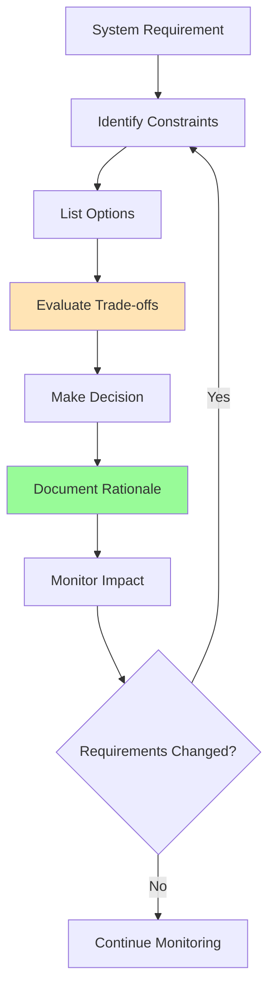
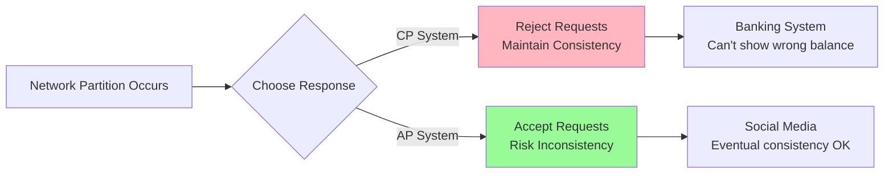
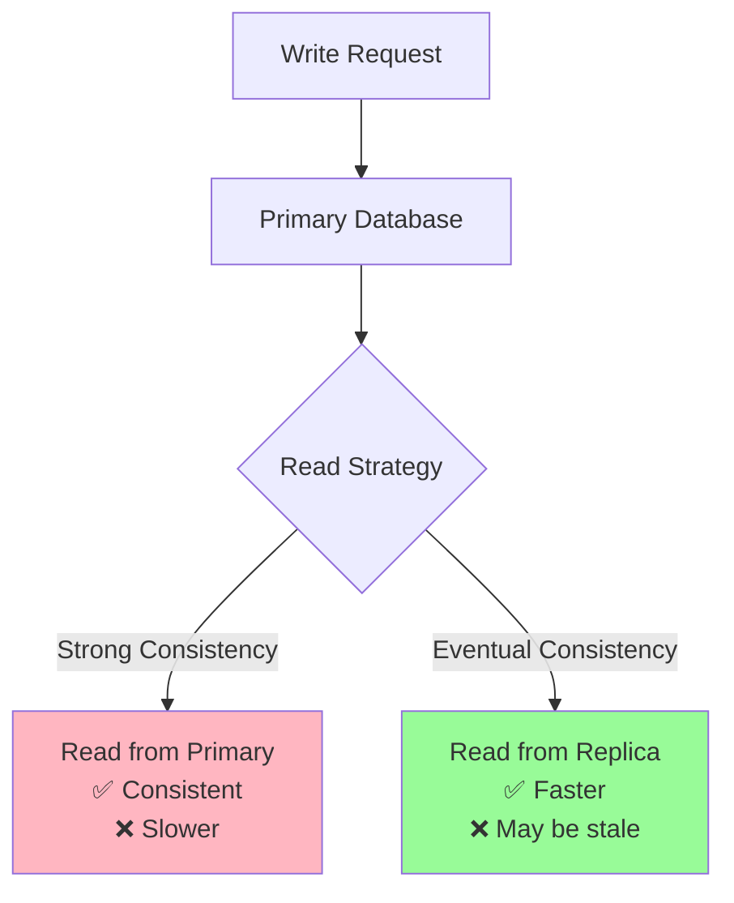
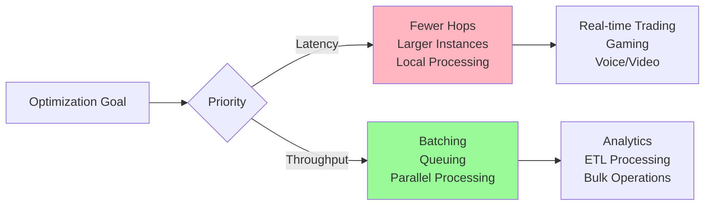
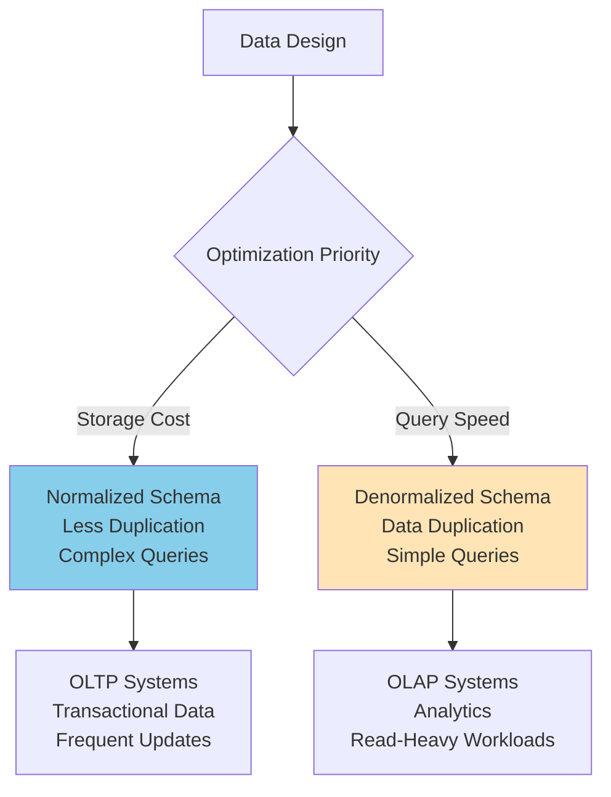
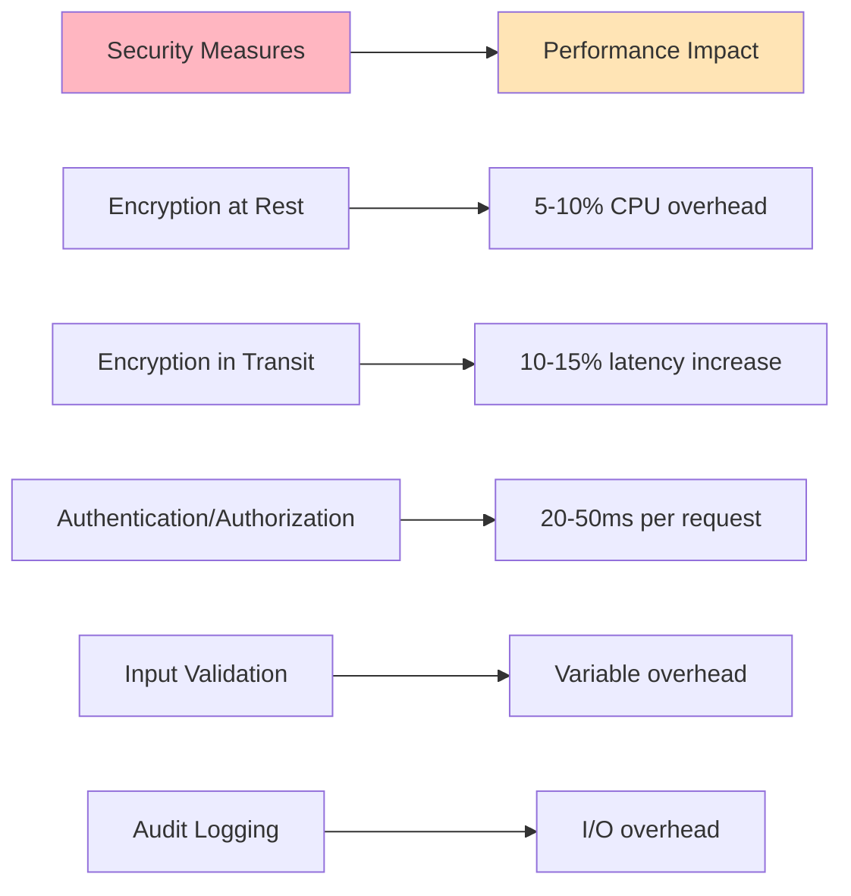

# Trade-offs and Decisions: The Art of System Design

## The Decision Framework

System design is fundamentally about making informed trade-offs. Every architectural decision involves sacrificing something to gain something else. The key is making these trade-offs **consciously** and **intentionally** based on your specific requirements.



## The Fundamental Trade-offs

### 1. Consistency vs. Availability (CAP Theorem)

**The Choice**: When network partitions occur, choose either consistency or availability.



**Production Examples:**

**CP (Consistency + Partition Tolerance):**
```python
class BankingTransactionService:
    def transfer_money(self, from_account, to_account, amount):
        # Use distributed consensus to ensure all replicas agree
        with distributed_transaction():
            if not self.consensus_manager.has_majority():
                raise ServiceUnavailableError("Cannot ensure consistency")
            
            # All operations must succeed atomically across all nodes
            from_balance = self.get_account_balance(from_account)
            if from_balance < amount:
                raise InsufficientFundsError()
            
            # This will block until majority of nodes confirm
            self.debit_account(from_account, amount)
            self.credit_account(to_account, amount)
```

**AP (Availability + Partition Tolerance):**
```python
class SocialMediaFeedService:
    def post_status(self, user_id, content):
        # Accept write immediately, propagate eventually
        post_id = self.generate_post_id()
        
        # Write to local replica immediately
        self.local_replica.create_post(post_id, user_id, content)
        
        # Queue for eventual propagation to other replicas
        self.replication_queue.enqueue({
            'operation': 'CREATE_POST',
            'post_id': post_id,
            'user_id': user_id,
            'content': content,
            'timestamp': time.time()
        })
        
        return post_id  # Return immediately, don't wait for replication
```

**Decision Framework:**
- **Choose CP when**: Data corruption is unacceptable (financial, medical)
- **Choose AP when**: User experience matters more than immediate consistency (social, content)

---

### 2. Performance vs. Consistency

**The Choice**: How quickly do you need to read your own writes?



**Read-After-Write Consistency Patterns:**

1. **Read Your Own Writes:**
```python
class UserProfileService:
    def __init__(self):
        self.primary_db = PrimaryDatabase()
        self.replica_db = ReplicaDatabase()
        self.user_sessions = UserSessionStore()
    
    def update_profile(self, user_id, data):
        # Write to primary
        self.primary_db.update_user(user_id, data)
        
        # Mark this user as having recent writes
        self.user_sessions.mark_recent_write(user_id, ttl=60)
    
    def get_profile(self, user_id):
        # If user has recent writes, read from primary
        if self.user_sessions.has_recent_write(user_id):
            return self.primary_db.get_user(user_id)
        
        # Otherwise, read from faster replica
        return self.replica_db.get_user(user_id)
```

2. **Monotonic Read Consistency:**
```python
class OrderHistoryService:
    def get_user_orders(self, user_id, session_id):
        # Ensure user always sees at least as recent data as previous reads
        last_read_timestamp = self.get_session_timestamp(session_id)
        
        # Find replica that has data at least as recent as last read
        for replica in self.replicas:
            if replica.get_lag() <= last_read_timestamp:
                orders = replica.get_orders(user_id)
                self.update_session_timestamp(session_id, replica.get_timestamp())
                return orders
        
        # Fallback to primary if no replica is recent enough
        return self.primary_db.get_orders(user_id)
```

---

### 3. Latency vs. Throughput

**The Choice**: Optimize for individual request speed or overall system capacity.



**Latency-Optimized Architecture:**
```python
class RealTimeGameService:
    def __init__(self):
        # Keep everything in memory for speed
        self.game_state = InMemoryGameState()
        self.connection_pool = PreWarmedConnectionPool(size=1000)
    
    def process_player_action(self, game_id, player_id, action):
        # Process immediately, no queuing
        start_time = time.time()
        
        # Single-hop processing
        result = self.game_state.apply_action(game_id, player_id, action)
        
        # Broadcast to other players immediately
        self.broadcast_to_players(game_id, result)
        
        latency = (time.time() - start_time) * 1000
        self.metrics.record_latency('player_action', latency)
        
        return result
```

**Throughput-Optimized Architecture:**
```python
class AnalyticsProcessingService:
    def __init__(self):
        self.batch_processor = BatchProcessor(batch_size=1000)
        self.processing_queue = ProcessingQueue()
    
    def process_event(self, event_data):
        # Add to batch queue, don't process immediately
        self.processing_queue.enqueue(event_data)
        
        # Process in large batches for efficiency
        if self.processing_queue.size() >= 1000:
            batch = self.processing_queue.dequeue_batch(1000)
            self.batch_processor.process_async(batch)
    
    def process_batch(self, events):
        # Process entire batch in single database transaction
        with self.db.transaction():
            for event in events:
                self.aggregate_metrics(event)
                self.update_reports(event)
            
        self.metrics.record_throughput('events_processed', len(events))
```

---

### 4. Storage Cost vs. Query Performance

**The Choice**: Normalize data to save space or denormalize for speed.



**Normalized Design (Storage Optimized):**
```sql
-- Normalized schema - minimal storage
CREATE TABLE users (
    id INT PRIMARY KEY,
    name VARCHAR(100),
    email VARCHAR(100)
);

CREATE TABLE orders (
    id INT PRIMARY KEY,
    user_id INT REFERENCES users(id),
    order_date TIMESTAMP,
    total_amount DECIMAL(10,2)
);

CREATE TABLE order_items (
    id INT PRIMARY KEY,
    order_id INT REFERENCES orders(id),
    product_id INT,
    quantity INT,
    price DECIMAL(10,2)
);

-- Complex query required to get order details
SELECT u.name, u.email, o.order_date, o.total_amount,
       oi.product_id, oi.quantity, oi.price
FROM users u
JOIN orders o ON u.id = o.user_id
JOIN order_items oi ON o.id = oi.order_id
WHERE u.id = ?;
```

**Denormalized Design (Performance Optimized):**
```sql
-- Denormalized schema - fast queries but more storage
CREATE TABLE order_details (
    order_id INT,
    user_id INT,
    user_name VARCHAR(100),
    user_email VARCHAR(100),
    order_date TIMESTAMP,
    total_amount DECIMAL(10,2),
    product_id INT,
    quantity INT,
    price DECIMAL(10,2),
    
    INDEX idx_user_id (user_id),
    INDEX idx_order_date (order_date)
);

-- Simple, fast query
SELECT * FROM order_details WHERE user_id = ?;
```

**Hybrid Approach - Materialized Views:**
```python
class OrderReportingService:
    def __init__(self):
        self.transactional_db = TransactionalDatabase()  # Normalized
        self.reporting_db = ReportingDatabase()          # Denormalized
    
    def create_order(self, order_data):
        # Write to normalized transactional database
        with self.transactional_db.transaction():
            order_id = self.transactional_db.create_order(order_data)
            for item in order_data['items']:
                self.transactional_db.create_order_item(order_id, item)
        
        # Asynchronously update denormalized reporting database
        self.update_reporting_data_async(order_id)
    
    def get_user_order_history(self, user_id):
        # Read from denormalized reporting database for speed
        return self.reporting_db.get_user_orders(user_id)
```

---

### 5. Security vs. Performance

**The Choice**: How much performance to sacrifice for security.



**Security-Performance Balance:**

1. **Selective Encryption:**
```python
class DataService:
    def __init__(self):
        self.encryption_key = get_encryption_key()
    
    def store_data(self, data_type, data):
        if data_type in ['pii', 'financial', 'medical']:
            # Encrypt sensitive data
            encrypted_data = self.encrypt(data, self.encryption_key)
            return self.db.store(encrypted_data, table='secure_data')
        else:
            # Store non-sensitive data without encryption
            return self.db.store(data, table='public_data')
    
    def retrieve_data(self, data_id, data_type):
        if data_type in ['pii', 'financial', 'medical']:
            encrypted_data = self.db.retrieve(data_id, table='secure_data')
            return self.decrypt(encrypted_data, self.encryption_key)
        else:
            return self.db.retrieve(data_id, table='public_data')
```

2. **Caching Authentication Results:**
```python
class AuthenticationService:
    def __init__(self):
        self.auth_cache = AuthCache(ttl=300)  # 5 minute cache
        self.rate_limiter = RateLimiter()
    
    def authenticate_request(self, token):
        # Check cache first to avoid expensive verification
        cached_user = self.auth_cache.get(token)
        if cached_user:
            return cached_user
        
        # Rate limit expensive operations
        if not self.rate_limiter.allow_request(token):
            raise RateLimitExceededError()
        
        # Verify token (expensive operation)
        user = self.verify_jwt_token(token)
        
        if user:
            # Cache successful authentication
            self.auth_cache.set(token, user)
        
        return user
```

---

## Production Decision Patterns

### 1. Technology Selection Framework

```python
class TechnologyEvaluator:
    def evaluate_database_options(self, requirements):
        options = {
            'postgresql': {
                'consistency': 'strong',
                'scalability': 'vertical',
                'complexity': 'low',
                'cost': 'low',
                'best_for': ['OLTP', 'complex queries', 'ACID requirements']
            },
            'mongodb': {
                'consistency': 'eventual',
                'scalability': 'horizontal',
                'complexity': 'medium',
                'cost': 'medium',
                'best_for': ['document storage', 'rapid development', 'flexible schema']
            },
            'cassandra': {
                'consistency': 'tunable',
                'scalability': 'excellent',
                'complexity': 'high',
                'cost': 'high',
                'best_for': ['write-heavy', 'time series', 'global scale']
            }
        }
        
        scores = {}
        for tech, capabilities in options.items():
            score = self.calculate_fit_score(requirements, capabilities)
            scores[tech] = score
        
        return max(scores, key=scores.get)
    
    def calculate_fit_score(self, requirements, capabilities):
        score = 0
        
        # Weight different factors based on requirements
        weights = {
            'consistency': requirements.get('consistency_importance', 1),
            'scalability': requirements.get('scale_importance', 1),
            'complexity': requirements.get('team_experience', 1),
            'cost': requirements.get('budget_constraint', 1)
        }
        
        for factor, weight in weights.items():
            score += self.score_factor(requirements[factor], capabilities[factor]) * weight
        
        return score
```

### 2. Performance vs. Cost Optimization

```python
class InfrastructureOptimizer:
    def optimize_instance_selection(self, workload_profile):
        """
        Choose instance types based on workload characteristics
        """
        if workload_profile['cpu_intensive']:
            # CPU-optimized instances
            return {
                'instance_type': 'c5.xlarge',
                'reasoning': 'High CPU requirements need compute-optimized instances',
                'cost_per_hour': 0.17,
                'performance_multiplier': 1.5
            }
        
        elif workload_profile['memory_intensive']:
            # Memory-optimized instances
            return {
                'instance_type': 'r5.xlarge',
                'reasoning': 'High memory requirements for caching/analytics',
                'cost_per_hour': 0.25,
                'performance_multiplier': 1.3
            }
        
        elif workload_profile['io_intensive']:
            # Storage-optimized instances
            return {
                'instance_type': 'i3.xlarge',
                'reasoning': 'High I/O requirements need NVMe SSD storage',
                'cost_per_hour': 0.31,
                'performance_multiplier': 2.0
            }
        
        else:
            # General purpose - balanced cost/performance
            return {
                'instance_type': 't3.xlarge',
                'reasoning': 'Balanced workload suits general purpose instances',
                'cost_per_hour': 0.15,
                'performance_multiplier': 1.0
            }
```

### 3. Feature Toggle Framework

Enable gradual rollout and A/B testing of architectural changes:

```python
class FeatureToggleService:
    def __init__(self):
        self.toggles = FeatureToggleStore()
        self.user_segmentation = UserSegmentationService()
    
    def should_use_new_algorithm(self, user_id, feature_name):
        toggle = self.toggles.get_toggle(feature_name)
        
        if not toggle.enabled:
            return False
        
        # Gradual rollout based on user percentage
        if toggle.rollout_percentage < 100:
            user_hash = hashlib.md5(f"{user_id}:{feature_name}".encode()).hexdigest()
            user_bucket = int(user_hash[:8], 16) % 100
            
            if user_bucket >= toggle.rollout_percentage:
                return False
        
        # User segmentation (e.g., beta users, premium users)
        if toggle.target_segments:
            user_segments = self.user_segmentation.get_user_segments(user_id)
            if not any(segment in toggle.target_segments for segment in user_segments):
                return False
        
        return True

# Usage in service layer
class RecommendationService:
    def get_recommendations(self, user_id):
        if self.feature_toggles.should_use_new_algorithm(user_id, 'ml_recommendations_v2'):
            # New ML-based recommendations (performance cost but better accuracy)
            return self.ml_recommendation_engine.get_recommendations(user_id)
        else:
            # Simple collaborative filtering (faster but less accurate)
            return self.simple_recommendation_engine.get_recommendations(user_id)
```

### 4. Circuit Breaker Pattern

Prevent cascade failures when dependencies are slow or failing:

```python
class CircuitBreakerService:
    def __init__(self, failure_threshold=5, timeout_duration=60):
        self.failure_count = 0
        self.failure_threshold = failure_threshold
        self.timeout_duration = timeout_duration
        self.last_failure_time = None
        self.state = 'CLOSED'  # CLOSED, OPEN, HALF_OPEN
    
    def call_service(self, service_function, *args, **kwargs):
        if self.state == 'OPEN':
            if time.time() - self.last_failure_time > self.timeout_duration:
                self.state = 'HALF_OPEN'
            else:
                raise CircuitBreakerOpenError("Service circuit breaker is open")
        
        try:
            result = service_function(*args, **kwargs)
            
            # Success - reset failure count
            if self.state == 'HALF_OPEN':
                self.state = 'CLOSED'
            self.failure_count = 0
            
            return result
            
        except Exception as e:
            self.failure_count += 1
            self.last_failure_time = time.time()
            
            if self.failure_count >= self.failure_threshold:
                self.state = 'OPEN'
            
            raise e

# Usage
class OrderService:
    def __init__(self):
        self.payment_circuit_breaker = CircuitBreakerService(
            failure_threshold=3,
            timeout_duration=30
        )
        self.inventory_circuit_breaker = CircuitBreakerService(
            failure_threshold=5,
            timeout_duration=60
        )
    
    def process_order(self, order_data):
        try:
            # Check inventory with circuit breaker
            inventory_available = self.inventory_circuit_breaker.call_service(
                self.inventory_service.check_availability,
                order_data['items']
            )
            
            if not inventory_available:
                raise InsufficientInventoryError()
            
            # Process payment with circuit breaker
            payment_result = self.payment_circuit_breaker.call_service(
                self.payment_service.charge_card,
                order_data['payment_info'],
                order_data['total']
            )
            
            return self.complete_order(order_data, payment_result)
            
        except CircuitBreakerOpenError:
            # Graceful degradation - queue order for later processing
            self.order_queue.enqueue_for_retry(order_data)
            return {'status': 'queued', 'message': 'Order will be processed shortly'}
```

## Decision Documentation Template

```markdown
# Architecture Decision Record (ADR)

## Title: [Decision Title]

## Status: [Proposed | Accepted | Superseded]

## Context
What is the issue that we're seeing that is motivating this decision or change?

## Decision
What is the change that we're proposing or have agreed to implement?

## Consequences
What becomes easier or more difficult to do because of this change?

### Positive Consequences
- [Benefit 1]
- [Benefit 2]

### Negative Consequences  
- [Trade-off 1]
- [Trade-off 2]

## Alternatives Considered
- [Alternative 1: Brief description and why it was rejected]
- [Alternative 2: Brief description and why it was rejected]

## Implementation Plan
- [ ] Phase 1: [Description]
- [ ] Phase 2: [Description]
- [ ] Phase 3: [Description]

## Success Metrics
- [Metric 1]: [Current baseline] → [Target value]
- [Metric 2]: [Current baseline] → [Target value]

## Review Date
When will we revisit this decision? [Date]
```

## The Meta-Principle

The most important principle in system design is **"It depends."** Every decision should be made in the context of:

1. **Business requirements**: What does success look like?
2. **Technical constraints**: What are the hard limits?
3. **Team capabilities**: What can we actually build and maintain?
4. **Time and budget**: What can we afford?
5. **Risk tolerance**: What failures are acceptable?

There are no universally correct answers in system design—only answers that are correct for your specific situation at a specific point in time.

The best system designers aren't those who know the "right" answers, but those who ask the right questions and make conscious, well-reasoned trade-offs that can evolve as requirements change.