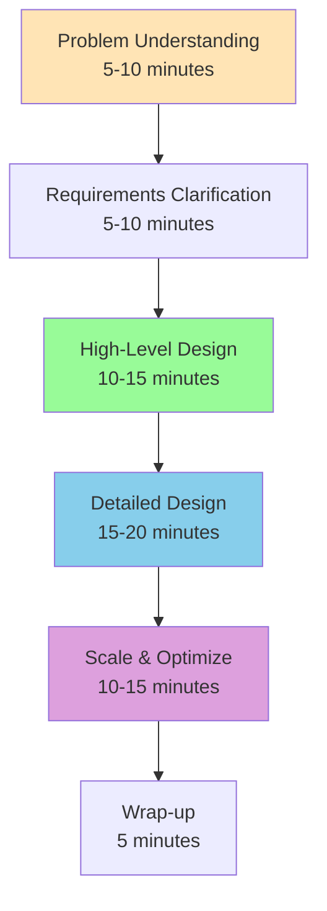
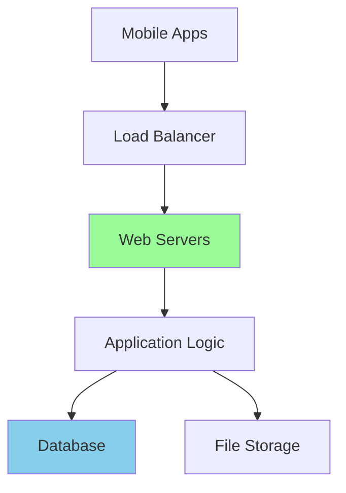
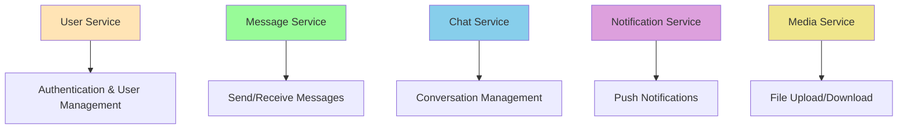
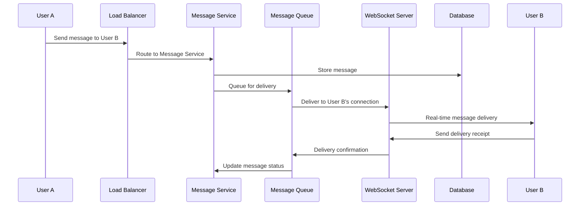
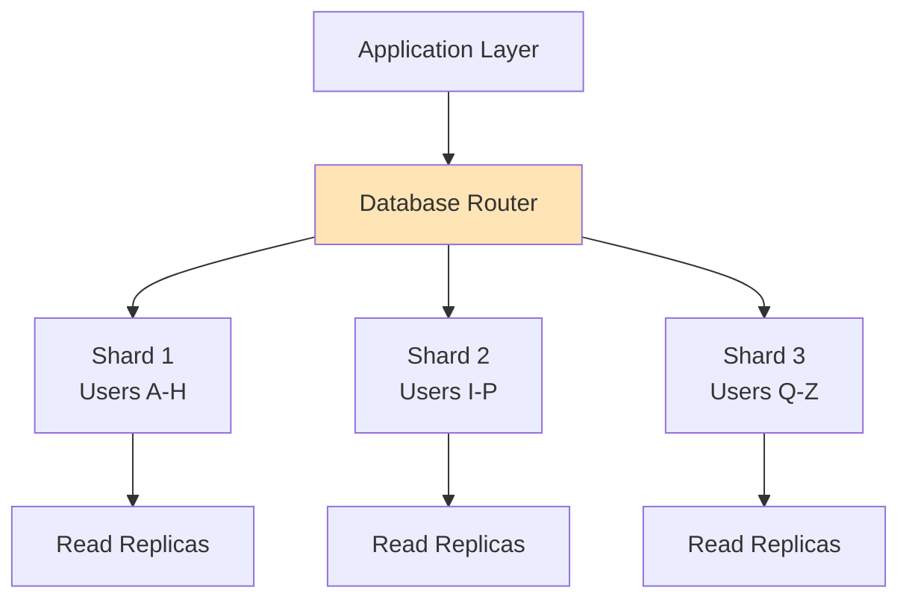
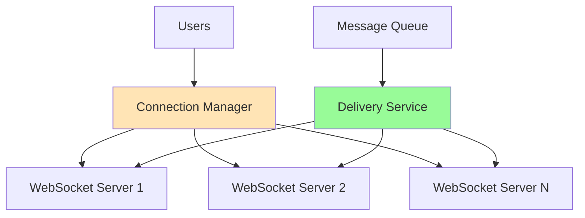
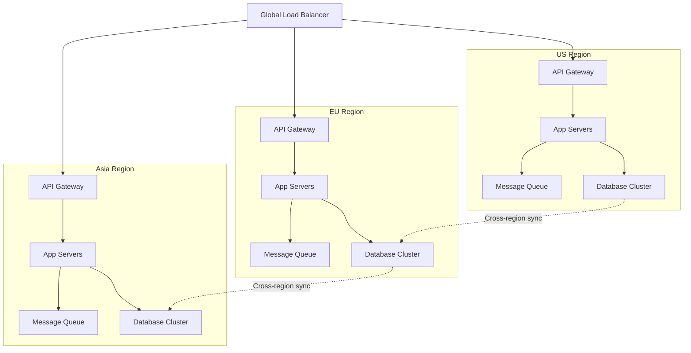

# Interview Strategies: Acing System Design Interviews

## The System Design Interview Framework

System design interviews aren't about finding the "perfect" solution—they're about demonstrating **structured thinking**, **trade-off analysis**, and **communication skills**. Here's the proven framework used by successful candidates at FAANG companies.



## Phase 1: Problem Understanding (5-10 minutes)

### Clarify the Problem Scope

**DON'T** immediately start designing. **DO** ask clarifying questions to understand exactly what you're building.

**Example: "Design a chat system"**

**Good Questions:**
```
Interviewer: "Design a chat system like WhatsApp"

You: "Great! Let me clarify the scope:
- Is this one-on-one messaging, group chat, or both?
- Do we need real-time delivery or is eventual delivery acceptable?
- What about media sharing - images, videos, files?
- Should we support message history and search?
- Any specific scale requirements - how many users?
- Do we need read receipts and online status?"
```

**Why This Works:**
- Shows systematic thinking
- Prevents building the wrong thing
- Demonstrates real-world product sense
- Gives you control over the interview direction

### Establish Success Metrics

Define what "success" means for your system:

```
You: "Before we design, let's define success metrics:
- Functional: Users can send/receive messages reliably
- Performance: Message delivery under 100ms for online users
- Scale: Support 100M active users, 10B messages/day
- Availability: 99.9% uptime
- Consistency: Messages delivered exactly once, in order"
```

## Phase 2: Requirements Clarification (5-10 minutes)

### Functional Requirements

What the system **must do**:

```markdown
## Functional Requirements (Chat System Example)

### Core Features:
1. Send and receive text messages
2. One-on-one and group messaging (up to 100 members)
3. User registration and authentication
4. Contact management (add/remove friends)
5. Message history storage and retrieval

### Secondary Features:
1. Media sharing (images, videos, files)
2. Read receipts and typing indicators
3. Online/offline status
4. Push notifications
5. Message search
```

### Non-Functional Requirements

How well the system **performs**:

```markdown
## Non-Functional Requirements

### Scale:
- 100M daily active users
- 10B messages sent per day
- Average user sends 100 messages/day
- Peak traffic: 3x average during prime hours

### Performance:
- Message delivery: <100ms for online users
- Message history load: <200ms
- Group message fanout: <500ms

### Availability & Reliability:
- 99.9% uptime (8.76 hours downtime/year)
- Messages must not be lost
- Exactly-once delivery guarantee
- Order preservation within conversations
```

### Back-of-the-Envelope Calculations

**Always do the math** to size your system:

```
Traffic Estimation:
- 100M DAU × 100 messages/day = 10B messages/day
- 10B messages/day ÷ 86,400 seconds = 115K messages/second average
- Peak: 115K × 3 = 345K messages/second

Storage Estimation:
- Average message size: 100 bytes (text) + 50 bytes (metadata) = 150 bytes
- Daily storage: 10B × 150 bytes = 1.5TB/day
- Annual storage: 1.5TB × 365 = 547TB/year

Bandwidth:
- Incoming: 345K messages/sec × 150 bytes = 52 MB/s
- Outgoing: 345K × average fanout of 50 users × 150 bytes = 2.6 GB/s
```

## Phase 3: High-Level Design (10-15 minutes)

### Start with the Simplest Architecture

Begin with a monolithic design, then evolve it:



**Narrate your thinking:**
```
"Let's start simple. Users connect through mobile apps to our web servers
behind a load balancer. The application logic handles message routing and
persistence. We'll store messages in a database and media files in object
storage. This covers the basic functionality."
```

### Identify the Core Components

Break down the system into major components:



### Define APIs

Show the key interfaces between components:

```python
# User Service API
POST /api/users/register
POST /api/users/login
GET  /api/users/profile/{user_id}
PUT  /api/users/profile/{user_id}

# Message Service API  
POST /api/messages/send
GET  /api/messages/conversation/{conversation_id}
PUT  /api/messages/{message_id}/read

# Chat Service API
POST /api/chats/create
POST /api/chats/{chat_id}/members
GET  /api/chats/user/{user_id}
```

## Phase 4: Detailed Design (15-20 minutes)

### Deep Dive into Critical Components

Pick 1-2 components and design them in detail. **Choose based on what the interviewer seems interested in.**

#### Message Delivery System



**Code Example:**
```python
class MessageService:
    def send_message(self, sender_id, recipient_id, content):
        # 1. Validate inputs
        if not self.user_service.user_exists(recipient_id):
            raise UserNotFoundError()
        
        # 2. Create message object
        message = Message(
            id=generate_uuid(),
            sender_id=sender_id,
            recipient_id=recipient_id,
            content=content,
            timestamp=time.time(),
            status='sent'
        )
        
        # 3. Store in database
        self.db.store_message(message)
        
        # 4. Queue for real-time delivery
        self.message_queue.publish('message_delivery', {
            'message_id': message.id,
            'recipient_id': recipient_id,
            'content': content,
            'sender_id': sender_id
        })
        
        return message.id
```

#### Database Schema Design

```sql
-- Users table
CREATE TABLE users (
    user_id UUID PRIMARY KEY,
    username VARCHAR(50) UNIQUE NOT NULL,
    email VARCHAR(100) UNIQUE NOT NULL,
    password_hash VARCHAR(255) NOT NULL,
    created_at TIMESTAMP DEFAULT NOW(),
    last_seen TIMESTAMP
);

-- Conversations table
CREATE TABLE conversations (
    conversation_id UUID PRIMARY KEY,
    type ENUM('direct', 'group') NOT NULL,
    name VARCHAR(100), -- For group chats
    created_at TIMESTAMP DEFAULT NOW(),
    updated_at TIMESTAMP DEFAULT NOW()
);

-- Messages table
CREATE TABLE messages (
    message_id UUID PRIMARY KEY,
    conversation_id UUID REFERENCES conversations(conversation_id),
    sender_id UUID REFERENCES users(user_id),
    content TEXT NOT NULL,
    message_type ENUM('text', 'image', 'video', 'file') DEFAULT 'text',
    created_at TIMESTAMP DEFAULT NOW(),
    
    INDEX idx_conversation_time (conversation_id, created_at),
    INDEX idx_sender (sender_id)
);

-- Conversation participants
CREATE TABLE conversation_participants (
    conversation_id UUID REFERENCES conversations(conversation_id),
    user_id UUID REFERENCES users(user_id),
    joined_at TIMESTAMP DEFAULT NOW(),
    last_read_message_id UUID,
    
    PRIMARY KEY (conversation_id, user_id)
);
```

## Phase 5: Scale & Optimize (10-15 minutes)

### Identify Bottlenecks

**Show analytical thinking** by identifying what will break first:

```
"Let's analyze bottlenecks:

1. Database writes: 345K messages/sec might overwhelm a single DB
2. Real-time connections: WebSocket servers limited by connection count
3. Group message fanout: Large groups create delivery amplification
4. Message history: Reading conversation history requires efficient indexing
5. Global latency: Users worldwide need low-latency delivery"
```

### Scaling Solutions

Address each bottleneck systematically:

#### 1. Database Scaling


**Sharding Strategy:**
```python
def get_shard_for_conversation(conversation_id):
    # Hash conversation ID to determine shard
    shard_number = hash(conversation_id) % NUM_SHARDS
    return f"messages_shard_{shard_number}"

def get_shard_for_user(user_id):
    # User data sharded separately
    shard_number = hash(user_id) % NUM_USER_SHARDS
    return f"users_shard_{shard_number}"
```

#### 2. Real-time Connection Scaling


#### 3. Caching Strategy
```python
class MessageCache:
    def __init__(self):
        self.redis = Redis()
    
    def cache_recent_messages(self, conversation_id, messages):
        # Cache last 100 messages per conversation
        key = f"conversation:{conversation_id}:recent"
        self.redis.lpush(key, *[json.dumps(msg) for msg in messages])
        self.redis.ltrim(key, 0, 99)  # Keep only last 100
        self.redis.expire(key, 86400)  # 24 hour TTL
    
    def get_recent_messages(self, conversation_id):
        key = f"conversation:{conversation_id}:recent"
        cached_messages = self.redis.lrange(key, 0, -1)
        return [json.loads(msg) for msg in cached_messages]
```

#### 4. Global Distribution


## Phase 6: Advanced Topics (If Time Permits)

### Monitoring & Observability

```python
class MessageMetrics:
    def track_message_sent(self, sender_region, recipient_region, latency):
        # Track delivery latency by region pair
        self.metrics.histogram(
            'message_delivery_latency_ms',
            latency,
            tags={'sender_region': sender_region, 'recipient_region': recipient_region}
        )
        
        # Track message volume
        self.metrics.increment('messages_sent_total')
    
    def track_connection_count(self, region, connection_count):
        self.metrics.gauge('active_connections', connection_count, tags={'region': region})
```

### Security Considerations

```python
class MessageSecurity:
    def encrypt_message(self, content, conversation_key):
        # End-to-end encryption
        encrypted_content = AES.encrypt(content, conversation_key)
        return encrypted_content
    
    def validate_rate_limit(self, user_id):
        # Prevent spam
        current_rate = self.rate_limiter.get_rate(user_id)
        if current_rate > 100:  # 100 messages per minute
            raise RateLimitExceededError()
```

## Common Interview Pitfalls to Avoid

### 1. Starting Too Detailed
```
❌ Bad: "Let's start with the database schema..."
✅ Good: "Let me first understand the requirements..."
```

### 2. Not Considering Scale
```
❌ Bad: "We'll use a single MySQL database..."
✅ Good: "Initially we can use MySQL, but at 10B messages/day we'll need sharding..."
```

### 3. Ignoring Trade-offs
```
❌ Bad: "We'll use strong consistency everywhere..."
✅ Good: "For message ordering we need consistency, but user status can be eventually consistent..."
```

### 4. Over-engineering
```
❌ Bad: "Let's implement a custom consensus protocol..."
✅ Good: "We can use existing message queue solutions like Kafka..."
```

## Sample Questions & Approach

### Popular System Design Questions

1. **Design a URL Shortener (bit.ly)**
   - Focus: Hashing algorithms, database design, caching
   - Key insight: Read-heavy system, optimize for redirects

2. **Design a Social Media Feed (Facebook/Twitter)**
   - Focus: Fan-out strategies, timeline generation, ranking
   - Key insight: Pull vs. push models for different user types

3. **Design a Chat System (WhatsApp)**
   - Focus: Real-time messaging, presence, mobile optimization
   - Key insight: Connection management and message delivery guarantees

4. **Design a Video Streaming Service (Netflix)**
   - Focus: Content delivery, encoding, recommendation systems
   - Key insight: Global distribution and adaptive bitrate streaming

5. **Design a Search Engine (Google)**
   - Focus: Crawling, indexing, ranking, distributed processing
   - Key insight: Scale of web indexing and query processing

### The STAR Method for System Design

**Situation**: Understand the problem and requirements
**Task**: Define what needs to be built
**Action**: Design the system step by step
**Result**: Discuss trade-offs and optimizations

## Final Tips for Success

1. **Practice sketching** - Draw diagrams clearly and quickly
2. **Think out loud** - Narrate your thought process
3. **Ask for feedback** - "Does this approach make sense?"
4. **Manage time** - Don't get stuck on one component
5. **Know your fundamentals** - Understand how databases, networks, and caches work
6. **Study real systems** - Read engineering blogs from top companies
7. **Mock interviews** - Practice with peers or use platforms like Pramp

Remember: The goal isn't to design the perfect system, but to demonstrate that you can think systematically about complex problems, make reasonable trade-offs, and communicate your ideas clearly.

Your interviewer wants to see how you would approach real engineering challenges they face every day. Show them you can be a valuable addition to their team by thinking like a seasoned engineer, not just a computer science student.