# The Core Problem: When Time Matters More Than Anything Else

Imagine you're monitoring a fleet of 10,000 servers, each reporting CPU usage, memory consumption, and network traffic every second. That's 30,000 data points per second, 2.6 billion per day. Your traditional relational database starts to buckle under this load – writes become slow, queries time out, and your monitoring dashboard becomes useless just when you need it most.

## The Unique Characteristics of Time-Series Data

Time-series data has fundamentally different patterns than regular business data:

### 1. **Write-Heavy Workloads**
Most data flows in one direction: new measurements arrive constantly, but historical data rarely changes. A typical time-series workload might be 95% writes, 5% reads – the opposite of most business applications.

### 2. **Temporal Ordering**
Data arrives in chronological order (mostly). Unlike user records that can be created, updated, and deleted randomly, metrics flow like a river – always forward in time.

### 3. **Range-Based Queries**
You almost never ask "What was the CPU usage at exactly 14:32:17?" Instead, you ask "Show me the average CPU usage between 2 PM and 4 PM" or "What was the peak memory usage last week?"

### 4. **Data Lifecycle**
Recent data is queried frequently ("What's happening now?"), but older data becomes less important over time. You might need second-by-second data for the last hour, minute-by-minute for the last day, and only daily averages for last year.

## Why Traditional Databases Struggle


### The B-Tree Problem
Relational databases use B-trees for indexing, optimized for random access patterns. But time-series data is sequential. It's like using a phone book to find everyone who called you in the last hour – the data structure doesn't match the access pattern.

The mismatch is fundamental:
- **B-trees excel at**: Finding specific records by key (`WHERE id = 12345`)
- **Time-series needs**: Finding ranges of records by time (`WHERE timestamp BETWEEN x AND y`)

### Storage Inefficiency

```mermaid
graph TB
    subgraph "Traditional Row Storage Analysis"
        subgraph "Raw Data Storage"
            A["Row 1: id=1, timestamp=14:30:00, server=server1, metric=cpu_usage, value=45.2"]
            B["Row 2: id=2, timestamp=14:30:01, server=server1, metric=cpu_usage, value=45.3"]
            C["Row 3: id=3, timestamp=14:30:02, server=server1, metric=cpu_usage, value=45.1"]
        end
        
        subgraph "Waste Analysis"
            D1["🔄 Repeated Metadata<br/>server1, cpu_usage × 3"]
            D2["📈 Incremental Values<br/>45.2 → 45.3 → 45.1<br/>Tiny differences"]
            D3["⏰ Sequential Timestamps<br/>14:30:00 → +1s → +1s<br/>Predictable pattern"]
        end
        
        subgraph "Storage Impact"
            E["💾 Storage Overhead<br/>60-80% redundant data<br/>Poor compression"]
            F["🔍 Query Performance<br/>Scattered data layout<br/>High I/O cost"]
        end
        
        A --> D1
        B --> D2
        C --> D3
        
        D1 --> E
        D2 --> E
        D3 --> F
        
        style D1 fill:#ffcdd2
        style D2 fill:#ffcdd2
        style D3 fill:#ffcdd2
        style E fill:#ffebee
        style F fill:#ffebee
    end
```



A typical SQL row for `server_metrics` might look like:
```
| id | timestamp           | server_id | metric_name | value  |
|----|---------------------|-----------|-------------|--------|
| 1  | 2024-01-15 14:30:00 | server1   | cpu_usage   | 45.2   |
| 2  | 2024-01-15 14:30:01 | server1   | cpu_usage   | 45.3   |
```

Notice how much redundant information is stored. The server_id and metric_name are repeated for every single measurement, and consecutive values (45.2, 45.3) differ by tiny amounts.

**The waste is staggering**: In a typical monitoring setup, 60-80% of storage is redundant metadata that could be compressed or eliminated entirely.

### Query Performance
Finding "average CPU usage for server1 between 2 PM and 4 PM" requires scanning potentially millions of rows, even with indexing. The database has no inherent understanding that time is special.

## The Real-World Impact

When Dropbox needed to monitor their infrastructure, they initially used MySQL. As they scaled, a single query for basic metrics could take 30+ seconds. Users couldn't get real-time insights into system performance, making incident response reactive instead of proactive.

When Netflix needed to track viewing patterns across millions of users, traditional approaches couldn't handle the write volume while maintaining query responsiveness for their recommendation algorithms.

## The Time-Series Database Solution Preview

```mermaid
flowchart TD
    subgraph "Time-Series Database Architecture"
        A["📅 Time as Primary Axis<br/>All optimizations center on temporal access patterns"]
        
        A --> B["🗂️ Columnar Storage<br/>Group similar data together"]
        A --> C["📊 Time-Based Partitioning<br/>Organize by time windows"]
        A --> D["🗜️ Specialized Compression<br/>Delta-of-delta, XOR encoding"]
        A --> E["⏰ Automatic Retention<br/>Lifecycle-aware data management"]
        
        B --> F["✅ 10-20x Compression<br/>vs traditional databases"]
        C --> G["✅ Lightning Fast Range Queries<br/>Millisecond response times"]
        D --> H["✅ Predictable Storage Costs<br/>Aggressive compression ratios"]
        E --> I["✅ Zero-Maintenance Cleanup<br/>Automatic data expiration"]
        
        subgraph "Real-World Benefits"
            F --> J["💰 Storage: 2.6TB → 50GB"]
            G --> K["⚡ Queries: 30s → 100ms"]
            H --> L["📈 Scale: 1M → 100M points/sec"]
            I --> M["🔄 Ops: Manual → Automated"]
        end
        
        J --> N["🎯 Production-Ready Time-Series Systems"]
        K --> N
        L --> N
        M --> N
    end
    
    style A fill:#e1f5fe
    style N fill:#c8e6c9
    style J fill:#fff3c4
    style K fill:#fff3c4
    style L fill:#fff3c4
    style M fill:#fff3c4
```



Time-series databases solve these problems by treating time as a first-class citizen:

- **Columnar storage** eliminates repetitive data
- **Time-based partitioning** makes range queries lightning fast
- **Specialized compression** leverages the predictable nature of consecutive values
- **Retention policies** automatically age out old data

**The transformative result**: Query times drop from 30+ seconds to sub-100 milliseconds, while storage requirements shrink from terabytes to gigabytes. This isn't just an incremental improvement – it's a fundamental paradigm shift that makes previously impossible workloads practical.

```mermaid
graph LR
    subgraph "Performance Transformation"
        subgraph "Traditional Database"
            T1["📊 Query Time: 30+ seconds"]
            T2["💾 Storage: 2.6TB/day"]
            T3["⚡ Throughput: 1K writes/sec"]
            T4["💰 Cost: $$$"]
        end
        
        subgraph "Time-Series Database"
            TS1["📊 Query Time: <100ms"]
            TS2["💾 Storage: 50GB/day"]
            TS3["⚡ Throughput: 1M+ writes/sec"]
            TS4["💰 Cost: $"]
        end
        
        T1 --> TS1
        T2 --> TS2
        T3 --> TS3
        T4 --> TS4
        
        style T1 fill:#ffcdd2
        style T2 fill:#ffcdd2
        style T3 fill:#ffcdd2
        style T4 fill:#ffcdd2
        
        style TS1 fill:#c8e6c9
        style TS2 fill:#c8e6c9
        style TS3 fill:#c8e6c9
        style TS4 fill:#c8e6c9
    end
```



In the next section, we'll explore the architectural philosophy that makes this possible.