# The Guiding Philosophy: Time as the Primary Axis

Time-series databases are built on a fundamental insight: **when time is the most important dimension of your data, everything else should be optimized around it**.

## The Mental Model: Data as a Timeline

Think of time-series data like frames in a movie. Each frame (timestamp) contains multiple pieces of information (metrics), but you always access them in temporal order or ranges. You don't randomly jump to frame 47,293 – you scrub through segments or play sequences.

This temporal nature drives every architectural decision in a time-series database.

## Core Philosophical Principles

### 1. **Time-Centric Organization**

Traditional databases organize data by entities:
```
Users Table: [id, name, email, created_at]
Orders Table: [id, user_id, amount, timestamp]
```

Time-series databases organize data by time:
```
2024-01-15 14:30:00 → [server1.cpu: 45.2, server1.memory: 78.1, server2.cpu: 62.4]
2024-01-15 14:30:01 → [server1.cpu: 45.3, server1.memory: 78.1, server2.cpu: 62.7]
```

### 2. **Write Optimization Over Update Flexibility**

Time-series databases make a crucial trade-off: they sacrifice the ability to efficiently update or delete individual records in favor of extremely fast writes.

**The Append-Only Assumption**: Historical measurements don't change. The CPU usage at 2 PM yesterday is a fact that will never be modified. This assumption enables powerful optimizations impossible in general-purpose databases.

### 3. **Compression Through Predictability**

Consecutive time-series values are highly predictable:
- Timestamps are sequential (14:30:00, 14:30:01, 14:30:02...)
- Values change gradually (45.2%, 45.3%, 45.1%...)
- Metadata repeats (server1, cpu_usage, server1, cpu_usage...)

This predictability allows for compression ratios often 10-20x better than general-purpose databases.

### 4. **Time-Based Partitioning**

```mermaid
graph TB
    subgraph "Intelligent Time-Based Partitioning"
        subgraph "Hot Tier - Active Workloads"
            P1["🔥 Today's Partition<br/>📊 High write rate<br/>⚡ SSD storage<br/>🔍 Real-time queries"]
        end
        
        subgraph "Warm Tier - Recent Analysis"
            P2["🌡️ Yesterday<br/>📈 Medium compression<br/>💾 SSD storage<br/>📊 Trending analysis"]
            P3["🌡️ Last Week<br/>📉 Higher compression<br/>💿 Hybrid storage"]
        end
        
        subgraph "Cold Tier - Long-term Storage"
            P4["❄️ Last Month<br/>🗜️ Maximum compression<br/>💽 HDD/Object storage<br/>📋 Historical reports"]
            P5["🧊 Archive<br/>📦 Ultra compression<br/>☁️ Cloud storage"]
        end
        
        subgraph "Query Optimization"
            Q1["🔍 Real-time: Last 1h"] --> P1
            Q2["📊 Dashboard: Last 24h"] --> P1
            Q2 --> P2
            Q3["📈 Trend: Last 7d"] --> P2
            Q3 --> P3
            Q4["📋 Report: Last 30d"] --> P3
            Q4 --> P4
        end
        
        subgraph "Lifecycle Management"
            L1["🔄 Auto-compression"] --> P2
            L2["📁 Auto-tiering"] --> P3
            L3["🗑️ Auto-deletion"] --> P5
        end
        
        style P1 fill:#ffebee
        style P2 fill:#fff3c4
        style P3 fill:#e8f5e8
        style P4 fill:#e3f2fd
        style P5 fill:#f3e5f5
        
        style Q1 fill:#c8e6c9
        style Q2 fill:#c8e6c9
        style Q3 fill:#c8e6c9
        style Q4 fill:#c8e6c9
    end
```



Data is physically organized by time windows (hours, days, weeks). This means:
- Queries for recent data only touch recent partitions
- Old data can be compressed more aggressively
- Expired data can be dropped by simply deleting entire partitions

**Real-world impact**: A query for "last 4 hours" touches only 1 partition instead of scanning the entire database.

## The Storage Philosophy: Columnar by Default

```mermaid
graph TB
    subgraph "Row-Based Storage (Traditional)"
        R1["Row 1: [ts=14:30:00, server=server1, metric=cpu, value=45.2]"]
        R2["Row 2: [ts=14:30:01, server=server1, metric=cpu, value=45.3]"]
        R3["Row 3: [ts=14:30:02, server=server1, metric=cpu, value=45.1]"]
        
        R1 --> RX["❌ Repeated metadata in every row<br/>❌ Poor compression<br/>❌ Inefficient analytics"]
        R2 --> RX
        R3 --> RX
    end
    
    subgraph "Columnar Storage (Time-Series)"
        C1["Timestamps: [14:30:00, 14:30:01, 14:30:02, ...]"]
        C2["Servers:    [server1,  server1,  server1,  ...]"]
        C3["Metrics:    [cpu,      cpu,      cpu,      ...]"]
        C4["Values:     [45.2,     45.3,     45.1,     ...]"]
        
        C1 --> CX["✅ Similar data together<br/>✅ Excellent compression<br/>✅ Vectorized operations"]
        C2 --> CX
        C3 --> CX
        C4 --> CX
    end
    
    style RX fill:#ffebee
    style CX fill:#e8f5e8
```



Traditional row-based storage stores data like this:
```
Row 1: [timestamp=14:30:00, server=server1, metric=cpu, value=45.2]
Row 2: [timestamp=14:30:01, server=server1, metric=cpu, value=45.3]
```

Time-series databases use columnar storage:
```
Timestamps: [14:30:00, 14:30:01, 14:30:02, ...]
Servers:    [server1,  server1,  server1,  ...]
Metrics:    [cpu,      cpu,      cpu,      ...]
Values:     [45.2,     45.3,     45.1,     ...]
```

This enables:
- **Better compression**: Similar values are stored together
- **Faster analytics**: Sum, average, and aggregations can be vectorized
- **Efficient filtering**: Skip entire chunks if they don't match your criteria

## The Query Philosophy: Aggregation-First

Time-series databases assume you want aggregated insights, not individual points:

- **Range queries are primary**: "Show me the last hour" not "Show me the value at 14:32:17"
- **Downsampling is built-in**: Automatically compute hourly averages from minute-level data
- **Functions are first-class**: `rate()`, `delta()`, `percentile()` are native operations

## Trade-offs and Constraints

```mermaid
graph TB
    subgraph "The Time-Series Database Trade-off Matrix"
        subgraph "Massive Gains ✅"
            G1["📈 Write Performance<br/>1M+ points/second<br/>vs 1K in RDBMS"]
            G2["🗜️ Storage Efficiency<br/>10-20x compression<br/>TB → GB scale"]
            G3["⚡ Query Speed<br/>Range queries in ms<br/>vs minutes in SQL"]
            G4["🔄 Operational Simplicity<br/>Auto-retention, tiering<br/>Zero-touch lifecycle"]
            G5["💰 Cost Reduction<br/>90% less storage<br/>Predictable scaling"]
        end
        
        subgraph "Strategic Limitations ❌"
            L1["💳 ACID Transactions<br/>No multi-table consistency<br/>Eventual consistency model"]
            L2["✏️ Point Updates<br/>Append-only architecture<br/>Historical immutability"]
            L3["🔗 Complex Joins<br/>Single-table focus<br/>Denormalized design"]
            L4["📇 Flexible Indexing<br/>Time-centric indexes only<br/>Limited ad-hoc queries"]
            L5["🏗️ General Purpose<br/>Specialized for metrics<br/>Not for business logic"]
        end
        
        subgraph "Design Decision"
            TF["🎯 Purpose-Built Specialization<br/>Extreme optimization for temporal patterns<br/>vs General-purpose flexibility"]
        end
        
        G1 --> TF
        G2 --> TF
        G3 --> TF
        G4 --> TF
        G5 --> TF
        
        TF --> L1
        TF --> L2
        TF --> L3
        TF --> L4
        TF --> L5
        
        style TF fill:#e1f5fe
        style G1 fill:#c8e6c9
        style G2 fill:#c8e6c9
        style G3 fill:#c8e6c9
        style G4 fill:#c8e6c9
        style G5 fill:#c8e6c9
        
        style L1 fill:#ffcdd2
        style L2 fill:#ffcdd2
        style L3 fill:#ffcdd2
        style L4 fill:#ffcdd2
        style L5 fill:#ffcdd2
    end
```



This philosophy comes with clear trade-offs:

### What You Gain
- ✅ Extremely fast writes (millions of points per second)
- ✅ Efficient storage (10-20x compression)
- ✅ Fast range queries and aggregations
- ✅ Automatic data lifecycle management

### What You Give Up
- ❌ No general-purpose transactions
- ❌ Limited ability to update or delete individual points
- ❌ No complex joins between different metrics
- ❌ No arbitrary secondary indexes

**The key insight**: These limitations aren't bugs—they're features. By constraining the problem space, time-series databases can optimize aggressively for their specific use case.

## Real-World Application

Consider Prometheus, one of the most popular time-series databases:

- **Metric names** become part of the schema: `http_requests_total`
- **Labels** provide dimensions: `{method="GET", endpoint="/api/users"}`
- **Time ranges** are the primary query parameter: `[5m]`, `[1h]`, `[7d]`
- **Functions** operate on time ranges: `rate(http_requests_total[5m])`

This design makes it trivial to answer questions like "What's the 95th percentile response time for GET requests to /api/users over the last 4 hours?" – but nearly impossible to answer "Update the request count for timestamp 14:32:17 from 1,205 to 1,206."

## The Philosophy in Action

In the next section, we'll explore the key abstractions that make this philosophy concrete: timestamps, metrics, tags, and time-based partitioning – the building blocks that turn this theoretical approach into practical software architecture.