# Key Abstractions: The Building Blocks of Time-Series Data

Time-series databases revolve around four fundamental abstractions that work together like instruments in an orchestra. Understanding these abstractions is crucial to modeling your data effectively.

## 1. The Timestamp: Your North Star

The timestamp isn't just metadata – it's the primary key that drives everything else.

### Precision Matters
Different use cases need different timestamp precision:
- **Financial trading**: Microseconds or nanoseconds
- **Server monitoring**: Seconds or minutes  
- **IoT sensors**: Minutes or hours
- **Business metrics**: Hours or days

### The Time Window Concept
Time-series databases don't think in individual timestamps but in **time windows**:
```
Last 5 minutes:   [14:25:00 - 14:30:00]
Last hour:        [13:30:00 - 14:30:00]  
Last day:         [14:30:00 yesterday - 14:30:00 today]
```

This window-based thinking is why range queries are so natural and efficient.

## 2. The Metric: What You're Measuring


A metric is the core measurement you're tracking. Think of it as the "noun" in your data story.

### Naming Conventions
Good metric names are hierarchical and descriptive:
```
✅ Good:
cpu.usage.percent
memory.available.bytes
http.requests.total
disk.io.read.operations

❌ Poor:
cpu_data
mem
requests
disk_stuff
```

**Why hierarchy matters**: Tools can auto-complete `cpu.usage.*`, aggregate all `cpu.*` metrics, or group related measurements like `*.bytes` across different systems.

### Metric Types

```mermaid
graph LR
    subgraph "Metric Types and Behaviors"
        subgraph "Counter ✅"
            C1["Always increasing<br/>(or resets to 0)"]
            C2["http_requests_total:<br/>1,205 → 1,206 → 1,207"]
            C3["bytes_sent_total:<br/>45,823,991 → 45,824,103"]
            C1 --> C2
            C1 --> C3
        end
        
        subgraph "Gauge 🌡️"
            G1["Can go up or down<br/>(current state)"]
            G2["cpu_usage_percent:<br/>45.2 → 45.3 → 45.1"]
            G3["memory_available_bytes:<br/>8,432,123 → 8,431,999"]
            G1 --> G2
            G1 --> G3
        end
        
        subgraph "Histogram 📊"
            H1["Distribution of values<br/>(bucketed measurements)"]
            H2["response_time_histogram:<br/>{0.1s: 50, 0.5s: 30, 1.0s: 15}"]
            H1 --> H2
        end
        
        style C1 fill:#e8f5e8
        style G1 fill:#fff3c4
        style H1 fill:#e1f5fe
    end
```



Different metrics have different mathematical properties:

**Counters**: Always increase (or reset to zero)
- `http_requests_total`: 1,205 → 1,206 → 1,207
- `bytes_sent_total`: 45,823,991 → 45,824,103

**Gauges**: Can go up or down
- `cpu_usage_percent`: 45.2 → 45.3 → 45.1
- `memory_available_bytes`: 8,432,123 → 8,431,999

**Histograms**: Distribution of values
- `response_time_histogram`: {0.1s: 50, 0.5s: 30, 1.0s: 15, 2.0s: 5}

**Why types matter**: Query engines can apply type-specific optimizations—rate calculations for counters, percentiles for histograms, direct aggregation for gauges.

## 3. Tags (Labels): The Dimensions That Matter

Tags are key-value pairs that add context to your metrics. They're like adjectives that describe the circumstances of each measurement.

### The Ship's Logbook Analogy
Imagine a ship's logbook:

```
Timestamp: 08:00
Weather: Sunny          ← Tag
Wind Speed: 15 knots    ← Metric + Value
Location: 40.7°N        ← Tag
```

The weather and location are **tags** – they describe the context. The wind speed is the **metric** – what you're measuring.

### Tag Design Principles

```mermaid
graph TB
    subgraph "Cardinality Impact on Performance"
        subgraph "Low Cardinality (Good) ✅"
            L1["environment: [prod, stage, dev]<br/>3 values"]
            L2["region: [us-east, us-west, eu, asia]<br/>4 values"]
            L3["1,000 servers × 3 envs × 4 regions<br/>= 12,000 series"]
            L1 --> L3
            L2 --> L3
            L3 --> L4["✅ Manageable memory usage<br/>✅ Fast query performance"]
        end
        
        subgraph "High Cardinality (Dangerous) ❌"
            H1["user_id: [user_1...user_50M]<br/>50M values"]
            H2["request_id: [req_abc123...]<br/>Infinite values"]
            H3["1,000 servers × 50M users<br/>= 50B series"]
            H1 --> H3
            H2 --> H3
            H3 --> H4["❌ Memory explosion<br/>❌ Query timeouts"]
        end
        
        style L4 fill:#c8e6c9
        style H4 fill:#ffcdd2
    end
```



**High Cardinality vs. Low Cardinality**

Low cardinality (good for tags):
```
environment: [production, staging, development]        ← 3 values
region: [us-east, us-west, europe, asia]              ← 4 values
```

High cardinality (dangerous for tags):
```
user_id: [user_1, user_2, ..., user_50000000]         ← 50M values
request_id: [req_abc123, req_def456, ...]             ← Infinite values
```

**Why High Cardinality Hurts**
If you have 1,000 servers × 50 metrics × 100 users = 5,000,000 unique time series. Each series needs its own index entry, exploding memory usage and query times.

**The cardinality explosion**: Adding just one high-cardinality tag can increase your series count from thousands to millions, making your database unusable.

### Effective Tag Strategies

**✅ Good Tag Design:**
```
metric: cpu.usage.percent
tags: {
  host: "web-server-01",
  datacenter: "us-east-1",
  environment: "production",
  team: "platform"
}
```

**❌ Poor Tag Design:**
```
metric: cpu.usage.percent
tags: {
  host: "web-server-01",
  datacenter: "us-east-1",
  timestamp_hour: "14",        ← Redundant with timestamp
  user_session: "sess_abc123", ← High cardinality
  debug_info: "very detailed message here..." ← Unbounded
}
```

## 4. Time-Based Partitioning: Organizing by When

```mermaid
graph TB
    subgraph "Advanced Time-Based Partitioning Strategy"
        subgraph "Hot Tier - Active Data (0-24h)"
            P1["🔥 Current Hour Partition<br/>📈 Active writes: 100K/sec<br/>🗜️ Compression: None<br/>💾 Storage: NVMe SSD<br/>⏱️ Query latency: <1ms"]
            P1A["🔥 Last Hour Partition<br/>📉 Writes tapering<br/>🗜️ Light compression<br/>💾 Storage: NVMe SSD"]
        end
        
        subgraph "Warm Tier - Recent Data (1-30d)"
            P2["🌡️ Yesterday<br/>🗜️ Medium compression (5x)<br/>💾 Storage: SATA SSD<br/>⏱️ Query latency: <10ms"]
            P3["🌡️ Last Week<br/>🗜️ High compression (10x)<br/>💿 Storage: Hybrid"]
        end
        
        subgraph "Cold Tier - Historical Data (30d+)"
            P4["❄️ Last Month<br/>🗜️ Ultra compression (20x)<br/>💽 Storage: HDD/Object<br/>⏱️ Query latency: <100ms"]
            P5["🧊 Archive (1y+)<br/>🗜️ Max compression (50x)<br/>☁️ Storage: Cloud/Tape<br/>⏱️ Query latency: seconds"]
        end
        
        subgraph "Query Routing Intelligence"
            Q1["🔍 Real-time: now() - 5m"] --> P1
            Q2["📊 Dashboard: now() - 24h"] --> P1
            Q2 --> P1A
            Q2 --> P2
            Q3["📈 Trend: now() - 7d"] --> P2
            Q3 --> P3
            Q4["📋 Report: now() - 30d"] --> P3
            Q4 --> P4
            Q5["📊 Analytics: now() - 1y"] --> P4
            Q5 --> P5
        end
        
        subgraph "Automated Lifecycle Management"
            L1["🔄 Hourly: Compress completed hours"]
            L2["📁 Daily: Tier aging data"]
            L3["🗜️ Weekly: Optimize compression"]
            L4["🗑️ Monthly: Purge expired data"]
            
            L1 --> P1A
            L2 --> P2
            L3 --> P3
            L4 --> P5
        end
        
        style P1 fill:#ffebee
        style P1A fill:#ffebee
        style P2 fill:#fff3c4
        style P3 fill:#e8f5e8
        style P4 fill:#e3f2fd
        style P5 fill:#f3e5f5
        
        style Q1 fill:#c8e6c9
        style Q2 fill:#c8e6c9
        style Q3 fill:#c8e6c9
        style Q4 fill:#c8e6c9
        style Q5 fill:#c8e6c9
    end
```



Time-series databases physically organize data by time ranges, like organizing a library by publication year instead of author.

### Partition Strategies

**Fixed Time Windows**
```
Partition 1: 2024-01-15 00:00:00 - 2024-01-15 23:59:59
Partition 2: 2024-01-16 00:00:00 - 2024-01-16 23:59:59
Partition 3: 2024-01-17 00:00:00 - 2024-01-17 23:59:59
```

**Benefits of Time-Based Partitioning:**
- **Query isolation**: "Show me yesterday's data" only touches one partition
- **Efficient retention**: Delete old data by dropping entire partitions
- **Compression opportunities**: Older partitions can be compressed more aggressively
- **Parallel processing**: Multiple partitions can be queried simultaneously

**Storage tiering**: Hot data on fast SSDs, warm data on slower SSDs, cold data on cheap HDDs—all transparent to queries.

### Hierarchical Partitioning
Advanced systems use multiple levels:
```
Year/Month/Day/Hour structure:
2024/01/15/14/ → Contains all data from 2 PM on Jan 15th
2024/01/15/15/ → Contains all data from 3 PM on Jan 15th
```

## Putting It All Together: The Complete Picture

```mermaid
graph TB
    subgraph "Complete Time-Series Data Point Architecture"
        subgraph "Core Components"
            TS["📅 Timestamp<br/>2024-01-15T14:30:00Z<br/>✅ Primary key & partition key<br/>✅ Enables delta-of-delta compression<br/>✅ Natural ordering for range queries"]
            MT["📊 Metric Name<br/>http.requests.duration.seconds<br/>✅ Hierarchical naming<br/>✅ Type hints for query engine<br/>✅ Dictionary compression"]
            TG["🏷️ Tags (Low Cardinality)<br/>{method: GET, endpoint: /api/users}<br/>✅ Filtering & grouping dimensions<br/>✅ Secondary indexes<br/>✅ Efficient aggregations"]
            VL["🔢 Value<br/>0.245 (245ms)<br/>✅ XOR compression<br/>✅ Numeric operations<br/>✅ Statistical functions"]
        end
        
        subgraph "Assembled Data Point"
            DP["📝 Optimized Data Point<br/>timestamp=1705330200, metric=http.requests.duration.seconds<br/>tags={method: GET, endpoint: /api/users, dc: us-east}<br/>value=0.245"]
        end
        
        subgraph "Query Capabilities Enabled"
            Q1["📈 Aggregation Queries<br/>SELECT avg(value) FROM http.requests.duration.seconds<br/>WHERE method='GET' AND timestamp > now()-1h<br/>Result: 0.187s average response time"]
            
            Q2["📊 Percentile Analysis<br/>SELECT percentile(value, 95) FROM http.requests.duration.seconds<br/>WHERE endpoint='/api/users' GROUP BY datacenter<br/>Result: P95 latency by region"]
            
            Q3["📉 Time-Series Functions<br/>SELECT rate(http.requests.total[5m]) FROM metrics<br/>WHERE status_code != '200'<br/>Result: Error rate over time"]
            
            Q4["🔍 Real-time Alerting<br/>SELECT host, max(value) FROM cpu.usage.percent<br/>WHERE timestamp > now()-5m GROUP BY host<br/>HAVING max(value) > 90"]
        end
        
        subgraph "Storage Optimizations"
            S1["🗜️ Compression Benefits<br/>Delta-of-delta timestamps: 4x<br/>XOR values: 8x<br/>Dictionary tags: 10x<br/>Combined: 20-50x reduction"]
            
            S2["⚡ Query Performance<br/>Columnar layout<br/>Time-based partitioning<br/>Vectorized operations<br/>Result: ms response times"]
        end
        
        TS --> DP
        MT --> DP
        TG --> DP
        VL --> DP
        
        DP --> Q1
        DP --> Q2
        DP --> Q3
        DP --> Q4
        
        DP --> S1
        DP --> S2
        
        style DP fill:#e1f5fe
        style Q1 fill:#c8e6c9
        style Q2 fill:#c8e6c9
        style Q3 fill:#c8e6c9
        style Q4 fill:#c8e6c9
        style S1 fill:#fff3c4
        style S2 fill:#fff3c4
    end
```



Here's how these abstractions work together in practice:

```
Timestamp: 2024-01-15T14:30:00Z
Metric: http.requests.duration.seconds
Tags: {
  method: "GET",
  endpoint: "/api/users",
  status_code: "200",
  datacenter: "us-east-1"
}
Value: 0.245
```

This single data point:
- **Timestamp**: Places it in the 14:30 time window
- **Metric**: Identifies what we're measuring (request duration)
- **Tags**: Provide filtering dimensions (GET requests to /api/users that succeeded)
- **Value**: The actual measurement (245 milliseconds)

**The power of abstraction**: These four simple concepts—timestamp, metric, tags, value—can model virtually any time-series data, from IoT sensors to financial trades to social media metrics.

### Query Examples
With these abstractions, natural queries become possible:

```sql
-- Average response time for failed requests in the last hour
SELECT avg(value) 
FROM http.requests.duration.seconds 
WHERE status_code != "200" 
  AND timestamp > now() - 1h

-- 95th percentile response time by endpoint
SELECT percentile(value, 95) 
GROUP BY endpoint 
WHERE timestamp > now() - 24h
```

## The Mental Model in Practice

Think of these abstractions like a well-organized warehouse:

- **Timestamp** = Which aisle (organized chronologically)
- **Metric** = What product category (CPU, memory, network)
- **Tags** = Product specifications (color, size, manufacturer)
- **Partitioning** = Warehouse sections (this week's inventory vs. last month's)

When you need something specific, you know exactly where to look, and you can quickly find related items because they're stored nearby.

In the next section, we'll see how these abstractions translate into practical modeling decisions when working with real time-series data.