# Modeling CPU Usage: From Raw Data to Insights

Let's take a real-world example and walk through the process of modeling CPU usage data for a time-series database. This guide will show you how to think through the key decisions and avoid common pitfalls.

## The Scenario

You're building a monitoring system for a fleet of web servers. Each server reports various CPU metrics every 15 seconds. You need to store this data efficiently and answer questions like:

- "What's the current CPU usage across all servers?"
- "Which servers had CPU spikes in the last hour?"
- "Show me the average CPU usage by datacenter over the past week"

## Step 1: Identify Your Metrics

```mermaid
graph TB
    subgraph "CPU Metrics Hierarchy"
        CPU["💻 CPU Monitoring"]
        
        CPU --> USAGE["cpu.usage"]
        CPU --> LOAD["cpu.load"]
        
        USAGE --> U1["cpu.usage.percent<br/>📊 Overall utilization (0-100%)"]
        USAGE --> U2["cpu.usage.user.percent<br/>👤 User space CPU usage"]
        USAGE --> U3["cpu.usage.system.percent<br/>⚙️ Kernel space CPU usage"]
        USAGE --> U4["cpu.usage.iowait.percent<br/>⏳ Time waiting for I/O"]
        USAGE --> U5["cpu.usage.idle.percent<br/>😴 Idle time"]
        
        LOAD --> L1["cpu.load.average.1min<br/>⏱️ 1-minute load average"]
        LOAD --> L2["cpu.load.average.5min<br/>⏱️ 5-minute load average"]
        LOAD --> L3["cpu.load.average.15min<br/>⏱️ 15-minute load average"]
        
        style CPU fill:#e3f2fd
        style USAGE fill:#fff3c4
        style LOAD fill:#fff3c4
    end
```



First, let's define what we're actually measuring. CPU "usage" can mean several things:

```
CPU Metrics to Track:
├── cpu.usage.percent          ← Overall CPU utilization (0-100%)
├── cpu.usage.user.percent     ← User space CPU usage
├── cpu.usage.system.percent   ← Kernel space CPU usage  
├── cpu.usage.iowait.percent   ← Time waiting for I/O operations
├── cpu.usage.idle.percent     ← Idle time
└── cpu.load.average           ← Load average (1min, 5min, 15min)
```

**Pro tip**: Start with `cpu.usage.percent` for overall monitoring, then add specific metrics as you need more granular insights.

### Metric Naming Strategy

Use a hierarchical naming convention:
```
✅ Good: cpu.usage.percent
✅ Good: cpu.usage.user.percent
✅ Good: cpu.load.average.1min

❌ Poor: cpu_util
❌ Poor: cpu_data_user
❌ Poor: load1
```

The hierarchical naming helps with:
- **Organization**: Related metrics are grouped together
- **Autocomplete**: Tools can suggest related metrics
- **Aggregation**: Easy to sum all `cpu.usage.*` metrics

## Step 2: Design Your Tag Schema

Tags provide the dimensions you'll filter and group by. Think about the questions you need to answer:

### Essential Tags
```yaml
host:        "web-server-01"      # Which specific machine
datacenter:  "us-east-1"          # Geographic location  
environment: "production"         # prod/staging/dev
team:        "platform"           # Ownership/responsibility
instance_type: "m5.large"        # Server size/type
```

### Tag Cardinality Analysis

```mermaid
graph TB
    subgraph "Cardinality Impact Calculator"
        subgraph "Individual Tag Cardinality"
            T1["host: ~1,000 🔶"]
            T2["datacenter: ~5 �︫"]
            T3["environment: 3 �︫"]
            T4["team: ~10 �︫"]
            T5["instance_type: ~20 �︫"]
        end
        
        CALC["Total Series Calculation<br/>1,000 × 5 × 3 × 10 × 20<br/>= 300,000 unique series"]
        
        T1 --> CALC
        T2 --> CALC
        T3 --> CALC
        T4 --> CALC
        T5 --> CALC
        
        CALC --> RESULT["✅ Manageable for most TSDBs<br/>✅ Good query performance<br/>✅ Reasonable memory usage"]
        
        style CALC fill:#fff3c4
        style RESULT fill:#c8e6c9
    end
```



Let's check our cardinality (number of unique values):

```
host: ~1,000 servers             ← High but manageable
datacenter: ~5 locations         ← Low cardinality ✅
environment: 3 (prod/stage/dev)  ← Low cardinality ✅  
team: ~10 teams                  ← Low cardinality ✅
instance_type: ~20 types         ← Low cardinality ✅

Total combinations: 1,000 × 5 × 3 × 10 × 20 = 300,000 unique series
```

This is reasonable for most time-series databases.

**Rule of thumb**: Keep total series under 1M for small-medium deployments, under 10M for large ones.

### Common Tag Mistakes

**❌ Don't use high-cardinality data as tags:**
```yaml
# BAD: These create millions of unique series
process_id: "12847"              # Changes every restart
request_id: "req_abc123def"      # Unique per request  
timestamp_minute: "14:32"        # Redundant with timestamp
full_command_line: "/usr/bin/java -Xmx4g ..." # Unbounded
```

**❌ Don't duplicate data in tags:**
```yaml
# BAD: Redundant information
host: "web-server-01"
hostname: "web-server-01"        # Same as host
server_name: "web-server-01"     # Same as host
```

## Step 3: Structure Your Data Points

Here's how a well-structured data point looks:

```json
{
  "timestamp": "2024-01-15T14:30:00Z",
  "metric": "cpu.usage.percent",
  "value": 67.3,
  "tags": {
    "host": "web-server-01",
    "datacenter": "us-east-1", 
    "environment": "production",
    "team": "platform",
    "instance_type": "m5.large"
  }
}
```

### Multiple Metrics, Same Tags

Since all CPU metrics share the same tags, you can batch them:

```json
[
  {
    "timestamp": "2024-01-15T14:30:00Z",
    "metric": "cpu.usage.percent",
    "value": 67.3,
    "tags": {"host": "web-server-01", "datacenter": "us-east-1", ...}
  },
  {
    "timestamp": "2024-01-15T14:30:00Z", 
    "metric": "cpu.usage.user.percent",
    "value": 45.1,
    "tags": {"host": "web-server-01", "datacenter": "us-east-1", ...}
  },
  {
    "timestamp": "2024-01-15T14:30:00Z",
    "metric": "cpu.usage.system.percent", 
    "value": 22.2,
    "tags": {"host": "web-server-01", "datacenter": "us-east-1", ...}
  }
]
```

## Step 4: Plan Your Queries

```mermaid
graph TB
    subgraph "Query Performance Optimization"
        subgraph "Query 1: Current Status 🟢"
            Q1["SELECT host, value FROM cpu.usage.percent<br/>WHERE timestamp > now() - 5m"]
            Q1 --> P1["✅ Latest partition only<br/>✅ No tag filtering needed<br/>✅ Simple metric name"]
        end
        
        subgraph "Query 2: Trend Analysis 🟡"
            Q2["SELECT datacenter, avg(value)<br/>FROM cpu.usage.percent<br/>WHERE timestamp > now() - 7d<br/>GROUP BY datacenter"]
            Q2 --> P2["✅ Low-cardinality grouping<br/>✅ Time-based partitioning<br/>✅ Built-in aggregation"]
        end
        
        subgraph "Query 3: Alert Detection 🔴"
            Q3["SELECT host, max(value) FROM cpu.usage.percent<br/>WHERE timestamp > now() - 1h<br/>GROUP BY host HAVING max(value) > 90"]
            Q3 --> P3["✅ Recent partition scan<br/>✅ Efficient aggregation<br/>✅ Threshold filtering"]
        end
        
        style P1 fill:#c8e6c9
        style P2 fill:#c8e6c9
        style P3 fill:#c8e6c9
    end
```



Design your schema with your most common queries in mind:

### Query 1: Current CPU usage across all servers
```sql
SELECT host, value 
FROM cpu.usage.percent 
WHERE timestamp > now() - 5m
ORDER BY value DESC
```

This works efficiently because:
- Recent data is in the latest partition
- All servers have the same metric name
- Tag filtering is optional

**Performance insight**: This query touches <1% of your data and returns results in milliseconds.

### Query 2: Average CPU by datacenter over the past week
```sql
SELECT datacenter, avg(value) 
FROM cpu.usage.percent 
WHERE timestamp > now() - 7d 
GROUP BY datacenter
```

This works because:
- `datacenter` is a low-cardinality tag
- Time range filtering uses partitioning
- Aggregation is a first-class operation

### Query 3: Servers with CPU spikes in the last hour
```sql
SELECT host, max(value) as peak_cpu
FROM cpu.usage.percent 
WHERE timestamp > now() - 1h 
GROUP BY host
HAVING peak_cpu > 90
```

## Step 5: Handle Edge Cases

### Server Restarts
When servers restart, you might get gaps in data. Plan for this:

```json
{
  "timestamp": "2024-01-15T14:30:00Z",
  "metric": "server.uptime.seconds", 
  "value": 0,
  "tags": {"host": "web-server-01", "event": "restart"}
}
```

### Different CPU Core Counts
Some servers have different numbers of CPU cores. You might want per-core metrics:

```json
{
  "timestamp": "2024-01-15T14:30:00Z",
  "metric": "cpu.usage.percent",
  "value": 85.2,
  "tags": {
    "host": "web-server-01",
    "cpu_core": "0",              ← Core-specific data
    "datacenter": "us-east-1"
  }
}
```

But be careful: if you have 1,000 servers with 16 cores each, that's 16,000 additional series!

### Derived Metrics
Sometimes you want computed values. Store them as separate metrics:

```json
{
  "timestamp": "2024-01-15T14:30:00Z", 
  "metric": "cpu.usage.non_idle.percent",    ← Computed: 100 - idle
  "value": 67.3,
  "tags": {"host": "web-server-01", ...}
}
```

## Step 6: Retention and Rollup Strategy

```mermaid
graph TB
    subgraph "Intelligent Data Lifecycle Management"
        subgraph "Raw Data Collection"
            RAW["🔥 Raw Metrics (15s interval)<br/>💾 Storage: 240 points/hour/server<br/>📅 Retention: 7 days<br/>⚙️ Use case: Real-time alerts & debugging<br/>📊 Compression: Minimal (hot data)"]
        end
        
        subgraph "Progressive Aggregation Pipeline"
            MIN1["🌡️ 1-Minute Rollups<br/>📈 Calculation: avg, min, max, count<br/>💾 Storage: 60 points/hour/server<br/>📅 Retention: 30 days<br/>⚙️ Use case: Dashboards & short-term analysis"]
            
            MIN5["❄️ 5-Minute Rollups<br/>📈 Calculation: percentiles, rate calculations<br/>💾 Storage: 12 points/hour/server<br/>📅 Retention: 90 days<br/>⚙️ Use case: Performance trending"]
            
            HOUR["🧊 Hourly Rollups<br/>📈 Calculation: Statistical summaries<br/>💾 Storage: 1 point/hour/server<br/>📅 Retention: 1 year<br/>⚙️ Use case: Capacity planning"]
            
            DAY["📋 Daily Rollups<br/>📈 Calculation: Business metrics<br/>💾 Storage: 1 point/day/server<br/>📅 Retention: 5 years<br/>⚙️ Use case: Long-term trends & compliance"]
        end
        
        subgraph "Storage Impact Analysis"
            CALC["📊 Storage Calculator<br/>1,000 servers × 240 points/hour × 24h = 5.76M points/day<br/>Raw: 5.76M × 16 bytes = 92MB/day<br/>With rollups: 92MB + 15MB + 2MB + 0.4MB + 0.02MB = 109MB/day<br/>vs Traditional: 2.6TB/day (2400% reduction)"]
        end
        
        subgraph "Automated Lifecycle"
            AUTO1["🔄 Background Aggregation<br/>Every hour: Create 1-min rollups<br/>Every 6 hours: Create 5-min rollups<br/>Every 24 hours: Create hourly rollups"]
            
            AUTO2["🗜️ Automatic Compression<br/>Age-based compression levels<br/>0-24h: No compression<br/>1-7d: Light compression (2x)<br/>7d+: Aggressive compression (10x+)"]
            
            AUTO3["🗑️ Intelligent Retention<br/>Drop raw data after 7 days<br/>Drop 1-min after 30 days<br/>Keep aggregates per policy<br/>Zero manual intervention"]
        end
        
        RAW --> MIN1
        MIN1 --> MIN5
        MIN5 --> HOUR
        HOUR --> DAY
        
        RAW --> CALC
        MIN1 --> CALC
        MIN5 --> CALC
        
        RAW --> AUTO1
        MIN1 --> AUTO2
        MIN5 --> AUTO3
        
        style RAW fill:#ffebee
        style MIN1 fill:#fff3c4
        style MIN5 fill:#e8f5e8
        style HOUR fill:#e3f2fd
        style DAY fill:#f3e5f5
        style CALC fill:#c8e6c9
    end
```



Plan how long to keep data at different resolutions:

```
Raw data (15-second intervals):     Keep for 7 days
1-minute aggregates:                Keep for 30 days  
5-minute aggregates:                Keep for 90 days
1-hour aggregates:                  Keep for 1 year
1-day aggregates:                   Keep for 5 years
```

Many time-series databases can automatically create these rollups.

**Storage optimization**: This strategy reduces storage from ~2.6TB to ~50GB while preserving meaningful insights at each time scale.

## Complete Example: Production-Ready Schema

```mermaid
graph TB
    subgraph "Enterprise CPU Monitoring Architecture"
        subgraph "Metrics Hierarchy 📊"
            M1["cpu.usage.percent<br/>📎 Primary monitoring metric<br/>📈 Type: Gauge (0-100)<br/>⚡ Alert threshold: >90%"]
            M2["cpu.usage.user.percent<br/>👤 Application workload<br/>📈 Type: Gauge<br/>🔍 Debug: Process analysis"]
            M3["cpu.usage.system.percent<br/>⚙️ Kernel overhead<br/>📈 Type: Gauge<br/>🔍 Debug: I/O bottlenecks"]
            M4["cpu.usage.iowait.percent<br/>⏳ Storage bottleneck indicator<br/>📈 Type: Gauge<br/>⚠️ Alert threshold: >20%"]
            M5["cpu.load.average.1min<br/>📏 Process queue depth<br/>📈 Type: Gauge<br/>🔍 Capacity planning"]
        end
        
        subgraph "Tag Strategy 🏷️ (Cardinality Analysis)"
            T1["host: server-01..server-1000<br/>📏 Cardinality: 1,000<br/>🎯 Primary grouping dimension"]
            T2["datacenter: us-east-1, us-west-2, eu-west-1<br/>📏 Cardinality: 5<br/>🌍 Geographic aggregations"]
            T3["environment: production, staging, development<br/>📏 Cardinality: 3<br/>🛡️ Isolation & security"]
            T4["team: platform, backend, frontend, data<br/>📏 Cardinality: 10<br/>💰 Cost allocation"]
            T5["instance_type: m5.large, c5.xlarge, r5.2xlarge<br/>📏 Cardinality: 20<br/>📈 Performance baselines"]
            
            CARD["Total Cardinality<br/>1,000 × 5 × 3 × 10 × 20 = 300,000 series<br/>✅ Well within TSDB limits<br/>✅ Efficient memory usage"]
        end
        
        subgraph "Collection Strategy ⏰"
            C1["Collection Interval: 15 seconds<br/>🔄 4 samples/minute<br/>⚡ Real-time alerting capability<br/>💾 ~240 points/hour/server"]
            
            C2["Agent Configuration<br/>🖥️ Telegraf/Prometheus node_exporter<br/>🔒 TLS encryption<br/>📝 Consistent labeling"]
        end
        
        subgraph "Retention & Performance 💾"
            R1["Raw Data: 7 days<br/>🔥 Hot storage (NVMe)<br/>👁️ Real-time dashboards<br/>🚨 Incident response"]
            
            R2["1-min Aggregates: 30 days<br/>🌡️ Warm storage (SSD)<br/>📈 Trend analysis<br/>🔍 Performance reviews"]
            
            R3["1-hour Aggregates: 1 year<br/>❄️ Cold storage (HDD)<br/>📉 Capacity planning<br/>📋 Monthly reports"]
            
            R4["Daily Aggregates: 5 years<br/>🧊 Archive storage (Object)<br/>📅 Compliance<br/>📈 Long-term trends"]
        end
        
        subgraph "Production Benefits ✅"
            B1["Query Performance<br/>⚡ <100ms for recent data<br/>📈 Real-time dashboards<br/>🚨 Sub-second alerting"]
            
            B2["Storage Efficiency<br/>🗜️ 20x compression ratio<br/>💰 $2,400 → $120/month<br/>💾 2.6TB → 130GB/day"]
            
            B3["Operational Excellence<br/>🔄 Zero-touch lifecycle<br/>⚙️ Auto-scaling storage<br/>📈 Predictable performance"]
        end
        
        M1 --> CARD
        M2 --> CARD
        T1 --> CARD
        T2 --> CARD
        
        C1 --> R1
        R1 --> R2
        R2 --> R3
        R3 --> R4
        
        CARD --> B1
        R1 --> B2
        R4 --> B3
        
        style CARD fill:#e1f5fe
        style B1 fill:#c8e6c9
        style B2 fill:#c8e6c9
        style B3 fill:#c8e6c9
        style R1 fill:#ffebee
        style R2 fill:#fff3c4
        style R3 fill:#e3f2fd
        style R4 fill:#f3e5f5
    end
```



Here's what a production-ready CPU monitoring schema looks like:

```yaml
Metrics:
  - cpu.usage.percent              # Primary metric
  - cpu.usage.user.percent         # User space usage
  - cpu.usage.system.percent       # Kernel usage
  - cpu.usage.iowait.percent       # I/O wait time
  - cpu.load.average.1min          # Load average

Tags:
  - host           # server-01, server-02, ...
  - datacenter     # us-east-1, us-west-2, eu-west-1
  - environment    # production, staging, development  
  - team           # platform, backend, frontend
  - instance_type  # m5.large, c5.xlarge, ...

Collection Interval: 15 seconds
Retention Policy:
  - Raw: 7 days
  - 1min avg: 30 days
  - 1hour avg: 1 year
```

With this schema, you can efficiently answer operational questions while keeping storage costs reasonable. The key is balancing query flexibility with cardinality constraints – give yourself the dimensions you need, but don't go overboard.

**Real-world validation**: This exact schema powers monitoring for thousands of servers at major tech companies, proving its effectiveness at scale.

In the next section, we'll dive deep into how time-series databases achieve their impressive compression ratios through specialized techniques.