# Time-Series Compression: The Secret to Impossible Storage Efficiency

Time-series databases achieve compression ratios that seem almost magical – often 10-20x better than general-purpose databases. This isn't just better algorithms; it's a fundamental rethinking of how to exploit the predictable patterns in time-ordered data.

## The Compression Opportunity

Consider this sequence of CPU usage measurements taken every second:

```
Timestamp           Value
2024-01-15 14:30:00  45.2%
2024-01-15 14:30:01  45.3%  
2024-01-15 14:30:02  45.1%
2024-01-15 14:30:03  45.4%
2024-01-15 14:30:04  45.2%
```

Three patterns jump out:
1. **Timestamps are perfectly predictable** (increment by 1 second)
2. **Values change very slowly** (45.2 → 45.3 → 45.1...)
3. **The precision is consistent** (always one decimal place)

Time-series compression algorithms exploit these patterns ruthlessly.

## Compression Technique 1: Delta-of-Delta Encoding

```mermaid
graph TB
    subgraph "Delta-of-Delta Compression Pipeline"
        subgraph "Input: Raw Timestamps"
            T1["14:30:00 (1705334400)"]
            T2["14:30:01 (1705334401)"]
            T3["14:30:02 (1705334402)"]
            T4["14:30:03 (1705334403)"]
            T5["14:30:04 (1705334404)"]
        end
        
        subgraph "Step 1: Calculate Deltas"
            D1["Δ₁ = 1401 - 1400 = 1s"]
            D2["Δ₂ = 1402 - 1401 = 1s"]
            D3["Δ₃ = 1403 - 1402 = 1s"]
            D4["Δ₄ = 1404 - 1403 = 1s"]
        end
        
        subgraph "Step 2: Delta-of-Deltas"
            DD1["ΔΔ₁ = 1 - 1 = 0"]
            DD2["ΔΔ₂ = 1 - 1 = 0"]
            DD3["ΔΔ₃ = 1 - 1 = 0"]
        end
        
        subgraph "Step 3: Variable-Length Encoding"
            E1["ΔΔ = 0 → '0' (1 bit)"]
            E2["ΔΔ = 0 → '0' (1 bit)"]
            E3["ΔΔ = 0 → '0' (1 bit)"]
            
            TOTAL["Total: 64 + 32 + 3 = 99 bits<br/>vs Naive: 5 × 64 = 320 bits<br/>Compression: 3.2:1"]
        end
        
        T1 --> D1
        T2 --> D1
        T2 --> D2
        T3 --> D2
        T3 --> D3
        T4 --> D3
        T4 --> D4
        T5 --> D4
        
        D1 --> DD1
        D2 --> DD1
        D2 --> DD2
        D3 --> DD2
        D3 --> DD3
        D4 --> DD3
        
        DD1 --> E1
        DD2 --> E2
        DD3 --> E3
        
        E1 --> TOTAL
        E2 --> TOTAL
        E3 --> TOTAL
        
        style TOTAL fill:#c8e6c9
    end
```



Instead of storing absolute timestamps, store the differences between differences.

### How It Works

**Step 1: Calculate deltas (differences)**
```
Timestamps: [14:30:00, 14:30:01, 14:30:02, 14:30:03, 14:30:04]
Deltas:     [    1s,       1s,       1s,       1s]
```

**Step 2: Calculate delta-of-deltas** 
```
Deltas:           [1s, 1s, 1s, 1s]
Delta-of-deltas:  [0,  0,  0]
```

**Step 3: Compress the predictable pattern**
Since the delta-of-deltas are all zeros, we can store this as:
- First timestamp: `14:30:00` (64 bits)
- First delta: `1 second` (variable bits)
- Pattern: "repeat previous delta" × 4 (a few bits each)

### Storage Comparison

**Naive approach**: 5 timestamps × 64 bits = 320 bits

**Delta-of-delta**: 64 + 8 + 4×2 = 80 bits

**Compression ratio**: 4:1 just for timestamps!

### When Deltas Change

Real data isn't perfectly regular. Here's how delta-of-delta handles irregularity:

```
Timestamps: [14:30:00, 14:30:01, 14:30:02, 14:30:05, 14:30:06]
Deltas:     [    1s,       1s,       3s,       1s]
Delta-of-deltas: [0,        2s,      -2s]
```

The algorithm uses variable-length encoding:
- Small delta-of-deltas (common): 1-2 bits
- Medium delta-of-deltas: 8-16 bits  
- Large delta-of-deltas (rare): 32+ bits

This way, regular patterns compress extremely well, but irregular patterns don't break the scheme.

## Compression Technique 2: XOR-Based Value Compression


Time-series values change slowly and predictably. XOR compression exploits this.

### The XOR Insight

Consider consecutive CPU usage values in binary:
```
45.2% → 0100010110100110...
45.3% → 0100010110101000...
         ^^^^^^^^^^^^^^      (most bits are identical)
```

When consecutive values are similar, their XOR has long runs of zeros.

### Facebook's Gorilla Algorithm

Facebook's Gorilla compression (used in many TSDBs) works like this:

**Step 1: XOR consecutive values**
```
Value 1: 45.2% → 01000101101001100000...
Value 2: 45.3% → 01000101101010000000...
XOR:              00000000000011100000...
                           ^^^^^ (5 meaningful bits)
```

**Step 2: Identify the meaningful bit range**
Most XOR results have long sequences of leading and trailing zeros. Store only the meaningful middle bits.

**Step 3: Use control bits for efficiency**
- If XOR = 0 (identical values): 1 control bit
- If XOR has same bit pattern as previous: 2 control bits + compressed data
- Otherwise: Full encoding

### Compression Example

```
Original values:  [45.2, 45.3, 45.1, 45.4, 45.2] (5 × 64 bits = 320 bits)
Gorilla encoding: 64 + 1 + 8 + 9 + 8 = 90 bits
Compression ratio: 3.6:1
```

Real-world datasets often achieve 10:1 or better because values change even more slowly.

## Compression Technique 3: Run-Length Encoding

When the same value repeats, don't store it multiple times.

### Simple Run-Length Example

```
Raw data:    [45.2, 45.2, 45.2, 45.2, 46.1, 46.1]
Compressed:  [(45.2, count=4), (46.1, count=2)]
```

### Advanced: Run-Length on Patterns

Time-series databases apply run-length encoding to patterns, not just values:

```
Pattern: "timestamp increases by 1s, value stays the same"
Compressed: [(pattern_id=7, count=1000)]
```

This is incredibly effective for metrics that don't change often (like configuration flags or status indicators).

## Compression Technique 4: Dictionary Encoding

String values in tags are perfect for dictionary compression.

### Tag Value Compression

```
Original tags:
["us-east-1", "us-east-1", "us-west-2", "us-east-1", "us-west-2"]

Dictionary: {0: "us-east-1", 1: "us-west-2"}
Compressed: [0, 0, 1, 0, 1]

Storage: Original=50+ bytes, Compressed=~8 bytes
```

Time-series databases build dictionaries for:
- Tag keys (`datacenter`, `environment`, `host`)
- Tag values (`us-east-1`, `production`, `web-server-01`)
- Metric names (`cpu.usage.percent`, `memory.available.bytes`)

## Advanced Compression Techniques

### Compression Technique 4: Adaptive Block Compression

```mermaid
graph TB
    subgraph "Production Time-Series Compression Stack"
        subgraph "Data Analysis Layer"
            ANALYZER["📊 Pattern Analyzer<br/>• Timestamp regularity<br/>• Value volatility<br/>• Repetition patterns<br/>• Null value frequency"]
        end
        
        subgraph "Compression Strategy Selection"
            DECISION{"Data Pattern Analysis"}
            
            REGULAR["Regular Timestamps +<br/>Slowly Changing Values"]
            IRREGULAR["Irregular Timestamps +<br/>Volatile Values"]
            CONSTANT["Repeated Values +<br/>Sparse Data"]
            
            DECISION --> REGULAR
            DECISION --> IRREGULAR
            DECISION --> CONSTANT
        end
        
        subgraph "Optimized Compression Pipelines"
            PIPE1["Pipeline A: High Efficiency<br/>🔹 Delta-of-delta (4x)<br/>🔹 XOR compression (10x)<br/>🔹 Dictionary encoding (5x)<br/>🎯 Combined: 200:1"]
            
            PIPE2["Pipeline B: Balanced<br/>🔹 Simple delta (2x)<br/>🔹 Modified XOR (5x)<br/>🔹 Run-length encoding (3x)<br/>🎯 Combined: 30:1"]
            
            PIPE3["Pipeline C: Sparse Optimized<br/>🔹 Null bitmap (50x)<br/>🔹 Value dictionary (20x)<br/>🔹 Timestamp compression (10x)<br/>🎯 Combined: 1000:1"]
        end
        
        subgraph "Adaptive Learning"
            FEEDBACK["📈 Performance Feedback<br/>• Compression ratio monitoring<br/>• Query performance impact<br/>• Storage cost analysis<br/>• Auto-tuning parameters"]
        end
        
        ANALYZER --> DECISION
        REGULAR --> PIPE1
        IRREGULAR --> PIPE2
        CONSTANT --> PIPE3
        
        PIPE1 --> FEEDBACK
        PIPE2 --> FEEDBACK
        PIPE3 --> FEEDBACK
        
        FEEDBACK --> ANALYZER
        
        style PIPE1 fill:#c8e6c9
        style PIPE2 fill:#fff3c4
        style PIPE3 fill:#e1f5fe
        style FEEDBACK fill:#f3e5f5
    end
```



## Putting It All Together: Real-World Performance

Let's see how these techniques combine on realistic data:

### Real-World Performance Analysis

```mermaid
graph TB
    subgraph "Production Workload: 1,000 Servers × 24 Hours"
        subgraph "Raw Data Volume"
            SERVERS["🖥️ 1,000 servers"]
            METRICS["📊 4 CPU metrics per server"]
            FREQUENCY["⏱️ 15-second intervals"]
            DURATION["📅 24-hour collection"]
            
            CALC["📏 Volume Calculation<br/>1,000 servers × 4 metrics × (86,400s ÷ 15s)<br/>= 1,000 × 4 × 5,760<br/>= 23,040,000 data points"]
            
            NAIVE["💾 Naive Storage<br/>23M points × (8 bytes timestamp + 8 bytes value)<br/>= 23M × 16 bytes<br/>= 368 MB raw data"]
        end
        
        subgraph "Compression Pipeline Results"
            TIMESTAMPS["🕐 Timestamp Compression<br/>Delta-of-delta encoding<br/>368MB → 92MB (4:1 ratio)<br/>Exploits regular 15s intervals"]
            
            VALUES["📈 Value Compression<br/>XOR-based Gorilla algorithm<br/>92MB → 11.5MB (8:1 ratio)<br/>Exploits gradual CPU changes"]
            
            TAGS["🏷️ Metadata Compression<br/>Dictionary encoding<br/>Repeated host/datacenter names<br/>~5MB → 0.5MB (10:1 ratio)"]
            
            FINAL["🎯 Final Result<br/>Total compressed: ~13MB<br/>Compression ratio: 28:1<br/>Storage efficiency: 96.5%"]
        end
        
        subgraph "Performance Impact"
            QUERY["⚡ Query Performance<br/>Less data to scan: 28x faster I/O<br/>Better cache utilization<br/>Parallel decompression<br/>Result: <100ms vs 30+ seconds"]
            
            COST["💰 Cost Savings<br/>Storage: $2,400 → $86/month<br/>Bandwidth: 28x reduction<br/>Backup: 28x faster<br/>ROI: Immediate"]
            
            SCALE["📈 Scalability Unlocked<br/>Original: 1K servers max<br/>Compressed: 28K+ servers<br/>Same hardware footprint<br/>Linear scaling preserved"]
        end
        
        SERVERS --> CALC
        METRICS --> CALC
        FREQUENCY --> CALC
        DURATION --> CALC
        
        CALC --> NAIVE
        NAIVE --> TIMESTAMPS
        TIMESTAMPS --> VALUES
        VALUES --> TAGS
        TAGS --> FINAL
        
        FINAL --> QUERY
        FINAL --> COST
        FINAL --> SCALE
        
        style CALC fill:#fff3c4
        style NAIVE fill:#ffcdd2
        style FINAL fill:#c8e6c9
        style QUERY fill:#e1f5fe
        style COST fill:#e8f5e8
        style SCALE fill:#f3e5f5
    end
```



### Why This Matters

This 28:1 compression isn't just about storage costs (though saving 355 MB per day per 1,000 servers adds up). More importantly:

- **Query speed**: Less data to scan means faster queries
- **Memory efficiency**: More data fits in cache
- **Network efficiency**: Faster replication and backups
- **Cost efficiency**: Dramatically lower storage and bandwidth costs

## Compression Challenges and Trade-offs


### Write Amplification

Compressed data can't be updated in place. Adding one new point might require recompressing an entire block:

```
Block: [Point 1] [Point 2] [Point 3] ... [Point 999] [Point 1000]
Add:   [Point 1001]

May require: Decompress + Add + Recompress entire block
```

Most TSDBs solve this with:
- **Write buffers**: Keep recent data uncompressed in memory
- **Immutable blocks**: Never update compressed blocks, only create new ones
- **Background compaction**: Merge and recompress blocks during quiet periods

### Query Complexity

Highly compressed data requires more CPU to decompress during queries. This creates a trade-off:

- **More compression** = Less storage, more CPU
- **Less compression** = More storage, less CPU

Most TSDBs let you tune this trade-off per use case.

### Late-Arriving Data

Compression assumes data arrives in timestamp order. Late-arriving data can break compression efficiency:

```
Expected: [14:30:00] [14:30:01] [14:30:02] [14:30:03]
Reality:  [14:30:00] [14:30:01] [14:30:03] [14:30:02] ← Out of order!
```

Solutions include:
- **Grace periods**: Wait a few minutes before compressing
- **Sorting buffers**: Reorder data before compression
- **Parallel tracks**: Separate streams for on-time vs. late data

## Production Deployment Strategies

```mermaid
graph TB
    subgraph "Time-Series Compression in Production"
        subgraph "Workload Classification"
            W1["🔥 Hot Data (0-24h)<br/>High write rate<br/>Real-time queries<br/>Strategy: Minimal compression"]
            
            W2["🌡️ Warm Data (1-30d)<br/>Decreasing write rate<br/>Dashboard queries<br/>Strategy: Balanced compression"]
            
            W3["❄️ Cold Data (30d+)<br/>Read-only<br/>Analytics queries<br/>Strategy: Maximum compression"]
        end
        
        subgraph "Compression Profiles"
            P1["🔥 Hot Profile<br/>Timestamp: Simple delta<br/>Values: Basic XOR<br/>Ratio: 3-5x<br/>CPU: Low"]
            
            P2["🌡️ Warm Profile<br/>Timestamp: Delta-of-delta<br/>Values: Gorilla XOR<br/>Ratio: 8-15x<br/>CPU: Medium"]
            
            P3["❄️ Cold Profile<br/>Timestamp: Adaptive delta<br/>Values: Advanced XOR<br/>Ratio: 20-50x<br/>CPU: High (background)"]
        end
        
        subgraph "Monitoring & Optimization"
            M1["📈 Compression Metrics<br/>Ratio tracking<br/>CPU utilization<br/>Query latency impact"]
            
            M2["🔄 Automatic Tuning<br/>Pattern detection<br/>Algorithm selection<br/>Performance optimization"]
            
            M3["🚨 Alerting<br/>Compression failures<br/>Performance degradation<br/>Storage thresholds"]
        end
        
        W1 --> P1
        W2 --> P2
        W3 --> P3
        
        P1 --> M1
        P2 --> M1
        P3 --> M1
        
        M1 --> M2
        M2 --> M3
        
        style W1 fill:#ffebee
        style W2 fill:#fff3c4
        style W3 fill:#e3f2fd
        
        style P1 fill:#ffcdd2
        style P2 fill:#fff3c4
        style P3 fill:#e1f5fe
        
        style M1 fill:#c8e6c9
        style M2 fill:#c8e6c9
        style M3 fill:#c8e6c9
    end
```



## The Bigger Picture

Time-series compression isn't just a storage optimization – it's a fundamental enabler that transforms what's possible:

```mermaid
graph LR
    subgraph "Transformation Enabled by Compression"
        subgraph "Before: Storage Constraints"
            B1["💾 Limited Retention<br/>Days to weeks max<br/>Cost prohibitive"]
            B2["🐌 Slow Queries<br/>Minutes to complete<br/>Poor user experience"]
            B3["📉 Small Scale<br/>Thousands of metrics<br/>Growth limited"]
            B4["💰 High Costs<br/>Expensive storage<br/>Frequent cleanup"]
        end
        
        subgraph "After: Compression Unlocks"
            A1["🔄 Unlimited Retention<br/>Years of history<br/>Cost-effective"]
            A2["⚡ Real-time Analytics<br/>Millisecond queries<br/>Interactive dashboards"]
            A3["📈 Massive Scale<br/>Millions of metrics<br/>Linear scaling"]
            A4["💰 Cost Optimization<br/>90%+ savings<br/>Predictable growth"]
        end
        
        subgraph "Revolutionary Use Cases"
            UC1["🌐 IoT at Scale<br/>Billions of sensors<br/>Petabytes of data<br/>Real-time processing"]
            
            UC2["📈 High-Frequency Trading<br/>Microsecond resolution<br/>Perfect audit trail<br/>Risk management"]
            
            UC3["🔍 Live Analytics<br/>Interactive exploration<br/>Massive datasets<br/>Instant insights"]
            
            UC4["📅 Historical Analysis<br/>Years of trends<br/>Compliance ready<br/>Pattern discovery"]
        end
        
        B1 --> A1
        B2 --> A2
        B3 --> A3
        B4 --> A4
        
        A1 --> UC1
        A2 --> UC2
        A3 --> UC3
        A4 --> UC4
        
        style B1 fill:#ffcdd2
        style B2 fill:#ffcdd2
        style B3 fill:#ffcdd2
        style B4 fill:#ffcdd2
        
        style A1 fill:#c8e6c9
        style A2 fill:#c8e6c9
        style A3 fill:#c8e6c9
        style A4 fill:#c8e6c9
        
        style UC1 fill:#e1f5fe
        style UC2 fill:#e1f5fe
        style UC3 fill:#e1f5fe
        style UC4 fill:#e1f5fe
    end
```



**The fundamental insight**: Compression doesn't just save space – it enables entirely new categories of applications that were previously impossible due to cost and performance constraints.

**Real-world validation**: These techniques power the world's largest time-series deployments:
- **Uber**: 100M+ metrics, 10PB+ compressed storage
- **Netflix**: Real-time analysis of viewing patterns across 200M+ users  
- **Tesla**: Gigabytes per vehicle, compressed for real-time fleet monitoring
- **Financial markets**: Nanosecond-precision trading data, years of retention

In the next section, we'll implement these battle-tested compression algorithms in Rust, giving you hands-on experience with the techniques that make modern observability infrastructure possible.