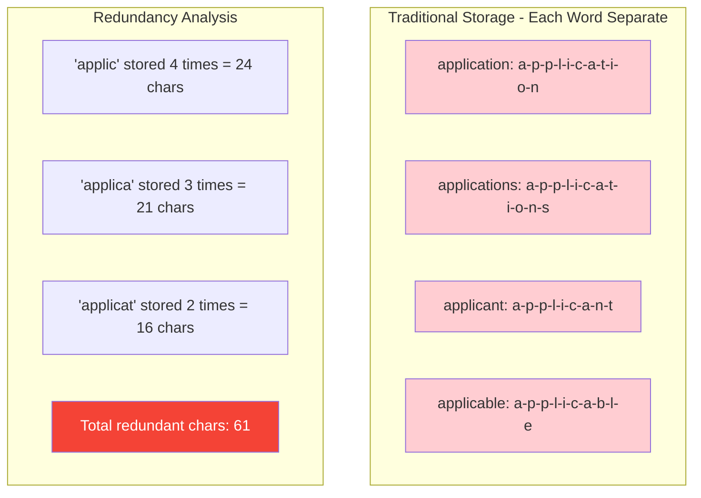
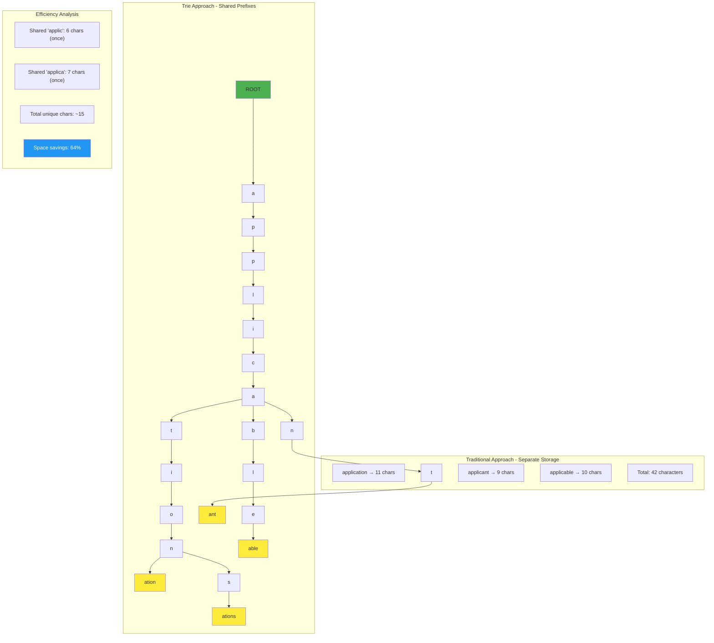

# The Core Problem: Fast Prefix-Based Search

## The Autocomplete Challenge

Every time you type in a search box and see instant suggestions, there's a sophisticated data structure working behind the scenes. The challenge: **How do you instantly find all words or phrases that start with a given prefix?**

Consider these common scenarios:
- **Search autocomplete**: Type "java" → see "javascript", "java programming", "javanese cuisine"
- **Code completion**: Type "str." → see "str.length()", "str.indexOf()", "str.substring()"
- **Dictionary lookup**: Type "pre" → see "precise", "predict", "prepare", "previous"
- **File system navigation**: Type "doc" → see "documents/", "docker/", "docs/"

The user expects **instant results** as they type each character. This requires a data structure that can efficiently answer the question: **"What are all the items that start with this prefix?"**

## Why Standard Data Structures Fall Short

### Hash Maps: Fast Lookup, Poor Prefix Search

Hash maps excel at exact key lookups but are terrible for prefix queries:

```python
# Hash map with 10,000 words
word_map = {
    "apple": True,
    "application": True,
    "apply": True,
    "appreciate": True,
    # ... 9,996 more words
}

# To find all words starting with "app":
def find_with_prefix(prefix):
    results = []
    for word in word_map:  # Must check EVERY word!
        if word.startswith(prefix):
            results.append(word)
    return results
```

**Problem**: O(n) time complexity where n is the total number of words. With millions of entries, this becomes unacceptably slow.

### Sorted Arrays: Better but Still Inefficient

```python
# Sorted list of words
words = ["apple", "application", "apply", "appreciate", "banana", "band", ...]

def find_with_prefix(prefix):
    # Binary search to find start position
    start = binary_search_first(words, prefix)
    results = []
    
    # Linear scan from start position
    i = start
    while i < len(words) and words[i].startswith(prefix):
        results.append(words[i])
        i += 1
    
    return results
```

**Better**: O(log n) to find the starting position, but still O(k) to collect all k matching results. The real problem: **we're still checking every character of every candidate word**.

### The Performance Bottleneck

Both approaches suffer from the same fundamental issue: **they don't exploit the shared structure of prefixes**.

Consider these words:
- "application"
- "applications" 
- "applicant"
- "applicable"



Traditional data structures store each word completely separately, even though they share the prefix "applic". This redundancy hurts both **time** (repeated character comparisons) and **space** (redundant storage).

## The Real-World Scale Challenge

Modern autocomplete systems face enormous scale:

**Google Search**: 
- Billions of search queries
- Needs suggestions in < 100ms
- Must handle typos and fuzzy matching

**IDE Code Completion**:
- Thousands of methods/variables in scope
- Must respond in < 50ms for good UX
- Needs context-aware filtering

**Mobile Keyboards**:
- Dictionary with 100,000+ words
- Must work on limited CPU/memory
- Battery efficiency matters

At this scale, even small inefficiencies become deal-breakers.

## The Memory Multiplication Problem

Standard storage approaches create massive redundancy:

```
Dictionary with 100,000 English words:
Average word length: 8 characters
Total storage (naive): 100,000 × 8 = 800,000 characters

But consider prefix overlap:
- 15,000 words start with "s"
- 8,000 words start with "st" 
- 3,000 words start with "str"
- 1,500 words start with "stra"

Redundant prefix storage: Millions of repeated characters!
```

**The insight**: If we could store each prefix only once and share it among all words that use it, we could dramatically reduce both storage and search time.

## What We Really Need

The ideal data structure for prefix search should:

1. **Share common prefixes** to minimize storage redundancy
2. **Navigate by character** without scanning entire words
3. **Exploit prefix structure** to prune search space quickly
4. **Scale gracefully** as vocabulary size grows
5. **Support fast insertion** for dynamic dictionaries

## The Core Insight

**Words with the same prefix should share storage for that prefix.**



This sharing creates a **tree structure** where:
- **Each path from root** represents a possible prefix
- **Each node** represents a character position
- **Shared prefixes** use shared tree paths
- **Finding all words with prefix P** means "find the node for P, then explore all paths beneath it"

## The Performance Promise

With the right tree-based approach:
- **Search time**: O(m + k) where m = prefix length, k = number of results
- **No wasted character comparisons**: Navigate directly to the prefix
- **Memory efficiency**: Share storage for common prefixes
- **Scalable**: Performance depends on prefix length, not total vocabulary size

The data structure that delivers on this promise is the **trie** (pronounced "try"), also known as a **prefix tree**. It transforms the autocomplete problem from "search through all words" to "navigate to a location and list what's there."

This fundamental shift in approach—from searching to navigating—is what makes tries so powerful for prefix-based operations.