# The Guiding Philosophy: Share Common Prefixes

## The Core Principle

Tries embody a simple yet powerful idea: **Share storage for common prefixes to eliminate redundancy and enable efficient navigation.**

Instead of storing each word independently, we build a tree where **each path from the root represents a key**, and keys that share prefixes share the same initial path through the tree.

## The Dictionary Analogy

Think of a trie like a specialized dictionary organized for **character-by-character lookup**:

### Traditional Dictionary
```
apple       [page 45]
application [page 47] 
apply       [page 48]
appreciate  [page 49]
```

To find all words starting with "app", you must:
1. Find the "app" section (binary search)
2. Scan linearly through all entries
3. Check each word's prefix character by character

### Trie Dictionary

```mermaid
graph TD
    ROOT[📖 ROOT]
    ROOT --> A[a]
    A --> P1[p]
    P1 --> P2[p]
    
    P2 --> L1[l]
    P2 --> R[r]
    
    L1 --> E[e] 
    E --> APPLE[🍎 apple]
    
    L1 --> I[i]
    I --> C[c]
    C --> A2[a]
    A2 --> T[t]
    T --> I2[i]
    I2 --> O[o]
    O --> N[n]
    N --> APP[📱 application]
    
    P2 --> L2[l]
    L2 --> Y[y]
    Y --> APPLY[✅ apply]
    
    R --> E2[e]
    E2 --> C2[c]
    C2 --> I3[i]
    I3 --> A3[a]
    A3 --> T2[t]
    T2 --> E3[e]
    E3 --> APPR[🙏 appreciate]
    
    style ROOT fill:#4caf50
    style P2 fill:#ffeb3b
    style APPLE fill:#ff9800
    style APP fill:#ff9800
    style APPLY fill:#ff9800
    style APPR fill:#ff9800
```



To find all words starting with "app":
1. Navigate: ROOT → a → p → p (3 steps)
2. Explore: List all complete words in the subtree below
3. No character-by-character comparison needed

## The Shared Path Philosophy

### Before: Redundant Storage
```
Storage for: "cat", "car", "card", "care", "careful"

Traditional approach:
"cat"     → c-a-t       (3 chars)
"car"     → c-a-r       (3 chars)  
"card"    → c-a-r-d     (4 chars)
"care"    → c-a-r-e     (4 chars)
"careful" → c-a-r-e-f-u-l (7 chars)

Total: 21 characters stored
Redundant "ca": 5 copies = 10 wasted chars
Redundant "car": 3 copies = 9 wasted chars
```

### After: Shared Prefixes

```mermaid
graph TD
    ROOT[🌳 ROOT]
    ROOT --> C[c]
    C --> A[a] 
    
    A --> T[t]
    T --> CAT[🐱 cat]
    
    A --> R[r]
    R --> CAR[🚗 car]
    R --> D[d]
    D --> CARD[💳 card]
    R --> E[e]
    E --> CARE[❤️ care]
    E --> F[f]
    F --> U[u]
    U --> L[l]
    L --> CAREFUL[⚠️ careful]
    
    subgraph "Shared Nodes Analysis"
        SH1["'c' shared by 5 words"]
        SH2["'ca' shared by 5 words"] 
        SH3["'car' shared by 4 words"]
        SH4["'care' shared by 2 words"]
        SH5["Total unique nodes: 9"]
        SH6["Space savings: 57%"]
    end
    
    style ROOT fill:#4caf50
    style A fill:#ffeb3b
    style R fill:#ffeb3b
    style CAT fill:#ff9800
    style CAR fill:#ff9800
    style CARD fill:#ff9800
    style CARE fill:#ff9800
    style CAREFUL fill:#ff9800
    style SH6 fill:#2196f3,color:#fff
```



**The insight**: Common prefixes are stored once and shared by all words that use them.

## Navigation vs. Search

### The Traditional Search Mindset
```python
def find_words_with_prefix(words, prefix):
    results = []
    for word in words:           # Check every word
        if word.startswith(prefix):  # Compare every character
            results.append(word)
    return results
```

**Philosophy**: "Check every item to see if it matches"

### The Trie Navigation Mindset
```python
def find_words_with_prefix(trie, prefix):
    current = trie.root
    
    # Navigate to the prefix (no searching needed)
    for char in prefix:
        if char not in current.children:
            return []  # Prefix doesn't exist
        current = current.children[char]
    
    # Collect all words in the subtree
    return collect_all_words(current)
```

**Philosophy**: "Navigate directly to the location, then list what's there"

## The Tree of Possibilities

A trie represents **all possible strings** as paths through a tree:

```
Trie containing: "a", "an", "and", "ant"

       ROOT
        |
        a ← Path represents "a"
       / \
    (END) n ← Path represents "an"  
         / \
      (END) t ← "ant"
            |
          d(END) ← "and"
```

**Key insights**:
- **Every node** represents a prefix
- **Every path** represents a possible string
- **Leaf nodes** (or nodes marked "END") represent complete words
- **Subtrees** contain all extensions of their prefix

## The Prefix Explosion Property

Tries excel when there's **high prefix overlap** in your dataset:

### High Overlap (Great for Tries)
```
Programming language keywords:
"abstract", "abstract class", "abstract method"
"interface", "interface default", "interface static"
"implements", "implementation", "implemented"

Result: Massive shared prefixes = Huge space savings
```

### Low Overlap (Less Beneficial)
```
Random UUIDs:
"a7b3c9d4-e5f6-7g8h-9i0j-k1l2m3n4o5p6"
"x9y8z7w6-v5u4-t3s2-r1q0-p9o8n7m6l5k4"

Result: Almost no shared prefixes = Little space savings
```

**Rule of thumb**: Tries shine when your data has natural linguistic or hierarchical structure.

## The Character-at-a-Time Philosophy

### Why Character-by-Character Matters

Traditional string comparison:
```python
if word.startswith("application"):
    # Must compare all 11 characters
    # Even if they match, must check all 11
```

Trie navigation:
```python
# Navigate: a → p → p → l → i → c → a → t → i → o → n
# Each step is O(1) hash lookup
# Stop immediately if any character is missing
```

**Advantage**: **Early termination** when a prefix doesn't exist, and **direct navigation** when it does.

## Memory Locality and Cache Efficiency

### The Spatial Locality Benefit

When exploring words with the same prefix:
```
Finding all words starting with "comp":
"computer", "complete", "compare", "compile"

Traditional storage: These words scattered throughout memory
Trie storage: All these words in the same subtree = better cache locality
```

### The Temporal Locality Benefit

Autocomplete queries often have patterns:
```
User types: "c" → "co" → "com" → "comp" → "compu"
Trie behavior: Navigate deeper in the same subtree
Cache benefit: Already loaded the "comp" subtree nodes
```

## The Composability Principle

Tries compose naturally with other operations:

### Easy Extensions
```python
# Word completion
def autocomplete(trie, prefix, limit=10):
    node = navigate_to(trie, prefix)
    return collect_words(node, limit)

# Spell checking (with small modifications)
def spell_check(trie, word):
    return fuzzy_search(trie, word, max_edits=1)

# Longest common prefix
def longest_common_prefix(trie, words):
    # Find deepest shared node
```

### Natural Hierarchies
```
File system paths:
  /usr/local/bin/
  /usr/local/lib/
  /usr/local/share/

Domain names:
  mail.google.com
  drive.google.com  
  docs.google.com
```

Tries naturally model hierarchical data where paths represent relationships.

## Trade-off Acceptance

Tries make explicit trade-offs that align with prefix-heavy workloads:

### What Tries Optimize For
- **Fast prefix queries**: O(m) where m = prefix length
- **Memory efficiency**: When high prefix overlap exists
- **Insertion simplicity**: Adding words is straightforward
- **Cache locality**: Related data stored together

### What Tries Trade Away
- **Random access**: Finding one specific word isn't faster than hash maps
- **Memory overhead**: Each node needs pointers for all possible characters
- **Sparse efficiency**: Poor performance when few prefixes are shared

## The Philosophy in Practice

The trie philosophy—"share common prefixes"—leads to several practical insights:

1. **Design for your data**: Tries work best when your strings have natural prefix structure
2. **Think in trees**: Every operation becomes tree traversal + collection
3. **Leverage navigation**: Don't search through options; navigate to the right location
4. **Accept overhead for structure**: The tree structure pays for itself when you have prefix queries

This philosophy makes tries particularly powerful for:
- **Autocomplete systems** (shared word prefixes)
- **IP routing tables** (shared network prefixes)  
- **File system structures** (shared path prefixes)
- **DNS resolution** (shared domain hierarchies)

The key insight: **When your data has natural prefix structure, tries let you navigate rather than search, making prefix operations remarkably efficient.**