# Building an Autocomplete System: A Hands-On Guide

## The Goal: A Working Autocomplete

We'll build a complete autocomplete system that can:
1. Store a vocabulary of words efficiently
2. Provide instant suggestions as the user types
3. Handle large dictionaries with good performance
4. Support features like ranking and limiting results

This hands-on guide will demonstrate the power of tries through practical implementation.

## Step 1: Basic Trie Implementation

Let's start with a simple but complete trie implementation. Here's what we're building:

```mermaid
graph TD
    subgraph "Trie Structure Overview"
        ROOT[🌳 ROOT<br/>TrieNode]
        ROOT --> A[a]
        ROOT --> B[b]
        ROOT --> C[c]
        
        A --> P[p]
        P --> P2[p]
        P2 --> L[l]
        L --> E[e]
        E --> APPLE[🍎 apple<br/>is_end_of_word=True]
        
        P2 --> L2[l]
        L2 --> I[i]
        I --> C2[c]
        C2 --> A2[a]
        A2 --> T[t]
        T --> I2[i]
        I2 --> O[o]
        O --> N[n]
        N --> APP[📱 application<br/>is_end_of_word=True]
        
        subgraph "Key Features"
            F1[Each node has children dict]
            F2[is_end_of_word flag marks complete words]
            F3[Navigation follows character path]
            F4[Shared prefixes = shared paths]
        end
    end
    
    style ROOT fill:#4caf50
    style APPLE fill:#ffeb3b
    style APP fill:#ffeb3b
    style F4 fill:#2196f3,color:#fff
```



```python
class TrieNode:
    def __init__(self):
        # Dictionary to store child nodes
        self.children = {}
        # Flag to mark end of a word
        self.is_end_of_word = False
        # Optional: store the complete word for easy retrieval
        self.word = None

class Trie:
    def __init__(self):
        # Root node represents empty string
        self.root = TrieNode()
        # Track total words for statistics
        self.word_count = 0
    
    def insert(self, word):
        """Insert a word into the trie."""
        current = self.root
        
        # Navigate/create path for each character
        for char in word.lower():  # Case-insensitive
            if char not in current.children:
                current.children[char] = TrieNode()
            current = current.children[char]
        
        # Mark the end of word and store it
        if not current.is_end_of_word:
            current.is_end_of_word = True
            current.word = word
            self.word_count += 1
    
    def search(self, word):
        """Check if a word exists in the trie."""
        current = self.root
        
        # Follow the path character by character
        for char in word.lower():
            if char not in current.children:
                return False
            current = current.children[char]
        
        # Word exists only if we end at a word marker
        return current.is_end_of_word
    
    def _find_node(self, prefix):
        """Helper: find the node representing a prefix."""
        current = self.root
        
        for char in prefix.lower():
            if char not in current.children:
                return None
            current = current.children[char]
        
        return current
    
    def _collect_words(self, node, words_list):
        """Helper: collect all words in a subtree."""
        if node.is_end_of_word:
            words_list.append(node.word)
        
        # Recursively collect from all children
        for child in node.children.values():
            self._collect_words(child, words_list)
    
    def get_suggestions(self, prefix, max_suggestions=10):
        """Get all words that start with the given prefix."""
        # Find the node representing the prefix
        prefix_node = self._find_node(prefix)
        
        if prefix_node is None:
            return []  # Prefix doesn't exist
        
        # Collect all words in the subtree
        suggestions = []
        self._collect_words(prefix_node, suggestions)
        
        # Limit results if requested
        return suggestions[:max_suggestions]
```

## Step 2: Testing the Basic Implementation

```python
def test_basic_trie():
    # Create a trie and add some words
    trie = Trie()
    
    words = [
        "apple", "application", "apply", "appreciate",
        "car", "card", "care", "careful", "careless",
        "cat", "catch", "category",
        "dog", "door", "double"
    ]
    
    print("Building trie with words:", words)
    for word in words:
        trie.insert(word)
    
    print(f"Total words inserted: {trie.word_count}")
    
    # Test exact search
    print("\n=== Exact Search Tests ===")
    test_words = ["apple", "car", "xyz", "app"]
    for word in test_words:
        exists = trie.search(word)
        print(f"'{word}' exists: {exists}")
    
    # Test autocomplete
    print("\n=== Autocomplete Tests ===")
    test_prefixes = ["app", "car", "ca", "d", "xyz"]
    for prefix in test_prefixes:
        suggestions = trie.get_suggestions(prefix)
        print(f"'{prefix}' → {suggestions}")

# Run the test
test_basic_trie()
```

### Visual Representation of Autocomplete Search

Let's trace how searching for prefix "app" works:

```mermaid
graph TD
    subgraph "Step 1: Navigate to Prefix 'app'"
        ROOT[🌳 ROOT] 
        ROOT -->|"Navigate 'a'"| A[a]
        A -->|"Navigate 'p'"| P1[p]
        P1 -->|"Navigate 'p'"| P2[p ⭐ PREFIX FOUND]
        
        style ROOT fill:#e3f2fd
        style A fill:#e8f5e8
        style P1 fill:#fff3e0
        style P2 fill:#ff9800
    end
    
    subgraph "Step 2: Collect All Words in Subtree"
        P2 --> L1[l]
        P2 --> R[r]
        
        L1 --> E[e]
        E --> APPLE[🍎 apple]
        
        L1 --> I[i]
        I --> C[c]
        C --> A2[a]
        A2 --> T[t]
        T --> I2[i]
        I2 --> O[o]
        O --> N[n]
        N --> APP[📱 application]
        
        L1 --> Y[y]
        Y --> APPLY[✅ apply]
        
        R --> E2[e]
        E2 --> C2[c]
        E2 --> I3[i]
        I3 --> A3[a]
        A3 --> T2[t]
        T2 --> E3[e]
        E3 --> APPR[🙏 appreciate]
        
        style APPLE fill:#4caf50
        style APP fill:#4caf50
        style APPLY fill:#4caf50
        style APPR fill:#4caf50
    end
```



**Algorithm Steps:**
1. **Navigate**: Follow path ROOT → a → p → p (3 character comparisons)
2. **Collect**: Explore all paths beneath the "app" node
3. **Return**: ["apple", "application", "apply", "appreciate"]

**Time Complexity**: O(prefix_length + num_results) = O(3 + 4) = O(7)

**Expected Output:**
```
Building trie with words: ['apple', 'application', 'apply', 'appreciate', ...]
Total words inserted: 13

=== Exact Search Tests ===
'apple' exists: True
'car' exists: True
'xyz' exists: False
'app' exists: False

=== Autocomplete Tests ===
'app' → ['apple', 'application', 'apply', 'appreciate']
'car' → ['car', 'card', 'care', 'careful', 'careless']
'ca' → ['car', 'card', 'care', 'careful', 'careless', 'cat', 'catch', 'category']
'd' → ['dog', 'door', 'double']
'xyz' → []
```

## Step 3: Enhanced Autocomplete with Ranking

Real autocomplete systems need to rank suggestions by relevance. Let's add frequency-based ranking:

```python
class RankedTrieNode:
    def __init__(self):
        self.children = {}
        self.is_end_of_word = False
        self.word = None
        self.frequency = 0  # How often this word is used

class RankedTrie:
    def __init__(self):
        self.root = RankedTrieNode()
        self.word_count = 0
    
    def insert(self, word, frequency=1):
        """Insert a word with an optional frequency weight."""
        current = self.root
        
        for char in word.lower():
            if char not in current.children:
                current.children[char] = RankedTrieNode()
            current = current.children[char]
        
        if not current.is_end_of_word:
            current.is_end_of_word = True
            current.word = word
            current.frequency = frequency
            self.word_count += 1
        else:
            # Update frequency if word already exists
            current.frequency += frequency
    
    def _find_node(self, prefix):
        current = self.root
        for char in prefix.lower():
            if char not in current.children:
                return None
            current = current.children[char]
        return current
    
    def _collect_ranked_words(self, node, words_list):
        """Collect words with their frequencies."""
        if node.is_end_of_word:
            words_list.append((node.word, node.frequency))
        
        for child in node.children.values():
            self._collect_ranked_words(child, words_list)
    
    def get_suggestions(self, prefix, max_suggestions=10):
        """Get suggestions ranked by frequency."""
        prefix_node = self._find_node(prefix)
        
        if prefix_node is None:
            return []
        
        # Collect words with frequencies
        word_freq_pairs = []
        self._collect_ranked_words(prefix_node, word_freq_pairs)
        
        # Sort by frequency (descending) then alphabetically
        word_freq_pairs.sort(key=lambda x: (-x[1], x[0]))
        
        # Return just the words, limited by max_suggestions
        return [word for word, freq in word_freq_pairs[:max_suggestions]]
```

## Step 4: Real-World Dictionary Example

Let's build an autocomplete system using a realistic English dictionary:

```python
def build_english_autocomplete():
    """Build an autocomplete system with common English words."""
    
    # Sample of common English words with realistic frequencies
    # (In practice, you'd load this from a large dictionary file)
    word_frequencies = {
        # Common words (high frequency)
        "the": 1000, "and": 800, "you": 700, "that": 600,
        "was": 500, "for": 450, "are": 400, "with": 350,
        
        # Technology words
        "computer": 100, "internet": 90, "website": 85,
        "application": 80, "software": 75, "technology": 70,
        "programming": 65, "javascript": 60, "python": 55,
        
        # Common prefixes for testing
        "apple": 50, "application": 80, "apply": 40, "appreciate": 30,
        "car": 60, "card": 45, "care": 40, "careful": 35, "careless": 20,
        "cat": 55, "catch": 35, "category": 25,
        
        # More words for comprehensive testing
        "search": 70, "secure": 45, "server": 65, "service": 60,
        "system": 80, "software": 75, "support": 55,
        "development": 70, "developer": 65, "database": 60,
        "network": 55, "performance": 50, "security": 65
    }
    
    # Build the trie
    autocomplete = RankedTrie()
    
    print("Building autocomplete system...")
    for word, frequency in word_frequencies.items():
        autocomplete.insert(word, frequency)
    
    print(f"Loaded {autocomplete.word_count} words")
    
    return autocomplete

def interactive_autocomplete_demo():
    """Interactive demo of the autocomplete system."""
    autocomplete = build_english_autocomplete()
    
    print("\n" + "="*50)
    print("🔍 AUTOCOMPLETE DEMO")
    print("="*50)
    print("Type a prefix to see suggestions (or 'quit' to exit)")
    print("Examples: 'app', 'car', 'tech', 'dev', 'se'")
    
    while True:
        prefix = input("\nEnter prefix: ").strip()
        
        if prefix.lower() == 'quit':
            break
        
        if not prefix:
            continue
        
        suggestions = autocomplete.get_suggestions(prefix, max_suggestions=8)
        
        if suggestions:
            print(f"\n💡 Suggestions for '{prefix}':")
            for i, suggestion in enumerate(suggestions, 1):
                print(f"  {i}. {suggestion}")
        else:
            print(f"\n❌ No suggestions found for '{prefix}'")

# Run the demo
interactive_autocomplete_demo()
```

## Step 5: Performance Analysis

Let's analyze the performance characteristics of our trie-based autocomplete:

```python
import time
import random
import string

def performance_test():
    """Test autocomplete performance with large datasets."""
    
    def generate_random_words(count, min_length=3, max_length=12):
        """Generate random words for testing."""
        words = []
        for _ in range(count):
            length = random.randint(min_length, max_length)
            word = ''.join(random.choice(string.ascii_lowercase) 
                          for _ in range(length))
            words.append(word)
        return words
    
    # Test with different dataset sizes
    sizes = [1000, 5000, 10000, 50000]
    
    for size in sizes:
        print(f"\n=== Testing with {size:,} words ===")
        
        # Generate test data
        words = generate_random_words(size)
        autocomplete = RankedTrie()
        
        # Time insertion
        start_time = time.time()
        for word in words:
            autocomplete.insert(word)
        insert_time = time.time() - start_time
        
        # Test search performance
        test_prefixes = ["a", "ab", "abc", "test", "xyz"]
        search_times = []
        
        for prefix in test_prefixes:
            start_time = time.time()
            suggestions = autocomplete.get_suggestions(prefix, max_suggestions=10)
            search_time = time.time() - start_time
            search_times.append(search_time)
        
        avg_search_time = sum(search_times) / len(search_times)
        
        print(f"  Insertion time: {insert_time:.4f}s ({insert_time/size*1000:.2f}ms per word)")
        print(f"  Average search time: {avg_search_time*1000:.2f}ms")
        print(f"  Words per second (insertion): {size/insert_time:,.0f}")

def memory_usage_analysis():
    """Analyze memory usage patterns."""
    import sys
    
    # Compare trie vs. simple list for prefix search
    words = ["apple", "application", "apply", "appreciate", 
             "car", "card", "care", "careful", "careless"]
    
    # Method 1: Simple list
    word_list = words.copy()
    list_size = sys.getsizeof(word_list) + sum(sys.getsizeof(word) for word in word_list)
    
    # Method 2: Trie
    trie = Trie()
    for word in words:
        trie.insert(word)
    
    # Rough trie size estimation (nodes + strings)
    def estimate_trie_size(node):
        size = sys.getsizeof(node.children) + sys.getsizeof(node.is_end_of_word)
        if node.word:
            size += sys.getsizeof(node.word)
        for child in node.children.values():
            size += estimate_trie_size(child)
        return size
    
    trie_size = estimate_trie_size(trie.root)
    
    print("\n=== Memory Usage Comparison ===")
    print(f"Simple list: {list_size:,} bytes")
    print(f"Trie structure: {trie_size:,} bytes")
    print(f"Space ratio: {trie_size/list_size:.2f}x")
    
    # Test prefix search performance
    def list_prefix_search(word_list, prefix):
        return [word for word in word_list if word.startswith(prefix)]
    
    test_prefix = "app"
    
    # Time both approaches
    start = time.time()
    for _ in range(10000):
        list_result = list_prefix_search(word_list, test_prefix)
    list_time = time.time() - start
    
    start = time.time()
    for _ in range(10000):
        trie_result = trie.get_suggestions(test_prefix)
    trie_time = time.time() - start
    
    print(f"\nPrefix search '{test_prefix}' (10,000 iterations):")
    print(f"List approach: {list_time:.4f}s")
    print(f"Trie approach: {trie_time:.4f}s")
    print(f"Speedup: {list_time/trie_time:.2f}x")

# Run performance tests
performance_test()
memory_usage_analysis()
```

## Step 6: Advanced Features

Here are some advanced features you can add to your autocomplete system:

### Fuzzy Matching (Typo Tolerance)

```python
def fuzzy_suggestions(self, prefix, max_distance=1, max_suggestions=10):
    """Get suggestions that are within edit distance of the prefix."""
    
    def edit_distance(s1, s2):
        """Calculate Levenshtein distance between two strings."""
        if len(s1) < len(s2):
            return edit_distance(s2, s1)
        
        if len(s2) == 0:
            return len(s1)
        
        previous_row = list(range(len(s2) + 1))
        for i, c1 in enumerate(s1):
            current_row = [i + 1]
            for j, c2 in enumerate(s2):
                insertions = previous_row[j + 1] + 1
                deletions = current_row[j] + 1
                substitutions = previous_row[j] + (c1 != c2)
                current_row.append(min(insertions, deletions, substitutions))
            previous_row = current_row
        
        return previous_row[-1]
    
    def collect_fuzzy_words(node, current_prefix, target_prefix):
        words = []
        
        if node.is_end_of_word:
            distance = edit_distance(current_prefix, target_prefix)
            if distance <= max_distance:
                words.append((node.word, distance))
        
        for char, child in node.children.items():
            words.extend(collect_fuzzy_words(child, current_prefix + char, target_prefix))
        
        return words
    
    # Collect all words with acceptable edit distance
    fuzzy_words = collect_fuzzy_words(self.root, "", prefix)
    
    # Sort by edit distance, then frequency
    fuzzy_words.sort(key=lambda x: (x[1], -getattr(self._find_word_node(x[0]), 'frequency', 0)))
    
    return [word for word, distance in fuzzy_words[:max_suggestions]]
```

### Context-Aware Suggestions

```python
class ContextAwareTrie(RankedTrie):
    def __init__(self):
        super().__init__()
        self.context_history = []
    
    def add_context(self, word):
        """Add a word to the context history."""
        self.context_history.append(word.lower())
        # Keep only recent context
        if len(self.context_history) > 5:
            self.context_history.pop(0)
    
    def get_contextual_suggestions(self, prefix, max_suggestions=10):
        """Get suggestions influenced by recent context."""
        base_suggestions = self.get_suggestions(prefix, max_suggestions * 2)
        
        # Boost suggestions that relate to recent context
        scored_suggestions = []
        for suggestion in base_suggestions:
            score = self._calculate_context_score(suggestion)
            scored_suggestions.append((suggestion, score))
        
        # Sort by context score
        scored_suggestions.sort(key=lambda x: x[1], reverse=True)
        
        return [word for word, score in scored_suggestions[:max_suggestions]]
    
    def _calculate_context_score(self, word):
        """Calculate relevance score based on context."""
        base_score = 1.0
        
        # Boost if word shares prefixes with context
        for context_word in self.context_history:
            if word.startswith(context_word[:3]):
                base_score += 0.5
            if context_word.startswith(word[:3]):
                base_score += 0.3
        
        return base_score
```

## Key Takeaways

This hands-on guide demonstrates several important principles:

1. **Incremental Development**: We built from basic to advanced features
2. **Performance Characteristics**: Tries excel at prefix operations
3. **Memory Trade-offs**: Structure overhead pays for itself with many shared prefixes
4. **Real-world Features**: Ranking, fuzzy matching, and context awareness
5. **Extensibility**: The basic trie structure supports many enhancements

The trie-based autocomplete system provides:
- **O(m)** search time where m = prefix length
- **Efficient memory usage** when prefixes are shared
- **Natural ranking** and filtering capabilities
- **Easy extension** for advanced features

This makes tries the go-to data structure for autocomplete, spell checking, and any application requiring fast prefix-based search.