# Deep Dive: Tries vs Hash Maps - The Performance and Memory Trade-offs

## The Fundamental Question

When should you choose a trie over a hash map for storing and searching strings? The answer depends on your specific use case, but understanding the trade-offs is crucial for making the right architectural decision.

Both data structures solve the string storage problem differently, leading to dramatically different performance characteristics for different operations.

## The Direct Comparison

### Hash Map Approach

```python
class HashMapStringStore:
    def __init__(self):
        self.words = set()  # Or dict for additional data
        
    def insert(self, word):
        self.words.add(word)  # O(1) average
        
    def search(self, word):
        return word in self.words  # O(1) average
        
    def prefix_search(self, prefix):
        # Must check every word!
        return [word for word in self.words 
                if word.startswith(prefix)]  # O(n * m)
```

### Trie Approach

```python
class TrieStringStore:
    def __init__(self):
        self.root = TrieNode()
        
    def insert(self, word):
        # Navigate/create path
        current = self.root
        for char in word:
            if char not in current.children:
                current.children[char] = TrieNode()
            current = current.children[char]
        current.is_end_of_word = True  # O(m) where m = word length
        
    def search(self, word):
        current = self.root
        for char in word:
            if char not in current.children:
                return False
            current = current.children[char]
        return current.is_end_of_word  # O(m)
        
    def prefix_search(self, prefix):
        # Navigate to prefix, then collect subtree
        current = self.root
        for char in prefix:
            if char not in current.children:
                return []
            current = current.children[char]
        return self._collect_words(current)  # O(p + k) where p = prefix length, k = results
```

## Performance Analysis

```mermaid
graph TB
    subgraph "Operation Performance Comparison"
        subgraph "Hash Map Performance"
            HM1[Exact Lookup: O(1) average]
            HM2[Prefix Search: O(n×m)]
            HM3[Insert: O(1) average]
            HM4[Memory: High overhead for sparse prefixes]
        end
        
        subgraph "Trie Performance"
            T1[Exact Lookup: O(m)]
            T2[Prefix Search: O(p+k)]
            T3[Insert: O(m)]
            T4[Memory: Efficient for shared prefixes]
        end
        
        subgraph "Performance Scaling"
            PS1[10K words: Hash wins exact lookup]
            PS2[10K words: Trie wins prefix search]
            PS3[100K words: Gap widens]
            PS4[1M words: Trie dominates prefix ops]
        end
    end
    
    style HM1 fill:#4caf50
    style HM2 fill:#f44336
    style T1 fill:#ff9800
    style T2 fill:#4caf50
    style PS2 fill:#2196f3,color:#fff
    style PS4 fill:#2196f3,color:#fff
```

### Exact Word Lookup

**Hash Map**: O(1) average, O(n) worst case
- **Pros**: Fastest possible for exact lookups
- **Cons**: Depends on hash function quality

**Trie**: O(m) where m = word length  
- **Pros**: Predictable performance
- **Cons**: Slower than hash map for exact matches

```python
import time

def benchmark_exact_lookup():
    words = ["programming", "algorithm", "data", "structure", "computer"] * 1000
    
    # Hash map setup
    hash_map = set(words)
    
    # Trie setup  
    trie = Trie()
    for word in words:
        trie.insert(word)
    
    target = "programming"
    iterations = 100000
    
    # Benchmark hash map
    start = time.time()
    for _ in range(iterations):
        result = target in hash_map
    hash_time = time.time() - start
    
    # Benchmark trie
    start = time.time()
    for _ in range(iterations):
        result = trie.search(target)
    trie_time = time.time() - start
    
    print(f"Hash map: {hash_time:.4f}s")
    print(f"Trie: {trie_time:.4f}s")
    print(f"Hash map is {trie_time/hash_time:.1f}x faster for exact lookup")
```

**Result**: Hash maps are typically 2-5x faster for exact word lookups.

### Prefix Search

**Hash Map**: O(n * m) where n = total words, m = average word length
- Must examine every word to check if it starts with the prefix

**Trie**: O(p + k) where p = prefix length, k = number of matching words
- Navigate directly to prefix location, then collect results

```python
def benchmark_prefix_search():
    # Generate test data with shared prefixes
    prefixes = ["prog", "algo", "data", "comp", "struct"]
    words = []
    
    for prefix in prefixes:
        for i in range(200):  # 200 words per prefix
            words.append(f"{prefix}word{i}")
    
    # Add some random words
    import random
    import string
    for _ in range(1000):
        word = ''.join(random.choice(string.ascii_lowercase) for _ in range(8))
        words.append(word)
    
    print(f"Testing with {len(words)} words")
    
    # Setup
    hash_map = set(words)
    trie = Trie()
    for word in words:
        trie.insert(word)
    
    test_prefix = "prog"
    iterations = 1000
    
    # Benchmark hash map prefix search
    start = time.time()
    for _ in range(iterations):
        results = [word for word in hash_map if word.startswith(test_prefix)]
    hash_time = time.time() - start
    
    # Benchmark trie prefix search
    start = time.time()
    for _ in range(iterations):
        results = trie.get_suggestions(test_prefix)
    trie_time = time.time() - start
    
    print(f"Prefix search for '{test_prefix}':")
    print(f"Hash map: {hash_time:.4f}s")
    print(f"Trie: {trie_time:.4f}s")
    print(f"Trie is {hash_time/trie_time:.1f}x faster for prefix search")
```

**Result**: Tries are typically 10-100x faster for prefix search, with the advantage growing as vocabulary size increases.

## Memory Analysis

### Memory Overhead

**Hash Map**:
```python
# For word "programming"
hash_entry = {
    "hash": hash("programming"),     # 8 bytes
    "string": "programming",         # 11 + overhead bytes
    "bucket_pointer": pointer        # 8 bytes
}
# Total: ~35-40 bytes per word + hash table overhead
```

**Trie**:
```python
# For word "programming" 
# Creates nodes: p-r-o-g-r-a-m-m-i-n-g (11 nodes)
trie_path = {
    "nodes": 11 * node_size,        # 11 * (dict + flags) ≈ 11 * 64 = 704 bytes
    "shared_with_other_words": True  # But shared prefixes reduce this!
}
```

### The Shared Prefix Advantage

The memory comparison becomes more complex when considering shared prefixes:

```python
def analyze_memory_efficiency():
    # Test with high prefix overlap
    word_sets = {
        "high_overlap": [
            "program", "programmer", "programming", "programmatic",
            "application", "applications", "applicant", "applicable",
            "development", "developer", "developing", "developed"
        ],
        "low_overlap": [
            "cat", "dog", "bird", "fish", "mouse", "elephant", 
            "tiger", "lion", "bear", "wolf", "fox", "rabbit"
        ]
    }
    
    for overlap_type, words in word_sets.items():
        print(f"\n=== {overlap_type.upper()} OVERLAP ===")
        
        # Hash map memory (rough estimation)
        hash_memory = sum(len(word) + 32 for word in words)  # string + overhead
        
        # Trie memory estimation
        trie = Trie()
        for word in words:
            trie.insert(word)
        
        # Count unique character positions in trie
        def count_nodes(node):
            count = 1  # Current node
            for child in node.children.values():
                count += count_nodes(child)
            return count
        
        trie_nodes = count_nodes(trie.root)
        trie_memory = trie_nodes * 64  # Rough node size
        
        print(f"Words: {len(words)}")
        print(f"Hash map memory: ~{hash_memory} bytes")
        print(f"Trie memory: ~{trie_memory} bytes") 
        print(f"Trie efficiency: {hash_memory/trie_memory:.2f}x")
        
        # Calculate prefix sharing
        total_chars = sum(len(word) for word in words)
        unique_chars = trie_nodes - 1  # Subtract root
        sharing_ratio = total_chars / unique_chars
        print(f"Character sharing: {sharing_ratio:.2f}x")

analyze_memory_efficiency()
```

**Key findings**:
- **High prefix overlap**: Tries use 30-70% less memory
- **Low prefix overlap**: Hash maps use 20-40% less memory
- **Crossover point**: Around 20-30% prefix sharing

## When to Choose Each

### Choose Hash Maps When:

#### 1. Exact Lookup Dominant
```python
# Dictionary/spell checker - mostly exact word verification
def spell_check(word, dictionary):
    return word.lower() in dictionary  # Hash map wins
```

#### 2. Random String Data  
```python
# UUIDs, random tokens, crypto hashes
data = [
    "a7b3c9d4-e5f6-7g8h-9i0j-k1l2m3n4o5p6",
    "x9y8z7w6-v5u4-t3s2-r1q0-p9o8n7m6l5k4",
    # No shared prefixes = trie overhead with no benefit
]
```

#### 3. Memory-Constrained Environments
```python
# Embedded systems, mobile apps with limited memory
# Hash maps have lower overhead for sparse prefix data
```

#### 4. Simple Implementation Requirements
```python
# When development time is critical
words = set()  # Simple and effective for basic operations
```

### Choose Tries When:

#### 1. Prefix Search Dominant
```python
# Autocomplete, search suggestions
def autocomplete(prefix, trie):
    return trie.get_suggestions(prefix)  # Trie wins decisively
```

#### 2. Natural Language Data
```python
# English dictionary, code completion, file paths
# High prefix overlap makes tries very memory efficient
words = ["programming", "programmer", "program", "programmatic"]
```

#### 3. Range Queries on Strings
```python
# Find all words between "apple" and "application"
def range_query(trie, start, end):
    # Trie structure naturally supports lexicographic ranges
    pass
```

#### 4. Pattern Matching Extensions
```python
# Wildcard search, regex-like operations
# Tries extend naturally to these use cases
```

## Advanced Considerations

### Cache Performance

**Hash Maps**:
- **Good**: Compact memory layout for small datasets
- **Bad**: Random memory access patterns during collision resolution

**Tries**:
- **Good**: Tree traversal has good spatial locality
- **Bad**: Pointer chasing can cause cache misses

### Concurrent Access

**Hash Maps**:
- **Challenging**: Resizing requires global locks
- **Complex**: Lock-free implementations are very difficult

**Tries**:
- **Easier**: Reads are naturally lock-free
- **Localized**: Modifications affect only specific paths

### Dynamic Operations

**Hash Maps**:
```python
# Deletion is simple
del hash_map[key]  # O(1)

# But may trigger expensive resize
if load_factor < 0.25:
    resize_hash_table()  # O(n)
```

**Tries**:
```python
# Deletion requires cleanup
def delete(self, word):
    # Mark as not end-of-word
    # Clean up unused nodes (complex but localized)
    pass  # O(m) but may require tree pruning
```

## Hybrid Approaches

### Hash-Trie Hybrid
```python
class HashTrie:
    def __init__(self):
        self.hash_map = {}  # For exact lookups
        self.trie = Trie()  # For prefix searches
    
    def insert(self, word):
        self.hash_map[word] = True  # O(1) exact lookup
        self.trie.insert(word)      # O(m) prefix capability
    
    def search(self, word):
        return word in self.hash_map  # Use hash map for speed
    
    def prefix_search(self, prefix):
        return self.trie.get_suggestions(prefix)  # Use trie for prefix
```

**Trade-off**: 2x memory usage for best-of-both performance.

### Compressed Tries (Radix Trees)
```python
# Compress single-child chains to reduce memory overhead
# "cat" -> "dog" path becomes single edge labeled "at" -> "og"
```

**Benefits**: Reduces trie memory overhead while maintaining prefix search speed.

## The Decision Matrix

```mermaid
graph TB
    subgraph "Decision Framework"
        subgraph "Choose Hash Maps When..."
            HM1[🎯 Exact lookup dominant<br/>Spell checkers, dictionaries]
            HM2[🎲 Random string data<br/>UUIDs, tokens, hashes]
            HM3[📱 Memory-constrained<br/>Embedded systems, mobile]
            HM4[⚡ Simple implementation<br/>Rapid prototyping]
        end
        
        subgraph "Choose Tries When..."
            T1[🔍 Prefix search dominant<br/>Autocomplete, suggestions]
            T2[📝 Natural language data<br/>Dictionaries, code completion]
            T3[📂 Hierarchical data<br/>File paths, domain names]
            T4[🔧 Pattern matching needs<br/>Wildcards, regex extensions]
        end
        
        subgraph "Use Case Examples"
            UC1[Google Search → Hash + Trie]
            UC2[IDE Completion → Trie]
            UC3[Password Storage → Hash]
            UC4[IP Routing → Trie]
            UC5[Database Index → Depends]
        end
    end
    
    style T1 fill:#4caf50
    style T2 fill:#4caf50
    style HM1 fill:#ff9800
    style HM2 fill:#ff9800
    style UC2 fill:#2196f3,color:#fff
    style UC4 fill:#2196f3,color:#fff
```



| Use Case | Data Characteristics | Winner | Reason |
|----------|---------------------|---------|---------|
| Dictionary lookup | Natural language | Hash Map | Exact matches dominate |
| Autocomplete | Natural language | Trie | Prefix searches dominate |
| Token validation | Random strings | Hash Map | No prefix sharing |
| File path completion | Hierarchical paths | Trie | High prefix sharing |
| IP routing | Network prefixes | Trie | Prefix matching essential |
| Database indexes | Mixed patterns | Depends | Analyze query patterns |

## Conclusion

The choice between tries and hash maps isn't binary—it depends on:

1. **Operation mix**: Exact lookup vs. prefix search frequency
2. **Data characteristics**: Prefix sharing vs. random distribution  
3. **Memory constraints**: Available memory vs. performance needs
4. **Implementation complexity**: Development time vs. optimization

**Rule of thumb**: If >20% of your operations are prefix-based and your data has natural prefix structure, tries are likely the better choice. Otherwise, hash maps provide simpler implementation with better exact-match performance.

The key insight: **Choose the data structure that optimizes for your dominant operations, not your edge cases.**