# The Core Problem: Atomic Transactions Across Distributed Systems

## The Fundamental Challenge

Imagine you're building a banking system. A customer wants to transfer $100 from their checking account to their savings account. In a single database, this is straightforward:

```sql
BEGIN TRANSACTION;
UPDATE accounts SET balance = balance - 100 WHERE account_id = 'checking_123';
UPDATE accounts SET balance = balance + 100 WHERE account_id = 'savings_456';
COMMIT;
```

The database guarantees that either both updates succeed or both fail. This is called **atomicity** - the "A" in ACID properties.

But what happens when your checking and savings accounts live in different databases? Perhaps they're in different data centers, different cloud providers, or even different countries for regulatory reasons.

Now you have a problem: **How do you ensure atomicity across multiple independent systems?**

## The Distributed Transaction Problem

Consider this scenario:


Your application needs to:
1. Deduct $100 from checking account in Database A
2. Add $100 to savings account in Database B

**The Critical Question**: What happens if one succeeds and the other fails?

What could go wrong?

### Failure Scenario 1: Database B Fails After A Succeeds

```mermaid
sequenceDiagram
    participant App as Application
    participant A as Database A<br/>(Checking)
    participant B as Database B<br/>(Savings)
    
    App->>A: Deduct $100
    A->>App: ✓ SUCCESS ($900 remaining)
    
    App->>B: Add $100
    B->>App: ✗ NETWORK FAILURE
    
    Note over App,B: Result: $100 vanished!
    Note over A: Balance: $900 (missing $100)
    Note over B: Balance: $500 (unchanged)
```



**Result**: $100 vanished from the system. The customer's money is gone.

### Failure Scenario 2: Database A Fails After B Succeeds

```mermaid
sequenceDiagram
    participant App as Application
    participant A as Database A<br/>(Checking)
    participant B as Database B<br/>(Savings)
    
    App->>A: Deduct $100
    A->>App: ✗ DISK FAILURE
    
    App->>B: Add $100
    B->>App: ✓ SUCCESS ($600 total)
    
    Note over App,B: Result: $100 appeared from nowhere!
    Note over A: Balance: $1000 (unchanged)
    Note over B: Balance: $600 (extra $100)
```



**Result**: $100 appeared from nowhere. The bank lost money.

### Failure Scenario 3: Partial Success with Network Partitions

```mermaid
sequenceDiagram
    participant App as Application
    participant A as Database A<br/>(Checking)
    participant B as Database B<br/>(Savings)
    
    App->>A: Deduct $100
    A->>App: ✓ SUCCESS ($900 remaining)
    
    Note over App,B: Network partition occurs
    
    App->>B: Add $100
    Note over B: ? UNKNOWN STATUS
    
    Note over App,B: Result: Indeterminate state!
    Note over A: Balance: $900 (definitely changed)
    Note over B: Balance: $500 or $600 (unknown)
```



**Result**: You don't know if the money was added to savings. The transaction is in an indeterminate state.

## The Domino Effect of Failures

These scenarios illustrate why distributed transactions are so challenging:


## Why This Problem Is Hard

### 1. **Network Unreliability**
Networks can fail, partition, or introduce arbitrary delays. A system might be working fine but unreachable.


**The Challenge**: How do you distinguish between a slow system and a failed system?

### 2. **Independent Failures**
Each database can fail independently. One might be running normally while another crashes.


**The Challenge**: Systems fail at the worst possible moments - after they've partially processed your request.

### 3. **No Global Clock**
There's no universal timestamp that all systems agree on. Determining the order of events across systems is challenging.


**The Challenge**: Without synchronized clocks, it's impossible to determine the true order of events.

### 4. **Partial Information**
When a system fails, you don't know if it processed your request before failing or if it failed while processing.


**The Challenge**: Uncertainty about system state makes recovery decisions extremely difficult.

## The Distributed Systems Trilemma

These challenges reflect a fundamental tension in distributed systems:


**CAP Theorem**: In the presence of network partitions, you must choose between consistency and availability.

## The Need for Distributed Consensus

What we need is a protocol that ensures:

- **All-or-nothing**: Either all databases commit the transaction or all abort it
- **Consistency**: The system remains in a valid state
- **Fault tolerance**: The protocol can handle reasonable failures
- **Termination**: The protocol eventually reaches a decision

This is exactly what **Two-Phase Commit (2PC)** attempts to solve.

## Real-World Examples

### E-commerce Order Processing

```mermaid
flowchart TD
    A["Customer Places Order"] --> B["Inventory Service"]
    A --> C["Payment Service"]
    A --> D["Shipping Service"]
    
    B --> E["Reserve Items"]
    C --> F["Charge Credit Card"]
    D --> G["Create Shipment"]
    
    E --> H{"All Services<br/>Successful?"}
    F --> H
    G --> H
    
    H -->|Yes| I["✓ Order Confirmed"]
    H -->|No| J["✗ Order Cancelled<br/>All operations reversed"]
    
    style I fill:#ccffcc
    style J fill:#ffcccc
```



**Challenge**: If payment succeeds but inventory reservation fails, you've charged the customer for items you can't deliver.

### Microservices Architecture

```mermaid
sequenceDiagram
    participant U as User
    participant US as User Service
    participant ES as Email Service
    participant AS as Analytics Service
    
    U->>US: Sign up
    US->>US: Create account
    US->>ES: Send welcome email
    US->>AS: Track signup event
    
    alt All services succeed
        ES->>US: Email sent ✓
        AS->>US: Event tracked ✓
        US->>U: Signup complete ✓
    else Any service fails
        ES->>US: Email failed ✗
        US->>US: Rollback account creation
        US->>U: Signup failed ✗
    end
```



**Challenge**: The signup should be atomic across all services - if any part fails, the entire operation should be reversed.

### Financial Systems

```mermaid
graph TD
    A["Money Transfer Request"] --> B["Account Service"]
    A --> C["Transaction Log"]
    A --> D["Fraud Detection"]
    A --> E["Compliance Service"]
    
    B --> F["Update Balances"]
    C --> G["Record Transaction"]
    D --> H["Update Risk Scores"]
    E --> I["Check Regulations"]
    
    F --> J{"All Systems<br/>Consistent?"}
    G --> J
    H --> J
    I --> J
    
    J -->|Yes| K["✓ Transfer Complete"]
    J -->|No| L["✗ System Inconsistent<br/>Potential Financial Loss"]
    
    style K fill:#ccffcc
    style L fill:#ff6666
```



**Challenge**: Financial regulations require all components to stay consistent. An inconsistent state could result in regulatory violations and financial losses.

## The Cost of Inconsistency

When distributed transactions fail, the consequences can be severe:


## The Challenge Ahead

Two-Phase Commit is one of the oldest and most fundamental solutions to distributed transactions. It's elegant in its simplicity but has significant limitations that we'll explore.

Understanding 2PC is crucial because:
1. It's the foundation for more advanced protocols
2. It illustrates the fundamental trade-offs in distributed systems
3. It's still used in many production systems today

In the next section, we'll explore how 2PC's "prepare then commit" philosophy addresses these challenges.