# The Guiding Philosophy: Prepare Then Commit

## The Core Insight

Two-Phase Commit (2PC) solves the distributed transaction problem with a beautifully simple insight:

**Never commit until everyone has promised they can commit.**

This is the essence of the "prepare then commit" philosophy. It's like coordinating a group dinner where everyone must confirm they can attend before anyone makes irreversible plans.

## The Two-Phase Approach

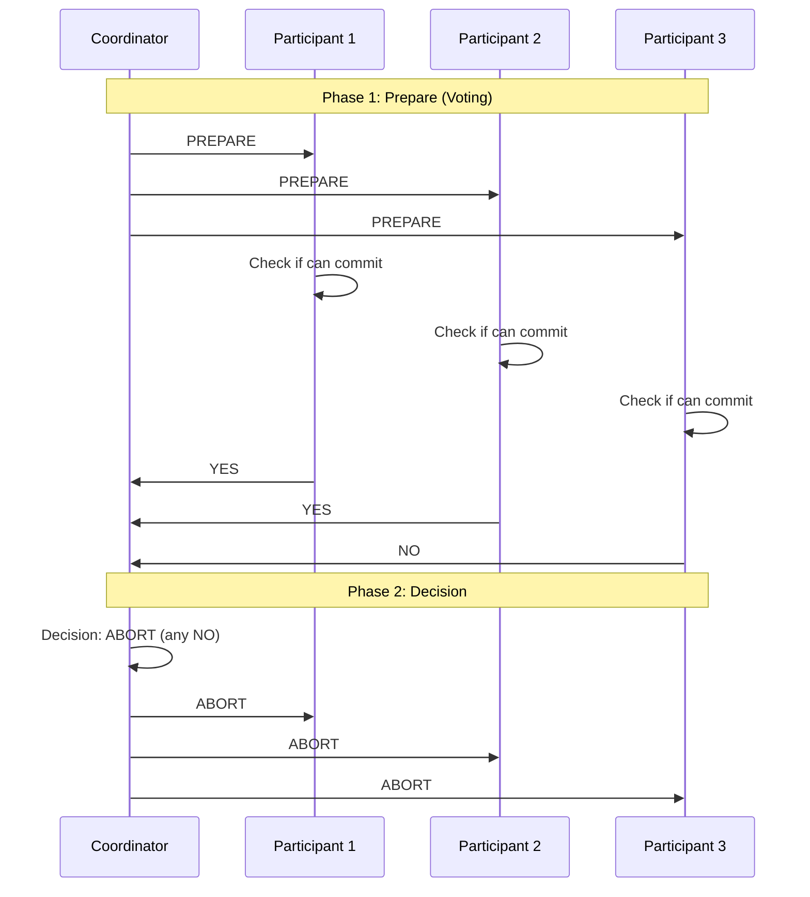

### Phase 1: Prepare (Voting Phase)
The coordinator asks all participants: "Are you ready to commit this transaction?"

Each participant must answer:
- **YES**: "I promise I can commit this transaction"
- **NO**: "I cannot commit this transaction"

A "YES" vote is a binding promise. Once a participant votes YES, it must be able to commit the transaction even if it crashes and restarts.

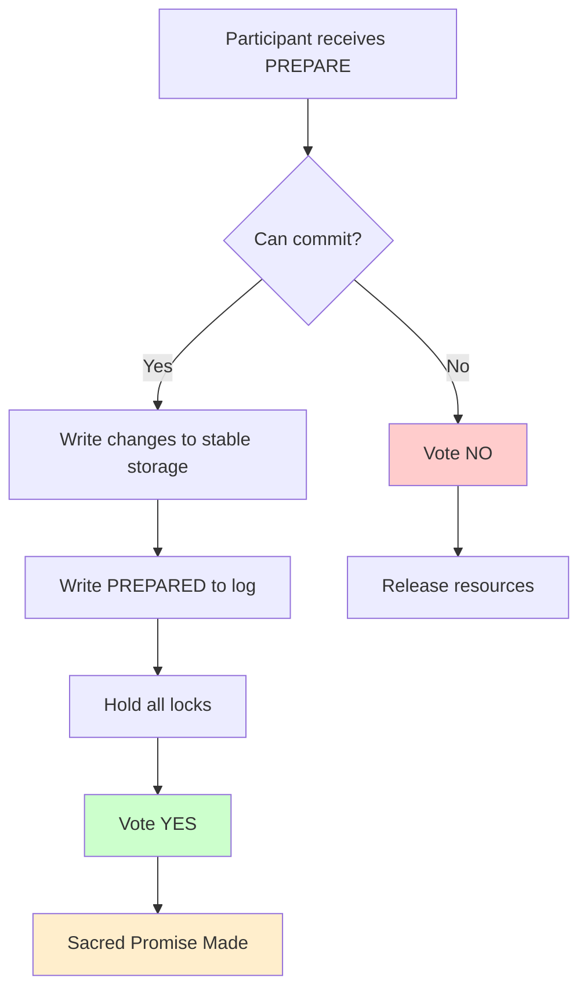

### Phase 2: Commit (Decision Phase)
Based on the votes:
- If **everyone** voted YES → The coordinator tells everyone to COMMIT
- If **anyone** voted NO → The coordinator tells everyone to ABORT

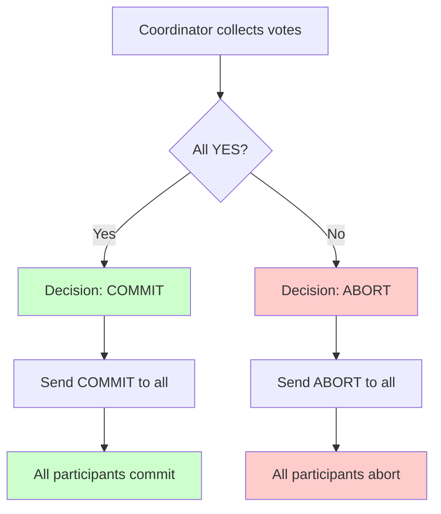

## Why This Works

### The Guarantee
2PC provides this crucial guarantee:
> **All participants will make the same decision: either all commit or all abort.**

### The Mechanism
The magic happens in Phase 1. When a participant votes YES:

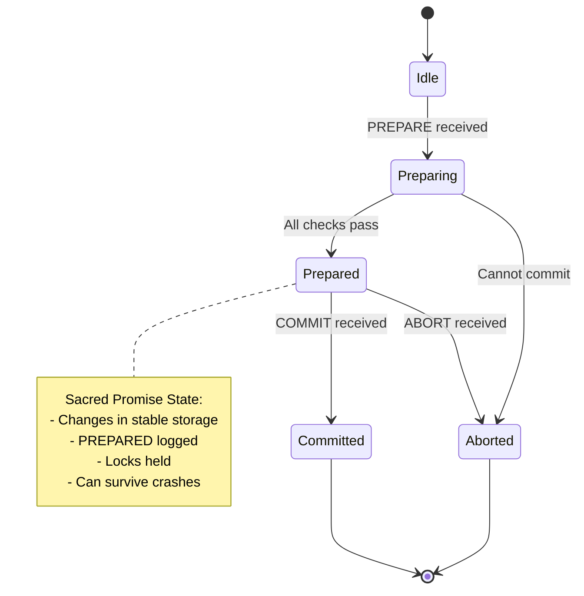

1. **It writes all changes to stable storage** (but doesn't commit yet)
2. **It writes a "prepared" record to its log** (so it remembers its promise after a crash)
3. **It releases no locks** (so the transaction remains isolated)

This means the participant is in a state where it can guarantee it will be able to commit later, even if failures occur.

**The Sacred Promise**: Once prepared, the participant is in a special state where it has guaranteed it can commit, but hasn't yet done so. This is the key insight that makes 2PC work.

## The Dinner Party Analogy

Imagine coordinating a dinner party for 5 friends:

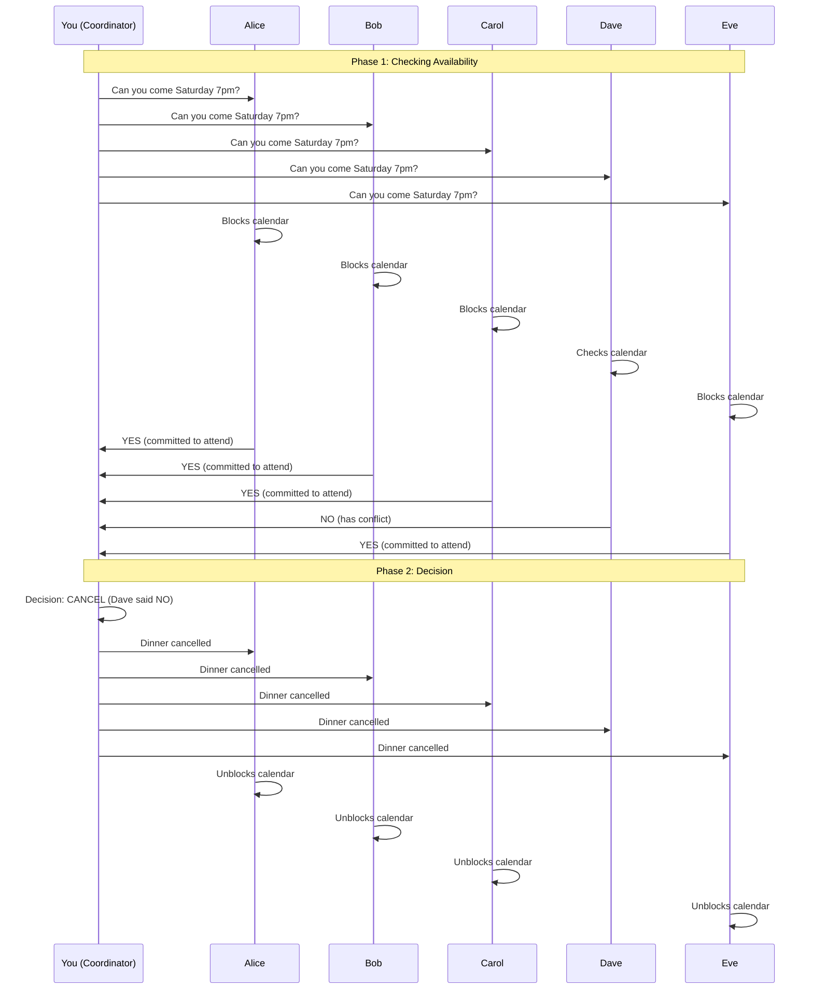

### Phase 1: Prepare (Checking Availability)
**You (coordinator)**: "Can everyone come to dinner on Saturday at 7pm?"

**Alice**: "YES" (blocks her calendar)
**Bob**: "YES" (blocks his calendar)  
**Carol**: "YES" (blocks her calendar)
**Dave**: "NO" (has a conflict)
**Eve**: "YES" (blocks her calendar)

### Phase 2: Decision
Since Dave said NO, you tell everyone: "Dinner is cancelled."

Everyone unblocks their calendars.

### The Alternative (If Everyone Said YES)

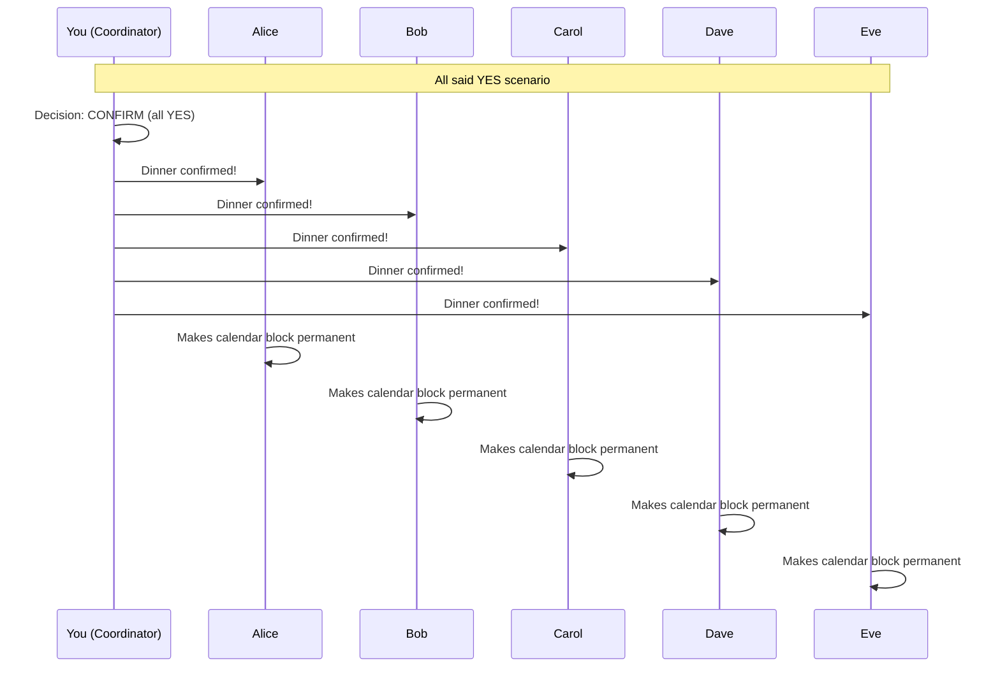

If Dave had said YES instead:
- **You**: "Dinner is confirmed! See you all Saturday at 7pm."
- **Everyone**: Makes their calendar block permanent

### The Key Insight
Notice that once someone says "YES," they've committed to being available. They can't change their mind later. This is exactly how 2PC works - the "prepare" phase creates binding promises.

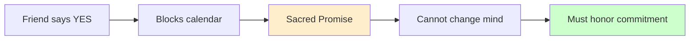

## The Fundamental Trade-off

2PC makes a specific trade-off:

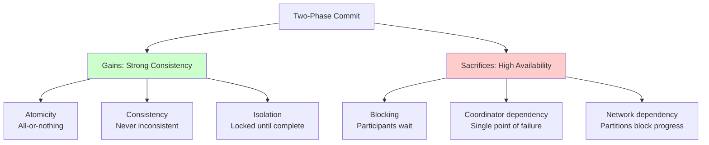

### What It Gains: Consistency
- **Atomicity**: All participants make the same decision
- **Consistency**: The system never ends up in an inconsistent state
- **Isolation**: Transactions remain isolated until they're committed everywhere

### What It Sacrifices: Availability
- **Blocking**: Participants must hold locks/resources during both phases
- **Coordinator dependency**: If the coordinator fails, participants might be stuck waiting
- **Network dependency**: Network partitions can prevent progress

### CAP Theorem in Action

```mermaid
triangle
    Consistency
    Availability
    Partition_Tolerance
```

2PC chooses **Consistency** and **Partition Tolerance** over **Availability**. When network partitions occur, 2PC will block (become unavailable) rather than risk inconsistency.

## When 2PC Shines

### Perfect Scenarios
1. **Reliable networks**: Low latency, rare failures
2. **Trusted participants**: All systems are under your control
3. **Short transactions**: Minimal time holding locks
4. **Strong consistency requirements**: Inconsistency is worse than being unavailable

### Real-World Examples

#### Database Distributed Transactions
```sql
-- This transaction spans multiple database shards
BEGIN DISTRIBUTED TRANSACTION;
INSERT INTO users_shard1 (id, name) VALUES (1, 'Alice');
INSERT INTO orders_shard2 (user_id, product) VALUES (1, 'laptop');
COMMIT;
```

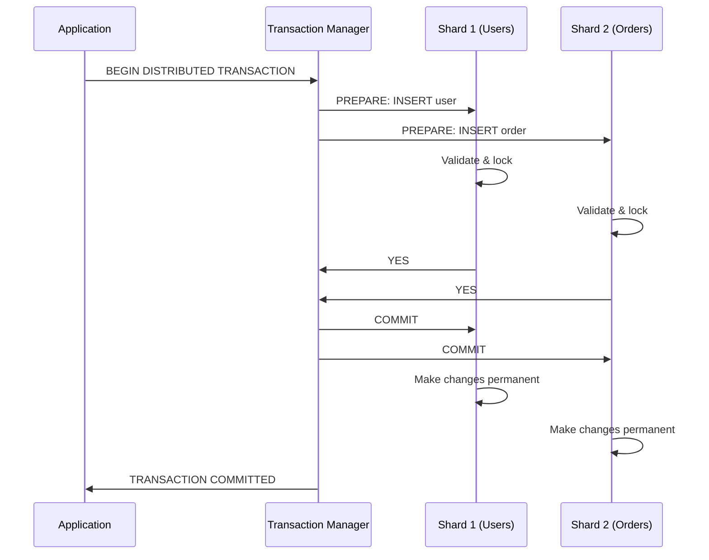

The database system uses 2PC internally to ensure both inserts succeed or both fail.

#### Enterprise Service Bus

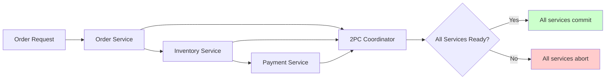

All three services must complete their work or none should. 2PC ensures this atomicity.

## The Limitations

### The Blocking Problem
If the coordinator crashes after Phase 1 but before Phase 2, participants are stuck:
- They can't commit (haven't received the commit message)
- They can't abort (they promised they could commit)
- They must wait for the coordinator to recover

### The Network Partition Problem
If the network splits after Phase 1:
- Participants on one side can't hear from the coordinator
- They remain blocked indefinitely
- The transaction cannot make progress

## The Design Principles

2PC embodies several key principles:

### 1. **Explicit Consensus**
Don't assume - explicitly get agreement from all participants.

### 2. **Prepare for Failure**
Make decisions recoverable by logging them to stable storage.

### 3. **No Unilateral Decisions**
The coordinator makes decisions, but only based on participant votes.

### 4. **Monotonic Progress**
Once a participant votes YES, it cannot change its mind.

### 5. **Fail-Safe Defaults**
When in doubt, abort the transaction (safety over progress).

## Modern Relevance

While 2PC has limitations, its core philosophy influences many modern systems:

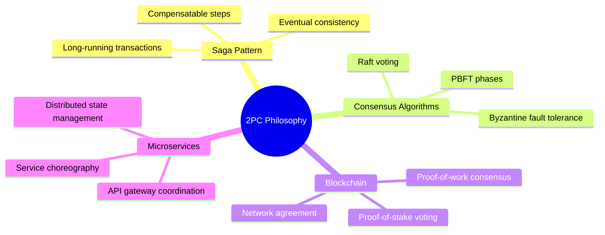

- **Saga Pattern**: Breaks transactions into compensatable steps
- **Consensus Algorithms**: Raft and PBFT use similar voting phases
- **Blockchain**: Proof-of-work and proof-of-stake use consensus phases
- **Microservices**: API gateways coordinate multiple service calls

### The Evolution of Distributed Consensus

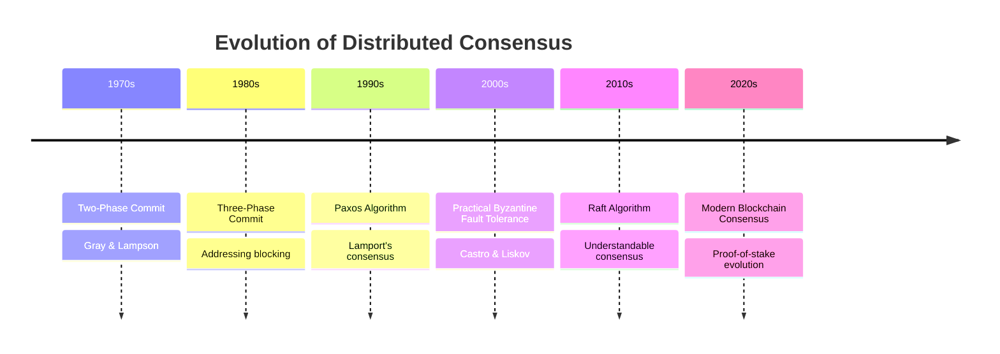

## The Next Step

Understanding the prepare-then-commit philosophy is crucial, but the devil is in the details. In the next section, we'll explore the key abstractions that make 2PC work: the coordinator, participants, and the precise semantics of each phase.

The beauty of 2PC lies in its simplicity. The complexity comes from handling all the ways it can fail - which is what makes it such a fascinating protocol to study.