# Key Abstractions: The Players and Their Roles

## The Cast of Characters

Two-Phase Commit involves three key abstractions that work together to ensure distributed atomicity:

```mermaid
flowchart TD
    A["🎭 The Cast of 2PC"]
    
    A --> B["🎼 Coordinator<br/>The Orchestra Conductor"]
    A --> C["🎻 Participants<br/>The Resource Managers"]
    A --> D["📚 Transaction Log<br/>The Memory System"]
    
    B --> E["• Initiates protocol<br/>• Collects votes<br/>• Makes decisions<br/>• Broadcasts results"]
    C --> F["• Manage resources<br/>• Vote on transactions<br/>• Execute decisions<br/>• Maintain consistency"]
    D --> G["• Persist state<br/>• Enable recovery<br/>• Track progress<br/>• Survive crashes"]
    
    style B fill:#e1f5fe
    style C fill:#f3e5f5
    style D fill:#e8f5e8
```



1. **The Coordinator** - The decision maker
2. **The Participants** - The resource managers
3. **The Transaction Log** - The memory system

Let's explore each role and how they interact.

## The Coordinator: The Orchestra Conductor

The coordinator is like an orchestra conductor - it doesn't play any instruments, but it ensures everyone plays in harmony.

### Primary Responsibilities



```mermaid
flowchart TD
    A["🎼 Coordinator Responsibilities"]
    
    A --> B["1️⃣ Initiate Protocol"]
    A --> C["2️⃣ Collect Votes"]
    A --> D["3️⃣ Make Decision"]
    A --> E["4️⃣ Broadcast Result"]
    
    B --> F["Send PREPARE to all participants"]
    C --> G["Gather YES/NO votes"]
    D --> H["All YES = COMMIT<br/>Any NO = ABORT"]
    E --> I["Send final decision to all"]
    
    style B fill:#ffebee
    style C fill:#e8f5e8
    style D fill:#fff3e0
    style E fill:#e3f2fd
```

#### 1. **Initiate the Protocol**
```
Coordinator → All Participants: "PREPARE to commit Transaction X"
```

#### 2. **Collect Votes**
```
Participant A → Coordinator: "YES, I can commit"
Participant B → Coordinator: "NO, I cannot commit"
Participant C → Coordinator: "YES, I can commit"
```

#### 3. **Make the Decision**
```
Decision Logic:
IF all participants voted YES:
    Decision = COMMIT
ELSE:
    Decision = ABORT
```

#### 4. **Broadcast the Decision**
```
Coordinator → All Participants: "COMMIT Transaction X"
# OR
Coordinator → All Participants: "ABORT Transaction X"
```

### The Coordinator's State Machine


### Coordinator Failure Scenarios

```mermaid
stateDiagram-v2
    [*] --> Init
    Init --> PrepareSent : Send PREPARE
    PrepareSent --> DecisionMade : Collect votes
    DecisionMade --> ResultSent : Send decision
    ResultSent --> [*]
    
    Init --> Crash1 : 💥 Crash
    PrepareSent --> Crash2 : 💥 Crash
    DecisionMade --> Crash3 : 💥 Crash
    
    Crash1 --> Recovery1 : Restart
    Crash2 --> Recovery2 : Restart
    Crash3 --> Recovery3 : Restart
    
    Recovery1 --> [*] : Abort (safe)
    Recovery2 --> PrepareSent : Query & decide
    Recovery3 --> ResultSent : Resend decision
    
    note right of Crash2
        Most dangerous!
        Participants blocked
    end note
```



#### Before Sending PREPARE
- **Impact**: No participant has started
- **Recovery**: Simply abort the transaction
- **Risk Level**: 🟢 Low - Clean state

#### After Sending PREPARE, Before Decision
- **Impact**: Participants might be blocked
- **Recovery**: Query participants for their votes, then decide
- **Risk Level**: 🔴 High - Participants waiting

#### After Decision, Before Sending Result
- **Impact**: Participants are blocked waiting for decision
- **Recovery**: Resend the decision (it's in the log)
- **Risk Level**: 🟡 Medium - Decision known

## The Participants: The Resource Managers

Participants are the systems that actually hold the resources (databases, message queues, file systems, etc.).

### Primary Responsibilities

#### 1. **Prepare Phase Processing**


When receiving a PREPARE message:
```
1. Check if transaction can be committed
2. IF yes:
   - Write all changes to stable storage (but don't commit)
   - Write "PREPARED" to transaction log
   - Send "YES" vote to coordinator
3. IF no:
   - Send "NO" vote to coordinator
   - Abort the transaction locally
```

#### 2. **Commit Phase Processing**

```mermaid
flowchart TD
    A["Decision received"] --> B{"COMMIT or ABORT?"}
    
    B -->|COMMIT| C["Make changes permanent"]
    C --> D["Write COMMITTED to log"]
    D --> E["Release all locks"]
    E --> F["✅ Transaction Complete"]
    
    B -->|ABORT| G["Discard all changes"]
    G --> H["Write ABORTED to log"]
    H --> I["Release all locks"]
    I --> J["❌ Transaction Cancelled"]
    
    style F fill:#ccffcc
    style J fill:#ffcccc
```



When receiving the final decision:
```
IF decision is COMMIT:
    - Make all changes permanent
    - Write "COMMITTED" to transaction log
    - Release all locks
    
IF decision is ABORT:
    - Discard all changes
    - Write "ABORTED" to transaction log
    - Release all locks
```

### The Participant's State Machine


### The Sacred Promise

Once a participant votes YES, it enters a **sacred contract**:

> "I promise that I can commit this transaction, even if I crash and restart."

This promise is enforced by:
1. **Stable storage**: All changes are written to disk
2. **Transaction log**: The "PREPARED" state is persisted
3. **Recovery protocol**: After restart, the participant remembers its promise

## The Transaction Log: The Memory System

The transaction log is the foundation that makes 2PC work. It ensures that decisions survive crashes.

### What Gets Logged

#### Coordinator's Log
```
[PREPARE_SENT] Transaction X, Participants: [A, B, C]
[VOTE_RECEIVED] Transaction X, Participant A: YES
[VOTE_RECEIVED] Transaction X, Participant B: NO
[DECISION_MADE] Transaction X: ABORT
[DECISION_SENT] Transaction X: ABORT sent to all participants
```

#### Participant's Log
```
[PREPARE_RECEIVED] Transaction X from Coordinator Y
[PREPARED] Transaction X - ready to commit
[DECISION_RECEIVED] Transaction X: COMMIT
[COMMITTED] Transaction X - changes are permanent
```

### The Recovery Protocol

When a system crashes and restarts:

#### Coordinator Recovery
```
1. Read transaction log
2. FOR each incomplete transaction:
   - IF decision not yet made: Query participants for votes
   - IF decision made but not sent: Resend decision
   - IF decision sent but not acknowledged: Resend decision
```

#### Participant Recovery
```
1. Read transaction log
2. FOR each incomplete transaction:
   - IF in PREPARED state: Contact coordinator for decision
   - IF no log entry: Transaction can be aborted
```

## The Message Flow: A Complete Example

Let's trace through a successful transaction:

### The Setup
- **Coordinator**: C
- **Participants**: Database A, Database B, Message Queue M
- **Transaction**: Transfer $100 from A to B, log event in M

### Phase 1: Prepare

```
C → A: "PREPARE Transaction T1"
C → B: "PREPARE Transaction T1"  
C → M: "PREPARE Transaction T1"

A checks: Can deduct $100? → YES
A writes: Changes to stable storage
A writes: "PREPARED T1" to log
A → C: "YES"

B checks: Can add $100? → YES
B writes: Changes to stable storage
B writes: "PREPARED T1" to log
B → C: "YES"

M checks: Can log event? → YES
M writes: Event to stable storage
M writes: "PREPARED T1" to log
M → C: "YES"
```

### Phase 2: Commit

```
C writes: "DECISION T1: COMMIT" to log
C → A: "COMMIT Transaction T1"
C → B: "COMMIT Transaction T1"
C → M: "COMMIT Transaction T1"

A makes changes permanent
A writes: "COMMITTED T1" to log
A → C: "ACK"

B makes changes permanent
B writes: "COMMITTED T1" to log
B → C: "ACK"

M makes changes permanent
M writes: "COMMITTED T1" to log
M → C: "ACK"
```

## The Timeout Problem

What happens if messages are lost or delayed?

### Coordinator Timeouts
```
C → A: "PREPARE Transaction T1"
C → B: "PREPARE Transaction T1"
C → M: "PREPARE Transaction T1"

A → C: "YES"
B → C: "YES"
M → C: ??? (No response - timeout)

After timeout:
C decides: ABORT (conservative choice)
C → A: "ABORT Transaction T1"
C → B: "ABORT Transaction T1"
C → M: "ABORT Transaction T1"
```

### Participant Timeouts
```
A receives: "PREPARE Transaction T1"
A sends: "YES"
A waits for decision...
A times out waiting for coordinator

A's options:
1. Contact coordinator directly
2. Contact other participants to find out decision
3. Keep waiting (blocks indefinitely)
```

## The Blocking Problem Illustrated

Consider this scenario:

```
Phase 1 completes successfully:
A → C: "YES"
B → C: "YES"
M → C: "YES"

C decides: COMMIT
C writes: "DECISION T1: COMMIT" to log
C crashes before sending COMMIT messages

Result:
- A is blocked (holding locks, waiting for decision)
- B is blocked (holding locks, waiting for decision)
- M is blocked (holding locks, waiting for decision)
- C is down (cannot send decision)
```

This is the fundamental limitation of 2PC - it can block indefinitely if the coordinator fails at the wrong time.

## Key Insights

### 1. **Explicit State Management**
Every participant and coordinator maintains explicit state about each transaction.

### 2. **Persistent Promises**
Votes and decisions are written to stable storage before being sent.

### 3. **Conservative Defaults**
When in doubt, abort the transaction (safety over progress).

### 4. **Centralized Decision Making**
Only the coordinator makes commit/abort decisions, preventing conflicts.

### 5. **Atomic Logging**
Log writes are atomic - they either complete fully or not at all.

## Modern Variations

The core abstractions of 2PC appear in many modern systems:

### **Three-Phase Commit (3PC)**
Adds a "pre-commit" phase to reduce blocking time.

### **Saga Pattern**
Replaces the coordinator with a workflow engine, participants with compensatable actions.

### **Blockchain Consensus**
Miners act as participants, the network acts as coordinator.

### **Microservices Orchestration**
API gateways coordinate multiple service calls atomically.

## The Next Step

These abstractions - coordinator, participants, and transaction log - form the foundation of 2PC. But understanding the concepts is only the first step. In the next section, we'll build a practical simulation that brings these abstractions to life.

The beauty of 2PC lies in how these simple roles combine to solve a complex problem. The challenge lies in handling all the ways this elegant dance can go wrong.