# Simulating 2PC: A Hands-On Implementation

## Overview

In this guide, we'll build a simplified but functional Two-Phase Commit simulator. This will help you understand how the protocol works in practice and see the key decision points.

We'll simulate a banking transaction that spans multiple databases, implementing the core coordinator and participant logic.

## The Scenario

**Goal**: Transfer $100 from Alice's checking account to Bob's savings account.

**Challenge**: The accounts are in different databases:
- Database A: Alice's checking account
- Database B: Bob's savings account

**Requirements**: Either both updates succeed or both fail.

```mermaid
flowchart TD
    A["💰 Transfer $100"] --> B["Database A<br/>Alice's Checking<br/>$1000"]
    A --> C["Database B<br/>Bob's Savings<br/>$500"]
    
    B --> D["Debit $100"]
    C --> E["Credit $100"]
    
    D --> F["New Balance: $900"]
    E --> G["New Balance: $600"]
    
    F --> H{"Both Successful?"}
    G --> H
    
    H -->|Yes| I["✅ Consistent State<br/>Total: $1500"]
    H -->|No| J["❌ Inconsistent State<br/>Money lost or created"]
    
    style I fill:#ccffcc
    style J fill:#ffcccc
```



## Basic Data Structures

Let's start with the fundamental data structures:

### Transaction State
```python
from enum import Enum
from dataclasses import dataclass
from typing import Dict, List, Optional
import uuid
import time

class TransactionState(Enum):
    INIT = "INIT"
    PREPARE_SENT = "PREPARE_SENT"
    PREPARED = "PREPARED"
    COMMITTED = "COMMITTED"
    ABORTED = "ABORTED"

class Vote(Enum):
    YES = "YES"
    NO = "NO"

@dataclass
class Transaction:
    id: str
    participants: List[str]
    state: TransactionState
    votes: Dict[str, Vote]
    decision: Optional[str] = None
    timestamp: float = 0.0
    
    def __post_init__(self):
        self.timestamp = time.time()
```

### Simple Database Simulator
```python
class DatabaseSimulator:
    def __init__(self, name: str):
        self.name = name
        self.accounts = {
            "alice_checking": 1000.0,
            "bob_savings": 500.0
        }
        self.prepared_transactions = {}
        self.transaction_log = []
    
    def get_balance(self, account: str) -> float:
        return self.accounts.get(account, 0.0)
    
    def log_entry(self, message: str):
        self.transaction_log.append(f"[{time.time():.2f}] {self.name}: {message}")
        print(f"[{self.name}] {message}")
```

## The Participant Implementation

Each participant (database) needs to handle prepare and commit/abort operations:

```python
class Participant:
    def __init__(self, name: str, database: DatabaseSimulator):
        self.name = name
        self.database = database
        self.state = TransactionState.INIT
    
    def prepare(self, transaction_id: str, operations: List[Dict]) -> Vote:
        """
        Phase 1: Prepare
        Check if we can perform all operations and lock resources
        """
        self.database.log_entry(f"PREPARE received for transaction {transaction_id}")
        
        # Validate all operations
        can_commit = True
        prepared_changes = {}
        
        for op in operations:
            if op['type'] == 'debit':
                account = op['account']
                amount = op['amount']
                current_balance = self.database.get_balance(account)
                
                if current_balance >= amount:
                    prepared_changes[account] = current_balance - amount
                    self.database.log_entry(f"Can debit {amount} from {account}")
                else:
                    can_commit = False
                    self.database.log_entry(f"Cannot debit {amount} from {account} (insufficient funds)")
                    break
            
            elif op['type'] == 'credit':
                account = op['account']
                amount = op['amount']
                current_balance = self.database.get_balance(account)
                prepared_changes[account] = current_balance + amount
                self.database.log_entry(f"Can credit {amount} to {account}")
        
        if can_commit:
            # Store the prepared changes (but don't apply them yet)
            self.database.prepared_transactions[transaction_id] = {
                'changes': prepared_changes,
                'operations': operations
            }
            self.state = TransactionState.PREPARED
            self.database.log_entry(f"PREPARED transaction {transaction_id}")
            return Vote.YES
        else:
            self.state = TransactionState.ABORTED
            self.database.log_entry(f"ABORTED transaction {transaction_id}")
            return Vote.NO
    
    def commit(self, transaction_id: str) -> bool:
        """
        Phase 2: Commit
        Apply the prepared changes permanently
        """
        self.database.log_entry(f"COMMIT received for transaction {transaction_id}")
        
        if transaction_id not in self.database.prepared_transactions:
            self.database.log_entry(f"No prepared transaction {transaction_id} found")
            return False
        
        prepared_data = self.database.prepared_transactions[transaction_id]
        
        # Apply the changes
        for account, new_balance in prepared_data['changes'].items():
            old_balance = self.database.accounts[account]
            self.database.accounts[account] = new_balance
            self.database.log_entry(f"Updated {account}: {old_balance} -> {new_balance}")
        
        # Clean up
        del self.database.prepared_transactions[transaction_id]
        self.state = TransactionState.COMMITTED
        self.database.log_entry(f"COMMITTED transaction {transaction_id}")
        return True
    
    def abort(self, transaction_id: str) -> bool:
        """
        Phase 2: Abort
        Discard the prepared changes
        """
        self.database.log_entry(f"ABORT received for transaction {transaction_id}")
        
        if transaction_id in self.database.prepared_transactions:
            del self.database.prepared_transactions[transaction_id]
            self.database.log_entry(f"Discarded prepared changes for transaction {transaction_id}")
        
        self.state = TransactionState.ABORTED
        self.database.log_entry(f"ABORTED transaction {transaction_id}")
        return True
```

## The Coordinator Implementation

The coordinator orchestrates the entire protocol:

```mermaid
flowchart TD
    A["Transaction Started"] --> B["Phase 1: Send PREPARE"]
    B --> C["Collect Votes"]
    C --> D{"All YES?"}
    
    D -->|Yes| E["Decision: COMMIT"]
    D -->|No| F["Decision: ABORT"]
    
    E --> G["Phase 2: Send COMMIT"]
    F --> H["Phase 2: Send ABORT"]
    
    G --> I["All Participants Commit"]
    H --> J["All Participants Abort"]
    
    I --> K["✅ Transaction Complete"]
    J --> L["❌ Transaction Cancelled"]
    
    style E fill:#ccffcc
    style F fill:#ffcccc
    style K fill:#ccffcc
    style L fill:#ffcccc
```



```python
class Coordinator:
    def __init__(self):
        self.transactions = {}
        self.participants = {}
        self.transaction_log = []
    
    def log_entry(self, message: str):
        self.transaction_log.append(f"[{time.time():.2f}] COORDINATOR: {message}")
        print(f"[COORDINATOR] {message}")
    
    def register_participant(self, name: str, participant: Participant):
        self.participants[name] = participant
        self.log_entry(f"Registered participant: {name}")
    
    def begin_transaction(self, participant_operations: Dict[str, List[Dict]]) -> str:
        """
        Start a new distributed transaction
        participant_operations: {participant_name: [operations]}
        """
        transaction_id = str(uuid.uuid4())[:8]
        participants = list(participant_operations.keys())
        
        transaction = Transaction(
            id=transaction_id,
            participants=participants,
            state=TransactionState.INIT,
            votes={}
        )
        
        self.transactions[transaction_id] = transaction
        self.log_entry(f"Started transaction {transaction_id} with participants: {participants}")
        
        return self.execute_transaction(transaction_id, participant_operations)
    
    def execute_transaction(self, transaction_id: str, participant_operations: Dict[str, List[Dict]]) -> str:
        """
        Execute the two-phase commit protocol
        
        Flow:
        1. Send PREPARE to all participants
        2. Collect YES/NO votes
        3. Decision: ALL YES = COMMIT, ANY NO = ABORT
        4. Send decision to all participants
        """
        transaction = self.transactions[transaction_id]
        
        # Phase 1: Prepare
        self.log_entry(f"Phase 1: Sending PREPARE to all participants for transaction {transaction_id}")
        transaction.state = TransactionState.PREPARE_SENT
        
        all_votes_yes = True
        
        for participant_name in transaction.participants:
            participant = self.participants[participant_name]
            operations = participant_operations[participant_name]
            
            self.log_entry(f"Sending PREPARE to {participant_name}")
            vote = participant.prepare(transaction_id, operations)
            transaction.votes[participant_name] = vote
            
            if vote == Vote.NO:
                all_votes_yes = False
                self.log_entry(f"{participant_name} voted NO")
            else:
                self.log_entry(f"{participant_name} voted YES")
        
        # Phase 2: Decision
        if all_votes_yes:
            transaction.decision = "COMMIT"
            self.log_entry(f"All participants voted YES. Decision: COMMIT")
            return self.commit_transaction(transaction_id)
        else:
            transaction.decision = "ABORT"
            self.log_entry(f"At least one participant voted NO. Decision: ABORT")
            return self.abort_transaction(transaction_id)
    
    def commit_transaction(self, transaction_id: str) -> str:
        """
        Send COMMIT to all participants
        """
        transaction = self.transactions[transaction_id]
        self.log_entry(f"Phase 2: Sending COMMIT to all participants for transaction {transaction_id}")
        
        for participant_name in transaction.participants:
            participant = self.participants[participant_name]
            self.log_entry(f"Sending COMMIT to {participant_name}")
            participant.commit(transaction_id)
        
        transaction.state = TransactionState.COMMITTED
        self.log_entry(f"Transaction {transaction_id} COMMITTED successfully")
        return "COMMITTED"
    
    def abort_transaction(self, transaction_id: str) -> str:
        """
        Send ABORT to all participants
        """
        transaction = self.transactions[transaction_id]
        self.log_entry(f"Phase 2: Sending ABORT to all participants for transaction {transaction_id}")
        
        for participant_name in transaction.participants:
            participant = self.participants[participant_name]
            self.log_entry(f"Sending ABORT to {participant_name}")
            participant.abort(transaction_id)
        
        transaction.state = TransactionState.ABORTED
        self.log_entry(f"Transaction {transaction_id} ABORTED")
        return "ABORTED"
```

## Running the Simulation

Now let's put it all together and run some scenarios:

### Scenario 1: Successful Transaction

```python
def test_successful_transaction():
    print("=== Testing Successful Transaction ===")
    
    # Setup
    db_a = DatabaseSimulator("Database_A")
    db_b = DatabaseSimulator("Database_B")
    
    participant_a = Participant("ParticipantA", db_a)
    participant_b = Participant("ParticipantB", db_b)
    
    coordinator = Coordinator()
    coordinator.register_participant("ParticipantA", participant_a)
    coordinator.register_participant("ParticipantB", participant_b)
    
    # Print initial balances
    print(f"Initial Alice checking: ${db_a.get_balance('alice_checking')}")
    print(f"Initial Bob savings: ${db_b.get_balance('bob_savings')}")
    
    # Define the transaction
    operations = {
        "ParticipantA": [
            {"type": "debit", "account": "alice_checking", "amount": 100.0}
        ],
        "ParticipantB": [
            {"type": "credit", "account": "bob_savings", "amount": 100.0}
        ]
    }
    
    # Execute the transaction
    result = coordinator.begin_transaction(operations)
    
    # Print final balances
    print(f"Final Alice checking: ${db_a.get_balance('alice_checking')}")
    print(f"Final Bob savings: ${db_b.get_balance('bob_savings')}")
    print(f"Transaction result: {result}")
```

### Scenario 2: Failed Transaction (Insufficient Funds)

```python
def test_failed_transaction():
    print("\n=== Testing Failed Transaction ===")
    
    # Setup
    db_a = DatabaseSimulator("Database_A")
    db_b = DatabaseSimulator("Database_B")
    
    # Set Alice's balance to only $50
    db_a.accounts["alice_checking"] = 50.0
    
    participant_a = Participant("ParticipantA", db_a)
    participant_b = Participant("ParticipantB", db_b)
    
    coordinator = Coordinator()
    coordinator.register_participant("ParticipantA", participant_a)
    coordinator.register_participant("ParticipantB", participant_b)
    
    # Print initial balances
    print(f"Initial Alice checking: ${db_a.get_balance('alice_checking')}")
    print(f"Initial Bob savings: ${db_b.get_balance('bob_savings')}")
    
    # Define the transaction (trying to transfer $100 from $50 account)
    operations = {
        "ParticipantA": [
            {"type": "debit", "account": "alice_checking", "amount": 100.0}
        ],
        "ParticipantB": [
            {"type": "credit", "account": "bob_savings", "amount": 100.0}
        ]
    }
    
    # Execute the transaction
    result = coordinator.begin_transaction(operations)
    
    # Print final balances (should be unchanged)
    print(f"Final Alice checking: ${db_a.get_balance('alice_checking')}")
    print(f"Final Bob savings: ${db_b.get_balance('bob_savings')}")
    print(f"Transaction result: {result}")
```

### Running the Tests

```python
if __name__ == "__main__":
    test_successful_transaction()
    test_failed_transaction()
```

## Sample Output

When you run this simulation, you'll see output like:

```mermaid
sequenceDiagram
    participant C as Coordinator
    participant A as Database A
    participant B as Database B
    
    Note over C,B: Successful Transaction Flow
    
    C->>A: PREPARE (debit $100)
    C->>B: PREPARE (credit $100)
    
    A->>A: Check balance (✓ $1000 available)
    A->>A: Write to stable storage
    A->>A: Log PREPARED state
    A->>C: YES
    
    B->>B: Check can credit (✓ always possible)
    B->>B: Write to stable storage
    B->>B: Log PREPARED state
    B->>C: YES
    
    C->>C: Decision: COMMIT (all YES)
    
    C->>A: COMMIT
    C->>B: COMMIT
    
    A->>A: Apply changes (balance: $900)
    A->>A: Log COMMITTED
    
    B->>B: Apply changes (balance: $600)
    B->>B: Log COMMITTED
    
    Note over C,B: Total system balance: $1500 ✓
```



```
=== Testing Successful Transaction ===
Initial Alice checking: $1000.0
Initial Bob savings: $500.0
[COORDINATOR] Registered participant: ParticipantA
[COORDINATOR] Registered participant: ParticipantB
[COORDINATOR] Started transaction 1a2b3c4d with participants: ['ParticipantA', 'ParticipantB']
[COORDINATOR] Phase 1: Sending PREPARE to all participants for transaction 1a2b3c4d
[COORDINATOR] Sending PREPARE to ParticipantA
[Database_A] PREPARE received for transaction 1a2b3c4d
[Database_A] Can debit 100.0 from alice_checking
[Database_A] PREPARED transaction 1a2b3c4d
[COORDINATOR] ParticipantA voted YES
[COORDINATOR] Sending PREPARE to ParticipantB
[Database_B] PREPARE received for transaction 1a2b3c4d
[Database_B] Can credit 100.0 to bob_savings
[Database_B] PREPARED transaction 1a2b3c4d
[COORDINATOR] ParticipantB voted YES
[COORDINATOR] All participants voted YES. Decision: COMMIT
[COORDINATOR] Phase 2: Sending COMMIT to all participants for transaction 1a2b3c4d
[COORDINATOR] Sending COMMIT to ParticipantA
[Database_A] COMMIT received for transaction 1a2b3c4d
[Database_A] Updated alice_checking: 1000.0 -> 900.0
[Database_A] COMMITTED transaction 1a2b3c4d
[COORDINATOR] Sending COMMIT to ParticipantB
[Database_B] COMMIT received for transaction 1a2b3c4d
[Database_B] Updated bob_savings: 500.0 -> 600.0
[Database_B] COMMITTED transaction 1a2b3c4d
[COORDINATOR] Transaction 1a2b3c4d COMMITTED successfully
Final Alice checking: $900.0
Final Bob savings: $600.0
Transaction result: COMMITTED
```

## Key Observations

### 1. **Explicit State Management**
Notice how each participant explicitly tracks whether it has prepared a transaction and what changes it's ready to make.

### 2. **Atomic Decision Making**
The coordinator waits for all votes before making a decision. A single "NO" vote causes the entire transaction to abort.

### 3. **Two-Phase Nature**
The clear separation between prepare (Phase 1) and commit/abort (Phase 2) ensures that no participant commits until everyone agrees.

### 4. **Logging for Debugging**
The extensive logging shows exactly what's happening at each step, making it easy to debug issues.

## Extending the Simulation

### Adding Network Failures


```python
import random

class NetworkSimulator:
    def __init__(self, failure_rate=0.1):
        self.failure_rate = failure_rate
    
    def send_message(self, sender, receiver, message):
        if random.random() < self.failure_rate:
            print(f"NETWORK: Message from {sender} to {receiver} LOST")
            return False
        print(f"NETWORK: Message from {sender} to {receiver} delivered")
        return True
```

### Adding Timeouts


```python
class CoordinatorWithTimeout(Coordinator):
    def __init__(self, timeout=5.0):
        super().__init__()
        self.timeout = timeout
    
    def execute_transaction(self, transaction_id: str, participant_operations: Dict[str, List[Dict]]) -> str:
        start_time = time.time()
        
        # ... existing code ...
        
        if time.time() - start_time > self.timeout:
            self.log_entry(f"Transaction {transaction_id} timed out")
            return self.abort_transaction(transaction_id)
```

### Adding Crash Recovery
```python
class PersistentParticipant(Participant):
    def __init__(self, name: str, database: DatabaseSimulator, log_file: str):
        super().__init__(name, database)
        self.log_file = log_file
    
    def write_to_log(self, entry: str):
        with open(self.log_file, 'a') as f:
            f.write(f"{time.time()}: {entry}\n")
    
    def recover_from_crash(self):
        try:
            with open(self.log_file, 'r') as f:
                for line in f:
                    if "PREPARED" in line:
                        # Need to contact coordinator for decision
                        pass
        except FileNotFoundError:
            pass
```

## What We've Learned

This simulation demonstrates the core mechanics of Two-Phase Commit:

1. **Coordination**: The coordinator orchestrates the protocol
2. **Voting**: Participants vote on whether they can commit
3. **Decision**: The coordinator makes a unanimous decision
4. **Atomicity**: All participants do the same thing (commit or abort)

But it also reveals the protocol's limitations:
- What happens if the coordinator crashes?
- What if messages are lost?
- What if participants crash after voting YES?

In the next section, we'll explore these failure scenarios and understand why 2PC can block indefinitely - its most significant limitation.