# The Blocking Problem: When 2PC Gets Stuck

## The Achilles' Heel of Two-Phase Commit

Two-Phase Commit has one fundamental flaw that limits its usefulness in many real-world scenarios: **it can block indefinitely**. This isn't a bug - it's an inherent limitation of the protocol's design.

Understanding why 2PC blocks, when it blocks, and what happens when it does is crucial for anyone working with distributed systems.

## The Root Cause: The Coordinator Single Point of Failure

The blocking problem stems from 2PC's centralized design:

```mermaid
flowchart TD
    A["Coordinator"] --> B["Participant 1"]
    A --> C["Participant 2"]
    A --> D["Participant 3"]
    
    A --> E["💥 Single Point of Failure"]
    
    E --> F["Participants blocked"]
    F --> G["Resources locked"]
    F --> H["System unavailable"]
    
    style A fill:#ffcccc
    style E fill:#ff6666
    style F fill:#ffcccc
    style G fill:#ffcccc
    style H fill:#ffcccc
```



1. **The coordinator is the single decision maker**
2. **Participants cannot proceed without the coordinator's decision**
3. **If the coordinator fails at the wrong time, participants are stuck**

Let's explore the specific scenarios where this happens.

## Scenario 1: The Critical Window

Consider this timeline:


This is the **critical window** - the most dangerous time for the coordinator to fail.

### What Participants Know
- They have all voted YES
- They are prepared to commit
- They are holding locks on their resources
- They haven't received the final decision

### What Participants Don't Know
- Did other participants vote YES or NO?
- What decision did the coordinator make?
- Is the coordinator coming back?

### The Dilemma

```mermaid
flowchart TD
    A["Participant in PREPARED state"] --> B{"What to do?"}
    
    B --> C["Commit unilaterally"]
    B --> D["Abort unilaterally"]
    B --> E["Wait for coordinator"]
    
    C --> F["⚠️ Risk: Other participants<br/>might have voted NO"]
    D --> G["⚠️ Risk: Other participants<br/>might have received COMMIT"]
    E --> H["⚠️ Risk: Wait indefinitely<br/>blocking system"]
    
    F --> I["Inconsistent state"]
    G --> I
    H --> J["System unavailable"]
    
    style I fill:#ff6666
    style J fill:#ff6666
```



Participants face an impossible choice:
- **Can't commit unilaterally**: What if another participant voted NO?
- **Can't abort unilaterally**: What if other participants received COMMIT?
- **Must wait**: But for how long?

## Scenario 2: The Partial Message Delivery

Even more problematic is when the coordinator sends some but not all decision messages:

```mermaid
sequenceDiagram
    participant C as Coordinator
    participant A as Participant A
    participant B as Participant B
    
    Note over C,B: All participants prepared
    
    C->>C: Decision: COMMIT
    
    C->>A: COMMIT
    A->>A: Apply changes
    A->>A: Release locks
    
    Note over C: 💥 COORDINATOR CRASHES
    
    Note over B: Participant B still waiting
    B->>B: Holding locks...
    B->>B: Resources blocked...
    
    Note over A,B: System now inconsistent!
    Note over A: Committed & available
    Note over B: Blocked & unavailable
```



**Timeline:**
```
Time 1: Coordinator decides to COMMIT
Time 2: Coordinator sends COMMIT to Participant A
Time 3: Participant A commits and releases locks
Time 4: Coordinator crashes before sending COMMIT to Participant B
Time 5: Participant B waits indefinitely while holding locks
```

Now the system is in an inconsistent state:
- **Participant A**: Has committed and moved on
- **Participant B**: Still blocked, waiting for decision

```mermaid
flowchart LR
    A["Participant A"] --> B["Committed ✅"]
    C["Participant B"] --> D["Blocked ❌"]
    
    B --> E["Resources available"]
    D --> F["Resources locked"]
    
    E --> G["System partially available"]
    F --> G
    
    G --> H["Inconsistent state"]
    
    style B fill:#ccffcc
    style D fill:#ffcccc
    style H fill:#ff6666
```



## The Domino Effect: Resource Locking

When participants block, they don't just sit idle - they hold critical resources:

### Database Locks
```sql
-- Participant A is holding these locks indefinitely
LOCK TABLE accounts WHERE account_id = 'alice_checking';
LOCK TABLE accounts WHERE account_id = 'bob_savings';
```

### Memory Buffers
```
Participant B has allocated:
- 50MB transaction buffer
- 100 connection handles
- 20 file descriptors
All held indefinitely...
```

### Cascade Failures
```
Participant B is blocked
  ↓
Other transactions waiting for same resources
  ↓
Connection pool exhausted
  ↓
New requests rejected
  ↓
System appears down
```

## Visualizing the Blocking Problem

Let's trace through a concrete example:

### The Setup
```
Transaction: Transfer $100 from Alice to Bob
Participants: Database A (Alice), Database B (Bob)
Coordinator: Transaction Manager
```

### The Blocking Scenario


## The Timeout Dilemma

The obvious solution seems to be timeouts:

```python
class ParticipantWithTimeout:
    def wait_for_decision(self, transaction_id: str, timeout: int = 30):
        start_time = time.time()
        
        while time.time() - start_time < timeout:
            decision = self.check_for_decision(transaction_id)
            if decision:
                return decision
            time.sleep(0.1)
        
        # What to do when timeout expires?
        return self.handle_timeout(transaction_id)
```

But what should `handle_timeout()` do?

### Option 1: Abort on Timeout
```python
def handle_timeout(self, transaction_id: str):
    self.log("Timeout expired, aborting transaction")
    return self.abort_transaction(transaction_id)
```

**Problem**: What if the coordinator actually decided to COMMIT and sent the message to other participants?

### Option 2: Commit on Timeout
```python
def handle_timeout(self, transaction_id: str):
    self.log("Timeout expired, committing transaction")
    return self.commit_transaction(transaction_id)
```

**Problem**: What if the coordinator decided to ABORT because another participant voted NO?

### Option 3: Contact Other Participants
```python
def handle_timeout(self, transaction_id: str):
    for participant in self.other_participants:
        decision = participant.query_decision(transaction_id)
        if decision:
            return decision
    
    # Still no decision found
    return self.make_unilateral_decision(transaction_id)
```

**Problem**: Other participants might also be blocked. This just spreads the problem.

## The Recovery Challenge

What happens when the coordinator comes back online?

### Coordinator Recovery Process
```python
class RecoveringCoordinator:
    def recover_from_crash(self):
        # Step 1: Read transaction log
        incomplete_transactions = self.read_incomplete_transactions()
        
        for transaction_id in incomplete_transactions:
            # Step 2: Determine what happened
            if self.decision_was_made(transaction_id):
                # Decision was made, resend to all participants
                self.resend_decision(transaction_id)
            else:
                # Decision was not made, query participants
                self.query_participants_and_decide(transaction_id)
```

### The Query Process
```python
def query_participants_and_decide(self, transaction_id: str):
    votes = {}
    
    for participant in self.participants:
        try:
            vote = participant.query_vote(transaction_id)
            votes[participant.name] = vote
        except ParticipantUnavailableError:
            # Participant is also down - now what?
            pass
    
    # Make decision based on available votes
    if self.can_make_decision(votes):
        decision = self.decide(votes)
        self.send_decision(transaction_id, decision)
    else:
        # Still can't decide - participants remain blocked
        self.log(f"Cannot recover transaction {transaction_id}")
```

## Three-Phase Commit: An Attempted Solution

The blocking problem is so significant that computer scientists developed **Three-Phase Commit (3PC)** to address it:

### The Extra Phase
```
Phase 1: Prepare (same as 2PC)
Phase 2: Pre-commit (new!)
Phase 3: Commit (same as 2PC)
```

### How Pre-commit Helps


### The 3PC Advantage
If the coordinator crashes after PRE-COMMIT:
- Participants know everyone voted YES
- They can safely commit unilaterally
- No indefinite blocking

### The 3PC Cost
- **More network messages**: 3 phases instead of 2
- **Higher latency**: Additional round-trip
- **More complex recovery**: More states to handle
- **Still not perfect**: Can still block under network partitions

## Real-World Implications

### When 2PC Blocking Matters
1. **High-availability systems**: Can't afford indefinite blocking
2. **Real-time systems**: Strict timing requirements
3. **Resource-constrained systems**: Can't hold locks indefinitely

### When 2PC Blocking Is Acceptable
1. **Controlled environments**: All systems under your control
2. **Reliable networks**: Low failure rates
3. **Batch processing**: Blocking is less critical
4. **Strong consistency requirements**: Consistency over availability

## Modern Alternatives

The blocking problem has driven the development of alternative patterns:

### Saga Pattern
```
Instead of: Atomic transaction across services
Use: Compensatable operations with rollback
```

### Event Sourcing
```
Instead of: Distributed state updates
Use: Append-only event log with eventual consistency
```

### CRDT (Conflict-free Replicated Data Types)
```
Instead of: Consensus on every update
Use: Mathematically mergeable data structures
```

## Debugging Blocked Transactions

When 2PC blocks in production, here's how to diagnose it:

### 1. Check Coordinator Status
```bash
# Is the coordinator running?
ps aux | grep coordinator

# Check coordinator logs
tail -f /var/log/coordinator.log | grep "TRANSACTION_123"
```

### 2. Query Participant States
```sql
-- Check for prepared transactions
SELECT * FROM prepared_transactions WHERE transaction_id = 'TRANSACTION_123';

-- Check for held locks
SELECT * FROM information_schema.innodb_locks;
```

### 3. Network Connectivity
```bash
# Can participants reach coordinator?
ping coordinator.example.com
telnet coordinator.example.com 8080
```

### 4. Recovery Actions
```python
# Manual recovery options
def manual_recovery(transaction_id):
    # Option 1: Force abort (safest)
    coordinator.force_abort(transaction_id)
    
    # Option 2: Force commit (if you know it's safe)
    coordinator.force_commit(transaction_id)
    
    # Option 3: Query and decide
    coordinator.query_participants_and_decide(transaction_id)
```

## The Fundamental Trade-off

The blocking problem illustrates a fundamental trade-off in distributed systems:

### CAP Theorem in Action
- **Consistency**: 2PC provides strong consistency
- **Availability**: 2PC sacrifices availability when coordinator fails
- **Partition tolerance**: 2PC cannot handle network partitions well

### The Choice
You must choose what's more important:
- **Perfect consistency** (2PC) with possible blocking
- **High availability** (alternative patterns) with eventual consistency

## Key Takeaways

1. **2PC can block indefinitely** when the coordinator fails at the wrong time
2. **Timeouts don't solve the problem** - they just force an arbitrary decision
3. **The blocking window is narrow** but the consequences are severe
4. **Recovery is complex** and may not always be possible
5. **Modern alternatives exist** for scenarios where blocking is unacceptable

The blocking problem isn't a flaw in 2PC - it's a fundamental limitation of any protocol that tries to provide perfect consistency in a distributed system. Understanding this limitation is crucial for making informed architectural decisions.

In the next section, we'll implement a production-ready version of 2PC in Rust, complete with proper error handling, recovery mechanisms, and strategies for dealing with the blocking problem.