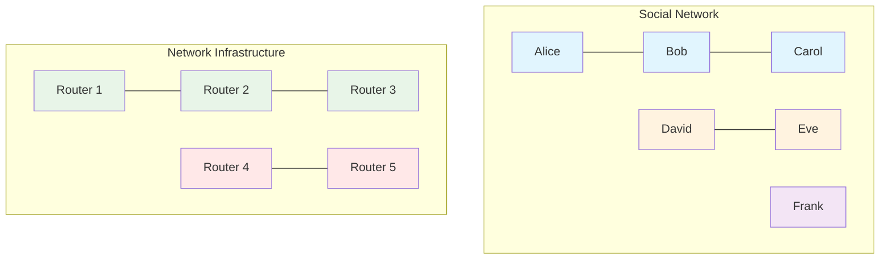

# The Core Problem: Finding Connected Components in Dynamic Networks

Imagine you're building a social network platform like Facebook. You have millions of users and billions of friendship connections. A critical feature is determining whether two users are connected—not just directly as friends, but through any chain of mutual friends. This seemingly simple question becomes computationally challenging at scale.

## The Connected Components Challenge

Consider these real-world scenarios that share the same fundamental problem:



**Social Network Analysis**
- Are Alice and Bob connected through mutual friends?
- What's the size of the largest connected friend group?
- If we remove a user, how many separate groups remain?

**Network Infrastructure**
- Is there a path between two computers in a network?
- If a router fails, which systems become isolated?
- What's the minimum number of connections to keep the network unified?

**Image Processing**
- Which pixels belong to the same object or region?
- How many distinct shapes are in an image?
- Are two points part of the same connected component?

**Geographic Analysis**
- Are two cities connected by roads?
- What's the largest connected region after a natural disaster?
- Which areas become isolated if a bridge is destroyed?

## The Naive Approach and Its Problems

The straightforward solution is to use **graph traversal** (DFS or BFS) to check connectivity:

```python
# Naive approach: check if two nodes are connected
def are_connected(graph, node_a, node_b):
    visited = set()
    stack = [node_a]
    
    while stack:
        current = stack.pop()
        if current == node_b:
            return True
        if current in visited:
            continue
        visited.add(current)
        stack.extend(graph[current])
    
    return False
```

**Why This Falls Apart at Scale**:

```mermaid
graph TD
    subgraph "Naive Approach: DFS/BFS for Each Query"
        A[Query: Are A & F connected?]
        A --> B[Start DFS from A]
        B --> C[Visit B, C, D, E...]
        C --> D[Check all neighbors]
        D --> E[Finally reach F]
        E --> F[Return: Yes, connected]
        
        style A fill:#ffebee
        style F fill:#ffebee
    end
    
    subgraph "Performance Problems"
        G[O(V + E) per query]
        G --> H[1M queries = 1M × O(V + E)]
        H --> I[Unacceptable for real-time use]
        
        style G fill:#fff3e0
        style H fill:#fff3e0
        style I fill:#fff3e0
    end
```

**Performance Issues**
- Each connectivity query requires O(V + E) time in worst case
- For n connectivity queries: O(n × (V + E)) total time
- With millions of nodes and billions of edges, this becomes prohibitively slow

**Dynamic Updates Are Expensive**
- Adding a new connection requires no additional work
- But answering "are they connected now?" still requires full traversal
- No way to incrementally maintain connectivity information

**Memory Inefficiency**
- Must store the entire graph structure
- Each query requires temporary storage for visited nodes
- No reuse of previous computation

## The Scale Problem in Real Numbers

Consider a realistic social network:
- **Users**: 100 million (nodes)
- **Friendships**: 10 billion (edges)  
- **Connectivity queries**: 1 million per second

**Naive approach performance**:
- Average query time: 50ms (optimistic)
- Required compute capacity: 50,000 CPU cores
- Memory requirements: Terabytes for graph storage

**Business impact**:
- Features like "People You May Know" become impossible
- Friend recommendation algorithms can't run in real-time
- Network analysis for fraud detection is too slow

## The Dynamic Nature of the Problem

Real-world networks aren't static—they change constantly:

**Frequent Updates**
- New users join and add friends
- Existing users form new connections
- Connections are sometimes removed (unfriending, blocking)

**Query Patterns**
- Connectivity queries happen more frequently than updates
- Same pairs of nodes are queried repeatedly
- Need to support both "are they connected?" and "make them connected"

**Consistency Requirements**
- Updates must be immediately visible to queries
- Can't use stale cached results
- Must handle concurrent updates and queries safely

## What We Really Need

An ideal solution would provide:

1. **Fast Connectivity Queries**: Nearly constant time to check if two items are connected
2. **Efficient Union Operations**: Quick merging of two connected components
3. **Dynamic Updates**: Support for adding new connections in real-time
4. **Space Efficiency**: Memory usage proportional to number of items, not connections
5. **Simplicity**: Easy to implement correctly and maintain

## The Abstraction We're Looking For

Rather than thinking about the full graph with all its edges, we need a different mental model:

```mermaid
graph TD
    subgraph "Traditional Graph Thinking"
        A1[Alice] --- B1[Bob]
        B1 --- C1[Carol]
        D1[David] --- E1[Eve]
        F1[Frank]
        
        G1[Store all edges]
        G1 --> H1[Traverse paths for queries]
        H1 --> I1[O(V + E) per query]
    end
    
    subgraph "Union-Find Thinking"
        subgraph "Group 1"
            A2[Alice]
            B2[Bob] 
            C2[Carol]
            R1[Representative: Alice]
        end
        
        subgraph "Group 2"
            D2[David]
            E2[Eve]
            R2[Representative: David]
        end
        
        subgraph "Group 3"
            F2[Frank]
            R3[Representative: Frank]
        end
        
        G2[Store group membership]
        G2 --> H2[Compare representatives]
        H2 --> I2[O(α(n)) per query]
    end
```

**Groups Instead of Connections**
- Organize items into disjoint sets (groups)
- Two items are connected if they're in the same group
- Merging connections means merging groups
- Checking connectivity means checking group membership

**Representatives Instead of Traversal**
- Each group has a designated representative (leader)
- Finding connectivity reduces to comparing representatives
- No need to traverse paths between items

**Hierarchical Organization**
- Structure groups as trees for efficient navigation
- Point from children to parents for easy representative lookup
- Optimize tree structure to minimize lookup time

This is exactly what the **Union-Find** (also called Disjoint Set Union) data structure provides—a clever way to maintain connected components that supports both operations efficiently:

- **Find**: Which group does this item belong to? (What's its representative?)
- **Union**: Merge two groups into one (Connect two items)

```mermaid
flowchart LR
    subgraph "Union-Find Operations"
        A[find(x)] --> B[Returns representative of x's group]
        C[union(x, y)] --> D[Merges groups containing x and y]
        E[connected(x, y)] --> F[Returns find(x) == find(y)]
    end
    
    style A fill:#e3f2fd
    style C fill:#e8f5e8
    style E fill:#fff3e0
```

The beauty of Union-Find is that it abstracts away the complexity of graph traversal and reduces the connectivity problem to simple set operations, enabling algorithms that would be impossible with naive approaches.