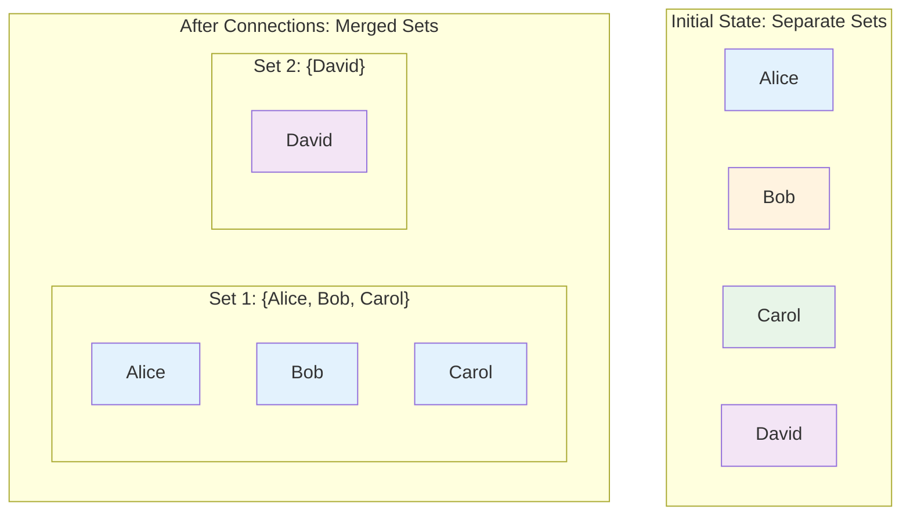
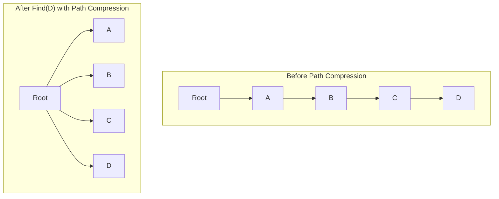
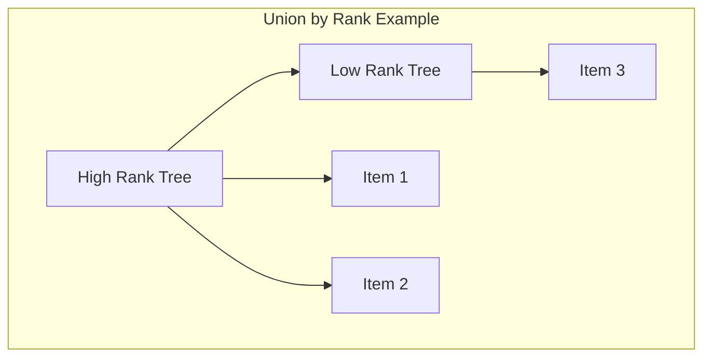

# Key Abstractions: The Building Blocks of Union-Find

Understanding Union-Find requires mastering four fundamental concepts that work together to efficiently maintain connected components in dynamic datasets.

## The Set: A Collection of Connected Items

A **set** in Union-Find represents a group of items that are all connected to each other. Sets are disjoint—no item can belong to multiple sets simultaneously.

**Properties of Sets**:
- Every item belongs to exactly one set
- Sets never overlap (disjoint property)
- Sets can grow by merging with other sets
- Sets can contain just one item (singleton sets)

**The Social Club Analogy**
Think of sets as exclusive social clubs where:
- Each person belongs to exactly one club
- Clubs never share members
- Clubs can merge to form larger clubs
- Some clubs might have only one member



## The Representative: The Voice of the Group

Every set has exactly one **representative** (also called root or leader)—a designated member that identifies the entire set. Two items are connected if and only if they have the same representative.

**Characteristics of Representatives**:
- Unique identifier for each set
- Can be any member of the set (often arbitrary)
- Remains stable until the set merges with another
- Accessed via the `find` operation

**The Government Analogy**
Like how each country has one head of state:
- Citizens belong to countries (items belong to sets)
- Each country has one president/prime minister (representative)
- To check if two people are from the same country, compare their leaders
- When countries merge, one leader represents the unified nation

```mermaid
graph TD
    subgraph "Country A"
        CA[President A]
        C1[Citizen 1] --> CA
        C2[Citizen 2] --> CA
        C3[Citizen 3] --> CA
        
        style CA fill:#ffb74d
        style C1 fill:#fff3e0
        style C2 fill:#fff3e0
        style C3 fill:#fff3e0
    end
    
    subgraph "Country B"
        CB[President B]
        C4[Citizen 4] --> CB
        C5[Citizen 5] --> CB
        
        style CB fill:#81c784
        style C4 fill:#e8f5e8
        style C5 fill:#e8f5e8
    end
    
    subgraph "Connectivity Check"
        Q[Are Citizen 1 & 4 connected?]
        Q --> R1[find(Citizen 1) = President A]
        Q --> R2[find(Citizen 4) = President B]
        R1 --> R3[President A ≠ President B]
        R2 --> R3
        R3 --> R4[Not connected]
    end
```

```python
# Checking connectivity via representatives
if find(alice) == find(bob):
    print("Alice and Bob are connected!")
```

## The Union Operation: Merging Worlds

The **union** operation merges two sets into one, connecting all members of both sets to each other. This is how new connections propagate through the data structure.

### How Union Works

```mermaid
graph TD
    subgraph "Before Union"
        A1[Set 1: {A, B}] 
        A2[Set 2: {C, D}]
    end
    
    subgraph "After Union(B, C)"
        B1[Set 1: {A, B, C, D}]
    end
    
    A1 --> B1
    A2 --> B1
```

**The Merger Process**:
1. Find the representative of the first item's set
2. Find the representative of the second item's set  
3. If they're different, make one representative point to the other
4. Now both sets share the same representative

**The Corporate Merger Analogy**
When two companies merge:
- All employees from both companies become part of one organization
- One CEO becomes the leader of the combined company
- Employees who couldn't work together before can now collaborate
- The merger affects everyone in both companies, not just the two who initiated it

```python
# Before: Alice's team {Alice, Bob}, Carol's team {Carol, David}
union(bob, carol)
# After: Combined team {Alice, Bob, Carol, David}
```

## The Find Operation: Discovering Your Representative

The **find** operation determines which set an item belongs to by returning its representative. This is the core operation that makes connectivity queries efficient.

### The Tree Structure

Union-Find implements sets as trees where:
- Each node points to its parent
- The root node is its own parent (the representative)
- Find follows parent pointers until reaching the root

```
    Root (Representative)
   /    |    \
  A     B     C
       / \   /|\
      D   E F G H
```

**Find Algorithm**:
```python
def find(item):
    if parent[item] == item:
        return item  # Found the representative
    return find(parent[item])  # Keep climbing
```

**The Family Tree Analogy**
Like tracing your lineage to find your family patriarch:
- Each person knows their parent
- Keep following parents until you reach the family founder
- The founder represents the entire family line
- All family members share the same ultimate ancestor

## Path Compression: The Smart Optimization

**Path compression** is a crucial optimization that flattens tree structures during find operations, making future queries faster.

### How Path Compression Works



**The Optimization Process**:
1. During find, remember all nodes visited on path to root
2. After reaching root, update all visited nodes to point directly to root
3. Future finds for any of these nodes become O(1)

**The Elevator Analogy**
Imagine a tall building where people initially use stairs:
- First person takes stairs from floor 10 → 8 → 6 → 4 → 2 → ground
- While climbing, they install express elevators from each floor to ground
- Future visitors from those floors can take the direct elevator
- The building gets more efficient with each traversal

```python
def find_with_compression(item):
    if parent[item] != item:
        parent[item] = find_with_compression(parent[item])  # Compression!
    return parent[item]
```

## Union by Rank: The Balance Keeper

**Union by rank** (or union by size) is an optimization that keeps trees shallow by always attaching smaller trees under larger ones during union operations.

### The Ranking System

**Rank**: An upper bound on the height of the tree
- Initially, all singleton sets have rank 0
- When uniting sets of different ranks, higher rank becomes the root
- When uniting sets of equal rank, arbitrary choice and increment rank



**The Military Hierarchy Analogy**
Like merging military units:
- Higher-ranking officer commands the combined unit
- Preserves command structure and minimizes confusion
- Prevents situations where privates command generals
- Maintains efficient chain of command

```python
def union_by_rank(item1, item2):
    root1, root2 = find(item1), find(item2)
    if rank[root1] < rank[root2]:
        parent[root1] = root2
    elif rank[root1] > rank[root2]:
        parent[root2] = root1
    else:
        parent[root2] = root1
        rank[root1] += 1
```

## The Performance Magic: Inverse Ackermann Function

With both path compression and union by rank, Union-Find achieves **amortized O(α(n))** time per operation, where α is the inverse Ackermann function.

**What This Means**:
- α(n) grows incredibly slowly
- For all practical values of n, α(n) ≤ 5
- Effectively constant time per operation
- Performance improves over time as structure optimizes

**Practical Performance**:
```
n = 1,000: α(n) = 3
n = 1,000,000: α(n) = 4  
n = 2^65536: α(n) = 5
```

## Common Usage Patterns

### Initialize

```python
# Create n disjoint sets
uf = UnionFind(n)
# Each item starts as its own representative
```

### Build Connected Components

```python
# Process connections/edges
for edge in edges:
    uf.union(edge.from, edge.to)
```

### Query Connectivity

```python
# Check if two items are connected
if uf.connected(item1, item2):
    print("They're in the same component!")
```

### Count Components

```python
# Count distinct sets
components = len(set(uf.find(i) for i in range(n)))
```

## Key Insights

**Representation vs. Reality**
- The representative is arbitrary—any set member could serve as the representative
- What matters is consistency, not the specific choice of representative
- Don't rely on representatives for semantic meaning

**Optimization Synergy**  
- Path compression and union by rank work together
- Each optimization makes the other more effective
- Combined effect is greater than sum of parts

**Amortized Excellence**
- Individual operations might be slow
- Average performance across many operations is excellent
- Structure improves itself over time

Understanding these abstractions provides the foundation for applying Union-Find to complex problems like network analysis, image processing, and algorithm optimization.