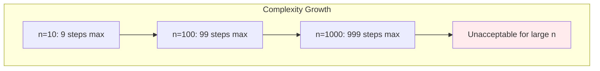
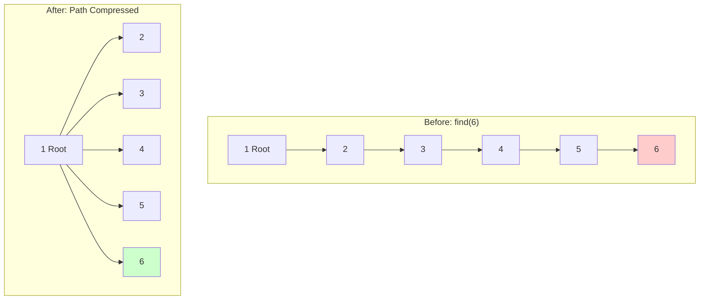
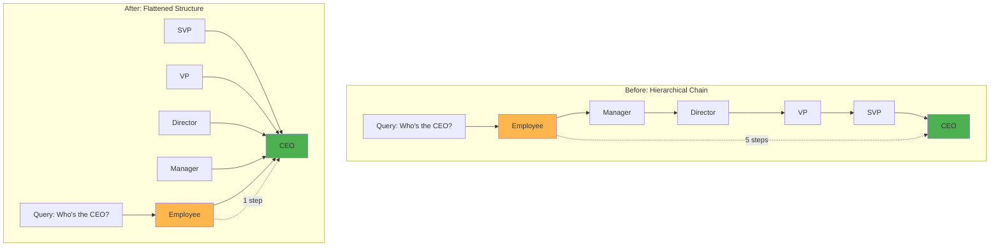
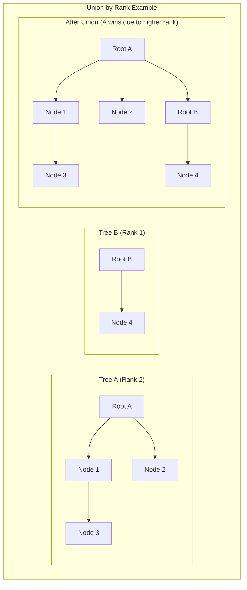

# The Optimizations: Path Compression and Union by Rank

The basic Union-Find algorithm is correct but can be inefficient in worst-case scenarios. Two crucial optimizations—path compression and union by rank—transform Union-Find from a potentially O(n) per operation data structure into one that achieves nearly constant amortized time complexity.

## The Problem with Naive Union-Find

Without optimizations, Union-Find can degenerate into a linked list, making operations extremely slow.

### Worst-Case Scenario: The Linear Chain

```mermaid
graph TD
    subgraph "Degenerate Chain Structure"
        A[1 Root] --> B[2] --> C[3] --> D[4] --> E[5] --> F[6]
        
        style A fill:#4caf50
        style F fill:#f44336
    end
    
    subgraph "Performance Analysis"
        G[find(6) operation]
        G --> H[Step 1: 6 → 5]
        H --> I[Step 2: 5 → 4]
        I --> J[Step 3: 4 → 3]
        J --> K[Step 4: 3 → 2]
        K --> L[Step 5: 2 → 1]
        L --> M[Finally reach root!]
        
        style G fill:#ffebee
        style M fill:#ffebee
    end
```

**How This Happens**:
```python
# Sequential unions create a chain
uf = UnionFind(6)
uf.union(1, 2)  # 1 becomes parent of 2
uf.union(2, 3)  # 2 becomes parent of 3  
uf.union(3, 4)  # 3 becomes parent of 4
uf.union(4, 5)  # 4 becomes parent of 5
uf.union(5, 6)  # 5 becomes parent of 6

# Result: 6 → 5 → 4 → 3 → 2 → 1 (root)
```

**Performance Impact**:
- `find(6)` requires 5 steps to reach the root
- Each operation becomes O(n) in the worst case
- Performance degrades as the structure grows



**Real-World Analogy**: 
Imagine a corporate hierarchy where every employee reports to just one other person, creating a chain from entry-level to CEO. Simple queries like "Who's the CEO?" require traversing the entire chain.

## Optimization 1: Path Compression

**Path compression** flattens the tree structure during find operations by making all nodes on the path point directly to the root.

### How Path Compression Works



**The Algorithm**:
```python
def find_with_compression(self, x):
    if self.parent[x] != x:
        # Recursively find root and compress path
        self.parent[x] = self.find_with_compression(self.parent[x])
    return self.parent[x]
```

**Key Insight**: While finding the root, remember the path and update all intermediate nodes to point directly to the root.

### Path Compression in Action

```python
class UnionFind:
    def __init__(self, n):
        self.parent = list(range(n))
    
    def find(self, x):
        # Without compression (basic version)
        while self.parent[x] != x:
            x = self.parent[x]
        return x
    
    def find_compressed(self, x):
        # With path compression
        if self.parent[x] != x:
            self.parent[x] = self.find_compressed(self.parent[x])
        return self.parent[x]

# Demonstration
uf = UnionFind(6)
# Create chain: 0 → 1 → 2 → 3 → 4 → 5
for i in range(5):
    uf.parent[i+1] = i

print("Before compression:")
print(f"parent array: {uf.parent}")

# Perform find with compression
root = uf.find_compressed(5)

print("After compression:")
print(f"parent array: {uf.parent}")
print(f"Root: {root}")
```

**Output**:
```
Before compression:
parent array: [0, 0, 1, 2, 3, 4]

After compression:  
parent array: [0, 0, 0, 0, 0, 0]
Root: 0
```

### The Corporate Restructuring Analogy

Think of path compression as corporate restructuring:



**Benefits**:
- Future queries are instant
- Reduces communication overhead
- Maintains the same reporting relationships (connectivity preserved)

## Optimization 2: Union by Rank

**Union by rank** prevents tree degradation by always attaching the shorter tree under the root of the taller tree during union operations.

### The Ranking System

**Rank**: An upper bound on the height of a tree rooted at each node.

**Rules**:
- Initially, all nodes have rank 0 (singleton trees)
- When uniting trees of different ranks: lower rank attaches under higher rank
- When uniting trees of equal rank: arbitrary choice, but increment the new root's rank



### Implementation

```python
class UnionFindOptimized:
    def __init__(self, n):
        self.parent = list(range(n))
        self.rank = [0] * n
    
    def find(self, x):
        if self.parent[x] != x:
            self.parent[x] = self.find(self.parent[x])  # Path compression
        return self.parent[x]
    
    def union(self, x, y):
        root_x = self.find(x)
        root_y = self.find(y)
        
        if root_x == root_y:
            return  # Already in same set
        
        # Union by rank
        if self.rank[root_x] < self.rank[root_y]:
            self.parent[root_x] = root_y
        elif self.rank[root_x] > self.rank[root_y]:
            self.parent[root_y] = root_x
        else:
            # Equal ranks: choose arbitrarily and increment
            self.parent[root_y] = root_x
            self.rank[root_x] += 1
```

### Why Union by Rank Works

**The Tree Height Theorem**: 
A tree with rank r has at least 2^r nodes. Therefore, a tree with n nodes has rank at most log₂(n).

**Proof Sketch**:
- Rank increases only when merging trees of equal rank
- Merging two rank-r trees creates a rank-(r+1) tree
- The new tree has at least 2^r + 2^r = 2^(r+1) nodes
- By induction: rank-r tree has ≥ 2^r nodes

**Practical Implication**: 
Even without path compression, union by rank keeps tree height O(log n), making find operations O(log n) instead of potentially O(n).

### The Sports Tournament Analogy

Think of union by rank like organizing sports tournaments:

**Bad Approach (No Ranking)**:
- Randomly match teams regardless of skill level
- Weak teams might advance by luck
- Final tournament structure is unpredictable

**Good Approach (Seeded Tournament)**:
- Higher-seeded teams "absorb" lower-seeded teams
- Maintains competitive balance
- Stronger teams naturally rise to higher positions
- Tournament structure remains efficient

## The Synergy: Both Optimizations Together

Path compression and union by rank complement each other perfectly:

### Individual Benefits

**Path Compression Alone**:
- Excellent for query-heavy workloads
- Gradually flattens frequently-accessed paths
- Worst-case still possible for new/unoptimized paths

**Union by Rank Alone**:
- Prevents worst-case tree degradation
- Guarantees O(log n) height
- Still requires full path traversal for each find

### Combined Power

**Together**: Achieve amortized O(α(n)) time complexity, where α is the inverse Ackermann function.

```python
def optimized_union_find():
    """
    Demonstrates the combined power of both optimizations
    """
    class UF:
        def __init__(self, n):
            self.parent = list(range(n))
            self.rank = [0] * n
            self.operations = 0
            self.total_path_length = 0
        
        def find(self, x):
            path_length = 0
            original_x = x
            
            # Standard path traversal (counting steps)
            while self.parent[x] != x:
                path_length += 1
                x = self.parent[x]
            
            root = x
            
            # Path compression
            x = original_x
            while self.parent[x] != x:
                next_x = self.parent[x]
                self.parent[x] = root
                x = next_x
            
            self.operations += 1
            self.total_path_length += path_length
            return root
        
        def union(self, x, y):
            root_x, root_y = self.find(x), self.find(y)
            
            if root_x == root_y:
                return
            
            # Union by rank
            if self.rank[root_x] < self.rank[root_y]:
                self.parent[root_x] = root_y
            elif self.rank[root_x] > self.rank[root_y]:
                self.parent[root_y] = root_x
            else:
                self.parent[root_y] = root_x
                self.rank[root_x] += 1
        
        def average_path_length(self):
            return self.total_path_length / self.operations if self.operations > 0 else 0
    
    return UF

# Performance demonstration
uf = optimized_union_find()(1000)

# Create some initial structure
for i in range(999):
    uf.union(i, i + 1)

# Perform many find operations
for i in range(10000):
    uf.find(i % 1000)

print(f"Average path length: {uf.average_path_length():.2f}")
print(f"Theoretical worst case without optimization: {999}")
```

## Performance Analysis

### Time Complexity Evolution

| Version | Find | Union | Sequence of m Operations |
|---------|------|-------|-------------------------|
| Naive | O(n) | O(n) | O(m·n) |
| Path Compression Only | Amortized O(log n) | O(n) | O(m·log n) |
| Union by Rank Only | O(log n) | O(log n) | O(m·log n) |
| Both Optimizations | O(α(n)) | O(α(n)) | O(m·α(n)) |

### The Inverse Ackermann Function

The inverse Ackermann function α(n) grows incredibly slowly:

```
α(16) = 3
α(65536) = 4  
α(2^65536) = 5
```

**Practical Meaning**: For any realistic input size, α(n) ≤ 5, making operations effectively constant time.

### Real-World Performance Measurements

```python
import time

def benchmark_optimizations():
    """Compare performance of different optimization strategies"""
    
    def time_operations(uf_class, n, operations):
        uf = uf_class(n)
        
        start = time.time()
        
        # Build initial structure
        for i in range(n-1):
            uf.union(i, i+1)
        
        # Perform many finds
        for i in range(operations):
            uf.find(i % n)
        
        return time.time() - start
    
    n = 10000
    ops = 100000
    
    print(f"Benchmarking {n} nodes, {ops} operations:")
    print(f"Naive: {time_operations(NaiveUnionFind, n, ops):.3f}s")
    print(f"Path Compression: {time_operations(PathCompressionUF, n, ops):.3f}s")
    print(f"Union by Rank: {time_operations(UnionByRankUF, n, ops):.3f}s")
    print(f"Both Optimizations: {time_operations(OptimizedUF, n, ops):.3f}s")
```

## When Each Optimization Matters

### Path Compression Shines When:
- **Query-heavy workloads**: Many finds, fewer unions
- **Repeated queries**: Same elements queried multiple times
- **Deep initial structures**: Legacy data with poor initial organization

### Union by Rank Shines When:
- **Construction-heavy workloads**: Many unions during initial setup
- **Unknown query patterns**: Can't predict which paths will be accessed
- **Guaranteed performance**: Need worst-case bounds, not just average-case

### Both Together Are Essential For:
- **Production systems**: Need both good average and worst-case performance
- **Long-running applications**: Benefits compound over time
- **General-purpose libraries**: Can't predict usage patterns

## Implementation Best Practices

### Always Use Both Optimizations

```python
# ✅ Recommended: Full optimization
class UnionFind:
    def __init__(self, n):
        self.parent = list(range(n))
        self.rank = [0] * n
    
    def find(self, x):
        if self.parent[x] != x:
            self.parent[x] = self.find(self.parent[x])  # Path compression
        return self.parent[x]
    
    def union(self, x, y):
        root_x, root_y = self.find(x), self.find(y)
        if root_x == root_y:
            return
        
        # Union by rank
        if self.rank[root_x] < self.rank[root_y]:
            self.parent[root_x] = root_y
        elif self.rank[root_x] > self.rank[root_y]:
            self.parent[root_y] = root_x
        else:
            self.parent[root_y] = root_x
            self.rank[root_x] += 1
```

### Alternative: Union by Size

Some implementations use size instead of rank:

```python
class UnionFindBySize:
    def __init__(self, n):
        self.parent = list(range(n))
        self.size = [1] * n
    
    def union(self, x, y):
        root_x, root_y = self.find(x), self.find(y)
        if root_x == root_y:
            return
        
        # Union by size (attach smaller tree under larger)
        if self.size[root_x] < self.size[root_y]:
            self.parent[root_x] = root_y
            self.size[root_y] += self.size[root_x]
        else:
            self.parent[root_y] = root_x
            self.size[root_x] += self.size[root_y]
```

Both approaches provide similar performance guarantees; rank is slightly more common in textbooks, while size is more intuitive for many developers.

## Key Takeaways

1. **Neither optimization alone is sufficient**: Path compression needs rank/size to prevent initial degradation; rank/size needs path compression for optimal query performance

2. **The optimizations are complementary**: They work together to achieve better performance than either could alone

3. **Implementation is straightforward**: Both optimizations add minimal code complexity while providing dramatic performance improvements

4. **Real-world impact is significant**: The difference between naive and optimized Union-Find can be orders of magnitude in practical applications

5. **Amortized analysis applies**: Performance improves over time as the structure optimizes itself through use

The combination of path compression and union by rank transforms Union-Find from a simple but potentially inefficient data structure into one of the most elegant and performant solutions for connectivity problems in computer science.