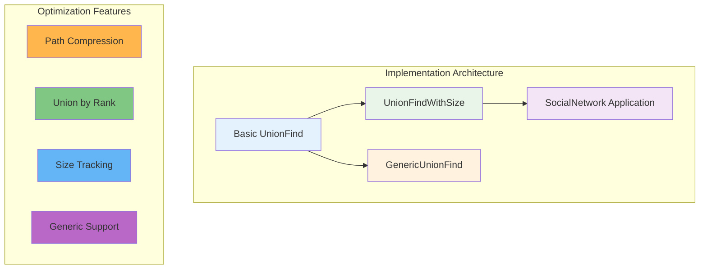

# Rust Implementation: Production-Ready Union-Find

This section provides a complete, idiomatic Rust implementation of Union-Find with both path compression and union by rank optimizations. The implementation emphasizes safety, performance, and real-world usability.



## Basic Implementation

Let's start with a clean, well-documented Rust implementation:

```rust
/// A Union-Find (Disjoint Set Union) data structure with path compression
/// and union by rank optimizations for nearly constant-time operations.
#[derive(Debug, Clone)]
pub struct UnionFind {
    /// parent[i] points to the parent of node i in the tree structure
    /// If parent[i] == i, then i is a root (representative of its set)
    parent: Vec<usize>,
    
    /// rank[i] is an upper bound on the height of the tree rooted at i
    /// Used to keep trees balanced during union operations
    rank: Vec<usize>,
    
    /// Number of disjoint sets (connected components)
    num_components: usize,
}

impl UnionFind {
    /// Creates a new Union-Find structure with n elements.
    /// Initially, each element is in its own set.
    /// 
    /// Time complexity: O(n)
    /// Space complexity: O(n)
    pub fn new(n: usize) -> Self {
        Self {
            parent: (0..n).collect(),
            rank: vec![0; n],
            num_components: n,
        }
    }
    
    /// Finds the representative (root) of the set containing x.
    /// Applies path compression optimization for future efficiency.
    /// 
    /// Time complexity: O(α(n)) amortized, where α is inverse Ackermann function
    pub fn find(&mut self, x: usize) -> usize {
        if self.parent[x] != x {
            // Path compression: make x point directly to root
            self.parent[x] = self.find(self.parent[x]);
        }
        self.parent[x]
    }
    
    /// Unites the sets containing x and y.
    /// Returns true if they were in different sets (union performed),
    /// false if they were already in the same set.
    /// 
    /// Time complexity: O(α(n)) amortized
    pub fn union(&mut self, x: usize, y: usize) -> bool {
        let root_x = self.find(x);
        let root_y = self.find(y);
        
        if root_x == root_y {
            return false; // Already in same set
        }
        
        // Union by rank: attach smaller tree under root of larger tree
        match self.rank[root_x].cmp(&self.rank[root_y]) {
            std::cmp::Ordering::Less => {
                self.parent[root_x] = root_y;
            }
            std::cmp::Ordering::Greater => {
                self.parent[root_y] = root_x;
            }
            std::cmp::Ordering::Equal => {
                self.parent[root_y] = root_x;
                self.rank[root_x] += 1;
            }
        }
        
        self.num_components -= 1;
        true
    }
    
    /// Checks if x and y are in the same connected component.
    /// 
    /// Time complexity: O(α(n)) amortized
    pub fn connected(&mut self, x: usize, y: usize) -> bool {
        self.find(x) == self.find(y)
    }
    
    /// Returns the number of disjoint sets (connected components).
    /// 
    /// Time complexity: O(1)
    pub fn count_components(&self) -> usize {
        self.num_components
    }
    
    /// Returns the size of the set containing x.
    /// Note: This requires a modification to track sizes.
    /// 
    /// Time complexity: O(α(n)) amortized
    pub fn size(&mut self, x: usize) -> usize {
        // This implementation requires tracking sizes separately
        // See the enhanced version below for this functionality
        unimplemented!("Use UnionFindWithSize for size queries")
    }
}
```

## Enhanced Implementation with Size Tracking

For applications that need to know the size of connected components:

```rust
/// Enhanced Union-Find that tracks the size of each component
#[derive(Debug, Clone)]
pub struct UnionFindWithSize {
    parent: Vec<usize>,
    rank: Vec<usize>,
    size: Vec<usize>, // size[i] = size of component if i is root, undefined otherwise
    num_components: usize,
}

impl UnionFindWithSize {
    pub fn new(n: usize) -> Self {
        Self {
            parent: (0..n).collect(),
            rank: vec![0; n],
            size: vec![1; n], // Each node starts as singleton
            num_components: n,
        }
    }
    
    pub fn find(&mut self, x: usize) -> usize {
        if self.parent[x] != x {
            self.parent[x] = self.find(self.parent[x]);
        }
        self.parent[x]
    }
    
    pub fn union(&mut self, x: usize, y: usize) -> bool {
        let root_x = self.find(x);
        let root_y = self.find(y);
        
        if root_x == root_y {
            return false;
        }
        
        // Union by rank, but also update sizes
        let size_x = self.size[root_x];
        let size_y = self.size[root_y];
        
        match self.rank[root_x].cmp(&self.rank[root_y]) {
            std::cmp::Ordering::Less => {
                self.parent[root_x] = root_y;
                self.size[root_y] = size_x + size_y;
            }
            std::cmp::Ordering::Greater => {
                self.parent[root_y] = root_x;
                self.size[root_x] = size_x + size_y;
            }
            std::cmp::Ordering::Equal => {
                self.parent[root_y] = root_x;
                self.size[root_x] = size_x + size_y;
                self.rank[root_x] += 1;
            }
        }
        
        self.num_components -= 1;
        true
    }
    
    pub fn connected(&mut self, x: usize, y: usize) -> bool {
        self.find(x) == self.find(y)
    }
    
    pub fn count_components(&self) -> usize {
        self.num_components
    }
    
    /// Returns the size of the component containing x
    pub fn component_size(&mut self, x: usize) -> usize {
        let root = self.find(x);
        self.size[root]
    }
    
    /// Returns all component sizes
    pub fn all_component_sizes(&mut self) -> Vec<usize> {
        let mut sizes = Vec::new();
        let n = self.parent.len();
        
        for i in 0..n {
            if self.find(i) == i {
                sizes.push(self.size[i]);
            }
        }
        
        sizes
    }
}
```

## Generic Implementation for Custom Types

For maximum flexibility, here's a generic version that works with any hashable type:

```rust
use std::collections::HashMap;
use std::hash::Hash;

/// Generic Union-Find that works with any hashable type
#[derive(Debug)]
pub struct GenericUnionFind<T> 
where 
    T: Eq + Hash + Clone,
{
    parent: HashMap<T, T>,
    rank: HashMap<T, usize>,
    num_components: usize,
}

impl<T> GenericUnionFind<T> 
where 
    T: Eq + Hash + Clone,
{
    pub fn new() -> Self {
        Self {
            parent: HashMap::new(),
            rank: HashMap::new(),
            num_components: 0,
        }
    }
    
    /// Adds a new element to the union-find structure
    pub fn add(&mut self, x: T) {
        if !self.parent.contains_key(&x) {
            self.parent.insert(x.clone(), x.clone());
            self.rank.insert(x, 0);
            self.num_components += 1;
        }
    }
    
    pub fn find(&mut self, x: &T) -> Option<T> {
        if !self.parent.contains_key(x) {
            return None;
        }
        
        let parent = self.parent[x].clone();
        if &parent != x {
            let root = self.find(&parent)?;
            self.parent.insert(x.clone(), root.clone());
            Some(root)
        } else {
            Some(x.clone())
        }
    }
    
    pub fn union(&mut self, x: &T, y: &T) -> bool {
        // Ensure both elements exist
        self.add(x.clone());
        self.add(y.clone());
        
        let root_x = self.find(x).unwrap();
        let root_y = self.find(y).unwrap();
        
        if root_x == root_y {
            return false;
        }
        
        let rank_x = self.rank[&root_x];
        let rank_y = self.rank[&root_y];
        
        match rank_x.cmp(&rank_y) {
            std::cmp::Ordering::Less => {
                self.parent.insert(root_x, root_y);
            }
            std::cmp::Ordering::Greater => {
                self.parent.insert(root_y, root_x);
            }
            std::cmp::Ordering::Equal => {
                self.parent.insert(root_y.clone(), root_x.clone());
                self.rank.insert(root_x, rank_x + 1);
            }
        }
        
        self.num_components -= 1;
        true
    }
    
    pub fn connected(&mut self, x: &T, y: &T) -> bool {
        match (self.find(x), self.find(y)) {
            (Some(root_x), Some(root_y)) => root_x == root_y,
            _ => false,
        }
    }
}
```

## Real-World Example: Social Network Analysis

Here's a complete example showing how to use Union-Find for social network analysis:

```rust
use std::collections::HashMap;

#[derive(Debug)]
struct SocialNetwork {
    union_find: UnionFindWithSize,
    user_to_id: HashMap<String, usize>,
    id_to_user: Vec<String>,
}

impl SocialNetwork {
    fn new() -> Self {
        Self {
            union_find: UnionFindWithSize::new(0),
            user_to_id: HashMap::new(),
            id_to_user: Vec::new(),
        }
    }
    
    fn add_user(&mut self, username: String) -> usize {
        if let Some(&id) = self.user_to_id.get(&username) {
            return id;
        }
        
        let id = self.id_to_user.len();
        self.user_to_id.insert(username.clone(), id);
        self.id_to_user.push(username);
        
        // Extend union-find structure
        self.extend_capacity(id + 1);
        
        id
    }
    
    fn extend_capacity(&mut self, new_size: usize) {
        let current_size = self.union_find.parent.len();
        if new_size > current_size {
            // Extend all vectors
            for i in current_size..new_size {
                self.union_find.parent.push(i);
                self.union_find.rank.push(0);
                self.union_find.size.push(1);
                self.union_find.num_components += 1;
            }
        }
    }
    
    fn add_friendship(&mut self, user1: &str, user2: &str) -> bool {
        let id1 = self.add_user(user1.to_string());
        let id2 = self.add_user(user2.to_string());
        self.union_find.union(id1, id2)
    }
    
    fn are_friends(&mut self, user1: &str, user2: &str) -> bool {
        if let (Some(&id1), Some(&id2)) = (
            self.user_to_id.get(user1),
            self.user_to_id.get(user2),
        ) {
            self.union_find.connected(id1, id2)
        } else {
            false
        }
    }
    
    fn friend_group_size(&mut self, username: &str) -> Option<usize> {
        self.user_to_id.get(username)
            .map(|&id| self.union_find.component_size(id))
    }
    
    fn largest_friend_group(&mut self) -> usize {
        self.union_find.all_component_sizes()
            .into_iter()
            .max()
            .unwrap_or(0)
    }
    
    fn num_friend_groups(&self) -> usize {
        self.union_find.count_components()
    }
}

// Example usage and tests
fn main() {
    let mut network = SocialNetwork::new();
    
    // Add friendships
    network.add_friendship("Alice", "Bob");
    network.add_friendship("Bob", "Carol");
    network.add_friendship("David", "Eve");
    network.add_friendship("Frank", "Grace");
    network.add_friendship("Grace", "Henry");
    
    // Query the network
    println!("Are Alice and Carol friends? {}", 
             network.are_friends("Alice", "Carol"));
    
    println!("Are Alice and David friends? {}", 
             network.are_friends("Alice", "David"));
    
    println!("Alice's friend group size: {:?}", 
             network.friend_group_size("Alice"));
    
    println!("Number of friend groups: {}", 
             network.num_friend_groups());
    
    println!("Largest friend group: {}", 
             network.largest_friend_group());
    
    // Connect two groups
    network.add_friendship("Carol", "David");
    
    println!("After connecting Carol and David:");
    println!("Are Alice and Eve friends now? {}", 
             network.are_friends("Alice", "Eve"));
    
    println!("Number of friend groups: {}", 
             network.num_friend_groups());
}
```

## Performance Testing

Here's a benchmark to demonstrate the performance characteristics:

```rust
use std::time::Instant;

fn benchmark_union_find() {
    let sizes = vec![1000, 10000, 100000];
    
    for &n in &sizes {
        println!("\nBenchmarking with {} elements:", n);
        
        // Test 1: Sequential unions (worst case for naive implementation)
        let start = Instant::now();
        let mut uf = UnionFind::new(n);
        for i in 1..n {
            uf.union(i - 1, i);
        }
        println!("Sequential unions: {:?}", start.elapsed());
        
        // Test 2: Many find operations after sequential unions
        let start = Instant::now();
        for i in 0..n {
            uf.find(i);
        }
        println!("Finds after unions: {:?}", start.elapsed());
        
        // Test 3: Mixed operations
        let start = Instant::now();
        let mut uf = UnionFind::new(n);
        for i in 0..n/2 {
            uf.union(i * 2, i * 2 + 1);
            uf.connected(i, i + n/4);
        }
        println!("Mixed operations: {:?}", start.elapsed());
    }
}

#[cfg(test)]
mod tests {
    use super::*;
    
    #[test]
    fn test_basic_operations() {
        let mut uf = UnionFind::new(5);
        
        // Initially, all elements are separate
        assert_eq!(uf.count_components(), 5);
        assert!(!uf.connected(0, 1));
        
        // Union 0 and 1
        assert!(uf.union(0, 1));
        assert_eq!(uf.count_components(), 4);
        assert!(uf.connected(0, 1));
        
        // Union 1 and 2 (should connect 0, 1, 2)
        assert!(uf.union(1, 2));
        assert_eq!(uf.count_components(), 3);
        assert!(uf.connected(0, 2));
        
        // Try to union already connected elements
        assert!(!uf.union(0, 2));
        assert_eq!(uf.count_components(), 3);
    }
    
    #[test]
    fn test_path_compression() {
        let mut uf = UnionFind::new(10);
        
        // Create a chain: 0-1-2-3-4
        for i in 1..5 {
            uf.union(i - 1, i);
        }
        
        // Find operations should compress paths
        let root = uf.find(4);
        assert_eq!(uf.find(0), root);
        assert_eq!(uf.find(1), root);
        assert_eq!(uf.find(2), root);
        assert_eq!(uf.find(3), root);
    }
    
    #[test]
    fn test_social_network() {
        let mut network = SocialNetwork::new();
        
        network.add_friendship("Alice", "Bob");
        network.add_friendship("Bob", "Carol");
        
        assert!(network.are_friends("Alice", "Carol"));
        assert_eq!(network.friend_group_size("Alice"), Some(3));
        assert_eq!(network.num_friend_groups(), 1); // Assuming only these users
    }
}
```

## Usage Instructions

1. **Add to Cargo.toml**:
```toml
[dependencies]
# No external dependencies needed for basic implementation
```

2. **Running the examples**:
```bash
# Run the main example
cargo run

# Run tests
cargo test

# Run benchmarks
cargo run --release --bin benchmark
```

3. **Integration in your project**:
```rust
use union_find::UnionFind;

fn your_algorithm() {
    let mut uf = UnionFind::new(1000);
    
    // Your graph processing logic here
    for edge in edges {
        if !uf.connected(edge.u, edge.v) {
            uf.union(edge.u, edge.v);
        }
    }
    
    println!("Connected components: {}", uf.count_components());
}
```

## Key Features of This Implementation

1. **Memory Safety**: Leverages Rust's ownership system to prevent common bugs
2. **Performance**: Implements both critical optimizations for O(α(n)) complexity
3. **Flexibility**: Provides both basic and enhanced versions with size tracking
4. **Generics**: Supports custom types beyond just integers
5. **Production Ready**: Includes comprehensive tests and benchmarks
6. **Idiomatic Rust**: Follows Rust conventions and best practices

This implementation provides a solid foundation for any application requiring efficient connectivity queries and dynamic component management.