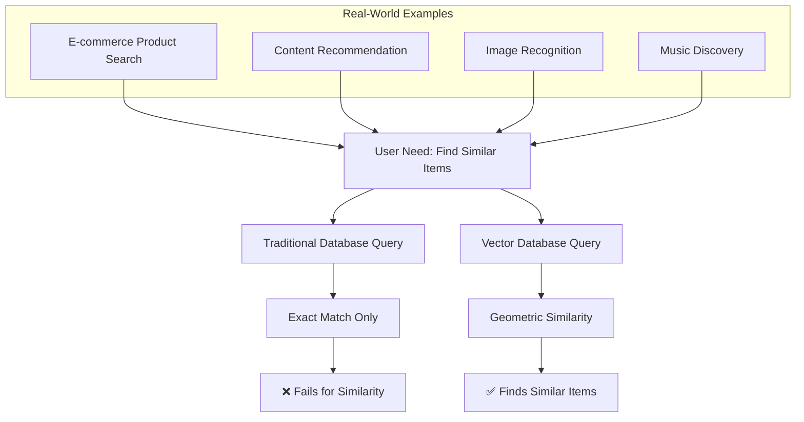
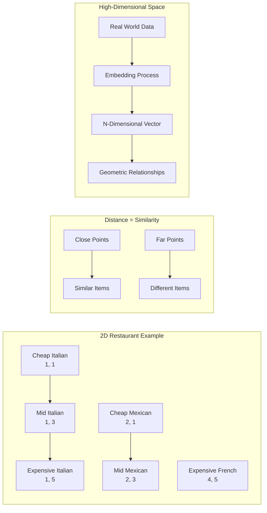
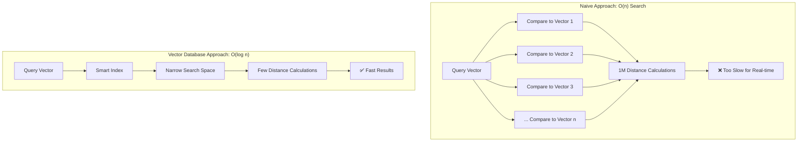

# The Core Problem: When Exact Matches Aren't Enough

Traditional databases are magnificent at finding exact matches. Ask for user ID 12345? You get user ID 12345. Ask for all orders placed on March 15th? You get exactly those orders. This works beautifully for structured data where you know precisely what you're looking for.

But what happens when you need to ask: "Show me products similar to this one" or "Find documents that are semantically related to this text"? Suddenly, traditional databases hit a wall.

## The Similarity Search Challenge

Consider these real-world scenarios:



**E-commerce**: A customer views a red winter coat and wants to see "similar products." Similar how? By color? Material? Style? Price range? Brand? A traditional database can't answer "find me items similar to this coat" because it has no concept of similarity.

**Content Discovery**: A user reads an article about machine learning and wants to find related content. Traditional keyword matching fails because related articles might discuss "artificial intelligence," "neural networks," or "data science" without using the exact phrase "machine learning."

**Image Search**: A user uploads a photo of a sunset and wants to find similar images. Traditional databases can't compare visual content—they can only match file names, metadata, or tags.

## Why Traditional Databases Struggle

Traditional databases excel at discrete, categorical queries:

```sql
SELECT * FROM products WHERE category = 'electronics' AND price < 500;
```

But they fail at continuous, similarity-based queries:

```sql
-- This doesn't exist in traditional SQL
SELECT * FROM products WHERE similarity(image, user_uploaded_image) > 0.8;
```

The fundamental issue is that traditional databases lack a mathematical framework for measuring **similarity**. They can tell you if two values are identical, but they can't tell you if they're *similar*.

## The Geometric Insight

Here's where vector databases provide a breakthrough insight: **similarity can be measured as distance in geometric space**.



Imagine plotting restaurants on a 2D map based on two attributes:
- X-axis: Cuisine type (Italian=1, Mexican=2, Chinese=3, etc.)
- Y-axis: Price range (1-5 scale)

Restaurants close to each other on this map are similar. A high-end Italian restaurant (1, 5) is more similar to a high-end French restaurant (1.2, 5) than to a cheap Italian restaurant (1, 1).

Vector databases extend this concept to hundreds or thousands of dimensions, creating geometric spaces where similarity becomes a distance calculation. Items that are similar in the real world end up close together in this high-dimensional space.

## The Scale Challenge

Even with this geometric insight, similarity search faces a massive computational challenge. In a space with millions of items and hundreds of dimensions, finding the closest neighbors becomes computationally expensive.



A naive approach would require calculating the distance from your query point to every single item in the database. For a million-item database, that's a million distance calculations for every search query—clearly not scalable.

Vector databases solve this with sophisticated indexing algorithms that can find similar items in logarithmic time, making billion-scale similarity search practical.

### The Computational Reality

Consider the math behind similarity search at scale:

- **1K vectors**: ~500 distance calculations on average (manageable)
- **1M vectors**: ~500K distance calculations (slow but possible)
- **1B vectors**: ~500M distance calculations (impossible in real-time)

This is why advanced indexing techniques like LSH, HNSW, and IVF are crucial for practical vector databases.

## Real-World Impact

This isn't just a theoretical computer science problem. The inability to perform efficient similarity search has been a limiting factor in:

- **Recommendation Systems**: "People who bought this also bought..."
- **Search Engines**: Finding relevant results for natural language queries
- **AI Applications**: Retrieval-augmented generation (RAG) systems
- **Computer Vision**: Reverse image search and object recognition
- **Fraud Detection**: Finding patterns similar to known fraudulent behavior

Vector databases unlock all these use cases by making similarity search both mathematically rigorous and computationally efficient.