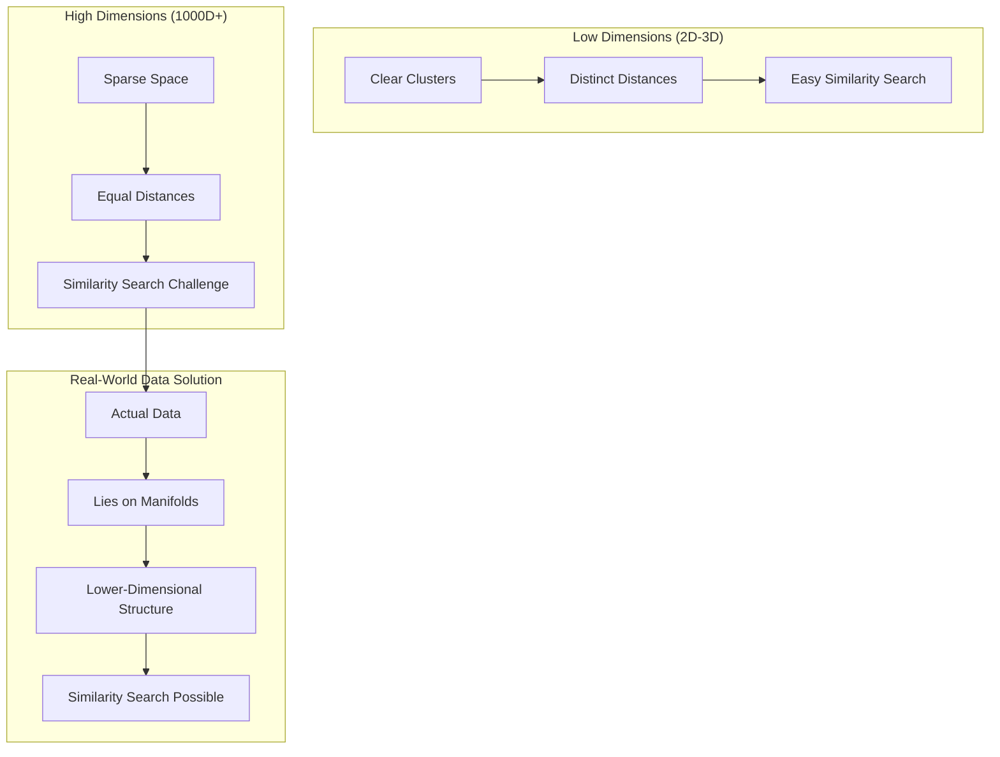
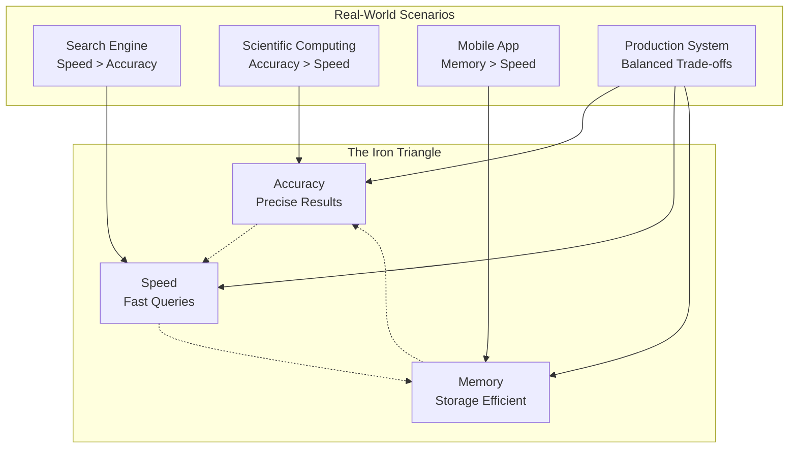

# The Guiding Philosophy: Geometry as the Universal Language of Similarity

Vector databases operate on a profound philosophical insight: **all similarity can be expressed as distance in geometric space**. This isn't just a clever trick—it's a fundamental way of thinking about how information relates to itself.

## The Mathematical Foundation

At its core, this philosophy rests on a simple mathematical truth: if you can represent two items as points in the same coordinate system, you can measure how similar they are by calculating the distance between them.

Think of it this way: in a 2D plane, the point (1, 1) is closer to (2, 2) than to (10, 10). If these coordinates represent meaningful attributes of real-world objects, then geometric proximity translates to actual similarity.

Vector databases extend this principle to hundreds or thousands of dimensions, creating spaces where complex real-world relationships become geometric relationships.

## The Embedding Transformation

The magic happens through a process called **embedding**—transforming arbitrary data into numerical vectors that preserve semantic meaning. This transformation is the bridge between the messy, unstructured world of real data and the elegant, mathematical world of geometry.

Consider how different types of data get embedded:

**Text**: The word "king" might become `[0.2, -0.4, 0.7, 0.1, ...]` where each dimension captures some aspect of its meaning. Words with similar meanings end up with similar vectors.

**Images**: A photo of a cat might become `[0.3, 0.8, -0.1, 0.5, ...]` where each dimension represents visual features. Photos of similar cats cluster together in this space.

**User Behavior**: A user's preferences might become `[0.6, -0.2, 0.9, 0.3, ...]` where each dimension represents affinity for different product categories.

## The Curse of Dimensionality

This geometric approach creates a fascinating paradox: as we add more dimensions to capture more nuanced relationships, the space becomes increasingly sparse. In high-dimensional spaces, most points are roughly equidistant from each other—a phenomenon called the "curse of dimensionality."

This sounds like it would make similarity search impossible, but vector databases turn this apparent weakness into a strength. They use the fact that real-world data doesn't fill high-dimensional spaces uniformly. Instead, it tends to cluster along lower-dimensional manifolds—like a 2D sheet curved through 3D space.

### The Manifold Hypothesis

Real-world high-dimensional data has hidden structure:

- **Text embeddings**: Despite being 1000+ dimensions, they capture semantic relationships in much lower-dimensional spaces
- **Image embeddings**: Visual concepts cluster together, creating neighborhoods of similar images
- **User behavior**: Purchasing patterns follow predictable, lower-dimensional patterns

This structure is what makes vector databases practical despite the curse of dimensionality.

## The Trade-off Triangle

Vector databases constantly balance three competing forces:

**Accuracy**: How precisely can we find the most similar items?
**Speed**: How quickly can we return results?  
**Memory**: How much storage and RAM do we need?

Perfect accuracy would require exact distance calculations to every item—too slow. Perfect speed would require pre-computing all distances—too much memory. The art of vector database design lies in finding the optimal balance for each use case.

### The Engineering Reality

Different applications require different trade-offs:

- **Search Engines**: Favor speed over perfect accuracy (users want results in milliseconds)
- **Scientific Computing**: Favor accuracy over speed (researchers need precise results)
- **Mobile Applications**: Favor memory efficiency over everything else (limited resources)
- **Production Systems**: Need balanced performance across all three dimensions

## Approximate is Good Enough

Here's a counterintuitive insight: for most real-world applications, **approximate similarity search is not only acceptable—it's preferable**.

Consider recommendation systems. If the mathematically perfect match is a product that's out of stock, but the second-best match is available and appealing, the approximate result provides better user experience. The "good enough" philosophy allows vector databases to achieve massive scale while maintaining practical utility.

## The Locality Principle

Vector databases exploit a key insight from the physical world: **similar items tend to be clustered together, not scattered randomly**. This locality principle enables powerful indexing strategies.

Just as you'd organize a physical library by subject rather than randomly shuffling books, vector databases organize similar vectors near each other. This spatial organization makes search dramatically more efficient—you can quickly narrow down to the right neighborhood, then search locally.

## Semantic Preservation

The most crucial philosophical principle is **semantic preservation**: the geometric relationships in vector space must reflect real-world relationships. A vector database that places "car" closer to "airplane" than to "bicycle" has failed at its fundamental task.

This places enormous importance on the embedding process. The quality of embeddings determines whether the geometric space truly captures meaningful similarity. Bad embeddings create mathematically valid but semantically meaningless results.

## The Scalability Mindset

Finally, vector databases embrace a fundamentally different approach to scalability than traditional databases. Instead of trying to make exact operations faster, they make approximate operations so efficient that they remain practical at massive scale.

This represents a philosophical shift from "perfect answers slowly" to "good answers quickly." For similarity search, this trade-off is not just acceptable—it's essential for real-world applications.

## The Network Effect

As vector databases grow larger, they often become more useful rather than less. More data points provide better context for similarity judgments. A vector database with a million product embeddings can make more nuanced similarity distinctions than one with a thousand.

This creates a positive feedback loop: better similarity search attracts more users, which generates more data, which improves similarity search quality.