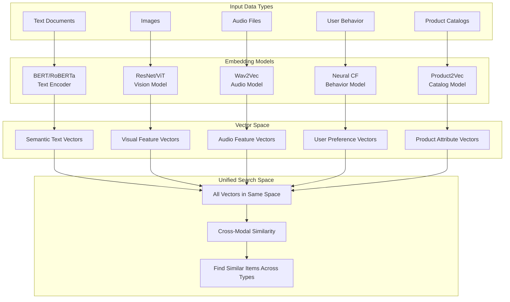
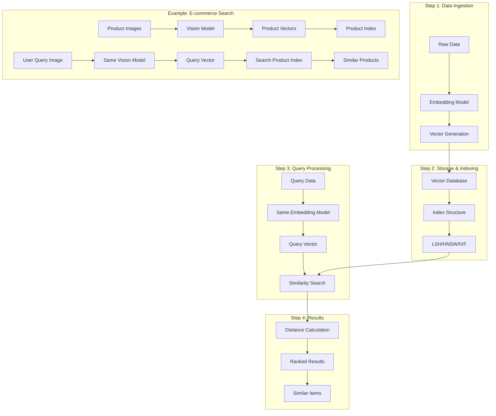

# Key Abstractions: The Building Blocks of Vector Similarity

Vector databases introduce three fundamental abstractions that transform the chaotic world of unstructured data into an elegant, searchable geometric space. Understanding these abstractions is crucial for grasping how vector databases work and when to use them.

## 1. The Embedding: Data as Coordinates

An **embedding** is a numerical representation of any data that preserves its semantic meaning. Think of it as a universal translator that converts text, images, audio, or any other data type into a common mathematical language—vectors.

### The Restaurant Map Analogy

Imagine you're creating a map of restaurants in your city. Instead of plotting them by their physical addresses, you plot them by their characteristics:

- **X-axis**: Cuisine type (Italian=1, Mexican=2, Chinese=3, French=4, etc.)
- **Y-axis**: Price range (1=cheap, 5=expensive)
- **Z-axis**: Ambiance (1=casual, 5=formal)

Each restaurant becomes a point in this 3D space: `[cuisine_type, price_range, ambiance]`. A cozy Italian bistro might be `[1, 3, 2]`, while an upscale French restaurant might be `[4, 5, 5]`.

The magic happens when you realize that restaurants close to each other in this space are actually similar in real life. The geometric distance between two points reflects how similar the restaurants are.

### Real-World Embeddings

Vector databases extend this principle to hundreds or thousands of dimensions:

**Text Embeddings**: The sentence "The cat sat on the mat" becomes something like `[0.2, -0.4, 0.7, 0.1, ...]` where each dimension captures semantic meaning. Similar sentences end up with similar vectors.

**Image Embeddings**: A photo of a sunset becomes `[0.3, 0.8, -0.1, 0.5, ...]` where dimensions represent visual features like color, texture, and composition.

**Product Embeddings**: A red winter coat becomes `[0.6, -0.2, 0.9, 0.3, ...]` where dimensions represent attributes like color, season, style, and material.

### The Embedding Process

Creating embeddings typically involves machine learning models:



### The Magic of Embeddings

Embeddings transform completely different data types into a unified mathematical space where similarity becomes computable:

- **"The cat sleeps"** → `[0.2, -0.1, 0.9, ...]`
- **🐱 Cat Image** → `[0.3, 0.8, -0.1, ...]`
- **User who loves cats** → `[0.1, 0.7, 0.8, ...]`

Notice how conceptually similar items (all about cats) would have similar vector representations, enabling cross-modal search.

## 2. Vector Space: The Geometric Universe

A **vector space** is the mathematical environment where all embeddings live. It's a multi-dimensional coordinate system where each dimension represents some aspect of meaning.

### Dimensionality Matters

The number of dimensions in your vector space is crucial:

- **Low dimensions** (2-10): Easy to visualize and compute, but limited expressiveness
- **Medium dimensions** (100-500): Good balance for many applications
- **High dimensions** (1000+): Can capture very nuanced relationships but computationally expensive

### Spatial Properties

Vector spaces have geometric properties that make similarity search possible:

**Locality**: Similar items cluster together. All cat photos end up in the same neighborhood.

**Continuity**: Small changes in meaning result in small changes in position. "cat" and "kitten" are closer than "cat" and "automobile."

**Compositionality**: Vector arithmetic can capture relationships. The vector for "king" minus "man" plus "woman" approximately equals "queen."

## 3. Similarity Metrics: The Distance Functions

A **similarity metric** is the mathematical function that determines how similar two vectors are. It's the ruler that measures distance in your vector space.

### Common Distance Metrics

**Euclidean Distance**: The straight-line distance between two points.
```
distance = √((x₁-x₂)² + (y₁-y₂)² + (z₁-z₂)² + ...)
```
Best for: Numerical data where all dimensions have similar scales.

**Cosine Similarity**: Measures the angle between two vectors, ignoring their magnitude.
```
similarity = (A·B) / (||A|| × ||B||)
```
Best for: Text and high-dimensional data where direction matters more than magnitude.

**Dot Product**: The product of magnitudes and cosine of the angle.
```
similarity = A·B = |A| × |B| × cos(θ)
```
Best for: When both direction and magnitude are important.

### Choosing the Right Metric

The choice of similarity metric profoundly affects your results:

- **Euclidean distance** treats all dimensions equally
- **Cosine similarity** focuses on direction, ignoring magnitude
- **Dot product** considers both direction and magnitude

## The Unified Workflow

These three abstractions work together in a seamless workflow:



## The Power of Abstraction

These abstractions unlock powerful capabilities:

**Universal Similarity**: Any data type can be compared once embedded in vector space.

**Semantic Search**: "Find items similar to this" becomes a geometric problem.

**Recommendation Systems**: "People who liked this also liked..." becomes nearest neighbor search.

**Clustering**: "Group similar items together" becomes geometric clustering.

**Anomaly Detection**: "Find outliers" becomes finding distant points.

## Practical Considerations

### Embedding Quality

The quality of your embeddings determines everything. Poor embeddings create mathematically valid but semantically meaningless results. Great embeddings make similarity search feel magical.

### Dimensionality Trade-offs

Higher dimensions can capture more nuanced relationships but require more computation and storage. The optimal dimensionality depends on your data complexity and performance requirements.

### Metric Selection

Different similarity metrics emphasize different aspects of similarity. Experiment with multiple metrics to find what works best for your use case.

## The Abstraction Stack

Vector databases build these abstractions into a coherent system:

1. **Storage Layer**: Efficiently stores high-dimensional vectors
2. **Index Layer**: Organizes vectors for fast similarity search
3. **Query Layer**: Translates similarity queries into geometric operations
4. **Application Layer**: Provides easy-to-use APIs for developers

Understanding these core abstractions—embeddings, vector spaces, and similarity metrics—gives you the foundation to effectively use vector databases in your applications. They transform the fuzzy concept of "similarity" into precise, computable geometric relationships.