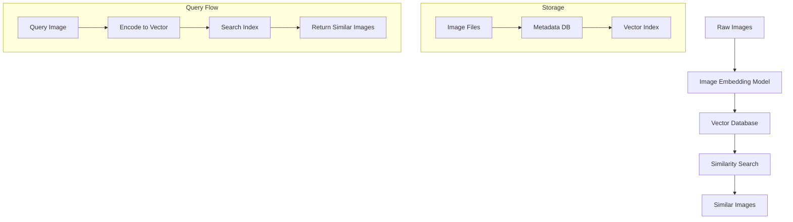

# Building Visual Similarity Search: A Practical Guide

In this guide, we'll build a complete image similarity search system from scratch. By the end, you'll have a working system that can find visually similar images—like a simplified version of Google's reverse image search.

## Prerequisites

- Basic Python knowledge
- Understanding of vector embeddings (covered in previous sections)
- Familiarity with basic machine learning concepts

## The Architecture

Our image search system has three main components:



## Step 1: Setting Up the Environment

First, let's install the required dependencies:

```bash
pip install torch torchvision transformers
pip install faiss-cpu  # or faiss-gpu for GPU support
pip install pillow numpy
```

## Step 2: Creating Image Embeddings

We'll use a pre-trained vision model to convert images into vectors:

```python
import torch
from transformers import CLIPProcessor, CLIPModel
from PIL import Image
import numpy as np

class ImageEmbedder:
    def __init__(self):
        self.model = CLIPModel.from_pretrained("openai/clip-vit-base-patch32")
        self.processor = CLIPProcessor.from_pretrained("openai/clip-vit-base-patch32")
        
    def embed_image(self, image_path):
        """Convert an image to a vector embedding"""
        # Load and preprocess image
        image = Image.open(image_path).convert('RGB')
        inputs = self.processor(images=image, return_tensors="pt")
        
        # Generate embedding
        with torch.no_grad():
            image_features = self.model.get_image_features(**inputs)
        
        # Normalize the vector (important for cosine similarity)
        embedding = image_features.numpy().flatten()
        embedding = embedding / np.linalg.norm(embedding)
        
        return embedding
```

## Step 3: Building the Vector Index

We'll use FAISS (Facebook AI Similarity Search) as our vector database:

```python
import faiss
import pickle
import os

class ImageVectorDB:
    def __init__(self, dimension=512):
        self.dimension = dimension
        self.index = faiss.IndexFlatIP(dimension)  # Inner product (cosine similarity)
        self.image_paths = []
        
    def add_image(self, image_path, embedding):
        """Add an image and its embedding to the database"""
        # Reshape embedding to 2D array (FAISS requirement)
        embedding_2d = embedding.reshape(1, -1).astype('float32')
        
        # Add to index
        self.index.add(embedding_2d)
        self.image_paths.append(image_path)
        
    def search_similar(self, query_embedding, k=5):
        """Find k most similar images"""
        # Reshape query embedding
        query_2d = query_embedding.reshape(1, -1).astype('float32')
        
        # Search for similar vectors
        similarities, indices = self.index.search(query_2d, k)
        
        # Return results
        results = []
        for i, idx in enumerate(indices[0]):
            if idx != -1:  # Valid result
                results.append({
                    'image_path': self.image_paths[idx],
                    'similarity': similarities[0][i]
                })
        
        return results
    
    def save(self, filepath):
        """Save the index to disk"""
        faiss.write_index(self.index, f"{filepath}.index")
        with open(f"{filepath}.metadata", 'wb') as f:
            pickle.dump(self.image_paths, f)
    
    def load(self, filepath):
        """Load the index from disk"""
        self.index = faiss.read_index(f"{filepath}.index")
        with open(f"{filepath}.metadata", 'rb') as f:
            self.image_paths = pickle.load(f)
```

## Step 4: Building the Complete System

Now let's combine everything into a complete image search system:

```python
import os
from glob import glob

class ImageSearchEngine:
    def __init__(self):
        self.embedder = ImageEmbedder()
        self.vector_db = ImageVectorDB()
        
    def index_images(self, image_directory):
        """Index all images in a directory"""
        print(f"Indexing images from {image_directory}...")
        
        # Supported image formats
        image_extensions = ['*.jpg', '*.jpeg', '*.png', '*.bmp', '*.tiff']
        
        # Find all image files
        image_paths = []
        for ext in image_extensions:
            image_paths.extend(glob(os.path.join(image_directory, '**', ext), recursive=True))
        
        print(f"Found {len(image_paths)} images")
        
        # Process each image
        for i, image_path in enumerate(image_paths):
            try:
                # Generate embedding
                embedding = self.embedder.embed_image(image_path)
                
                # Add to vector database
                self.vector_db.add_image(image_path, embedding)
                
                if (i + 1) % 100 == 0:
                    print(f"Processed {i + 1}/{len(image_paths)} images")
                    
            except Exception as e:
                print(f"Error processing {image_path}: {e}")
                continue
        
        print("Indexing complete!")
    
    def search_similar_images(self, query_image_path, k=5):
        """Find similar images to a query image"""
        # Generate embedding for query image
        query_embedding = self.embedder.embed_image(query_image_path)
        
        # Search for similar images
        results = self.vector_db.search_similar(query_embedding, k)
        
        return results
    
    def save_index(self, filepath):
        """Save the search index"""
        self.vector_db.save(filepath)
    
    def load_index(self, filepath):
        """Load the search index"""
        self.vector_db.load(filepath)
```

## Step 5: Usage Example

Here's how to use our image search system:

```python
# Create the search engine
search_engine = ImageSearchEngine()

# Index images from a directory
search_engine.index_images("./my_image_collection")

# Save the index for later use
search_engine.save_index("./image_search_index")

# Search for similar images
query_image = "./query_image.jpg"
similar_images = search_engine.search_similar_images(query_image, k=10)

# Print results
print(f"Images similar to {query_image}:")
for result in similar_images:
    print(f"  {result['image_path']} (similarity: {result['similarity']:.3f})")
```

## Step 6: Creating a Simple Web Interface

For a complete solution, let's add a simple web interface using Flask:

```python
from flask import Flask, request, render_template, jsonify
import os
from werkzeug.utils import secure_filename

app = Flask(__name__)
app.config['UPLOAD_FOLDER'] = 'uploads'

# Initialize search engine
search_engine = ImageSearchEngine()
search_engine.load_index("./image_search_index")

@app.route('/')
def index():
    return render_template('index.html')

@app.route('/search', methods=['POST'])
def search():
    if 'image' not in request.files:
        return jsonify({'error': 'No image uploaded'})
    
    file = request.files['image']
    if file.filename == '':
        return jsonify({'error': 'No image selected'})
    
    # Save uploaded image
    filename = secure_filename(file.filename)
    filepath = os.path.join(app.config['UPLOAD_FOLDER'], filename)
    file.save(filepath)
    
    try:
        # Search for similar images
        results = search_engine.search_similar_images(filepath, k=10)
        
        # Format results for JSON response
        formatted_results = []
        for result in results:
            formatted_results.append({
                'image_path': result['image_path'],
                'similarity': float(result['similarity'])
            })
        
        return jsonify({'results': formatted_results})
    
    except Exception as e:
        return jsonify({'error': str(e)})

if __name__ == '__main__':
    app.run(debug=True)
```

## Understanding the Results

The similarity scores returned by our system represent how visually similar images are:

- **Score > 0.9**: Nearly identical images (same photo, different compression)
- **Score 0.7-0.9**: Very similar images (same object, different angle/lighting)
- **Score 0.5-0.7**: Moderately similar images (similar objects or scenes)
- **Score < 0.5**: Loosely related or unrelated images

## Performance Considerations

**Embedding Generation**: The bottleneck is usually converting images to embeddings. Consider:
- Using GPU acceleration for faster inference
- Batch processing multiple images at once
- Pre-computing embeddings for large datasets

**Index Performance**: FAISS provides several index types:
- `IndexFlatIP`: Exact search, good for < 1M vectors
- `IndexIVFFlat`: Approximate search, good for 1M-10M vectors
- `IndexHNSW`: Graph-based search, excellent for very large datasets

**Memory Usage**: Each image requires ~2KB of storage (512 dimensions × 4 bytes). Plan accordingly for large collections.

## Next Steps

This guide gave you a complete working image search system. To make it production-ready, consider:

1. **Scalability**: Use distributed vector databases like Pinecone or Weaviate
2. **Performance**: Implement caching and optimize embedding generation
3. **Accuracy**: Fine-tune the embedding model on your specific domain
4. **Features**: Add filtering by metadata, batch upload, and result ranking

You now have the foundation to build sophisticated visual search applications!