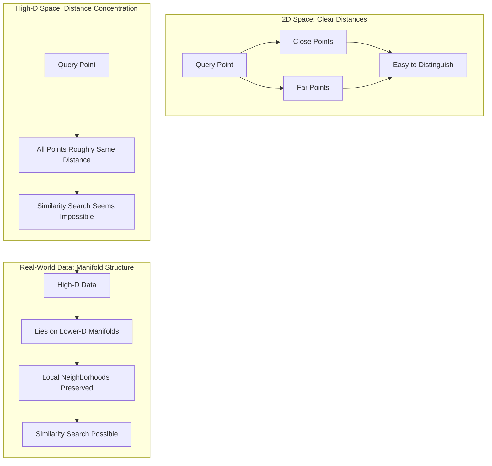
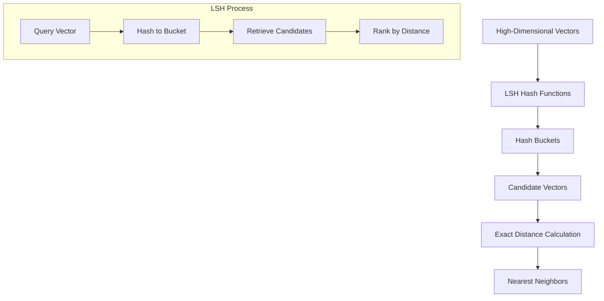
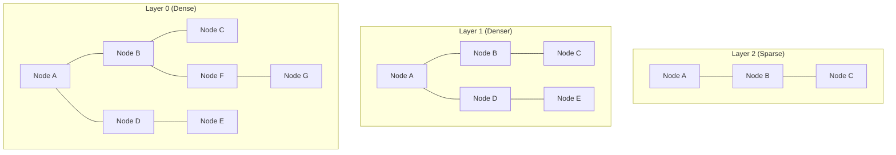
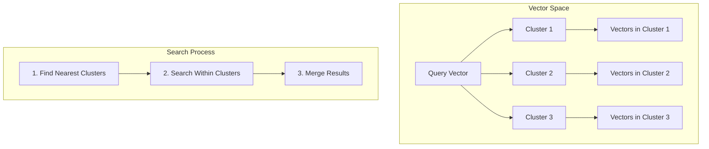
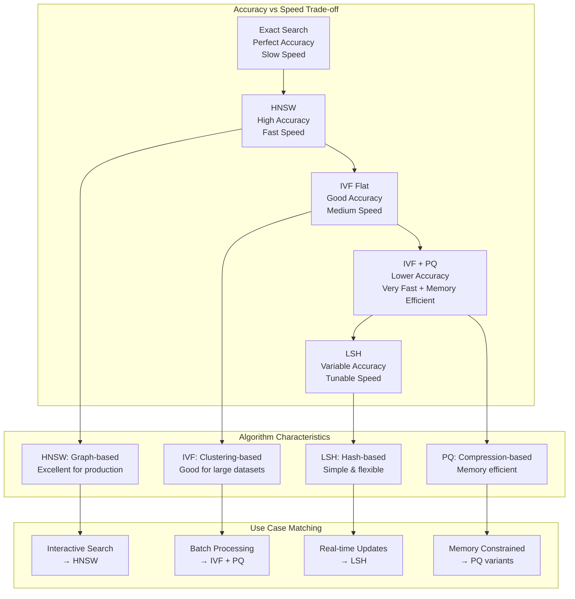
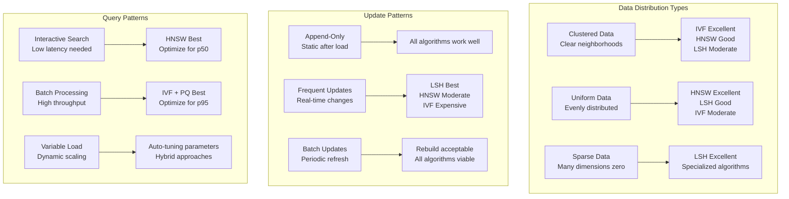
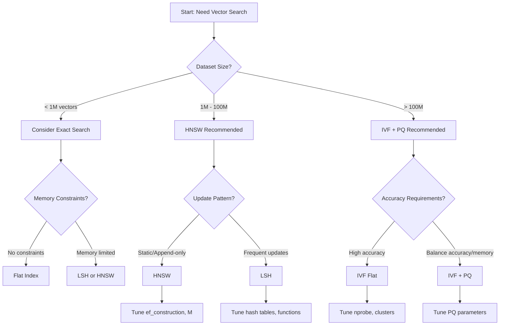

# Deep Dive: Indexing High-Dimensional Spaces

When you have millions of vectors in hundreds of dimensions, finding the nearest neighbors becomes a computational nightmare. A naive approach would require calculating distances to every single vector—clearly not scalable. This deep dive explores the sophisticated algorithms that make billion-scale similarity search practical.

## The High-Dimensional Challenge

### The Curse of Dimensionality

In high-dimensional spaces, something counterintuitive happens: all points become roughly equidistant from each other. This phenomenon, known as the "curse of dimensionality," makes traditional indexing approaches ineffective.



Consider this thought experiment:
- In 2D, points can be clearly close or far apart
- In 100D, the ratio of distances between nearest and farthest neighbors approaches 1
- In 1000D, almost all points are approximately the same distance from any query point

This sounds like it would make similarity search impossible, but clever algorithms exploit the structure of real-world data to overcome this challenge.

### The Manifold Hypothesis

Real-world high-dimensional data doesn't fill space uniformly. Instead, it tends to lie on or near lower-dimensional manifolds—like a 2D sheet curved through 3D space. This structure is what makes high-dimensional similarity search possible.

**Examples of Manifold Structure:**
- **Face recognition**: All human faces occupy a small subspace within the space of all possible images
- **Language models**: Word embeddings cluster by semantic meaning despite high dimensionality
- **Music recommendation**: User preferences follow predictable patterns in taste space

## Indexing Strategies

### 1. Locality-Sensitive Hashing (LSH)

LSH is based on a simple insight: if you can design hash functions that map similar vectors to the same bucket, you can reduce search to a hashtable lookup.

#### How LSH Works



#### Random Projection LSH

For cosine similarity, one effective LSH family uses random hyperplanes:

```python
import numpy as np

class RandomProjectionLSH:
    def __init__(self, dimension, num_hash_functions, num_tables):
        self.dimension = dimension
        self.num_hash_functions = num_hash_functions
        self.num_tables = num_tables
        
        # Create random hyperplanes for each hash function
        self.hyperplanes = []
        for _ in range(num_tables):
            table_hyperplanes = np.random.randn(num_hash_functions, dimension)
            self.hyperplanes.append(table_hyperplanes)
    
    def hash_vector(self, vector, table_idx):
        """Hash a vector using the specified table"""
        # Calculate dot products with hyperplanes
        dots = np.dot(self.hyperplanes[table_idx], vector)
        
        # Convert to binary hash code
        hash_code = tuple(dots >= 0)
        return hash_code
```

#### Trade-offs

**Pros:**
- Simple to implement and understand
- Provides probabilistic guarantees
- Works well for certain distance metrics

**Cons:**
- Requires careful tuning of parameters
- Can have high memory overhead
- May miss some nearest neighbors (false negatives)

### 2. Hierarchical Navigable Small World (HNSW)

HNSW is currently the state-of-the-art for approximate nearest neighbor search. It combines the efficiency of skip lists with the connectivity of small-world networks.

#### The Small World Insight

In a small-world network (like social networks), you can reach any node from any other node in just a few hops. HNSW creates a similar structure in vector space.

#### The Hierarchical Structure



#### How HNSW Search Works

1. **Start at the top layer** with sparse, long-range connections
2. **Greedily navigate** toward the query, making large jumps
3. **Descend to lower layers** as you get closer to the target
4. **Refine the search** in the dense bottom layer

#### HNSW Construction Algorithm

```python
class HNSWIndex:
    def __init__(self, dimension, max_connections=16, ef_construction=200):
        self.dimension = dimension
        self.max_connections = max_connections
        self.ef_construction = ef_construction
        self.layers = []
        self.entry_point = None
    
    def insert(self, vector):
        # Determine which layers this node will exist in
        layer = self._get_random_layer()
        
        if self.entry_point is None:
            # First node becomes the entry point
            self.entry_point = vector
            self._add_to_layers(vector, layer)
            return
        
        # Search for closest nodes in upper layers
        entry_points = [self.entry_point]
        
        for lev in range(len(self.layers) - 1, layer, -1):
            entry_points = self._search_layer(vector, entry_points, 1, lev)
        
        # Insert into layers 0 to 'layer'
        for lev in range(min(layer, len(self.layers) - 1), -1, -1):
            candidates = self._search_layer(
                vector, entry_points, self.ef_construction, lev
            )
            
            # Select diverse neighbors
            connections = self._select_neighbors(vector, candidates)
            
            # Add bidirectional connections
            self._add_connections(vector, connections, lev)
            
            entry_points = candidates
    
    def _get_random_layer(self):
        """Exponentially decay probability for higher layers"""
        layer = 0
        while np.random.random() < 0.5 and layer < 16:
            layer += 1
        return layer
```

#### Why HNSW Works

**Logarithmic Search Time**: The hierarchical structure allows searching in O(log n) time.

**High Recall**: The dense bottom layer ensures we don't miss nearby neighbors.

**Efficient Construction**: New nodes can be inserted without rebuilding the entire index.

### 3. Inverted File Index (IVF)

IVF combines the ideas of clustering and inverted indexes to speed up vector search.

#### The Clustering Approach



#### How IVF Works

1. **Clustering**: Partition vectors into k clusters using k-means
2. **Indexing**: For each cluster, maintain a list of vectors in that cluster
3. **Search**: Find nearest cluster centroids, then search within those clusters

#### IVF Implementation Sketch

```python
class IVFIndex:
    def __init__(self, dimension, num_clusters=1000):
        self.dimension = dimension
        self.num_clusters = num_clusters
        self.centroids = None
        self.inverted_lists = {}
    
    def train(self, training_vectors):
        """Train the index using k-means clustering"""
        from sklearn.cluster import KMeans
        
        # Cluster the training vectors
        kmeans = KMeans(n_clusters=self.num_clusters)
        kmeans.fit(training_vectors)
        
        self.centroids = kmeans.cluster_centers_
        
        # Initialize inverted lists
        for i in range(self.num_clusters):
            self.inverted_lists[i] = []
    
    def add(self, vector):
        """Add a vector to the index"""
        # Find the nearest centroid
        distances = np.linalg.norm(self.centroids - vector, axis=1)
        nearest_cluster = np.argmin(distances)
        
        # Add to the appropriate inverted list
        self.inverted_lists[nearest_cluster].append(vector)
    
    def search(self, query_vector, k=10, nprobe=10):
        """Search for nearest neighbors"""
        # Find nearest centroids
        distances = np.linalg.norm(self.centroids - query_vector, axis=1)
        nearest_clusters = np.argsort(distances)[:nprobe]
        
        # Search within selected clusters
        candidates = []
        for cluster_id in nearest_clusters:
            for vector in self.inverted_lists[cluster_id]:
                distance = np.linalg.norm(vector - query_vector)
                candidates.append((distance, vector))
        
        # Return top k candidates
        candidates.sort(key=lambda x: x[0])
        return candidates[:k]
```

## Advanced Techniques

### Product Quantization (PQ)

PQ compresses vectors by decomposing them into subvectors and quantizing each subvector separately.

```python
class ProductQuantizer:
    def __init__(self, dimension, num_subvectors=8, num_centroids=256):
        self.dimension = dimension
        self.num_subvectors = num_subvectors
        self.num_centroids = num_centroids
        self.subvector_size = dimension // num_subvectors
        
        # Codebooks for each subvector
        self.codebooks = []
    
    def train(self, training_vectors):
        """Train the quantizer"""
        for i in range(self.num_subvectors):
            # Extract subvectors
            start_idx = i * self.subvector_size
            end_idx = start_idx + self.subvector_size
            subvectors = training_vectors[:, start_idx:end_idx]
            
            # Train k-means on subvectors
            from sklearn.cluster import KMeans
            kmeans = KMeans(n_clusters=self.num_centroids)
            kmeans.fit(subvectors)
            
            self.codebooks.append(kmeans.cluster_centers_)
    
    def encode(self, vector):
        """Encode a vector using the trained quantizer"""
        codes = []
        for i in range(self.num_subvectors):
            start_idx = i * self.subvector_size
            end_idx = start_idx + self.subvector_size
            subvector = vector[start_idx:end_idx]
            
            # Find nearest centroid
            distances = np.linalg.norm(self.codebooks[i] - subvector, axis=1)
            code = np.argmin(distances)
            codes.append(code)
        
        return codes
```

### Approximate Distance Computation

Instead of computing exact distances, we can use the quantized representations:

```python
def approximate_distance(codes1, codes2, codebooks):
    """Compute approximate distance between two encoded vectors"""
    distance = 0
    for i, (code1, code2) in enumerate(zip(codes1, codes2)):
        centroid1 = codebooks[i][code1]
        centroid2 = codebooks[i][code2]
        distance += np.linalg.norm(centroid1 - centroid2) ** 2
    return np.sqrt(distance)
```

## The Trade-off Space

Different indexing algorithms occupy different points in the trade-off space:



### Choosing the Right Algorithm

**For High Accuracy**: HNSW with careful parameter tuning
**For Memory Efficiency**: IVF with Product Quantization
**For Simplicity**: LSH with random projections
**For Real-time Updates**: LSH or simple HNSW
**For Massive Scale**: Distributed IVF systems

## Performance Optimization

### Parameter Tuning

Each algorithm has critical parameters that affect the accuracy-speed trade-off:

**HNSW**:
- `ef_construction`: Higher values = better accuracy, slower construction
- `M`: More connections = better accuracy, more memory
- `ef_search`: Higher values = better recall, slower search

**IVF**:
- `nprobe`: More clusters searched = better recall, slower search
- `num_clusters`: More clusters = better partitioning, more memory

**LSH**:
- `num_hash_functions`: More functions = better precision, slower search
- `num_tables`: More tables = better recall, more memory

### Memory vs. Speed Trade-offs

Modern vector databases often use hybrid approaches:

1. **Memory-mapped indexes** for datasets larger than RAM
2. **Compression techniques** like PQ to reduce memory footprint
3. **Caching strategies** to keep hot data in memory
4. **Parallel processing** to utilize multiple cores

## Real-World Considerations

### Data Distribution

The effectiveness of different algorithms depends heavily on your data distribution:



### Performance Benchmarks

Real-world performance comparison across different scales:

| Dataset Size | Algorithm | Build Time | Query Time | Memory Usage | Accuracy |
|-------------|-----------|------------|------------|--------------|----------|
| 1M vectors  | Exact     | 0s         | 100ms      | 2GB          | 100%     |
| 1M vectors  | HNSW      | 5min       | 1ms        | 3GB          | 95%      |
| 1M vectors  | IVF       | 2min       | 5ms        | 2.5GB        | 90%      |
| 1M vectors  | LSH       | 30s        | 10ms       | 4GB          | 85%      |
| 100M vectors| HNSW      | 2hr        | 2ms        | 50GB         | 93%      |
| 100M vectors| IVF+PQ    | 1hr        | 8ms        | 8GB          | 88%      |
| 1B vectors  | IVF+PQ    | 8hr        | 15ms       | 20GB         | 85%      |

### Choosing the Right Algorithm

Decision framework for algorithm selection:



The field of high-dimensional indexing continues to evolve, with new algorithms and optimizations appearing regularly. Understanding these fundamental approaches gives you the foundation to choose the right tool for your specific use case and scale.