# The Core Problem: Guaranteeing Durability Without Killing Performance

Imagine you're building a banking system. A customer transfers $1,000 from their savings to checking account. Your application processes the transaction, updates the database, and shows "Transfer Complete" on their screen. But then, disaster strikes – a power outage crashes the server before the data reaches the disk.

```mermaid
timeline
    title Banking System Disaster Scenario
    
    section Normal Operation
        14:30 : 👤 Customer initiates transfer
              : $1000 savings → checking
              : App processes request
    
    section Database Processing
        14:30:05 : 💾 Updates in memory
                 : "Transfer Complete" shown
                 : User sees success
    
    section The Disaster
        14:30:10 : ⚡ Power outage
                 : Server crashes
                 : Memory contents lost
    
    section The Question
        14:35 : 🤔 System restarts
              : Did transfer happen?
              : User expects $1000 moved
```

When the system restarts, what should the database show? Did the transfer happen or not?

## The ACID Durability Challenge

Database systems promise **ACID** properties, and the "D" stands for **Durability**: once a transaction is committed, it must survive system failures. But there's a fundamental tension:

- **User expectation**: When they see "Transfer Complete," the money has moved
- **Physical reality**: Writing to disk takes time (milliseconds to seconds)
- **Performance requirement**: Users won't wait seconds for simple operations

This creates an impossible dilemma with naive approaches.


## The Naive Approach: Synchronous Disk Writes

The most obvious solution is to write data to disk immediately:

```sql
BEGIN TRANSACTION;
UPDATE accounts SET balance = balance - 1000 WHERE id = 'savings_123';
UPDATE accounts SET balance = balance + 1000 WHERE id = 'checking_123';
-- Wait for disk write to complete before committing
COMMIT;
```

### Why This Fails in Practice


**1. Disk Performance Wall**
- Traditional hard drives: 100-200 random writes per second
- Even SSDs: 1,000-10,000 random writes per second  
- Memory: Millions of operations per second

Waiting for disk on every transaction means your database can handle at most a few hundred transactions per second – completely inadequate for modern applications.

**The Performance Gap**

```mermaid
graph LR
    Memory["💨 Memory<br/>1,000,000 ops/sec<br/>Nanosecond access"] 
    SSD["⚡ SSD<br/>10,000 ops/sec<br/>Microsecond access"]
    HDD["🐌 HDD<br/>200 ops/sec<br/>Millisecond access"]
    
    Memory -.->|"100x slower"| SSD
    SSD -.->|"50x slower"| HDD
    
    style Memory fill:#ccffcc
    style SSD fill:#fff2cc
    style HDD fill:#ffcccc
```


**2. Complex Update Patterns**
Real database updates aren't simple. A single logical change might require:
- Updating the actual data page
- Modifying multiple index pages
- Adjusting metadata structures
- Potentially moving data to maintain storage efficiency

Each of these operations could be scattered across different disk locations, making synchronous writes even slower.

**3. Partial Failure Scenarios**


What if the power fails in the middle of updating multiple pages? You could end up with:
- The savings account debited but checking account unchanged
- Some indexes updated but not others
- Data structures left in inconsistent states

## The Caching Dilemma

To improve performance, databases cache data in memory:

```mermaid
graph TB
    subgraph "Database Architecture"
        App["📱 Application Requests"]
        
        subgraph "Memory Layer (Fast)"
            Cache["💾 Page Cache<br/>Modified Data Pages<br/>⚡ Instant Access"]
            Buffer["📝 Write Buffer<br/>Pending Changes<br/>🎯 Batch Operations"]
        end
        
        subgraph "Disk Layer (Slow)"
            Storage["💿 Persistent Storage<br/>Final Data Location<br/>🐌 Eventual Consistency"]
        end
        
        App --> Cache
        Cache --> Buffer
        Buffer -.->|"Eventually<br/>(seconds/minutes)"| Storage
    end
    
    subgraph "The Gap"
        Gap["⚠️ The Buffering Gap<br/>Data committed in memory<br/>but not yet on disk"]
    end
    
    style Cache fill:#e8f5e8
    style Buffer fill:#fff3e0
    style Storage fill:#f3e5f5
    style Gap fill:#ffebee
```



But this creates new problems:

### 1. **The Buffering Gap**


Your transaction commits in memory, returns success to the user, but the actual disk writes happen later (seconds or minutes later). If the system crashes in this gap, committed data is lost.

### 2. **Write Ordering Dependencies**

```mermaid
graph TD
    subgraph "Complex Write Dependencies"
        DataPage["📄 Data Page<br/>Customer record<br/>Must exist first"]
        
        IndexPage1["📇 Name Index<br/>Points to data page<br/>Depends on data"]
        
        IndexPage2["📇 Email Index<br/>Points to data page<br/>Depends on data"]
        
        TxnCommit["✅ Transaction Commit<br/>Marks completion<br/>Depends on ALL changes"]
        
        DataPage --> IndexPage1
        DataPage --> IndexPage2
        IndexPage1 --> TxnCommit
        IndexPage2 --> TxnCommit
    end
    
    subgraph "The Problem"
        Complexity["😵 Management Nightmare<br/>Thousands of pages<br/>Complex dependencies<br/>Race conditions"]
    end
    
    TxnCommit -.-> Complexity
    
    style DataPage fill:#e8f5e8
    style IndexPage1 fill:#fff3e0
    style IndexPage2 fill:#fff3e0
    style TxnCommit fill:#f3e5f5
    style Complexity fill:#ffebee
```



Some changes must hit disk in specific orders. For example:
- You can't write an index entry pointing to a data page before the data page itself
- You can't mark a transaction as committed before writing all its changes

Managing these dependencies across thousands of cached pages becomes incredibly complex.

### 3. **The Consistency Problem**
When the system restarts after a crash, how do you know which transactions were truly committed and which were still in progress? Without careful design, you might:
- Lose committed transactions (violating durability)
- Apply partially completed transactions (violating consistency)

## Real-World Examples of the Problem

### Example 1: E-commerce Nightmare

```mermaid
flowchart TD
    subgraph "Black Friday Load"
        Orders["🛒 1,000 orders/minute<br/>Peak shopping traffic"]
        
        subgraph "Required Operations per Order"
            Inventory["📦 Update inventory"]
            OrderRecord["📄 Create order record"]
            Payment["💳 Process payment"]
        end
        
        Orders --> Inventory
        Orders --> OrderRecord
        Orders --> Payment
    end
    
    subgraph "Disk Bottleneck Analysis"
        Required["⚡ Required Performance<br/>3,000 writes/minute<br/>(50 writes/second)"]
        
        Actual["🐌 Actual HDD Performance<br/>200 writes/second maximum<br/>12,000 writes/minute"]
        
        Result["💥 System Overload<br/>4x under capacity<br/>Orders lost, money charged"]
    end
    
    Required --> Gap{"Performance Gap"}
    Actual --> Gap
    Gap --> Result
    
    style Orders fill:#e8f5e8
    style Required fill:#fff3e0
    style Actual fill:#ffcccc
    style Result fill:#ffebee
```



An online store processes 1,000 orders per minute during Black Friday. With naive synchronous writes:
- Each order requires updating inventory, creating an order record, and charging payment
- 3 disk operations × 1,000 orders = 3,000 writes per minute
- At 200 writes/second max, the system can handle only 12,000 writes per minute
- **Result**: The system crashes under load, orders are lost, customers are charged for items they didn't receive

### Example 2: Financial Trading Disaster

```mermaid
timeline
    title High-Frequency Trading Timeline
    
    section Market Data
        12:00:00.000 : 📈 Price update received
                     : AAPL: $150.00 → $150.05
                     : Microsecond timing critical
    
    section Synchronous Storage
        12:00:00.001 : 💾 Begin disk write
                     : Waiting for disk I/O
                     : Market moving...
    
    section Reality Check
        12:00:03.000 : ✅ Data finally stored
                     : 3 seconds later
                     : AAPL now $149.80
    
    section Trading Decision
        12:00:03.001 : 📉 Algorithm decides to buy
                     : Based on stale $150.05 price
                     : Actual price is $149.80
        
        12:00:03.002 : 💸 Massive loss
                     : Bought high, market crashed
                     : Data was 3 seconds stale
```

A trading system receives market data updates every microsecond. With synchronous disk writes:
- Market data becomes minutes old by the time it's safely stored
- Trading decisions are made on stale data
- **Result**: Massive financial losses due to outdated information

### Example 3: Social Media Data Loss
A social media platform where users upload photos and posts. Without proper durability guarantees:
- Users see "Upload Complete" but their content disappears after the next server restart
- **Result**: User trust is destroyed, people stop using the platform

## The Write-Ahead Logging Solution Preview

Write-Ahead Logging (WAL) solves this by separating two different problems:

1. **Durability**: Can we guarantee the transaction survives a crash?
2. **Performance**: Can we make data updates fast and efficient?

```mermaid
graph TB
    subgraph "WAL's Separation of Concerns"
        Problem1["🛡️ Durability Problem<br/>Must survive crashes<br/>ACID guarantees"]
        Problem2["⚡ Performance Problem<br/>Must be fast<br/>User expectations"]
        
        Solution1["📝 Simple Log Writes<br/>Sequential, append-only<br/>Fast and reliable"]
        Solution2["🔄 Async Updates<br/>Optimized background<br/>Batched operations"]
        
        Problem1 --> Solution1
        Problem2 --> Solution2
        
        Insight["💡 Key Insight<br/>Write intentions,<br/>not final state"]
    end
```



The key insight: **You don't need to immediately write the complex final state to disk. You just need to write enough information to recreate that state later.**


Instead of:
```
Transaction → Complex Disk Updates → Commit
```

WAL does:
```
Transaction → Simple Log Entry → Commit → Complex Updates (Later)
```

Writing a simple, sequential log entry is orders of magnitude faster than scattered disk updates, while still providing the durability guarantee users need.

```mermaid
graph LR
    subgraph "Performance Comparison"
        Traditional["🐌 Traditional Approach<br/>Multiple random writes<br/>5-50ms per transaction"]
        
        WAL["⚡ WAL Approach<br/>Single sequential write<br/>0.1-1ms per transaction"]
        
        Improvement["🚀 Performance Gain<br/>50-500x faster<br/>Same durability"]
    end
    
    Traditional --> Improvement
    WAL --> Improvement
    
    style Traditional fill:#ffcccc
    style WAL fill:#ccffcc
    style Improvement fill:#e8f5e8
```



## The Mental Model

```mermaid
graph TB
    subgraph "Surgeon's Notes Analogy"
        subgraph "Before Surgery"
            Notes["📋 Detailed Procedure Notes<br/>Step-by-step plan<br/>Quick to write"]
            Safety["🛡️ Patient Safety<br/>Guaranteed by notes<br/>Not completion"]
        end
        
        subgraph "During Surgery"
            Surgery["🔬 Complex Operations<br/>Following the plan<br/>Slow and careful"]
        end
        
        subgraph "If Interrupted"
            Handoff["👨‍⚕️ Another Surgeon<br/>Reads the notes<br/>Continues safely"]
        end
        
        Notes --> Surgery
        Notes --> Safety
        Surgery -.->|"Emergency"| Handoff
        Notes --> Handoff
    end
    
    subgraph "WAL Parallel"
        WALLog["📝 WAL Entries<br/>Transaction intentions<br/>Fast sequential writes"]
        
        Durability["🛡️ Data Durability<br/>Guaranteed by log<br/>Not final state"]
        
        DataUpdates["💾 Database Updates<br/>Following the log<br/>Slow complex writes"]
        
        Recovery["🔄 Recovery Process<br/>Reads the log<br/>Rebuilds safely"]
    end
    
    Notes -.->|"Maps to"| WALLog
    Safety -.->|"Maps to"| Durability
    Surgery -.->|"Maps to"| DataUpdates
    Handoff -.->|"Maps to"| Recovery
```



Think of WAL like a surgeon's notes:

- **Before starting surgery**: The surgeon writes down the complete procedure in simple, sequential notes
- **During surgery**: They follow the plan, making complex changes to the patient
- **If interrupted**: Another surgeon can read the notes and complete the procedure safely

The notes (WAL) are simple and fast to write, but they contain enough information to recreate complex operations later. The patient's safety (data durability) is guaranteed by the notes, not by the completion of the surgery itself.

In the next section, we'll explore the philosophical approach that makes WAL possible and practical.