# The Guiding Philosophy: Intent Before Action

Write-Ahead Logging is built on a profound insight about the nature of durability: **You don't need to immediately perform the work – you just need to remember what work needs to be done.**


## The Mental Model: The Surgeon's Procedure Notes

Imagine a complex surgery that takes hours to complete. The surgeon has two options:

**Option 1: No interruptions allowed**
- Start the surgery and never stop until completely finished
- If anything goes wrong (power failure, emergency), the patient dies
- No other surgeries can happen until this one is done

**Option 2: Detailed procedure notes**
- Before touching the patient, write down every step of the procedure
- Begin surgery following the notes
- If interrupted, another surgeon can read the notes and continue exactly where you left off
- The patient's safety is guaranteed by the notes, not by completing the surgery

WAL is Option 2 for databases.

## The Philosophical Shift: Separate Commitment from Completion

Traditional database thinking conflates two different concepts:

- **Commitment**: Promising the user that their transaction will survive any failure
- **Completion**: Actually finishing all the complex disk operations

```mermaid
flowchart TB
    subgraph "Traditional Approach"
        T1["🔄 Transaction"] --> T2["🔧 Complex Updates"]
        T2 --> T3["✅ Commit Response"]
        
        T_Problem["❌ Problems:<br/>• Slow response<br/>• Lock contention<br/>• Failure complexity"]
    end
    
    subgraph "WAL Approach"
        W1["🔄 Transaction"] --> W2["📝 Simple Log Entry"]
        W2 --> W3["✅ Commit Response"]
        W3 -.-> W4["🔧 Complex Updates (Later)"]
        
        W_Benefits["✅ Benefits:<br/>• Fast response<br/>• Reduced locks<br/>• Simple recovery"]
    end
    
    subgraph "Key Insight"
        Separation["🎯 Separate Commitment<br/>from Completion<br/><br/>Promise ≠ Implementation"]
    end
    
    T3 --> T_Problem
    W4 --> W_Benefits
    
    style T_Problem fill:#ffcccc
    style W_Benefits fill:#ccffcc
    style Separation fill:#e8f5e8
```



WAL separates these:

```
Old Way:  [Transaction] → [Complex Updates] → [Commit Response]
WAL Way:  [Transaction] → [Log Entry] → [Commit Response] → [Complex Updates Later]
```

This separation enables a crucial insight: **The commitment can be fast and simple, while the completion can be slow and complex.**

## Core Philosophical Principles

### 1. **Sequential Simplicity Over Random Complexity**

```mermaid
graph TB
    subgraph "Traditional Database Updates"
        Transaction["📝 Update Transaction"]
        
        DataA["📄 Data Page A<br/>🎯 Random location 1"]
        IndexB["📇 Index Page B<br/>🎯 Random location 2"]
        IndexC["📇 Index Page C<br/>🎯 Random location 3"]
        MetaD["🗂️ Metadata Page D<br/>🎯 Random location 4"]
        
        Transaction --> DataA
        Transaction --> IndexB
        Transaction --> IndexC
        Transaction --> MetaD
        
        Problem["🐌 Performance Problem:<br/>Multiple disk seeks<br/>Random access pattern<br/>5-50ms per write"]
    end
    
    subgraph "WAL Approach"
        WALTxn["📝 WAL Transaction"]
        
        LogEntry["📋 Single Log Entry<br/>▶️ Sequential append<br/>All changes together"]
        
        WALTxn --> LogEntry
        
        Benefit["⚡ Performance Benefit:<br/>Single disk write<br/>Sequential access<br/>0.1-1ms total"]
    end
    
    Problem --> Comparison{"Performance<br/>Comparison"}
    Benefit --> Comparison
    
    Comparison --> Improvement["🚀 100-1000x<br/>Performance Gain"]
    
    style Problem fill:#ffcccc
    style Benefit fill:#ccffcc
    style Improvement fill:#e8f5e8
```



Traditional databases scatter updates across many disk locations:
```
Update Transaction:
├── Data Page A (random disk location)
├── Index Page B (random disk location)  
├── Index Page C (random disk location)
└── Metadata Page D (random disk location)
```

WAL writes everything sequentially to one place:
```
Log Entry: "Change X to Y, Change P to Q, Change M to N" → (sequential append)
```

**Why this matters**: Sequential disk writes are 100-1000x faster than random writes. A single sequential write can replace dozens of random writes.

### 2. **Replay-ability Over Immediate Perfection**

```mermaid
flowchart LR
    subgraph "Traditional Perfectionism"
        Perfect["🎯 Perfect Disk State<br/>Every page consistent<br/>Always up-to-date<br/>Never corrupted"]
        
        Problems["❌ Problems:<br/>• Slow updates<br/>• Complex coordination<br/>• Failure complexity"]
    end
    
    subgraph "WAL Realism"
        Log["📚 Perfect Log<br/>Complete history<br/>Deterministic replay<br/>Simple recovery"]
        
        DiskState["💾 Imperfect Disk<br/>May be stale<br/>Can be inconsistent<br/>Just a cache"]
        
        Benefits["✅ Benefits:<br/>• Fast writes<br/>• Simple logic<br/>• Easy recovery"]
    end
    
    subgraph "Concert Analogy"
        Recording["🎵 Perfect Recording<br/>(WAL)"]
        Hall["🏛️ Concert Hall<br/>(Database Pages)<br/>Can burn down"]
        
        Replay["🔄 Recreate Performance<br/>Anywhere, Anytime<br/>Perfect Fidelity"]
    end
    
    Perfect --> Problems
    Log --> Benefits
    
    Recording --> Replay
    Hall -.->|"If destroyed"| Replay
    
    style Problems fill:#ffcccc
    style Benefits fill:#ccffcc
    style Replay fill:#e8f5e8
```



WAL doesn't try to maintain perfect on-disk state at all times. Instead, it maintains perfect **replay-ability**:

- The log contains enough information to recreate any state from any point in time
- The actual on-disk data can be inconsistent, out-of-date, or even corrupted
- Recovery simply replays the log to rebuild the correct state

This is like having a perfect recording of a concert. The concert hall might burn down, but you can recreate the exact performance anywhere by replaying the recording.

### 3. **Write-Once, Apply-Later**

```mermaid
sequenceDiagram
    participant User as 👤 User
    participant WAL as 📝 WAL System
    participant Log as 📚 Log File
    participant DB as 💾 Database Pages
    participant BG as 🔄 Background Process
    
    rect rgb(240, 255, 240)
        Note over User,Log: Phase 1: Write (Fast & Synchronous)
        User->>WAL: Submit Transaction
        WAL->>Log: Write log entry
        Log-->>WAL: ✅ Persisted
        WAL->>User: ✅ Transaction Committed
        Note over User,Log: User gets immediate durability guarantee
    end
    
    rect rgb(240, 248, 255)
        Note over BG,DB: Phase 2: Apply (Slow & Asynchronous)
        BG->>Log: Read pending entries
        BG->>DB: Apply changes to pages
        BG->>DB: Update indexes
        BG->>DB: Optimize storage
        Note over BG,DB: Optimized for throughput, not latency
    end
```



WAL embraces asynchronous thinking:

1. **Write phase** (fast, synchronous): Record what needs to happen
2. **Apply phase** (slow, asynchronous): Actually make it happen

The write phase gives users immediate durability guarantees. The apply phase can happen in the background, optimized for throughput rather than latency.

### 4. **Append-Only Logging**

WAL logs are append-only by design:
- New entries are always added to the end
- Old entries are never modified or deleted (until they're no longer needed)
- No complex data structures or indexes in the log itself

This simplicity provides:
- **Maximum write performance**: No seeks, no updates, just appends
- **Easy recovery**: Read from beginning to end, apply each entry
- **Clear ordering**: Earlier entries definitely happened before later entries

## The Trust Model: From Disk Perfectionism to Log Realism

```mermaid
graph TB
    subgraph "Traditional Trust Model"
        DiskPerfect["💾 Disk State is Truth<br/>Must be perfect always<br/>Complex to maintain"]
        
        Rules1["📋 Rules:<br/>• Every page consistent<br/>• Always up-to-date<br/>• Never corrupted<br/>• Immediate updates"]
        
        Problems1["❌ Problems:<br/>• Slow performance<br/>• Complex recovery<br/>• Lock contention<br/>• Update ordering"]
    end
    
    subgraph "WAL Trust Model"
        LogTruth["📚 Log is Truth<br/>Simple and reliable<br/>Easy to maintain"]
        
        DiskCache["💾 Disk is Cache<br/>Can be stale/inconsistent<br/>Eventually consistent"]
        
        Rules2["📋 Rules:<br/>• Log never lies<br/>• Replay deterministic<br/>• Cache rebuilds<br/>• Async updates OK"]
        
        Benefits["✅ Benefits:<br/>• Fast writes<br/>• Simple recovery<br/>• Reduced locks<br/>• Flexible updates"]
    end
    
    DiskPerfect --> Rules1
    Rules1 --> Problems1
    
    LogTruth --> Rules2
    DiskCache --> Rules2
    Rules2 --> Benefits
    
    style Problems1 fill:#ffcccc
    style Benefits fill:#ccffcc
    style LogTruth fill:#e8f5e8
```



Traditional databases try to maintain perfect disk state:
```
Every page on disk must be consistent and up-to-date at all times
```

WAL embraces a different trust model:
```
The log is the source of truth. Disk pages are just a cache.
```

This philosophical shift has profound implications:

### Recovery Becomes Simple
Instead of: "Analyze all disk pages to figure out what state they're in"
WAL says: "Ignore disk pages, replay the log to recreate the correct state"

### Consistency Becomes Clear
Instead of: "Ensure all related pages are updated atomically"
WAL says: "Write a single atomic log entry describing all the changes"

### Performance Becomes Predictable
Instead of: "Performance depends on the complexity and location of your updates"
WAL says: "Performance depends only on the size of your log entry"

## The Trade-offs and Constraints

This philosophy comes with clear trade-offs:

```mermaid
graph LR
    subgraph "✅ What You Gain"
        Predictable["⚡ Predictable Performance<br/>Consistent write cost<br/>No surprises"]
        
        Durability["🛡️ Strong Durability<br/>Log survives crashes<br/>ACID guarantees"]
        
        Recovery["🔄 Simple Recovery<br/>Just replay log<br/>Deterministic"]
        
        Flexible["🎯 Flexible Optimization<br/>Any update order<br/>Maximum efficiency"]
    end
    
    subgraph "❌ What You Trade Off"
        Consistency["⏳ Delayed Consistency<br/>Disk lags behind<br/>Eventually consistent"]
        
        Storage["💾 Storage Overhead<br/>Log + Data files<br/>Space amplification"]
        
        ReadPerf["📖 Read Complexity<br/>Consult log + data<br/>Potential slowdown"]
        
        Operations["🔧 Operational Cost<br/>Log management<br/>Growth and cleanup"]
    end
    
    style Predictable fill:#ccffcc
    style Durability fill:#ccffcc
    style Recovery fill:#ccffcc
    style Flexible fill:#ccffcc
    
    style Consistency fill:#ffe6cc
    style Storage fill:#ffe6cc
    style ReadPerf fill:#ffe6cc
    style Operations fill:#ffe6cc
```



### What You Gain
- ✅ **Predictable performance**: Every transaction has similar write cost
- ✅ **Strong durability**: Log entries survive any crash
- ✅ **Simple recovery**: Just replay the log from where you left off
- ✅ **Flexible optimization**: Apply updates in any order for maximum efficiency

### What You Give Up
- ❌ **Immediate consistency**: Disk state might lag behind committed state
- ❌ **Storage efficiency**: You store both log entries AND final data
- ❌ **Read performance**: Might need to consult both log and data files
- ❌ **Operational complexity**: Need to manage log growth and cleanup

## Real-World Applications of the Philosophy

```mermaid
graph TB
    subgraph "Real-World WAL Implementations"
        subgraph "PostgreSQL WAL"
            PG1["📝 Write-before-modify rule"]
            PG2["🔄 Crash recovery"]
            PG3["📡 Streaming replication"]
            PG4["⏰ Point-in-time recovery"]
        end
        
        subgraph "SQLite WAL Mode"
            SQL1["👥 Concurrent readers"]
            SQL2["📝 Non-blocking writers"]
            SQL3["⚡ Automatic recovery"]
        end
        
        subgraph "Redis AOF"
            RED1["🗂️ Command logging"]
            RED2["💾 Memory rebuild"]
            RED3["🔧 Log compaction"]
        end
        
        Philosophy["🎯 WAL Philosophy<br/>Intent before action<br/>Sequential simplicity<br/>Replay-ability"]
        
        PG1 --> Philosophy
        SQL1 --> Philosophy
        RED1 --> Philosophy
    end
    
    style Philosophy fill:#e8f5e8
```



### PostgreSQL's WAL
PostgreSQL embraces WAL completely:
- Every change goes to WAL before touching data pages
- Crash recovery replays WAL to rebuild consistent state
- Streaming replication ships WAL entries to other servers
- Point-in-time recovery replays WAL up to any specific moment

### SQLite's WAL Mode
SQLite offers WAL as an alternative to its default rollback journal:
- Multiple readers can access the database while a writer is active
- Writers don't block readers (and vice versa)
- Crash recovery is automatic and fast

### Redis' AOF (Append-Only File)
Redis applies WAL philosophy to in-memory databases:
- Every command is logged to an append-only file
- Recovery replays all commands to rebuild memory state
- Background processes can rewrite the log for efficiency

## The Philosophy in Practice

Consider a typical e-commerce transaction: "Transfer $50 from customer credit to order total"

```mermaid
sequenceDiagram
    participant App as 🛒 E-commerce App
    participant TradDB as 🗄️ Traditional DB
    participant WAL_DB as 📝 WAL Database
    participant Log as 📚 WAL Log
    participant Pages as 💾 Data Pages
    
    rect rgb(255, 240, 240)
        Note over App,TradDB: Traditional Approach (Slow)
        App->>TradDB: Transfer $50
        TradDB->>TradDB: customers[123].credit -= 50 (random write #1)
        TradDB->>TradDB: orders[456].total += 50 (random write #2)
        TradDB->>TradDB: Update name index (random write #3)
        TradDB->>TradDB: Update email index (random write #4)
        TradDB->>TradDB: Update order index (random write #5)
        TradDB->>App: ✅ Committed (after all writes)
    end
    
    rect rgb(240, 255, 240)
        Note over App,Pages: WAL Approach (Fast)
        App->>WAL_DB: Transfer $50
        WAL_DB->>Log: Single entry: "TXN-789: customers[123].credit -= 50, orders[456].total += 50"
        WAL_DB->>App: ✅ Committed (immediate)
        
        Note over Log,Pages: Background (async)
        Log-->>Pages: Apply changes later
    end
```



**Traditional approach**:
```sql
UPDATE customers SET credit = credit - 50 WHERE id = 123;  -- Random disk write #1
UPDATE orders SET total = total + 50 WHERE id = 456;      -- Random disk write #2
UPDATE indexes ...                                        -- Random disk writes #3-6
```

**WAL approach**:
```
Log Entry: "TXN-789: customers[123].credit -= 50, orders[456].total += 50"
```

The log entry is:

```mermaid
graph LR
    subgraph "WAL Entry Properties"
        Simple["🎯 Simple<br/>One sequential write<br/>No complexity"]
        
        Fast["⚡ Fast<br/>No disk seeks<br/>Minimal latency"]
        
        Complete["📋 Complete<br/>All info included<br/>Self-contained"]
        
        Durable["🛡️ Durable<br/>Survives crashes<br/>Permanent record"]
    end
    
    LogEntry["📝 Single Log Entry<br/>TXN-789: Transfer $50"]
    
    LogEntry --> Simple
    LogEntry --> Fast
    LogEntry --> Complete
    LogEntry --> Durable
    
    style LogEntry fill:#e8f5e8
    style Simple fill:#ccffcc
    style Fast fill:#ccffcc
    style Complete fill:#ccffcc
    style Durable fill:#ccffcc
```



- **Simple**: One sequential write
- **Fast**: No disk seeks required
- **Complete**: Contains all information needed to recreate the transaction
- **Durable**: Survives any crash once written

The actual updates to customers and orders tables happen later, in the background, optimized for throughput rather than latency.

## The Deeper Insight: Separating Concerns

WAL represents a fundamental separation of concerns in database design:

```mermaid
graph TB
    subgraph "Separated Concerns in WAL"
        subgraph "Durability Concern"
            DurSolution["📝 Simple Log Writes<br/>Sequential appends<br/>Fast fsync()"]
        end
        
        subgraph "Performance Concern"
            PerfSolution["🔄 Background Processing<br/>Batched operations<br/>Optimized scheduling"]
        end
        
        subgraph "Consistency Concern"
            ConsSolution["⚛️ Atomic Log Entries<br/>All-or-nothing<br/>Transaction boundaries"]
        end
        
        subgraph "Recovery Concern"
            RecSolution["🔄 Deterministic Replay<br/>Sequential processing<br/>Idempotent operations"]
        end
        
        Central["🎯 WAL Design<br/>Separates concerns<br/>Independent optimization"]
        
        DurSolution --> Central
        PerfSolution --> Central
        ConsSolution --> Central
        RecSolution --> Central
    end
    
    subgraph "Traditional Approach"
        Monolith["😵 Monolithic Design<br/>All concerns together<br/>Impossible optimization<br/>Complex trade-offs"]
    end
    
    Central -.->|"Enables"| Success["✅ Each concern<br/>optimized independently"]
    Monolith -.->|"Leads to"| Failure["❌ Suboptimal<br/>for everything"]
    
    style Central fill:#e8f5e8
    style Success fill:#ccffcc
    style Failure fill:#ffcccc
```



- **Durability concern**: Handled by simple, fast log writes
- **Performance concern**: Handled by optimized background processing
- **Consistency concern**: Handled by atomic log entries
- **Recovery concern**: Handled by deterministic log replay

This separation allows each concern to be optimized independently, rather than trying to optimize for all concerns simultaneously (which is often impossible).

In the next section, we'll explore the key abstractions that make this philosophy practical: logs, commit records, and recovery processes.