# Key Abstractions: The Building Blocks of Write-Ahead Logging

Write-Ahead Logging revolves around three fundamental abstractions that work together to provide durability without sacrificing performance. Understanding these abstractions is crucial to implementing or working with any WAL-based system.


## 1. The Log: Your Immutable History

The log is the heart of WAL – a sequential, append-only record of every change that needs to happen to your database.

### Structure of a Log Entry

```mermaid
graph TB
    subgraph "WAL Entry Anatomy"
        Entry["📄 WAL Entry"]
        
        LSN["🔢 LSN-001<br/>Log Sequence Number<br/>Ordering guarantee"]
        
        TxnID["🎨 TXN-123<br/>Transaction ID<br/>Groups operations"]
        
        Op["⚙️ UPDATE<br/>Operation type<br/>What happened"]
        
        Target["🎯 users[456].balance<br/>Target location<br/>What changed"]
        
        Values["🔄 1000 → 1500<br/>Before and after<br/>Complete change"]
        
        Meta["🔒 CRC:abc123<br/>Metadata<br/>Integrity check"]
        
        Entry --> LSN
        Entry --> TxnID
        Entry --> Op
        Entry --> Target
        Entry --> Values
        Entry --> Meta
    end
```



A typical WAL entry contains:

```
[LSN] [Transaction ID] [Operation] [Old Value] [New Value] [Metadata]
```

**Example entries:**
```
LSN-001 TXN-123 UPDATE users[456].balance: 1000 → 1500 CRC:abc123
LSN-002 TXN-123 UPDATE orders[789].total: 0 → 500 CRC:def456  
LSN-003 TXN-123 COMMIT CRC:ghi789
LSN-004 TXN-124 INSERT products[999] data:laptop-details CRC:jkl012
```

### Log Sequence Numbers (LSNs)

```mermaid
timeline
    title LSN Ordering Guarantees
    
    section Transaction Flow
        LSN-001 : 📝 UPDATE users[456]
                : Balance: 1000 → 1500
                : First operation
        
        LSN-002 : 📝 UPDATE orders[789]
                : Total: 0 → 500
                : Second operation
        
        LSN-003 : ✅ COMMIT TXN-123
                : Transaction complete
                : Durability guaranteed
        
        LSN-004 : 📝 INSERT products[999]
                : New transaction starts
                : Independent operation
```



**LSNs provide total ordering** – they answer the crucial question: "What happened first?"

```
LSN-001 happened before LSN-002 happened before LSN-003
```

**Critical Applications:**

```mermaid
graph LR
    LSN["🔢 LSN Ordering"] --> Recovery["🔄 Recovery<br/>Exact replay order"]
    LSN --> Replication["📡 Replication<br/>Correct sequence"]
    LSN --> PITR["⏰ Point-in-Time<br/>Stop at any moment"]
    
    style LSN fill:#e8f5e8
    style Recovery fill:#ccffcc
    style Replication fill:#ccffcc
    style PITR fill:#ccffcc
```


This ordering is absolutely critical for:
- **Recovery**: Apply changes in the exact order they originally occurred
- **Replication**: Send changes to other servers in the correct sequence
- **Point-in-time recovery**: Stop replaying at any specific moment

### The Append-Only Property

```mermaid
flowchart TB
    subgraph "Append-Only Log Structure"
        Entry1["📝 LSN-001<br/>First entry<br/>Immutable"]
        Entry2["📝 LSN-002<br/>Second entry<br/>Immutable"]
        Entry3["📝 LSN-003<br/>Third entry<br/>Immutable"]
        NewEntry["➕ LSN-004<br/>New entry<br/>Append only"]
        
        Entry1 --> Entry2
        Entry2 --> Entry3
        Entry3 --> NewEntry
    end
    
    subgraph "✅ Valid Operations"
        Append["➕ Append new entry<br/>Always at the end"]
        Read["👁️ Read existing entries<br/>Never changes content"]
        Mark["📌 Mark as processed<br/>Metadata only"]
    end
    
    subgraph "❌ Invalid Operations"
        Modify["✏️ Modify existing entry<br/>Breaks immutability"]
        Insert["➡️ Insert in middle<br/>Breaks ordering"]
        Reorder["🔄 Reorder entries<br/>Breaks history"]
    end
    
    style Append fill:#ccffcc
    style Read fill:#ccffcc
    style Mark fill:#ccffcc
    style Modify fill:#ffcccc
    style Insert fill:#ffcccc
    style Reorder fill:#ffcccc
```



The log is **immutable** – once written, entries never change:

```
✅ Valid operations:
- Append new entry to end
- Read existing entries
- Mark old entries as "no longer needed"

❌ Invalid operations:  
- Modify existing entry
- Insert entry in the middle
- Reorder entries
```

This immutability provides powerful guarantees:
- **Consistency**: The history never changes
- **Debugging**: You can always see exactly what happened
- **Auditing**: Perfect record of all database changes

## 2. The Commit Record: The Promise Keeper

The commit record is a special log entry that transforms a set of tentative changes into a durable promise.

### Before and After Commit

```mermaid
sequenceDiagram
    participant App as 📱 Application
    participant WAL as 📝 WAL System
    participant Log as 📚 Log File
    
    rect rgb(255, 248, 240)
        Note over App,Log: Transaction in Progress (Tentative)
        App->>WAL: UPDATE users[456].balance: 1000 → 1500
        WAL->>Log: LSN-001 TXN-123 UPDATE...
        App->>WAL: UPDATE orders[789].total: 0 → 500
        WAL->>Log: LSN-002 TXN-123 UPDATE...
        Note over Log: Status: Tentative, could be rolled back
    end
    
    rect rgb(240, 255, 240)
        Note over App,Log: Commit Point (Durable)
        App->>WAL: COMMIT transaction
        WAL->>Log: LSN-003 TXN-123 COMMIT
        Log-->>WAL: ✅ Durably written
        WAL->>App: ✅ Transaction committed
        Note over Log: Status: Guaranteed to survive any crash
    end
```



**Before commit** (transaction in progress):
```
LSN-001 TXN-123 UPDATE users[456].balance: 1000 → 1500
LSN-002 TXN-123 UPDATE orders[789].total: 0 → 500
```
*Status: These changes are tentative and could be rolled back*

**After commit**:
```
LSN-001 TXN-123 UPDATE users[456].balance: 1000 → 1500
LSN-002 TXN-123 UPDATE orders[789].total: 0 → 500  
LSN-003 TXN-123 COMMIT ← This makes everything above durable
```
*Status: These changes are now guaranteed to survive any crash*

### The Commit Protocol

```mermaid
flowchart TD
    Start["🔄 Start Commit"]
    
    Step1["📝 Step 1<br/>Write transaction changes<br/>to log buffer"]
    
    Step2["✅ Step 2<br/>Write commit record<br/>to log buffer"]
    
    Step3["🔒 Step 3<br/>Force log to disk<br/>fsync() call"]
    
    Step4["📱 Step 4<br/>Return success<br/>to user"]
    
    Step5["🔄 Step 5<br/>Apply changes to data<br/>(background)"]
    
    DurabilityPoint["🛡️ Durability Guarantee<br/>Achieved at Step 4<br/>Not Step 5!"]
    
    Start --> Step1
    Step1 --> Step2
    Step2 --> Step3
    Step3 --> Step4
    Step4 --> Step5
    
    Step4 --> DurabilityPoint
    
    style Step4 fill:#ccffcc
    style DurabilityPoint fill:#e8f5e8
    style Step5 fill:#fff3e0
```



The commit process has a precise sequence:

```
1. Write all transaction changes to log
2. Write commit record to log  
3. Force log to disk (fsync)
4. Return success to user
5. Apply changes to actual data pages (later)
```

**Critical insight**: The user gets their durability guarantee at step 4, but the complex data updates don't happen until step 5.

### Atomic Commits

The commit record makes all changes in a transaction atomic:

```
Either:
- All changes in TXN-123 are durable (if commit record exists)
OR
- None of the changes in TXN-123 are durable (if commit record missing)
```

There's no in-between state where some changes are durable and others aren't.

## 3. Recovery: Rebuilding Reality from History

Recovery is the process of using the log to recreate a consistent database state after a crash.

### The Recovery Mental Model


Think of recovery like reconstructing a building from architectural plans:

- **The log** = Detailed architectural drawings of every change
- **The database pages** = The partially built building (might be damaged)
- **Recovery** = Following the drawings to rebuild the building correctly

### Types of Recovery

**Crash Recovery**: Restart after unexpected shutdown
```
1. Read log from last checkpoint
2. Identify committed vs. uncommitted transactions
3. Redo all committed changes
4. Undo all uncommitted changes
5. Database is now consistent
```

**Point-in-Time Recovery**: Restore to specific moment
```
1. Start with a backup from before the target time
2. Replay log entries up to the desired timestamp
3. Stop exactly at the target moment
4. Database now reflects state at that precise time
```

### The REDO and UNDO Process

```mermaid
flowchart TD
    subgraph "Recovery Analysis"
        LogScan["🔍 Scan WAL Log<br/>Identify transactions"]
        
        Committed["✅ Committed Transactions<br/>Have commit records<br/>Must be applied"]
        
        Uncommitted["❌ Uncommitted Transactions<br/>No commit records<br/>Must be undone"]
        
        LogScan --> Committed
        LogScan --> Uncommitted
    end
    
    subgraph "REDO Process"
        REDOCheck["🔍 Check Disk State<br/>Is change applied?"]
        REDOApply["✅ Apply Change<br/>Disk = Log value"]
        
        REDOExample["📊 Example:<br/>Log: balance = 1500<br/>Disk: balance = 1000<br/>Action: Update disk to 1500"]
        
        Committed --> REDOCheck
        REDOCheck --> REDOApply
        REDOApply --> REDOExample
    end
    
    subgraph "UNDO Process"
        UNDOCheck["🔍 Check Disk State<br/>Is change present?"]
        UNDORevert["❌ Revert Change<br/>Disk = Original value"]
        
        UNDOExample["📊 Example:<br/>Log: total = 500 (uncommitted)<br/>Disk: total = 500<br/>Action: Revert disk to 0"]
        
        Uncommitted --> UNDOCheck
        UNDOCheck --> UNDORevert
        UNDORevert --> UNDOExample
    end
    
    style Committed fill:#ccffcc
    style Uncommitted fill:#ffcccc
    style REDOExample fill:#e8f5e8
    style UNDOExample fill:#ffe6e6
```



**REDO**: Apply committed changes that might not be on disk
```
Log says: "TXN-123 COMMIT: users[456].balance = 1500"
Disk says: "users[456].balance = 1000" 
Action: Update disk to match log (REDO the change)
```

**UNDO**: Remove uncommitted changes that might be on disk
```
Log says: "TXN-124 UPDATE: orders[789].total = 500" (no commit record)
Disk says: "orders[789].total = 500"
Action: Revert disk back to original value (UNDO the change)
```

### Recovery Timeline

```mermaid
timeline
    title Crash Recovery Scenario
    
    section Normal Operation
        14:30:00 : 🔄 TXN-A starts
                 : User transfer $500
                 : LSN-001: UPDATE...
        
        14:30:05 : 🔄 TXN-B starts
                 : User order $200
                 : LSN-002: UPDATE...
        
        14:30:10 : ✅ TXN-A commits
                 : Transfer confirmed
                 : LSN-003: COMMIT
        
        14:30:12 : 📝 TXN-B continues
                 : More changes
                 : LSN-004: UPDATE...
    
    section The Crash
        14:30:15 : ⚡ SYSTEM CRASH
                 : Power failure
                 : TXN-B incomplete
    
    section Recovery
        14:35:00 : 🔄 Recovery starts
                 : Scan WAL log
                 : Analyze transactions
        
        14:35:05 : ✅ REDO TXN-A
                 : Was committed
                 : Apply all changes
        
        14:35:10 : ❌ UNDO TXN-B
                 : Never committed
                 : Revert all changes
        
        14:35:15 : 🎉 Recovery complete
                 : Database consistent
                 : Ready for operations
```

Here's how recovery handles a typical crash scenario:

```
Time →  [TXN-A starts] [TXN-B starts] [TXN-A commits] [CRASH] [TXN-B was incomplete]
                                                        ↑
Log:    LSN-001: TXN-A UPDATE...                       │
        LSN-002: TXN-B UPDATE...                       │
        LSN-003: TXN-A COMMIT                          │
        LSN-004: TXN-B UPDATE...                       │ No TXN-B commit!
                                                        │
Recovery Actions:                                       │
- REDO all TXN-A changes (they were committed)         │
- UNDO all TXN-B changes (never committed)             │
```

## How the Abstractions Work Together

Let's trace through a complete example to see how log, commit records, and recovery interact:

### Step 1: Transaction Execution
```
User: "Transfer $100 from Alice to Bob"

Log entries written:
LSN-100 TXN-555 UPDATE accounts[alice].balance: 1000 → 900
LSN-101 TXN-555 UPDATE accounts[bob].balance: 500 → 600
LSN-102 TXN-555 COMMIT
```

### Step 2: Commit Response
```
Database: "Transaction committed successfully"
(User sees success, money transfer is now durable)
```

### Step 3: Background Application
```
Background process (later):
- Read LSN-100: Update Alice's account page on disk
- Read LSN-101: Update Bob's account page on disk
- Mark LSN-100, LSN-101, LSN-102 as applied
```

### Step 4: Crash Scenario
```
CRASH occurs between Step 2 and Step 3!

Recovery process:
1. Read log starting from last checkpoint
2. Find LSN-102 commit record → TXN-555 was committed
3. Check if changes are on disk:
   - Alice's account: Maybe updated, maybe not
   - Bob's account: Maybe updated, maybe not
4. REDO both changes to ensure they're on disk
5. Database is now consistent and complete
```

## Advanced Abstractions

### Checkpoints: Marking Progress

```mermaid
graph TB
    subgraph "Checkpoint System"
        subgraph "Before Checkpoint"
            Old1["📝 LSN-040"]
            Old2["📝 LSN-041"]
            Old3["📝 LSN-042"]
            Old4["📝 LSN-043"]
            Old5["📝 LSN-044"]
            Old6["📝 LSN-045"]
        end
        
        Checkpoint["📌 LSN-050 CHECKPOINT<br/>All changes through LSN-045<br/>are safely on disk"]
        
        subgraph "After Checkpoint"
            New1["📝 LSN-051"]
            New2["📝 LSN-052"]
            New3["📝 LSN-053"]
        end
        
        Old6 --> Checkpoint
        Checkpoint --> New1
    end
    
    subgraph "Checkpoint Benefits"
        Faster["⚡ Faster Recovery<br/>Start from checkpoint<br/>Skip old entries"]
        
        Truncate["✂️ Log Truncation<br/>Delete old entries<br/>Reclaim space"]
        
        Progress["📈 Progress Tracking<br/>Know completion status<br/>Estimate remaining work"]
    end
    
    Checkpoint --> Faster
    Checkpoint --> Truncate
    Checkpoint --> Progress
    
    style Checkpoint fill:#e8f5e8
    style Faster fill:#ccffcc
    style Truncate fill:#ccffcc
    style Progress fill:#ccffcc
```



A checkpoint is a special log entry that says "All changes before this point are safely on disk":

```
LSN-050 CHECKPOINT: All changes through LSN-045 are on disk
```

Checkpoints enable:
- **Faster recovery**: Don't need to replay the entire log, just start from the last checkpoint
- **Log truncation**: Can safely delete log entries before the last checkpoint
- **Progress tracking**: Know how much work is left to apply

### Log Sequence Numbers in Detail

LSNs aren't just sequential numbers – they encode important information:

```
LSN Format: [Timestamp][Sequence][Thread]
Example: 20240115143000-000042-T3

Meaning: 
- Timestamp: 2024-01-15 14:30:00
- Sequence: 42nd operation that second
- Thread: Written by thread 3
```

This encoding helps with:
- **Parallel recovery**: Multiple threads can replay different parts of the log
- **Debugging**: Quickly locate when specific changes occurred
- **Replication**: Detect and handle out-of-order delivery

### Write-Ahead Rules

WAL systems must follow strict ordering rules:

```mermaid
flowchart TD
    subgraph "WAL Ordering Rules"
        subgraph "Rule 1: Write Log Before Data"
            R1Wrong["❌ Wrong Order<br/>Update data page first<br/>Then write log entry"]
            R1Right["✅ Correct Order<br/>Write log entry first<br/>Then update data page"]
        end
        
        subgraph "Rule 2: Write Commit Before Response"
            R2Wrong["❌ Wrong Order<br/>Return success first<br/>Then write commit record"]
            R2Right["✅ Correct Order<br/>Write commit record first<br/>Then return success"]
        end
        
        subgraph "Rule 3: Force to Disk Before Commit"
            R3Wrong["❌ Wrong Approach<br/>Write to memory buffer<br/>Return success immediately"]
            R3Right["✅ Correct Approach<br/>Write to memory, fsync to disk<br/>Then return success"]
        end
        
        Guarantee["🛡️ These rules ensure<br/>complete recovery information<br/>is always available"]
    end
    
    R1Right --> Guarantee
    R2Right --> Guarantee
    R3Right --> Guarantee
    
    style R1Wrong fill:#ffcccc
    style R1Right fill:#ccffcc
    style R2Wrong fill:#ffcccc
    style R2Right fill:#ccffcc
    style R3Wrong fill:#ffcccc
    style R3Right fill:#ccffcc
    style Guarantee fill:#e8f5e8
```



**Rule 1: Write log before data**
```
❌ Wrong: Update data page → Write log entry
✅ Right: Write log entry → Update data page
```

**Rule 2: Write commit before response**
```
❌ Wrong: Return success → Write commit record
✅ Right: Write commit record → Return success
```

**Rule 3: Force to disk before commit**
```
❌ Wrong: Write to memory buffer → Return success
✅ Right: Write to memory → fsync to disk → Return success
```

These rules ensure that the log always has complete information needed for recovery.

## The Practical Reality

In production systems, these abstractions have additional complexity:

### Log Management
- **Rotation**: Start new log files when current ones get large
- **Compression**: Compress old log files to save space
- **Archiving**: Move old logs to cheaper storage
- **Replication**: Stream log entries to backup servers

### Performance Optimizations
- **Group commits**: Batch multiple transactions into one disk write
- **Log buffers**: Write to memory first, flush periodically
- **Parallel application**: Apply changes using multiple background threads

### Failure Scenarios
- **Corrupted log entries**: Use checksums to detect and handle corruption
- **Incomplete writes**: Handle partial log entries written during crashes
- **Disk failures**: Replicate logs across multiple devices

## The Complete WAL System

```mermaid
graph TB
    subgraph "WAL System Architecture"
        App["📱 Application"]
        
        subgraph "WAL Core"
            Log["📚 The Log<br/>Sequential history<br/>Immutable record"]
            
            Commit["✅ Commit Records<br/>Durability promises<br/>Transaction boundaries"]
            
            Recovery["🔄 Recovery Process<br/>Log replay<br/>Consistency restoration"]
        end
        
        subgraph "Storage Layer"
            LogDisk["💿 Log Files<br/>Sequential writes<br/>Fast and reliable"]
            
            DataDisk["💾 Data Pages<br/>Complex structures<br/>Eventually consistent"]
        end
        
        App --> Log
        Log --> Commit
        Commit --> LogDisk
        
        Recovery --> Log
        Recovery --> DataDisk
        
        Background["🔄 Background Process"] -.-> DataDisk
        Log -.-> Background
    end
    
    subgraph "Key Benefits"
        Transform["🎯 Transforms Problem<br/>From: Immediate durable writes<br/>To: Fast sequential logging"]
        
        Guarantee["🛡️ Provides Guarantee<br/>Reliable replay capability<br/>Perfect reconstruction"]
    end
    
    Commit --> Transform
    Recovery --> Guarantee
    
    style Log fill:#e8f5e8
    style Commit fill:#ccffcc
    style Recovery fill:#f3e5f5
    style Transform fill:#fff3e0
    style Guarantee fill:#e8f5e8
```



These abstractions – the log, commit records, and recovery – form the foundation of every serious database system. They transform the impossible challenge of "immediate durable writes" into the solvable problem of "fast sequential logging with reliable replay."

### The Fundamental Insight

**Traditional Challenge:**
- Need immediate durability → Slow random disk writes → Poor performance

**WAL Solution:**
- Record intentions quickly → Fast sequential writes → Great performance
- Reliable replay capability → Perfect reconstruction → Strong durability

This separation of concerns enables databases to provide both the performance users expect and the durability guarantees businesses require.

In the next section, we'll see these concepts in action through a practical implementation.