# The Core Problem: Updating Without Interruption

## The Reality of Live Systems

Imagine you're running a busy restaurant. Customers are constantly coming and going, orders are being taken, food is being prepared, and payments are being processed. Now imagine you need to renovate the kitchen—completely replace the cooking equipment, reorganize the layout, and train the staff on new procedures. The challenge? You can't close the restaurant. Not even for a minute.

This is the exact challenge faced by every production system when it needs to be updated.

## The Traditional Approach: The Outage Window

Historically, software deployments followed a simple but painful pattern:

1. **Announce downtime** ("The system will be unavailable from 2-4 AM")
2. **Stop the application** (users see error pages)
3. **Replace the old version** with the new version
4. **Start the application** (cross fingers)
5. **Hope everything works** (or frantically rollback)

This approach works, but it comes with significant costs:

- **User frustration**: Every second of downtime potentially drives away customers
- **Revenue loss**: E-commerce sites lose thousands of dollars per minute of downtime
- **Reputation damage**: Users lose confidence in unreliable services
- **Operational stress**: Teams work under extreme pressure during deployment windows

## The Core Challenge: State and Continuity

The fundamental problem isn't just about starting a new version—it's about **continuity**. When you update a system, you're dealing with:

### Active Connections

```mermaid
sequenceDiagram
    participant UA as User A
    participant UB as User B
    participant UC as User C
    participant App as App v1.0
    participant DB as Database
    
    Note over UA,DB: Before Deployment - Normal Operation
    UA->>App: Process order
    App->>DB: Save order
    DB-->>App: Confirmed
    App-->>UA: Order processing...
    
    UB->>App: Browse catalog
    App->>DB: Get products
    DB-->>App: Product list
    App-->>UB: Catalog data
    
    UC->>App: Make payment
    App->>DB: Process payment
    
    Note over UA,DB: Traditional Deployment - Service Stops
    UA->>App: Continue order
    App-->>UA: 💥 Service Unavailable
    
    UB->>App: Continue browsing
    App-->>UB: 💥 Connection Lost
    
    UC->>App: Complete payment
    App-->>UC: 💥 Transaction Failed
```



**The Traditional Deployment Reality:**
```
Before deployment:
User A ──→ [App v1.0] ──→ Processing order
User B ──→ [App v1.0] ──→ Browsing catalog
User C ──→ [App v1.0] ──→ Making payment

During traditional deployment:
User A ──→ [💥 ERROR] ──→ Lost order
User B ──→ [💥 ERROR] ──→ Lost session
User C ──→ [💥 ERROR] ──→ Failed payment
```

### In-Memory State
Applications often hold critical state in memory: user sessions, cached data, active transactions, queued work items. A simple restart wipes all of this away.

### Database Consistency
The new version might expect a different database schema, different data formats, or different business rules. How do you ensure the database is compatible with both versions during the transition?

## The Zero-Downtime Promise

Zero-downtime deployment promises to solve this by ensuring:

1. **Uninterrupted service**: Users never see error pages
2. **Seamless transitions**: No lost sessions or failed transactions
3. **Instant rollback**: If something goes wrong, you can revert immediately
4. **Graceful handling**: Active requests complete successfully

## Why This Is Hard

Zero-downtime deployments are challenging because they require orchestrating multiple concerns simultaneously:

- **Load balancing**: Intelligently routing traffic between versions
- **Health checking**: Ensuring new instances are ready before sending traffic
- **State management**: Handling sessions and in-memory data
- **Database migrations**: Ensuring schema compatibility
- **Monitoring**: Detecting issues quickly enough to rollback

## The Mental Model

Think of zero-downtime deployment like changing the tires on a moving car. You need to:


**The Zero-Downtime Process:**
1. **Prepare the new tire** (spin up new instances)
2. **Lift one wheel at a time** (gradually shift traffic)
3. **Change the tire** (swap versions)
4. **Lower the wheel** (confirm health)
5. **Repeat for each wheel** (roll out to all instances)

All while the car keeps moving at highway speed.

**Key Insight:** Unlike traditional deployments that stop the car entirely, zero-downtime deployments maintain forward motion by never having all wheels off the ground simultaneously.

## Real-World Context

Consider these scenarios where zero-downtime deployment is crucial:

- **E-commerce during Black Friday**: Billions in revenue at stake
- **Banking systems**: Financial transactions cannot be interrupted
- **Healthcare applications**: Patient data access is critical
- **Gaming platforms**: Players expect seamless experiences
- **API services**: Downstream systems depend on constant availability

## The Business Impact of Downtime


**Real-World Downtime Costs:**
- **Amazon**: $220,000 per minute during peak hours
- **Google**: $545,000 per minute across all services
- **Facebook**: $90,000 per minute in ad revenue alone
- **Netflix**: $500,000+ per hour in subscriber impact

## The Paradigm Shift


## The Path Forward

Zero-downtime deployment isn't just a luxury—it's become a necessity for modern applications. The cost of downtime has grown exponentially as businesses become more digital, and user expectations for reliability have increased.

The solution requires understanding that deployment is not a binary switch but a **gradual transition**. Instead of replacing everything at once, we need techniques that allow us to run old and new versions simultaneously while carefully managing the transition.

**The Evolution of Deployment Strategies:**


This is where strategies like blue-green deployments, canary releases, and rolling updates come into play. But before we dive into specific techniques, we need to understand the philosophical shift required: from thinking about deployments as maintenance windows to thinking about them as continuous, invisible processes.