# The Guiding Philosophy: Coexistence and Gradual Transition

## The Fundamental Shift

Traditional deployment thinking operates on a **replacement model**: stop the old, start the new. Zero-downtime deployment operates on a **coexistence model**: run both versions simultaneously and gradually shift responsibility.

This isn't just a technical change—it's a philosophical one. Instead of viewing deployment as a discrete event, we view it as a **continuous process**.

## Core Principle 1: Redundancy is Safety

The restaurant analogy extends beautifully here. Instead of renovating your only kitchen, you temporarily run two kitchens:

```
Traditional (risky):
[Kitchen v1] → [🚧 CLOSED] → [Kitchen v2]
     ↓              ↓              ↓
 Normal service  No service   Normal service

Zero-downtime (safe):
[Kitchen v1] → [Kitchen v1 + Kitchen v2] → [Kitchen v2]
     ↓                    ↓                      ↓
 Normal service    Double capacity        Normal service
```

This redundancy isn't waste—it's **insurance**. The temporary resource overhead is the price we pay for eliminating risk.

## Core Principle 2: Gradual Transition

Rather than an instantaneous switch, zero-downtime deployments use gradual transition:

```mermaid
flowchart TD
    A["100% Old Version<br/>🔵🔵🔵🔵🔵"] --> B["90% Old, 10% New<br/>🔵🔵🔵🔵🟢"]
    B --> C["70% Old, 30% New<br/>🔵🔵🔵🟢🟢"]
    C --> D["50% Old, 50% New<br/>🔵🔵🟢🟢🟢"]
    D --> E["30% Old, 70% New<br/>🔵🟢🟢🟢🟢"]
    E --> F["10% Old, 90% New<br/>🟢🟢🟢🟢🟢"]
    F --> G["100% New Version<br/>🟢🟢🟢🟢🟢"]
    
    style A fill:#bbdefb
    style G fill:#c8e6c9
```



**Traffic Flow Visualization:**


This approach provides multiple benefits:
- **Early detection**: Problems surface when only a small percentage of traffic is affected
- **Controlled rollback**: We can reverse course at any point
- **Confidence building**: Success at each stage increases confidence for the next
- **Performance validation**: We can monitor system behavior under real load

## Core Principle 3: Health-First Routing

Traffic routing decisions are based on **health**, not just availability:


**Health Check Hierarchy:**

```mermaid
pyramid
    title Health Check Layers
    
    Application Logic Health
    Business Logic Validation
    External Dependencies
    Database Connectivity
    Network Reachability
    Process Existence
```

**Traditional vs Zero-Downtime Routing:**
```
Traditional routing:
Request → [Is server up?] → Route to server

Zero-downtime routing:
Request → [Is server up?] → [Is server healthy?] → [Is server ready?] → Route to server
```

This means:
- **Startup time**: New instances aren't sent traffic until they're fully initialized
- **Dependency checks**: Servers verify database connections, cache warmup, etc.
- **Application-level health**: Beyond process health, we check business logic health
- **Graceful degradation**: Unhealthy instances are removed without killing active requests

## Core Principle 4: Backward Compatibility

Both versions must be able to operate simultaneously, which requires careful design:

### Database Compatibility
```sql
-- BAD: Breaking change
ALTER TABLE users DROP COLUMN old_field;

-- GOOD: Backward compatible
ALTER TABLE users ADD COLUMN new_field VARCHAR(255);
-- Deploy new version
-- Migrate data
-- Remove old_field in next deployment
```

### API Compatibility
```javascript
// BAD: Breaking change
function processOrder(orderId) {
  // New signature
}

// GOOD: Backward compatible
function processOrder(orderId, options = {}) {
  // Support both old and new ways
}
```

### Configuration Compatibility
- New configuration should have sensible defaults
- Old configuration should continue working
- Feature flags can enable new behavior gradually

## Core Principle 5: Observability and Rollback

Every deployment must be **observable** and **reversible**:

```
Deploy → Monitor → Decide
   ↓        ↓        ↓
 Forward  Metrics  Continue/Rollback
```

Key observability metrics:
- **Error rates**: Are errors increasing?
- **Response times**: Is performance degrading?
- **Resource usage**: Are we consuming more CPU/memory?
- **Business metrics**: Are conversions, signups, etc. affected?

Rollback capabilities:
- **Instant traffic shift**: Move traffic back to old version immediately
- **Database rollback**: Ability to revert schema changes
- **Configuration rollback**: Restore previous settings
- **Feature flag disable**: Turn off new features instantly

## The Mental Model: Bridge Building

Think of zero-downtime deployment like building a bridge across a river while people continue using the old bridge:


**The Bridge Analogy in Practice:**


**The Process:**
1. **Planning phase**: Design the new bridge to handle the same traffic
2. **Construction phase**: Build the new bridge alongside the old one
3. **Testing phase**: Verify the new bridge can handle load
4. **Transition phase**: Gradually direct traffic to the new bridge
5. **Decommission phase**: Remove the old bridge once everyone has moved

The key insight: **At no point do people have to stop crossing the river**.

## Trade-offs and Costs

Zero-downtime deployments aren't free. They require:

### Resource Overhead


- **Double capacity**: Running two versions simultaneously
- **Extended deployment time**: Gradual rollout takes longer
- **Monitoring complexity**: More systems to watch

### Engineering Complexity


- **Backward compatibility**: More careful API design
- **State management**: Handling sessions across versions
- **Testing complexity**: Validating compatibility between versions

### Operational Complexity


- **Deployment orchestration**: More sophisticated deployment tooling
- **Rollback procedures**: More complex rollback scenarios
- **Monitoring dashboards**: More metrics to track

## When to Use Zero-Downtime Deployments

Zero-downtime deployments are essential for:

- **High-availability systems**: Where uptime is critical
- **Customer-facing applications**: Where user experience matters
- **Revenue-generating systems**: Where downtime costs money
- **Compliance requirements**: Where uptime is mandated
- **High-traffic systems**: Where maintenance windows are impossible

They might be overkill for:
- **Internal tools**: Where brief downtime is acceptable
- **Development environments**: Where speed matters more than availability
- **Batch processing systems**: Where downtime windows exist naturally
- **Low-traffic applications**: Where the complexity isn't justified

## The Paradigm Shift

Zero-downtime deployment represents a fundamental shift from:


**The Complete Transformation:**


- **Deployment as an event** → **Deployment as a process**
- **Downtime as acceptable** → **Downtime as unacceptable**
- **Binary switches** → **Gradual transitions**
- **Hope and pray** → **Measured and monitored**
- **Rollback as last resort** → **Rollback as standard capability**

This shift requires new tools, new processes, and new mindsets. But the result is systems that can evolve continuously without ever stopping service to users.

## The Foundation for Strategy

This philosophy underlies all zero-downtime deployment strategies:


**Strategy Comparison Matrix:**


**The Strategic Framework:**
- **Blue-green deployments**: Two identical environments with instant switching
- **Canary releases**: Gradual rollout to increasing percentages of users
- **Rolling updates**: Sequential replacement of instances
- **Feature flags**: Runtime control over new functionality

Each strategy implements these principles differently, but they all share the same core philosophy: **coexistence enables seamless transition**.