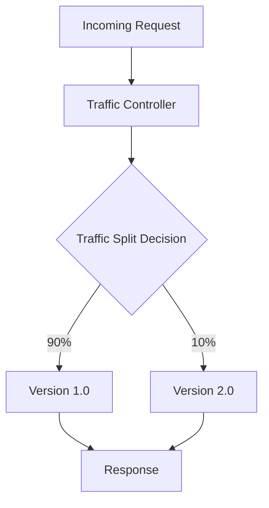
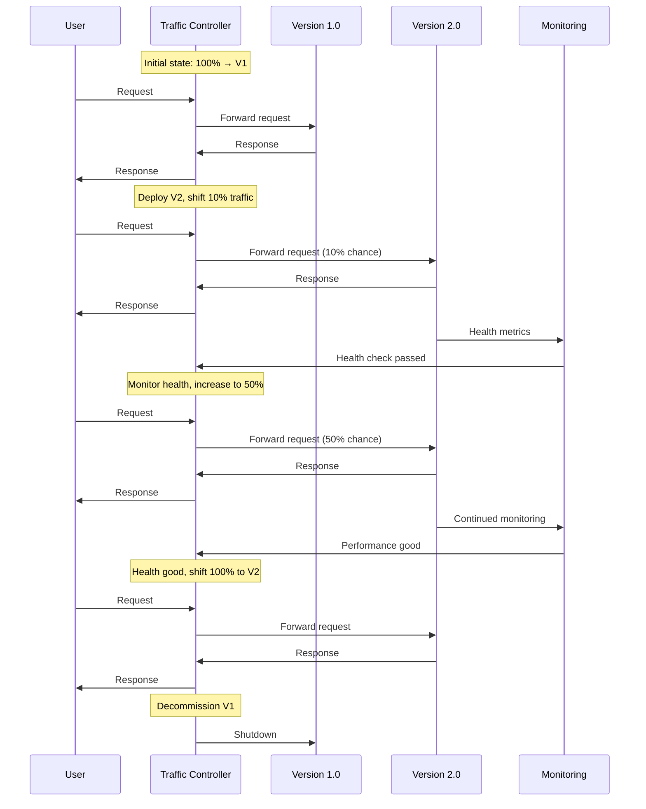
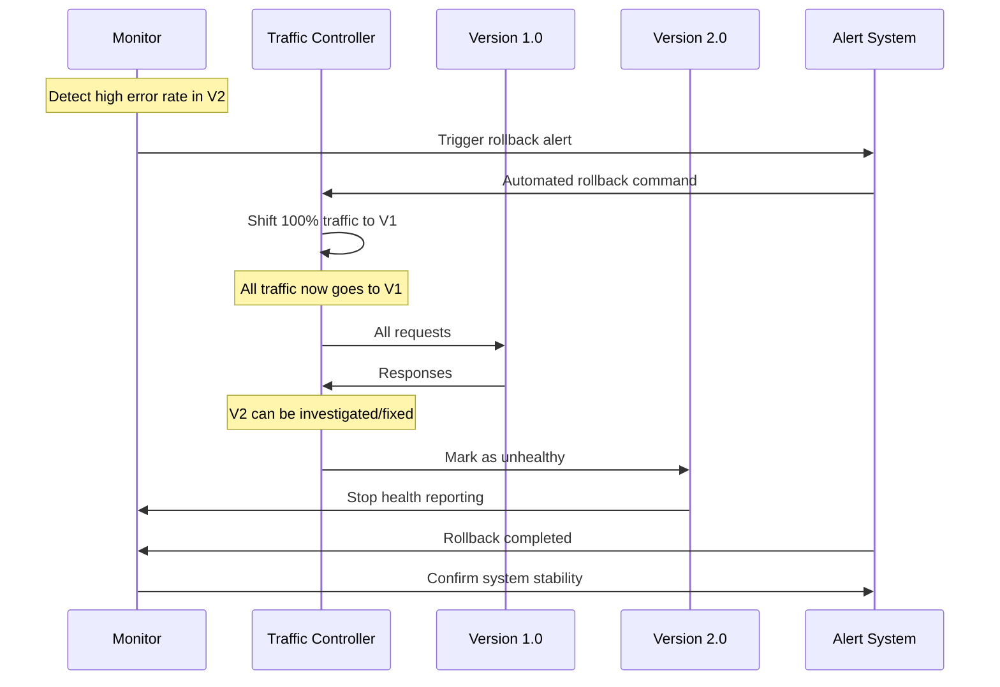
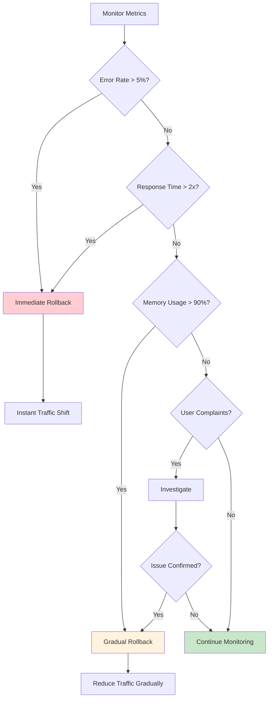
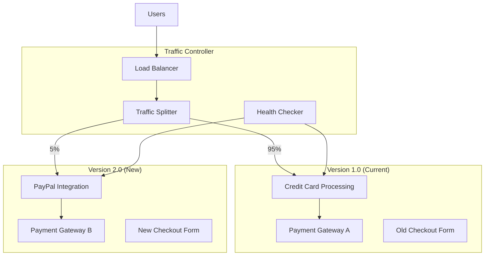
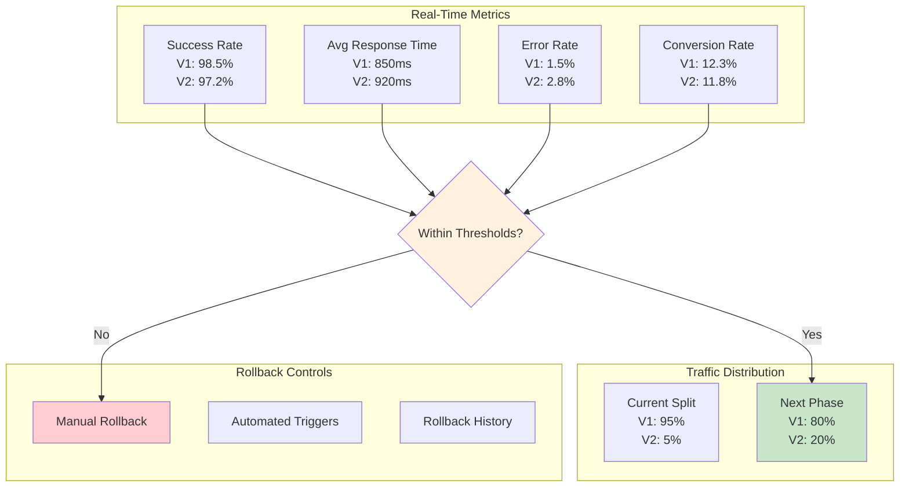
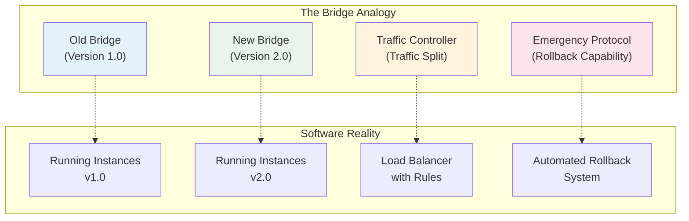
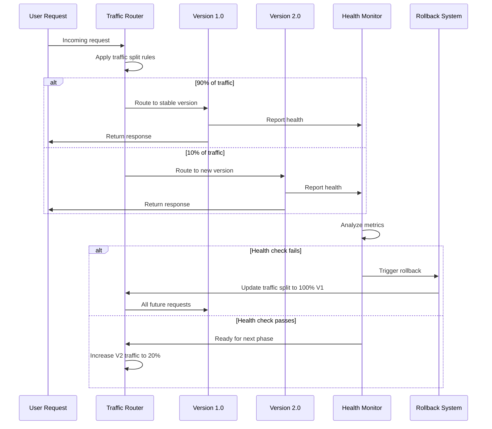

# Key Abstractions: The Building Blocks of Zero-Downtime

## Understanding the Bridge Analogy

Imagine you're managing traffic across a river. You have an old bridge that everyone uses, and you need to replace it with a new bridge. The zero-downtime approach is like building the new bridge alongside the old one, then gradually redirecting traffic.

```
[Old Bridge] ──────────────────────────────── [East Side]
     │                                              │
     │           [Traffic Controller]               │
     │                     │                       │
[New Bridge] ──────────────────────────────── [West Side]
```

This analogy perfectly captures the three key abstractions in zero-downtime deployment:

1. **Versions** (the bridges)
2. **Traffic Split** (the traffic controller)
3. **Rollback Capability** (the ability to redirect everyone back to the old bridge)

## Abstraction 1: Versions

### The Concept
A **version** represents a complete, self-contained instance of your application. In zero-downtime deployment, you always have at least two versions running simultaneously.

### The Bridge Model
```
Version 1.0 (Old Bridge):
- Known to be stable
- Handles current traffic
- Proven under load
- May have known limitations

Version 2.0 (New Bridge):
- Contains new features/fixes
- Unproven in production
- May have unknown issues
- Potentially better performance
```

### Technical Implementation
Versions are typically implemented as:

```
Docker containers:
- my-app:v1.0 (currently serving traffic)
- my-app:v2.0 (ready to receive traffic)

Kubernetes pods:
- app-v1-pod-1, app-v1-pod-2, app-v1-pod-3
- app-v2-pod-1, app-v2-pod-2, app-v2-pod-3

Server instances:
- prod-server-1-v1.0
- prod-server-2-v1.0
- prod-server-1-v2.0
- prod-server-2-v2.0
```

### Version Properties
Each version must have:
- **Unique identification**: Clear version numbers or tags
- **Health endpoints**: Ways to check if the version is ready
- **Resource isolation**: Separate compute, memory, and storage resources
- **Independent lifecycle**: Can be started, stopped, and monitored separately

## Abstraction 2: Traffic Split

### The Concept
**Traffic split** is the mechanism that controls what percentage of users go to each version. It's the "traffic controller" deciding which bridge each car should use.

### The Controller Model


### Implementation Patterns

#### Load Balancer Based
```nginx
# Nginx configuration
upstream app_v1 {
    server app-v1-1:8080;
    server app-v1-2:8080;
}

upstream app_v2 {
    server app-v2-1:8080;
    server app-v2-2:8080;
}

server {
    location / {
        # 90% to v1, 10% to v2
        if ($arg_canary = "true") {
            proxy_pass http://app_v2;
        }
        
        # Weighted distribution
        proxy_pass http://app_v1;
    }
}
```

#### Service Mesh Based
```yaml
apiVersion: networking.istio.io/v1beta1
kind: VirtualService
metadata:
  name: app-traffic-split
spec:
  hosts:
  - app
  http:
  - match:
    - headers:
        canary:
          exact: "true"
    route:
    - destination:
        host: app
        subset: v2
  - route:
    - destination:
        host: app
        subset: v1
      weight: 90
    - destination:
        host: app
        subset: v2
      weight: 10
```

#### Application-Level Feature Flags
```javascript
// In your application code
function shouldUseNewFeature(userId) {
    // Percentage-based rollout
    return hashUserId(userId) % 100 < 10; // 10% rollout
}

function processRequest(request) {
    if (shouldUseNewFeature(request.userId)) {
        return newFeatureHandler(request);
    } else {
        return oldFeatureHandler(request);
    }
}
```

### Traffic Split Strategies

#### User-Based Splitting
```javascript
// Consistent user experience
function getVersion(userId) {
    const hash = hashFunction(userId);
    return hash % 100 < 10 ? 'v2' : 'v1';
}
```

#### Geographic Splitting
```javascript
// Region-based rollout
function getVersion(userLocation) {
    const testRegions = ['us-west', 'eu-central'];
    return testRegions.includes(userLocation) ? 'v2' : 'v1';
}
```

#### Request-Based Splitting
```javascript
// Header-based routing
function getVersion(request) {
    return request.headers['x-version'] || 'v1';
}
```

## Abstraction 3: Rollback Capability

### The Concept
**Rollback capability** is your safety net—the ability to instantly redirect all traffic back to the old version if something goes wrong. It's like having an emergency protocol to close the new bridge and route everyone back to the old one.

### The Emergency Protocol Model
```
Normal flow:
User Request → Traffic Controller → [90% v1, 10% v2] → Response

Emergency rollback:
User Request → Traffic Controller → [100% v1, 0% v2] → Response
```

### Implementation Components

#### Instant Traffic Reversion
```bash
# Command to instantly rollback
kubectl patch deployment app-v2 -p '{"spec":{"replicas":0}}'
kubectl patch service app -p '{"spec":{"selector":{"version":"v1"}}}'
```

#### Health Monitoring
```javascript
// Automated rollback based on health metrics
function monitorDeployment() {
    const metrics = getMetrics();
    
    if (metrics.errorRate > 0.1 || metrics.responseTime > 1000) {
        console.log('Health check failed, rolling back...');
        rollbackToVersion('v1');
    }
}
```

#### Database Rollback
```sql
-- Backward-compatible schema changes
ALTER TABLE users ADD COLUMN new_field VARCHAR(255);
-- Deploy new version
-- Verify success
-- In case of rollback, new_field is ignored by old version
```

#### Configuration Rollback
```yaml
# ConfigMap versioning
apiVersion: v1
kind: ConfigMap
metadata:
  name: app-config-v1
data:
  database_url: "postgres://old-db:5432/app"
  
---
apiVersion: v1
kind: ConfigMap
metadata:
  name: app-config-v2
data:
  database_url: "postgres://new-db:5432/app"
```

## How the Abstractions Work Together

### The Deployment Flow


**Detailed Deployment Timeline:**

```mermaid
gantt
    title Zero-Downtime Deployment Timeline
    dateFormat X
    axisFormat %s
    
    section V1 Traffic
    100% Traffic    :active, v1_100, 0, 2
    90% Traffic     :active, v1_90, 2, 4
    50% Traffic     :active, v1_50, 4, 6
    0% Traffic      :v1_0, 6, 8
    
    section V2 Deployment
    Build & Test    :active, v2_build, 0, 2
    Deploy & Health Check :active, v2_deploy, 2, 3
    10% Traffic     :active, v2_10, 3, 4
    50% Traffic     :active, v2_50, 4, 6
    100% Traffic    :active, v2_100, 6, 8
    
    section Monitoring
    Health Checks   :active, monitor, 3, 8
    Performance     :active, perf, 3, 8
    
    section Rollback Ready
    Rollback Capability :active, rollback, 3, 7
```



### The Rollback Flow


**Rollback Decision Matrix:**



## Real-World Example: E-commerce Checkout

Let's see how these abstractions apply to updating an e-commerce checkout system:



### Versions
- **Version 1.0**: Current checkout with credit card processing
- **Version 2.0**: New checkout with PayPal integration

### Traffic Split Implementation
```javascript
// Checkout service with detailed monitoring
function processCheckout(order, user) {
    const userSegment = determineUserSegment(user);
    const trafficSplit = getCurrentTrafficSplit();
    
    // Enhanced routing logic
    if (shouldRouteToNewCheckout(user.id, userSegment, trafficSplit)) {
        return processNewCheckout(order, user);
    } else {
        return processOldCheckout(order, user);
    }
}

function shouldRouteToNewCheckout(userId, segment, trafficSplit) {
    // Geographic routing
    if (segment.region === 'us-west' && trafficSplit.newCheckout > 0) {
        return (hashFunction(userId) % 100) < trafficSplit.newCheckout;
    }
    
    // Beta users get priority access
    if (segment.betaUser) {
        return trafficSplit.newCheckout > 0;
    }
    
    return false;
}

function processNewCheckout(order, user) {
    const startTime = Date.now();
    
    try {
        const result = newCheckoutService.process(order);
        
        // Track success metrics
        trackCheckoutMetrics({
            version: 'v2',
            success: true,
            duration: Date.now() - startTime,
            userId: user.id
        });
        
        return result;
    } catch (error) {
        // Track failure metrics
        trackCheckoutMetrics({
            version: 'v2',
            success: false,
            duration: Date.now() - startTime,
            error: error.message,
            userId: user.id
        });
        
        throw error;
    }
}
```

### Rollback Capability with Advanced Monitoring
```javascript
// Comprehensive checkout monitoring
class CheckoutMonitor {
    constructor() {
        this.thresholds = {
            errorRate: 0.05,        // 5% error rate
            successRateRatio: 0.95, // 95% of old version's success rate
            responseTime: 2000,     // 2 second response time
            conversionRate: 0.90    // 90% of old version's conversion
        };
        
        this.metrics = {
            v1: { success: 0, total: 0, totalTime: 0, conversions: 0 },
            v2: { success: 0, total: 0, totalTime: 0, conversions: 0 }
        };
    }
    
    trackCheckoutMetrics(data) {
        const version = data.version;
        this.metrics[version].total++;
        
        if (data.success) {
            this.metrics[version].success++;
            this.metrics[version].totalTime += data.duration;
            
            if (data.purchased) {
                this.metrics[version].conversions++;
            }
        }
        
        // Check if we need to rollback
        this.evaluateRollback();
    }
    
    evaluateRollback() {
        const v1Stats = this.calculateStats('v1');
        const v2Stats = this.calculateStats('v2');
        
        // Insufficient data for v2
        if (v2Stats.total < 100) return;
        
        const rollbackReasons = [];
        
        // Check error rate
        if (v2Stats.errorRate > this.thresholds.errorRate) {
            rollbackReasons.push(`High error rate: ${v2Stats.errorRate}`);
        }
        
        // Check success rate compared to v1
        if (v2Stats.successRate < v1Stats.successRate * this.thresholds.successRateRatio) {
            rollbackReasons.push(`Poor success rate: ${v2Stats.successRate} vs ${v1Stats.successRate}`);
        }
        
        // Check response time
        if (v2Stats.avgResponseTime > this.thresholds.responseTime) {
            rollbackReasons.push(`Slow response: ${v2Stats.avgResponseTime}ms`);
        }
        
        // Check conversion rate
        if (v2Stats.conversionRate < v1Stats.conversionRate * this.thresholds.conversionRate) {
            rollbackReasons.push(`Poor conversion: ${v2Stats.conversionRate} vs ${v1Stats.conversionRate}`);
        }
        
        if (rollbackReasons.length > 0) {
            this.executeRollback(rollbackReasons);
        }
    }
    
    calculateStats(version) {
        const metrics = this.metrics[version];
        return {
            total: metrics.total,
            successRate: metrics.success / metrics.total,
            errorRate: (metrics.total - metrics.success) / metrics.total,
            avgResponseTime: metrics.totalTime / metrics.success,
            conversionRate: metrics.conversions / metrics.total
        };
    }
    
    executeRollback(reasons) {
        console.log('ROLLBACK TRIGGERED:', reasons);
        
        // Set traffic split to 0 for new checkout
        setTrafficSplit('new_checkout', 0);
        
        // Send alerts
        sendAlert({
            type: 'checkout_rollback',
            reasons: reasons,
            timestamp: new Date().toISOString()
        });
        
        // Log for post-mortem
        logRollbackEvent(reasons, this.metrics);
    }
}
```

**Monitoring Dashboard View:**



## The Mental Model Summary



**The Three Pillars:**

1. **Versions** = The bridges themselves (old and new infrastructure)
2. **Traffic Split** = The traffic controller (decides which bridge to use)
3. **Rollback Capability** = The emergency protocol (instantly redirect everyone to safety)

**Integration Pattern:**



Together, they enable the seamless transition from old to new while maintaining the ability to retreat to safety at any moment. This is the foundation upon which all zero-downtime deployment strategies are built.

**Key Success Factors:**
- **Isolation**: Each version runs independently
- **Observability**: Comprehensive monitoring of all versions
- **Automation**: Automated decision-making for rollbacks
- **Gradual Transition**: Controlled increase in traffic exposure
- **Safety First**: Always prioritize user experience over deployment speed