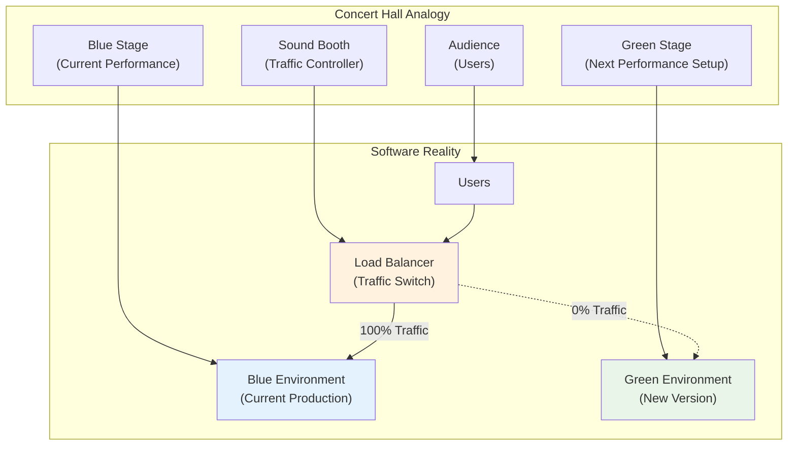
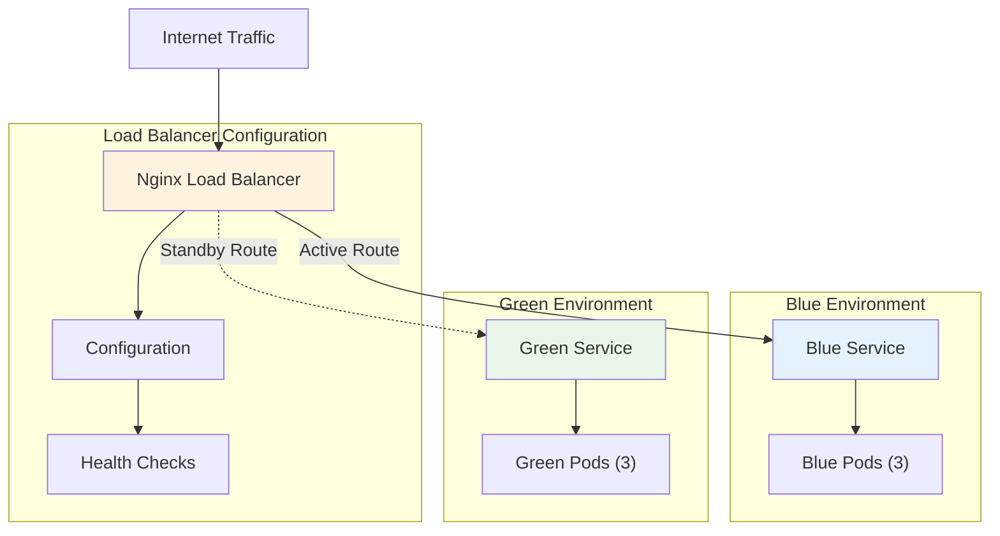
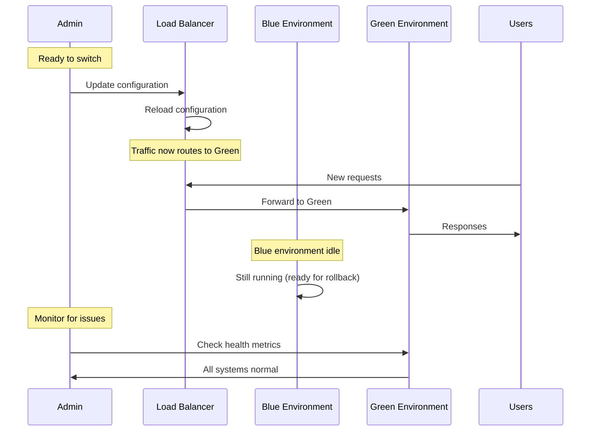
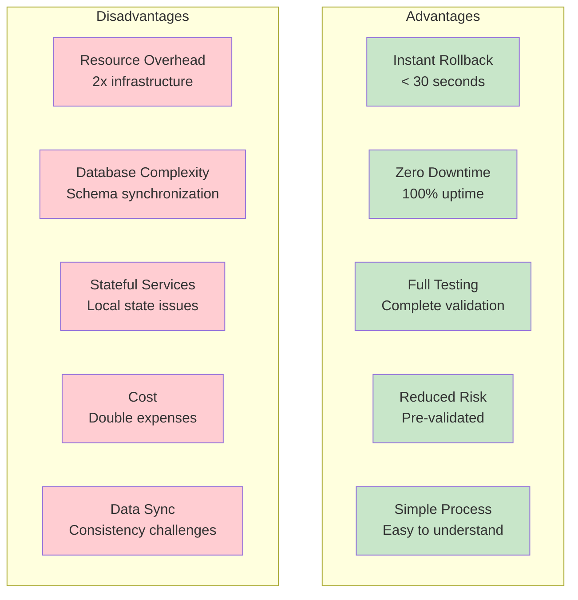
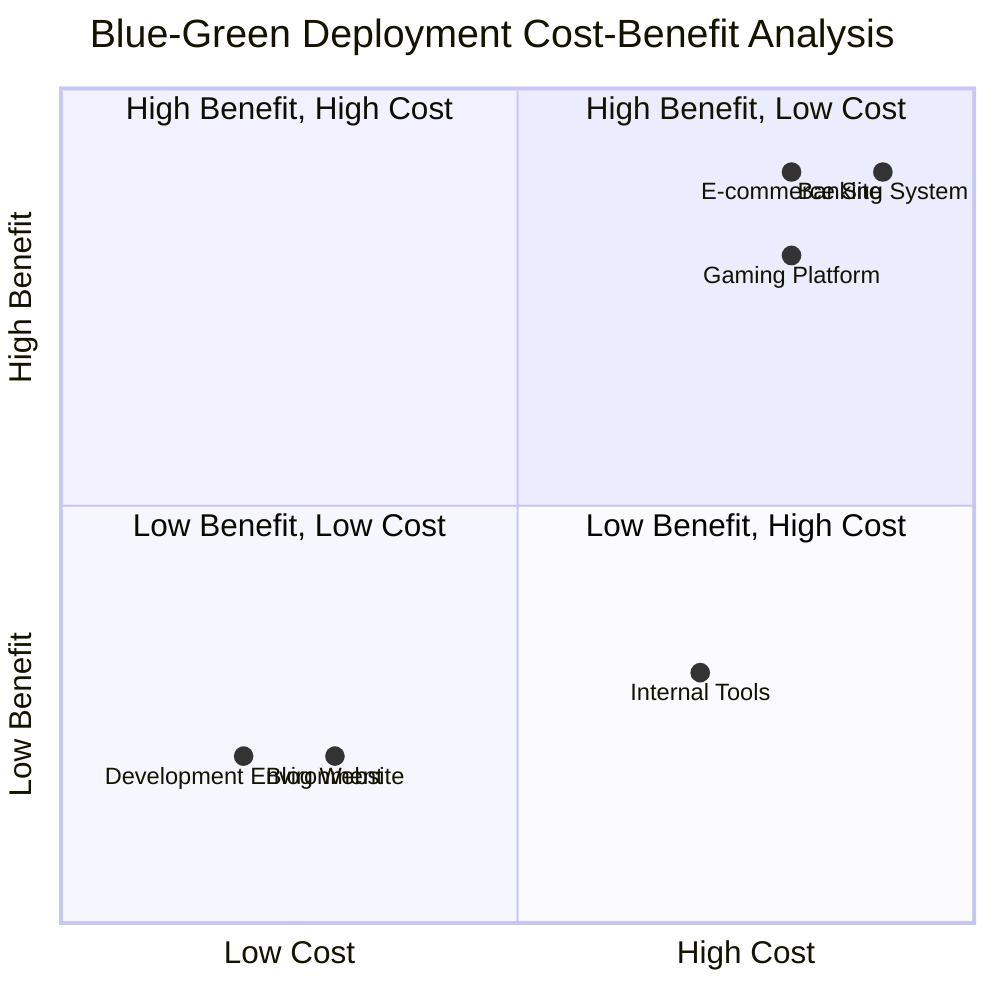
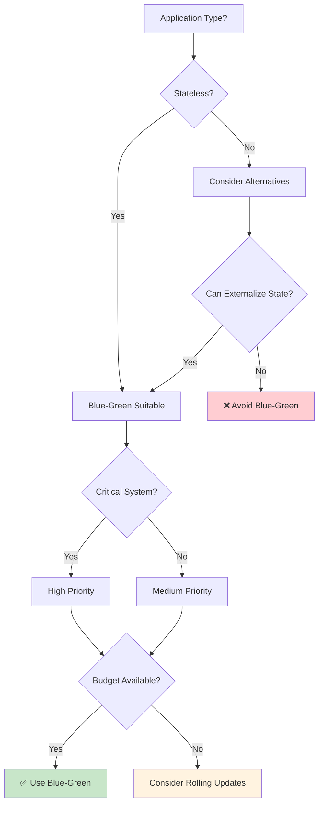
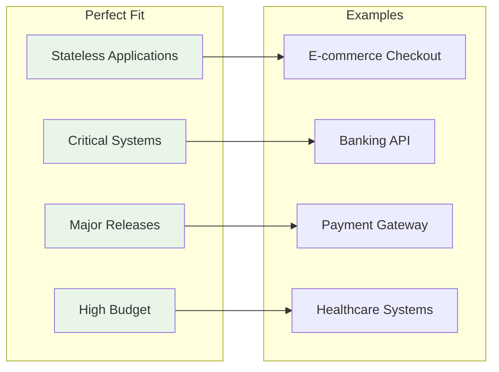
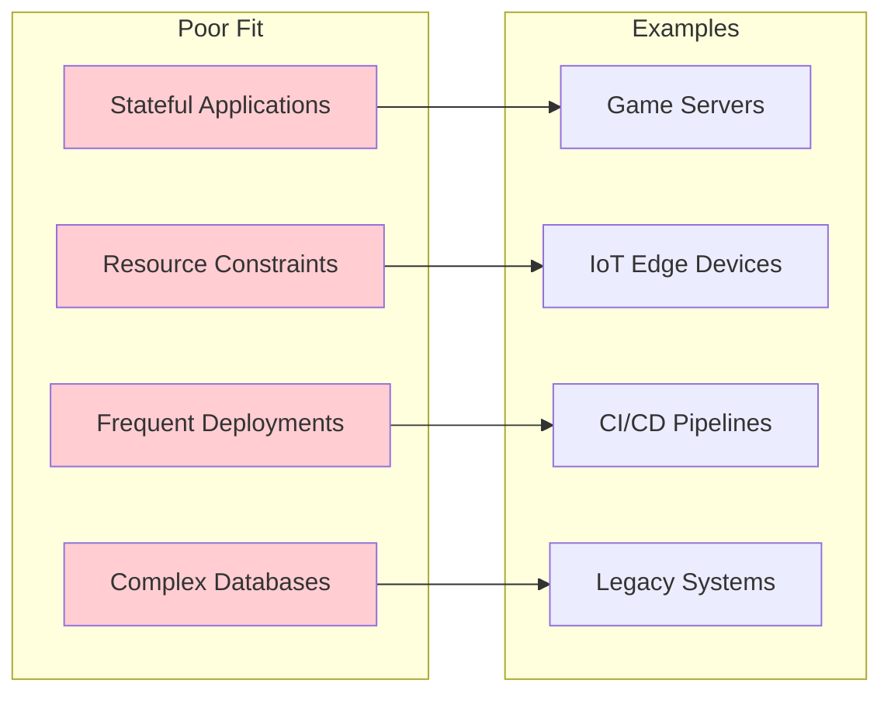
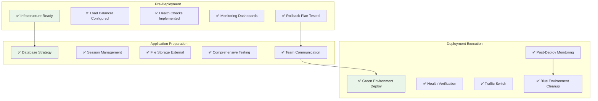
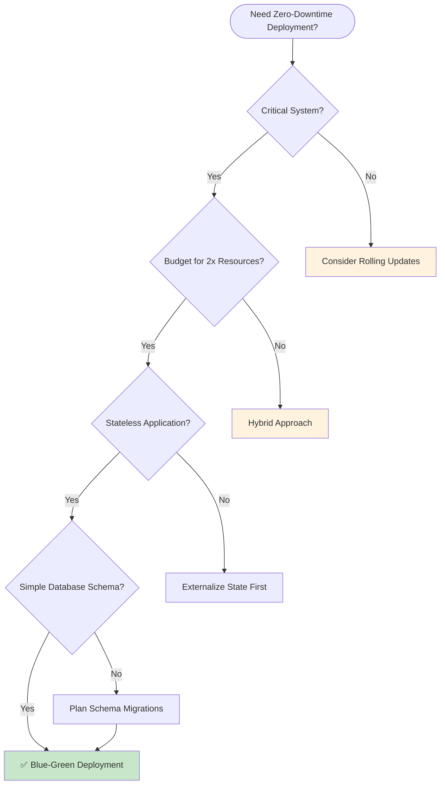

# Blue-Green Deployment: The Instant Switch

## What is Blue-Green Deployment?

Blue-green deployment is like having two identical stages for a concert. While the band performs on the "blue" stage, the crew sets up the next act on the "green" stage. When ready, the audience's attention instantly switches to the green stage, and the blue stage can be cleaned up for the next performance.



**In software terms:**
- **Blue environment**: The current production environment serving all traffic
- **Green environment**: The new environment with the updated version, ready to take over
- **Switch**: An instant cutover from blue to green

**The Blue-Green Advantage:**

```mermaid
compare
    title Blue-Green vs Traditional Deployment
    
    Traditional
        Stop Service: 5
        Deploy New Version: 3
        Test in Production: 2
        Rollback Difficulty: 1
    
    Blue-Green
        Stop Service: 10
        Deploy New Version: 8
        Test in Production: 9
        Rollback Difficulty: 10
```

## The Mental Model

Think of blue-green deployment as having two identical houses:

```
House Blue (Current):
- All family members live here
- Fully furnished and operational
- Known to be comfortable and safe

House Green (New):
- Exact copy of House Blue
- New furniture/improvements installed
- Empty, waiting for family to move in

The Move:
- Family instantly moves from Blue to Green
- If Green has problems, instantly move back to Blue
- No gradual transition, no splitting the family
```

## Prerequisites

Before implementing blue-green deployment, ensure you have:

1. **Identical environments**: Both blue and green must be exactly the same size and configuration
2. **External load balancer**: A router that can instantly switch traffic between environments
3. **Shared data layer**: Database/storage that both environments can access
4. **Health checks**: Automated way to verify the green environment is ready
5. **Monitoring**: Ability to quickly detect issues in the new environment

## Step-by-Step Implementation

### Step 1: Set Up the Blue Environment

```bash
# Current production environment (Blue)
kubectl create namespace blue-env
kubectl apply -f app-blue.yaml -n blue-env

# app-blue.yaml
apiVersion: apps/v1
kind: Deployment
metadata:
  name: app-blue
  namespace: blue-env
spec:
  replicas: 3
  selector:
    matchLabels:
      app: myapp
      version: blue
  template:
    metadata:
      labels:
        app: myapp
        version: blue
    spec:
      containers:
      - name: app
        image: myapp:v1.0
        ports:
        - containerPort: 8080
        resources:
          requests:
            memory: "64Mi"
            cpu: "250m"
          limits:
            memory: "128Mi"
            cpu: "500m"
```

### Step 2: Create the Green Environment

```bash
# New environment (Green) - identical to Blue but with new version
kubectl create namespace green-env
kubectl apply -f app-green.yaml -n green-env

# app-green.yaml
apiVersion: apps/v1
kind: Deployment
metadata:
  name: app-green
  namespace: green-env
spec:
  replicas: 3
  selector:
    matchLabels:
      app: myapp
      version: green
  template:
    metadata:
      labels:
        app: myapp
        version: green
    spec:
      containers:
      - name: app
        image: myapp:v2.0  # New version
        ports:
        - containerPort: 8080
        resources:
          requests:
            memory: "64Mi"
            cpu: "250m"
          limits:
            memory: "128Mi"
            cpu: "500m"
```

### Step 3: Set Up the Load Balancer



```yaml
# Load balancer configuration (using Nginx)
apiVersion: v1
kind: ConfigMap
metadata:
  name: nginx-config
data:
  nginx.conf: |
    upstream blue {
        server app-blue.blue-env.svc.cluster.local:8080;
    }
    
    upstream green {
        server app-green.green-env.svc.cluster.local:8080;
    }
    
    server {
        listen 80;
        location / {
            # Initially route to blue
            proxy_pass http://blue;
            
            # Health check endpoint
            proxy_set_header Host $host;
            proxy_set_header X-Real-IP $remote_addr;
        }
        
        # Health check endpoint
        location /health {
            access_log off;
            return 200 "healthy\n";
        }
        
        # Admin endpoint for switching
        location /admin/switch {
            allow 10.0.0.0/8;
            deny all;
            proxy_pass http://admin-service;
        }
    }
```

### Step 4: Implement Health Checks

```javascript
// Health check endpoint in your application
app.get('/health', (req, res) => {
    // Check database connectivity
    if (!database.isConnected()) {
        return res.status(503).json({ status: 'unhealthy', reason: 'database disconnected' });
    }
    
    // Check external dependencies
    if (!externalService.isReachable()) {
        return res.status(503).json({ status: 'unhealthy', reason: 'external service unreachable' });
    }
    
    // Check application-specific health
    if (!application.isReady()) {
        return res.status(503).json({ status: 'unhealthy', reason: 'application not ready' });
    }
    
    res.json({ status: 'healthy' });
});
```

### Step 5: Verify Green Environment Health

```bash
# Script to verify green environment is ready
#!/bin/bash

GREEN_ENDPOINT="http://app-green.green-env.svc.cluster.local:8080"

echo "Checking green environment health..."

# Wait for all pods to be ready
kubectl wait --for=condition=Ready pod -l version=green -n green-env --timeout=300s

# Check health endpoint
for i in {1..10}; do
    if curl -f $GREEN_ENDPOINT/health; then
        echo "Green environment is healthy"
        break
    else
        echo "Health check failed, retrying in 10 seconds..."
        sleep 10
    fi
done

# Run smoke tests
echo "Running smoke tests..."
curl -f $GREEN_ENDPOINT/api/status
curl -f $GREEN_ENDPOINT/api/users/health-check

echo "Green environment verification complete"
```

### Step 6: Execute the Switch



**Automated Switch Script:**

```bash
#!/bin/bash
# blue-green-switch.sh

set -e

CURRENT_ENV=$(kubectl get configmap nginx-config -o jsonpath='{.data.nginx\.conf}' | grep -o 'proxy_pass http://[^;]*' | cut -d'/' -f3)
NEW_ENV=$([ "$CURRENT_ENV" == "blue" ] && echo "green" || echo "blue")

echo "Switching from $CURRENT_ENV to $NEW_ENV"

# Create new configuration
cat > /tmp/nginx.conf << EOF
upstream blue {
    server app-blue.blue-env.svc.cluster.local:8080;
}

upstream green {
    server app-green.green-env.svc.cluster.local:8080;
}

server {
    listen 80;
    location / {
        proxy_pass http://$NEW_ENV;
        proxy_set_header Host \$host;
        proxy_set_header X-Real-IP \$remote_addr;
    }
}
EOF

# Apply configuration
kubectl patch configmap nginx-config --patch "{
    \"data\": {
        \"nginx.conf\": \"$(cat /tmp/nginx.conf | sed 's/"/\\"/g' | tr '\n' '\\n')\"
    }
}"

# Reload nginx
kubectl rollout restart deployment/nginx

echo "Switch completed from $CURRENT_ENV to $NEW_ENV"
```

### Step 7: Monitor the Switch

```javascript
// Monitoring script
function monitorSwitch() {
    const metrics = {
        errorRate: getErrorRate(),
        responseTime: getAverageResponseTime(),
        throughput: getThroughput(),
        cpuUsage: getCpuUsage(),
        memoryUsage: getMemoryUsage()
    };
    
    console.log('Post-switch metrics:', metrics);
    
    // Alert if metrics are outside acceptable range
    if (metrics.errorRate > 0.01) {
        console.error('High error rate detected!');
        alert('Consider rollback');
    }
    
    if (metrics.responseTime > 1000) {
        console.error('High response time detected!');
        alert('Consider rollback');
    }
}

// Monitor for 10 minutes after switch
setInterval(monitorSwitch, 30000);
```

## Rollback Procedure

If issues are detected, rollback is instant:

```bash
# Instant rollback to blue
kubectl patch configmap nginx-config --patch '{
    "data": {
        "nginx.conf": "upstream blue {\n    server app-blue.blue-env.svc.cluster.local:8080;\n}\n\nupstream green {\n    server app-green.green-env.svc.cluster.local:8080;\n}\n\nserver {\n    listen 80;\n    location / {\n        proxy_pass http://blue;\n        proxy_set_header Host $host;\n        proxy_set_header X-Real-IP $remote_addr;\n    }\n}"
    }
}'

kubectl rollout restart deployment/nginx
```

## Automated Blue-Green Deployment Script

```bash
#!/bin/bash

# Blue-Green Deployment Automation
set -e

CURRENT_ENV=$(kubectl get configmap nginx-config -o jsonpath='{.data.nginx\.conf}' | grep -o 'proxy_pass http://[^;]*' | cut -d'/' -f3)
NEW_ENV=$([ "$CURRENT_ENV" == "blue" ] && echo "green" || echo "blue")

echo "Current environment: $CURRENT_ENV"
echo "Deploying to: $NEW_ENV"

# Step 1: Deploy to inactive environment
echo "Deploying new version to $NEW_ENV environment..."
kubectl apply -f app-$NEW_ENV.yaml -n $NEW_ENV-env

# Step 2: Wait for deployment to be ready
echo "Waiting for $NEW_ENV environment to be ready..."
kubectl wait --for=condition=Ready pod -l version=$NEW_ENV -n $NEW_ENV-env --timeout=300s

# Step 3: Run health checks
echo "Running health checks on $NEW_ENV environment..."
./health-check.sh $NEW_ENV

# Step 4: Switch traffic
echo "Switching traffic to $NEW_ENV environment..."
./switch-traffic.sh $NEW_ENV

# Step 5: Monitor for 2 minutes
echo "Monitoring $NEW_ENV environment..."
./monitor-switch.sh

echo "Blue-green deployment complete!"
```

## Pros and Cons



### Advantages

1. **Instant rollback**: Switch back to the previous version immediately
2. **Zero downtime**: No service interruption during deployment
3. **Full testing**: Test the complete environment before switching
4. **Reduced risk**: New version is fully validated before receiving traffic
5. **Simple process**: Easy to understand and implement

### Disadvantages

1. **Resource overhead**: Requires double the infrastructure
2. **Database complexity**: Handling schema changes across environments
3. **Stateful services**: Difficult with services that maintain local state
4. **Cost**: Running two identical environments is expensive
5. **Data synchronization**: Keeping data consistent between environments

**Cost-Benefit Analysis:**



## When to Use Blue-Green Deployment



### Ideal Scenarios



- **Stateless applications**: Services that don't store local state
- **Critical systems**: Where instant rollback is essential
- **Batch processing**: Where you can afford resource overhead
- **Major releases**: When you want to test the complete environment

### Avoid When



- **Stateful applications**: Services with local databases or file systems
- **Resource-constrained environments**: Where doubling resources isn't feasible
- **Frequent deployments**: Where resource overhead becomes prohibitive
- **Database-heavy applications**: Where schema changes are complex

**Decision Matrix:**

| Criteria | Blue-Green Score | Alternative |
|----------|------------------|-------------|
| Stateless Application | ✅ High | Rolling Updates |
| Critical Uptime | ✅ High | Canary Deployment |
| Budget Available | ✅ High | Rolling Updates |
| Instant Rollback Needed | ✅ High | Feature Flags |
| Complex Database | ❌ Low | Rolling Updates |
| Frequent Deployments | ❌ Low | Rolling Updates |
| Resource Constrained | ❌ Low | In-Place Updates |

## Common Pitfalls and Solutions

### Database Schema Changes
```sql
-- Problem: Breaking schema change
ALTER TABLE users DROP COLUMN old_field;

-- Solution: Backward compatible changes
-- Phase 1: Add new field
ALTER TABLE users ADD COLUMN new_field VARCHAR(255);

-- Phase 2: Deploy green with code using new_field
-- Phase 3: Migrate data
-- Phase 4: Remove old_field in next deployment
```

### Session Management
```javascript
// Problem: Sessions tied to specific servers
// Solution: External session store
const session = require('express-session');
const RedisStore = require('connect-redis')(session);

app.use(session({
    store: new RedisStore({
        host: 'redis-cluster.default.svc.cluster.local'
    }),
    secret: 'your-secret-key'
}));
```

### File System State
```javascript
// Problem: Local file storage
const fs = require('fs');
fs.writeFileSync('/tmp/data.json', data);

// Solution: External storage
const AWS = require('aws-sdk');
const s3 = new AWS.S3();

s3.putObject({
    Bucket: 'app-data',
    Key: 'data.json',
    Body: JSON.stringify(data)
});
```

## Blue-Green Deployment Checklist



**Infrastructure Checklist:**
- [ ] **Infrastructure**: Two identical environments provisioned
- [ ] **Load balancer**: Configured to switch between environments
- [ ] **Health checks**: Automated verification of new environment
- [ ] **Monitoring**: Dashboards to track post-deployment metrics
- [ ] **Rollback plan**: Tested procedure to revert to previous environment

**Application Checklist:**
- [ ] **Database strategy**: Plan for schema changes and data consistency
- [ ] **Session management**: External session store configured
- [ ] **File storage**: External storage for any persistent data
- [ ] **Testing**: Comprehensive tests for the new environment
- [ ] **Communication**: Team notified about deployment window

**Deployment Execution:**
- [ ] **Green deployment**: New version deployed and verified
- [ ] **Health validation**: All health checks passing
- [ ] **Traffic switch**: Load balancer updated to route to green
- [ ] **Monitoring**: Post-deployment metrics within acceptable ranges
- [ ] **Cleanup**: Blue environment maintained for rollback window

**Post-Deployment:**
- [ ] **Performance validation**: Response times and throughput normal
- [ ] **Error monitoring**: Error rates within acceptable limits
- [ ] **User feedback**: No increase in support tickets
- [ ] **Business metrics**: Conversions and engagement stable
- [ ] **Documentation**: Deployment notes and lessons learned

## Blue-Green Deployment Decision Framework



## Summary

Blue-green deployment is the "instant switch" approach to zero-downtime deployments. While it requires more resources, it provides the fastest rollback capability and the highest confidence in your deployments. It's particularly effective for critical systems where the cost of downtime far exceeds the cost of running duplicate infrastructure.

**Key Success Factors:**
- Ensure applications are stateless or externalize state
- Plan database schema changes carefully
- Implement comprehensive health checks
- Automate the switching process
- Monitor both environments continuously
- Practice rollback procedures regularly

**Remember:** Blue-green deployment is not just about having two environments—it's about having the confidence to switch between them instantly when needed.