# Deployment Strategies Compared: Choosing Your Path

## The Strategy Landscape

Imagine you're the mayor of a city planning to upgrade the entire transportation system. You have several approaches:

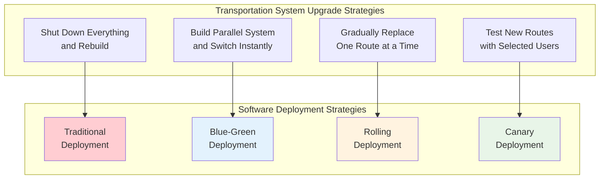

**Strategy Comparison Overview:**

```mermaid
radar
    title Deployment Strategy Comparison
    ["Speed", "Cost", "Risk", "Complexity", "Rollback"]
    
    Traditional: [5, 9, 2, 2, 1]
    Blue-Green: [8, 3, 9, 6, 10]
    Rolling: [6, 7, 6, 5, 6]
    Canary: [4, 6, 8, 8, 8]
```

1. **Shut down everything and rebuild** (Traditional deployment)
2. **Build a parallel system and switch instantly** (Blue-Green)
3. **Gradually replace one route at a time** (Rolling deployment)
4. **Test new routes with a few selected users** (Canary deployment)

Each approach has different trade-offs in terms of cost, risk, complexity, and user impact. Understanding these trade-offs is crucial for choosing the right strategy for your specific situation.

## Strategy Comparison Matrix

| Strategy | Resource Cost | Risk Level | Rollback Speed | Complexity | Best For |
|----------|---------------|------------|----------------|------------|----------|
| **Traditional** | Low | High | Slow | Low | Dev/Test environments |
| **Blue-Green** | High | Low | Instant | Medium | Critical systems |
| **Rolling** | Medium | Medium | Medium | Medium | Stateless services |
| **Canary** | Medium | Low | Fast | High | Large user bases |

## Deep Dive: Blue-Green Deployment

### The Restaurant Metaphor
Blue-green is like running two identical restaurants. While customers eat in Restaurant A, you set up Restaurant B with new menus and staff. When ready, you instantly direct all customers to Restaurant B.

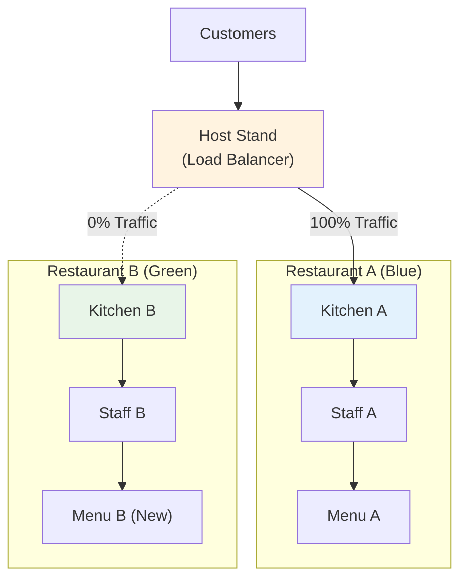

### Resource Usage Analysis

```mermaid
gantt
    title Resource Usage Comparison
    dateFormat X
    axisFormat %s
    
    section Traditional
    Normal Operations    :active, trad1, 0, 2
    Deployment (Down)    :crit, trad_down, 2, 3
    Normal Operations    :active, trad2, 3, 6
    
    section Blue-Green
    Blue Environment     :active, bg_blue, 0, 5
    Green Environment    :active, bg_green, 2, 6
    Switch               :milestone, switch, 4, 0
    
    section Resources
    100% Usage          :active, res100, 0, 2
    200% Usage          :active, res200, 2, 5
    100% Usage          :active, res100_2, 5, 6
```

**Resource Allocation Breakdown:**
```
Traditional: [────────] 100% resources during deployment
Blue-Green:  [████████] 200% resources during deployment
             [────────] 100% resources after cleanup
```

**Cost-Benefit Analysis:**

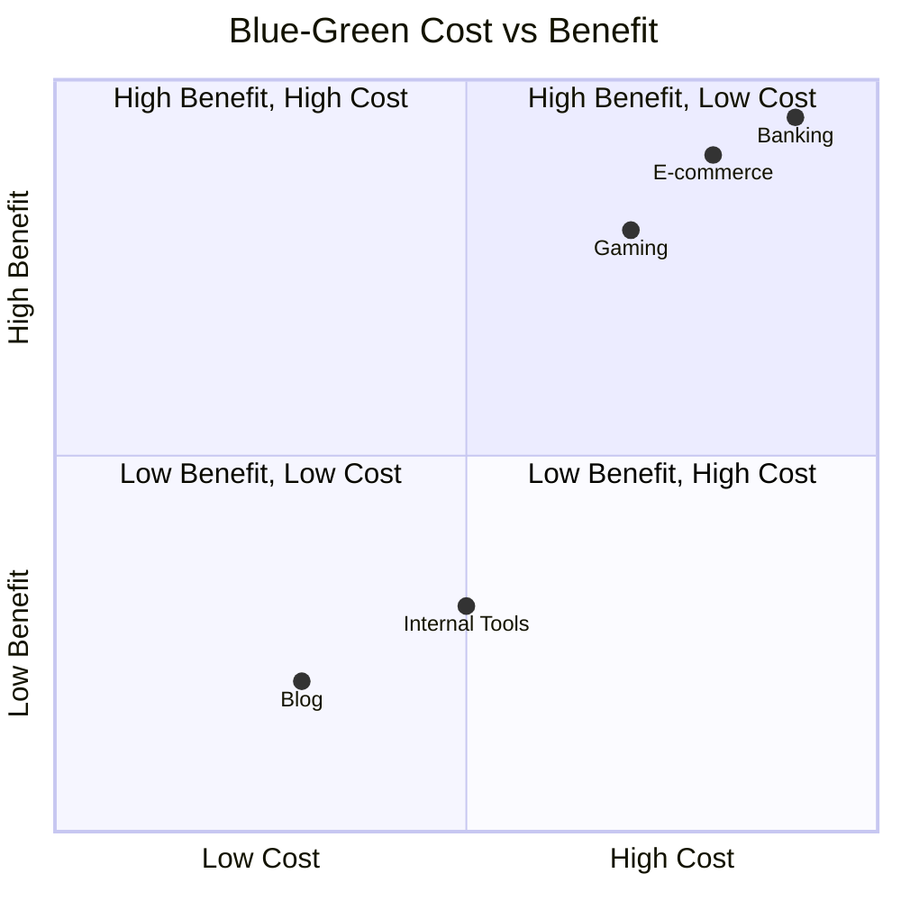

### Risk Mitigation
- **Pre-deployment testing**: Full environment validation
- **Instant rollback**: Switch back immediately if issues arise
- **Zero user impact**: No service interruption

### When Blue-Green Excels
```javascript
// Ideal scenario: Stateless web service
const express = require('express');
const app = express();

app.get('/api/users', (req, res) => {
    // No local state, safe for instant switching
    res.json(userService.getUsers());
});

// Database connections are external
// Session data is in Redis
// File storage is in S3
```

### Blue-Green Challenges
```javascript
// Problematic scenario: Local state management
const localCache = new Map();

app.post('/api/cache', (req, res) => {
    // This local state is lost during blue-green switch
    localCache.set(req.body.key, req.body.value);
    res.json({ success: true });
});
```

## Deep Dive: Rolling Deployment

### The Assembly Line Metaphor
Rolling deployment is like upgrading machines on an assembly line. You replace one machine at a time while the others continue working, maintaining production throughout.

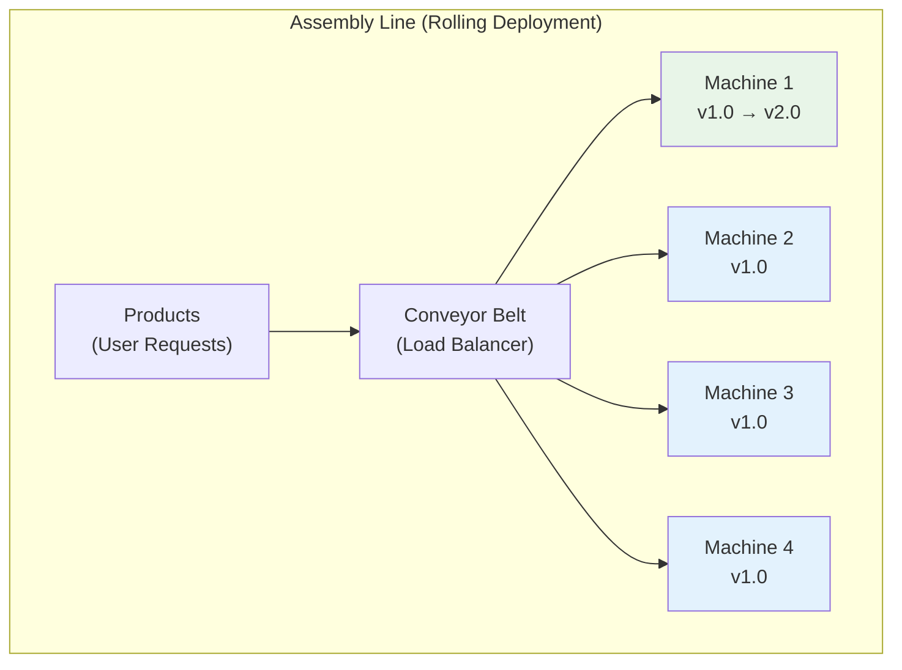

### Resource Usage Analysis

```mermaid
gantt
    title Rolling Deployment Resource Usage
    dateFormat X
    axisFormat %s
    
    section Instance 1
    v1.0 Running         :active, i1_v1, 0, 2
    Upgrading to v2.0    :active, i1_up, 2, 3
    v2.0 Running         :active, i1_v2, 3, 8
    
    section Instance 2
    v1.0 Running         :active, i2_v1, 0, 3
    Upgrading to v2.0    :active, i2_up, 3, 4
    v2.0 Running         :active, i2_v2, 4, 8
    
    section Instance 3
    v1.0 Running         :active, i3_v1, 0, 4
    Upgrading to v2.0    :active, i3_up, 4, 5
    v2.0 Running         :active, i3_v2, 5, 8
    
    section Instance 4
    v1.0 Running         :active, i4_v1, 0, 5
    Upgrading to v2.0    :active, i4_up, 5, 6
    v2.0 Running         :active, i4_v2, 6, 8
```

**Resource Allocation Pattern:**
```
Rolling: [██──────] 25% resources upgrade at a time
         [─██─────] Next 25%
         [──██────] Next 25%
         [───██───] Final 25%
```

**Rolling Deployment Health Flow:**

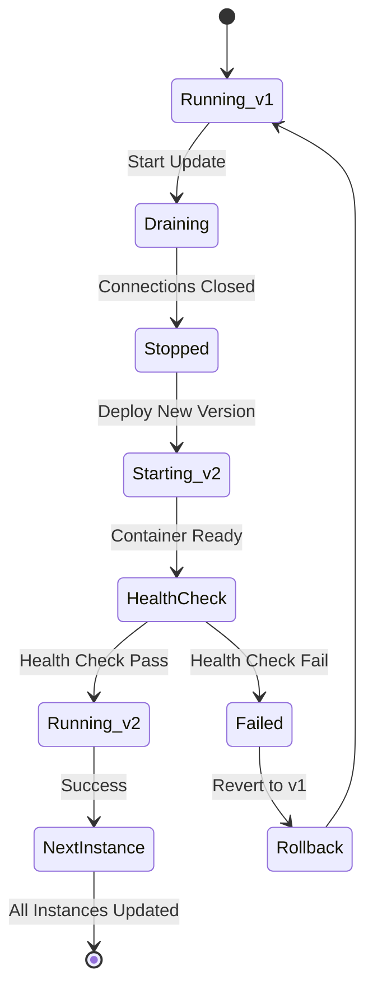

### Implementation Flow
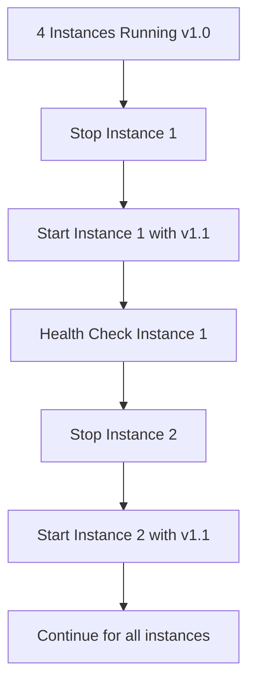

### Kubernetes Rolling Update
```yaml
apiVersion: apps/v1
kind: Deployment
metadata:
  name: app-deployment
spec:
  replicas: 6
  strategy:
    type: RollingUpdate
    rollingUpdate:
      maxSurge: 2        # Max 2 extra pods during update
      maxUnavailable: 1  # Max 1 pod can be unavailable
  template:
    spec:
      containers:
      - name: app
        image: myapp:v2.0
```

### Rolling Deployment Challenges

#### Version Coexistence
```javascript
// Problem: Two versions handling same data
// v1.0 expects: { name: "John Doe" }
// v1.1 expects: { firstName: "John", lastName: "Doe" }

// Solution: Backward compatibility
function processUser(userData) {
    // Handle both formats
    if (userData.name) {
        // v1.0 format
        const [firstName, lastName] = userData.name.split(' ');
        return { firstName, lastName };
    } else {
        // v1.1 format
        return { firstName: userData.firstName, lastName: userData.lastName };
    }
}
```

#### Database Schema Evolution
```sql
-- Phase 1: Add new column (compatible with both versions)
ALTER TABLE users ADD COLUMN first_name VARCHAR(255);

-- Phase 2: Deploy v1.1 (uses first_name if available, falls back to name)
-- Phase 3: Migrate data
UPDATE users SET first_name = SPLIT_PART(name, ' ', 1);

-- Phase 4: Remove old column in next deployment
ALTER TABLE users DROP COLUMN name;
```

## Deep Dive: Canary Deployment

### The Canary in the Coal Mine Metaphor
Canary deployment is like using a canary to test for dangerous gases in a coal mine. You send a small group of users to the new version first. If they're fine, you gradually increase the group size.

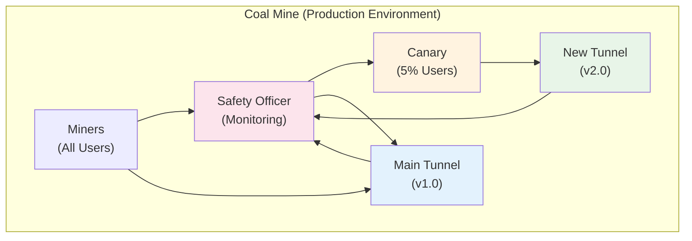

### Traffic Distribution Pattern

```mermaid
gantt
    title Canary Deployment Traffic Distribution
    dateFormat X
    axisFormat %s
    
    section v1.0 Traffic
    95% Users       :active, v1_95, 0, 2
    80% Users       :active, v1_80, 2, 4
    50% Users       :active, v1_50, 4, 6
    0% Users        :v1_0, 6, 8
    
    section v2.0 Traffic
    5% Users        :active, v2_5, 0, 2
    20% Users       :active, v2_20, 2, 4
    50% Users       :active, v2_50, 4, 6
    100% Users      :active, v2_100, 6, 8
    
    section Monitoring
    Metrics Collection :active, monitor, 0, 8
    Health Checks     :active, health, 0, 8
```

**Canary Progression Decision Tree:**

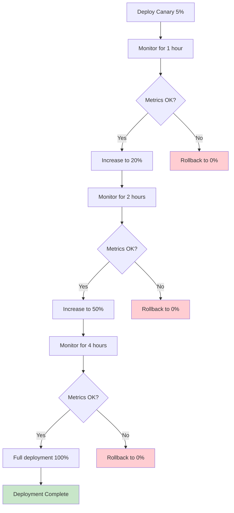

**Traditional Pattern:**
```
Phase 1: 95% → v1.0, 5% → v1.1
Phase 2: 80% → v1.0, 20% → v1.1
Phase 3: 50% → v1.0, 50% → v1.1
Phase 4: 0% → v1.0, 100% → v1.1
```

### Implementation with Feature Flags
```javascript
// Canary deployment with user-based routing
function shouldUseNewVersion(userId) {
    // Start with 5% of users
    const userHash = hashFunction(userId);
    const canaryPercentage = getCanaryPercentage(); // 5, 20, 50, 100
    
    return (userHash % 100) < canaryPercentage;
}

function processRequest(req) {
    if (shouldUseNewVersion(req.user.id)) {
        return newVersionHandler(req);
    } else {
        return oldVersionHandler(req);
    }
}
```

### Automated Canary Progression
```javascript
// Automated canary progression based on metrics
class CanaryDeployment {
    constructor() {
        this.phases = [5, 20, 50, 100];
        this.currentPhase = 0;
        this.phaseStartTime = Date.now();
    }
    
    async checkMetrics() {
        const metrics = await getMetrics();
        
        // Define success criteria
        const successCriteria = {
            errorRate: metrics.errorRate < 0.01,
            responseTime: metrics.p95ResponseTime < 1000,
            throughput: metrics.throughput > 100,
            userSatisfaction: metrics.userSatisfaction > 0.9
        };
        
        // Check if current phase is successful
        if (Object.values(successCriteria).every(Boolean)) {
            this.progressToNextPhase();
        } else {
            this.rollback();
        }
    }
    
    progressToNextPhase() {
        if (this.currentPhase < this.phases.length - 1) {
            this.currentPhase++;
            this.phaseStartTime = Date.now();
            updateCanaryPercentage(this.phases[this.currentPhase]);
        }
    }
    
    rollback() {
        updateCanaryPercentage(0);
        alert('Canary deployment rolled back due to metrics failure');
    }
}
```

### Canary User Selection Strategies

#### Percentage-Based
```javascript
function isCanaryUser(userId) {
    return (hashFunction(userId) % 100) < canaryPercentage;
}
```

#### Geographic-Based
```javascript
function isCanaryUser(userId, userLocation) {
    const canaryRegions = ['us-west-1', 'eu-central-1'];
    return canaryRegions.includes(userLocation);
}
```

#### Opt-In Based
```javascript
function isCanaryUser(userId) {
    return userPreferences.getCanaryOptIn(userId);
}
```

## Strategy Selection Decision Tree

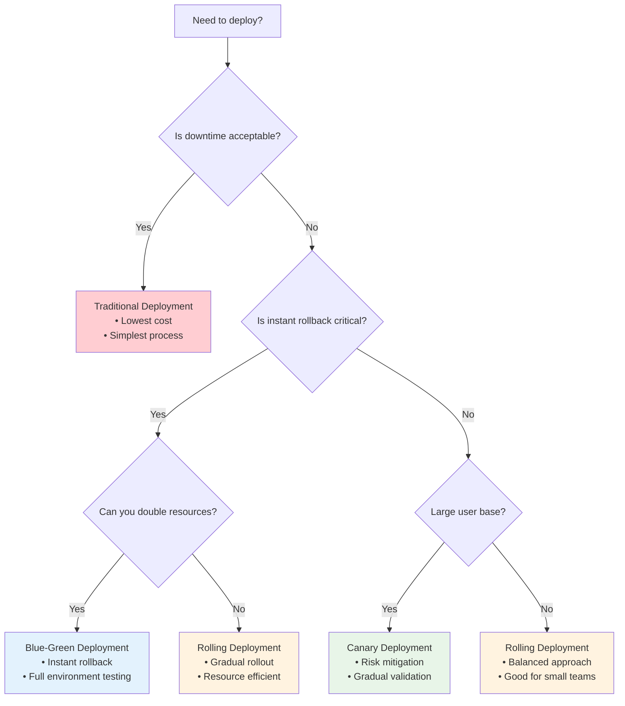

**Extended Decision Matrix:**

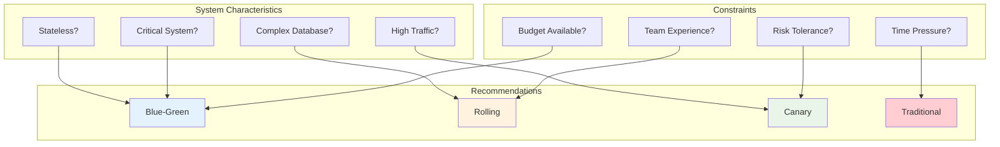

## Real-World Scenarios

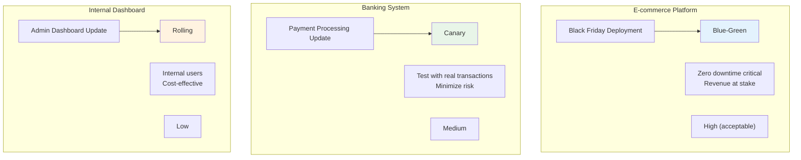

### E-commerce Platform
```javascript
// Scenario: Black Friday deployment
// Choice: Blue-Green
// Reasoning: Can't afford any downtime, revenue at stake

const deployment = {
    strategy: 'blue-green',
    reasoning: 'Zero downtime critical during peak sales',
    resourceCost: 'High (acceptable for revenue protection)',
    rollbackSpeed: 'Instant',
    monitoring: {
        errorRate: '< 0.01%',
        responseTime: '< 200ms',
        businessMetrics: 'Conversion rate, cart abandonment'
    },
    testingStrategy: {
        loadTesting: 'Peak traffic simulation',
        userAcceptance: 'Full checkout flow',
        performanceBaseline: 'Current production metrics'
    }
};
```

### Banking System
```javascript
// Scenario: Payment processing update
// Choice: Canary
// Reasoning: Need to test with real transactions but minimize risk

const deployment = {
    strategy: 'canary',
    reasoning: 'Test with small percentage of real transactions',
    progressionCriteria: {
        errorRate: '< 0.001%',
        transactionVolume: '> 1000 successful transactions',
        duration: '24 hours minimum per phase',
        regulatoryCompliance: 'All audit logs captured'
    },
    rollbackTriggers: {
        automated: ['Error rate > 0.01%', 'Response time > 5s'],
        manual: ['Compliance violation', 'Customer complaints']
    },
    phases: [
        { percentage: 1, duration: '24h', criteria: 'Internal users only' },
        { percentage: 5, duration: '48h', criteria: 'Selected customers' },
        { percentage: 25, duration: '72h', criteria: 'Regional rollout' },
        { percentage: 100, duration: 'ongoing', criteria: 'Full deployment' }
    ]
};
```

### Internal Dashboard
```javascript
// Scenario: Admin dashboard update
// Choice: Rolling
// Reasoning: Internal users, some brief interruption acceptable

const deployment = {
    strategy: 'rolling',
    reasoning: 'Internal users, cost-effective approach',
    maxUnavailable: '33%',
    rollbackTrigger: 'User complaints or errors',
    configuration: {
        batchSize: 2, // Update 2 instances at a time
        healthCheckDelay: '30s',
        progressTimeout: '10m'
    },
    communication: {
        preDeployment: 'Slack notification to team',
        duringDeployment: 'Status updates every 5 minutes',
        postDeployment: 'Success confirmation'
    }
};
```

**Scenario Comparison Matrix:**

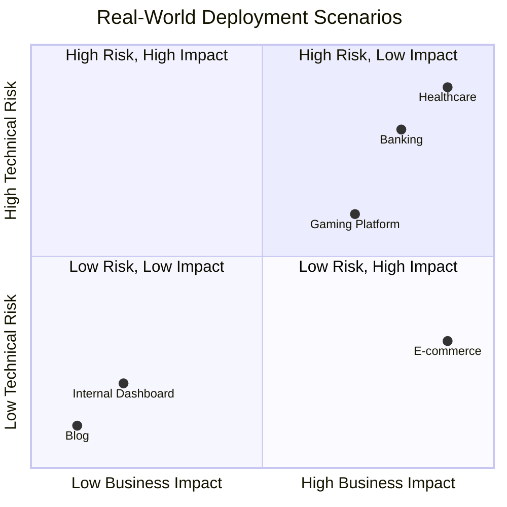

## Hybrid Approaches

### Blue-Green + Canary
```javascript
// Phase 1: Blue-Green switch to 5% of users
// Phase 2: Increase canary percentage on green environment
// Phase 3: Full switch to green

function hybridDeployment() {
    // Deploy green environment
    deployGreenEnvironment();
    
    // Switch 5% of users to green (canary)
    setTrafficSplit({ blue: 95, green: 5 });
    
    // Monitor and gradually increase green traffic
    if (metricsAreGood()) {
        setTrafficSplit({ blue: 0, green: 100 });
    }
}
```

### Rolling + Canary
```javascript
// Rolling deployment with canary validation at each step
function rollingCanaryDeployment() {
    const instances = getInstances();
    
    for (const instance of instances) {
        // Update instance
        updateInstance(instance);
        
        // Route small percentage to new instance
        setInstanceWeight(instance, 0.1);
        
        // Monitor before proceeding
        if (metricsAreGood()) {
            setInstanceWeight(instance, 1.0);
        } else {
            rollbackInstance(instance);
            break;
        }
    }
}
```

## Choosing Your Strategy: Decision Framework

### 1. Assess Your Constraints
```javascript
const constraints = {
    budget: 'high|medium|low',
    riskTolerance: 'high|medium|low',
    userBase: 'large|medium|small',
    systemComplexity: 'high|medium|low',
    rollbackRequirement: 'instant|fast|acceptable'
};
```

### 2. Evaluate Your Application
```javascript
const appCharacteristics = {
    stateful: true/false,
    databaseDependency: 'high|medium|low',
    sessionManagement: 'local|external|none',
    externalIntegrations: 'many|few|none'
};
```

### 3. Consider Your Team
```javascript
const teamCapabilities = {
    operationalExperience: 'high|medium|low',
    monitoringMaturity: 'advanced|basic|none',
    automationLevel: 'high|medium|low'
};
```

### 4. Apply Decision Matrix
```javascript
function chooseStrategy(constraints, appCharacteristics, teamCapabilities) {
    if (constraints.riskTolerance === 'low' && constraints.budget === 'high') {
        return 'blue-green';
    }
    
    if (constraints.userBase === 'large' && teamCapabilities.monitoringMaturity === 'advanced') {
        return 'canary';
    }
    
    if (appCharacteristics.stateful === false && constraints.budget === 'medium') {
        return 'rolling';
    }
    
    return 'traditional'; // Default fallback
}
```

## Common Anti-Patterns

### The "All or Nothing" Approach
```javascript
// Bad: Using blue-green for everything
// Good: Match strategy to specific needs
```

### The "Set and Forget" Deployment
```javascript
// Bad: Deploy and hope for the best
// Good: Continuous monitoring and automated rollback
```

### The "Perfect Rollback" Myth
```javascript
// Bad: Assuming rollback always works perfectly
// Good: Test rollback procedures regularly
```

## Strategy Evolution Path

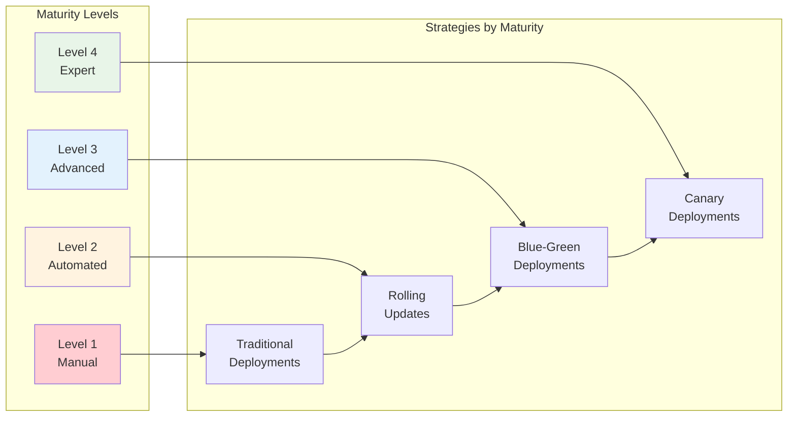

## Final Recommendations

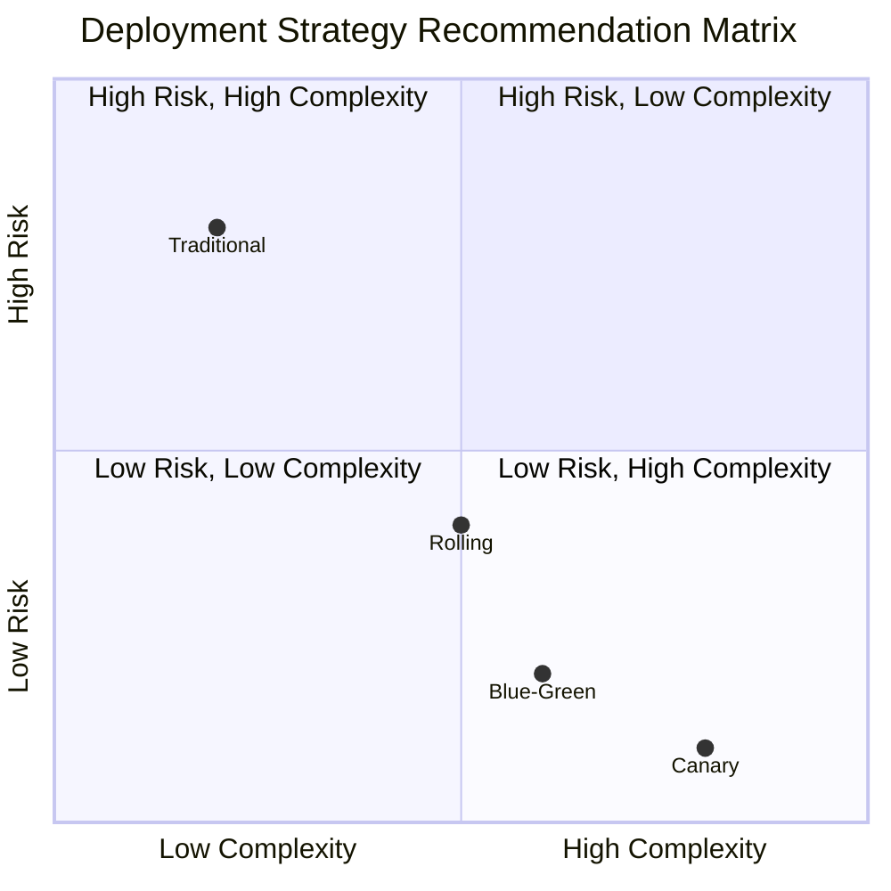

**Strategy Selection Framework:**

| Application Type | Recommended Strategy | Why |
|------------------|---------------------|-----|
| **E-commerce** | Blue-Green | Instant rollback, revenue protection |
| **Banking/Finance** | Canary | Risk mitigation, regulatory compliance |
| **SaaS Platform** | Rolling | Balanced cost/risk, frequent updates |
| **Internal Tools** | Traditional | Cost-effective, downtime acceptable |
| **Gaming/Real-time** | Blue-Green | User experience critical |
| **IoT/Edge** | Rolling | Resource constraints, gradual rollout |

## Summary: The Strategic Choice

Each deployment strategy represents a different balance of trade-offs:

```mermaid
radar
    title Strategy Trade-off Analysis
    ["Safety", "Cost", "Speed", "Complexity", "Risk"]
    
    Blue-Green: [9, 3, 8, 6, 2]
    Rolling: [6, 7, 6, 5, 5]
    Canary: [8, 6, 4, 8, 3]
    Traditional: [2, 9, 9, 2, 8]
```

- **Blue-Green**: Maximum safety, maximum cost
- **Rolling**: Balanced approach, medium complexity
- **Canary**: Risk mitigation through gradual exposure
- **Traditional**: Simplest approach, highest risk

The key is not to find the "best" strategy, but to find the **right** strategy for your specific context. Consider your constraints, understand your application, evaluate your team's capabilities, and choose the approach that best aligns with your needs.

**Evolution Strategy:**

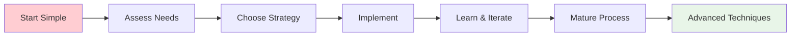

Remember: You can start with a simpler strategy and evolve to more sophisticated approaches as your team and infrastructure mature. The goal is reliable, safe deployments that serve your users without interruption.