# Implementation Guide: Zero-Downtime Deployments in Practice

## From Theory to Production

This guide bridges the gap between understanding zero-downtime deployment concepts and implementing them in real production environments. We'll cover practical implementation patterns, tooling, and real-world examples.


## Technology Stack Matrix


## Implementation Patterns

### Pattern 1: Kubernetes Blue-Green with Istio

**Architecture Overview:**


**Implementation Steps:**

```yaml
# 1. Destination Rule - Define blue/green subsets
apiVersion: networking.istio.io/v1beta1
kind: DestinationRule
metadata:
  name: app-destination-rule
spec:
  host: app-service
  subsets:
  - name: blue
    labels:
      version: blue
  - name: green
    labels:
      version: green
---
# 2. Virtual Service - Traffic routing
apiVersion: networking.istio.io/v1beta1
kind: VirtualService
metadata:
  name: app-virtual-service
spec:
  hosts:
  - app-service
  http:
  - match:
    - headers:
        canary:
          exact: "true"
    route:
    - destination:
        host: app-service
        subset: green
  - route:
    - destination:
        host: app-service
        subset: blue
      weight: 100
    - destination:
        host: app-service
        subset: green
      weight: 0
```

**Automated Deployment Script:**

```bash
#!/bin/bash
# istio-blue-green-deploy.sh

set -e

NAMESPACE=${1:-default}
APP_NAME=${2:-app}
NEW_VERSION=${3:-latest}
CURRENT_VERSION=$(kubectl get deployment ${APP_NAME}-blue -n $NAMESPACE -o jsonpath='{.spec.template.spec.containers[0].image}' | cut -d':' -f2)

echo "🚀 Starting Blue-Green deployment for $APP_NAME"
echo "📦 Current version: $CURRENT_VERSION"
echo "🆕 New version: $NEW_VERSION"

# Determine current and target environments
if kubectl get deployment ${APP_NAME}-blue -n $NAMESPACE >/dev/null 2>&1; then
    CURRENT_ENV="blue"
    TARGET_ENV="green"
else
    CURRENT_ENV="green"
    TARGET_ENV="blue"
fi

echo "🔄 Deploying to $TARGET_ENV environment"

# Deploy to target environment
kubectl set image deployment/${APP_NAME}-${TARGET_ENV} \
    ${APP_NAME}=${APP_NAME}:${NEW_VERSION} \
    -n $NAMESPACE

# Wait for deployment to be ready
echo "⏳ Waiting for deployment to be ready..."
kubectl rollout status deployment/${APP_NAME}-${TARGET_ENV} -n $NAMESPACE

# Health check
echo "🔍 Running health checks..."
for i in {1..30}; do
    if kubectl exec -n $NAMESPACE deployment/${APP_NAME}-${TARGET_ENV} -- curl -f http://localhost:8080/health; then
        echo "✅ Health check passed"
        break
    fi
    echo "🔄 Health check attempt $i/30 failed, retrying..."
    sleep 10
done

# Update virtual service to switch traffic
echo "🔀 Switching traffic to $TARGET_ENV"
kubectl patch virtualservice app-virtual-service -n $NAMESPACE --type='merge' -p="{
  \"spec\": {
    \"http\": [{
      \"route\": [{
        \"destination\": {
          \"host\": \"app-service\",
          \"subset\": \"${TARGET_ENV}\"
        },
        \"weight\": 100
      }]
    }]
  }
}"

# Monitor for 5 minutes
echo "📊 Monitoring deployment for 5 minutes..."
END_TIME=$((SECONDS + 300))

while [ $SECONDS -lt $END_TIME ]; do
    ERROR_RATE=$(kubectl exec -n istio-system deployment/prometheus -- \
        promtool query instant 'rate(istio_requests_total{destination_service_name="app-service"}[5m])' | \
        grep -o '[0-9]*\.[0-9]*' | head -1)
    
    if (( $(echo "$ERROR_RATE > 0.05" | bc -l) )); then
        echo "❌ High error rate detected: $ERROR_RATE"
        echo "🔄 Rolling back..."
        kubectl patch virtualservice app-virtual-service -n $NAMESPACE --type='merge' -p="{
          \"spec\": {
            \"http\": [{
              \"route\": [{
                \"destination\": {
                  \"host\": \"app-service\",
                  \"subset\": \"${CURRENT_ENV}\"
                },
                \"weight\": 100
              }]
            }]
          }
        }"
        exit 1
    fi
    
    echo "✅ Metrics looking good (error rate: $ERROR_RATE)"
    sleep 30
done

echo "🎉 Deployment completed successfully!"
```

### Pattern 2: AWS Blue-Green with Application Load Balancer

**Architecture:**


**Terraform Implementation:**

```hcl
# main.tf
resource "aws_lb" "app_lb" {
  name               = "app-lb"
  internal           = false
  load_balancer_type = "application"
  security_groups    = [aws_security_group.lb_sg.id]
  subnets            = var.public_subnets

  enable_deletion_protection = false
}

resource "aws_lb_target_group" "blue" {
  name     = "app-blue-tg"
  port     = 80
  protocol = "HTTP"
  vpc_id   = var.vpc_id

  health_check {
    enabled             = true
    healthy_threshold   = 2
    unhealthy_threshold = 2
    timeout             = 5
    interval            = 30
    path                = "/health"
    matcher             = "200"
  }
}

resource "aws_lb_target_group" "green" {
  name     = "app-green-tg"
  port     = 80
  protocol = "HTTP"
  vpc_id   = var.vpc_id

  health_check {
    enabled             = true
    healthy_threshold   = 2
    unhealthy_threshold = 2
    timeout             = 5
    interval            = 30
    path                = "/health"
    matcher             = "200"
  }
}

resource "aws_lb_listener" "app_listener" {
  load_balancer_arn = aws_lb.app_lb.arn
  port              = "80"
  protocol          = "HTTP"

  default_action {
    type             = "forward"
    target_group_arn = aws_lb_target_group.blue.arn
  }
}

# Auto Scaling Groups
resource "aws_autoscaling_group" "blue" {
  name                = "app-blue-asg"
  vpc_zone_identifier = var.private_subnets
  target_group_arns   = [aws_lb_target_group.blue.arn]
  health_check_type   = "ELB"

  min_size         = 2
  max_size         = 10
  desired_capacity = 3

  launch_template {
    id      = aws_launch_template.app_template.id
    version = "$Latest"
  }

  tag {
    key                 = "Name"
    value               = "app-blue"
    propagate_at_launch = true
  }
}

resource "aws_autoscaling_group" "green" {
  name                = "app-green-asg"
  vpc_zone_identifier = var.private_subnets
  target_group_arns   = [aws_lb_target_group.green.arn]
  health_check_type   = "ELB"

  min_size         = 0  # Initially empty
  max_size         = 10
  desired_capacity = 0

  launch_template {
    id      = aws_launch_template.app_template.id
    version = "$Latest"
  }

  tag {
    key                 = "Name"
    value               = "app-green"
    propagate_at_launch = true
  }
}
```

**Deployment Automation with AWS CLI:**

```bash
#!/bin/bash
# aws-blue-green-deploy.sh

set -e

REGION=${AWS_REGION:-us-east-1}
APP_NAME=${1:-app}
NEW_AMI_ID=${2}
LOAD_BALANCER_ARN=$(aws elbv2 describe-load-balancers --names ${APP_NAME}-lb --query 'LoadBalancers[0].LoadBalancerArn' --output text)

if [ -z "$NEW_AMI_ID" ]; then
    echo "❌ Error: AMI ID is required"
    exit 1
fi

echo "🚀 Starting AWS Blue-Green deployment"
echo "📦 New AMI ID: $NEW_AMI_ID"

# Determine current environment
CURRENT_TG=$(aws elbv2 describe-listeners --load-balancer-arn $LOAD_BALANCER_ARN --query 'Listeners[0].DefaultActions[0].TargetGroupArn' --output text)

if [[ $CURRENT_TG == *"blue"* ]]; then
    CURRENT_ENV="blue"
    TARGET_ENV="green"
    CURRENT_ASG="${APP_NAME}-blue-asg"
    TARGET_ASG="${APP_NAME}-green-asg"
    TARGET_TG_ARN=$(aws elbv2 describe-target-groups --names ${APP_NAME}-green-tg --query 'TargetGroups[0].TargetGroupArn' --output text)
else
    CURRENT_ENV="green"
    TARGET_ENV="blue"
    CURRENT_ASG="${APP_NAME}-green-asg"
    TARGET_ASG="${APP_NAME}-blue-asg"
    TARGET_TG_ARN=$(aws elbv2 describe-target-groups --names ${APP_NAME}-blue-tg --query 'TargetGroups[0].TargetGroupArn' --output text)
fi

echo "🔄 Current environment: $CURRENT_ENV"
echo "🎯 Target environment: $TARGET_ENV"

# Update launch template with new AMI
aws ec2 create-launch-template-version \
    --launch-template-name ${APP_NAME}-template \
    --version-description "Version with AMI $NEW_AMI_ID" \
    --source-version '$Latest' \
    --launch-template-data "{\"ImageId\":\"$NEW_AMI_ID\"}"

# Set the new version as default
aws ec2 modify-launch-template \
    --launch-template-name ${APP_NAME}-template \
    --default-version '$Latest'

# Scale up target environment
echo "📈 Scaling up $TARGET_ENV environment..."
aws autoscaling update-auto-scaling-group \
    --auto-scaling-group-name $TARGET_ASG \
    --desired-capacity 3

# Wait for instances to be healthy
echo "⏳ Waiting for instances to be healthy..."
aws autoscaling wait instance-in-service \
    --auto-scaling-group-name $TARGET_ASG

# Wait for target group to be healthy
echo "🔍 Waiting for target group health checks..."
while true; do
    HEALTHY_COUNT=$(aws elbv2 describe-target-health --target-group-arn $TARGET_TG_ARN --query 'TargetHealthDescriptions[?TargetHealth.State==`healthy`]' --output text | wc -l)
    
    if [ $HEALTHY_COUNT -ge 3 ]; then
        echo "✅ All targets are healthy"
        break
    fi
    
    echo "🔄 $HEALTHY_COUNT/3 targets healthy, waiting..."
    sleep 30
done

# Switch traffic
echo "🔀 Switching traffic to $TARGET_ENV"
aws elbv2 modify-listener \
    --listener-arn $(aws elbv2 describe-listeners --load-balancer-arn $LOAD_BALANCER_ARN --query 'Listeners[0].ListenerArn' --output text) \
    --default-actions Type=forward,TargetGroupArn=$TARGET_TG_ARN

# Monitor for 5 minutes
echo "📊 Monitoring deployment for 5 minutes..."
END_TIME=$((SECONDS + 300))
ERROR_THRESHOLD=5

while [ $SECONDS -lt $END_TIME ]; do
    # Check CloudWatch metrics
    ERROR_COUNT=$(aws cloudwatch get-metric-statistics \
        --namespace AWS/ApplicationELB \
        --metric-name HTTPCode_Target_5XX_Count \
        --dimensions Name=LoadBalancer,Value=${LOAD_BALANCER_ARN##*/} \
        --start-time $(date -u -d '5 minutes ago' +%Y-%m-%dT%H:%M:%S) \
        --end-time $(date -u +%Y-%m-%dT%H:%M:%S) \
        --period 300 \
        --statistics Sum \
        --query 'Datapoints[0].Sum' \
        --output text)
    
    if [ "$ERROR_COUNT" != "None" ] && [ "$ERROR_COUNT" -gt "$ERROR_THRESHOLD" ]; then
        echo "❌ High error count detected: $ERROR_COUNT"
        echo "🔄 Rolling back..."
        
        # Rollback by switching back to current environment
        CURRENT_TG_ARN=$(aws elbv2 describe-target-groups --names ${APP_NAME}-${CURRENT_ENV}-tg --query 'TargetGroups[0].TargetGroupArn' --output text)
        aws elbv2 modify-listener \
            --listener-arn $(aws elbv2 describe-listeners --load-balancer-arn $LOAD_BALANCER_ARN --query 'Listeners[0].ListenerArn' --output text) \
            --default-actions Type=forward,TargetGroupArn=$CURRENT_TG_ARN
        
        exit 1
    fi
    
    echo "✅ Metrics looking good (5XX errors: ${ERROR_COUNT:-0})"
    sleep 60
done

# Scale down old environment
echo "📉 Scaling down $CURRENT_ENV environment..."
aws autoscaling update-auto-scaling-group \
    --auto-scaling-group-name $CURRENT_ASG \
    --desired-capacity 0

echo "🎉 Deployment completed successfully!"
```

### Pattern 3: Docker Compose Blue-Green for Development

**Development Setup:**

```yaml
# docker-compose.yml
version: '3.8'

services:
  nginx:
    image: nginx:alpine
    ports:
      - "80:80"
    volumes:
      - ./nginx.conf:/etc/nginx/nginx.conf
    depends_on:
      - app-blue
      - app-green
    networks:
      - app-network

  app-blue:
    image: myapp:blue
    environment:
      - ENV=blue
      - PORT=8080
    healthcheck:
      test: ["CMD", "curl", "-f", "http://localhost:8080/health"]
      interval: 30s
      timeout: 10s
      retries: 3
    networks:
      - app-network
    scale: 3

  app-green:
    image: myapp:green
    environment:
      - ENV=green
      - PORT=8080
    healthcheck:
      test: ["CMD", "curl", "-f", "http://localhost:8080/health"]
      interval: 30s
      timeout: 10s
      retries: 3
    networks:
      - app-network
    scale: 0  # Initially scaled to 0

  database:
    image: postgres:13
    environment:
      - POSTGRES_DB=myapp
      - POSTGRES_USER=user
      - POSTGRES_PASSWORD=password
    networks:
      - app-network

networks:
  app-network:
    driver: bridge
```

**Deployment Script:**

```bash
#!/bin/bash
# docker-compose-blue-green.sh

set -e

COMPOSE_FILE="docker-compose.yml"
NEW_VERSION=${1:-latest}

echo "🚀 Starting Docker Compose Blue-Green deployment"
echo "🆕 New version: $NEW_VERSION"

# Determine current environment
CURRENT_ENV=$(docker-compose ps -q app-blue | wc -l)
if [ $CURRENT_ENV -gt 0 ]; then
    CURRENT_ENV="blue"
    TARGET_ENV="green"
else
    CURRENT_ENV="green"
    TARGET_ENV="blue"
fi

echo "🔄 Current environment: $CURRENT_ENV"
echo "🎯 Target environment: $TARGET_ENV"

# Update image tag for target environment
sed -i "s/myapp:${TARGET_ENV}/myapp:${NEW_VERSION}/" $COMPOSE_FILE

# Scale up target environment
echo "📈 Scaling up $TARGET_ENV environment..."
docker-compose up -d --scale app-${TARGET_ENV}=3

# Wait for health checks
echo "⏳ Waiting for health checks..."
sleep 30

# Check if target environment is healthy
HEALTHY_COUNT=0
for i in {1..10}; do
    HEALTHY_COUNT=$(docker-compose ps app-${TARGET_ENV} | grep -c "healthy" || echo "0")
    if [ $HEALTHY_COUNT -eq 3 ]; then
        echo "✅ All instances are healthy"
        break
    fi
    echo "🔄 $HEALTHY_COUNT/3 instances healthy, waiting..."
    sleep 10
done

if [ $HEALTHY_COUNT -lt 3 ]; then
    echo "❌ Target environment failed health checks"
    exit 1
fi

# Update nginx configuration
echo "🔀 Updating nginx configuration..."
cat > nginx.conf << EOF
events {
    worker_connections 1024;
}

http {
    upstream app {
        server app-${TARGET_ENV}:8080;
    }

    server {
        listen 80;
        location / {
            proxy_pass http://app;
            proxy_set_header Host \$host;
            proxy_set_header X-Real-IP \$remote_addr;
        }
    }
}
EOF

# Reload nginx
docker-compose exec nginx nginx -s reload

# Monitor for 2 minutes
echo "📊 Monitoring deployment for 2 minutes..."
END_TIME=$((SECONDS + 120))

while [ $SECONDS -lt $END_TIME ]; do
    # Simple health check
    if ! curl -f http://localhost/health >/dev/null 2>&1; then
        echo "❌ Health check failed, rolling back..."
        
        # Rollback nginx config
        cat > nginx.conf << EOF
events {
    worker_connections 1024;
}

http {
    upstream app {
        server app-${CURRENT_ENV}:8080;
    }

    server {
        listen 80;
        location / {
            proxy_pass http://app;
            proxy_set_header Host \$host;
            proxy_set_header X-Real-IP \$remote_addr;
        }
    }
}
EOF
        docker-compose exec nginx nginx -s reload
        exit 1
    fi
    
    echo "✅ Health check passed"
    sleep 30
done

# Scale down old environment
echo "📉 Scaling down $CURRENT_ENV environment..."
docker-compose up -d --scale app-${CURRENT_ENV}=0

echo "🎉 Deployment completed successfully!"
```

## Monitoring and Observability

### Metrics Collection


### Grafana Dashboard Configuration

```json
{
  "dashboard": {
    "title": "Zero-Downtime Deployment Dashboard",
    "panels": [
      {
        "title": "Request Rate",
        "type": "graph",
        "targets": [
          {
            "expr": "rate(http_requests_total[5m])",
            "legendFormat": "{{version}}"
          }
        ]
      },
      {
        "title": "Error Rate",
        "type": "graph",
        "targets": [
          {
            "expr": "rate(http_requests_total{status=~\"5..\"}[5m])",
            "legendFormat": "{{version}}"
          }
        ]
      },
      {
        "title": "Response Time",
        "type": "graph",
        "targets": [
          {
            "expr": "histogram_quantile(0.95, rate(http_request_duration_seconds_bucket[5m]))",
            "legendFormat": "95th percentile - {{version}}"
          }
        ]
      },
      {
        "title": "Traffic Distribution",
        "type": "piechart",
        "targets": [
          {
            "expr": "sum(rate(http_requests_total[5m])) by (version)",
            "legendFormat": "{{version}}"
          }
        ]
      }
    ]
  }
}
```

## Testing Strategies

### Load Testing During Deployment

```python
# load_test.py
import asyncio
import aiohttp
import time
from dataclasses import dataclass
from typing import List

@dataclass
class TestResult:
    timestamp: float
    response_time: float
    status_code: int
    version: str

class LoadTester:
    def __init__(self, url: str, concurrent_users: int = 100):
        self.url = url
        self.concurrent_users = concurrent_users
        self.results: List[TestResult] = []
    
    async def make_request(self, session: aiohttp.ClientSession) -> TestResult:
        start_time = time.time()
        try:
            async with session.get(self.url) as response:
                response_time = time.time() - start_time
                version = response.headers.get('X-Version', 'unknown')
                
                return TestResult(
                    timestamp=start_time,
                    response_time=response_time,
                    status_code=response.status,
                    version=version
                )
        except Exception as e:
            return TestResult(
                timestamp=start_time,
                response_time=time.time() - start_time,
                status_code=500,
                version='error'
            )
    
    async def run_load_test(self, duration_seconds: int = 300):
        """Run load test for specified duration"""
        end_time = time.time() + duration_seconds
        
        async with aiohttp.ClientSession() as session:
            while time.time() < end_time:
                tasks = [
                    self.make_request(session) 
                    for _ in range(self.concurrent_users)
                ]
                
                results = await asyncio.gather(*tasks)
                self.results.extend(results)
                
                await asyncio.sleep(1)  # Wait 1 second between batches
    
    def analyze_results(self):
        """Analyze test results and detect issues"""
        if not self.results:
            return
        
        # Group results by version
        version_results = {}
        for result in self.results:
            version = result.version
            if version not in version_results:
                version_results[version] = []
            version_results[version].append(result)
        
        # Analyze each version
        for version, results in version_results.items():
            total_requests = len(results)
            success_requests = len([r for r in results if r.status_code == 200])
            error_rate = (total_requests - success_requests) / total_requests
            avg_response_time = sum(r.response_time for r in results) / total_requests
            
            print(f"Version {version}:")
            print(f"  Total requests: {total_requests}")
            print(f"  Success rate: {success_requests/total_requests:.2%}")
            print(f"  Error rate: {error_rate:.2%}")
            print(f"  Avg response time: {avg_response_time:.3f}s")
            
            # Alert on high error rate
            if error_rate > 0.05:  # 5% threshold
                print(f"  ⚠️  HIGH ERROR RATE DETECTED for {version}")
            
            # Alert on slow response time
            if avg_response_time > 1.0:  # 1 second threshold
                print(f"  ⚠️  SLOW RESPONSE TIME DETECTED for {version}")

# Usage
async def main():
    tester = LoadTester("http://localhost/api/health", concurrent_users=50)
    await tester.run_load_test(duration_seconds=300)  # 5 minutes
    tester.analyze_results()

if __name__ == "__main__":
    asyncio.run(main())
```

## Best Practices Checklist

```mermaid
flowchart TB
    subgraph "Pre-Deployment"
        P1["✅ Health checks implemented"]
        P2["✅ Monitoring configured"]
        P3["✅ Rollback plan tested"]
        P4["✅ Load testing completed"]
    end
    
    subgraph "During Deployment"
        D1["✅ Gradual traffic shift"]
        D2["✅ Continuous monitoring"]
        D3["✅ Automated rollback triggers"]
        D4["✅ Team communication"]
    end
    
    subgraph "Post-Deployment"
        PD1["✅ Performance validation"]
        PD2["✅ Error rate monitoring"]
        PD3["✅ Business metrics check"]
        PD4["✅ Documentation update"]
    end
    
    P1 --> D1
    P4 --> D4
    D4 --> PD1
    PD3 --> PD4
```



## Troubleshooting Guide

### Common Issues and Solutions

**Issue: High Error Rate After Deployment**

```bash
# Diagnosis
kubectl logs -l app=myapp,version=green --tail=100

# Quick rollback
kubectl patch virtualservice app-virtual-service --type='merge' -p='{
  "spec": {
    "http": [{
      "route": [{
        "destination": {
          "host": "app-service",
          "subset": "blue"
        },
        "weight": 100
      }]
    }]
  }
}'
```

**Issue: Slow Response Times**

```bash
# Check resource utilization
kubectl top pods -l app=myapp,version=green

# Scale if needed
kubectl scale deployment myapp-green --replicas=6
```

**Issue: Health Checks Failing**

```bash
# Check health endpoint directly
kubectl port-forward deployment/myapp-green 8080:8080
curl http://localhost:8080/health

# Check dependencies
kubectl get pods -l app=database
```

## Summary

This implementation guide provides practical, production-ready patterns for zero-downtime deployments across different environments and technology stacks. The key to success is:

1. **Start simple** - Begin with basic patterns and evolve
2. **Automate everything** - Reduce human error through automation
3. **Monitor continuously** - Implement comprehensive observability
4. **Practice regularly** - Regular drills build confidence
5. **Plan for failure** - Always have a rollback strategy

Remember: Zero-downtime deployment is not just about the technology—it's about building reliable, observable systems that can evolve safely in production.