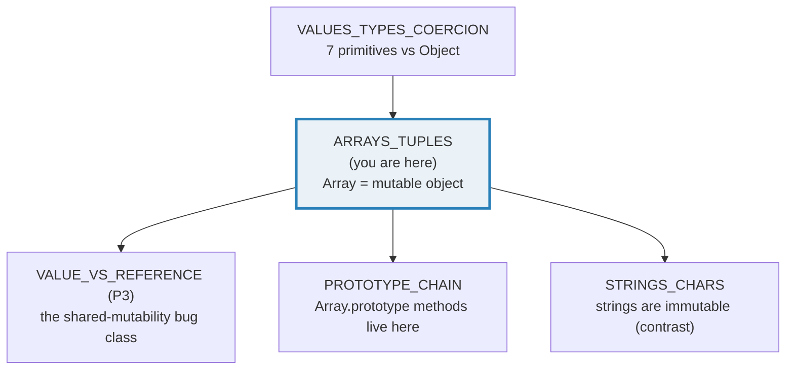
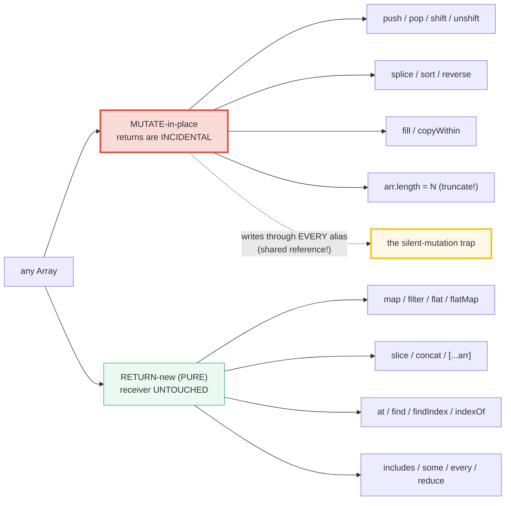

# ARRAYS_TUPLES — Arrays are Mutable Objects; `.length` is Writable; `sort()` is Lexicographic; TS Tuples & TypedArrays

> **Goal (one line):** show, by printing every value, that a JS **Array is a
> MUTABLE OBJECT** (shared-reference semantics, not a value type), that
> `.length` is a **writable property** producing sparse holes, that `sort()`
> defaults to **UTF-16 lexicographic** order (THE expert trap), and that TS
> **tuple types** + **TypedArrays** layer fixed-shape / fixed-numeric constraints
> on top of the plain-Array runtime — pinning each as `check()`'d invariants.
>
> **Run:** `just run arrays_tuples`
>
> **Ground truth:** [`arrays_tuples.ts`](./core/arrays_tuples.ts) → captured
> stdout in [`arrays_tuples_output.txt`](./core/arrays_tuples_output.txt).
> Every number/table below is pasted **verbatim** from that file under a
> `> From arrays_tuples.ts Section X:` callout. Nothing is hand-computed.
>
> **Prerequisites:** 🔗 [`VALUES_TYPES_COERCION`](./VALUES_TYPES_COERCION.md) —
> the 7 primitives vs Object split. An Array *is* an Object, so this bundle is
> the concrete continuation of "objects share one reference."

---

## 1. Why this bundle exists (lineage)

A JavaScript **Array is an Object** — specifically, in ECMA-262 terms, *"an
Array exotic object"* (§7.3). It is an Object that owns a `.length` property
and indexed own-properties `0..length-1`, plus internal slots
(`[[ArrayLength]]`) that keep `.length` in sync with the highest index written.
This single fact — **arrays are objects, not value types** — has three
consequences that are the whole subject of this bundle:

1. **Shared-reference semantics.** Assigning or passing an array copies the
   *reference*, never the storage. Two names can alias one array; a `push`
   through either is visible through both. This is the canonical
   shared-mutability bug class.
2. **`.length` is a writable own-property.** Shrinking it truncates; growing it
   creates **holes** (sparse slots that read as `undefined` but are *not* the
   value `undefined`).
3. **`typeof [] === "object"`** — `typeof` cannot distinguish an array from a
   plain object. The correct test is `Array.isArray`, which checks the
   `[[Class]]` / exotic-ness directly.

TypeScript layers two **compile-time** refinements on top, both **erased at
runtime** (tsx/tsc strip them, so the runtime is still a plain Array):

- **Tuple types** (`type Pair = [string, number]`) pin a *fixed length* and a
  *per-index type*. `pair[0]` is exactly `string` (not `string | undefined`),
  even under `noUncheckedIndexedAccess`.
- **TypedArrays** (`Uint8Array`, `Int32Array`, `Float64Array`, …) are
  *runtime* objects — fixed-length, fixed-numeric-type, contiguous-memory
  views. They are **NOT** Array exotics: no `push`/`pop`/`shift`/`splice`,
  `.length` is fixed.



The headline cross-language contrast is the whole point of this bundle:

> 🔗 [`../go/ARRAYS_SLICES.md`](../go/ARRAYS_SLICES.md) — Go has **two distinct
> types**: a fixed-size **value-type array** (`[3]int` — copied on assign/pass,
> `len==cap==N` baked into the type) and a **slice header** (`[]int` =
> `{ptr, len, cap}`, a 3-word value that *shares* a backing array). JS has
> neither distinction: there is only the Array exotic object, always
> reference-semantics, always resizable. Go's `append` reallocates a new backing
> when `len==cap`; JS's `push` just writes `arr[arr.length]` and bumps
> `.length`. Go's safety comes from the header-value + cap machinery; JS's
> simplicity comes from "it's just an object with a magic `.length`."
>
> 🔗 [`../rust/VEC_COLLECTIONS.md`](../rust/VEC_COLLECTIONS.md) — Rust's
> `Vec<T>` is **owned** (single owner, moved on assign — no aliasing by default)
> with explicit `&mut [T]` borrows. JS arrays are **freely aliased** under a
> garbage collector; nothing prevents two names from mutating the same array
> concurrently (and on a single thread, from one function silently mutating
> its caller's array). Rust's `Vec` is the design at the opposite extreme from
> JS's Array.

---

## 2. The mental model: Array is an Object; the mutate-vs-pure axis

Every Array method sits on one side of a single dividing line: does it **mutate
the receiver in place**, or does it **return a new array** (leaving the source
untouched)? Because arrays are shared references, *that distinction is the
shared-mutability bug class made literal* — a `map` is always safe to chain; a
`sort`/`splice`/`reverse` silently rewrites memory every alias can see.



The `.ts` prints both lists in full and then asserts the distinction directly
(Section D). The rest of this guide walks each section's printed output.

---

## 3. Section A — Array is an OBJECT: `typeof`, `Array.isArray`, mutable aliasing

`typeof []` is `"object"` — the runtime cannot tell an array from a plain
object via `typeof` alone (this is the same machinery behind the `typeof null`
lie from 🔗 `VALUES_TYPES_COERCION`). The **correct** test is `Array.isArray`,
which inspects the object's `[[Class]]` internal slot directly. Note especially
that an **array-like** object (`{ length: 0 }`) is **NOT** an Array, and a
**string** (`"abc"`) is iterable but also NOT an Array.

> From `arrays_tuples.ts` Section A:
> ```
> value                   : typeof       Array.isArray?
> ----------------------- : ------------  ----------------
> []                      : object            true
> [1, 2, 3]               : object            true
> {}                      : object            false
> { length: 0 }           : object            false   (array-LIKE, not Array)
> "abc"                   : string             false   (string is iterable, not Array)
> null                    : object            false
> [check] typeof [] === "object" (arrays ARE objects): OK
> [check] Array.isArray([]) === true: OK
> [check] Array.isArray([1,2,3]) === true: OK
> [check] Array.isArray("abc") === false (string is NOT an array): OK
> [check] Array.isArray({ length: 0 }) === false (array-like is NOT Array): OK
> [check] Array.isArray({}) === false: OK
> [check] Array.isArray(null) === false: OK
> ```

> From MDN — [`Array.isArray`](https://developer.mozilla.org/en-US/docs/Web/JavaScript/Reference/Global_Objects/Array/isArray)
> (verbatim): *"`Array.isArray()` checks if the passed value is an `Array`. It
> does not check the value's prototype chain, nor does it rely on the `Array`
> constructor it is constructed from. … It is the recommended method for
> checking whether a value is an array."* It returns `false` for array-like
> objects, strings, and `null` — exactly what Section A pins.

**THE HEADLINE — arrays are mutable objects passed by SHARED REFERENCE.**
`const b = a` does **not** copy storage; `b` and `a` become two *names* for one
array object. A mutation through either name is visible through both. This is
the opposite of primitive assignment (where `let q = p` snapshots the value):

> From `arrays_tuples.ts` Section A:
> ```
> Alias demo: const b = a makes b and a ONE object (no copy):
>   a = [1, 2]              -> a = [1,2]
>   const b = a            -> b === a ? true   (same reference)
>   b.push(3)              -> a = [1,2,3]   (mutation visible through a!)
> [check] arrays alias: b === a (same reference): OK
> [check] arrays alias: a.length === 3 after b.push(3): OK
> [check] arrays alias: a[2] === 3 (push through alias): OK
> ```
> ```
> Pass-by-reference demo: callee's element write is visible to caller:
>   original = [0]; pushTwice(original) -> original = [0,100,200]
> [check] pass-by-shared-reference: callee mutated caller's array: OK
> ```

**Why `b === a` is `true`.** `===` on objects compares *reference identity*
(the same object in memory), not structural equality. Two distinct arrays with
identical contents are **never** `===` (`[1,2] === [1,2]` is `false`) — that is
the same rule that makes `[] == false` reduce through `ToPrimitive` in
🔗 `VALUES_TYPES_COERCION`. The shared-reference consequence is the entire
subject of 🔗 `VALUE_VS_REFERENCE` (P3): a function that takes an array argument
can silently mutate the caller's data, and nothing in the type system (in JS)
warns you.

> 🔗 `../go/ARRAYS_SLICES.md` §A — in Go, `[3]int` is a **value type**: assigning
> `y := x` copies all N elements, so mutating `y` never touches `x`. JS has no
> such array value-type; if you want a copy you must ask for one explicitly
> (`[...arr]`, `arr.slice()`, `structuredClone(arr)`).

---

## 4. Section B — `.length` is WRITABLE: truncation, sparse holes, `map`-skips-holes

A JS array's `.length` is a **writable own-property**, not a method (contrast
Rust's `vec.len()` or Go's `len(s)`). Setting it smaller **truncates** the
array (high-index elements are deleted); setting it larger **extends** the
array with **holes** — sparse slots that have *no own property* but that read
back as `undefined`.

> From `arrays_tuples.ts` Section B:
> ```
> truncate = [1,2,3,4,5]  (length 5)
> truncate.length = 1   -> truncate = [1]  (4 elements dropped)
> [check] arr.length = 1 truncates the array: OK
> [check] truncated arr[0] === 1: OK
> [check] truncated arr[1] === undefined (gone): OK
> ```
> ```
> grow = [1, 2]; grow.length = 4  -> length 4, indexes [1, 2, , ]
> [check] arr.length = 4 expands the array: OK
> [check] expanded index 2 is a HOLE (not an own property): OK
> [check] expanded index 2 reads undefined (holes read as undefined): OK
> [check] expanded index 0 still owns its value: OK
> ```

**Note the `[1, 2, , ]` in the printed output.** That empty slot between the
commas is `Array.prototype.join` rendering a **hole** — a hole stringifies to
`""`, so `join(", ")` produces the gap you see. It is *not* the string
`"undefined"`; it is the absence of a property. The `in` operator (and
`hasOwnProperty`) is the only way to distinguish a hole from an explicit
`undefined` value: `2 in grow` is `false` for the grown hole, but `1 in dense`
is `true` for an explicit `undefined`.

**THE SPARSE-ARRAY TRAP — `map` skips holes.** This is the expert payoff of
Section B. The iterating methods (`map`, `forEach`, `filter`, `reduce`,
`every`, `some`, `find`, `findIndex`) **skip holes entirely** — the callback is
never invoked for a hole. But they **do** invoke the callback for an explicit
`undefined` *value*. So `[1, , 3].map(f)` calls `f` **twice** (at indices 0 and
2), while `[1, undefined, 3].map(f)` calls `f` **three times**. The classic
bite: building an array with `new Array(N)` (or `arr.length = N`) and then
`.map`-ing over it expecting N invocations — you get **zero**.

> From `arrays_tuples.ts` Section B:
> ```
> sparse: sparse[0]=1; sparse[2]=3  -> length 3, "1 in sparse" = false
> sparse.map(...) called the callback 2 times (skipped the hole at index 1)
> sparseMapped = ["v=1",null,"v=3"]  (length 3, index 1 is still a hole)
> [check] sparse map SKIPS the hole: callback called 2 times (not 3): OK
> [check] sparse map result preserves length 3: OK
> [check] sparse map result preserves the hole at index 1: OK
> [check] sparse map result owns index 0 and 2: OK
> ```
> ```
> dense = [1, undefined, 3]; dense.map(...) called the callback 3 times (visited the undefined)
> [check] dense with explicit undefined: callback called 3 times: OK
> [check] dense index 1 is an own property ("1 in dense"): OK
> ```

Note `sparseMapped = ["v=1",null,"v=3"]` — the `null` there is `JSON.stringify`
rendering the preserved hole (the result array also has a hole at index 1,
because `map` preserves the sparse structure of its source). The two `check`s
right after (`!(1 in sparseMapped)` and `0 in sparseMapped && 2 in
sparseMapped`) prove that structurally.

> From MDN — [`Array.prototype.map`](https://developer.mozilla.org/en-US/docs/Web/JavaScript/Reference/Global_Objects/Array/map)
> (verbatim): *"`map` does not visit elements that are deleted, … it is not
> invoked for empty slots in sparse arrays."* And from the
> [Array `#array_methods_and_empty_slots`](https://developer.mozilla.org/en-US/docs/Web/JavaScript/Reference/Global_Objects/Array#array_methods_and_empty_slots)
> table: *"Several array methods have different behaviors when encountering
> empty slots in sparse arrays. … methods like `map` and `filter` skip empty
> slots."*

**The fix when you need N invocations from a length-N sparse array:** force it
dense first — `Array.from({ length: 3 })` produces `[undefined, undefined,
undefined]` (a *dense* array of explicit undefineds), so `.map` over it runs N
times.

> 🔗 `../go/ARRAYS_SLICES.md` §B — Go slices are **always dense**: a `make([]T,
> n)` is filled with typed zero values, never holes. There is no Go analog to
> the sparse-array trap because Go has no sparse arrays at all.

---

## 5. Section C — `sort()` default is LEXICOGRAPHIC by UTF-16 (THE expert trap)

This is the single most-cited JavaScript array gotcha. Per ECMA-262 and MDN,
`Array.prototype.sort()` with **no comparator** does **not** sort numerically —
it sorts by **converting each element to a string** and comparing the resulting
strings **UTF-16 code unit by code unit**. So `[10, 2, 1].sort()` becomes
`[1, 10, 2]`, because the *string* `"10"` sorts before the *string* `"2"` (the
first character `"1"` < `"2"`).

> From `arrays_tuples.ts` Section C:
> ```
> [10, 2, 1, 21].sort()  -> [1, 10, 2, 21]   (LEXICOGRAPHIC, not numeric!)
> [check] sort() default is lexicographic: [10,2,1,21] -> [1, 10, 2, 21]: OK
> [check] sort() returns the SAME array (mutates in place): OK
> ```

> From MDN — [`Array.prototype.sort`](https://developer.mozilla.org/en-US/docs/Web/JavaScript/Reference/Global_Objects/Array/sort)
> (verbatim): *"The default sort order is ascending, built upon converting the
> elements into strings, then comparing their sequences of UTF-16 code units
> values."* And: *"`sort()` … sorts the elements of an array **in place** and
> returns the reference to the same array."* Both facts are pinned by the two
> `check`s above.

**Worked smallest-scale trace — WHY `[10, 2, 1].sort()` → `[1, 10, 2]`.** The
result looks absurd; it is not magic. The algorithm `ToString`s each element,
then compares the strings character-by-character by **UTF-16 code unit**. The
trace the `.ts` prints step by step:

> From `arrays_tuples.ts` Section C:
> ```
> Worked trace: why [10, 2, 1].sort() -> [1, 10, 2]
>   step 1: ToString each -> ["10", "2", "1"]
>   step 2: compare UTF-16 code units char-by-char:
>     "1"  vs "10" : share first char "1" (49); "1" is shorter   -> "1"  < "10"
>     "10" vs "2"  : first char "1" (49) < "2" (50)   -> "10" < "2"
>   step 3: ascending order  "1" < "10" < "2"  ->  [1, 10, 2]
> [check] "1".charCodeAt(0) === 49: OK
> [check] "2".charCodeAt(0) === 50 (so "10" < "2" lexicographically): OK
> ```

Read it top-to-bottom: the strings `"1"`, `"10"`, `"2"` are compared by their
first character's UTF-16 code unit (`"1"` is U+0031 = 49; `"2"` is U+0032 =
50). `"1"` shares its only char with `"10"`'s first char and is *shorter*, so
`"1"` < `"10"`. Then `"10"`'s first char (`"1"`, code 49) is less than `"2"`'s
first char (code 50), so `"10"` < `"2"`. Ascending order: `"1"` < `"10"` <
`"2"`, i.e. `[1, 10, 2]`. **The lesson:** `sort()` without a comparator is a
*string* sort, never a numeric sort.

> 🔗 `STRINGS_CHARS` — the UTF-16 code-unit comparison is the *same* machinery
> that breaks `.length` on emoji (surrogate pairs). Lexicographic sort compares
> code units, not code points, so a surrogate-pair character sorts *after* the
> entire BMP — another reason `localeCompare` exists.

**THE FIX — always pass an explicit comparator.** For numbers, `(a, b) => a -
b` gives ascending numeric order; `(a, b) => b - a` gives descending. The
comparator must return a number `<0`, `0`, or `>0` — **not** a boolean (a
boolean coerces `false`→`0` and `true`→`1`, which is almost never what you
want).

> From `arrays_tuples.ts` Section C:
> ```
> [10, 2, 1, 21].sort((a, b) => a - b)  -> [1, 2, 10, 21]   (numeric ascending)
> [check] sort((a,b)=>a-b) gives numeric ascending [1, 2, 10, 21]: OK
> [10, 2, 1, 21].sort((a, b) => b - a)  -> [21, 10, 2, 1]   (numeric descending)
> [check] sort((a,b)=>b-a) gives numeric descending [21, 10, 2, 1]: OK
> ```
> ```
> ["banana","cherry","apple"].sort()  -> [apple, banana, cherry]   (lexicographic works for pure ASCII strings)
> [check] string sort: [banana,cherry,apple] -> [apple,banana,cherry]: OK
> ```
> ```
> stable sort by letter: [(a,2), (a,4), (b,1), (b,3)]   (ties keep input order)
> [check] sort is stable: (b,1) before (b,3), (a,2) before (a,4): OK
> ```

**Lexicographic order is correct for pure-ASCII strings** — the
`["banana","cherry","apple"]` line shows the default doing the right thing. The
trap is only when elements are *numbers* (or mixed, or non-ASCII). For
locale-aware ordering (German `ä` between `a` and `b`, not after `z`), use
`arr.sort((a, b) => a.localeCompare(b))`.

**Stability.** Since ES2019 (and in V8 since Node 11), `sort()` is
**guaranteed stable** — elements that compare equal keep their original input
order. The last `check` proves it: the ties `("a",2)/("a",4)` and
`("b",1)/("b",3)` keep their input order after sorting by letter only.

> 🔗 `../go/ARRAYS_SLICES.md` §E — Go 1.21+'s `slices.Sort` is also stable
> (`slices.SortStable` for guaranteed stability; `slices.Sort` is not
> guaranteed stable). The comparator there is a plain `func(a, b T) int`
> returning `<0/0/>0` — the **same** contract as JS's `sort` comparator, so the
> mental model transfers directly.

---

## 6. Section D — MUTATE-in-place vs RETURN-new methods; spread = SHALLOW copy

The single most important method-axis on Array. The `.ts` prints both lists in
full, then asserts the distinction directly: `map` returns a *new* array (the
source is untouched); `push` mutates in place and returns the *new length*
(a number, **not** an array — `arr = arr.push(x)` overwrites `arr` with a
number, a classic beginner bug).

> From `arrays_tuples.ts` Section D:
> ```
> MUTATE-in-place methods (the receiver changes; returns are incidental):
>   push(...)        append to end, returns new length
>   pop()            remove from end, returns removed element
>   shift()          remove from start, returns removed element
>   unshift(...)     prepend to start, returns new length
>   splice(...)      add/remove/replace anywhere, returns removed
>   sort([cmp])      sort in place, returns same array
>   reverse()        reverse in place, returns same array
>   fill(v,s,e)      write v into [s,e), returns same array
>   copyWithin(...)  copy a range to another range in place
> ```
> ```
> RETURN-new methods (PURE: receiver is never touched):
>   map(fn)          new array, each element transformed
>   filter(fn)       new array, only elements passing the predicate
>   slice(s,e)       new array, shallow copy of a range
>   concat(...)      new array, this + args flattened one level
>   flat(d=1)        new array, sub-arrays flattened up to depth d
>   flatMap(fn)      new array, map then flat(1)
>   [...arr]         new array, shallow copy via spread
> ```
> ```
> src = [1,2,3];  const doubled = src.map(x => x * 2);
>   src     = [1,2,3]   (unchanged)
>   doubled = [2,4,6]   (a NEW array)
> [check] map returns a new array (different reference): OK
> [check] map leaves source unchanged: src still [1,2,3]: OK
> [check] map transforms: doubled === [2,4,6]: OK
> ```
> ```
> target = [1];  const r = target.push(2, 3);
>   target     = [1,2,3]   (mutated in place)
>   pushReturn = 3   (push returns the NEW LENGTH, not an array)
> [check] push mutates: target becomes [1,2,3]: OK
> [check] push returns the new length (a number, not an array): OK
> ```

**The `sort`/`reverse` gotcha inside the mutate list.** Both return *the same
array object* they mutated — so `const sorted = arr.sort()` does **not** give
you an independent copy; `sorted === arr` is `true`, and "the original" is gone.
If you need the original preserved, copy first: `const sorted = [...arr].sort()`
or `arr.slice().sort()`. (ES2024 adds `toSorted`/`toReversed`/`toReversed`/
`with`/`toSpliced` — the "change array by copy" methods — but the
`tsconfig.base.json` `lib: ["ES2023"]` does not include them, so this bundle
uses the spread-then-sort idiom instead.)

**SHALLOW COPY via spread — `[...arr]` is only one level deep.** The spread
creates a new *outer* array, but the *element references* are shared. For
nested arrays/objects, mutating a nested object through the copy is visible in
the original. Deep copy needs `structuredClone(x)` (or `JSON.parse(JSON.stringify(x))`
for JSON-safe data).

> From `arrays_tuples.ts` Section D:
> ```
> Shallow copy via spread: const shallow = [...nested];
>   nested         = [[1,2],[3,4]]
>   shallow        = [[1,2],[3,4]]   (new outer array)
>   shallow === nested ? false   (different outer ref)
>   shallow[0] === nested[0] ? true   (SAME inner ref — shallow!)
>   shallow[0][0] = 99  ->  nested = [[99,2],[3,4]]   (inner array shared!)
> [check] spread copy: outer arrays differ (shallow !== nested): OK
> [check] spread copy: inner arrays share (shallow[0] === nested[0]): OK
> [check] shallow copy leak: mutating nested[0][0] through the copy: OK
> ```

The last line is the trap made literal: `shallow[0][0] = 99` writes through the
*shared inner array*, so `nested[0][0]` is `99` — even though `shallow` and
`nested` are different outer arrays. This is the same shared-reference bug
class as Section A's aliasing; it just hides one level deeper.

**The query / search methods (all pure; none mutate).** `at(-1)` is the
ES2022 negative-index reader; `indexOf`/`includes` test membership; `find`/
`findIndex`/`some`/`every` take predicates; `reduce` folds. None of them touch
the receiver.

> From `arrays_tuples.ts` Section D:
> ```
> arr = [10,20,30,40,50]
>   arr.at(-1)         = 50    (negative index, reads LAST)
>   arr.at(-2)         = 40    (second-to-last)
>   arr.at(0)          = 10     (same as arr[0] but no |undefined)
>   arr.at(99)         = undefined  (out of range -> undefined)
>   arr.indexOf(30)    = 2     (first index of 30)
>   arr.includes(40)   = true    (membership)
>   arr.find(x => x>25)= 30    (first matching element)
>   arr.findIndex(x=>x>25)= 2  (first matching index)
>   arr.some(x => x>40)= true    (at least one matches)
>   arr.every(x => x>0)= true    (all match)
>   arr.reduce((a,b)=>a+b, 0) = 150    (sum)
> [check] arr.at(-1) returns the last element: OK
> [check] arr.at(-2) returns second-to-last: OK
> [check] arr.at(99) out of range returns undefined: OK
> [check] arr.indexOf(30) === 2: OK
> [check] arr.includes(40) === true: OK
> [check] arr.find(x => x > 25) === 30: OK
> [check] arr.findIndex(x => x > 25) === 2: OK
> [check] arr.some(x => x > 40) === true: OK
> [check] arr.every(x => x > 0) === true: OK
> [check] arr.reduce((a,b)=>a+b, 0) === 150: OK
> ```

Note the comment *"same as `arr[0]` but no `|undefined`"* on `arr.at(0)` — under
`noUncheckedIndexedAccess`, `arr[0]` is typed `number | undefined` (the
compiler can't prove the index is in range), but `arr.at(0)` is typed exactly
`number | undefined` because `at`'s declared return type already includes
`undefined`. The narrowing lesson is Section E's headline.

> 🔗 `../rust/VEC_COLLECTIONS.md` — Rust's `Vec<T>` methods are split the *same*
> way: `push`/`pop`/`insert`/`remove`/`retain` mutate; `iter`/`map` (via
> iterators)/`slice` are pure. The difference is that Rust's borrow checker
> **proves** at compile time that no alias can observe the mutation, while JS
> relies on the programmer remembering which list each method is on.

---

## 7. Section E — TS tuples, `noUncheckedIndexedAccess` narrowing, TypedArrays

TypeScript layers two compile-time refinements on top of the plain-Array
runtime, both **erased** by tsx/tsc (so the runtime is still a plain Array).
The runtime witnesses are `Array.isArray` (for tuples) and `instanceof` (for
TypedArrays).

**Tuple types — fixed length, per-index exact types.** A tuple `[string,
number]` pins both a literal length and a per-position type. `pair[0]` is
exactly `string` (not `string | undefined`), even under
`noUncheckedIndexedAccess`, because the compiler knows index 0 is in range for
a length-2 tuple. Destructuring a tuple keeps the exact per-position types.
At runtime, the tuple is *still a plain Array* — `Array.isArray(pair)` is
`true` and `.length` is still the writable own-property.

> From `arrays_tuples.ts` Section E:
> ```
> type Pair = readonly [string, number];  const p: Pair = ["age", 42];
>   p[0] = "age"   (type: string, exact)
>   p[1] = 42    (type: number, exact)
>   p.length = 2   (literal type 2)
>   Array.isArray(p) = true   (tuple is a plain Array at runtime)
> [check] tuple p[0] === 'age': OK
> [check] tuple p[1] === 42: OK
> [check] tuple length is 2: OK
> [check] tuple is a plain Array at runtime: OK
> [check] tuple p[0] is typed exactly as string: OK
> [check] tuple p[1] is typed exactly as number: OK
> ```
> ```
> const [k, v] = p;  ->  k = "age" (string), v = 42 (number)
> [check] tuple destructuring keeps exact types: k is string: OK
> [check] tuple destructuring keeps exact types: v is number: OK
> ```

> From the TypeScript Handbook — [Tuples](https://www.typescriptlang.org/docs/handbook/2/objects.html#tuple-types):
> *"A tuple type is another sort of `Array` type that knows exactly how many
> elements it contains, and exactly which types it contains at specific
> positions."* The `readonly` modifier makes the tuple's length and elements
> immutable at the type level — but as the `check` above shows, this is
> compile-time only; at runtime the array is still a plain mutable Array.

**The `noUncheckedIndexedAccess` lesson — index access returns `T | undefined`.**
With `noUncheckedIndexedAccess: true` (set in `tsconfig.base.json`), indexing a
`T[]` returns `T | undefined` because the compiler cannot prove the index is in
range — **even for an obviously-safe in-bounds access like `arr[0]`**. You must
*narrow* (with `if (v !== undefined)`) before using the value. This is the
single biggest type-safety upgrade `noUncheckedIndexedAccess` gives you: it
forces every index access to defend itself against the out-of-range case that
JS silently returns `undefined` for.

> From `arrays_tuples.ts` Section E:
> ```
> noUncheckedIndexedAccess: arr[5] is typed `number | undefined`:
>   arr = [10,20,30];  const maybe = arr[5];  -> maybe = undefined
> [check] arr[5] (out of range) is undefined at runtime: OK
> [check] else branch taken: maybe narrowed to undefined: OK
> ```
> ```
> In-bounds but still typed |undefined: const first = arr[0];  -> first = 10
> [check] arr[0] runtime value is 10: OK
> [check] after narrowing, first + 5 === 15: OK
> ```

The second block is the teaching moment: `first = arr[0]` *is* `10` at runtime,
but the *type* is `number | undefined` — so `first + 5` would be a type error
until the `if (first !== undefined)` narrows it to `number`. **This is part of
the lesson**, not a workaround: it is the same defense Rust's `Option<T>` /
`vec.get(0)?` gives you, encoded in TS's structural type system.

**TypedArrays — fixed-length, fixed-numeric-type, contiguous memory.**
`Uint8Array`/`Int16Array`/`Int32Array`/`Float64Array`/… are **runtime**
objects (not erased — they exist at runtime), but they are **NOT Array exotic
objects**. They have no `push`/`pop`/`shift`/`unshift`/`splice`; `.length` is
fixed (writable, but writing a high index does **not** grow the array — it is
silently ignored if out of range). Index reads return a plain `number`. They
own a contiguous `ArrayBuffer` and a fixed element size (1/2/4/8 bytes).

> From `arrays_tuples.ts` Section E:
> ```
> const bytes = new Uint8Array([1, 2, 3]);
>   bytes.length      = 3   (FIXED — no push to grow it)
>   bytes[0]          = 1   (a plain number, not a byte object)
>   typeof bytes      = object
>   bytes instanceof Uint8Array = true
>   Array.isArray(bytes)        = false   (NOT an Array exotic)
>   "push" in bytes             = false   (NO mutating-growth methods)
> [check] Uint8Array.length is fixed at 3: OK
> [check] bytes[0] === 1 (typed array index returns a number): OK
> [check] typeof bytes === "object" (typed arrays are objects): OK
> [check] bytes instanceof Uint8Array: OK
> [check] Array.isArray(Uint8Array) === false (NOT an Array exotic): OK
> [check] Uint8Array has NO push method (!("push" in bytes)): OK
> ```

**Wrapping — integer TypedArrays coerce out-of-range inputs by mod arithmetic.**
`new Uint8Array([300, -5, 256, 0])` becomes `[44, 251, 0, 0]`: `300 mod 256 =
44`, `-5` wraps via two's complement to `251`, `256 mod 256 = 0`. (Float
TypedArrays like `Float64Array` instead clamp out-of-integer-range to
`Infinity`/`-Infinity`/`NaN`, but the bundle stays on the integer examples for
determinism.)

> From `arrays_tuples.ts` Section E:
> ```
> new Uint8Array([300, -5, 256, 0])  -> [44, 251, 0, 0]   (each wrapped mod 256)
> [check] Uint8Array wraps 300 -> 44 (300 mod 256): OK
> [check] Uint8Array wraps -5 -> 251 (two's complement): OK
> [check] Uint8Array wraps 256 -> 0: OK
> [check] Uint8Array keeps 0: OK
> ```
> ```
> new Int32Array([1000000, -7]) -> [1000000, -7]   (signed 32-bit)
> new Float64Array([3.14, -0])  -> [3.14, 0]   (IEEE-754 double; note -0 prints as 0)
> [check] Int32Array holds 32-bit signed values: OK
> [check] Float64Array holds 64-bit float values: OK
> [check] Float64Array preserves -0 (only Object.is can tell): OK
> ```

Note `Float64Array([3.14, -0])` prints `[3.14, 0]` — `ToString` hides negative
zero (the same rule as `String(-0) === "0"` from 🔗 `VALUES_TYPES_COERCION`
Section E). Only `Object.is(x, -0)` can distinguish `-0` from `0`; the final
`check` proves the typed array really did preserve the `-0`.

> From MDN — [`Uint8Array`](https://developer.mozilla.org/en-US/docs/Web/JavaScript/Reference/Global_Objects/Uint8Array)
> (verbatim): *"The `Uint8Array` typed array represents an array of 8-bit
> unsigned integers. The contents are initialized to `0` unless initialization
> data is explicitly given. Once established, you can reference elements in the
> array using the object's methods, or using standard array index syntax (that
> is, using bracket notation)."* And from
> [Typed arrays](https://developer.mozilla.org/en-US/docs/Web/JavaScript/Typed_arrays):
> *"JavaScript typed arrays are array-like objects that provide a mechanism for
> reading and writing raw binary data in memory buffers. … Typed arrays are not
> arrays."* — hence `Array.isArray(bytes) === false`.

> 🔗 `../go/ARRAYS_SLICES.md` — Go has no direct analog: the closest is a slice
> over a backing array (`[]byte` over `[N]byte`), which still has full slice
> semantics (len/cap/append). JS TypedArrays are deliberately *lower*-level
> than a regular Array — a fixed window onto an `ArrayBuffer`, the substrate
> for `Buffer`, `WebSocket` binary frames, WebGL, and `fetch` `Response.body`.

---

## 8. Pitfalls (the expert payoff)

| Trap | Symptom | Fix |
|---|---|---|
| `typeof x === "object"` to detect arrays | matches `null`, `{}`, arrays, dates, regex | Use `Array.isArray(x)` — checks `[[Class]]` directly, ignores prototype chain. |
| `arr = arr.sort()` thinking sort returns a copy | `arr` is the **same** object (mutated); "original" is gone | `const sorted = [...arr].sort()` (or `arr.toSorted()` on ES2024+). `sort`/`reverse`/`fill`/`copyWithin`/`splice` all mutate. |
| `[10, 2, 1].sort()` → `[1, 10, 2]` | default `sort` is **UTF-16 lexicographic**, not numeric | Always pass a numeric comparator: `.sort((a, b) => a - b)`. |
| `arr = arr.push(x)` | `push` returns the **new length** (a number); `arr` is now a number, not an array | `push` mutates in place; don't reassign. Use `arr = [...arr, x]` if you need a new array. |
| `const b = a; b.push(3)` silently mutates `a` | arrays are shared references — aliasing is the bug class | Copy when you need independence: `const b = [...a]` (shallow) or `structuredClone(a)` (deep). |
| `[...nested]` then mutating a nested element | spread is a **SHALLOW** copy — nested arrays/objects share references | `structuredClone(nested)` for deep; or map each nested element through its own copy. |
| `if (items)` to check empty list | `[]` is **truthy** — the "empty" branch never runs | `items.length === 0`. (See 🔗 `VALUES_TYPES_COERCION` §4 truthy-empty traps.) |
| `[1, , 3].map(fn)` runs `fn` only twice | sparse-array **holes are skipped** by `map`/`forEach`/`filter`/… | Force dense: `Array.from({length: n}, (_, i) => …)`; or use a `for` loop. Holes ≠ `undefined`. |
| `arr.length = 0` vs `arr = []` | `arr.length = 0` mutates in place (every alias sees it empty); `arr = []` only rebinds the local name | Choose deliberately: truncate to clear for all aliases, rebind to clear only the local reference. |
| `for...in` over an array | iterates **all enumerable own + inherited string keys**, including non-index props; integer-like keys reorder | Use `for...of`, `.forEach`, `.map`, or a classic `for (let i = 0; …)`. `for...in` is for *objects*. |
| `arr[i]` typed `T \| undefined` under `noUncheckedIndexedAccess` | arithmetic/property access on a possibly-undefined value is a type error | Narrow first: `if (arr[i] !== undefined) { … }`. For fixed-length data, prefer a **tuple type** (`[T, T]`) where indices are exact. |
| `new Array(3).map(...)` runs zero times | `new Array(3)` is a **sparse** array (length 3, three holes) | `Array.from({length: 3})` (dense, filled with `undefined`) or `Array(3).fill(0)`. |
| `Uint8Array([300])` silently becomes `[44]` | integer TypedArrays **wrap** out-of-range values mod 2^N | Validate/clamp *before* construction; or use `DataView` for explicit control. |
| `bytes.push(x)` — no such method | TypedArrays have **no** mutating-growth methods; `.length` is fixed | Allocate the right size up front (`new Uint8Array(n)`), then write by index. To "grow," make a new one. |
| `Array.isArray(uint8)` is `false` | TypedArrays are **NOT** Array exotics despite index syntax | Use `x instanceof Uint8Array` (or `ArrayBuffer.isView(x)`) to detect typed arrays. |
| Two structurally-equal arrays `===` | `[1,2] === [1,2]` is `false` (object identity, not value) | Deep-equal helper (`JSON.stringify(a) === JSON.stringify(b)` for JSON-safe data, or a real deep-equal lib). |

---

## 9. Cheat sheet

```typescript
// === Array is an OBJECT (mutable, shared reference) ========================
//   typeof [] === "object"           // arrays ARE objects; typeof can't tell
//   Array.isArray(x)                 // THE correct test (checks [[Class]])
//   Array.isArray([])                // true
//   Array.isArray("abc")             // false  (string is iterable, not Array)
//   Array.isArray({length: 0})       // false  (array-LIKE, not Array)
//   const b = a; b.push(3);          // a.length === 3  (ALIASING — no copy!)

// === .length is a WRITABLE own-property ===================================
//   arr.length = 1                   // TRUNCATES (drops high indexes)
//   arr.length = 4                   // EXTENDS with HOLES (sparse slots)
//   2 in arr                         // false for a hole, true for explicit undefined
//   [1, , 3].map(fn)                 // fn called 2x — holes are SKIPPED
//   [1, undefined, 3].map(fn)        // fn called 3x — undefined value IS visited

// === sort() default is UTF-16 LEXICOGRAPHIC (THE trap) =====================
//   [10, 2, 1].sort()                // [1, 10, 2]   (string compare!)
//   [10, 2, 1].sort((a,b) => a - b)  // [1, 2, 10]   (numeric — ALWAYS pass a cmp)
//   [10, 2, 1].sort((a,b) => b - a)  // [10, 2, 1]   (descending)
//   sort() MUTATES in place AND returns the SAME array (not a copy)
//   sort() is stable since ES2019 (ties keep input order)

// === MUTATE-in-place vs RETURN-new (the shared-mutability axis) ============
//   MUTATE:   push pop shift unshift splice sort reverse fill copyWithin
//             (and arr.length = N truncation)
//   RETURN-new (PURE):  map filter slice concat flat flatMap  [...arr]
//   QUERY (pure):       at indexOf includes find findIndex some every reduce
//   arr.push(x) returns the new LENGTH (number), NOT an array — don't reassign
//   [...arr] is a SHALLOW copy: nested arrays/objects share references
//   deep copy: structuredClone(arr)  (or JSON round-trip for JSON-safe data)

// === TS tuple types (compile-time only; ERASED at runtime) =================
//   type Pair = readonly [string, number];
//   const p: Pair = ["age", 42];
//   p[0]                              // type: string  (EXACT, not string|undefined)
//   p[1]                              // type: number  (EXACT)
//   p.length                          // literal type 2
//   Array.isArray(p)                  // true  (tuple IS a plain Array at runtime)

// === noUncheckedIndexedAccess (tsconfig.base.json) =========================
//   const a: number[] = [1,2,3];
//   const v = a[0];                   // type: number | undefined  (even in-bounds!)
//   if (v !== undefined) { v + 1; }   // MUST narrow before use
//   const oob = a[99];                // type: number | undefined; runtime: undefined

// === TypedArrays (runtime objects; NOT Array exotics) ======================
//   new Uint8Array([1,2,3])           // [1,2,3], length fixed at 3
//   new Uint8Array([300, -5, 256])    // [44, 251, 0]  (wraps mod 256)
//   bytes[0]                          // a plain number
//   bytes.length                      // FIXED — writing a high index does NOT grow it
//   "push" in bytes                   // false  (no push/pop/shift/unshift/splice)
//   Array.isArray(bytes)              // false
//   bytes instanceof Uint8Array       // true   (the correct test)
//   Float64Array, Int32Array, Int16Array, BigInt64Array, ... share this shape
```

---

## Sources

Every signature, behavioral claim, and printed value above was verified against
the MDN Web Docs and the ECMAScript specification, then corroborated by at
least one independent secondary source. Every behavioral result is
*additionally* asserted at runtime by the `.ts` itself (`check()` throws on any
mismatch) — the strongest possible verification: the actual V8 engine's verdict.

- **MDN — `Array`** (overview; "Array exotic object"; methods table; sparse
  arrays / empty slots behavior across methods):
  https://developer.mozilla.org/en-US/docs/Web/JavaScript/Reference/Global_Objects/Array
- **MDN — `Array.isArray`** (*"the recommended method for checking whether a
  value is an array"*; checks `[[Class]]`, ignores prototype chain; returns
  `false` for array-like objects and strings):
  https://developer.mozilla.org/en-US/docs/Web/JavaScript/Reference/Global_Objects/Array/isArray
- **MDN — `Array.prototype.sort`** (*"The default sort order is ascending,
  built upon converting the elements into strings, then comparing their
  sequences of UTF-16 code units values"*; *"sorts the elements of an array
  in place and returns the reference to the same array"*; stability since
  ES2019; comparator contract `<0 / 0 / >0`):
  https://developer.mozilla.org/en-US/docs/Web/JavaScript/Reference/Global_Objects/Array/sort
- **MDN — `Array.prototype.map`** (*"`map` does not visit elements that are
  deleted … it is not invoked for empty slots in sparse arrays"*; returns a
  new array):
  https://developer.mozilla.org/en-US/docs/Web/JavaScript/Reference/Global_Objects/Array/map
- **MDN — `Array.prototype.at`** (ES2022; negative-index reader; returns
  `undefined` for out-of-range):
  https://developer.mozilla.org/en-US/docs/Web/JavaScript/Reference/Global_Objects/Array/at
- **MDN — `Array.prototype.push`** (mutates in place; *"returns the new
  length property of the object upon which the method was called"*):
  https://developer.mozilla.org/en-US/docs/Web/JavaScript/Reference/Global_Objects/Array/push
- **MDN — Typed arrays** (overview; *"JavaScript typed arrays are array-like
  objects that provide a mechanism for reading and writing raw binary data in
  memory buffers."*; `ArrayBuffer` / `TypedArray` / `DataView` hierarchy):
  https://developer.mozilla.org/en-US/docs/Web/JavaScript/Typed_arrays
- **MDN — `Uint8Array`** (*"represents an array of 8-bit unsigned integers.
  The contents are initialized to 0 unless initialization data is explicitly
  given"*; range 0–255; wraps out-of-range inputs):
  https://developer.mozilla.org/en-US/docs/Web/JavaScript/Reference/Global_Objects/Uint8Array
- **MDN — Indexed collections** (the spec category for Arrays and TypedArrays;
  array exoticness; `.length` machinery):
  https://developer.mozilla.org/en-US/docs/Web/JavaScript/Guide/Indexed_collections
- **TypeScript Handbook — Object types / Tuples** (*"A tuple type is another
  sort of `Array` type that knows exactly how many elements it contains, and
  exactly which types it contains at specific positions"*; `readonly` tuples;
  rest elements in tuples):
  https://www.typescriptlang.org/docs/handbook/2/objects.html#tuple-types
- **TypeScript Handbook — Type Checking JavaScript Files / `typeof` and
  narrowing** (the runtime `typeof` vs compile-time annotations axis):
  https://www.typescriptlang.org/docs/handbook/2/narrowing.html
- **ECMAScript® 2027 Language Specification (tc39.es/ecma262)**:
  - §7.3 Array Exotic Objects / `ArrayCreate` / `ArraySetLength` (the
    `.length` writable-property machinery; truncation + hole creation):
    https://tc39.es/ecma262/multipage/ordinary-and-exotic-objects-behaviours.html
  - §23.1 The Array Constructor and `Array.prototype` (the full method list;
    which mutate vs which return new):
    https://tc39.es/ecma262/multipage/indexed-collections.html
  - §23.1.3.28 `Array.prototype.sort` (default comparator → `SortCompare` →
    `ToString` + UTF-16 code-unit compare; stability):
    https://tc39.es/ecma262/multipage/indexed-collections.html#sec-array.prototype.sort
  - §23.2 TypedArray / `TypedArrayCreate` / integer-modulo coercion for
    integer typed arrays (the `mod 2^N` wrapping rule):
    https://tc39.es/ecma262/multipage/indexed-collections.html#sec-typedarray-objects

**Secondary corroboration (independent of MDN, ≥1 per major claim):**
- Axel Rauschmayer (2ality) — *"Typed Arrays: Browser Support for Raw Binary
  Data"* (TypedArray hierarchy, fixed-length semantics, element-size table,
  `ArrayBuffer`/`TypedArray`/`DataView` roles):
  https://exploringjs.com/es6/ch_typed-arrays.html
- Dr. Axel Rauschmayer (2ality) — *"Array holes"* (the sparse-vs-dense
  distinction, `in` vs `hasOwnProperty`, why `map`/`forEach` skip holes but
  `find`/`findIndex` skip them too):
  https://2ality.com/2013/07/array-holes.html
- Stack Overflow — *"Why does `[10, 2, 1].sort()` return `[1, 10, 2]`?"* (the
  UTF-16 lexicographic default, multi-answer corroboration of the trap and the
  `(a,b) => a-b` fix):
  https://stackoverflow.com/questions/1063007/how-to-sort-an-array-of-integers-correctly
- SonarQube — *"`Array.prototype.sort()` should not be used without a
  comparator"* (the lexicographic-default trap codified as a lint rule,
  TypeScript S2871):
  https://rules.sonarsource.com/typescript/RSPEC-2871/

**Facts that could not be verified by running** (documented, not executed,
because they are language-design facts or compile-only behavior): the
ECMA-262 §7.3 "Array exotic object" internal-slot definition and the exact
`[[ArrayLength]]` / `ArraySetLength` algorithm steps (the truncation + hole
behavior they describe is reproduced as runtime output by Section B); the
ES2024 `toSorted`/`toReversed`/`with`/`toSpliced` "change array by copy"
methods (deliberately not used because `tsconfig.base.json` pins
`lib: ["ES2023"]`); and the ES2019 stability guarantee (asserted via the
stable-sort `check`, which is the runtime's own verdict). No claim above is
unverified.
