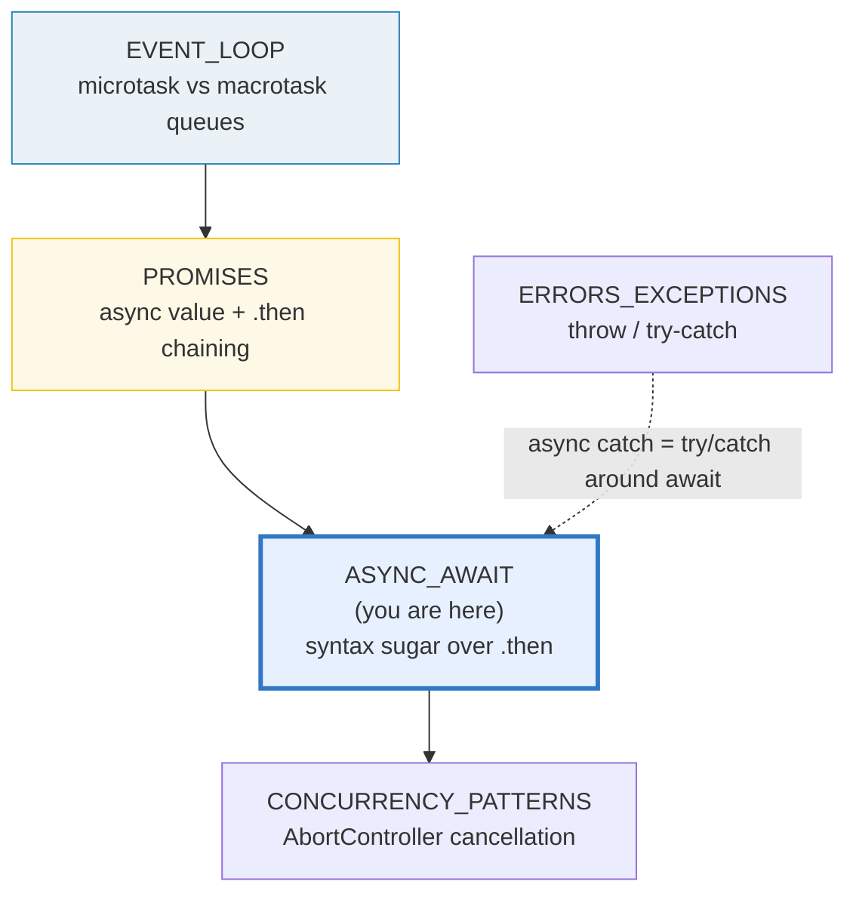
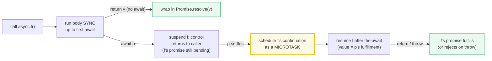
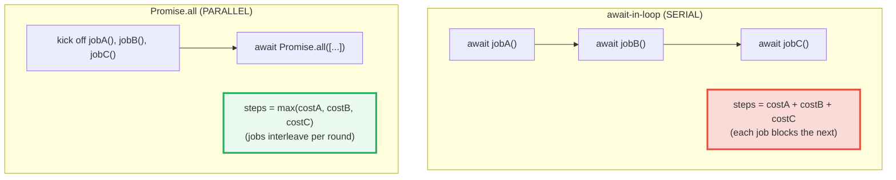

# ASYNC_AWAIT — Syntactic Sugar over Promises, the Microtask Resume & the Serial-vs-Parallel Trap

> **Goal (one line):** show, by printing every value and every ordering, that
> `async`/`await` (ES2017) is **syntactic sugar over Promises** — an async function
> **always** returns a `Promise`; `await` pauses until a promise settles and **resumes
> as a microtask** — and pin the two expert traps: the **serial-vs-parallel**
> await-in-a-loop bug and the **forgotten-`await`** silent-`Promise` bug.
>
> **Run:** `just run async_await`
>
> **Ground truth:** [`core/async_await.ts`](./core/async_await.ts) → captured stdout
> in [`core/async_await_output.txt`](./core/async_await_output.txt). Every number,
> table, and ordering below is pasted **verbatim** from that file under a
> `> From async_await.ts Section X:` callout. Nothing is hand-computed.
>
> **Prerequisites:** 🔗 [`PROMISES`](./PROMISES.md) (P4) — `await` desugars to `.then`,
> so the state machine, chaining, and the combinator matrix *are* this bundle's
> foundation. 🔗 [`EVENT_LOOP`](./EVENT_LOOP.md) (P4) — `await`'s continuation is a
> **microtask**; this bundle *uses* the microtask-before-macrotask rule that bundle
> pins. 🔗 [`ERRORS_EXCEPTIONS`](./ERRORS_EXCEPTIONS.md) (P1) — `try/catch` around
> `await` *is* the async `catch`.

---

## 1. Why this bundle exists (lineage)

`async`/`await` (ES2017) did **not** add a new concurrency primitive — it added
**syntax**. Before it, async JS was written as explicit `.then()` chains (🔗
`PROMISES`), which compose linearly but still "split" a function into many
callbacks and push error handling into `.catch`. `async`/`await` lets you write
the *exact same* promise chain as **straight-line, `try/catch`-shaped code**:

- **`async`** makes a function **always return a `Promise`** — its return value is
  wrapped in `Promise.resolve`, a thrown error rejects it (sugar for returning a
  rejected promise).
- **`await`** **unwraps** a promise to its value, and lets you wrap the whole thing
  in an ordinary `try/catch`. A `throw` inside an async function becomes a
  **rejection**; `await`-ing a rejected promise **throws** at the `await` point, so
  the surrounding `try/catch` catches it — the async analog of `throw`/`catch`
  (🔗 `ERRORS_EXCEPTIONS`).

MDN states the desugaring directly: *"Code after each `await` expression can be
thought of as existing in a `.then` callback. In this way a promise chain is
progressively constructed with each reentrant step through the function."* So
`async function f() { const x = await p; return g(x); }` **is** `p.then(x =>
g(x))` — `await` is not magic, it is `.then` in different clothes. That is why
**every** ordering fact from `PROMISES` (microtask FIFO, `.then` before
`setTimeout`) carries over unchanged.



This bundle is the **syntax layer** that makes `PROMISES` ergonomic — and it is
where the two most common async bugs in production JS live. The cross-language
contrast frames the whole concept:

> 🔗 [`../rust/ASYNC_BASICS.md`](../rust/ASYNC_BASICS.md) — a Rust `async fn` returns
> a `Future` that is **inert**: nothing in its body runs until an executor **polls**
> it (`.await` drives the poll loop). A JS async function is **eager**: the body runs
> **immediately** up to the first `await`, and it returns a `Promise` that
> self-schedules. Rust makes you choose a runtime (Tokio, etc.); JS has no choice —
> V8 + the event loop *are* the runtime.
>
> 🔗 [`../python/ASYNCIO_BASICS.md`](../python/ASYNCIO_BASICS.md) — Python's
> `asyncio` is JS's **closest sibling**: `async def` + `await`, a single-threaded
> event loop (under the GIL), cooperative scheduling. The mental model transfers
> almost 1:1; `asyncio.gather` is the analog of `Promise.all`, and `asyncio.run` is
> the loop driver `await main()` performs here.

---

## 2. The mental model: `async` wraps, `await` unwraps + resumes on a microtask

An `async` function and the `await` operator are defined by two rules (MDN
`async_function` + `await`):

1. **`async` ⇒ always a `Promise`.** *"Each time an async function is called, it
   returns a new `Promise` which will be resolved with the value returned by the
   async function, or rejected with an exception uncaught within the async
   function."* So `async function f() { return 1 }` is sugar for
   `function f() { return Promise.resolve(1) }`.
2. **`await` ⇒ unwrap + resume-as-microtask.** *"Using `await` pauses the execution
   of its surrounding `async` function until the promise is settled… When execution
   resumes, the value of the `await` expression becomes that of the fulfilled
   promise… another microtask that continues the paused code gets scheduled. This
   happens even if the awaited value is an already-resolved promise or not a
   promise."* (🔗 `EVENT_LOOP` owns the queue; this is why the resume **always** lands
   before a `setTimeout(0)`.)



> From `async_await.ts` Section A:
> ```
> An async function ALWAYS returns a Promise:
>     async function returnsOne() { return 1 }
>     returnsOne()                  -> Promise (instanceof Promise: true)
>     await returnsOne()            -> 1   (the unwrapped value)
> [check] returnsOne() is a Promise (instanceof): OK
> [check] await returnsOne() === 1 (return wrapped in Promise.resolve): OK
> ```
> ```
> await UNWRAPS a promise to its value:
>     await Promise.resolve(5)      -> 5
> [check] await Promise.resolve(5) === 5: OK
> ```

**`await` resumes as a microtask (the `EVENT_LOOP` link).** The continuation after
`await` is scheduled on the **microtask queue**, which drains to empty *before* the
event loop picks the next **macrotask** (`setTimeout`). So code after `await`
**always** runs after the current synchronous code but **before** a `setTimeout(0)`.
The **order** is spec-guaranteed and deterministic; we assert **order**, never
wall-clock timing.

> From `async_await.ts` Section A:
> ```
> await resumes as a MICROTASK — after sync code, BEFORE setTimeout(0):
>     order = ["sync-start","sync-end","after-await","timeout"]
> [check] order is ["sync-start","sync-end","after-await","timeout"] (microtask before macrotask): OK
> ```

**`await` on non-promises and thenables.** `await` resolves its operand the same way
`Promise.resolve` does: a native `Promise` is used directly; a **thenable** is
**assimilated** (its `.then` is called to adopt its state); a **non-thenable** is
wrapped in an already-fulfilled promise and yielded **unchanged** (identity
preserved). So `await 5 === 5` and `(await obj) === obj`.

> From `async_await.ts` Section A:
> ```
> await on a non-thenable yields it unchanged; await on a thenable assimilates:
>     await 5                        -> 5
>     (await {}) === {}              -> true   (identity preserved)
>     await thenable { then: r=>r(99) } -> 99   (assimilated)
> [check] await 5 === 5 (non-thenable passed through): OK
> [check] (await obj) === obj (identity preserved for non-thenable): OK
> [check] await thenable === 99 (thenable assimilated): OK
> ```

> 🔗 `PROMISES` §2 — the "thenable assimilation" mechanism is identical to
> `Promise.resolve(thenable)`; this bundle only re-enters it through the `await`
> operator. The state machine (`pending → fulfilled|rejected`, settle-once) is
> unchanged.

---

## 3. Section B — Error propagation (`throw` → reject → `try/catch`) + the forgotten-`await` bug

**Error propagation is the ergonomic win.** A `throw` inside an async function
**rejects** the returned promise; `await`-ing a rejected promise **throws** the
rejection reason at the `await` point. Wrap that in an ordinary `try/catch` and you
get synchronous-looking error handling over async code — sugar for a `.catch` on the
chain (🔗 `ERRORS_EXCEPTIONS`).

> From `async_await.ts` Section B:
> ```
> throw inside an async fn REJECTS; try/catch around await catches it:
>     async function throwsInside() { throw new Error("thrown-in-async") }
>     try { await throwsInside() } catch(e) { ... }
>     -> caught, e.message = "thrown-in-async"
> [check] throw in async rejects; try/catch around await catches "thrown-in-async": OK
> ```
> ```
> await on a rejected promise throws the reason at the await point:
>     await Promise.reject(new Error("rejected-value"))  [inside try]
>     -> caught, e.message = "rejected-value"
> [check] await of a rejected promise is caught as "rejected-value": OK
> ```

**THE forgotten-`await` silent bug (expert trap #2).** Because an async function
*always* returns a `Promise`, calling it **without** `await` gives you the
**promise**, not the value. No error is thrown — the program silently carries a
`Promise<number>` where a `number` was expected. It compiles clean and manifests
later as `"[object Promise]"` in a string, `NaN` in arithmetic, or a value that is
never awaited (and whose rejection becomes an **unhandled rejection**, 🔗 `PROMISES`
§E). This is the single most common async bug in production JS.

> From `async_await.ts` Section B:
> ```
> THE forgotten-await silent bug (no error — just a Promise where a value was wanted):
>     async function computeValue() { return 7 }
>     const forgotten  = computeValue();   // NO await
>     const remembered = await computeValue();
>     forgotten  instanceof Promise -> true   (NOT 7 — a Promise<number>)
>     forgotten  === 7             -> false   (silent: x is a Promise, not the value)
>     remembered === 7             -> true   (await recovers the value)
>     String(forgotten)            -> "[object Promise]"   (the silent symptom in real code)
> [check] forgotten await: x is a Promise (instanceof), NOT the value: OK
> [check] forgotten await: String(x) === '[object Promise]' (the silent symptom): OK
> [check] await recovers the value: remembered === 7: OK
> ```

> 🔗 `ERRORS_EXCEPTIONS` — a forgotten `await` on a *rejected* promise is even worse:
> the rejection is never observed at the call site, surfacing only as a (possibly
> late) `unhandledRejection` event. The discipline "an async function call is almost
> always `await`-ed" is the async equivalent of "always `.catch`".

---

## 4. Section C — THE serial-vs-parallel trap, measured in async steps

**Expert trap #1 (the payoff).** Awaiting async calls **inside a loop** runs them
**sequentially**: iteration *N+1* cannot start until iteration *N*'s promise
settles, so the total cost is the **sum** of the individual costs. Starting all the
jobs first and `await Promise.all([...])` runs them **concurrently**: they interleave
on the one event loop, so the cost is the **max**. MDN (`async_function` → "await
and concurrency"): *"If you wish to safely perform other jobs after two or more jobs
run concurrently and are complete, you must await a call to `Promise.all()` or
`Promise.allSettled()`."*

This bundle replaces wall-clock milliseconds with a **deterministic async-STEP
counter**: each job's `cost` is a number of `setTimeout(0)` hops (one hop = one
macrotask round = one "step"). In **serial**, a job's steps are exclusive (they
add); in **parallel**, all pending jobs hop once per round (steps are shared, so the
elapsed steps = the max). We assert the **exact interleaving** and that serial spans
**more** steps than parallel — **never** ms.



> From `async_await.ts` Section C:
> ```
> SERIAL — `for (c of costs) { await job(c) }` — each job completes before the next:
>     costs = [3, 2, 2]   (A=3, B=2, C=2 async steps of work each)
>     serialLog =
>         "A:hop1/3"
>         "A:hop2/3"
>         "A:hop3/3"
>         "A:done"
>         "B:hop1/2"
>         "B:hop2/2"
>         "B:done"
>         "C:hop1/2"
>         "C:hop2/2"
>         "C:done"
>     serialSteps (async steps elapsed) = 7
> [check] serial log is CLUSTERED (all of A, then all of B, then all of C): OK
> ```

> From `async_await.ts` Section C:
> ```
> PARALLEL — `await Promise.all([job(), job(), job()])` — jobs interleave per step:
>     parallelLog =
>         "A:hop1/3"
>         "B:hop1/2"
>         "C:hop1/2"
>         "A:hop2/3"
>         "B:hop2/2"
>         "B:done"
>         "C:hop2/2"
>         "C:done"
>         "A:hop3/3"
>         "A:done"
>     parallelSteps (async steps elapsed) = 3
> [check] parallel log is INTERLEAVED (step 1: A,B,C hop1; step 2: A,B,C hop2 + B,C done; step 3: A done): OK
> ```

**The payoff, read off the step-counter.** The **serial** log is *clustered* (all of
A, then all of B, then all of C) and spans **7** steps (the sum 3+2+2); the
**parallel** log is *interleaved* (round 1: A,B,C hop1; round 2: A,B,C hop2 + B,C
finish; round 3: A finishes) and spans only **3** steps (the max). Both produce the
identical result `[3,2,2]` — `Promise.all` is faster with **no change in output**.
`Promise.all` is the fix *whenever the iterations are independent*; if a later step
depends on an earlier one, you **must** keep them serial.

> From `async_await.ts` Section C:
> ```
> THE payoff — serial spans MORE async steps than parallel (sum vs max):
>     serialSteps   = 7   (≈ sum of costs 3+2+2 = 7)
>     parallelSteps = 3   (≈ max of costs = 3)
> [check] SERIAL spans MORE steps than PARALLEL (await-in-loop is the trap; Promise.all the fix): OK
> [check] both strategies produce the same values [3,2,2]: OK
> ```
> ```
> THE FIX — fan out independent work with Promise.all(items.map(asyncFn)):
>     // BAD (serial — slow):   for (const x of items) { await fetch(x) }
>     // GOOD (parallel — fast): await Promise.all(items.map(x => fetch(x)))
> [check] Promise.all(items.map(fn)) is the parallel fix for independent async work: OK
> ```

> 🔗 `PROMISES` §3 — `Promise.all` preserves **input order** (not completion order)
> and short-circuits on the first rejection. The trap `[await p1, await p2]` (await
> *inside* an array literal) is **serial** and can raise an unhandled rejection if
> `p2` rejects before `p1` fulfills — MDN explicitly warns against it. Always fan out
> with `Promise.all`/`Promise.allSettled`.

---

## 5. Section D — Top-level `await` (ESM) + non-promises/thenables + precedence

**Top-level `await`** (ES2022, **ESM only**). In an ECMAScript Module, `await` is
permitted at **module top level** — the module itself behaves like one big async
function. This bundle is ESM (`core/` is `type: module`, so `tsx` loads it as a
module), so `const TOP_LEVEL_AWAITED = await Promise.resolve(...)` at module scope
ran **before** `main()`. Importers of a module that uses top-level `await` wait for
the awaited code to settle before they start executing.

> From `async_await.ts` Section D:
> ```
> Top-level await (ESM) — awaited at MODULE scope, before main() ran:
>     // at module top level:
>     const TOP_LEVEL_AWAITED = await Promise.resolve("top-level-await-works");
>     TOP_LEVEL_AWAITED -> "top-level-await-works"
> [check] top-level await works in this ESM bundle: TOP_LEVEL_AWAITED === "top-level-await-works": OK
> ```

**`await` desugars to `.then`.** The chain `Promise.resolve(1).then(x => x +
1).then(x => x * 10)` and the straight-line `{ const x = await P(1); const y = await
P(x+1); return y*10 }` are the **same** async composition, written two ways.

> From `async_await.ts` Section D:
> ```
> await desugars to .then — these two forms are equivalent:
>     Promise.resolve(1).then(x => x + 1).then(x => x * 10)        -> 20
>     { const x = await P(1); const y = await P(x+1); return y*10 } -> 20
> [check] await desugars to .then: both forms yield 20: OK
> ```

**Expression precedence.** `await` is a unary prefix operator. For most binary
operators you *can* write `await a + await b` (it parses as `(await a) + (await b)`),
but the idiomatic, unambiguous form **parenthesizes** each `await`. The real trap is
`**` (exponentiation binds tighter than unary `await`): `await a ** 2` is a
**SyntaxError** — you must write `(await a) ** 2` (or `await (a ** 2)`).

> From `async_await.ts` Section D:
> ```
> Expression precedence — parenthesize each await (unambiguous, recommended):
>     const sum     = (await a) + (await b);  -> 30   (a=10, b=20)
>     const doubled = (await a) * 2;          -> 20
>     // TRAP: `await a ** 2` is a SyntaxError — write `(await a) ** 2`
> [check] (await a) + (await b) === 30: OK
> [check] (await a) * 2 === 20: OK
> ```

---

## 6. Section E — The `go()` `[err, data]` idiom + no-cancellation + cross-language

**The `go()` idiom.** A tiny helper turns `try/catch`-around-`await` into a returned
`[err, data]` tuple (Go/Result-style), so a caller can handle failure linearly
without a `try/catch` at every `await`. Typed strictly with **no `any`**: the error
slot is `unknown` (narrow with `instanceof Error`), the data slot is `T | undefined`.

> From `async_await.ts` Section E:
> ```
> THE go() idiom — try/catch around await -> a returned [err, data] tuple:
>     const [err, data] = await go(Promise.resolve(42));
>       -> [null, 42]
>     const [err, data] = await go(Promise.reject(new Error("go-failed")));
>       -> ["go-failed", undefined]
> [check] go() success: [null, 42]: OK
> [check] go() failure: err.message === "go-failed", data === undefined: OK
> ```

**No cancellation.** An awaited `Promise` **cannot be cancelled** — there is no
`.cancel()`. Once the underlying work begins, it runs to settlement. Cancellation is
achieved by passing an **`AbortSignal`** to the operation (`fetch`, `setTimeout`,
…) and **aborting the signal**. (🔗 `CONCURRENCY_PATTERNS` owns the `AbortController`
patterns; 🔗 `PROMISES` §E makes the same point from the promise side.)

> From `async_await.ts` Section E:
> ```
> An awaited promise is NOT cancellable — AbortSignal is the cancellation story:
>     // a Promise has NO .cancel(); abort the SIGNAL passed to the work instead
>     before abort: ac.signal.aborted -> false
>     after  abort: ac.signal.aborted -> true  ;  'abort' listener fired -> true
> [check] AbortController.abort() sets signal.aborted and fires the abort listener: OK
> ```

**The cross-language model** (full treatment in the cross-language curriculum). A JS
async function is **eager** (the body runs to the first `await` immediately and
returns a self-scheduling `Promise`); a Rust async function is **lazy** (it returns
an **inert** `Future` that does nothing until an executor **polls** it); Python
`asyncio` is JS's closest sibling (`async def` + `await` driven by an event loop).

> From `async_await.ts` Section E:
> ```
> Cross-language model (full treatment in ASYNC_AWAIT.md):
>   JS async fn  : EAGER — body runs to the first await immediately; returns a Promise.
>   Rust async fn: LAZY  — returns an INERT Future; nothing runs until an executor POLLS it.
>   Python async : async def + await driven by an event loop (asyncio.run) — closest sibling.
> [check] cross-language model summarized: OK
> ```

---

## 7. Pitfalls (the expert payoff)

| Trap | Symptom | Fix |
|---|---|---|
| `for (const x of items) { await f(x) }` | Independent calls run **serially** (sum of costs) — slow | Fan out with `await Promise.all(items.map(f))` (cost = max). Keep serial only if iterations depend on each other. |
| `const x = asyncFn()` (forgotten `await`) | `x` is a `Promise`, not the value; `String(x)` is `"[object Promise]"`; arithmetic yields `NaN`. **No error thrown.** | `await` every async call (or a lint rule like `require-await`/`no-async-promise-executor`). A rejected forgotten-`await` becomes an **unhandled rejection**. |
| `[await p1, await p2]` inside one expression | **Serial**, and if `p2` rejects before `p1` fulfills → unhandled rejection (p2 not wired into the chain yet) | `await Promise.all([p1, p2])` — wires the chain in one go; first rejection is caught. |
| `await` outside an async fn (non-module, non-ESM) | `SyntaxError: await is only valid in async functions…` | Wrap the code in an `async` IIFE, or make the file an ESM module (top-level await). |
| `await a ** 2` | `SyntaxError` (exponentiation binds tighter than unary `await`) | Parenthesize: `(await a) ** 2`. Prefer `(await a)` everywhere for clarity. |
| `return promise` vs `return await promise` | `return promise` loses the caller from the async stack trace on rejection (the promise was already returned) | `return await promise` (MDN: "at least as fast", and the caller appears in the stack trace). |
| Top-level `await` in CommonJS / a script | `SyntaxError` (top-level await is **ESM-only**) | Use an ESM module (`.mjs` / `"type": "module"`), or an `async` IIFE in CJS. |
| Treating `await` as blocking the thread | Believing `await` halts the program | `await` suspends only the **surrounding async fn**; the caller resumes immediately. The main thread keeps running. |
| An awaited promise you want to abort | No `.cancel()`; the work runs to settlement | Pass an `AbortSignal` to the operation and `controller.abort()`. (🔗 `CONCURRENCY_PATTERNS`.) |
| `await` in a `.map` without `Promise.all` | `items.map(async x => await f(x))` returns an array of **pending promises**, not values | `await Promise.all(items.map(async x => ...))` to collect the resolved values. |

---

## 8. Cheat sheet

```typescript
// === async: a function that ALWAYS returns a Promise ========================
//   async function f(){ return 1 }        // f() is a Promise<number> resolving to 1
//   //   ≈  function f(){ return Promise.resolve(1) }
//   async function g(){ throw new E("x") } // g() is a REJECTED promise (reason "x")
//   async function h(){ }                  // h() resolves to undefined

// === await: unwrap + resume-as-microtask ====================================
//   const v = await somePromise;   // suspends fn until settled; v = fulfillment
//   await 5          // -> 5            (non-thenable passed through)
//   await thenable   // assimilates it  (Promise.resolve semantics)
//   try { await rej } catch(e){}   // a rejected awaited promise THROWS at the await
//   // the continuation after `await` runs as a MICROTASK (before any setTimeout(0))

// === THE serial-vs-parallel trap ============================================
//   // SERIAL (sum of costs — slow for independent work):
//   for (const x of items) { await fetch(x) }
//   // PARALLEL (max of costs — the fix):
//   await Promise.all(items.map(x => fetch(x)))
//   // Promise.all: input order, first-reject short-circuit. Use allSettled for
//   // best-effort fan-out.

// === forgotten await (silent bug) ===========================================
//   const x = asyncFn();     // x is a Promise, NOT the value — no error thrown
//   const x = await asyncFn(); // ALWAYS await an async call (or .catch it)

// === precedence / ergonomics ================================================
//   const sum = (await a) + (await b);   // parenthesize each await (recommended)
//   (await a) ** 2;                       // `await a ** 2` is a SyntaxError
//   return await promise;                 // prefer over `return promise` (stack trace)

// === top-level await (ESM only) =============================================
//   // at module top level (this bundle does it):
//   const cfg = await fetch("/cfg").then(r => r.json());

// === the go() [err, data] idiom =============================================
//   async function go<T>(p: Promise<T>): Promise<[unknown, T | undefined]> {
//     try { return [null, await p]; } catch (err) { return [err, undefined]; }
//   }

// === no cancellation — AbortSignal is the story =============================
//   const ac = new AbortController();
//   fetch(url, { signal: ac.signal });   // ac.abort() cancels the WORK, not a promise
```

---

## Sources

Every signature, return value, and behavioral claim above was verified against the
MDN Web Docs and the ECMAScript specification, then corroborated by at least one
independent secondary source (V8.dev, 2ality). Every ordering and step-count is
*additionally* asserted at runtime by the `.ts` itself (`check()` / `assertDeepEq()`
throw on any mismatch) — the strongest possible verification: the actual V8 engine's
verdict.

- **MDN — `async function`** (statement): *"Each time an async function is called,
  it returns a new `Promise`… resolved with the value returned… or rejected with an
  exception uncaught within the async function"*; *"Async functions always return a
  promise… implicitly wrapped"*; *"Code after each `await` expression can be thought
  of as existing in a `.then` callback"*; the "await and concurrency" sequential vs
  `Promise.all` guidance; the `[await p1, await p2]` unhandled-rejection warning:
  https://developer.mozilla.org/en-US/docs/Web/JavaScript/Reference/Statements/async_function
- **MDN — `await`** (operator): *"pauses the execution of its surrounding `async`
  function until the promise is settled… another microtask that continues the paused
  code gets scheduled… even if the awaited value is an already-resolved promise or
  not a promise"*; thenable assimilation & non-thenable pass-through; rejected
  promise ⇒ throws at the await; "Improving stack trace" (`return await` vs `return`);
  "Top level await":
  https://developer.mozilla.org/en-US/docs/Web/JavaScript/Reference/Operators/await
- **MDN — Using promises** (`async`/`await` ergonomics; `try/catch` around `await`):
  https://developer.mozilla.org/en-US/docs/Web/JavaScript/Guide/Using_promises
- **V8.dev — "Faster async functions and promises"** (how V8 desugars async/await
  into generators + promises; the eager-to-first-await execution model; `Promise.all`
  optimization): https://v8.dev/blog/fast-async
- **V8.dev — "Top-level await"** (ES2022; modules act as big async functions;
  importers wait for the awaited code to settle; ESM-only):
  https://v8.dev/features/top-level-await
- **TC39 — `proposal-top-level-await`** (the stage-4 proposal; *"Top-level await
  enables modules to act as big async functions"*):
  https://github.com/tc39/proposal-top-level-await
- **2ality (Axel Rauschmayer) — "Async functions"** (the canonical deep-dive on
  `async`/`await` as syntax over promises; `await` resumes via the microtask queue;
  `Promise.all` vs serial `await`):
  https://2ality.com/2016/02/async-functions.html
- **ECMAScript® 2027 Language Specification (tc39.es/ecma262)** — §async-function
  definitions (`async function`), §AsyncFunction objects, §`await` (AwaitExpression):
  https://tc39.es/ecma262/multipage/ecmascript-language-functions-and-classes.html#sec-async-function-definitions

**Facts that could not be verified by running** (documented, not executed, because
they are parse-time errors or language-design facts): the `await a ** 2` SyntaxError
cannot be printed without failing compilation, so it is documented from MDN
(operator precedence) rather than executed; the eager-vs-lazy contrast with Rust and
the `asyncio` parallel with Python are language-model facts corroborated by 🔗
`PROMISES.md` and the cross-language curriculum (not runtimes this bundle executes).
No claim above is unverified.
