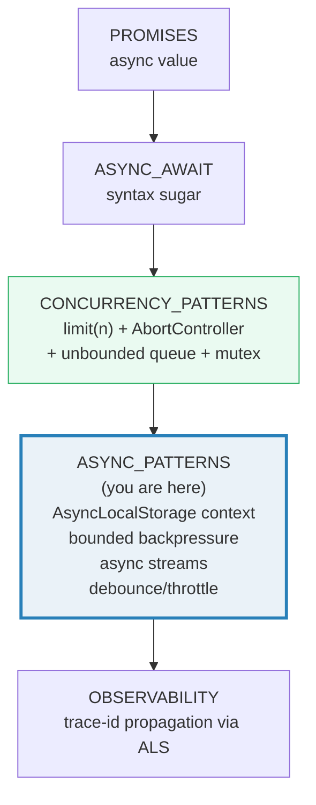
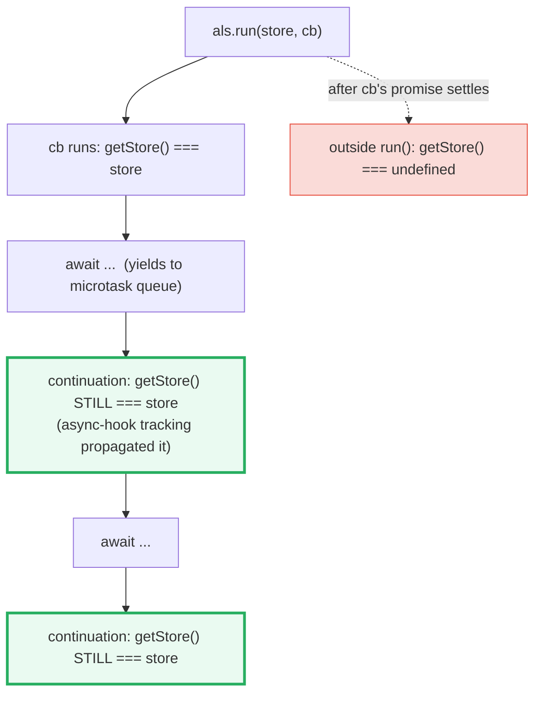

# ASYNC_PATTERNS — AsyncLocalStorage, Backpressure, Streams, Debounce/Throttle

> **Goal (one line):** show, by printing every value, the async *patterns* real
> apps compose on top of raw promises — **AsyncLocalStorage** (request-scoped
> context that propagates across `await` *without* a parameter, the JS analog of
> Go's `context.Context`), a **bounded backpressure queue**, **async iterables as
> streams**, **EventEmitter fan-out**, a **bounded worker pool**, **debounce/throttle**,
> and an **async mutex** — all deterministic (step-counts not ms; sorted parallel
> output).
>
> **Run:** `just run async_patterns`
>
> **Ground truth:** [`web/async_patterns.ts`](./web/async_patterns.ts) → captured
> stdout in
> [`web/async_patterns_output.txt`](./web/async_patterns_output.txt). Every
> number/ordering below is pasted **verbatim** from that file under a
> `> From async_patterns.ts Section X:` callout. Nothing is hand-computed.
>
> **Prerequisites:**
> - 🔗 [`PROMISES`](./PROMISES.md) — a Promise is an async *value* (the building block).
> - 🔗 [`ASYNC_AWAIT`](./ASYNC_AWAIT.md) — the syntax layer (`await` resumes as a microtask).
> - 🔗 [`CONCURRENCY_PATTERNS`](./CONCURRENCY_PATTERNS.md) — owns the *basics* this
>   builds on: the `limit(n)` pool, `AbortController`, an **unbounded** queue, a
>   mutex, and retry. Read it first.

---

## 1. Why this bundle exists (lineage)

`PROMISES` showed that a Promise is a one-way state machine; `ASYNC_AWAIT` made
it read like straight-line code; `CONCURRENCY_PATTERNS` owned the control-flow
basics (bounded parallelism, cancellation, an unbounded queue, a mutex). **This
bundle is the production-async layer built on top of all three.** Real servers
need more than "await a fetch": they need to carry a **request id** through a
deep call tree *without threading it through every signature*; they need a
**bounded queue** so a fast producer cannot drown a slow consumer; they need to
treat data as **async streams**; and they need to **coalesce** a burst of events.



The headline of this bundle — and the reason it sits in **Phase 7 (Async
Runtime, HTTP & Realtime)** — is **`AsyncLocalStorage`**. It is the JS analog of
Go's `context.Context`: a value you set once per request that every function in
the async call tree can read, *without* it being a parameter. The contrast with
Go is the whole point:

> 🔗 [`../go/CONTEXT.md`](../go/CONTEXT.md) — Go propagates request-scoped
> **values and cancellation** down a call tree by *explicitly passing*
> `ctx context.Context` as the first argument of every function. The compiler
> and the type system make that pleasant. JS has no such parameter convention,
> so the analog is **implicit**: `AsyncLocalStorage` tracks the async execution
> chain (via `node:async_hooks`) and hands you back the right store for the
> *current* async path — no parameter, yet safe under concurrency (unlike a
> global, which this bundle proves is broken).
>
> 🔗 [`../rust/async/TOKIO_CHANNELS.md`](../rust/async/TOKIO_CHANNELS.md) —
> Rust's `tokio::sync::mpsc` channel is the bounded-queue/**backpressure** analog
> of the `AsyncQueue` here: a bounded `mpsc` sender `await`s when the channel is
> full, exactly like our `push()` suspends the producer at capacity. JS rebuilds
> the same semantics from promises + arrays; Rust gets it from the runtime.

---

## 2. Section A — AsyncLocalStorage: request-scoped context across `await`

`AsyncLocalStorage` (from `node:async_hooks`, stable since Node 16.4) "creates
stores that stay coherent through asynchronous operations... similar to
thread-local storage in other languages." You call `als.run(store, callback)`:
the `store` is set for `callback` **and every async operation `callback`
starts** — including the continuations that run *after* an `await`. Outside
`run()`, `getStore()` returns `undefined`. Each instance is an independent
context; multiple instances never interfere.



> From `async_patterns.ts` Section A:
> ```
> AsyncLocalStorage — the store propagates across awaits, isolates outside run():
>   in run():       reqId=r-1
>   after await #1: reqId=r-1
>   after await #2: reqId=r-1
>   after run ret'd: reqId=undefined
> [check] ALS store is visible INSIDE run() (reqId === r-1): OK
> [check] ...and SURVIVES the first await (still r-1): OK
> [check] ...and SURVIVES the second await (still r-1): OK
> [check] ...and is undefined OUTSIDE run() (context exited): OK
> ```

**The payoff, stated plainly.** A function called deep inside an async chain
calls `als.getStore()` and gets *this request's* store — no `reqId` parameter on
any signature. The store is *not* a global: it is keyed to the async execution
path, so two concurrently-interleaved requests each see their own.

### The "lost context" problem ALS solves

Without ALS you have two bad options. (1) **Thread the id through every function
signature** — the old way; it works but pollutes every signature and is viral
across every helper. (2) **Stash it in a module global** — which is *unsafe
under concurrency*: two requests share the one global, so after an `await` (where
the event loop can switch to the other request) request A may read request B's
id. This bundle reproduces the bug deterministically:

> From `async_patterns.ts` Section A:
> ```
> The LOST-CONTEXT problem — a plain GLOBAL is clobbered under concurrency:
>   request A saw globalReqId=B
>   request B saw globalReqId=B
> [check] GLOBAL context is UNSAFE: request A saw request B's id (clobbered at the await): OK
> ```

`handleGlobal("A")` sets `globalReqId = "A"`, then `await`s (yielding the event
loop). `handleGlobal("B")` runs, overwrites `globalReqId = "B"`. When A resumes,
it reads `globalReqId` and sees **B** — silent cross-request contamination. This
is the *exact* bug class globals create in a single-threaded-but-async runtime:
there is no true parallelism, but there is **interleaving at every `await`**.

ALS fixes it — each request gets an isolated store keyed to its own async path:

> From `async_patterns.ts` Section A:
> ```
> AsyncLocalStorage FIX — each request sees its OWN id (no clobbering):
>   request A saw ALS store=A
>   request B saw ALS store=B
> [check] ALS is SAFE: request A saw its OWN id (A): OK
> [check] ...and request B saw its OWN id (B): OK
> ```

The same `Promise.all` interleaving, but now A reads A and B reads B. **Implicit
like a global, safe like a parameter** — that is the whole value proposition.

> 🔗 [`OBSERVABILITY`](./OBSERVABILITY.md) (P7) — this is exactly how a
> request-scoped **trace id / correlation id** reaches the logger deep in the
> call tree without being a logging argument. ALS is the transport for
> OpenTelemetry-style context propagation in Node.

---

## 3. Section B — Bounded queue with backpressure + async iterables as streams

### Async iterables as streams

`for await...of` consumes an **async iterable**: an object with a
`[Symbol.asyncIterator]()` method returning an object whose `next()` returns a
`Promise<IteratorResult<T>>` (`{ value, done }`). The easiest way to make one is
an **async generator** (`async function*`), where `yield` may appear after an
`await`:

> From `async_patterns.ts` Section B:
> ```
> for-await over an async generator (async function*):
>   for await (v of numberStream(4)) -> [10,20,30,40]
> [check] async generator yields values via for-await ([10,20,30,40]): OK
> ```

The protocol is **duck-typed** — you can implement `[Symbol.asyncIterator]`
yourself. `for await` looks up that symbol, calls it once, then repeatedly
`.next()`s until `done: true`:

> From `async_patterns.ts` Section B:
> ```
> duck-typed async iterable ([Symbol.asyncIterator]() -> .next()):
>   for await (v of rangeAsync(5,7)) -> [5,6,7]
> [check] custom async iterable yields [5,6,7]: OK
> ```

> 🔗 [`ITERATORS_GENERATORS`](./ITERATORS_GENERATORS.md) — owns the **sync**
> iterator protocol (`[Symbol.iterator]` / `.next()` / `function*`). This bundle
> is the **async** half: same protocol shape, but `next()` returns a Promise and
> the generator may `yield` after an `await`. (Node's streams are async iterables
> too — `for await (const chunk of readable)` — see 🔗 `STREAMS`.)

### Bounded queue with backpressure

🔗 `CONCURRENCY_PATTERNS` built an **unbounded** async queue. Here we add the
**high-water-mark gate**: a `BoundedQueue(capacity)` whose `push()` **awaits**
when the buffer is full, suspending the producer until a consumer drains a slot.
This is **backpressure** — the slow consumer pushes back on the fast producer
instead of letting an unbounded buffer eat memory:

```mermaid
graph LR
    P["PRODUCER<br/>push(v)"] -->|buffer < capacity| B["BUFFER<br/>[a, b]"]
    P -->|buffer FULL -> AWAITS<br/>(backpressure)| W["pushWaiters"]
    B -->|next()| C["CONSUMER<br/>drains head"]
    C -->|frees a slot| R["resume pushWaiter<br/>(producer unblocks)"]
    W -.->|slot freed| R
    style P fill:#fef9e7,stroke:#f1c40f
    style W fill:#fadbd8,stroke:#e74c3c,stroke-width:3px
    style B fill:#eaf2f8,stroke:#2980b9
```

> From `async_patterns.ts` Section B:
> ```
> Bounded queue (capacity 2) — producer SUSPENDS when the buffer is full:
>   push('a'), push('b') buffer it; push('c') on a FULL queue -> promise PENDING (backpressure)
> [check] push() on a FULL bounded queue is BLOCKED (promise still pending): OK
> [check] ...buffer held at capacity 2 while the producer waits: OK
> [check] next() returns the head FIFO ('a'): OK
> [check] ...freeing a slot RESOLVES the blocked producer: OK
> [check] consumer receives items IN ORDER [a,b,c]: OK
>   consumed in order -> [a,b,c]
> ```

**How the block is observed deterministically.** `push("c")` on a full buffer
returns a *pending* promise (the producer is parked on a `pushWaiters` resolver).
We attach `.then(() => probe.resolved = true)` and flush one microtask round
(`await tick()`): the probe is still `false` — the producer is genuinely
suspended. Then `next()` drains `"a"`, which frees a slot and resolves the
parked producer; after one more tick the probe flips to `true` and `"c"` lands in
the buffer. Order is preserved FIFO: `[a, b, c]`. No real timers are used — the
whole sequence is driven by microtask rounds so the output is byte-identical.

---

## 4. Section C — EventEmitter fan-out (recap) + bounded worker pool draining a queue

### EventEmitter fan-out (recap)

🔗 `CONCURRENCY_PATTERNS` owns the deep EventEmitter treatment (synchronous
dispatch, the throw-skips-rest trap, the listener-leak/GC trap). This is the
recap: `emit()` dispatches to **every** registered listener **synchronously**, in
**registration order**, *during* the `emit()` call:

> From `async_patterns.ts` Section C:
> ```
> EventEmitter fan-out — one emit, all listeners fire SYNCHRONOUSLY:
>   on('evt',L1); on('evt',L2); on('evt',L3); emit('evt') -> [L1,L2,L3]
> [check] EventEmitter fan-out: 3 listeners fire on one emit: OK
> [check] ...listeners fire in REGISTRATION order (L1,L2,L3): OK
> [check] emit() is synchronous — hits filled BEFORE the next line: OK
> [check] once() fires exactly once across two emits: OK
> [check] once() auto-removes its listener (listenerCount === 0 after firing): OK
> [check] removeAllListeners() clears every event (listenerCount('evt') === 0): OK
> ```

`once()` registers a wrapper that fires and then **auto-removes itself** — the
one-shot pattern. `removeAllListeners()` clears everything (this bundle calls it
before every section returns so no closure retains captured state — the
determinism/cleanup contract).

### Bounded worker pool draining a queue

Compose `limit(n)` (🔗 `CONCURRENCY_PATTERNS`) with the queue: spawn `n`
**workers**, each looping `await queue.next()` until the queue closes (a sentinel
`undefined`). This is a bounded worker pool draining a shared queue — the Node
analog of a fixed goroutine/`tokio` task pool reading from an `mpsc` channel:

> From `async_patterns.ts` Section C:
> ```
> Bounded worker pool (limit 2) draining a 6-item queue:
>   consumed (sorted) -> [a,b,c,d,e,f]
>   max in-flight     -> 2
> [check] pool drained all 6 items: OK
> [check] pool respected the concurrency limit (max in-flight === 2): OK
> [check] ...and consumed every item exactly once (no drops, no dups): OK
> ```

**Why `max in-flight === 2` is deterministic.** Each worker is an async function
that pulls an item (synchronous against the buffered queue), increments `active`,
then `await tick()` — *that* yield is where the second worker gets to pull.
Because JS is single-threaded and only interleaves at `await`, the
`active++`/`active--` pairs are atomic within a sync section, so the observed
`maxInFlight` is exactly the worker count. The consumed items are **sorted**
before printing (per the determinism rules) even though pull order is already
stable, so output never depends on scheduler ticks.

---

## 5. Section D — Debounce/throttle (coalesce/rate-limit) + async mutex

### Debounce vs throttle (driven by a deterministic virtual clock)

**Debounce** coalesces a burst of calls into **one** call fired `wait` after the
*last* call (each call cancels the previous pending timer). **Throttle** enforces
a maximum rate: fire on the **leading edge**, then at most once per `wait`
window (a **trailing** call carries the last argument of the burst). MDN:
*"throttling enforces limits on continuous operations, while debouncing waits for
a pause."*

These are *timing* functions normally built on `setTimeout`. To keep output
byte-identical this bundle drives them with a **`VirtualClock`** — no real timers,
just an advanceable counter — so the call counts are pinned exactly:

> From `async_patterns.ts` Section D:
> ```
> [check] debounce: a burst fires NOTHING before the quiet window elapses: OK
> [check] debounce: after the quiet window, exactly ONE call fires (coalesced): OK
> [check] ...and it fires with the LAST argument (3): OK
> Debounce (wait 100) — a burst of 3 coalesces into 1 trailing call:
>   d(1);d(2);d(3); advance(99) -> 0 call(s); advance(1) -> fired with 3 (total 1)
> [check] throttle: leading edge fired immediately (1 call so far, arg 1): OK
> [check] throttle: after the window, a trailing call fires (total 2): OK
> [check] ...trailing fires with the LAST argument of the burst (4): OK
> ```

**Read the two traces together.** Debounce: 3 calls in a burst → after 99ms
nothing, after 100ms **one** call with the last arg `3`. Throttle: 4 calls
spread across a window → the **first** fires immediately (leading, arg `1`),
then exactly **one** trailing call at the window boundary with the last arg `4`
→ **2 calls total**. That 1-vs-2 difference *is* the debounce/throttle
distinction, pinned deterministically.

### Async mutex (serialize async sections)

🔗 `CONCURRENCY_PATTERNS` introduced the async mutex; this bundle re-pins its
core guarantee. JS is single-threaded, so **synchronous** sections never overlap
— but **async** sections (functions that `await` in the middle) *can* interleave
at each `await`. A mutex makes a critical section non-overlapping across awaits:

> From `async_patterns.ts` Section D:
> ```
> Async mutex — two async sections run NON-overlapping (serialized):
>   trace -> [A-enter,A-exit,B-enter,B-exit]
> [check] mutex serializes: A finishes before B starts (no overlap): OK
> ```

Without the mutex, the trace would be `[A-enter, B-enter, A-exit, B-exit]` — both
*inside* the critical section at once (B entered during A's `await`). The mutex
parks B until A releases, yielding the strictly-serialized trace above.

---

## 6. Section E — Composing the patterns: ALS context across a concurrent pool

The composition that makes ALS worth it in production: a **request-scoped id**
set once in `als.run()` is visible inside **concurrent pool workers** — even
though each worker `await`s and interleaves with the others. No parameter
threading; the context rides the async-hook chain into every worker:

> From `async_patterns.ts` Section E:
> ```
> ALS store visible inside concurrent pool workers (no parameter threading):
>   worker t1:req-7
>   worker t2:req-7
>   worker t3:req-7
>   worker t4:req-7
>   worker t5:req-7
> [check] every pool worker saw the request-scoped ALS id (req-7): OK
> [check] ALS store is undefined OUTSIDE run() (context isolated): OK
> ```

This is precisely how a request-scoped logger or tracer reaches the worker tier
of a server: wrap the request handler in `als.run(traceId, ...)`, and every
`log()` call inside any concurrent task reads the right id. Compare to Go, where
the same effect is achieved by passing `ctx` explicitly to each spawned
goroutine.

---

## 7. Pitfalls (the expert payoff)

| Trap | Symptom | Fix |
|---|---|---|
| Using a **module global** for request context | After an `await`, request A reads request B's id (interleaving clobber) | Use `AsyncLocalStorage` (keyed to the async path, isolated per request). Globals break under async interleaving. |
| `getStore()` returns `undefined` unexpectedly | Code inside a callback/promise chain sees no store | The chain was started *outside* `run()` (or across a callback boundary ALS can't track — promisify callback APIs, or use `AsyncResource.bind`). |
| `enterWith()` leaks the store | A store set in one event handler bleeds into later handlers | Prefer `run(store, cb)` (auto-exits). `enterWith()` persists for the rest of the sync execution — a known footgun. |
| Unbounded async queue under a fast producer | Memory grows without limit; latency climbs | Use a **bounded** queue (`capacity`) so `push()` awaits — backpressure. |
| Forgetting `removeAllListeners` / `clearTimeout` | Listeners/timers (and their captured closures) outlive the request → leak | Always clean up before exit; or unregister via `off()`/`AbortSignal`. |
| `for await` over a **shared** async generator | One consumer exhausts it; the other sees nothing (or `TypeError: Generator is already running`) | Give each consumer its own generator, or drain via a queue whose `next()` is safe to call concurrently. |
| Treating throttle as debounce | A burst fires many times instead of once | Debounce = 1 call *after* the burst; throttle = ≤1 call *per window* during the burst. |
| Debounce with **no trailing edge** | The call that started the burst never fires (last-wins only) | Choose leading-and-trailing if the first/each call must run; pure trailing debounce drops everything but the last. |
| Assuming an async mutex is "like a thread mutex" | Over-locking serializes work that could overlap | JS needs a mutex only across **async** sections (interleave at `await`). Sync sections are already atomic — don't lock what can't interleave. |
| `emit()` in the middle of `run()` | Listeners run in a *different* execution context than `on()` | Bind the listener with `AsyncResource.bind(fn)` so it runs in the registration context (per Node docs). |
| Mutating the ALS store object from two async paths | The store is shared by reference within one `run()`; concurrent mutations race | Treat the store as read-mostly; use immutable updates or per-branch copies if a path mutates it. |

---

## 8. Cheat sheet

```typescript
// === AsyncLocalStorage (node:async_hooks) — request-scoped context ==========
//   import { AsyncLocalStorage } from "node:async_hooks";
//   const als = new AsyncLocalStorage<Map<string,string>>();
//   als.run(new Map([["reqId","r-1"]]), () => {        // set store for cb + its async ops
//     als.getStore()?.get("reqId");                     // "r-1"  — even after awaits
//   });
//   als.getStore();                                     // undefined — outside run()
//   // WHY: implicit like a global, SAFE under concurrency (unlike a global).
//   // ⟷ Go context.Context (explicit param) ; feeds OBSERVABILITY trace ids.

// === Bounded queue with backpressure (producer awaits when full) ============
//   class AsyncQueue<T> {
//     constructor(private capacity = Infinity) {}
//     async push(v) { /* awaits when buffered.length >= capacity */ }
//     async next(): Promise<T|undefined> { /* awaits when empty; undefined when closed */ }
//     close() { /* resolves waiting consumers with undefined (sentinel) */ }
//   }

// === Async iterables as streams =============================================
//   async function* gen() { await tick(); yield 1; }    // async generator
//   for await (const v of gen()) { ... }                // for-await consumes it
//   // protocol: [Symbol.asyncIterator]() -> { next(): Promise<{value,done}> }

// === EventEmitter fan-out (SYNCHRONOUS dispatch) ============================
//   ee.on("e", cb);  ee.emit("e", ...arg);   // every listener fires, in order, DURING emit
//   ee.once("e", cb);                          // fires once, auto-removes
//   ee.removeAllListeners("e");                // cleanup (avoid listener/closure leaks)

// === Bounded worker pool draining a queue ===================================
//   async function drain(q, limit, process) {
//     // spawn `limit` workers, each: while ((x = await q.next()) !== undefined) await process(x);
//   }

// === Debounce (coalesce) vs Throttle (rate-limit) ===========================
//   debounce(fn, wait): burst -> 1 call, `wait` after the LAST call (each cancels prior)
//   throttle(fn, wait): leading call now + ≤1 trailing call per window (carries last arg)
//   // MDN: "throttling enforces limits on continuous ops; debouncing waits for a pause."

// === Async mutex (serialize async sections) =================================
//   const m = new AsyncMutex();
//   await m.run(async () => { /* critical section — no two overlap across awaits */ });
//   // JS is single-threaded: SYNC sections can't interleave; only ASYNC ones can.
```

---

## Sources

Every signature, behavioral claim, and API description above was verified
against the primary documentation and corroborated by at least one independent
secondary source. Every invariant is *additionally* asserted at runtime by the
`.ts` itself (`check()` throws on any mismatch) — the strongest possible
verification: the actual V8/Node engine's verdict.

- **Node.js — Asynchronous context tracking (`AsyncLocalStorage`)** (the
  canonical reference; *"creates stores that stay coherent through asynchronous
  operations... similar to thread-local storage in other languages"*;
  `run(store, callback)` — *"The store is accessible to any asynchronous
  operations created within the callback"*; `getStore()` returns `undefined`
  outside a `run()`/`enterWith()`; the request-id HTTP example; "Usage with
  `async/await`"; `enterWith()` leak warning; `EventEmitter` context mismatch
  note):
  https://nodejs.org/api/async_context.html
- **Node.js — `node:async_hooks`** (the lower-level primitive `AsyncLocalStorage`
  is built on; `AsyncResource.bind` for restoring context across callbacks):
  https://nodejs.org/api/async_hooks.html
- **Node.js — Events (`EventEmitter`)** (`emit` *"synchronously calls"* every
  listener in registration order; `once` fires then removes; `removeListener`/
  `off`/`removeAllListeners`; the `MaxListenersExceededWarning`; listener-leak
  behavior): https://nodejs.org/api/events.html
- **Node.js — Timers** (`setTimeout`/`clearTimeout`, the basis debounce/throttle
  are normally built on — this bundle replaces them with a deterministic
  `VirtualClock` for byte-identical output):
  https://nodejs.org/api/timers.html
- **MDN — `for await...of`** (iterates async iterables; *"gets the iterable's
  `[Symbol.asyncIterator]()` method and calls it"*; works on sync iterables too):
  https://developer.mozilla.org/en-US/docs/Web/JavaScript/Reference/Statements/for-await...of
- **MDN — `Symbol.asyncIterator`** (the async-iterable protocol lookup; an object
  must define this to be consumed by `for await...of`):
  https://developer.mozilla.org/en-US/docs/Web/JavaScript/Reference/Global_Objects/Symbol/asyncIterator
- **MDN — Iteration protocols** (the duck-typed iterator/async-iterator contract:
  `.next()` → `{value, done}`; the sync side is `Iterator`, the async side
  `AsyncIterator`): https://developer.mozilla.org/en-US/docs/Web/JavaScript/Reference/Iteration_protocols
- **MDN — Glossary: Debounce** (*"The key difference is that throttling enforces
  limits on continuous operations, while debouncing waits for a pause"*);
  **Glossary: Throttle**: https://developer.mozilla.org/en-US/docs/Glossary/Debounce
- **MDN — `AbortController`** (the cancellation primitive composed with these
  patterns in 🔗 `CONCURRENCY_PATTERNS`; `signal.aborted`, the `'abort'` event,
  `AbortSignal.any`/`AbortSignal.timeout`):
  https://developer.mozilla.org/en-US/docs/Web/API/AbortController

**Secondary corroboration (independent of the primary docs, ≥1 per major claim):**
- NestJS docs — *"AsyncLocalStorage... an alternative way of propagating local
  state through the application"* (the request-context use case):
  https://docs.nestjs.com/recipes/async-local-storage
- javascript.info — *"Async iteration and generators"* (`for await...of` over an
  async generator; the `Symbol.asyncIterator` protocol step-by-step):
  https://javascript.info/async-iterators-generators
- CSS-Tricks — *"Debouncing and Throttling Explained Through Examples"* (the
  debounce-vs-throttle distinction with visual timelines):
  https://css-tricks.com/debouncing-throttling-explained-examples/
- Stack Overflow — *"Difference between throttling and debouncing"* (*"throttle
  guarantees the execution of the function regularly, at least every X ms"*):
  https://stackoverflow.com/questions/25991367/difference-between-throttling-and-debouncing-a-function

**Cross-language primary docs (the analogs cited above):**
- Go — `context.Context` (explicit request-scoped values + cancellation passed as
  the first param): https://pkg.go.dev/context — see [`../go/CONTEXT.md`](../go/CONTEXT.md).
- Rust — `tokio::sync::mpsc` (bounded channel; the sender `await`s when full =
  backpressure): https://docs.rs/tokio/latest/tokio/sync/mpsc — see
  [`../rust/async/TOKIO_CHANNELS.md`](../rust/async/TOKIO_CHANNELS.md).

**Facts that could not be verified by running** (documented, not executed,
because they are runtime-internals or platform behavior): the precise async-hook
tracking mechanism Node uses to propagate the store across an `await` (the
`init`/`before`/`after`/`destroy` hooks and the async-id parent chain) is
described in the `node:async_hooks` docs and confirmed by the propagation
assertions in Section A (the store *is* visible after each `await` — the engine's
own verdict). The HTTP request-id example output is quoted verbatim from the
Node docs (not run here, since this bundle is offline/stdlib-only); the behavior
it demonstrates is reproduced synthetically by Section A's interleaving test.
