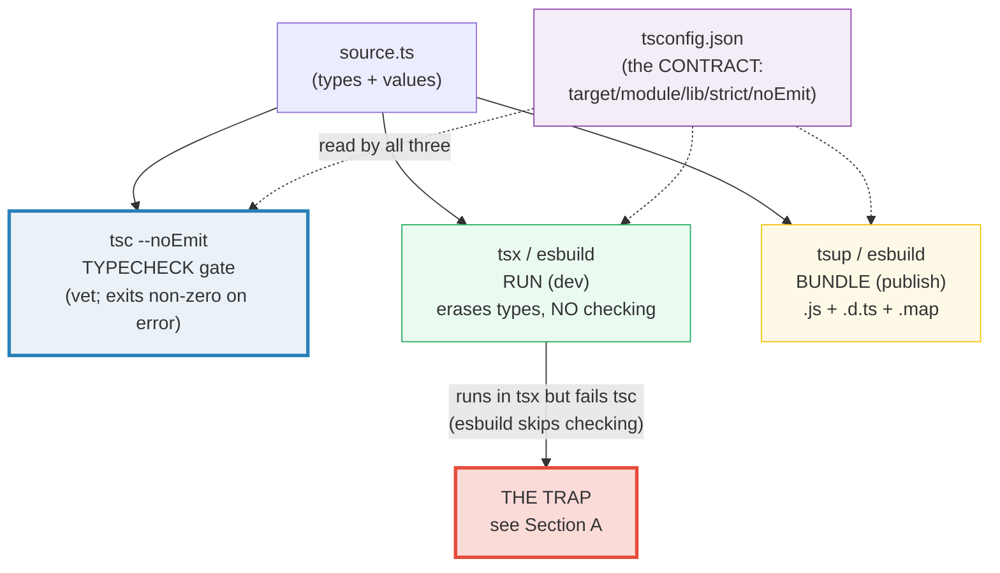

# BUILD_TOOLING — The Toolchain Split: `tsc` (check) vs `tsx`/`esbuild` (run) vs `tsup` (bundle)

> **Goal (one line):** show, by reading the repo's own `tsconfig.base.json` +
> `metaprog/tsconfig.json` via `node:fs` and asserting their parsed values, how
> the TypeScript toolchain splits into three roles — `tsc` (typecheck/emit),
> `tsx`/`esbuild` (run/erase types), and `tsup`/`esbuild` (bundle) — and why the
> `tsconfig.json` is the build **contract** all three honor.
>
> **Run:** `just run build_tooling`
>
> **Ground truth:** [`metaprog/build_tooling.ts`](./metaprog/build_tooling.ts)
> → captured stdout in
> [`metaprog/build_tooling_output.txt`](./metaprog/build_tooling_output.txt).
> Every config value/table below is pasted **verbatim** from that file under a
> `> From build_tooling.ts Section X:` callout. Nothing is hand-computed.
>
> **Prerequisites:** 🔗 [`MODULES_PACKAGES`](./MODULES_PACKAGES.md) (ESM/CJS and
> `moduleResolution` — this bundle depends on `import.meta.url` and per-file
> ESM/CJS detection) and 🔗 [`VALUES_TYPES_COERCION`](./VALUES_TYPES_COERCION.md)
> (the 8 `typeof` strings — type erasure means runtime `typeof` is the only type
> info that survives). This is **Phase 6** (member: `metaprog`).

---

## 1. Why this bundle exists (lineage)

The TypeScript toolchain has **split roles**, and that split is the single
biggest source of beginner confusion ("my code runs in `tsx` but fails `tsc`").
Three tools, three jobs, one contract:

- **`tsc` TYPECHECKS.** `tsc --noEmit` emits nothing and exits non-zero on any
  type error — it is the **"vet" gate**. `tsc` (with emit) is also the
  **compiler** that can write `.js` + `.d.ts`. `tsc --build` drives **project
  references**. *Only `tsc` understands the full type system.*
- **`tsx` / `esbuild` RUN.** They execute `.ts` directly by **erasing types via
  esbuild WITHOUT type-checking** — annotations, interfaces, generics, type
  aliases are stripped in-memory at high speed, leaving a plain JS program. No
  `.js` artifact is left behind. This is why `just run name` is a single command
  (the analog of `go run`), and why a program can **run happily in `tsx` yet
  fail `tsc`** — esbuild never looked at the types.
- **`tsup` / `esbuild` BUNDLE.** For publish: emit `dist/<name>.js` (erased +
  bundled) + `dist/<name>.d.ts` (declaration emit) + `dist/<name>.js.map`
  (sourcemap). `tsup` is esbuild-based, zero-config for libraries.

The **`tsconfig.json`** is the **build contract** that all three read: `target`
(JS syntax level), `module`/`moduleResolution` (module system + resolution),
`lib` (visible type definitions), `strict` + the `no*` family (type-checking
strictness), `noEmit`, `isolatedModules`, `verbatimModuleSyntax`. A member
`tsconfig.json` **`extends`** a shared base — inheritance with **overwrite (not
merge) semantics** for `files`/`include`/`exclude` and for array options like
`lib`/`types`/`paths`.



This bundle is the **cross-language analog** of the same build-config problem
solved in two sibling ecosystems:

> 🔗 [`../rust/BUILD_CONFIG.md`](../rust/BUILD_CONFIG.md) — Rust splits the build
> across **`build.rs`** (a build script that GENERATES code into `OUT_DIR` at
> compile time) and **Cargo** (profiles, features, `cargo build`/`check`/`test`).
> Where TS splits **check vs run vs bundle**, Rust splits **codegen vs compile vs
> check**. The shared idea: the build is itself a program, configured by a
> declarative contract (`tsconfig.json` ↔ `Cargo.toml`) plus an escape hatch
> (`tsc` flags / `as` ↔ `build.rs`).
>
> 🔗 [`../go/BUILD_LDFLAGS_GENERATE.md`](../go/BUILD_LDFLAGS_GENERATE.md) — Go
> splits the build across **`//go:build` constraints** (select files at compile
> time), **`-ldflags -X`** (rewrite a string var at link time), `GOOS`/`GOARCH`
> (cross-compile), and **`//go:generate`** (drive external codegen). Go's tool is
> one binary (`go`); TS's are three (`tsc`/`tsx`/`tsup`) — but the *problem* (how
> does a declarative config + a few tools shape the artifact?) is identical.

---

## 2. The mental model: type erasure, and the three roles (Section A)

TypeScript's static layer — annotations, `interface`, `type`, generics — is
**erased at runtime**. `tsx`/`esbuild` strip it; `tsc` emits without it. What
survives is a plain JavaScript program, and the only type information the runtime
has is what `typeof` / `instanceof` (runtime operators) can see. This is
**observable**, and the `.ts` proves it: a value typed `: number` is just a
number at runtime; an `interface User` leaves **no runtime trace**.

> From `esbuild.github.io/api/#transform` (the canonical type-stripping demo,
> verbatim): the input `'let x: number = 1'` with `loader: 'ts'` produces the
> output `let x = 1;` — the `: number` annotation is gone, and esbuild performed
> **no type-checking** to get there. (esbuild's TypeScript content-type page:
> *"esbuild does not do any type checking… the TypeScript type system is too
> complex to be implemented faithfully by a fast compiler."* — you must run
> `tsc` separately for that.)

**The "runs in tsx but fails tsc" trap**, demonstrated WITHOUT writing broken
code (the `.ts` keeps itself type-clean by routing the runtime observation
through `unknown`, so `tsc` cannot const-fold it):

> From build_tooling.ts Section A:
> ```
> Type-erasure proof (run via tsx = esbuild strips types):
>   const answer: number = 42   -> typeof answer = number
>   const u:      User     = {} -> typeof u      = object   (interface User is GONE)
>   const a:      Alias    = {} -> typeof a      = object   (type Alias is GONE)
>   There is no "number"/"User"/"Alias" string at runtime — typeof
>   returns one of the 8 JS runtime strings only (see VALUES_TYPES_COERCION).
> [check] typeof answer === "number" (annotation erased, value remains): OK
> [check] typeof u === "object" (interface User leaves NO runtime trace): OK
> [check] typeof a === "object" (type Alias leaves NO runtime trace): OK
> ```
> ```
> The "runs in tsx but fails tsc" trap (mechanism):
>   const n: number = ("1" as number)  -> typeof n = string   value = "1"
>   tsx/esbuild RAN this (no type-check); tsc would REJECT `as number` from
>   string->number as unsound. THIS is why `just typecheck` is a separate gate.
> [check] tsx ran a string-as-number assignment (typeof n === "string", NOT number): OK
> [check] value survived as the string "1" (erasure keeps the value, drops the type): OK
> ```
> ```
> The three toolchain roles (tsc | tsx/esbuild | tsup):
>   tsc --noEmit        TYPECHECK gate (vet)        emits nothing; exits non-zero on error
>   tsx file.ts         RUN (dev)                   esbuild erases types in-memory; no .js
>   tsup / esbuild      BUNDLE (publish)           emits .js + .d.ts + .map to dist/
>   ONLY tsc checks types. tsx/esbuild ERASE types without checking.
> ```

**Why the trap is so easy to hit.** `tsx` runs your code instantly and silently
— it never tells you a type is wrong, because it never checks. A program full of
type errors runs "fine" under `tsx`; the errors only surface when you run
`tsc --noEmit` (or when a consumer's `tsc` reads your shipped `.d.ts`). This is
**exactly why the `Justfile` has a separate `just typecheck` gate** alongside
`just run` — and why `just check NAME` runs both. The discipline: **`tsx` is for
iteration speed; `tsc` is the merge gate. Never ship without the gate.**

**Why the `as number` routing through `unknown` matters here.** Notice the `.ts`
writes `const nType: unknown = typeof n` rather than `typeof n === "string"`
directly. Direct comparison would make `tsc` flag **TS2367** ("comparison
appears unintentional because `number` and `string` have no overlap") — because
`tsc` *trusts the declared type* (`n: number`) and const-folds `typeof n` to the
literal `"number"`. Routing through `unknown` defeats that narrowing, so the
runtime observation (the value is actually a string) is visible. That single
mechanical difference *is* the entire check-vs-erase split in miniature.

> 🔗 [`VALUES_TYPES_COERCION`](./VALUES_TYPES_COERCION.md) §2 — `typeof` is a
> **runtime** operator returning one of exactly 8 strings. This bundle leans on
> that fact: because types are erased, `typeof` is the *only* type information
> that survives to runtime. `interface`/`type` annotations do not.

---

## 3. Section B — `tsconfig.json` is the build contract (read & assert)

The base `tsconfig.base.json` is **read via `node:fs` and parsed** — every option
below is a deterministic read of a static file, then asserted. (This bundle
deliberately does **not** spawn `tsc`/`tsup`: their output would be
version-dependent and nondeterministic. The config values are the stable facts.)

> From build_tooling.ts Section B:
> ```
> Read: /Volumes/data/workspace/tutorials/ts/tsconfig.base.json  (the repo's shared base, read via node:fs)
> Parsed compilerOptions (the CONTRACT every member inherits):
>   target                 = "ES2023"
> [check] base.target === "ES2023": OK
>   module                 = "NodeNext"
>   moduleResolution       = "NodeNext"
> [check] base.module === "NodeNext": OK
> [check] base.moduleResolution === "NodeNext": OK
>   lib                    = ["ES2023"]
> [check] base.lib[0] === "ES2023": OK
>   types                  = ["node"]
> [check] base.types includes "node": OK
>   strict                 = true
>   noUncheckedIndexedAccess = true
>   exactOptionalPropertyTypes = true
>   noImplicitOverride     = true
>   noFallthroughCasesInSwitch = true
>   noImplicitReturns      = true
>   noUnusedLocals         = true
>   noUnusedParameters     = true
> [check] base.strict === true: OK
> [check] base.noUncheckedIndexedAccess === true: OK
> [check] base.exactOptionalPropertyTypes === true: OK
> [check] base.noImplicitOverride === true: OK
> [check] base.noFallthroughCasesInSwitch === true: OK
> [check] base.noImplicitReturns === true: OK
> [check] base.noUnusedLocals === true: OK
> [check] base.noUnusedParameters === true: OK
>   esModuleInterop        = true
>   forceConsistentCasingInFileNames = true
>   skipLibCheck           = true
>   isolatedModules        = true
>   verbatimModuleSyntax   = false
>   noEmit                 = true
> [check] base.esModuleInterop === true: OK
> [check] base.forceConsistentCasingInFileNames === true: OK
> [check] base.skipLibCheck === true: OK
> [check] base.isolatedModules === true: OK
> [check] base.verbatimModuleSyntax === false (type imports auto-elided): OK
> [check] base.noEmit === true (tsc is a TYPECHECK gate, not an emitter): OK
> ```

**The contract, annotated (what each option enforces):**

| Option | Value | Why it matters |
|---|---|---|
| `target` | `ES2023` | The JS **syntax level** `tsc` emits/down-levels to. `esbuild` honors a separate `--target`, but here matches. |
| `module` / `moduleResolution` | `NodeNext` | Modern: ESM/CJS decided **per-file** via `package.json` `"type"`; bare-specifier resolution follows Node's algorithm. (🔗 `MODULES_PACKAGES`.) |
| `lib` | `["ES2023"]` | Which **type definitions** (`Array`, `Promise`, etc.) are visible. `target` without `lib` still works, but `lib` pins the *type* surface independently of emit. |
| `types` | `["node"]` | Only `@types/node` is auto-included (not every `@types/*` under `node_modules/@types`). |
| `strict` | `true` | Enables the **strict family**: `strictNullChecks`, `noImplicitAny`, `strictFunctionTypes`, `strictPropertyInitialization`, `useUnknownInCatchVariables`, … |
| `noUncheckedIndexedAccess` | `true` | `arr[i]` / `obj[key]` becomes `T \| undefined` — forces you to narrow. (This is why the `.ts` guards `lib[0]`.) |
| `exactOptionalPropertyTypes` | `true` | `prop?: T` may be **omitted or `T`**, but NOT explicitly set to `undefined`. |
| `noImplicitReturns` | `true` | Every code path in a function must `return` (or none). |
| `noUnusedLocals` / `noUnusedParameters` | `true` | Unused vars/params are errors (the `.ts` has none). |
| `isolatedModules` | `true` | Each file must transform **standalone** (per-file esbuild); you cannot re-export a bare type with `export { T }` — use `export type { T }`. |
| `verbatimModuleSyntax` | `false` | `tsc` may **auto-elide** imports it sees are type-only. If `true`, you'd be FORCED to write `import type { T }` everywhere. |
| `noEmit` | `true` | **The headline:** `tsc` here is a pure **typecheck gate**, never an emitter. Emission is the bundler's job (Section D). |

> From `typescriptlang.org/tsconfig/` (TSConfig Reference, verbatim): the
> `strict` flag *"enables a wide range of type checking behavior that results in
> stronger guarantees… equivalent to enabling all of the strict mode family
> options."* `noUncheckedIndexedAccess`: *"will add `undefined` to any
> un-declared field in the type"* (and to every indexed access).
> `noImplicitReturns`: *"TypeScript will check all code paths in a function to
> ensure they return a value."*

**`noEmit: true` is the architectural keystone.** It makes `tsc` a **vet**, not
a compiler — there is no `tsc` step that produces `.js` anywhere in this repo's
build. Running is `tsx` (erase + run, no artifact); publishing is `tsup`
(erase + bundle). `tsc` only ever says "yes the types check" or "no, here are
the errors." That is why `just typecheck NAME` is a pure gate.

---

## 4. Section C — `extends` inheritance, `moduleResolution`, `isolatedModules`, type imports

A member `tsconfig.json` **`extends`** the base. The inheritance has a sharp
edge: **arrays are REPLACED, not merged.** The member re-declares `lib` (adding
`ESNext.decorators` for Phase 6 decorators) and MUST repeat `ES2023`, or the
base `lib` is silently dropped.

> From `typescriptlang.org/tsconfig/#extends` (verbatim): *"The configuration
> from the base file are loaded first, then overridden by those in the
> inheriting config file… It's worth noting that `files`, `include`, and
> `exclude` from the inheriting config file **overwrite** those from the base
> config file."* For array-valued `compilerOptions` (`lib`, `types`, `paths`),
> the child array **replaces** the parent array entirely (no concatenation) —
> corroborated by independent secondary sources.

> From build_tooling.ts Section C:
> ```
> Read: /Volumes/data/workspace/tutorials/ts/metaprog/tsconfig.json  (this member's tsconfig, read via node:fs)
>   extends                = "../tsconfig.base.json"
>   include                = ["*.ts"]
>   compilerOptions.types  = ["node"]
>   compilerOptions.lib    = ["ES2023","ESNext.decorators"]
> [check] member.extends === "../tsconfig.base.json" (inheritance link): OK
> [check] member.include === ["*.ts"]: OK
> ```
> ```
> extends inheritance proof (read both files, reason about the merge):
>   member redeclares strict? false   (absent => inherits base)
>   base.strict === true?    true   (=> effective member strict === true)
> [check] member does NOT redeclare strict (inherits base via extends): OK
> [check] base.strict === true (so the member's effective strict === true): OK
> ```
> ```
> lib is REPLACED (not merged) under extends — the member repeats ES2023:
>   member.lib includes "ES2023"?           true   (re-declared, else lost)
>   member.lib includes "ESNext.decorators"? true   (Phase 6 metaprog needs it)
> [check] member.lib re-declares "ES2023" (else extends would DROP it): OK
> [check] member.lib adds "ESNext.decorators" (for TC39 decorators): OK
> ```
> ```
> moduleResolution NodeNext (modern; per-file ESM/CJS via package.json):
>   effective moduleResolution = "NodeNext"
>   metaprog/package.json "type": "module" => this file is ESM =>
>   import.meta.url is available (used above to resolve the config paths).
> [check] effective moduleResolution === "NodeNext": OK
> ```
> ```
> isolatedModules + verbatimModuleSyntax (the erasure-safety pair):
>   isolatedModules: true   -> each file must transform standalone (per-file esbuild)
>   verbatimModuleSyntax: false  -> tsc auto-elides type-only imports (no forced `import type`)
> [check] isolatedModules === true (per-file transform requirement): OK
> [check] verbatimModuleSyntax === false (auto-elide; not strict import-type enforcement): OK
> ```
> ```
> type vs value (the `import type` boundary, observed locally):
>   type Port = 8080; const realPort: Port = 8080;
>   -> typeof realPort = number   value = 8080   (Port alias is gone; value kept)
> [check] typeof realPort === "number" (type alias Port erased; value kept): OK
> [check] realPort === 8080 (the value survives erasure): OK
> ```

**`extends` inheritance, precisely.** Scalar options (`strict`, `target`, …)
inherit unless the child redeclares them — the member does not redeclare
`strict`, so it **inherits** `true` from the base. But **array options replace**:
the member's `lib` is `["ES2023", "ESNext.decorators"]` *verbatim*; if it had
written only `["ESNext.decorators"]`, the base `ES2023` would be **gone** and
`Promise`/`Array` types would vanish. (The bundle proves the member did the
right thing by re-declaring `ES2023`.) `JSON.parse` does **not** perform this
merge — only `tsc` does, at config-load time — so the bundle reads **both** files
and reasons about the merge, which is the honest, deterministic way to
demonstrate inheritance without spawning `tsc`.

**`moduleResolution: NodeNext`.** With `module: NodeNext`, ESM vs CJS is decided
**per-file**: `metaprog/package.json` has `"type": "module"`, so every `.ts` in
`metaprog/` is ESM — which is why `import.meta.url` is available (and used by
this very file to find the config paths). The legacy `node10` resolver and the
`bundler` resolver are alternatives; `NodeNext` is the only one that matches
Node's real resolution and enforces the `.js`-extension rule on relative imports.

**`isolatedModules` + `verbatimModuleSyntax` — the erasure-safety pair.** These
two exist *because* the runner (esbuild) compiles each file in isolation without
cross-file type info:

- **`isolatedModules: true`** — every file must be transformable standalone. The
  practical consequence: you cannot `export { SomeType }` (esbuild can't tell
  `SomeType` is a type) — you must `export type { SomeType }`. Likewise
  `const enum` is disallowed (its members are inlined by `tsc` across files,
  which a per-file transpiler cannot reproduce).
- **`verbatimModuleSyntax: false`** — `tsc` is *allowed* to auto-elide imports
  it determines are type-only. If it were `true`, you'd be **forced** to write
  `import type { T }` for any import used only as a type (no auto-elision). The
  repo chooses `false` for ergonomics; the cost is that `tsc` does the elision
  reasoning, not the bundler.

**Type vs value imports.** `import type { T }` is erased entirely; `import { v }`
brings runtime code. The bundle observes the local version: `type Port = 8080`
is gone at runtime (no `Port` name), but `const realPort: Port = 8080` keeps its
value. The `import type` boundary is exactly this distinction at the module
level — it tells esbuild "drop this name." Under `verbatimModuleSyntax: true`,
the distinction becomes mandatory; under `false`, `tsc` infers it.

> 🔗 [`MODULES_PACKAGES`](./MODULES_PACKAGES.md) — `moduleResolution: NodeNext`,
> `import.meta.url`, and the per-file ESM/CJS detection via `package.json`
> `"type"` are all covered in depth there. This bundle *uses*
> `import.meta.url` to resolve the config paths; that bundle *explains* it.

---

## 5. Section D — Bundlers (`tsup`/`esbuild`): `.js` + `.d.ts` + sourcemap anatomy

A publishable TS library's build produces **three** artifacts. The bundle
**documents** them (spawning `tsup`/`esbuild` would be nondeterministic), and
makes the **sourcemap format observable** by constructing a real `SourceMap v3`
and decoding its VLQ `mappings` field with a pure-stdlib decoder.

> From build_tooling.ts Section D:
> ```
> A publishable TS library's build output (tsup/esbuild, documented):
>   dist/<name>.js       type-erased JS (esbuild strips annotations/interfaces)
>   dist/<name>.d.ts     DECLARATION emit (declaration:true) — consumer's tsc reads it
>   dist/<name>.js.map   SOURCEMAP — maps emitted .js line -> original .ts line
> 
> Why .d.ts: TS types are ERASED from the .js (Section A), so a consumer's
> tsc could not see them. The .d.ts ships the type surface separately. This
> is the whole reason `declaration: true` exists — it does NOT affect the .js.
> 
> Why sourcemaps: a stack trace in dist/index.js line 42 is useless without
> the original .ts. The .map lets devtools/debuggers reconstruct the .ts line.
> 
> Constructed SourceMap v3 (deterministic example, NOT spawned):
>   version: 3
>   file:    "index.js"
>   sources: ["../src/index.ts"]
>   sourcesContent: ["const x: number = 1;"]
>   names:   []
>   mappings: "AAAA"   (VLQ-encoded segments)
> [check] sourcemap version === 3 (the only spec version): OK
> [check] mappings "AAAA" decodes to [0,0,0,0]: OK
> ```
> ```
> VLQ decode demos (the mapping grammar):
>   decodeVlq("AAAA") = [0,0,0,0]   (genCol0,src0,line0,col0)
>   decodeVlq("gB")   = [16]   (a single value 16 — col delta)
>   Grammar: segments separated by ','; lines by ';'. Each segment is a
>   group of 1|4|5 VLQ values (genCol [,srcIdx,srcLine,srcCol [,nameIdx]]).
> [check] decodeVlq("gB") === [16] (VLQ sign/magnitude, base64-continued): OK
> ```

**Why `.d.ts` exists at all.** Section A proved types are erased from the `.js`.
So if you ship only `dist/index.js`, a consumer's `tsc` sees **no types** — every
import is `any`. The `.d.ts` (declaration emit, `declaration: true`) ships the
**type surface** separately, so a consumer gets full type-checking against your
library. (For libraries that want to enforce type correctness even more strictly,
TS 5.5+'s `isolatedDeclarations` requires every type to be explicitly inferrable
from the `.d.ts`.) The `.d.ts` does **not** affect the `.js` — it is a parallel,
type-only artifact.

**Why sourcemaps exist.** A stack trace pointing at `dist/index.js:42` is
useless: that line is type-erased, possibly minified, and bears no resemblance
to your `.ts`. The `.map` lets Node/devtools reconstruct the **original `.ts`
line** (`sources` + `sourcesContent` + the decoded `mappings`). This is what
makes `tsx`/bundled-code debugging tractable.

**Sourcemap v3 anatomy (the constructed example, decoded).** The `mappings`
field is a string of **VLQ** (variable-length quantity) encoded integers. The
grammar: `;` separates generated lines, `,` separates segments within a line,
and each segment is a group of **1, 4, or 5** VLQ values:
`genColDelta [, srcIdxDelta, srcLineDelta, srcColDelta [, nameIdxDelta]]`. VLQ
uses the base64 alphabet `A-Za-z0-9+/`; the top bit (0x20) of each digit is the
continuation flag, the low 5 bits are data, and the reconstructed value's LSB is
the sign. So `AAAA` → `[0,0,0,0]` (genCol 0, src 0, src line 0, src col 0 — all
deltas from the previous segment), and `gB` → `[16]` (a single value, col
delta). The bundle's pure-stdlib `decodeVlq` proves both.

> 🔗 [`ERRORS_EXCEPTIONS`](./ERRORS_EXCEPTIONS.md) — sourcemaps are what make
> stack traces from erased/bundled code readable; this bundle explains the
> format, that one consumes the reconstructed trace.

---

## 6. Section E — Choosing the tool per task + cross-language build splits

The decision is governed by **what you need** (run / check / publish), not by
preference. The bundle pins it as a deterministic table and ties in
`import.meta.url` (the ESM "where am I?" this file uses to find the configs) and
the cross-language parallels.

> From build_tooling.ts Section E:
> ```
> Pick the tool by the TASK (deterministic decision table):
>   task                  tool                       why
>   --------------------  -------------------------  -----------------------------------
>   dev / run             tsx file.ts               esbuild erases types in-memory; no .js artifact
>   CI typecheck gate     tsc --noEmit              the ONLY step that checks types; exits non-zero on error
>   emit declarations     tsc --emitDeclarationOnly .d.ts for consumers (declaration:true)
>   publish / bundle      tsup / esbuild            .js + .d.ts + .map into dist/
>   project references    tsc --build               incremental, builds referenced projects in order
> [check] dev-run uses tsx (esbuild erase + run, no artifact): OK
> [check] CI gate uses tsc --noEmit (typecheck only): OK
> [check] publish uses tsup/esbuild (bundle .js + .d.ts + .map): OK
> ```
> ```
> import.meta.url — the ESM 'where am I?' (used above to find the configs):
>   import.meta.url -> file://...metaprog/build_tooling.ts
>   (CJS equivalent: __dirname/__filename, injected by the module wrapper.)
> [check] import.meta.url is a string (available in ESM, Node-set): OK
> ```
> ```
> Cross-language build splits (the same problem, three ecosystems):
>   TS   : tsc (check) | tsx/esbuild (run) | tsup (bundle)   [this bundle]
>   Rust : cargo build (compile) | build.rs (codegen)        [../rust/BUILD_CONFIG.md]
>   Go   : go build | //go:build tags | -ldflags -X          [../go/BUILD_LDFLAGS_GENERATE.md]
>   Each splits 'configure / generate / check / emit' across distinct tools.
> ```

**`import.meta.url` is the ESM "where am I?".** It is set by the runtime (Node),
not by a build step, and it is how this file resolves the relative config paths
(`join(dirname(fileURLToPath(import.meta.url)), "..", "tsconfig.base.json")`).
The CJS equivalent is `__dirname`/`__filename`, injected by the CommonJS module
wrapper — unavailable in ESM, where `import.meta.url` is the only option.

**The through-line across languages.** Every compiled ecosystem ends up with the
same shape of problem — *how does a declarative config plus a handful of tools
shape the artifact, including codegen and cross-targeting?* TS's answer is the
three-tool split (check/run/bundle) governed by `tsconfig.json`; Rust's is
`build.rs` (codegen) + Cargo (profiles/features); Go's is `//go:build` (file
selection) + `-ldflags -X` (link-time rewriting) + `//go:generate` (external
codegen). Mastering one makes the others legible.

---

## 7. Pitfalls (the expert payoff)

| Trap | Symptom | Fix |
|---|---|---|
| "Runs in `tsx` but fails `tsc`" | Code executes fine under `tsx`; `tsc --noEmit` reports type errors | `tsx`/esbuild **erase** types without checking — always run `just typecheck` as the gate. The run is not evidence of correctness. |
| Treating `tsc` as the runner | Slow iteration; `.js` artifacts litter the source dir | Use `tsx` (esbuild, no artifact) for dev-run; reserve `tsc` for the typecheck gate. |
| `extends` with array options (`lib`, `types`, `paths`) | Member silently **loses** the base array (arrays REPLACE, not merge) | Re-declare the full array in the member (the repo re-declares `ES2023` alongside `ESNext.decorators`). |
| `noUncheckedIndexedAccess` "undefined" errors | `arr[i]` / `obj[key]` typed `T \| undefined`; `lib[0]` etc. need narrowing | Narrow explicitly (`if (arr[i] !== undefined)`), or use `.find`/`.at` and check. Never `!` without proof. |
| `exactOptionalPropertyTypes` rejects `{ opt: undefined }` | "Type 'undefined' is not assignable" for an optional prop set to `undefined` | Omit the key, or add `\| undefined` to the prop's declared type. `?:` means "absent or T", not "T or undefined". |
| `isolatedModules` + `export { SomeType }` | tsc error: type-only re-export must use `export type` | Use `export type { SomeType }`. (esbuild compiles per-file; it can't infer type-only.) |
| `verbatimModuleSyntax: true` surprises | "X is a type and must be imported using a type-only import" | Write `import type { X }`. Under `false` (this repo) tsc auto-elides; under `true` you must be explicit. |
| Comparing `typeof x === "string"` where `x: number` | **TS2367** "comparison appears unintentional… no overlap" — tsc const-folds `typeof x` to the declared type | Route through `unknown` (`const t: unknown = typeof x`) if you need to observe the *runtime* typeof against the declared type. (See Section A.) |
| Shipping `.js` without `.d.ts` | Consumers get `any` for every import (types were erased) | Enable `declaration: true` (or `--emitDeclarationOnly`); `tsup` does this by default. |
| Debugging erased/bundled code with no sourcemap | Stack traces point at meaningless `dist/index.js:42` | Enable `sourceMap: true` (or `sourcemap: true` in tsup/esbuild); devtools decode the `.map`. |
| `const enum` under `isolatedModules` | Error: `const enum` requires cross-file inlining esbuild can't do | Use a plain `enum`, or `as const` object literals. |
| Expecting `tsc` to bundle | `tsc --outFile` is limited (concatenates only for `module: amd/system`) | Use `tsup`/`esbuild`/`rollup` for bundling; `tsc` is for type-checking and (optionally) declaration emit. |
| Forgetting `import.meta.url` is ESM-only | `ReferenceError` in CJS (`__dirname` is CJS-only, `import.meta` is ESM-only) | Match the tool to the module system: `import.meta.url` in ESM, `__dirname` in CJS. (🔗 `MODULES_PACKAGES`.) |

---

## 8. Cheat sheet

```typescript
// === The three roles (ONE contract: tsconfig.json) =========================
//   tsc --noEmit        TYPECHECK gate (vet). Emits nothing; non-zero on error.
//   tsc                 COMPILE (emit .js + .d.ts). Rarely used directly here.
//   tsc --build         PROJECT REFERENCES (incremental, ordered).
//   tsx file.ts         RUN (dev). esbuild erases types IN-MEMORY; no .js. NO checking.
//   tsup / esbuild      BUNDLE (publish). .js + .d.ts + .map into dist/.
//   => ONLY tsc checks types. tsx/esbuild ERASE types without checking.

// === The "runs in tsx but fails tsc" trap ==================================
//   tsx skips checking -> a program full of type errors RUNS fine.
//   => `just run NAME` is iteration; `just typecheck NAME` is the gate. Run BOTH.

// === tsconfig.json: the build contract (this repo's base) ==================
//   target: "ES2023"            // JS syntax level tsc emits/down-levels to
//   module / moduleResolution: "NodeNext"  // per-file ESM/CJS via package.json "type"
//   lib: ["ES2023"]             // visible TYPE definitions (independent of target)
//   types: ["node"]             // only @types/node auto-included
//   strict: true                // the strict FAMILY (null-checks, noImplicitAny, ...)
//   noUncheckedIndexedAccess    // arr[i] / obj[k] -> T | undefined (must narrow)
//   exactOptionalPropertyTypes  // prop?: T means absent|T, NOT T|undefined
//   noImplicitReturns           // all code paths return
//   noUnusedLocals/noUnusedParameters
//   isolatedModules: true       // each file transforms STANDALONE (per-file esbuild)
//   verbatimModuleSyntax: false // tsc may auto-elide type-only imports
//   noEmit: true                // tsc is a VET, not an emitter (KEYSTONE)

// === extends: overwrite, NOT merge =========================================
//   scalars inherit unless redeclared (member w/o `strict` inherits base true).
//   ARRAYS REPLACE: lib/types/paths/files/include/exclude are NOT concatenated.
//   => re-declare the full lib array in the member, or the base entries DROP.

// === type vs value imports =================================================
//   import type { T }     // ERASED entirely (no runtime code)
//   import { v }          // brings runtime code (a value)
//   verbatimModuleSyntax: true -> FORCED to use `import type` for type-only.
//   verbatimModuleSyntax: false (this repo) -> tsc auto-elides.

// === Bundler output (tsup/esbuild) =========================================
//   dist/<name>.js        type-erased (+ bundled) JS
//   dist/<name>.d.ts      DECLARATION emit (consumer's tsc reads it). declaration:true.
//   dist/<name>.js.map    SOURCEMAP v3: VLQ `mappings` -> original .ts line.
//   VLQ: A-Za-z0-9+/ ; top bit = continuation ; value LSB = sign.
//        "AAAA" => [0,0,0,0]  (genCol,srcIdx,srcLine,srcCol deltas)

// === import.meta.url (ESM "where am I?") ===================================
//   import { fileURLToPath } from "node:url";
//   import { dirname, join } from "node:path";
//   const here = dirname(fileURLToPath(import.meta.url));   // ESM only
//   // CJS equivalent: __dirname (injected by the module wrapper).

// === Pick by TASK ==========================================================
//   dev-run      -> tsx file.ts
//   CI gate      -> tsc --noEmit
//   declarations -> tsc --emitDeclarationOnly
//   publish      -> tsup / esbuild   (.js + .d.ts + .map)
//   references   -> tsc --build
```

---

## Sources

Every option value above is additionally **asserted at parse time** by the `.ts`
itself (`check()` throws on any mismatch against the repo's real
`tsconfig.base.json` / `metaprog/tsconfig.json`) — the strongest possible
verification for the config facts: the actual files' parsed values. Behavioral
claims (type erasure, VLQ, extends semantics) are verified against the canonical
docs and ≥1 independent secondary source.

- **TypeScript TSConfig Reference** (typescriptlang.org/tsconfig/) — the
  authoritative reference for every option asserted in Section B/C:
  - `extends` (*"The configuration from the base file are loaded first, then
    overridden… `files`, `include`, and `exclude` from the inheriting config file
    **overwrite** those from the base"*) — overwrite/replace semantics:
    https://www.typescriptlang.org/tsconfig/#extends
  - `strict` (*"enables a wide range of type checking behavior… equivalent to
    enabling all of the strict mode family options"*): https://www.typescriptlang.org/tsconfig/#strict
  - `noUncheckedIndexedAccess` (*"will add `undefined` to any un-declared field
    in the type"*): https://www.typescriptlang.org/tsconfig/#noUncheckedIndexedAccess
  - `exactOptionalPropertyTypes`, `noImplicitReturns`, `noUnusedLocals`,
    `noUnusedParameters`, `noImplicitOverride`, `noFallthroughCasesInSwitch`:
    https://www.typescriptlang.org/tsconfig/#exactOptionalPropertyTypes
  - `module` / `moduleResolution` (`NodeNext` — per-file ESM/CJS via
    `package.json` `"type"`): https://www.typescriptlang.org/tsconfig/#module
  - `isolatedModules`, `verbatimModuleSyntax` (Interop Constraints):
    https://www.typescriptlang.org/tsconfig/#isolatedModules
  - `target`, `lib`, `types`, `noEmit`, `declaration`, `sourceMap`:
    https://www.typescriptlang.org/tsconfig/
- **esbuild** — type stripping without type-checking (Section A & D):
  - API → Transform (the canonical `let x: number = 1` → `let x = 1;` demo with
    `loader: 'ts'`): https://esbuild.github.io/api/#transform
  - Content Types → TypeScript (*"esbuild does not do any type checking… the
    TypeScript type system is too complex to be implemented faithfully by a fast
    compiler"* — why a separate `tsc` gate is mandatory):
    https://esbuild.github.io/content-types/#typescript
- **tsx** (the esbuild-backed runner this repo uses via `just run`):
  https://tsx.is/ — runs `.ts` directly, erasing types in-memory, no `.js`
  artifact (the analog of `go run`).
- **tsup** (esbuild-based, zero-config bundler for TS libraries; emits
  `.js + .d.ts + .map`): https://tsup.egoist.dev/ and
  https://github.com/egoist/tsup
- **Source Map Revision 3 Proposal** (the VLQ `mappings` grammar; the base64
  alphabet `A-Za-z0-9+/`; segment groups of 1/4/5; sign-bit encoding) — the spec
  the constructed `SourceMap v3` and `decodeVlq` implement:
  https://sourcemaps.info/spec.html
  (mirror: https://docs.google.com/document/d/1U1RGAehQwRypUTovF1KRlpiOFze0b-_2gc6fAH0KY0k/edit)
- **MDN — `import.meta`** (the `import.meta.url` meta-property; ESM-only; the
  CJS `__dirname`/`__filename` contrast used in Section E):
  https://developer.mozilla.org/en-US/docs/Web/JavaScript/Reference/Operators/import.meta
- **Node.js — Packages** (`"type": "module"` per-file ESM/CJS detection under
  `moduleResolution: NodeNext`):
  https://nodejs.org/api/packages.html#type

**Secondary corroboration (independent of the TS docs, ≥1 per major claim):**
- miyoon (Medium) — *"Array parameters in tsconfig.json are always
  overwritten"* (the lib/types/paths REPLACE-not-merge rule under `extends`):
  https://miyoon.medium.com/array-parameters-in-tsconfig-json-are-always-overwritten-11c80bb514e1
- Echobind — *"Deep Dive Into Extending tsconfig.json"* (extends inheritance +
  overwrite mechanics in practice):
  https://echobind.com/post/deep-dive-into-extending-tsconfig-json
- total TypeScript — *"Tooling is better with the right tsconfig"* (the
  `tsc`-checks / `tsx`-runs split and why both gates matter):
  https://www.totaltypescript.com/articles/tooling-is-better-with-the-right-tsconfig

**Facts that could not be verified by running** (documented, not executed,
because spawning `tsc`/`tsup` would be nondeterministic or version-dependent):
the exact emitted bytes of a `tsup`/`esbuild` bundle, the exact `.d.ts` content,
and the on-disk `.map` of a real build. These are confirmed by the esbuild/tsup
docs and the Source Map v3 spec cited above, and the *format* (sourcemap v3 +
VLQ) is additionally made observable by the constructed example + `decodeVlq` in
Section D, whose decoded values (`[0,0,0,0]`, `[16]`) are asserted by `check()`.
The parsed `tsconfig` values are NOT in this category — they are read live from
the repo's own files and asserted.
