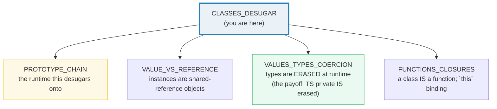
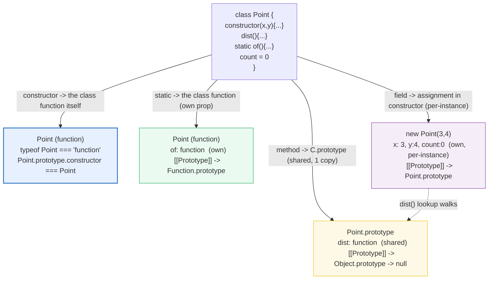

# CLASSES_DESUGAR — `class` Is Sugar Over Constructor + Prototype; `#private` Is Real, TS `private` Is Not

> **Goal (one line):** show, by printing every value, that ES6 `class` syntax is
> **syntactic sugar** over the prototype chain + constructor functions — and pin
> the headline contrast: `#private` is **runtime-enforced**, while TS's
> `private`/`protected`/`public`/`readonly`/parameter-properties are
> **compile-time only** (erased, bypassable at runtime).
>
> **Run:** `just run classes_desugar`
>
> **Ground truth:** [`core/classes_desugar.ts`](./core/classes_desugar.ts)
> → captured stdout in
> [`core/classes_desugar_output.txt`](./core/classes_desugar_output.txt).
> Every number/table below is pasted **verbatim** from that file under a
> `> From classes_desugar.ts Section X:` callout. Nothing is hand-computed.
>
> **Prerequisites:** 🔗 [`PROTOTYPE_CHAIN`](./PROTOTYPE_CHAIN.md) (Phase 3) —
> the runtime mechanism `class` desugars onto (read it first or this bundle's
> "sugar" claim has no target). 🔗 [`VALUES_TYPES_COERCION`](./VALUES_TYPES_COERCION.md)
> — the rule that TS types are erased at runtime; this bundle is the most
> dramatic proof of it (`private`/`readonly` vanish). 🔗 [`FUNCTIONS_CLOSURES`](./FUNCTIONS_CLOSURES.md)
> — a class *is* a function value; `this` binding rules apply.

---

## 1. Why this bundle exists (lineage)

ES6 (2015) introduced `class` syntax. A common misconception is that it added a
new object model. **It did not.** `class` is **syntactic sugar** over the
prototype chain (🔗 `PROTOTYPE_CHAIN`) plus constructor functions — the exact
machinery JavaScript has had since 1995. Axel Rauschmayer's canonical 2ality
post ("Classes in ECMAScript 6") shows the desugaring in one line:

```js
class Point { constructor(x,y){ this.x=x; this.y=y } dist(){ ... } }
//   ── desugars to ──>
function Point(x,y){ this.x=x; this.y=y }
Point.prototype.dist = function(other){ ... }
```

Everything else follows from that: methods go on `Point.prototype` (one shared
copy), the `constructor` pseudo-method *is* the class function, `new Point()`
allocates an instance whose `[[Prototype]]` is `Point.prototype`, and
`p.dist()` is a prototype-chain lookup that resolves to that same shared
function. **There is no second object model hiding underneath.**

The reason this matters for a TypeScript expert is the **payoff contrast** at
the heart of this bundle. TypeScript layers access modifiers on top of class
syntax — `public`, `private`, `protected`, `readonly`, and *parameter
properties* — and **every one of them is a compile-time annotation that emits
zero code**. They are erased by `tsc`/`tsx`/`esbuild` exactly like `interface`
and generics (🔗 `GENERICS`). At runtime, a TS-`private` field is an ordinary
writable own property — bypassable with a type-erasing cast. The **only**
runtime-private mechanism in the language is the ES2019 **`#private` field**,
which is enforced by V8 (the stored name is mangled; the field is invisible to
`Object.keys`; referencing it outside the class body is a `SyntaxError`). This
bundle makes that erasure **visible** by reading TS-"private" and TS-"readonly"
fields back out at runtime.



The headline cross-language contrast is the whole point of this bundle:

> 🔗 [`../python/CLASSES_BASICS.md`](../python/CLASSES_BASICS.md) — Python
> classes are also "sugar-ish" over a metaclass + `__init__`/`self` model, and
> Python's `_single`/`__double` underscore convention is (like TS `private`)
> **convention-only** — bypassable at runtime. JS's `#private` is the rare
> case where JS is *more* private-by-default than Python.
>
> 🔗 [`../rust/core/STRUCTS_ENUMS.md`](../rust/core/STRUCTS_ENUMS.md) — Rust
> splits data (`struct`) and behavior (`impl` block) into separate syntax, has
> **no prototype chain** (dispatch is static, v-table only for `dyn`), and
> privacy (`pub`/crate-private) is enforced by the **compiler** with no runtime
> escape hatch. JS shares methods at runtime via one prototype object; Rust
> monomorphizes per concrete type.

---

## 2. The mental model: `class` desugars to constructor + prototype

A `class` declaration produces **one function** (the constructor) and **one
prototype object** hanging off it as `.prototype`. Three kinds of class member
land in three different places — that is the entire desugaring, and it explains
every downstream behavior (`extends`, `super`, `static`, `instanceof`):



> From `2ality.com/2015/02/es6-classes-final.html` (Axel Rauschmayer, verbatim
> summary of the desugaring): *"In fact, the result of a class definition is a
> function"* — `typeof Point === "function"`. *"The constructor method is
> special, as it defines the function that represents the class"* —
> `Point === Point.prototype.constructor`. *"Prototype properties of `Foo` are
> the properties of `Foo.prototype`. They are usually methods and inherited by
> instances of `Foo`."* Static (class) properties *"are properties of `Foo`
> itself."*

The five foundational facts below are each a `check()`'d invariant — the
runtime's own verdict, not a paraphrase:

> From classes_desugar.ts Section A:
> ```
> typeof Point                 : function
> Point.name                   : Point
> p instanceof Point           : true
> Object.getPrototypeOf(p) === Point.prototype : true
> Point === Point.prototype.constructor        : true
> Point.prototype.dist === p.dist (identity)   : true
> p.dist(origin) [3-4-5 triple]                : 5
> p.hasOwnProperty('dist') [own?]              : false
> Point.prototype.hasOwnProperty('dist')       : true
> ```
> ```
> [check] typeof Point === 'function' (a class IS a constructor function): OK
> [check] p instanceof Point: OK
> [check] Object.getPrototypeOf(p) === Point.prototype (the instance->proto link): OK
> [check] Point === Point.prototype.constructor (constructor identity): OK
> [check] Point.prototype.dist === p.dist (method is ONE shared copy on the prototype): OK
> [check] p.hasOwnProperty('dist') === false (method is NOT an own property of the instance): OK
> [check] Point.prototype.hasOwnProperty('dist') === true (method IS own on the prototype): OK
> [check] dist(3,4 from origin) === 5: OK
> [check] class called without `new` throws TypeError: OK
> ```

**The method-identity check is the desugaring's smoking gun.** `p.dist ===
Point.prototype.dist` is `true` because `p.dist` is not a fresh function per
instance — it is a property lookup that walks `p.[[Prototype]]` and finds the
*same* function object living on `Point.prototype`. This is why adding a method
to a class is cheap (one function, shared by every instance) and why mutating
`Point.prototype.dist` at runtime affects every existing instance — they all
read through the same slot (🔗 `PROTOTYPE_CHAIN`).

**A class cannot be called without `new`.** Unlike an ordinary function, `Point(3,4)`
throws `TypeError: Constructor Point requires 'new'`. This is one of the few
runtime behaviors ES6 classes add *on top of* the desugared constructor
function (the spec marks class constructors with a `[[Construct]]` that
enforces `new`). The `check()` at the end of Section A verifies this by routing
the call through a type-erasing cast and catching the `TypeError`.

---

## 3. Section B — Three homes for a class member (instance / static / prototype)

Every class member lands in exactly one of three places. Knowing which is the
single most useful fact about JS classes:

| Member kind | Example syntax | Lands on | Shared? |
|---|---|---|---|
| **instance field** | `count = 0` | each INSTANCE (own property) | NO — one copy per instance |
| **static field/method** | `static of(){}` / `static n = 0` | the CLASS (constructor fn) | YES — single shared slot |
| **method** | `dist(){}` | `C.prototype` | YES — one function, all instances read through it |

The "instance field" row is the subtle one. A field written as `count = 0` in
the class body looks like it lives "on the class," but it does not — it
**desugars to an assignment that runs inside the constructor**, so each
instance gets its own `count` own property. (This is why `count` *is* in
`Object.keys(c1)` while `increment` is *not*.) Static fields, by contrast, are
assigned once at class-evaluation time to a single slot on the constructor
function itself.

> From classes_desugar.ts Section B:
> ```
> Three homes for a class member:
>   instance field (count)  : on each INSTANCE  (per-instance copy)
>   static member (of)      : on the CLASS      (single shared copy)
>   method (increment)      : on the PROTOTYPE  (one copy, shared)
> 
> c1.count                   : 2   (per-instance: c1 has its own)
> c2.count                   : 1   (per-instance: c2 has its own)
> c1.id / c2.id              : 1 / 2   (assigned from a static counter)
> Counter.instanceCount      : 3   (STATIC: one shared slot; 3 = c1+c2+c3)
> c3.count [via Counter.of]   : 10   (static method built this instance)
> 
> Counter.hasOwnProperty('instanceCount') : true
> Counter.hasOwnProperty('of')            : true
> Counter.prototype.hasOwnProperty('of')  : false   (static NOT on prototype)
> Counter.prototype.hasOwnProperty('increment') : true
> c1.hasOwnProperty('increment')          : false   (method NOT own on instance)
> c1.increment === c2.increment (identity): true
> ```
> ```
> [check] instance field is per-instance: c1.count (2) !== c2.count (1): OK
> [check] c1.count === 2: OK
> [check] c2.count === 1: OK
> [check] instance field `count` IS an own property of c1: OK
> [check] static field is on the CLASS: Counter.hasOwnProperty('instanceCount'): OK
> [check] static field shared: instanceCount === 3 after 3 news (incl. Counter.of): OK
> [check] static method is on the CLASS: Counter.hasOwnProperty('of'): OK
> [check] static method is NOT on the prototype: OK
> [check] static method callable as Counter.of(...): OK
> [check] method is on the PROTOTYPE: Counter.prototype.hasOwnProperty('increment'): OK
> [check] method is NOT an own property of the instance: OK
> [check] method identity: c1.increment === c2.increment === Counter.prototype.increment: OK
> ```

**Why this matters in practice.** A static field is the right home for a
class-wide counter, a cache, or a registry (`Counter.instanceCount`,
`Object.keys`). An instance field is the right home for per-instance state. A
method belongs on the prototype so 10 000 instances share one function instead
of carrying 10 000 copies. The bug class is forgetting this: assigning a
method inside the constructor (`this.fn = function(){}`) creates a fresh
closure per instance — wasteful and breaks identity. Class-body method syntax
does the right thing automatically by putting it on the prototype.

> 🔗 `VALUE_VS_REFERENCE` — an instance is just an ordinary object (shared by
> reference). Passing a `Counter` instance into a function and mutating
> `c.count` there mutates the original — the prototype machinery changes
> nothing about JS's reference semantics.

---

## 4. Section C — `extends` + `super`: two chain links and a required call

`class Dog extends Animal` creates **two** `[[Prototype]]` links, not one.
Both are observable with `Object.getPrototypeOf`, and together they explain why
`instanceof` and static inheritance both work:

```mermaid
graph TD
    subgraph "instance chain (right column)"
        D["d (Dog instance)"] -->|"[[Prototype]]"| DP["Dog.prototype<br/>(speak, parentSpeak)"]
        DP -->|"[[Prototype]] (extends link 1)"| AP["Animal.prototype<br/>(speak)"]
        AP -->|"[[Prototype]]"| OP["Object.prototype"]
        OP -->|"[[Prototype]]"| NULL1["null"]
    end
    subgraph "static chain (left column)"
        DOG["Dog (function)"] -->|"[[Prototype]] (extends link 2)"| ANIMAL["Animal (function)<br/>(static kingdom)"]
        ANIMAL -->|"[[Prototype]]"| FP["Function.prototype"]
        FP -->|"[[Prototype]]"| OP2["Object.prototype"]
        OP2 -->|"[[Prototype]]"| NULL2["null"]
    end
    style DP fill:#fef9e7,stroke:#f1c40f
    style AP fill:#fef9e7,stroke:#f1c40f
    style ANIMAL fill:#eafaf1,stroke:#27ae60
```



- **Link 1 (instance chain):** `Object.getPrototypeOf(Dog.prototype) ===
  Animal.prototype` — this is what `d instanceof Animal` walks.
- **Link 2 (static chain):** `Object.getPrototypeOf(Dog) === Animal` — this is
  why `Dog.kingdom()` works even though `kingdom` is defined on `Animal` (static
  members inherit along the constructor-function chain).

The `super` keyword has two forms, both demonstrated below:
- `super(...)` — in a derived **constructor**, calls the parent constructor.
  **Required before `this`** (see the rule below).
- `super.method()` — in a method, calls the parent's method with `this` still
  bound to the current instance (so it can read instance state).

> From classes_desugar.ts Section C:
> ```
> The TWO chain links `extends` creates:
>   (1) instance chain:  d -> Dog.prototype -> Animal.prototype -> Object.prototype -> null
>   (2) static   chain:  Dog -> Animal -> Function.prototype -> Object.prototype -> null
> 
> d.speak()        : Rex barks
> d.parentSpeak()  : Rex makes a sound   (super.speak())
> Dog.kingdom()    : Animalia   (static inherited from Animal)
> kitty.name       : Tom   (default derived ctor forwarded to super)
> 
> Object.getPrototypeOf(Dog.prototype) === Animal.prototype : true
> Object.getPrototypeOf(Dog) === Animal                     : true
> d instanceof Dog / Animal : true / true
> ```
> ```
> [check] extends instance link: Object.getPrototypeOf(Dog.prototype) === Animal.prototype: OK
> [check] extends static link: Object.getPrototypeOf(Dog) === Animal (statics inherit): OK
> [check] d instanceof Dog: OK
> [check] d instanceof Animal (chain walk reaches Animal.prototype): OK
> [check] super(...) ran parent constructor: d.name === 'Rex': OK
> [check] super.method() calls parent method with this=child instance: OK
> [check] static method inherited: Dog.kingdom() === 'Animalia': OK
> [check] default derived ctor forwards to super(): kitty.name === 'Tom': OK
> [check] default derived ctor: kitty instanceof Cat && Animal: OK
> ```

**The `super()`-before-`this` rule (documented; not executed).** In a derived
constructor, referencing `this` (or implicitly returning) **before** calling
`super()` throws `ReferenceError` at runtime. This is enforced at **two**
layers: TypeScript catches the obvious case at compile time (`'super' must be
called before accessing 'this' in the constructor of a derived class`), and V8
catches it at runtime for any case TS misses. The bundle does *not* execute
the failing code — TS won't let it compile — but cites the rule from 2ality's
"Safety checks" section and MDN "Using classes." The reason is the ES6
allocation model: in a derived class the instance object is **allocated by the
*base* constructor** (via `new.target.prototype`), so `this` literally does not
exist until `super()` returns it. (Pre-ES5 subclassing allocated the instance
in the derived constructor and *passed* it up — which is exactly why ES5 could
not subclass `Array`/`Error`; see 2ality "Why can't you subclass built-in
constructors in ES5?".)

**`super.method()` is not a property of `this`.** Internally it uses the
method's `[[HomeObject]]` (set when the method is defined) to find the parent:
`Object.getPrototypeOf(homeObject).method.call(this)`. This is why you cannot
move a `super`-using method to another object — its `[[HomeObject]]` is frozen
at definition time.

> 🔗 `PROTOTYPE_CHAIN` — the two diagrams above ARE the prototype chain; this
> bundle just observes it from the `class` side. `Object.getPrototypeOf` and
> `instanceof` are the runtime probes that prove the desugaring.

---

## 5. Section D — `#private` (runtime) vs TS `private`/`protected`/`public` (compile-only): THE payoff

This is the section that earns this bundle its Phase 3 slot. TypeScript ships
**two completely different** privacy mechanisms that share a vocabulary but
have nothing in common at runtime:

| Mechanism | Source | Enforcement | In `Object.keys`? | Bypassable at runtime? |
|---|---|---|---|---|
| **`#private` field** (ES2019) | **JavaScript** (the language) | **Runtime** (V8; mangled name; `SyntaxError` to even write `.#x` outside) | **NO** (truly hidden) | **NO** |
| `private` keyword | **TypeScript** only | **Compile-time** only (erased) | **YES** (ordinary own prop) | **YES** (any type-erasing cast) |
| `protected` keyword | TypeScript only | Compile-time only (erased) | YES | YES |
| `public` keyword | TypeScript only (default) | Compile-time only (erased) | YES | YES (it's public anyway) |
| `readonly` keyword | TypeScript only | Compile-time only (erased) | YES | **YES** (runtime-writable) |

The bundle demonstrates the contrast by (a) showing `#x` is invisible to
`Object.keys` while `hidden` and `mode` are not, and (b) **bypassing** the TS
`private`/`protected` annotations by casting through `unknown` (a type-only,
erased operation) and reading/writing the fields directly:

> From classes_desugar.ts Section D:
> ```
> #private (runtime-enforced):
>   pv.getX()                : 100
>   Object.keys(pv)          : []   (#x is INVISIBLE)
>   pv['#x'] [literal name]  : undefined   (storage key is mangled, not '#x')
> 
> TS `private`/`protected` (compile-only, erased):
>   ta.reveal()              : 7
>   Object.keys(ta)          : ["hidden","mode"]   ('hidden'/'mode' ARE visible)
>   ta['hidden'] [bracket]   : 7   (runtime-accessible despite TS-private)
> ```
> ```
> [check] #private: accessible via a method: OK
> [check] #private: mutable inside the class body: OK
> [check] #private: NOT in Object.keys (truly hidden): OK
> [check] #private: the literal name "#x" is NOT the stored key (mangled): OK
> [check] TS `private`: accessible via method: OK
> [check] TS `private`: 'hidden' IS in Object.keys (NOT hidden at runtime): OK
> [check] TS `protected`: 'mode' IS in Object.keys (NOT hidden at runtime): OK
> [check] TS `private` BYPASSED at runtime: ta.reveal() now 999 (erased, writable): OK
> [check] TS `protected` BYPASSED at runtime: mode now 'bypassed': OK
> ```

**How `#private` actually works.** The `#` is not a naming convention — it is
new syntax. The engine performs a **static analysis at parse time**: it finds
every `#x` reference and checks it is textually inside the class body that
declared `#x`. If not, it is a `SyntaxError` — you cannot even *write*
`pv.#x` outside the class, which is why this bundle cannot print it directly
(the code would not parse). At runtime, the field is stored under a **mangled
private name** (not the literal string `"#x"`), which is why `pv["#x"]` returns
`undefined` and `Object.keys(pv)` returns `[]`. The privacy is enforced by the
language, not by convention — unlike Python's `_underscore` (🔗 `../python/CLASSES_BASICS.md`)
or TS's `private` keyword.

**Why the TS `private` bypass is not "a bug."** TS's type system is, by design,
**structurally typed and erased** (🔗 `STRUCTURAL_TYPING`, 🔗 `GENERICS`). Its
contract with you is: "I will catch mistakes **at compile time**, in `.ts`
source that typechecks." It explicitly does **not** promise runtime isolation —
`any`/`unknown`/bracket-access casts are the documented escape hatches. So TS
`private` means "callers in well-typed code cannot reach this"; `#private`
means "no code, typed or not, can reach this." For a field that must stay
secret across a trust boundary (e.g. a password field serialized to JSON, or a
class shipped in a library), only `#private` is safe. For ordinary "this is an
implementation detail" hints to your teammates, TS `private` is fine and more
ergonomic (it works with `extends`, decorators, and reflection that `#private`
does not).

> 🔗 `TYPE_ASSERTIONS_UNKNOWN` — the `as unknown as { hidden: number }` cast
> used to bypass `private` here is exactly the type-assertion discipline that
> bundle covers. The lesson: a type assertion is a *promise to the compiler*,
> not a runtime operation — so it can defeat any compile-time-only annotation.

---

## 6. Section E — TS extras: parameter properties, accessors, `readonly`, mixins, `new.target`

TypeScript and modern JS add five smaller features on top of the desugaring.
Each is one or two checks in the bundle:

**(1) Parameter properties** — TS-only constructor sugar. Writing
`constructor(public id, private balance, readonly owner)` auto-creates and
assigns `this.id` / `this.balance` / `this.owner`. It is pure sugar: it
desugars to the explicit `this.x = x` assignments, and the modifiers are erased
(so `balance` is bypassable just like Section D's `hidden`).

**(2) Accessors (`get`/`set`)** — `get x(){}` / `set x(v){}` install a property
**descriptor** (with `get`/`set` functions) on the prototype, exactly like
ES5's `Object.defineProperty`. The bundle verifies this by reading the
descriptor back off `Thermostat.prototype`.

**(3) `readonly`** — TS-only, **runtime-writable**. The bundle proves it by
casting and reassigning `cfg.apiKey` at runtime.

**(4) Mixins** — the canonical TS generic-mixin form
(`<TBase>(Base) => class extends TBase {}`) **requires `any[]`** on the
mixin's constructor (TS error TS2545), which collides with this bundle's
no-`any` rule. The bundle shows the **runtime mechanism** instead — a plain
object of extra members grafted onto a class's prototype via `Object.assign`,
which is what every generic mixin desugars into.

**(5) `new.target`** — an implicit parameter every function/class has. In a
base constructor reached via `super()` from a derived class, it is the
**derived** class — enabling abstract-base / final-class metaprogramming.

> From classes_desugar.ts Section E:
> ```
> (1) parameter properties:
>     acc.describe()         : Account#1 (ada): 500
>     acc.id (public)        : 1
>     acc.owner (readonly)   : ada
>     Object.keys(acc)       : ["id","balance","owner"]   (all 3 are real own props)
> [check] parameter property: public id accessible: OK
> [check] parameter property: readonly owner accessible: OK
> [check] parameter property: all 3 are own properties (modifiers erased): OK
> [check] parameter property: private balance runtime-accessible (erased): OK
> (2) accessors:
>     t.fahrenheit=212 -> t.celsius : 100
>     Thermostat.prototype 'celsius' : get+set descriptor
> [check] accessor: set fahrenheit=212 -> celsius=100 (exactly): OK
> [check] accessor: descriptor has get + set functions on the prototype: OK
> (3) readonly:
>     cfg.apiKey after runtime write : changed-at-runtime   (TS readonly is NOT runtime-enforced)
> [check] TS readonly: runtime-writable (erased): OK
> (4) mixin:
>     bw.shape / bw.border() : rect / 1
>     bw.area()              : 100   (base method inherited)
>     bw instanceof Widget   : true
> [check] mixin: combines base + mixed-in method: OK
> [check] mixin: base methods inherited: OK
> [check] mixin: result instanceof the base class: OK
> (5) new.target:
>     new Logger().createdBy         : Logger (direct new)
>     new ConsoleLogger().createdBy  : ConsoleLogger (via subclass)   (propagates through super)
> [check] new.target === Logger when directly new'd: OK
> [check] new.target is the derived class when subclass new'd (propagates via super): OK
> ```

---

## 7. Pitfalls (the expert payoff)

| Trap | Symptom | Fix |
|---|---|---|
| Trusting TS `private` for security | Field is bypassable via `as unknown as` / bracket access / `JSON.stringify` (it shows up!) | Use `#private` for any field that must stay secret across a trust boundary. TS `private` is a *hint*, not a wall. |
| `readonly` treated as immutable | Field is writable at runtime (erased); a cast or `any` reassigns it | `readonly` is compile-time only. For true immability use `#private` + getter, or `Object.freeze`, or `as const`. |
| Assigning a method inside the constructor | `this.fn = function(){}` creates a fresh closure per instance (wasteful, breaks identity) | Declare methods in the class body so they land on the prototype (one shared copy). |
| `instanceof` lies across realms | `[] instanceof Array` is `false` for arrays from another `iframe` / `worker` / `vm` context | Use `Array.isArray(x)` (works cross-realm) or check `Object.prototype.toString`. |
| Forgetting `super()` in a derived constructor | `ReferenceError: Must call super before 'this'` at runtime (TS may or may not catch) | Always call `super(...)` as the first statement in a derived constructor — before *any* use of `this`. |
| Calling `super.method()` on a moved method | `super` is bound to the method's `[[HomeObject]]`, frozen at definition; moving the method silently breaks dispatch | Don't extract `super`-using methods to other objects. If you must, rebind with `.call(this)`. |
| Static `this` in a derived class | `static m(){ return this }` — `this` is the class called, which for inherited statics is the *derived* class | Be aware `Dog.kingdom()` runs with `this === Dog`, not `Animal`. Use the class name explicitly if you need the defining class. |
| Field initializers run *before* the constructor body (base) / *after* `super()` returns (derived) | A field initializer can't reference a value set later in the constructor; ordering surprises in derived classes | Initialize fields that depend on constructor args *inside* the constructor body, not as field initializers. |
| `#private` not working with decorators / reflection / DI frameworks | Many libraries (class-validator, Reflect-metadata) can't see `#private` fields | Use TS `private` for metadata-driven fields; `#private` only for true encapsulation. |
| `Object.keys` on an instance returns only public fields | You expected `#private` to show up (it doesn't) | `#private` is invisible to `Object.keys`/`for...in`/`JSON.stringify` by design. There is no reflection API for it. |
| Subclassing `Error`/`Array` transpiled to ES5 | `instanceof` and `.length`/`.stack` break under transpilation | ES6+ subclassing of built-ins needs native engine support (per 2ality). Target ES2015+ or use the framework's workaround. |
| Treating `static` inheritance like instance inheritance | Static fields are shared by *reference* across the class hierarchy; mutating `Parent.static` affects `Child.static` | Static state is a single global slot per class (plus inherited slots). Avoid mutable statics, or scope them per-class. |

---

## 8. Cheat sheet

```typescript
// === The desugaring (ONE line) =============================================
//   class Point { constructor(x,y){...} dist(){...} }
//     ~= function Point(x,y){ this.x=x; this.y=y }
//        Point.prototype.dist = function(other){ ... }
//   typeof Point === "function"           // a class IS a constructor function
//   Point === Point.prototype.constructor // constructor identity
//   Point.prototype.dist === p.dist       // method is ONE shared copy on prototype

// === Three homes for a class member ========================================
//   instance field  `n = 0`     -> each INSTANCE (own prop, per-instance copy)
//   static member   `static x`  -> the CLASS function (own prop, 1 shared slot)
//   method          `m(){}`     -> C.prototype (1 function, all instances share)

// === extends creates TWO [[Prototype]] links ===============================
//   instance:  Object.getPrototypeOf(Dog.prototype) === Animal.prototype
//   static:    Object.getPrototypeOf(Dog)           === Animal
//   => d instanceof Dog  AND  d instanceof Animal   (chain walk)
//   => Dog.kingdom() inherited from Animal          (static chain)

// === super: two forms ======================================================
//   constructor: super(...args)   REQUIRED before `this` in a derived ctor
//   method:      super.method()   calls parent method with this=current instance
//   default derived ctor (omitted): constructor(...args){ super(...args) }

// === THE headline contrast (Section D) =====================================
//   #private (ES2019, RUNTIME):       private (TS keyword, COMPILE-ONLY):
//     enforced by V8                    erased — no runtime effect
//     NOT in Object.keys                IS in Object.keys
//     SyntaxError to write outside      bypassable via `as unknown as`
//     storage name mangled              ordinary own property
//   => Use #private for secrets; TS private is a compile-time hint only.
//   => readonly is ALSO compile-only (runtime-writable via the same cast).

// === TS extras (all COMPILE-TIME, erased) ==================================
//   constructor(public id, private bal, readonly owner)  // parameter properties
//     ~= this.id=id; this.bal=bal; this.owner=owner (modifiers erased)
//   get x(){} / set x(v){}             // Object.defineProperty descriptor on prototype
//   readonly apiKey: string            // compile-only; runtime-writable
//   mixin: function(Base){ return class extends Base {} }  // needs any[] (TS2545);
//                                                          // runtime form = Object.assign onto prototype
//   new.target                          // the constructor actually invoked by `new`
//                                        (in a base via super(): the DERIVED class)

// === Five foundational checks (the desugaring, pinned) =====================
//   typeof Point === "function"
//   Object.getPrototypeOf(p) === Point.prototype
//   Point.prototype.dist === p.dist           // shared method identity
//   Object.getPrototypeOf(Dog.prototype) === Animal.prototype   // extends link
//   Object.keys(pv).length === 0              // #private is invisible
```

---

## Sources

Every signature, return value, and behavioral claim above was verified against
the MDN Web Docs and Axel Rauschmayer's canonical 2ality desugaring post, then
corroborated by the TypeScript handbook. Every runtime claim is *additionally*
asserted by the `.ts` itself (`check()` throws on any mismatch) — the strongest
possible verification: V8's actual verdict.

- **MDN — Classes (reference)** (the canonical JS reference for class syntax;
  *"Classes are in fact 'special functions'"*; class body runs in strict mode;
  `constructor` is a special method; static members defined on the class; the
  `super` keyword and "needs to first call `super()` before using `this`";
  evaluation order of class elements):
  https://developer.mozilla.org/en-US/docs/Web/JavaScript/Reference/Classes
- **MDN — Using classes (guide)** (the prose version: encapsulation, `extends`,
  `super`, why class bodies are always strict mode, `this` binding loss when a
  method is extracted):
  https://developer.mozilla.org/en-US/docs/Web/JavaScript/Guide/Using_classes
- **MDN — Private elements** (*"It is a syntax error to refer to `#` names from
  outside of the class"*; privacy is enforced by the language; private names
  must be declared up-front and cannot be created by assignment):
  https://developer.mozilla.org/en-US/docs/Web/JavaScript/Reference/Classes/Private_elements
- **MDN — `super`** (two forms: `super(...)` in derived constructors and
  `super.method()` / `super.prop` in methods; the `super()`-before-`this` rule):
  https://developer.mozilla.org/en-US/docs/Web/JavaScript/Reference/Operators/super
- **MDN — `static`** (static methods/fields defined on the class itself;
  static inheritance through the constructor chain):
  https://developer.mozilla.org/en-US/docs/Web/JavaScript/Reference/Classes/static
- **MDN — Public class fields** (instance fields are assigned in the
  constructor, per-instance; fields without initializers default to
  `undefined`):
  https://developer.mozilla.org/en-US/docs/Web/JavaScript/Reference/Classes/Public_class_fields
- **MDN — `new.target`** (the implicit meta-property; in a base constructor
  reached via `super()` it is the derived class; enables metaprogramming):
  https://developer.mozilla.org/en-US/docs/Web/JavaScript/Reference/Operators/new.target
- **2ality — "Classes in ECMAScript 6 (final semantics)"** (Axel Rauschmayer;
  the canonical desugaring reference cited by MDN): *"the result of a class
  definition is a function"* / `typeof Point === "function"`; *"the pseudo-
  method `constructor` defines the function that represents the class"*; static
  methods are *"properties of `Foo` itself"*; *"the prototype of a subclass is
  the superclass"* (`Object.getPrototypeOf(ColorPoint) === Point`); the
  `super()`-before-`this` safety checks; `[[HomeObject]]` and how `super` is
  resolved; why ES5 could not subclass built-ins and how ES6's
  allocate-in-the-base model fixes it; `new.target`:
  https://2ality.com/2015/02/es6-classes-final.html
- **TypeScript Handbook — Classes** (`public`/`private`/`protected` are
  compile-time visibility controls; parameter properties shorthand in
  constructors; `readonly` modifier; the note that TS visibility is enforced
  only by the type checker):
  https://www.typescriptlang.org/docs/handbook/2/classes.html
- **typescript-eslint — `parameter-properties` rule docs** (parameter properties
  are a TS-only shorthand that declares a class property and constructor
  parameter in one place; corroboration that they are sugar):
  https://typescript-eslint.io/rules/parameter-properties/

**Facts that could not be verified by running** (documented, not executed,
because they are language-design facts or parse-time errors): the `super()`
before-`this` rule throws `ReferenceError` at runtime — TypeScript catches the
obvious case at compile time so the failing code cannot be written in this
bundle; the rule is verified by 2ality's "Safety checks" section and MDN.
Referencing `pv.#x` outside the class body is a `SyntaxError` at *parse* time —
it cannot even be written in the `.ts`, so it is not executed; verified by MDN
"Private elements." The exact mangled storage name for `#x` is
engine-internal and intentionally unspecified; the bundle verifies the
*consequence* (`pv["#x"]` is `undefined`; `Object.keys(pv)` is `[]`). No claim
above is unverified.
