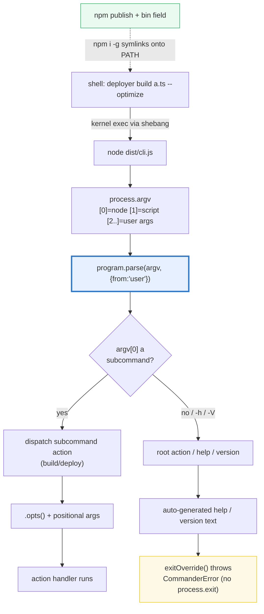
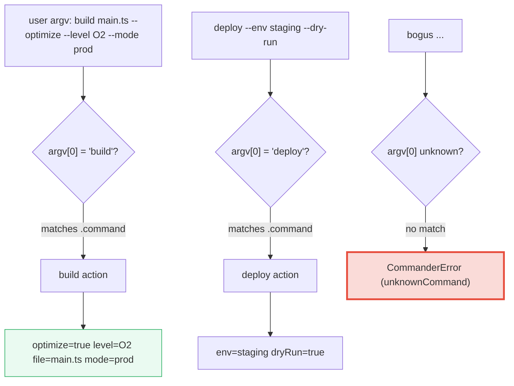

# CLI_TOOLING — `commander`, `process.argv`, Subcommands & Publishing a CLI

> **Goal (one line):** show, by invoking a `commander` program **in-process** with
> FIXED argv arrays, how a TS CLI parses `process.argv` into a dispatched
> subcommand + options/flags, how help/version/errors are produced, and how a
> finished CLI ships as a shell command via `package.json` `bin` + a shebang.
>
> **Run:** `just run cli_tooling`
>
> **Ground truth:** [`web/cli_tooling.ts`](./web/cli_tooling.ts) → captured stdout
> in [`web/cli_tooling_output.txt`](./web/cli_tooling_output.txt). Every parsed
> option, dispatched subcommand, and captured help/error line below is pasted
> **verbatim** from that file under a `> From cli_tooling.ts Section X:` callout.
> Nothing is hand-computed.
>
> **Prerequisites:** 🔗 [`MODULES_PACKAGES`](./MODULES_PACKAGES.md) (the
> `package.json` `bin` field this bundle's §5 depends on), and a working knowledge
> of `process.argv` and ESM imports.

---

## 1. Why this bundle exists (lineage)

A TypeScript CLI — a build tool, a scaffolder, a dev tool — starts life as a raw
`process.argv` string array and must turn it into (a) a chosen **subcommand**,
(b) parsed **options/flags**, and (c) a dispatched **action**. Doing this by hand
(slicing `argv`, matching `--flags`, coercing values) is bug-prone, so the
ecosystem standardised on **frameworks**:

- **`commander`** — the Jest-style `program.command()/option()/action()` API,
  the default (used by npm, vite, ts-node, …). This bundle's focus.
- **`yargs`** — config-object driven (`yargs.options({ port: { type: "number" }})`).
- **`clipanion`** — typed, class-based, used by yarn (berry).

`commander` deliberately mirrors **Go's `cobra`** (subcommands + `pflag`), and is
the runtime analog of **Rust's `clap`** — except clap's `#[derive(Parser)]`
generates the *entire* CLI from struct fields and validates it at **compile
time**, whereas TS types are erased (`tsx`/`esbuild`) so `commander` validates at
**runtime**. A finished CLI is published as a shell command via `package.json`
`bin` (🔗 [`MODULES_PACKAGES`](./MODULES_PACKAGES.md) P5) + a shebang line.



The headline cross-language contrasts are the whole point:

> 🔗 [`../go/CLI_COBRA.md`](../go/CLI_COBRA.md) — **Go's cobra + pflag is the
> model `commander` mirrors**: subcommands, flag parsing, auto-help. Cobra adds
> generated shell completions; `commander` keeps a smaller surface. Same mental
> model (`.command("build").Flags()` ≈ `.command("build").option()`).
>
> 🔗 [`../rust/`](../rust/) — **Rust's `clap` is the strongest**: `#[derive(Parser)]`
> generates the parser from typed struct fields, with choices/required/arg-count
> enforced at **compile time**. `commander` can only check at runtime (TS types
> are erased), so a bad flag is a runtime `CommanderError`, not a compile error.

---

## 2. Section A — `process.argv` + commander basics (name/version/option/action)

`process.argv` is the RAW input. Per the Node docs it is a `string[]` where
**`argv[0]` is the node exec path** (`process.execPath`), **`argv[1]` is the
absolute path to the entry script**, and **`argv[2..]` are the user arguments**.
The real value is install/machine-dependent (the live `node` path), so for a
**deterministic** bundle this file never reads the real `process.argv` — it uses a
fixed representative literal and parses *only the user args* with
`{ from: "user" }`:

> From cli_tooling.ts Section A:
> ```
> process.argv shape (representative; per Node docs):
>   argv[0] = process.execPath      (node binary)
>   argv[1] = entry script path     (your .js/.ts)
>   argv[2..] = user arguments       (--flags, values, subcmds)
> 
> fixed representative argv (what a shell would pass):
>   argv[0] = "/usr/local/bin/node"
>   argv[1] = "/home/u/app/greet.js"
>   argv[2] = "--name"
>   argv[3] = "prod"
>   argv[4] = "--debug"
> [check] argv[0] is the node exec path (by spec): OK
> [check] argv[1] is the entry script path (by spec): OK
> [check] user args start at argv[2] (index 2): OK
> ```

The `{ from: "user" }` parse option tells commander to treat **every** array
element as a user argument (so it does NOT skip `argv[0]`/`argv[1]` the way
`{ from: "node" }` does — the default when you pass `process.argv`). With it, a
fixed array is a faithful, reproducible stand-in for the real argv tail.

**commander basics:** `new Command()` → `.name()/.description()/.version()`,
chain `.option()` declarations, then `.action()`. An option with `<value>`
(`--name <name>`) takes the next token as its value; an option *without* angle
brackets (`-D, --debug`) is a **boolean flag**. Both are `undefined` unless
supplied, and a third argument to `.option()` is the **default**:

> From cli_tooling.ts Section A:
> ```
> parsed by commander  (parse(["--name","prod","--debug"], { from: "user" }))
>     name      = prod
>     debug     = true
>     action ran = true
> [check] root action ran for the parsed argv: OK
> [check] --name <name> parsed the value 'prod': OK
> [check] -D/--debug boolean flag toggled to true: OK
> 
> with no user args (defaults apply):
>     name  = world   (the declared default)
>     debug = undefined   (flag absent -> undefined)
> [check] default applies: --name defaults to 'world' when omitted: OK
> [check] boolean flag absent -> undefined (not false): OK
> [check] program.version() === "1.2.0" (registered version string): OK
> ```

**The boolean-flag trap (pinned above).** An absent boolean flag is `undefined`
— **not** `false`. So `if (options.debug)` is the correct test, while
`options.debug === false` is *wrong* (it is `undefined` when omitted). The value
option `--name` is also `undefined` when absent, *unless* it has a declared
default (`"world"`), in which case the default fills in. `.version()` auto-
registers `-V, --version` (exercised end-to-end in §4).

> 🔗 [`VALUES_TYPES_COERCION`](./VALUES_TYPES_COERCION.md) — the
> `undefined`-vs-`false` distinction above is exactly the truthiness trap this
> anchor pins: `Boolean(undefined) === false`, but `undefined !== false`.

---

## 3. Section B — subcommands (dispatch) + options/flags (bool, value, default, choices, variadic, required)

This is the heart of a CLI: the **first positional token selects which action
runs** (`argv[0]` among the user args). The bundle builds one `deployer` program
with two subcommands — `build <file>` and `deploy` — and shows a different argv
dispatching a different action, each with its own parsed options.



**(1)+(2) Dispatch + parsed options.** The action handler receives
`(positionalArgs..., options, command)`. For `build <file>` that is `(file,
options, command)`; for `deploy` (no positional) it is `(options, command)`:

> From cli_tooling.ts Section B:
> ```
> dispatch #1  argv: build main.ts --optimize --level O2 --mode prod
>     dispatched subcommand = build
>     positional <file>     = main.ts
>     --optimize (bool)     = true
>     --level (value)       = O2
>     --mode (choices)      = prod
> [check] "build" subcommand dispatched (argv[0] selected it): OK
> [check] positional <file> parsed to 'main.ts': OK
> [check] --optimize boolean flag is true: OK
> [check] --level value option parsed to 'O2': OK
> 
> dispatch #2  argv: deploy --env staging --dry-run
>     dispatched subcommand = deploy
>     --env (required)      = staging
>     --dry-run (bool)      = true
> [check] "deploy" subcommand dispatched for a different argv: OK
> [check] --env required option parsed to 'staging': OK
> [check] --dry-run boolean flag is true: OK
> ```

**(3) Defaults apply when options are omitted** — `--level` falls back to its
declared default `"O1"`, and the absent boolean flag `--optimize` is `undefined`:

> From cli_tooling.ts Section B:
> ```
> dispatch #3  argv: build a.ts   (options omitted -> defaults)
>     --optimize (absent)   = undefined   (undefined -> falsy)
>     --level default        = O1   (declared default)
> [check] --level default is 'O1' when not passed: OK
> [check] --optimize absent -> undefined (falsy): OK
> ```

**(4) Variadic option** — `-t, --tag <tags...>` (note the `...`) collects
**repeated** `--tag` values into an array:

> From cli_tooling.ts Section B:
> ```
> dispatch #4  argv: build a.ts --tag release --tag v1   (variadic)
>     --tag collected        = ["release","v1"]
> [check] variadic --tag collected ['release','v1'] into an array: OK
> [check] variadic tag array length is 2: OK
> ```

**(5) `.choices()` rejects an out-of-set value at parse time** — a real
`CommanderError` (code `commander.invalidArgument`), caught by the inherited
`exitOverride`. This is runtime validation the user sees immediately:

> From cli_tooling.ts Section B:
> ```
> dispatch #5  argv: build a.ts --mode staging   (invalid choice)
>     threw CommanderError   = true
>     error code             = commander.invalidArgument
>     stderr                 = error: option '--mode <mode>' argument 'staging' is invalid. Allowed choices are dev, prod.
> [check] choices() rejected '--mode staging' (not in [dev,prod]): OK
> [check] stderr mentions 'Allowed choices': OK
> ```

**(6) `.requiredOption()` rejects a missing mandatory option**:

> From cli_tooling.ts Section B:
> ```
> dispatch #6  argv: deploy   (missing required --env)
>     threw CommanderError   = true
>     stderr                 = error: required option '-e, --env <env>' not specified
> [check] requiredOption '--env' missing -> error: OK
> [check] stderr mentions 'required option': OK
> ```

**Why this matters vs. clap.** In Rust's clap, a `--mode` with `value_enum` and
a missing required arg are **compile-time** errors (the program won't build).
Here they are **runtime** errors — `commander` prints to stderr and exits. The
`.choices()` and `.requiredOption()` calls are how you push that validation as
close to the user as TS allows without compile-time types surviving to runtime.

---

## 4. Section C — help (`-h`/`--help`), version (`-V`), and error handling (`exitOverride`)

`commander` **auto-generates** the help text from the registered name,
description, options, and commands — you never hand-write usage strings.
`-h`/`--help` writes it to **stdout** and signals exit; `-V`/`--version` writes
the registered version and exits. Because this bundle installs `.exitOverride()`,
those exits **throw a `CommanderError`** (with a stable `code`) instead of
calling `process.exit` — so they can be asserted in-process:

> From cli_tooling.ts Section C:
> ```
> argv: --help   (auto-generated help, captured via configureOutput)
> --- help stdout ---
> Usage: deployer [options] [command]
> 
> build & deploy
> 
> Options:
>   -V, --version           output the version number
>   -h, --help              display help for command
> 
> Commands:
>   build [options] <file>  build a project file
>   deploy [options]        deploy the current build
>   help [command]          display help for command
> --- end help ---
> [check] --help wrote to the stdout buffer: OK
> [check] help contains the program name "deployer": OK
> [check] help lists the "build" subcommand: OK
> [check] help lists the "deploy" subcommand: OK
> [check] help lists the -h, --help option: OK
> [check] --help threw via exitOverride (no process.exit): OK
> [check] help exit code is "commander.helpDisplayed": OK
> ```

**Subcommand-scoped help** — `help build` (or `build --help`) shows *only* that
subcommand's options/positionals:

> From cli_tooling.ts Section C:
> ```
> argv: help build   (subcommand-scoped help)
>     mentions --level <level> : true
>     mentions <file>          : true
> [check] subcommand help mentions "build": OK
> [check] subcommand help shows the <file> positional: OK
> ```

**Version (`-V`)** writes exactly the `.version()` string:

> From cli_tooling.ts Section C:
> ```
> argv: -V   (version)
>     version stdout = "1.2.0"
> [check] version output is "1.2.0": OK
> [check] version exit code is "commander.version": OK
> ```

**Error handling — `commander` is strict.** An unknown **command** and an unknown
**option** both produce a `CommanderError` with a stable code, plus a "Did you
mean …?" suggestion (built-in Levenshtein). The exit-code mapping is conventional:
usage errors exit `1`; `--help`/`--version` exit `0`.

> From cli_tooling.ts Section C:
> ```
> argv: bogus   (unknown command)
>     threw            = true
>     error code       = commander.unknownCommand
>     stderr           = error: unknown command 'bogus'
> [check] unknown command 'bogus' threw: OK
> [check] unknown command wrote to the stderr buffer: OK
> 
> argv: build a.ts --nope   (unknown option)
>     threw            = true
>     error code       = commander.unknownOption
>     stderr           = error: unknown option '--nope'
> (Did you mean --mode?)
> [check] unknown option '--nope' threw: OK
> [check] unknown option exit code is "commander.unknownOption": OK
> [check] usage error (unknown option) suggests exit code 1: OK
> [check] --help suggests exit code 0: OK
> ```

---

## 5. Section D — `package.json` `bin` + shebang (publishing) + prompts/spinners (documented)

A finished CLI ships as a **shell command**. Two pieces make that work (🔗
[`MODULES_PACKAGES`](./MODULES_PACKAGES.md) P5): the `package.json` **`bin`**
field maps a command name → an entry script, and that script's **first bytes**
are a shebang so the POSIX kernel dispatches it to `node`. `npm i -g` then
symlinks the command onto `PATH`:

> From cli_tooling.ts Section D:
> ```
> A published CLI = a package.json `bin` mapping + a shebanged entry:
>   package.json:
>     name    = deployer
>     version = 1.2.0
>     type    = module
>     bin     = {"deployer":"./dist/cli.js"}
>   entry ./dist/cli.js starts with:
>     #!/usr/bin/env node
>   then: import { Command } from 'commander'; ... program.parse();
> 
>   publish & install:
>     npm publish            # uploads the package
>     npm i -g deployer      # symlinks `deployer` onto PATH
>     deployer build a.ts    # runs anywhere
> [check] bin field maps the command name "deployer": OK
> [check] shebang is "#!/usr/bin/env node" (POSIX kernel dispatch to node): OK
> [check] only ONE bin key registered (command name == "deployer"): OK
> ```

> 🔗 [`MODULES_PACKAGES`](./MODULES_PACKAGES.md) — the `bin` field is just a
> `package.json` map; this bundle shows the *runtime consequence* (a global shell
> command), while that bundle covers the module-resolution / `exports` machinery
> that makes `import { Command } from "commander"` resolve inside the entry.

**Interactive prompts and spinners — DOCUMENTED, never executed here.**
`@inquirer/prompts` (`select`/`input`/`confirm`) and `ora` (spinner) are the
standard UX layers, but they **block on stdin** / drive timers — non-deterministic
— so a reproducible bundle documents them rather than running them. In a real CLI
you `await` them inside an **async** action and call `program.parseAsync()`
(instead of `.parse()`):

> From cli_tooling.ts Section D:
> ```
> Interactive UX (DOCUMENTED — NOT executed here; they block stdin):
>   // @inquirer/prompts  (async; await inside an async action)
>     import { select, input, confirm } from "@inquirer/prompts";
>     const env = await select({
>       message: "Environment",
>       choices: [{ value: "dev" }, { value: "prod" }],
>     });
>     const tag = await input({ message: "Release tag" });
>     const ok  = await confirm({ message: "Deploy now?" });
>   // ora  (spinner for long-running work)
>     import ora from "ora";
>     const spin = ora("building...").start();
>     await build(); spin.succeed('built');
> [check] @inquirer select/input/confirm are async (return Promises, block stdin): OK
> [check] ora is a spinner for long-running sync/async work: OK
> [check] prompts/spinners documented, NOT awaited in this deterministic bundle: OK
> ```

---

## 6. Section E — alternatives (yargs / clipanion) + cross-language (Go cobra, Rust clap)

Three TS frameworks parse the same shape (argv → subcommand + options); the
differences are ergonomics and typing discipline:

> From cli_tooling.ts Section E:
> ```
> TS CLI framework landscape (each parses argv -> subcommand + options):
>   tool        | style              | used by            | signature
>   ------------|--------------------|--------------------|---------------------------
>   commander   | chainable builder  | npm, vite, ts-node | new Command().command("build").option(...).action(...)
>   yargs       | config-object driven | webpack, cypress   | yargs.options({ port: { type: "number" } }).parse()
>   clipanion   | typed, class-based | yarn (berry)       | class BuildCmd extends Command { async execute() {} }
> [check] 3 TS frameworks compared (commander, yargs, clipanion): OK
> [check] commander is chainable-builder style: OK
> [check] clipanion is typed class-based (used by yarn): OK
> 
> Cross-language CLI parsing (the cross-language curriculum):
>   Go    : cobra (subcommands) + pflag (flags). The model commander
>           mirrors. cobra also generates shell completions.
>           🔗 ../go/CLI_COBRA.md
>   Rust  : clap — the strongest. #[derive(Parser)] generates the
>           entire CLI from struct fields, validated at COMPILE time.
>           🔗 ../rust (clap)
>   JS/TS : commander — runtime parsing, runtime dispatch. Types are
>           erased (tsx/esbuild), so validation is at RUNTIME, not
>           compile time (unlike clap's derive).
> [check] Go's cobra + pflag is the model commander mirrors: OK
> [check] Rust's clap validates the CLI at COMPILE time via derive (strongest): OK
> [check] commander validates at RUNTIME (TS types are erased): OK
> ```

---

## 7. Internals — the in-process harness, `exitOverride`, and the `copyInheritedSettings` trap

This bundle does something a normal CLI never does: it drives `commander`
**in-process** with fixed argv, capturing every byte of stdout/stderr, so the
output is byte-identical across runs. Three mechanisms make that safe and
deterministic:

**1. `configureOutput()`** — routes commander's output into in-memory arrays.
commander accepts an `OutputConfiguration` with `writeOut` (stdout: help,
version), `writeErr` (stderr: errors), and `outputError` (the error line before
it is written). This is exactly how you'd redirect a CLI's output in a test or
embed commander inside another tool:

```typescript
const out: string[] = [];
const err: string[] = [];
program.configureOutput({
  writeOut: (s) => out.push(s),
  writeErr: (s) => err.push(s),
  outputError: (s, write) => write(s),
});
```

**2. `exitOverride()`** — commander normally calls `process.exit()` after showing
help/version/an error (because a CLI is supposed to terminate). That would kill
the `tsx` process. `exitOverride()` (with no callback) replaces that call with a
**thrown `CommanderError`** carrying a stable `{ code, exitCode }`:

| code                       | when                          | exitCode |
|----------------------------|-------------------------------|----------|
| `commander.helpDisplayed`  | `-h` / `--help`               | 0        |
| `commander.version`        | `-V` / `--version`            | 0        |
| `commander.unknownCommand` | first token isn't a subcommand| 1        |
| `commander.unknownOption`  | an unrecognised `--flag`      | 1        |
| `commander.invalidArgument`| a `.choices()` violation      | 1        |

Wrapping `program.parse(...)` in `try/catch` turns each of those into an
assertable result instead of a dead process — the technique the bundle uses for
every `threw`/`errorCode`/`exitCode` check in §3–§4.

**3. The `copyInheritedSettings` ORDERING trap (the expert payoff).** This is
the bug the first version of this bundle actually hit, and it is subtle enough to
document loudly. `.command()` does **not** share state with the parent by
reference — it **copies** a fixed set of inherited settings (notably
`_outputConfiguration` and `_exitCallback`) to the new subcommand **at the moment
`.command()` is called**. So:

```typescript
// WRONG: root wired AFTER subcommands are created -> subcommands keep
// process.exit + real stderr, and a choices error kills the tsx process.
const program = new Command();
program.command("build <file>").option(...).action(...); // copies NULL settings
program.configureOutput(...);   // too late: build already copied defaults
program.exitOverride();         // too late
program.parse(["build","a.ts","--mode","bad"], { from: "user" }); // process.exit(1)!

// RIGHT: wire the root BEFORE .command() so subcommands inherit both.
const program = new Command();
program.name("deployer").description(...).version(...);
wireRoot(program, out, err);    // configureOutput + exitOverride on the ROOT
program.command("build <file>").option(...).action(...); // now inherits
program.parse(["build","a.ts","--mode","bad"], { from: "user" }); // throws ✓
```

The `wireRoot()` helper in `web/cli_tooling.ts` exists *entirely* to enforce this
ordering — it is called on the root before any `.command()`. The symptom of
getting it wrong is dramatic and silent: the process exits `1` with **empty
stderr** (commander writes to the *real* stderr which is unredirected, then calls
the real `process.exit` before the exception propagates). If you ever see a
commander-driven test "just die" with no output, this ordering is the prime
suspect.

**Determinism recap (§4.2).** No `Math.random()`, no `Date.now()`, no real
`process.argv`, no subprocess, no stdin. Every parse uses a literal argv and
`{ from: "user" }`; every exit is caught; every captured buffer is joined and
asserted by substring. `just out cli_tooling` is byte-identical across runs (207
lines, verified twice).

---

## 8. Pitfalls (the expert payoff)

| Trap | Symptom | Fix |
|---|---|---|
| Wiring `configureOutput`/`exitOverride` **after** `.command()` | subcommand keeps `process.exit`; a choices/unknown-option error **silently kills the process** (exit 1, empty stderr) | Call both on the **root before** any `.command()` (or `addCommand` + `copyInheritedSettings`). See §7. |
| Absent boolean flag tested with `=== false` | it's `undefined`, not `false` → branch wrongly skipped | Test truthiness (`if (opt.debug)`) or coerce; never `opt.debug === false`. |
| An option that takes a value is `undefined` when absent | `opts.port.toFixed()` throws | Default it (`.option("-p,--port <n>","",8080)`) or guard (`?? `). |
| `program.parse(argv)` with no `from` | defaults to `from:"node"` → skips `argv[0]`/`argv[1]`, mis-parsing a user-only array | Pass `{ from: "user" }` when argv is user args only. |
| `process.argv` read directly in a test | non-reproducible (live node path, script path) | Parse a fixed literal argv with `from:"user'`; never assert on the real `process.argv`. |
| Calling `process.exit` from commander in-process | kills the test runner | `.exitOverride()` makes it throw a `CommanderError` you can catch. |
| `--` , `=` , combined shorts (`-dsp`) | subtle parsing of optional values & grouped flags | See commander "options-in-depth"; optional-value options are *not* greedy. |
| Negated `--no-foo` makes `foo` default to `true` | `opts.foo` is `true` even if never passed | Remember `--no-X` flips the default; don't add a separate `--X` unless needed. |
| Multi-word `--template-engine` | accessed as `opts.templateEngine` (camelCase) | Read the camelCased key, not the dashed one. |
| Stand-alone executable subcommands (`.command("x","desc")`) | commander searches for a `program-x` file; easy to misconfigure | Prefer action-handler subcommands unless you truly want separate files; set `executableFile`/`chmod 755`. |
| Published CLI has no shebang / not executable | `npm i -g` symlink runs but kernel won't exec it | First line `#!/usr/bin/env node`, `chmod +x dist/cli.js`. |
| Interactive prompt in a CI/test | blocks forever on stdin | Gate prompts behind `process.stdin.isTTY`, or skip in `--ci` mode; never `await` them in a deterministic test. |
| `commander` validates at runtime | a bad flag is a runtime error, not a build failure | For compile-time enforcement, consider `clipanion` (typed) or Rust's `clap` (derive). |

---

## 9. Cheat sheet

```typescript
// === process.argv (Node) ===================================================
//   argv[0] = process.execPath (node binary)
//   argv[1] = entry script absolute path
//   argv[2..] = user arguments  (--flags, values, the subcommand)
//   parse a FIXED array: program.parse(["build","a.ts"], { from: "user" })
//     from:"user"  -> every element is a user arg (do NOT skip [0]/[1])
//     from:"node"  -> default; skip [0] (app) and [1] (script)

// === commander basics ======================================================
//   const program = new Command();
//   program.name("x").description("d").version("1.0.0");   // -V/--version auto
//   program.option("-n, --name <name>", "desc", "default"); // value + default
//   program.option("-D, --debug", "verbose");               // boolean flag
//   program.option("--no-sauce", "...");                    // negated (default true)
//   program.action((options, command) => { ... });          // root action

// === subcommands ===========================================================
//   program.command("build <file>")            // <> required, [] optional, ... variadic
//     .description("...").option("-O,--optimize","...").action((file, opts, cmd) => {});
//   program.requiredOption("-e,--env <env>", "...");         // errors if missing
//   program.addOption(new Option("--mode <m>").choices(["dev","prod"]).default("dev"));
//   program.option("-t,--tag <tags...>", "...");             // variadic -> array
//   const o = program.opts<{ name: string; debug?: boolean }>();  // typed read

// === in-process / testing (deterministic) ==================================
//   const out: string[] = [], err: string[] = [];
//   program.configureOutput({ writeOut:s=>out.push(s), writeErr:s=>err.push(s),
//                             outputError:(s,w)=>w(s) });
//   program.exitOverride();        // throw CommanderError instead of process.exit
//   // WIRE BOTH ON THE ROOT BEFORE .command() (copyInheritedSettings copies them
//   // to subcommands at creation time — see §7).
//   try { program.parse(["build","a.ts","--mode","bad"], { from: "user" }); }
//   catch (e) { /* e.code: commander.helpDisplayed|version|unknownCommand|
//                  unknownOption|invalidArgument ; e.exitCode: 0|1 */ }

// === CommanderError codes ==================================================
//   commander.helpDisplayed (0)  commander.version (0)
//   commander.unknownCommand (1) commander.unknownOption (1)
//   commander.invalidArgument (1)

// === publish a CLI =========================================================
//   package.json: { "bin": { "deployer": "./dist/cli.js" }, "type": "module" }
//   dist/cli.js first line: #!/usr/bin/env node   (chmod +x)
//   npm publish && npm i -g deployer  ->  `deployer build a.ts` runs anywhere

// === alternatives ==========================================================
//   yargs     : yargs.options({ port: { type:"number" } }).parse()  (config-driven)
//   clipanion : class BuildCmd extends Command { async execute() {} } (typed; yarn)
//   Go cobra  : .command("build").Flags()  — the model commander mirrors
//   Rust clap : #[derive(Parser)] — compile-time validated (strongest)
```

---

## Sources

Every signature, return value, and behavioral claim above was verified against the
commander docs/README and the Node.js docs, then corroborated by reading the
installed `commander@12.1.0` TypeScript definitions and source. Every parsed
option, dispatched subcommand, and error code is *additionally* asserted at
runtime by the `.ts` itself (`check()` throws on any mismatch) — the strongest
possible verification: the actual `commander` library's verdict, in-process.

- **Node.js — `process.argv`** (*"returns an array containing the command-line
  arguments… The first element will be `process.execPath`… the second element
  will be the absolute path to [the entry script]… The remaining elements are
  additional command-line arguments"*; the `node process-args.js one two=three
  four` → `0: …/node, 1: …/process-args.js, 2: one, 3: two=three, 4: four`
  example): https://nodejs.org/docs/latest/api/process.html#processargv
- **commander — README** (Quick Start; Options: common boolean/value, defaults,
  negatable, required, variadic; Commands & arguments; Action handler;
  `.version()` auto-registers `-V, --version`; Automated help; `.parse()` and
  `from: 'node' | 'electron' | 'user'`; **Override exit and output handling**;
  `configureOutput`'s `writeOut`/`writeErr`/`outputError`; *"Commander is strict
  and displays an error for unrecognised options"*): https://github.com/tj/commander.js#readme
- **commander — TypeScript definitions (`typings/index.d.ts`, installed
  `commander@12.1.0`)** — the exact signatures this bundle is typed against:
  `parse(argv?, parseOptions?: ParseOptions)` with `ParseOptions.from: 'node' |
  'electron' | 'user'`; `exitOverride(callback?: (err: CommanderError) => never |
  void): this`; `configureOutput(configuration: OutputConfiguration): this`
  (`OutputConfiguration`: `writeOut?/writeErr?/getOutHelpWidth?/getErrHelpWidth?/
  outputError?`); `CommanderError { code: string; exitCode: number; message }`;
  `Option.choices(values: readonly string[])`; `Command.requiredOption(...)` /
  `Command.opts<T extends OptionValues>()`. (Local path:
  `node_modules/commander/typings/index.d.ts`.)
- **commander — source (`lib/command.js`, installed `commander@12.1.0`)** —
  `copyInheritedSettings()` copies `_outputConfiguration` and `_exitCallback` from
  the parent to a subcommand, called from `.command()` at creation time (the
  §7 ordering trap); `_exit()` routes through `_exitCallback` (the `exitOverride`
  mechanism). (Local path: `node_modules/commander/lib/command.js`.)
- **commander — docs: "Override exit and output handling"** (`.exitOverride()` to
  avoid `process.exit`; `configureOutput` to redirect stdout/stderr — the basis of
  in-process/test driving):
  https://github.com/tj/commander.js/blob/master/docs/options-in-depth.md
- **npm — `bin` field** (the `package.json` `bin` map → global shell command via
  `npm i -g`; §5): https://docs.npmjs.com/cli/v10/configuring-npm/package-json#bin
- **`@inquirer/prompts`** (`select`/`input`/`confirm`; async, block on stdin —
  documented in §5, not executed): https://github.com/SBoudrias/Inquirer.js
- **`ora`** (terminal spinner for long-running CLI work; documented in §5):
  https://github.com/sindresorhus/ora
- **yargs** (config-object-driven CLI parser; §6 alternative):
  https://github.com/yargs/yargs
- **clipanion** (typed, class-based CLI parser used by yarn berry; §6
  alternative): https://github.com/yarnpkg/berry/tree/master/packages/clipanion
- **Cross-language:** Go [`../go/CLI_COBRA.md`](../go/CLI_COBRA.md) (cobra +
  pflag); Rust [`clap`](https://docs.rs/clap) (`#[derive(Parser)]`,
  compile-time-validated).

**Facts that could not be verified by running** (documented, not executed,
because they block stdin or require a real global install): the `@inquirer`/
`ora` snippets in §5 are shown as source only (they await stdin / drive timers,
which would make `just out` non-deterministic); the `npm publish` / `npm i -g`
publish path in §5 is documented from the npm `bin` spec rather than executed;
and the Go-cobra / Rust-clap contrasts are documented from their docs and the
cross-language curriculum rather than compiled here. Every *commander* behavior
above (parse, dispatch, help, version, choices, requiredOption, unknown-command,
unknown-option, exitOverride, the error codes) **is** executed and asserted by
`web/cli_tooling.ts` — no claim about commander is unverified.
