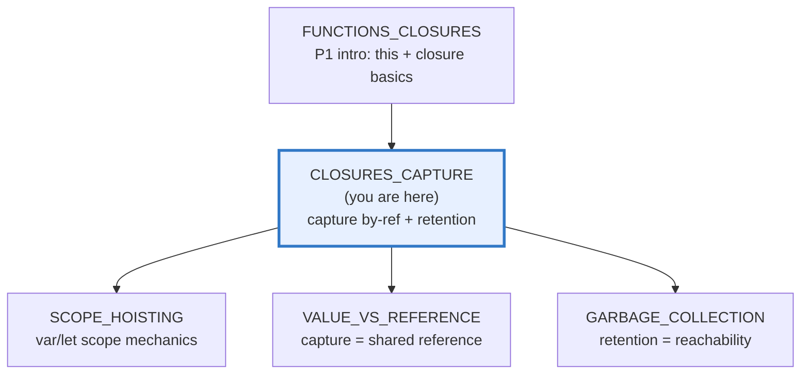
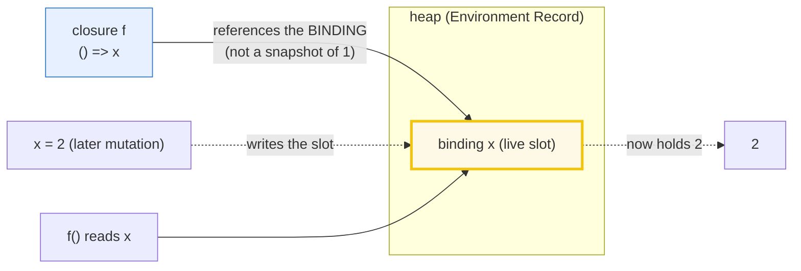
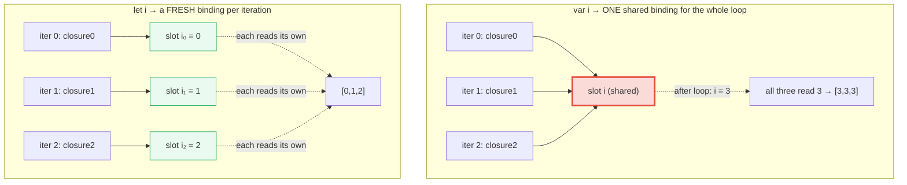
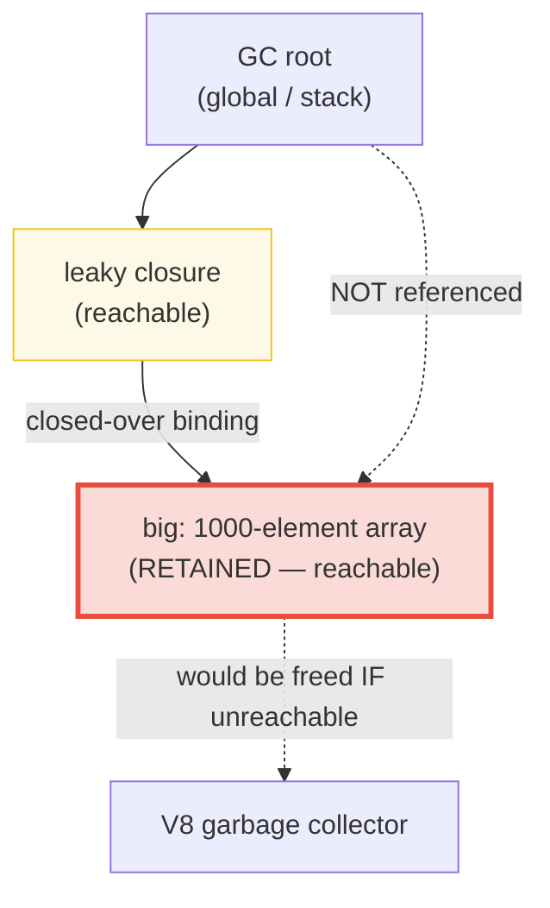

# CLOSURES_CAPTURE — Capture by Reference, Retention & the Cross-Language Model

> **Goal (one line):** show, by printing every value, that a JS closure is a
> function + its **captured environment**, that capture is **always by
> reference** (a *live* binding — never by value, never by move), and how that
> single fact produces the counter factory, the module pattern, the loop-var
> trap (and the pre-`let` IIFE fix), and the retention-as-a-leak pattern — then
> contrast JS's one implicit capture mode against Rust's explicit
> `Fn`/`FnMut`/`FnOnce` + `move`.
>
> **Run:** `just run closures_capture`
>
> **Ground truth:** [`core/closures_capture.ts`](./core/closures_capture.ts)
> → captured stdout in
> [`core/closures_capture_output.txt`](./core/closures_capture_output.txt).
> Every number/table below is pasted **verbatim** from that file under a
> `> From closures_capture.ts Section X:` callout. Nothing is hand-computed.
>
> **Prerequisites:** 🔗 [`FUNCTIONS_CLOSURES`](./FUNCTIONS_CLOSURES.md) (P1 —
> the intro: first-class functions, `this` binding, and the closure *basics*).
> **This bundle goes DEEPER** on the capture/retention mechanics P1 only
> gestured at; it does **not** re-teach `this` or first-class functions.

---

## 1. Why this bundle exists (lineage)

A **closure** is, in MDN's exact words, *"the combination of a function bundled
together (enclosed) with references to its surrounding state (the lexical
environment)."* The decisive word is **references**. When an inner function is
*created*, it keeps a live link to the variable **bindings** of the scope it was
defined in — and that environment stays alive on the heap as long as the closure
is reachable.

[`FUNCTIONS_CLOSURES`](./FUNCTIONS_CLOSURES.md) (P1) introduced that idea and
the counter factory, then moved on to `this`. **This bundle (P3) stops and digs
into the three consequences that make capture the most load-bearing mechanic in
JS**:

1. **Capture is BY REFERENCE (a live binding).** The closure does not snapshot
   the value at creation; it captures the *variable*. Mutations after creation
   are visible to the closure. This is the root of the counter factory, the
   module pattern, and the shared-mutability bug class.
2. **The loop-var trap.** Because capture is over the *binding*, whether N
   closures see the same value depends on whether N loops gave them **N
   bindings** or **one shared binding**. `var` gives one shared slot (`[3,3,3]`);
   `let` gives a fresh per-iteration slot (`[0,1,2]`); and before `let` existed,
   the only fix was to **synthesize** per-iteration capture with an IIFE.
3. **Capture & retention.** As long as a closure is reachable, every binding it
   closed over is reachable — and therefore **not collectable**. Closing over a
   large object you barely use is the canonical accidental-retention leak.



**The headline cross-language contrast is the whole point of Section E:**

> 🔗 [`../rust/CLOSURES.md`](../rust/CLOSURES.md) — Rust makes capture mode
> **explicit and typed**: `Fn` (by shared ref `&T`), `FnMut` (by mut ref
> `&mut T`), `FnOnce` (by **move** — consumes, callable once), plus the `move`
> keyword that forces every capture to be by value. JS has **one** capture mode
> — by reference — with **no** annotation, **no** move, and **no** compile-time
> ownership. That is *why* retention leaks are a JS-shaped problem: the engine,
> not the type system, decides what stays alive.
>
> 🔗 [`../go/FUNCTIONS_CLOSURES.md`](../go/FUNCTIONS_CLOSURES.md) — Go shares
> the exact loop-var-capture bug **before Go 1.22** (all loop closures saw the
> final iteration variable). Go 1.22 fixed it by making the loop variable
> per-iteration — the same semantic fix `let` delivered to JS in ES2015, a
> decade earlier. Same bug class, same fix, two runtimes.

---

## 2. The mental model: closure = function + captured bindings (live)

A closure is not "a function that remembers some values." It is a function plus
a **live pointer to a lexical environment** (a chain of variable *bindings*).
The bindings are the slots, not their current values — which is why a later
assignment to the captured variable is visible through the closure.



**The `makeAdder` factory** (MDN's canonical example) shows two closures sharing
one function body but each closing over a *different* environment — `x` is 5 in
one, 10 in the other:

> From closures_capture.ts Section A:
> ```
> makeAdder: two closures, same body, different captured env:
>   add5 = makeAdder(5);  add5(2)  -> 7    (x captured = 5)
>   add10 = makeAdder(10); add10(2) -> 12   (x captured = 10)
> [check] add5(2) === 7  (captured x = 5): OK
> [check] add10(2) === 12 (captured x = 10): OK
> ```

**THE key mechanic — capture is a LIVE binding.** This is the single fact that
separates JS capture from "capture by value." `readX` captures the *binding*
`x`, not the value `1`. Reassigning `x` *after* the closure was created changes
what `readX()` returns:

> From closures_capture.ts Section A:
> ```
> Capture BY REFERENCE (the binding is LIVE):
>   let x = 1; const readX = () => x;
>   readX()  -> 1   (value at creation)
>   x = 2;   // mutate AFTER closure creation
>   readX()  -> 2   (closure sees the NEW value — live binding)
> [check] capture is BY REFERENCE: readX() === 2 after x = 2: OK
> ```

**The counter factory — why the local survives the return.** `n` is a *local*
of `makeCounter`. Once `makeCounter` returns, `n` has no name anyone outside can
reach — yet the returned closure still references it, so V8 keeps `n` alive on
the heap. Each call mutates the *same* `n` (live binding), so the count persists
and advances. (P1 introduced this; here it is pinned as the retention
consequence of by-reference capture — the same mechanism as the Section D leak,
but intentionally useful.)

> From closures_capture.ts Section A:
> ```
> Counter factory — `n` survives makeCounter's return (closure RETAINS it):
>   c() -> 1
>   c() -> 2
>   c() -> 3
> [check] counter persists: first three calls are 1, 2, 3: OK
> ```

**Closure scope chain.** MDN: *"closures have access to all outer scopes."*
Each nested function closes over the whole chain (block → function → … →
global), not just its immediate parent. Here `e` is captured from the global
scope four levels up:

> From closures_capture.ts Section A:
> ```
> Closure scope chain — each level captures the whole enclosing chain:
>   sumChain(1)(2)(3)(4) -> 20   (1+2+3+4+10; e captured from global)
> [check] scope chain: sumChain(1)(2)(3)(4) === 20: OK
> ```

> 🔗 [`VALUE_VS_REFERENCE`](./VALUE_VS_REFERENCE.md) (P3) — "capture by
> reference" *is* the shared-reference semantics of objects, applied to variable
> bindings. When the captured binding holds an object, two closures over it see
> each other's mutations (demonstrated in Section D). The shared-mutability bug
> class lives there.

---

## 3. Section B — The module pattern: closure-enforced privacy (pre-`#private`)

Before ES2022 `#private` fields, JS had **no** native private state on objects.
The workaround — used by every pre-class library — was the **module pattern**: a
factory (or an IIFE) creates a private lexical environment and returns an object
whose methods **close over** that environment. The private variables are
reachable *only* through those methods. This is data hiding / encapsulation
built entirely on capture.

> From closures_capture.ts Section B:
> ```
> Module pattern — `balance` is PRIVATE (closure-enforced):
>   bank.deposit(100); bank.withdraw(30);
>   bank.getBalance()  -> 70
> [check] module state: bank.getBalance() === 70: OK
> ```

**Proof of privacy.** `balance` is **not** a property of the returned object.
It lives only inside the factory's lexical environment, reachable solely via the
methods that closed over it. There is no `bank.balance` to read or overwrite:

> From closures_capture.ts Section B:
> ```
> Proof of privacy — balance is NOT an own property of `bank`:
>   Object.keys(bank).sort() -> ["deposit","getBalance","withdraw"]
>   "balance" in bank        -> false
> [check] "balance" is NOT a property of bank (closure-private): OK
> [check] bank own keys are exactly [deposit,getBalance,withdraw] (no balance): OK
> ```

**The IIFE form (the classic module pattern).** The IIFE runs *once*, builds the
private environment, and returns the public API. The three returned methods
share **one** lexical environment (one `privateCounter`, one `changeBy`) —
exactly MDN's *"shared lexical environment"* counter example. An **IIFE**
(*Immediately Invoked Function Expression*) is, per MDN's glossary, *"an idiom
in which a JavaScript function runs as soon as it is defined"* — it exists to
create a fresh scope *and* execute it immediately.

> From closures_capture.ts Section B:
> ```
> IIFE module — three methods share ONE private lexical environment:
>   modCounter.increment(); increment(); decrement();
>   modCounter.value() -> 1
> [check] IIFE module shared env: modCounter.value() === 1: OK
> ```

**Independence — each factory call makes a SEPARATE private environment.** MDN:
*"the two counters maintain their independence… Each closure references a
different version of the privateCounter variable."* This is the flip side of
by-reference capture: each call's environment is its *own* heap object, so two
counters do **not** share state:

> From closures_capture.ts Section B:
> ```
> Independence — each factory call = a separate private environment:
>   a1 = createBank(); a2 = createBank(); a1.deposit(50);
>   a1.getBalance() -> 50   a2.getBalance() -> 0
> [check] counters are independent: a2.getBalance() === 0 (not affected by a1): OK
> ```

> 🔗 [`SCOPE_HOISTING`](./SCOPE_HOISTING.md) — the IIFE "creates a scope"
> because **every function call creates a new environment record**. That bundle
> owns the var/let/const scope rules (hoisting, TDZ, block vs function scope)
> that this one leans on.

---

## 4. Section C — The loop-var capture trap: `var` `[3,3,3]` vs `let` `[0,1,2]` vs the IIFE fix

This is the most famous closure bug in JS. The bug was never "closures are
broken" — it was *"var gave every closure the same binding."*



**`var` → ONE shared binding → every closure sees the FINAL value.** `var i` is
function-scoped and hoisted, so there is exactly **one** slot `i`. Every closure
pushed in the loop closes over that *same* slot. By the time the closures *run*
(after the loop), `i` is `3` — so every closure returns `3`. MDN: *"Three
closures have been created by the loop, but each one shares the same single
lexical environment… `item` is declared with `var` and thus has function scope
due to hoisting."*

> From closures_capture.ts Section C:
> ```
> var: ONE shared loop binding -> every closure sees the FINAL value:
>   for (var i = 0; i < 3; i++) fns.push(() => i);
>   fns.map(fn => fn()) -> [3,3,3]
> [check] var loop-var trap: result is [3,3,3]: OK
> ```

**`let` → a FRESH per-iteration binding → each closure captures its own value.**
`let i` in a `for` header creates a **new binding on each iteration** (a
*per-iteration binding*). Each closure closes over a *different* slot holding
that iteration's value of `i`. The bug vanishes. (The same semantic fix Go 1.22
applied to its loop variable — see the Go cross-ref above.)

> From closures_capture.ts Section C:
> ```
> let: a FRESH per-iteration binding -> each closure captures its own value:
>   for (let i = 0; i < 3; i++) fns.push(() => i);
>   fns.map(fn => fn()) -> [0,1,2]
> [check] let per-iteration binding: result is [0,1,2]: OK
> ```

**The pre-`let` IIFE fix — synthesize per-iteration capture by hand.** Before
`let` existed (ES2015), the *only* way to fix this was to wrap the body in an
IIFE that takes `i` as an **argument**. Function parameters are
per-invocation bindings, so each iteration's IIFE gets its *own* `j`, and the
inner closure captures *that* `j`. This is "capture by value" simulated via an
extra function call — exactly the pattern pre-ES2015 code used everywhere.

> From closures_capture.ts Section C:
> ```
> Pre-`let` IIFE fix — a fresh parameter binding per iteration:
>   for (var i = 0; i < 3; i++) { (function (j) { fns.push(() => j); })(i); }
>   fns.map(fn => fn()) -> [0,1,2]
> [check] IIFE fix yields [0,1,2] (per-call parameter binding): OK
> [check] let-fix and IIFE-fix are behaviorally identical (both [0,1,2]): OK
> ```

**The general lesson.** Capture is over the *binding*, and bindings nest. The
IIFE works because a function **call** creates a new environment. `let` works
because a **block** creates a new environment. Both give the closure a distinct
binding to close over. The fix and the IIFE fix are behaviorally identical —
both produce `[0,1,2]` — which is the last `check` above.

> 🔗 [`SCOPE_HOISTING`](./SCOPE_HOISTING.md) — this bundle only covers the
> *closure-capture consequence* and the IIFE-fix-before-`let` history. The full
> var/let/const **scope** mechanics (hoisting, the temporal dead zone, block vs
> function scope) live there.

---

## 5. Section D — Capture & retention: a closure keeps a large object alive (leak)

The flip side of by-reference capture: **as long as a closure is reachable,
every binding it closed over is also reachable, and therefore not collectable.**
This is the canonical accidental-retention leak pattern.



**The leak pattern — closing over MORE than you use.** This factory builds a big
object, then returns a closure that only reads `big.length`. But the closure
references `big` (the *whole* array), so `big` is retained for the closure's
entire reachable lifetime — even though the closure never reads a single
element. The outer function has **returned**; the only thing keeping `big`
alive is the closure's captured reference.

> From closures_capture.ts Section D:
> ```
> Leak pattern — closure closes over a big object it barely uses:
>   function makeLeakyReader() {
>     const big = makeBig(1000);      // 1000-element array
>     return () => big.length;         // closes over the WHOLE `big`
>   }
>   const leaky = makeLeakyReader();  // outer fn has returned
>   leaky() -> 1000   // `big` is STILL alive (retained by the closure)
> [check] retention: leaky() === 1000 (closure keeps `big` alive after return): OK
> ```

**The fix — capture only the PRIMITIVE you need.** If the closure closes over
`len` (a number primitive) instead of `big` (the array), then `big` has **no**
remaining reference once the factory returns and becomes eligible for
collection. The closure still works, but it no longer pins a large structure on
the heap.

> From closures_capture.ts Section D:
> ```
> Fix — capture only the primitive you need (`big` becomes collectable):
>   function makeLeanReader() {
>     const big = makeBig(1000);
>     const len = big.length;        // destructure the needed value
>     return () => len;               // closes over `len`, NOT `big`
>   }
>   const lean = makeLeanReader();
>   lean() -> 1000   // same answer; `big` is no longer referenced
> [check] lean reader: lean() === 1000 (same answer, no big-object retention): OK
> ```

**Reachability is the precondition (provable); GC timing is not.** We **cannot**
prove `big` was freed — collection timing is engine-dependent and
nondeterministic (so this bundle never asserts it; see §4.2 rules 1–2). But we
**can** prove the *structural* precondition: the leaky closure holds a path to
a 1000-element object, the lean one does not. *"Reachable from a root ⇒
retained"* is the rule; the leaky closure *is* that root for `big`.

> From closures_capture.ts Section D:
> ```
> Reachability is the precondition (GC timing is NOT asserted here):
>   leaky holds a captured reference to a 1000-element array -> it is reachable
>   lean  holds only a captured number               -> the array is NOT reachable from it
> [check] both readers agree on length (1000); only the leaky one retains the array: OK
> ```

**Shared mutability via capture (the by-reference consequence).** Because
capture is by reference, two closures over the **same** object see each other's
mutations. This is the 🔗 `VALUE_VS_REFERENCE` bug class expressed *through*
closures: an object captured by a closure is a shared reference.

> From closures_capture.ts Section D:
> ```
> Shared mutability via capture (by-reference consequence):
>   const shared = { count: 0 };
>   const increment = () => { shared.count += 1; };
>   const readCount = () => shared.count;
>   increment(); increment(); readCount() -> 2
> [check] two closures over one object see the same mutations (shared reference): OK
> ```

> 🔗 [`GARBAGE_COLLECTION`](./GARBAGE_COLLECTION.md) (P3) — this bundle
> demonstrates the **reachability precondition** for retention (provable without
> running the collector). V8's generational Orinoco collector, `WeakRef`, and
> `FinalizationRegistry` — the actual reclamation machinery — live there.

---

## 6. Section E — Idioms built on capture + the cross-language capture model

Three idioms that exist *because* capture is by reference and the captured
state persists across calls.

**`memoize` — a result cache held in a closure.** The cache `Map` is captured by
the returned function. A repeat call with the same key returns the cached value
**without** re-running `fn`. The `.ts` counts how many times the underlying `fn`
*actually* ran to prove the cache hit:

> From closures_capture.ts Section E:
> ```
> memoize — a result cache held in a closure:
>   squareCached("12") -> 144
>   squareCached("12") -> 144   (cache HIT: fn not re-run)
>   squareCached("5")  -> 25   (cache MISS: fn runs)
>   underlying fn actually ran 2 time(s)
> [check] memoize: 12*12 === 144: OK
> [check] memoize: repeat call returns cached 144: OK
> [check] memoize: fn ran exactly twice (2 unique keys: 12 and 5): OK
> ```

**`once` — run exactly once, cache the first result (flag in closure).** The
`done` flag and cached result live in the closure. Every later call returns the
*first* result without re-invoking `fn`:

> From closures_capture.ts Section E:
> ```
> once — run exactly once, cache the first result (flag in closure):
>   initialize() -> "initialized"
>   initialize() -> "initialized"   (cached; fn NOT re-run)
>   initialize() -> "initialized"   (cached; fn NOT re-run)
>   underlying fn actually ran 1 time(s)
> [check] once: every call returns the first result "initialized": OK
> [check] once: fn ran exactly once across three calls: OK
> ```

**`curry` / partial application — nested closures capture args step by step.**
Each partial application is a closure over the arguments captured so far:

> From closures_capture.ts Section E:
> ```
> curry / partial application — nested closures capture args step by step:
>   add(1)(2)(3)       -> 6
>   const addOne = add(1); addOne(2)(3) -> 6   (partial application)
>   addOneTwo(3)       -> 6
> [check] curry: add(1)(2)(3) === 6: OK
> [check] curry: partial application addOne(2)(3) === 6: OK
> ```

**`this` recap (brief — P1 owns the detail).** An arrow function captures
**lexical `this`** — it is a closure *over `this`*. A classic `function` does
not; its `this` is set by the call site (and is `undefined` when detached in
strict mode — the famous this-loss trap covered in P1):

> From closures_capture.ts Section E:
> ```
> `this` recap — arrow captures lexical this (a closure over `this`):
>   const counter = { n: 0, tickArrow() { const inner = () => ++this.n; return inner(); } };
>   counter.tickArrow() -> 1   (arrow closed over method `this` == counter)
> [check] arrow captures lexical this: counter.tickArrow() === 1: OK
> ```

**The cross-language capture model — THE contrast.** JS has exactly **one**
capture mode: by reference (a live binding). There is no choice, no annotation,
no compile-time ownership. Rust makes capture **explicit and typed** via three
traits, plus the `move` keyword that forces capture-by-value. This is what makes
"JS closures always capture by reference" vivid — and why retention leaks are a
JS-shaped problem (the engine, not the type system, decides what stays alive):

> From closures_capture.ts Section E:
> ```
> Cross-language capture model — JS (one implicit mode) vs Rust (explicit + typed):
>   JS:  capture is ALWAYS by reference (a live binding). No choice, no
>        annotation, no move. The captured variable stays alive as long as
>        the closure is reachable (the Section D retention rule).
>   Rust Fn    : captures by shared reference (&T)        — callable many times
>   Rust FnMut : captures by mutable reference (&mut T)   — callable many times, may mutate
>   Rust FnOnce: captures by MOVE (owns T)               — callable exactly ONCE
>   Rust `move` keyword: forces every capture to be BY VALUE (a move),
>        overriding the compiler's by-ref default. JS has NO equivalent.
> [check] JS capture mode is singular (by-reference); Rust exposes 3 traits + move: OK
> ```

| Language | Capture modes | Capture choice | Ownership / move | Who decides retention |
|---|---|---|---|---|
| **JS / TS** | **by reference only** (live binding) | none (implicit, always) | none | the GC (runtime reachability) |
| **Rust** | `Fn` (&T), `FnMut` (&mut T), `FnOnce` (move) | **explicit** (trait bound) | **yes** (`move`, `FnOnce`) | the borrow checker (compile time) |
| **Go** | by reference (like JS) | none | none | the GC (runtime reachability) |

---

## 7. Pitfalls (the expert payoff)

| Trap | Symptom | Fix |
|---|---|---|
| `for (var i …)` + closures in loop | every closure sees the **final** `i` (`[3,3,3]`) | Use `let`/`const` (per-iteration binding). On legacy code, the IIFE `(function(j){ … })(i)` fix. |
| Assuming capture snapshots the value | closure returns a *later* value after the var is reassigned | Remember: capture is the **binding** (live), not a snapshot. Capture a primitive copy (`const len = big.length`) if you want a snapshot. |
| Closing over a large object you barely use | the whole object is **retained** for the closure's lifetime (leak) | Capture only what you need (destructure to a primitive); or null the ref when done. |
| Two closures "should" be independent but share state | they close over the **same** outer binding | Give each its own binding (factory call, or block-scoped `let`). |
| `bank.balance` "should" be private | it isn't — it's a plain property, publicly writable | Hide it in a closure (factory/IIFE) or use ES2022 `#balance`. |
| Returning a method detached from its object | `this` is `undefined` (strict mode) → throw | Bind it (`.bind(obj)`), or use an **arrow** (captures lexical `this`). See 🔗 `FUNCTIONS_CLOSURES`. |
| Closure over a shared object mutated elsewhere | two closures see each other's mutations (aliasing bug) | Treat captured objects as shared; copy/clone if isolation is needed. See 🔗 `VALUE_VS_REFERENCE`. |
| Capturing a loop var in an async callback | callback reads the *post-loop* value (same as the var trap) | `let` per-iteration binding; or capture via an IIFE / `forEach` parameter. |
| Unbounded `memoize` cache | the cache grows without limit (a retention leak) | Cap the cache (LRU), or use `WeakMap` when keys are objects. |
| Creating closures in a hot loop / constructor unnecessarily | per-instance closures cost memory + speed | Put methods on the prototype (one shared function), not the instance. |
| `this` inside a classic callback | loses the receiver | Arrow (lexical `this`) or `.bind`. |

---

## 8. Cheat sheet

```typescript
// === Closure = function + captured environment =============================
//   A closure is "a function bundled with references to its surrounding state
//   (the lexical environment)" (MDN). Created at function CREATION time.
//   The captured environment stays alive as long as the closure is reachable.

// === Capture is ALWAYS BY REFERENCE (a LIVE binding) =======================
//   The closure captures the BINDING (the slot), not a value snapshot:
//     let x = 1; const f = () => x; x = 2; f() === 2   // live binding
//   Never by value, never by move. This is JS's ONLY capture mode.

// === Counter factory — the local survives the return =======================
//   function makeCounter() { let n = 0; return () => ++n; }
//   const c = makeCounter();  c() -> 1, 2, 3   (n retained on the heap)

// === Module pattern — closure-enforced privacy (pre-#private) =============
//   function createBank() {
//     let balance = 0;                       // PRIVATE (not a property)
//     return { deposit(n){ balance += n }, getBalance(){ return balance } };
//   }
//   "balance" in bank === false   // reachable only via the methods

// === The loop-var trap =====================================================
//   for (var i=0;i<3;i++) fns.push(()=>i);  fns.map(f=>f()) -> [3,3,3]  // ONE shared slot
//   for (let i=0;i<3;i++) fns.push(()=>i);  fns.map(f=>f()) -> [0,1,2]  // per-iteration slot
//   // pre-`let` IIFE fix (synthesizes per-iteration capture):
//   for (var i=0;i<3;i++){ (function(j){ fns.push(()=>j); })(i); }       // [0,1,2]

// === Retention / leak (capture keeps big obj alive) ========================
//   function makeLeaky(){ const big = makeBig(1000); return () => big.length; }
//   // `big` retained for the closure's lifetime (barely used -> accidental leak)
//   // FIX: capture only the primitive  ->  const len = big.length; return () => len;

// === Idioms built on capture ===============================================
//   memoize(fn)  // cache Map held in closure; repeat calls skip fn
//   once(fn)     // `done` flag in closure; runs fn exactly once
//   curry        // add(a)(b)(c) — nested closures capture args step by step
//   debounce/throttle // (not shown) timer-id held in closure across calls

// === this recap (P1 owns detail) ===========================================
//   arrow  : captures lexical `this` (a closure over `this`)
//   classic: `this` set by the CALL SITE (undefined when detached, strict mode)

// === Cross-language capture model ==========================================
//   JS  : by-reference ONLY. No choice, no annotation, no move, no ownership.
//   Rust: Fn (&T) | FnMut (&mut T) | FnOnce (move, once) + `move` keyword.
//         Capture mode is EXPLICIT and typed; retention decided at COMPILE time.
```

---

## Sources

Every behavioral claim above was verified against the MDN Web Docs and the
ECMAScript specification, then corroborated by at least one independent
secondary source. Every JS result is *additionally* asserted at runtime by the
`.ts` itself (`check()` throws on any mismatch) — the strongest possible
verification: the actual V8 engine's verdict.

- **MDN — Closures** (the deep guide; the verbatim definition *"the combination
  of a function bundled together (enclosed) with references to its surrounding
  state (the lexical environment)"*; `makeAdder` *"share the same function body
  definition, but store different lexical environments"*; the module/IIFE
  counter with a *"shared lexical environment"*; loop-mistake *"each one shares
  the same single lexical environment… `var`… has function scope due to
  hoisting"*; the IIFE/`makeHelpCallback` fix *"creates a new lexical
  environment for each callback"*; the `let` fix *"every closure binds the
  block-scoped variable"*; closures over imported *"live bindings"*; the scope
  chain *"closures have access to all outer scopes"*):
  https://developer.mozilla.org/en-US/docs/Web/JavaScript/Guide/Closures
- **MDN — `let` statement** (block scope; the per-iteration binding semantics
  in a `for` header that fix the loop-var-capture trap; the temporal dead zone):
  https://developer.mozilla.org/en-US/docs/Web/JavaScript/Reference/Statements/let
- **MDN — IIFE (Glossary)** (*"an idiom in which a JavaScript function runs as
  soon as it is defined"* — the mechanism behind the classic module pattern and
  the pre-`let` loop-var fix):
  https://developer.mozilla.org/en-US/docs/Glossary/IIFE
- **MDN — Memory management** (*"JavaScript automatically allocates memory when
  objects are created and frees it when they are not used anymore (garbage
  collection)"* — the reachability model behind the Section D retention pattern):
  https://developer.mozilla.org/en-US/docs/Web/JavaScript/Guide/Memory_management

**Secondary corroboration (independent of MDN, ≥1 per major claim):**
- **Axel Rauschmayer (2ality) — "Closures in JavaScript" / "Speaking JavaScript"**
  (closure = function + connection to the scope it was created in; the
  per-iteration-binding explanation). *Note: 2ality.com is temporarily offline
  at time of writing; the canonical reference is Rauschmayer's "Exploring JS" /
  "JavaScript for Impatient Programmers" §"Closures":*
  https://exploringjs.com/impatient-js/ch_callables.html#sec-closures
- **null program (Chris Wellons) — "Per Loop vs. Per Iteration Bindings"**
  (*"Loop variables are now fresh bindings for each iteration of the loop: a
  per-iteration binding"* — the precise mechanism by which `let` fixes the
  loop-var-capture trap): https://nullprogram.com/blog/2014/06/06/
- **Ben Alman — "Immediately-Invoked Function Expression"** (coined the term
  "IIFE"; the pre-`let` loop-var-fix history and the module pattern):
  https://benalman.com/news/2010/11/immediately-invoked-function-expression/
- **Jake Archibald — "Garbage collection and closures" (2024)** (V8's nuanced
  retention behavior — a closure can retain more than its body literally
  references, which is *why* the Section D "capture only what you need" fix
  matters): https://jakearchibald.com/2024/garbage-collection-and-closures/
- **Kyle Simpson — "You Don't Know JS Yet: Scope & Closures" (2nd ed.)** (the
  canonical book-length treatment of lexical scope, closure, and the
  loop-variable capture hazard):
  https://github.com/getify/You-Dont-Know-JS/tree/2nd-ed/scope-closures

**Facts that could not be verified by running** (documented, not executed,
because they are language-design facts or behavior in another language): the
Rust `Fn`/`FnMut`/`FnOnce` + `move` capture model is a documented language
design, not executable in this TypeScript runtime (it is run in the sibling
[`../rust/CLOSURES.md`](../rust/CLOSURES.md)); the Go pre-1.22 loop-var bug and
its 1.22 per-iteration fix are documented Go history (run in
[`../go/FUNCTIONS_CLOSURES.md`](../go/FUNCTIONS_CLOSURES.md)); and actual GC
*reclamation timing* of a retained object is engine-dependent and
nondeterministic, so this bundle asserts only the **reachability precondition**
for retention (provable structurally), never the collection event itself.
