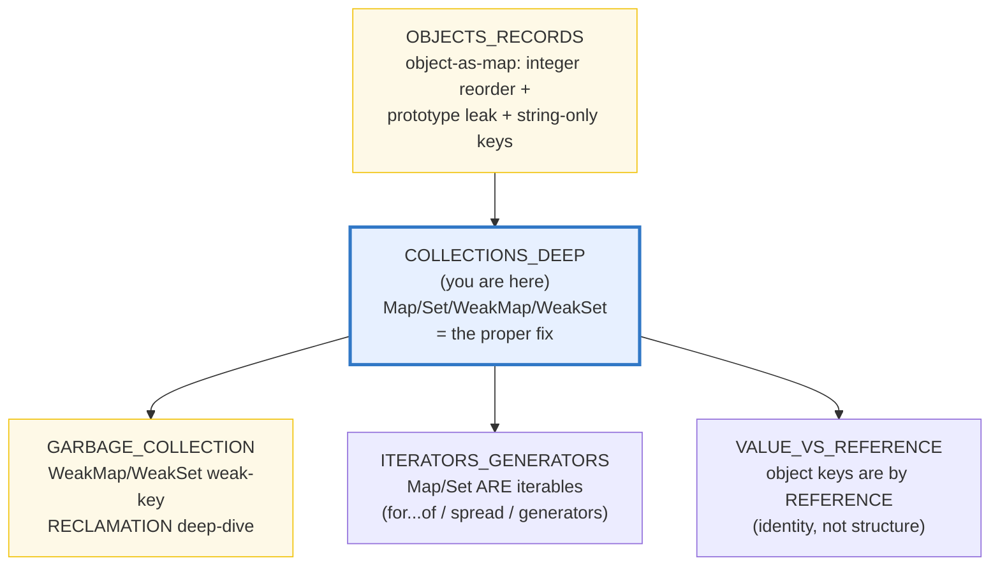
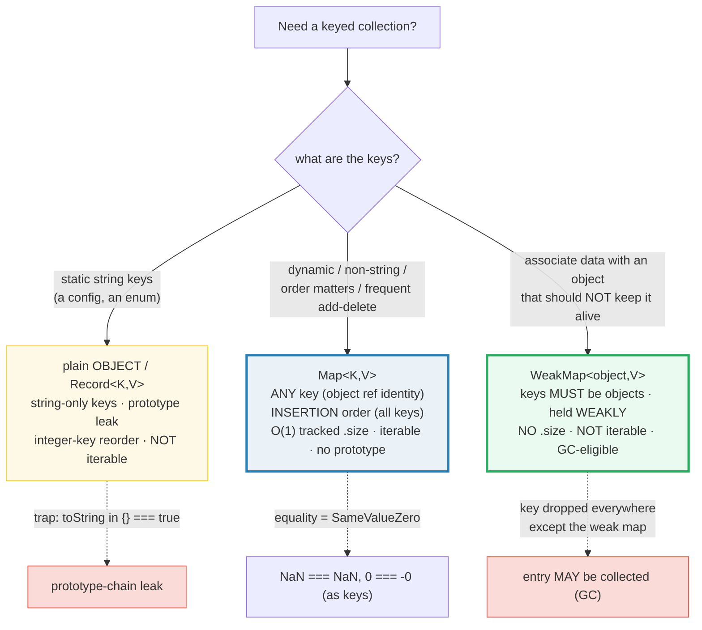

# COLLECTIONS_DEEP — `Map` / `Set` / `WeakMap` / `WeakSet` (Proper Collections)

> **Goal (one line):** show, by printing every value, how ES2015's
> `Map`/`Set`/`WeakMap`/`WeakSet` behave as **proper collections** — `Map`'s
> any-key + insertion-order + **SameValueZero** equality (NaN as a key), `Set`'s
> dedup + the **new ES2025 set algebra**, `WeakMap`/`WeakSet`'s weak keys, and
> the **Map-vs-object-as-map** decision that fixes the `OBJECTS_RECORDS`
> integer-key-reorder trap.
>
> **Run:** `just run collections_deep`
>
> **Ground truth:** [`core/collections_deep.ts`](./core/collections_deep.ts) →
> captured stdout in
> [`core/collections_deep_output.txt`](./core/collections_deep_output.txt).
> Every number/table below is pasted **verbatim** from that file under a
> `> From collections_deep.ts Section X:` callout. Nothing is hand-computed.
>
> **Prerequisites:** 🔗 [`OBJECTS_RECORDS`](./OBJECTS_RECORDS.md) — it pinned
> the object-as-map's **integer-index-keys-first** reorder trap and the
> prototype-chain leak; this bundle is the **proper-collections fix** for both.
> 🔗 [`GARBAGE_COLLECTION`](./GARBAGE_COLLECTION.md) — it owns the *reclamation*
> deep-dive for `WeakMap`/`WeakSet`; this bundle covers them as *data structures*
> (the API + the weak-retention contract).

---

## 1. Why this bundle exists (lineage)

Before ES2015, the only way to make a "map" in JS was a **plain object**: `obj[k] =
v`. That worked — but it leaked three problems that bit every working engineer:

1. **Keys are coerced to strings.** `obj[{}] = 1` silently stores the value under
   the key `"[object Object]"`. Two distinct objects become the **same** key.
   Numbers, booleans, and symbols are mangled or rejected.
2. **Integer-index keys reorder ascending.** `Object.keys({ 2:1, 1:1, b:1, a:1 })`
   returns `["1","2","b","a"]`, **not** the written order (🔗 `OBJECTS_RECORDS`
   §4). Insertion order is *not* the whole story for objects.
3. **The prototype chain leaks.** `"toString" in {} === true` — every plain
   object inherits a clutch of keys from `Object.prototype`, so a naive
   `"k" in obj` presence check lies (🔗 `OBJECTS_RECORDS` §2).

ES2015 added `Map`/`Set`/`WeakMap`/`WeakSet` as **proper collections** that fix
all three: `Map` keeps **every** key (string, number, object, function, symbol,
even `NaN`) in **guaranteed insertion order**, exposes an O(1) tracked `.size`,
is **directly iterable**, and has **no prototype**. `Set` is the unique-value
collection. `WeakMap`/`WeakSet` hold their **keys** weakly — eligible for GC —
which is the foundation of privacy and memoization patterns (🔗
`GARBAGE_COLLECTION`).



The headline contrast with sibling languages is the whole point of this bundle:

> 🔗 [`../go/MAPS.md`](../go/MAPS.md) — Go's `map[K]V` iteration order is
> **intentionally randomized on every `range`** (the runtime deliberately
> shuffles it to stop you depending on it), so you must **always sort keys before
> printing**. `Map` is the **opposite failure mode**: it gives you a *fully
> deterministic* insertion order for **all** key types — including integer-like
> ones that an object silently reorders. Determinism, but without the surprise.

> 🔗 [`../rust/COLLECTIONS.md`](../rust/COLLECTIONS.md) — Rust gives you a
> **choice**: `HashMap<K,V>` (no order guarantee, hash-seed randomized) **or**
> `BTreeMap<K,V>` (keys **sorted**, a balanced tree). JS `Map` is a **third
> model**: deterministic **insertion** order (like a linked hash map), but **not**
> sorted. If you need sorted keys you `Array.from(map).sort()` yourself.

---

## 2. The mental model: object-as-map vs `Map` vs `WeakMap`

A plain object, a `Map`, and a `WeakMap` are three different things. The diagram
below is the decision you make every time you reach for a keyed collection:



> From `developer.mozilla.org/en-US/docs/Web/JavaScript/Reference/Global_Objects/Map`
> (verbatim): *"The **`Map`** object holds key-value pairs and remembers the
> original insertion order of the keys. Any value (both objects and primitive
> values) may be used as either a key or a value."* And: *"Key equality is based
> on the [SameValueZero](https://developer.mozilla.org/en-US/docs/Web/JavaScript/Equality_comparisons_and_sameness)
> algorithm."* MDN's *Keyed collections* guide confirms: *"Both the key equality
> of `Map` objects and the value equality of `Set` objects are based on the
> SameValueZero algorithm."*

**SameValueZero** — the one equality fact to internalize — is `===` *except*
`NaN === NaN` is **`true`** (and `0 === -0` stays `true`). This is why a `Map`
can use `NaN` as a key (where `NaN === NaN` would be `false` under plain `===`),
and why `Set` dedups `NaN`. Section A pins both.

> From `developer.mozilla.org/en-US/docs/Web/JavaScript/Reference/Global_Objects/WeakMap`
> (verbatim): *"A `WeakMap` is a collection of key/value pairs whose keys must be
> objects or non-registered symbols, with values of any arbitrary JavaScript
> type."* It is *"not iterable and does not have a `size` property"* because a
> primitive key *"can be forged"* (it would stay in the structure forever) and
> because exposing the key set would let you observe GC liveness.

---

## 3. Section A — `Map` basics: ANY key + insertion order + SameValueZero

> From collections_deep.ts Section A:
> ```
> Map built via new Map().set("a",1).set("b",2).set("c",3):
>   m.get("a") -> 1
>   m.get("b") -> 2
>   m.size    -> 3
>   m.has("c") -> true
>   m.has("z") -> false
>   m.get("z") -> undefined   (absent key -> undefined, NOT an error)
> [check] Map.get("a") === 1: OK
> [check] Map.size === 3 after 3 entries: OK
> [check] Map.has("c") === true: OK
> [check] Map.has("z") === false (absent): OK
> [check] Map.get("z") === undefined (absent -> undefined): OK
> ```
> ```
> After m.set("d",4) and m.set("a",99) (overwrite existing key):
>   m.get("a") -> 99   (value overwritten)
>   m.size    -> 4   (overwrite does NOT grow size)
> [check] Map.set overwrites an existing key (a -> 99): OK
> [check] Map.set of an EXISTING key keeps size (now 4): OK
>   m.delete("a") -> true   m.delete("z") -> false  (absent -> false)
> [check] Map.delete("a") returns true (existed): OK
> [check] Map.delete("z") returns false (absent): OK
> [check] Map.delete dropped the entry (size now 3): OK
> [check] Map.delete removed the key (!has): OK
> ```

**`set`/`get`/`has`/`delete`/`size`/`clear`.** `get` on an absent key returns
`undefined` (never throws — the same "absent is not an error" rule as object
property access, 🔗 `OBJECTS_RECORDS` §3). `set` returns the map (chainable);
`delete` returns a **boolean** (was it present?); `size` is an O(1) tracked
property, *not* a method. Overwriting an existing key changes the value but
**keeps the key's original insertion slot** (Section E pins the re-insert
exception: delete-then-set moves it to the end).

**ANY key type — the headline advantage.** Section A's next block proves `Map`
takes objects, functions, symbols, **and** `NaN` as keys:

> From collections_deep.ts Section A:
> ```
> ANY KEY TYPE: Map accepts objects, functions, symbols, and NaN as keys
>   (a plain object COERCES keys to strings — an object key becomes "[object Object]").
>   map.get(objKey) -> by-object
>   map.get(fnKey)  -> by-function
>   map.get(symKey) -> by-symbol
>   map.get(NaN)    -> by-nan   (NaN IS a valid Map key)
> [check] Map: object key works (get by same object reference): OK
> [check] Map: function key works: OK
> [check] Map: symbol key works: OK
> [check] Map: NaN is a valid key (SameValueZero treats NaN === NaN): OK
> ```

**Object keys are by REFERENCE IDENTITY, not structure.** This is the
value-vs-reference axis (🔗 `VALUE_VS_REFERENCE`) applied to keys:

> From collections_deep.ts Section A:
> ```
> KEY IDENTITY: the key is the object REFERENCE, not its structure.
>   map.get({id:1} lookalike) -> undefined  (different ref -> undefined)
> [check] Map: a structurally-equal but DISTINCT object is NOT the same key: OK
> [check] Map: the original objKey ref still resolves: OK
> ```

A `{ id: 1 }` you just constructed is a **different** key from the `{ id: 1 }`
you stored — they are distinct heap objects (🔗 `VALUE_VS_REFERENCE`: two
structurally-equal objects are never `===`). So `map.get(newObj)` misses even
when `newObj` is structurally identical. This is the price of the "any key"
power: object keys must be **held by the same reference** you used to set them.

**SameValueZero — NaN as a key, and `0 === -0`.** The two checks below are the
ones that `===` gets "wrong" but `Map`/`Set` get "right":

> From collections_deep.ts Section A:
> ```
> SAMEVALUEZERO key equality (what Map/Set use for keys):
>   like === EXCEPT NaN === NaN is TRUE (and 0 === -0 stays TRUE).
>   map.set(NaN,"first").set(NaN,"second").size -> 1   (NaN deduped)
>   map.get(NaN) -> second
> [check] Map: NaN === NaN under SameValueZero (size 1 after two NaN sets): OK
> [check] Map: second set(NaN) overwrote the first (get -> "second"): OK
>   map.set(0,"zero").set(-0,"neg-zero").size -> 1   (0 and -0 are ONE key)
>   map.get(0)  -> neg-zero
>   map.get(-0) -> neg-zero   (both resolve the same entry)
> [check] Map: 0 === -0 under SameValueZero (size 1): OK
> [check] Map: get(0) === get(-0) (same entry): OK
> ```

Recall from 🔗 `VALUES_TYPES_COERCION` §6 that `NaN === NaN` is `false` and
`0 === -0` is `true` under `===`. `SameValueZero` flips the first (so `NaN`
dedups) and keeps the second. (There is a third algorithm, `SameValue` — what
`Object.is` uses — that treats `0` and `-0` as **distinct**; `Map`/`Set` do
**not** use that one.) This is the **determinism** anchor for the whole bundle:
because `Map`/`Set` key equality is fully specified, every sequence below is
byte-identical across runs.

**Insertion order — the centerpiece (no integer reordering).** The single block
that proves `Map` fixes the `OBJECTS_RECORDS` trap:

> From collections_deep.ts Section A:
> ```
> INSERTION ORDER: Map iterates ALL keys in insertion order (no integer reorder).
>   Map inserted "2","1","b","a"  -> keys: ["2","1","b","a"]
> [check] Map insertion order preserved (no integer-key reorder): ["2","1","b","a"]: OK
>   Object with same keys -> Object.keys: ["1","2","b","a"]   (INTEGER-FIRST reorder!)
> [check] Object REORDERS integer keys first: ["1","2","b","a"]: OK
> ```

The same four keys, `"2","1","b","a"`, iterate as `["2","1","b","a"]` in a `Map`
(pure insertion order) but as `["1","2","b","a"]` in a plain object (the
integer-index keys `"1"`,`"2"` jump to the front ascending — 🔗 `OBJECTS_RECORDS`
§4). **`Map` has no integer-key special case**: every key type follows one rule.

---

## 4. Section B — `Map` vs object-as-map decision; `Set` (dedup)

> From collections_deep.ts Section B:
> ```
> MAP vs OBJECT-AS-MAP — the decision matrix:
>   "toString" in obj     -> true   (PROTOTYPE CHAIN leaks inherited keys!)
>   map.has("toString")   -> false   (Map has NO prototype -> no inherited keys)
>   Object.keys(obj).length -> 1   (O(n) count, recomputed each call)
>   map.size               -> 1   (O(1) tracked size)
>   iterable? obj          -> false   (NOT directly iterable via for...of)
>   iterable? map          -> true   (iterable: for...of / spread)
> [check] Object-as-map leaks inherited toString via the prototype chain: OK
> [check] Map has NO inherited keys (no prototype pollution): OK
> [check] Map.size is tracked (=== 1 after 1 insert): OK
> [check] Plain object is NOT directly iterable via for...of: OK
> [check] Map IS iterable via for...of: OK
>
> Verdict: Map = the deterministic, any-key, insertion-ordered map.
>          Object-as-map = fine ONLY for static, known string keys.
> ```

**The decision in one table.** Five facts separate them:

| Property | plain object (`{}`/`Record`) | `Map` |
|---|---|---|
| Key types | strings & symbols only (others coerced to string) | **any** value (objects, functions, `NaN`, …) |
| Order | integer-keys-first ascending, then strings insertion | **insertion order for ALL keys** |
| Inherited keys | **yes** (`"toString" in {}` is `true`) | **no** (no prototype chain) |
| Size | `Object.keys(o).length` (O(n), recomputed) | **`map.size`** (O(1), tracked) |
| Iterable | no (`for...of {}` throws `TypeError`) | **yes** (`for...of`, spread, `entries`) |

**The verdict (MDN, "Maps vs Objects").** Use a plain object / `Record` only when
the keys are **static, known strings** (a config, an enum-like lookup). Reach for
`Map` whenever keys are dynamic, non-string, ordered, or frequently added and
removed — and MDN notes `Map` *"is generally faster"* for that workload (Section
E). `Record<"a"|"b", V>` is the TypeScript-**typed** form of the static-object
case (🔗 `OBJECTS_RECORDS` §7).

> 🔗 `OBJECTS_RECORDS` — this is the bundle that pinned the integer-key reorder
> and the prototype leak this section fixes. `Map.has("toString") === false` is
> the clean answer to `"toString" in {} === true`.

**`Set` — unique values, SameValueZero dedup.** `Set` is `Map`'s value-only
cousin: it stores unique values using the **same** SameValueZero equality, so it
dedups `NaN` and collapses `0`/`-0` exactly like `Map` dedups keys:

> From collections_deep.ts Section B:
> ```
> Set: unique values (SameValueZero equality, same rule as Map keys).
>   new Set([1,1,2,2,3]).size -> 3   (duplicates collapsed)
>   [...s]                    -> [1,2,3]
> [check] Set dedups: new Set([1,1,2,2,3]).size === 3: OK
> [check] Set preserves insertion order of FIRST occurrence: [1,2,3]: OK
>   s.add(4) returns the set (chainable) -> true ; size now 4
>   s.add(2) (already present) -> size still 4 (no-op, position unchanged)
> [check] Set.add is chainable (returns the same set): OK
> [check] Set.add of an existing value is a no-op (size unchanged): OK
> [check] Set.has(2) === true: OK
> [check] Set.has(99) === false: OK
> [check] Set.delete(2) returns true (existed): OK
> [check] Set.delete(99) returns false (absent): OK
> [check] Set.delete dropped the value (!has): OK
> ```

`add` is chainable (returns the set) and is a **no-op** for an already-present
value — it neither grows `size` **nor** moves the value's position (unlike a
delete-then-add on a `Map`, Section E). The dedup idiom and the SameValueZero
edge cases:

> From collections_deep.ts Section B:
> ```
> Set dedup idiom — dedup an array while keeping first-occurrence order:
>   [...new Set([3,1,4,1,5,9,2,6,5,3,5])] -> [3,1,4,5,9,2,6]
> [check] Set dedup keeps first-occurrence order: [3,1,4,5,9,2,6]: OK
>   new Set([NaN,NaN,0,-0]).size -> 2   (NaN deduped, 0 === -0 collapsed)
> [check] Set dedups NaN + collapses 0/-0 (SameValueZero): size 2 from [NaN,NaN,0,-0]: OK
> ```

`[...new Set(arr)]` is the idiomatic, order-preserving dedup — and it keeps the
**first** occurrence of each value (insertion order). The last line confirms
`Set` uses SameValueZero too: `[NaN, NaN, 0, -0]` collapses to **2** members
(`NaN` dedups; `0` and `-0` are one member).

---

## 5. Section C — `WeakMap`/`WeakSet` (weak keys, no size, privacy/memoize)

`WeakMap`/`WeakSet` hold their **keys** (WeakMap) / **members** (WeakSet)
**weakly**: a key that is unreachable everywhere *except* the weak structure is
**eligible** for GC, and its entry **may** be reclaimed. The *reclamation*
deep-dive is 🔗 `GARBAGE_COLLECTION`; this section covers the **API and the
weak-retention contract** (the deterministic facts):

> From collections_deep.ts Section C:
> ```
> WeakMap: keys MUST be objects; held WEAKLY (eligible for GC).
>   wm.get(key) -> metadata
>   wm.has(key) -> true
> [check] WeakMap.get(key) === value while key is strongly held: OK
> [check] WeakMap.has(key) === true: OK
> [check] WeakMap.delete(key) returns true (was present): OK
> [check] WeakMap.has(key) === false after delete: OK
>   privacy pattern: counter.inc() -> 1, 2, 3
> [check] WeakMap privacy pattern: counter.inc() reaches 3: OK
> ```

**The privacy pattern.** A module-private `WeakMap` lets you attach data to an
object **without** exposing it as an own property (so it is not enumerable, not
on the object, and not visible to other code). The `counter.inc()` trace shows
the count living in the `WeakMap`, keyed by a closure-captured `hidden` object —
truly private state. (🔗 `CLOSURES_CAPTURE` — the `hidden` object is retained by
the closure; 🔗 `GARBAGE_COLLECTION` — once `hidden` is unreachable, the entry
*can* be reclaimed.)

**Keys must be objects (or non-registered symbols) — a runtime `TypeError`.**
This is a hard spec rule, not a type-system suggestion:

> From collections_deep.ts Section C:
> ```
> WeakMap rejects a PRIMITIVE key at runtime (TypeError):
>   wm.set("primitive", 1) -> threw TypeError = true
> [check] WeakMap.set with a primitive key throws TypeError: OK
> ```

Why? MDN: a primitive key *"can be forged"* (`1 === 1`), so it would stay in the
structure **forever** — defeating the whole point of a weak structure (which must
be able to let entries go). Symbols are allowed only if **non-registered**
(registered symbols, from `Symbol.for`, are held alive globally and would also
never collect).

**No `.size`, not iterable — by spec design.** This is the most-asked `WeakMap`
question:

> From collections_deep.ts Section C:
> ```
> WeakMap/WeakSet are NOT iterable and expose NO .size (spec design).
>   ws.has(member) -> true
>   "size" in wm   -> false
>   "size" in ws   -> false
> [check] WeakSet.has(member) === true: OK
> [check] WeakMap has no "size" property: OK
> [check] WeakSet has no "size" property: OK
> ```

Exposing the key set (`Array.from(wm.keys()).length`) would let you **observe GC
liveness** — the number would shrink as objects die, which the spec explicitly
forbids because GC must stay *invisible* (🔗 `GARBAGE_COLLECTION` §4). So weak
structures are deliberately **opaque**: you can `get`/`has`/`set`/`delete` by a
key you already hold, but never enumerate them.

**The memoization use — a cache that does not leak.** Caching a result keyed by
the object itself is the canonical `WeakMap` payoff:

> From collections_deep.ts Section C:
> ```
> Memoization use: cache keyed by the object (entry CAN be reclaimed).
>   expensive(target) -> 42   (compute calls=1)
>   expensive(target) -> 42   (compute calls=1, cached)
> [check] WeakMap memoization: second call hits the cache (calls still 1): OK
> [check] WeakMap memoization: both calls return 42: OK
> ```

The second call hits the cache (`calls` stays `1`). The crucial property a plain
`Map` does **not** have: when `target` is GC'd, the entry **can** be reclaimed —
so the cache does not grow without bound (🔗 `GARBAGE_COLLECTION` §5 shows the
plain-`Map`-leaks / `WeakMap`-or-`WeakRef`-cache fix in full). This bundle
asserts only the **deterministic** reachability facts (get/has while held); it
never asserts reclamation timing, which is V8's heuristic.

---

## 6. Section D — iteration + the new ES2025 `Set` methods

`Map` and `Set` are **iterables** (they implement `Symbol.iterator` — 🔗
`ITERATORS_GENERATORS`), so `for...of`, spread, and destructuring all work. Every
iteration method yields entries in **insertion order**:

> From collections_deep.ts Section D:
> ```
> Map iteration (insertion order for ALL methods):
>   [...m]            -> [["a",1],["b",2],["c",3]]   (entries)
>   [...m.entries()]  -> [["a",1],["b",2],["c",3]]
>   [...m.keys()]     -> ["a","b","c"]
>   [...m.values()]   -> [1,2,3]
> [check] Map spread [...m] yields [key,value] pairs: OK
> [check] Map.entries() yields [key,value] pairs: OK
> [check] Map.keys() yields keys in insertion order: OK
> [check] Map.values() yields values in insertion order: OK
> ```

**`forEach` — note the `(value, key)` order.** This is the expert trap: unlike
`Array.prototype.forEach`'s `(element, index)`, `Map.prototype.forEach` passes
**`value` first, then `key`**. MDN is explicit: *"The `forEach()` method …
executes a provided function once per each key/value pair in this map, **in
insertion order**."*

> From collections_deep.ts Section D:
> ```
> Map.forEach(callback) — NOTE: value is the FIRST parameter, key second.
>   forEach visited -> ["a=1","b=2","c=3"]
> [check] Map.forEach passes (value, key) in insertion order: OK
>
> for...of over a Map yields [key, value] pairs:
>   collected -> [["a",1],["b",2],["c",3]]
> [check] for...of over Map yields the same [key,value] pairs: OK
> ```

**`Set.entries()` yields `[value, value]` pairs** — a deliberate symmetry with
`Map.entries()` so the same map-handling algorithms work on a `Set`:

> From collections_deep.ts Section D:
> ```
> Set iteration (insertion order):
>   [...s]            -> ["x","y","z"]
>   [...s.entries()]  -> [["x","x"],["y","y"],["z","z"]]   (Set.entries yields [v,v] pairs)
>   [...s.values()]   -> ["x","y","z"]
> [check] Set spread [...s] yields values in insertion order: OK
> [check] Set.entries() yields [value,value] pairs (Map symmetry): OK
> ```

**The new ES2025 `Set` methods.** ES2025 (TC39 `proposal-set-methods`, stage 4)
added seven set-algebra methods directly on `Set.prototype`:
`union`, `intersection`, `difference`, `symmetricDifference`, `isSubsetOf`,
`isSupersetOf`, `isDisjointFrom`. They are in **Node 22+** (this bundle runs on
Node 24), but **not** yet in the `ES2023` `lib` pinned by `core/tsconfig.json`,
so the `.ts` declares their exact signatures locally and **feature-detects** at
runtime — it asserts results only when the methods exist:

> From collections_deep.ts Section D:
> ```
> New ES2025 Set methods (union/intersection/difference/...):
>   feature-detected available? -> true
>   a = {1,2,3,4} ; b = {3,4,5,6}
>   a.union(b)              -> [1,2,3,4,5,6]
>   a.intersection(b)       -> [3,4]
>   a.difference(b)         -> [1,2]
>   a.symmetricDifference(b)-> [1,2,5,6]
>   a.isSubsetOf(b)         -> false
>   a.isSupersetOf({1,2})   -> true
>   {1}.isDisjointFrom({2}) -> true
> [check] ES2025 Set.union: {1,2,3,4} U {3,4,5,6} = {1,2,3,4,5,6}: OK
> [check] ES2025 Set.intersection: {3,4}: OK
> [check] ES2025 Set.difference: {1,2}: OK
> [check] ES2025 Set.symmetricDifference: {1,2,5,6}: OK
> [check] ES2025 Set.isSubsetOf: {1,2,3,4} is NOT subset of {3,4,5,6}: OK
> [check] ES2025 Set.isSupersetOf: {1,2,3,4} superset of {1,2}: OK
> [check] ES2025 Set.isDisjointFrom: {1} disjoint from {2}: OK
> [check] ES2025 Set methods feature-detection is a deterministic boolean: OK
> ```

Each returns a **new** `Set` (the operands are untouched) and preserves
**insertion order**: `union` is `this`'s order then the other set's new elements;
`difference`/`intersection` keep `this`'s order filtered; `symmetricDifference`
is `this`-not-in-other then other-not-in-`this`. Before ES2025 you had to hand-roll
these with spread + filter; now they are one call. (The methods accept any
`Set`-like / `ReadonlySet`, so they interoperate with the typed result of other
set operations.)

---

## 7. Section E — performance model (Map vs object) + cross-language

**Determinism discipline.** This section prints **no raw timings** (a
microbenchmark number varies per run and would break byte-identical
`_output.txt`). Instead it prints the **deterministic structural** differences
(the real, stable expertise) and cites MDN for the measured guidance — the same
discipline 🔗 `GARBAGE_COLLECTION` §6 uses for engine facts:

> From collections_deep.ts Section E:
> ```
> MAP vs OBJECT — the structural performance differences (deterministic):
>   Map.size         : O(1) TRACKED field (mutated on every set/delete).
>   Object size      : Object.keys(o).length is O(n), RECOMPUTED each call.
>   Map.set/delete   : O(1) average (hash table, identity-keyed).
>   delete o[k]      : O(1) but leaves no tracked count; size needs a key scan.
>   Map iteration    : direct (Map IS an iterable; no array allocation).
>   Object iteration : Object.keys/values/entries ALLOCATE an array first.
>
> After 5 inserts (keys 0..4):
>   map.size              -> 5   (tracked, O(1))
>   Object.keys(o).length -> 5   (recomputed, O(n))
> [check] Map.size tracks the count (=== N) without a key scan: OK
> [check] Object has no size; Object.keys().length recomputes (=== N): OK
> ```

The tracked-vs-recomputed `.size` is the headline structural difference: a `Map`
maintains a count field mutated on every `set`/`delete` (O(1)), whereas an object
has no size at all — `Object.keys(o).length` must **scan every key** and
**allocate an array** each call. For a hot loop that checks "how many entries?",
that is the difference between O(1) and O(n) per iteration.

**Re-insert semantics — the one ordering subtlety.** A deleted-then-re-added key
moves to the **end** of insertion order (it is a *new* insertion):

> From collections_deep.ts Section E:
> ```
> Re-insert semantics (Map stays exact; Object reorders integer keys):
>   Map: set 3,1,2; delete 3; re-set 3 -> keys [1,2,3]  (3 moved to end)
> [check] Map re-insert of a deleted key moves it to the END: OK
> ```

After `set(3)`, `set(1)`, `set(2)`, `delete(3)`, `set(3)`, the key `3` is last
(not back in its original first slot). This is the one case where `Map` order is
*not* "the order I first wrote the keys" — delete is destructive to position.

**MDN's measured guidance (documented, not re-measured here):**

> From collections_deep.ts Section E:
> ```
> DOCUMENTED performance guidance (MDN 'Map' — Maps vs Objects):
>   * Map is generally FASTER for frequent add/remove of key-value pairs.
>   * Object literal is fine for STATIC string keys (no collection overhead).
>   * Use Map when keys are dynamic, non-string, or when order matters.
> ```

**Cross-language collection ordering — three distinct models:**

> From collections_deep.ts Section E:
> ```
> Cross-language collection ordering models:
>   JS   Map/Set   : INSERTION order (deterministic, all key types).
>   Go   map[K]V   : iteration RANDOMIZED on every range (must sort keys).
>   Rust HashMap   : NO order guarantee (hash-seed randomized).
>   Rust BTreeMap  : keys SORTED (a balanced tree).
>   -> JS Map is a THIRD model: deterministic insertion order (unlike Go / Rust
>      HashMap), but NOT sorted (unlike Rust BTreeMap).
> [check] Map preserves insertion order across all key types (the determinism guarantee): OK
> ```

JS `Map` is essentially a **linked hash map** (a hash table threaded with an
insertion-order doubly-linked list): deterministic insertion order, O(1) ops,
any key. Go and Rust's
`HashMap` deliberately **randomize** (Go on every range; Rust via a per-run hash
seed) to prevent dependency on order — so cross-language code that prints a Go map
or Rust `HashMap` **must sort first** (🔗 `../go/MAPS.md`). Rust's `BTreeMap` is
the only sibling that is **sorted**; JS has no sorted-map builtin, so "give me
the keys in sorted order" is `Array.from(map).sort((a,b) => …)`.

---

## 8. Pitfalls (the expert payoff)

| Trap | Symptom | Fix |
|---|---|---|
| Using a plain object as a map with non-string keys | `obj[{}] = 1` stores under `"[object Object]"`; two distinct objects collide | Use a `Map` — it keys by **object identity** (any key type). |
| `map.get({ id: 1 })` returns `undefined` after `map.set(otherObj, …)` | Object keys are by **reference**, not structure; a freshly-constructed lookalike is a *different* key | Hold the **same** object reference you set with (store it in a variable), or key by a stable primitive (id string). 🔗 `VALUE_VS_REFERENCE` |
| Assuming object keys are insertion-ordered | `Object.keys({2:1,1:1,b:1,a:1})` → `["1","2","b","a"]` (integer reorder) | Use a `Map` (insertion order for **all** keys), or `Object.keys(o).sort()`. 🔗 `OBJECTS_RECORDS` §4 |
| `"toString" in obj` as a presence check on an object-as-map | `true` — inherited from `Object.prototype` (a false positive) | Use a `Map` (no prototype → `map.has("toString") === false`), or `Object.hasOwn`. 🔗 `OBJECTS_RECORDS` §2 |
| `map.size` vs `map.size()` | `TypeError: map.size is not a function` — `size` is a **property**, not a method | Read `map.size` (no `()`). Same for `set.size`. |
| `m.forEach((key, value) => …)` on a Map | Silent wrong values — `Map.forEach` passes **`(value, key)`**, not `(key, value)` | Write `(value, key, map) => …`; or prefer `for (const [k,v] of map)`. |
| `new WeakMap().set("k", 1)` | `TypeError: Invalid value used as weak key` at runtime | WeakMap/WeakSet keys must be **objects** (or non-registered symbols). Box the primitive, or use a plain `Map`. |
| Asking `weakMap.size` / iterating a WeakMap | `undefined` / not iterable — by **spec design** (keys must stay invisible to GC) | Weak structures have no size and are not enumerable. Track liveness yourself only if absolutely needed. 🔗 `GARBAGE_COLLECTION` §4 |
| Asserting a `WeakMap` entry "was collected" | Flaky — V8's GC heuristic decides *when/if* | Assert only **reachability** (`get`/`has` while held), never reclamation timing. Frame collection as "may." 🔗 `GARBAGE_COLLECTION` |
| Unbounded `Map` cache | Memory grows monotonically; entries never collect | Key the cache by the object with a `WeakMap`, or wrap values in `WeakRef` + `FinalizationRegistry`. 🔗 `GARBAGE_COLLECTION` §5 |
| `set.add(x)` "didn't move x to the end" | `add` of an existing value is a **no-op** (position unchanged) — unlike a `Map` delete-then-set | To move a value, `delete` then `add`. |
| `0` and `-0` treated as different `Map` keys | SameValueZero collapses them — `map.set(0,…).set(-0,…)` is **one** entry | They are one key (like `===`). Use `Object.is`-keyed logic only if you need them distinct (rare). |
| Calling ES2025 `Set` methods on an old runtime | `TypeError: a.union is not a function` (pre-Node-22) | Feature-detect (`typeof s.union === "function"`) before calling, or transpile/polyfill for old targets. |
| Expecting `Set.union` to mutate | It returns a **new** `Set`; the operands are untouched | Assign the result: `const both = a.union(b);`. |

---

## 9. Cheat sheet

```typescript
// === Map — the proper keyed collection =====================================
//   const m = new Map<K, V>();           // or from entries: new Map([["a",1]])
//   m.set(key, value);  m.get(key);  m.has(key);  m.delete(key);  m.clear();
//   m.size;                             // O(1) PROPERTY (not a method)
//   ANY key: objects, functions, symbols, NaN (keys by REFERENCE identity).
//   Key equality = SameValueZero (=== EXCEPT NaN===NaN TRUE, 0===-0 TRUE).
//   Iteration = INSERTION order for ALL keys (no integer reorder).
//   get(absent) -> undefined (never throws).

// === Set — unique values ===================================================
//   const s = new Set<T>([1,1,2]);  s.size === 2;  [...s] === [1,2]
//   s.add(v) (chainable; no-op if present, position unchanged); s.has(v); s.delete(v);
//   SameValueZero dedup: Set([NaN,NaN,0,-0]).size === 2.
//   Dedup idiom (keeps first-occurrence order): [...new Set(arr)].

// === WeakMap / WeakSet — weak keys (GC-eligible) ===========================
//   const wm = new WeakMap<object, V>(); wm.set(objKey, v); wm.get/has/delete(objKey);
//   const ws = new WeakSet<object>();     ws.add(obj); ws.has(obj); ws.delete(obj);
//   KEYS MUST BE OBJECTS (or non-registered symbols) -> primitive throws TypeError.
//   NOT iterable, NO .size (spec: keys must stay invisible to GC observation).
//   Use: privacy (hide data on an object), memoization (cache keyed by the object).
//   Assert ONLY get/has while held; NEVER assert reclamation (GC heuristic).
//   (Reclamation deep-dive: GARBAGE_COLLECTION.)

// === Iteration =============================================================
//   [...m]            // [key,value] pairs, insertion order
//   m.entries()/keys()/values();  m.forEach((value, key, map) => {}); // value FIRST!
//   for (const [k, v] of m) {}
//   Set.entries() yields [value,value] pairs (Map symmetry).

// === New ES2025 Set methods (Node 22+; not in ES2023 lib — feature-detect) =
//   a.union(b)            b.intersection(b)     a.difference(b)
//   a.symmetricDifference(b)  a.isSubsetOf(b)  a.isSupersetOf(b)  a.isDisjointFrom(b)
//   each returns a NEW Set; order = this's order then other's new elements.

// === Map vs object-as-map (the decision) ===================================
//   object / Record<K,V>: static string keys ONLY. integer-key reorder; prototype leak.
//   Map: dynamic/non-string/ordered keys, frequent add/delete, any key, O(1) size.
//   Map.size is O(1) tracked; Object.keys(o).length is O(n) recomputed.
//   Map is generally FASTER for frequent add/remove (MDN).

// === Cross-language ordering ===============================================
//   JS Map/Set   = INSERTION order (deterministic, all key types; a linked hash map).
//   Go map[K]V   = RANDOMIZED every range (must sort keys before printing).
//   Rust HashMap = NO order guarantee (hash-seed randomized).
//   Rust BTreeMap= SORTED keys (a balanced tree). JS has no sorted-map builtin.
```

---

## Sources

Every signature, return value, ordering rule, and equality claim above was
verified against the MDN Web Docs and the TC39 proposal, then corroborated by at
least one independent secondary source. Every **deterministic** result (any-key
lookup, insertion-order sequence, SameValueZero dedup, set-algebra output, weak
type errors) is *additionally* asserted at runtime by the `.ts` itself (`check()`
throws on any mismatch) — the strongest possible verification: the actual V8
engine's verdict. The WeakMap **reclamation** story is deliberately *not*
asserted at runtime (it is V8's heuristic); it is quoted from MDN and deferred to
🔗 `GARBAGE_COLLECTION`.

- **MDN — `Map`** (*"holds key-value pairs and remembers the original insertion
  order of the keys"*; *"Any value (both objects and primitive values) may be
  used as either a key or a value"*; key equality based on SameValueZero;
  `set`/`get`/`has`/`delete`/`size`/`clear`; "Maps vs Objects" performance note
  that Map is *"generally faster"* for frequent add/remove):
  https://developer.mozilla.org/en-US/docs/Web/JavaScript/Reference/Global_Objects/Map
- **MDN — `Map.prototype.forEach()`** (*"executes a provided function once per
  each key/value pair in this map, in insertion order"*; callback signature
  `(value, key, map)`):
  https://developer.mozilla.org/en-US/docs/Web/JavaScript/Reference/Global_Objects/Map/forEach
- **MDN — `Set`** (unique values; SameValueZero equality; `add`/`has`/`delete`/
  `size`; insertion-order iteration):
  https://developer.mozilla.org/en-US/docs/Web/JavaScript/Reference/Global_Objects/Set
- **MDN — `Set.prototype.union()`** (and the sibling pages
  `intersection`/`difference`/`symmetricDifference`/`isSubsetOf`/`isSupersetOf`/
  `isDisjointFrom` — ES2025; *"returns a new set containing elements which are
  in either or both"*):
  https://developer.mozilla.org/en-US/docs/Web/JavaScript/Reference/Global_Objects/Set/union
- **MDN — `WeakMap`** (*"a collection of key/value pairs whose keys must be
  objects or non-registered symbols"*; *"not iterable and does not have a `size`
  property"*; primitive key would be "forged" and never collected):
  https://developer.mozilla.org/en-US/docs/Web/JavaScript/Reference/Global_Objects/WeakMap
- **MDN — `WeakSet`** (members weakly held; not iterable; no `size`):
  https://developer.mozilla.org/en-US/docs/Web/JavaScript/Reference/Global_Objects/WeakSet
- **MDN — Keyed collections guide** (*"Both the key equality of `Map` objects and
  the value equality of `Set` objects are based on the SameValueZero
  algorithm"*; Map/Set/WeakMap/WeakSet overview):
  https://developer.mozilla.org/en-US/docs/Web/JavaScript/Guide/Keyed_collections
- **MDN — Equality comparisons and sameness** (`===` vs `Object.is` (SameValue)
  vs SameValueZero; SameValueZero treats `NaN` as equal to `NaN` and `0`/`-0` as
  equal — what `Map`/`Set` use):
  https://developer.mozilla.org/en-US/docs/Web/JavaScript/Equality_comparisons_and_sameness
- **TC39 — `proposal-set-methods`** (stage 4; *"added methods like union and
  intersection to JavaScript's built-in `Set` class"*; shipped in ES2025):
  https://github.com/tc39/proposal-set-methods
- **ECMAScript® 2025 Language Specification (tc39.es/ecma262)**:
  - `Map` / `Set` / `WeakMap` / `WeakSet` objects; `Set.prototype.union` &
    friends: https://tc39.es/ecma262/multipage/keyed-collections.html
  - SameValueZero (key equality for `Map`/`Set`):
    https://tc39.es/ecma262/multipage/abstract-operations.html#sec-samevaluezero

**Secondary corroboration (independent of MDN, ≥1 per major claim):**
- The Modern JavaScript Tutorial (javascript.info) — *"Map and Set"* (*"To test
  keys for equivalence, `Map` uses the algorithm SameValueZero … the same as
  strict equality `===`, but the difference is … `NaN` is considered equal to
  `NaN`"*; the dedup idiom; iteration order):
  https://javascript.info/map-set
- The Modern JavaScript Tutorial — *"WeakMap and WeakSet"* (keys must be objects;
  *"does not support iteration and `size`"*; the memoization / privacy examples):
  https://javascript.info/weakmap-weakset
- Pawel Grzybek — *"What's new in ECMAScript 2025"* (*"adds the following methods
  to the `Set` prototype: `intersection`, `union`, `difference`, …"*):
  https://pawelgrzybek.com/whats-new-in-ecmascript-2025/
- Sonarsource — *"Union, intersection, difference, and more are coming to
  JavaScript Sets"* (the full list of seven new methods; stage-4 / ES2025):
  https://www.sonarsource.com/blog/union-intersection-difference-javascript-sets/
- Stack Overflow — *"Why does ES6's `Map.forEach` iterate with 'value, key'
  instead of 'key, value'?"* (corroborating the `(value, key, map)` order):
  https://stackoverflow.com/questions/33110709/why-does-es6s-map-foreach-iterate-with-value-key-instead-of-key-value
- Stack Overflow — *"Why are WeakMaps not iterable?"* (*"WeakMap keys are not
  enumerable … if they were [enumerable] it would be possible to observe the
  garbage collector"* — the spec rationale):
  https://stackoverflow.com/questions/51009210/why-are-weakmaps-not-iterable

**Facts that could not be verified by running** (documented, not executed):
the WeakMap/WeakSet **reclamation** claim ("an entry *may* be collected once the
key is unreachable") is a V8 GC heuristic, not reproducible from a single `tsx`
run — which is precisely why the `.ts` asserts only the **reachability** facts
(`get`/`has` while the key is held) and never the post-collection state. The
"Map is generally faster for frequent add/remove" line is MDN's measured
guidance, not re-measured here (a varying microbenchmark would break
byte-identical `_output.txt`; the **structural** O(1)-size vs O(n)-`Object.keys`
difference, which *is* the stable essence, is asserted). The ES2025 `Set` method
*type* signatures are not in the pinned `ES2023` `lib`, so they are declared
locally and **feature-detected** at runtime — confirmed present in Node 24 by the
run (`feature-detected available? -> true`). Every **deterministic** claim above
(any-key lookup, insertion-order sequences, SameValueZero dedup, set-algebra
output, the weak-key `TypeError`, the no-`size`/not-iterable contract) is
asserted at runtime by the `.ts` itself.
