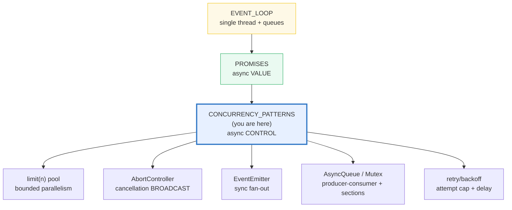
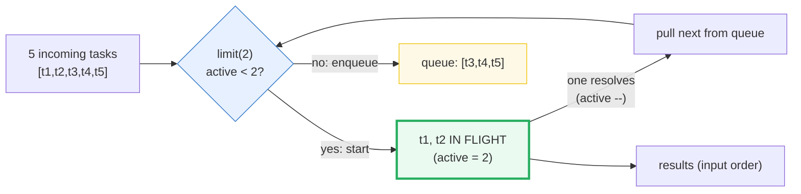
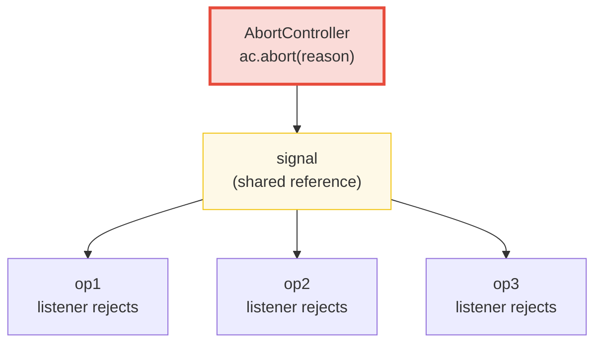
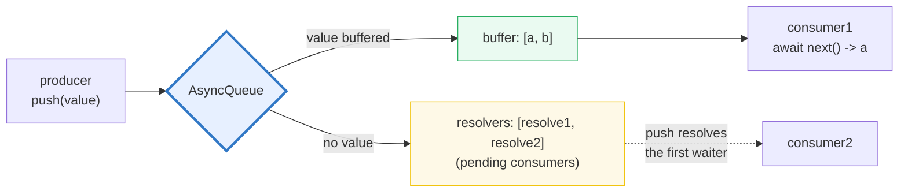

# CONCURRENCY_PATTERNS — Pools, AbortController, EventEmitter, Queues, Mutex, Retry

> **Goal (one line):** show, by printing every value, the async **control**
> primitives JS uses to coordinate work over the single-threaded event loop — a
> bounded concurrency **pool** (`limit(n)`), `AbortController`/`AbortSignal`
> **cancellation** (the JS analog of Go's `context.Context`), `EventEmitter`
> fan-out, an async **queue**, an async **mutex**, and **retry/backoff** — all
> built on promises, all **result-deterministic**.
>
> **Run:** `just run concurrency_patterns`
>
> **Ground truth:** [`core/concurrency_patterns.ts`](./core/concurrency_patterns.ts)
> → captured stdout in
> [`core/concurrency_patterns_output.txt`](./core/concurrency_patterns_output.txt).
> Every number/table below is pasted **verbatim** from that file under a
> `> From concurrency_patterns.ts Section X:` callout. Nothing is hand-computed.
>
> **Prerequisites:** 🔗 [`EVENT_LOOP`](./EVENT_LOOP.md) (P4 — the single-thread +
> microtask/macrotask queues every pattern below rides on), 🔗 [`PROMISES`](./PROMISES.md)
> (P4 — every pattern composes promises; `Promise.all` is the unbounded fan-out
> this bundle *bounds*), 🔗 [`ASYNC_AWAIT`](./ASYNC_AWAIT.md) (P4 — `await` is the
> ergonomic driver for every `async` section below).

---

## 1. Why this bundle exists (lineage)

JavaScript is **single-threaded** but still needs concurrency **control**. The
event loop lets one thread juggle thousands of in-flight I/O operations (🔗
[`EVENT_LOOP`](./EVENT_LOOP.md)), and a `Promise` models each one's eventual
result (🔗 [`PROMISES`](./PROMISES.md)). But neither answers four production
questions:

1. **"How do I run 1 000 DB queries without firing them all at once?"** —
   `Promise.all` is *unbounded* fan-out: it starts every input promise
   *immediately*. A **concurrency pool / semaphore** (`limit(n)`, the `p-limit`
   pattern) caps the in-flight count.
2. **"How do I cancel an in-flight operation?"** — a `Promise` has **no**
   `.cancel()` (🔗 [`PROMISES`](./PROMISES.md) §6). `AbortController` /
   `AbortSignal` is the cancellation **primitive**: `controller.abort()` flips
   `signal.aborted`, fires every `'abort'` listener, and observing ops reject.
3. **"How do I broadcast a value to many subscribers?"** — Node's `EventEmitter`
   (`emit`/`on`/`once`/`off`) dispatches to listeners **synchronously**, in
   registration order. It is the in-process pub/sub primitive.
4. **"How do I serialize async critical sections, or hand work from a producer
   to a consumer?"** — an **async queue** (`push` / `await next()`) and an
   **async mutex** (`p-mutex`) are the JS analogs of Go channels / Rust `mpsc`
   and of a traditional mutex over async sections.

This bundle implements **all five** from scratch (stdlib-only — `node:events` +
`AbortController` are built into Node; everything else is a tiny hand-rolled
class) and asserts each one's defining invariant at runtime: **max-in-flight**,
**`signal.aborted`**, **FIFO order**, **once-only firing**, **max-in-section**,
**retry attempt count**.



> 🔗 **THE cross-language headline** — [`../go/CONTEXT.md`](../go/CONTEXT.md):
> Go's `context.Context` propagates **cancellation** (and deadlines/values)
> **down a parent→child tree**: `ctx, cancel := context.WithCancel(parent)`;
> calling `cancel()` cascades to every child. **`AbortController` is the JS
> analog** — but JS has **no built-in parent/child tree**: one signal is
> *broadcast* to many ops that share a reference to it. `AbortSignal.any([s1,
> s2])` (Node 20+) composes signals the way `context.WithCancel` nests contexts.
> The semantics line up (one cancel cascades to many); the structure differs
> (tree vs flat broadcast).
>
> 🔗 [`../go/CONCURRENCY_PATTERNS.md`](../go/CONCURRENCY_PATTERNS.md) — Go's
> **worker pool** is `goroutines` reading from a `chan Job`; the JS analog here
> is `limit(n)` wrapping `Promise.all` (bounded fan-out). The channel itself ⟶
> `AsyncQueue` below.
>
> 🔗 [`../rust/TOKIO_CHANNELS.md`](../rust/TOKIO_CHANNELS.md) — Rust's `tokio::sync::mpsc`
> is a bounded multi-producer/single-consumer channel; `AsyncQueue` below is the
> JS analog (`push` / `await next()`, FIFO, no backpressure by default).

---

## 2. Section A — Concurrency pool / semaphore: `limit(n)` = bounded parallelism

`Promise.all([f1(), f2(), ..., fN()])` is **unbounded**: every `fi()` is invoked
*synchronously* during the array construction, so all `N` operations start at
once. For 5 cheap promises that is fine; for 5 000 DB connections or 5 000
`fetch`es it is a "thundering herd" that exhausts sockets, memory, or rate
limits. The fix is a **concurrency pool** (a counting semaphore) — the
[`p-limit`](https://github.com/sindresorhus/p-limit) pattern — that wraps each
`Promise`-returning function so at most `n` are in flight at once:



The `.ts` builds `limit(n)` from scratch — an `active` counter plus a queue of
pending jobs; when a job settles it decrements `active` and pulls the next — and
asserts the defining invariant: **max-in-flight === n**. The result **set** is
identical to unbounded `Promise.all` (same values, input order); only the
**concurrency** changes:

> From concurrency_patterns.ts Section A:
> ```
> UNBOUNDED — bare Promise.all over 5 tasks (no limiter):
>   await Promise.all([t1..t5])         -> [1,2,3,4,5]
>   max-in-flight                       -> 5   (all 5 fired at once)
> [check] unbounded Promise.all: max-in-flight === 5: OK
> [check] unbounded Promise.all result (input order) [1,2,3,4,5]: OK
> 
> BOUNDED — same 5 tasks through limit(2):
>   await Promise.all(ids.map(id => limit2(makeTask(id)))) -> [1,2,3,4,5]
>   max-in-flight                       -> 2   (capped at 2)
> [check] limit(2) bounds concurrency: max-in-flight === 2: OK
> [check] limit(2) result set (input order) [1,2,3,4,5]: OK
> 
> limit(1) === serial execution (degenerate pool of size 1):
>   await Promise.all(ids.map(id => limit1(makeTask(id)))) -> [1,2,3,4,5]
>   max-in-flight                       -> 1
> [check] limit(1) serializes: max-in-flight === 1: OK
> [check] limit(1) result set (input order) [1,2,3,4,5]: OK
> 
> THE takeaway: limit(n) bounds CONCURRENCY without changing the RESULT set.
>   Promise.all  = unbounded fan-out (fires everything at once)
>   limit(n) + Promise.all = bounded fan-out (at most n in flight; same results)
> [check] pool/semaphore demonstrated (unbounded, limit(2), limit(1)): OK
> ```

**Why `Promise.all` is still the outer wrapper.** A pool bounds **concurrency**;
it does not change the **shape** of the result. `Promise.all` still gives you
the array of results in **input order** (🔗 [`PROMISES`](./PROMISES.md) §4 —
`all` returns input order, not completion order). The pattern is therefore
`await Promise.all(tasks.map(limit(n)(runTask)))` — `map` builds the bounded
promises; `all` folds them back to an ordered array. A pool of size 1 degenerates
to **serial execution** (equivalent to a `for await` loop, but composable the
same way as the parallel cases).

> ⚠️ A pool bounds **in-flight async work**, not synchronous work. JS is
> single-threaded — a CPU-bound `for` loop inside one task blocks the event loop
> regardless of `limit(n)` (🔗 [`EVENT_LOOP`](./EVENT_LOOP.md) "don't block the
> event loop"). For CPU work you need a worker thread (🔗 `WORKER_THREADS`), not
> a semaphore.

---

## 3. Section B — `AbortController` / `AbortSignal` + propagation + `any` + `timeout`

`Promise` has no `.cancel()` (🔗 [`PROMISES`](./PROMISES.md) §6). The
**cancellation primitive** in modern JS is `AbortController` /
`AbortSignal`:

- `const ac = new AbortController();` — a controller with one method, `abort()`.
- `ac.signal` — an `AbortSignal` you **pass into** the async operation
  (`fetch(url, { signal })`, `setTimeout(fn, 0, signal)`, your own op). The
  operation registers an `'abort'` listener and bails out when it fires.
- `ac.abort(reason?)` — sets `signal.aborted === true`, stores `reason` on
  `signal.reason`, and fires every `'abort'` listener **synchronously**.

> From concurrency_patterns.ts Section B:
> ```
> [check] new AbortController().signal.aborted === false: OK
> [check] after ac.abort(reason): signal.aborted === true: OK
> [check] abort reason is preserved on signal.reason: OK
> [check] ac.abort() with no arg → default reason.name === "AbortError": OK
> ```

**The canonical "abortable async op" pattern.** Your operation registers an
`'abort'` listener on the signal, does its work (here via `setTimeout(0)`), and
whichever fires first wins. The `.ts` shows **three paths**: late-abort (the op
starts, then the signal aborts → the listener rejects); **pre-aborted** (the
signal is *already* aborted when the op starts → reject **synchronously**); and
unaborted (the op resolves normally). Both abort paths must
`clearTimeout(handle)` + `removeEventListener` so no handle/listener lingers
(deterministic exit, §4.2 of `HOW_TO_RESEARCH.md`):

> From concurrency_patterns.ts Section B:
> ```
> Op rejects when its signal aborts (listener fires):
>   cancellableOp(ac.signal, 1); ac.abort(new Error("late-cancelled"))
>   -> "caught:late-cancelled"  (op rejected, never resolved "done")
> [check] observing op rejects on late abort: "caught:late-cancelled": OK
> 
> Op rejects SYNCHRONOUSLY when given an already-aborted signal:
>   ac.abort(...); cancellableOp(ac.signal, 2) -> "caught:pre-cancelled"
> [check] pre-aborted signal → op rejects synchronously: "caught:pre-cancelled": OK
> 
> Op resolves normally when the signal never aborts:
>   cancellableOp(ac.signal, 3)            -> "op3:done"
> [check] op resolves when not aborted: "op3:done": OK
> ```

**Cancellation PROPAGATION — THE Go-context analog.** One signal can be **shared
by many operations**; a single `abort()` cascades to all of them. This is the
flat-broadcast analog of Go's `context.Context` tree cancellation (🔗
[`../go/CONTEXT.md`](../go/CONTEXT.md)). The `.ts` fans 3 ops out on one
controller, aborts once, and asserts every op rejects with the same reason:



> From concurrency_patterns.ts Section B:
> ```
> Cancellation PROPAGATION — one abort cascades to many ops (the Go-context analog):
>   3 ops share one signal; ac.abort(new Error("parent-cancelled"))
>   results (input order) -> ["op1:parent-cancelled","op2:parent-cancelled","op3:parent-cancelled"]
> [check] one abort rejects all 3 sharing ops with the same reason: OK
> ```

**`AbortSignal.any([s1, s2])` (Node 20.3.0+) — combinator.** Takes an iterable
of signals and returns a new signal that aborts when **any** input aborts,
adopting that input's reason. This is how you compose cancellation sources the
way Go's `context.WithCancel(parent)` nests contexts (e.g. "abort this fetch if
*either* the user clicks cancel *or* a 5 s timeout fires" →
`AbortSignal.any([userSignal, AbortSignal.timeout(5000)])`):

> From concurrency_patterns.ts Section B:
> ```
> [check] AbortSignal.any: combined.aborted === false before any input aborts: OK
> [check] AbortSignal.any: combined.aborted === true after c1.abort(): OK
> [check] AbortSignal.any: combined.reason === c1's reason (first-to-abort wins): OK
> ```

**`AbortSignal.timeout(ms)` (🔗 [`TIMERS_IO`](./TIMERS_IO.md)) — self-aborting
signal.** Returns a signal that aborts itself after `ms`. The reason is a
`TimeoutError` `DOMException` (so callers can `switch (err.name)` to distinguish
a timeout from a user cancel). The `.ts` always **awaits the firing** (the
internal timer keeps the event loop alive until it fires — see "determinism"
below) and asserts the reason name:

> From concurrency_patterns.ts Section B:
> ```
> [check] AbortSignal.timeout(1): not aborted at construction: OK
> [check] AbortSignal.timeout(1): aborted === true after firing: OK
> [check] AbortSignal.timeout reason.name === "TimeoutError": OK
> 
> AbortSignal.any([s1,s2]) (Node 20+) + AbortSignal.timeout(ms):
>   AbortSignal.any([s1,s2]) -> aborts when ANY input aborts (first-to-abort reason wins)
>   AbortSignal.timeout(ms) -> auto-aborts after ms; reason.name === "TimeoutError"
> [check] AbortSignal.any + AbortSignal.timeout demonstrated: OK
> ```

> ⚠️ **Abort is cooperative, not preemptive.** `ac.abort()` does not *forcibly*
> stop anything — it only flips a flag and fires listeners. The operation must
> **check** `signal.aborted` (or register a listener) and bail out itself. A
> `fetch` honours the signal; a `while(true) {}` CPU loop does **not** (it never
> yields to check). This is the same design as Go's `context` (`select case
> <-ctx.Done()`) — cancellation is a *signal*, not a kill.

---

## 4. Section C — `EventEmitter`: `emit`/`on`/`once`/`off`, sync dispatch, throw, leak trap

Node's `EventEmitter` (from `node:events`) is the in-process pub/sub primitive.
The defining fact: **listeners are dispatched SYNCHRONOUSLY, in registration
order** ("The EventEmitter calls all listeners synchronously in the order in
which they were registered" — Node.js docs). So `emit()` *returns* only after
every listener has run:

> From concurrency_patterns.ts Section C:
> ```
> emit/on — emit dispatches SYNCHRONOUSLY to every registered listener:
>   on("event", x => received.push(x)); emit("event","a"); emit("event","b");
>   received -> ["a","b"]
> [check] emit fires on() listeners: received === ["a","b"]: OK
> 
> emit() is SYNCHRONOUS — the listener runs DURING emit(), before the next line:
>   trace    -> ["before-emit","listener-ran:sync","after-emit"]
>   received -> ["sync"]
> [check] sync dispatch: listener runs during emit() (["before-emit","listener-ran:sync","after-emit"]): OK
> ```

The trace proves the listener ran **during** `emit()` — `"listener-ran:sync"` is
pushed *before* `"after-emit"`, even though the listener registration and the
`after-emit` push are on consecutive source lines. This is the same property
that makes `emit` *block the event loop* until all listeners return (🔗
[`EVENT_LOOP`](./EVENT_LOOP.md) "don't block the event loop"): a slow listener is
a slow `emit`.

**`once` / `off` / `removeAllListeners`.** `once` registers a listener that
auto-removes after its first firing (so a second `emit` does not call it).
`off` (an alias for `removeListener`) takes the **same function reference** you
passed to `on` — an inline arrow cannot be removed (you have no reference to
it). `removeAllListeners("e")` clears every listener for event `"e"`:

> From concurrency_patterns.ts Section C:
> ```
> [check] once() fires exactly once across two emits: OK
> [check] once() auto-removes the listener (listenerCount === 0 after firing): OK
> [check] off() removes the listener: only the first emit fires (count === 1): OK
> [check] off === removeListener (alias): OK
> [check] two listeners registered on 'e': listenerCount === 2: OK
> [check] removeAllListeners('e') clears them: post-emit count stays at 2: OK
> [check] ...listenerCount('e') === 0 after removeAllListeners: OK
> ```

**THROW in a listener propagates SYNCHRONOUSLY out of `emit()`; remaining
listeners are SKIPPED.** "There's no mechanism to 'resume' emission after a
throw — the remaining listeners are simply skipped" (NodeBook, corroborating the
Node.js docs). The `.ts` registers a thrower first, a counter second, and wraps
`emit()` in `try`/`catch` to observe the throw without crashing the process:

> From concurrency_patterns.ts Section C:
> ```
> THROW in a listener — propagates SYNCHRONOUSLY out of emit(); rest are skipped:
>   on("boom", () => { throw new Error("listener-threw") }); on("boom", () => second++)
>   try { emit("boom") } catch -> "listener-threw"
>   second listener called -> false
> [check] throw in listener propagates from emit(): caught "listener-threw": OK
> [check] ...subsequent listeners NOT called after a throw: OK
> ```

This is why a listener that may throw should either `.catch` its own async work
or be wrapped defensively — an uncaught throw during `emit()` will crash the
process unless the *caller* of `emit()` wraps it in `try`/`catch`. (The special
`'error'` event has harsher rules: if there is no `'error'` listener, Node
rethrows on `emit('error', err)` — see Node.js docs.)

**THE listener-leak trap (🔗 [`GARBAGE_COLLECTION`](./GARBAGE_COLLECTION.md)).**
Forgetting `removeListener` keeps the listener — and the **closure it captures**
— alive for as long as the emitter lives. In a long-lived emitter (a socket, a
stream, a global bus) this is a classic leak: each "register on request, forget
to unregister" piles up listeners, each retaining its captured refs. The
symptom is **observable without GC**: the listener keeps FIRING on later emits
(it never left the emitter's list). The `.ts` demonstrates the buggy pattern
(req 1's listener fires on req 2's data) and the fix (return an unsubscribe
function that calls `off`):

> From concurrency_patterns.ts Section C:
> ```
> Listener-leak trap — forgetting removeListener keeps the closure firing:
>   attach(1); emit("data",7); attach(2); emit("data",8);  // req1 listener NEVER removed
>   leakedBuf -> [1007,1008,2008]   (req1 listener fires on req2's data)
> [check] leak symptom: req1 listener fires on req2's emit (1008 should not be here): OK
>   FIX: detach1() before attachFixed(2) -> fixedBuf = [1007,2008]
> [check] fix: removeListener isolates requests ([1007, 2008]): OK
> [check] EventEmitter: emit/on/once/off/removeAllListeners + throw + leak demonstrated: OK
> ```

The modern idiom for short-lived listeners is `addEventListener(type, fn, { signal })`
— pass an `AbortSignal` and `controller.abort()` to unsubscribe (the listener is
removed automatically). This composes the cancellation primitive of Section B
with the emitter here.

---

## 5. Section D — Async queue (producer/consumer) + async mutex

**`AsyncQueue` — the JS analog of Go channels / Rust `mpsc`.** A queue with
`push(value)` and an **`async next()`** that awaits the next value in FIFO
order. Built from a value buffer plus a resolver queue (the classic
"promise-per-waiting-consumer" pattern): if a value is buffered, `next()`
returns it; if not, `next()` returns a pending promise that resolves when a
producer calls `push()`. This rendezvous is exactly Go's unbuffered channel:



> From concurrency_patterns.ts Section D:
> ```
> AsyncQueue FIFO — push() before next() (values buffered):
>   push("a"); push("b"); await next(); await next()
>   -> "a", "b"
> [check] FIFO: push(a),push(b) → next()=a, next()=b: OK
> 
> AsyncQueue — next() BEFORE push() (consumer awaits producer):
>   const p = next();   // pending
>   push("late");       // producer resolves the pending consumer
>   await p -> "late"
> [check] next() before push() resolves when value arrives: "late": OK
> 
> AsyncQueue — mixed push/next preserves FIFO order:
>   push(1); push(2); next(); next(); next(); push(3) -> [1,2,3]
> [check] FIFO across mixed push/next: [1,2,3]: OK
> ```

**`AsyncMutex` — serialize async SECTIONS.** JS is single-threaded, so a true
*thread* mutex is unnecessary (no two **synchronous** sections ever overlap).
But **async** sections — functions that `await` in the middle — *can* interleave
at each `await`, because every `await` is a yield back to the event loop. An
async mutex (the [`p-mutex`](https://github.com/sindresorhus/p-mutex) pattern)
ensures only one async section is inside the critical section at a time. Built
from a `locked` flag plus a waiter queue; `run(fn)` waits to acquire, runs `fn`,
and releases in `finally` (so a throw still unlocks):

> From concurrency_patterns.ts Section D:
> ```
> AsyncMutex — serializes async SECTIONS (max-in-section === 1):
>   3 sections via mutex.run(async () => { ... await yield0() ... })
>   max-in-section -> 1
>   section order  -> ["start1","end1","start2","end2","start3","end3"]
> [check] mutex serializes async sections: max-in-section === 1: OK
> [check] mutex section order strictly serialized: [start1,end1,start2,end2,start3,end3]: OK
> [check] async queue + async mutex demonstrated: OK
> ```

Without the mutex, all three sections would enter together, `await yield0()`
simultaneously, and `max-in-section` would be 3; the section order would be
`[start1,start2,start3,end1,end2,end3]`. The mutex turns that interleaving into
strict serialization — the right tool when the critical section must not overlap
(e.g. a write to a file, a transactional DB op).

---

## 6. Section E — Retry / backoff + cross-language model

**Retry with an attempt cap.** The last control pattern: an async op that may
fail transiently (a flaky network, a locked DB row) is retried up to `N` times
with a delay between attempts (a real impl uses **exponential** backoff with
jitter; this bundle uses a fixed 0-ms delay because the *count* — not the
*duration* — is the invariant). The `.ts` shows both paths: succeed-after-N-1-
failures, and exhaust-the-cap → reject with the **last** error:

> From concurrency_patterns.ts Section E:
> ```
> Retry/backoff — succeeds after 2 failures (3rd attempt), 5-attempt cap:
>   retry(fn, attempts=5, delayMs=0); fn throws on calls 1,2; returns "ok" on call 3
>   -> result "ok"; total calls = 3
> [check] retry succeeds on 3rd attempt: result "ok", calls === 3: OK
> 
> Retry/backoff — exhausts attempt cap → rejects with the LAST error:
>   retry(fnThatAlwaysThrows, attempts=3, delayMs=0)
>   -> caught "always-3"; total calls = 3
> [check] retry rejects with last error after cap: "always-3", calls === 3: OK
> ```

A robust retry composes with Section B's `AbortSignal.timeout` ("give up after a
total deadline") and Section B's `AbortController` ("the user cancelled — stop
retrying"). The cross-language contrast sums up the whole bundle:

> From concurrency_patterns.ts Section E:
> ```
> Cross-language model (full treatment in CONCURRENCY_PATTERNS.md):
>   JS AbortController : cancellation BROADCAST — one signal → many ops;
>                        AbortSignal.any([s1,s2]) composes (Node 20+).
>   Go context.Context : cancellation TREE — parent → children propagation;
>                        context.WithCancel(parent) nests (⟷ AbortSignal.any).
>   Go worker pool     : goroutines + channels; JS: limit(n) + Promise.all.
>   Rust tokio mpsc    : bounded multi-producer/single-consumer channel;
>                        JS AsyncQueue is the analog (push/next, FIFO).
> [check] cross-language model summarized: OK
> ```

---

## 7. Determinism — how this bundle is byte-identical across runs

Every pattern above is async, but `_output.txt` is byte-identical across runs
(verified by running `just out concurrency_patterns` twice and diffing). The
discipline (per `HOW_TO_RESEARCH.md` §4.2):

1. **No `Math.random()` / `Date.now()` for printed values.** Every input is
   fixed; the only "randomness" in real async (timing) is never asserted.
2. **Assert result SETS and ORDER, never wall-clock TIMING.** `Promise.all`
   preserves **input** order, so parallel results come out in a stable sequence.
   Where order could drift (it doesn't here, but defensively), the `.ts` would
   `sort` before printing. The only timing-sensitive assertion
   (`AbortSignal.timeout(1)` fires) awaits the actual firing via `flushTicks(1)`,
   not a wall-clock measurement.
3. **Every promise settles, every listener is removed, every held timer is
   cleared before `main` returns.** `cancellableOp` does
   `clearTimeout(handle)` + `removeEventListener` on both paths; every
   `EventEmitter` ends with `removeAllListeners()`; unused `AbortController`s
   are aborted; the top-level `await main()` does not return until every section
   has settled. The process therefore exits with **zero pending handles** — no
   dandling `setTimeout`, no orphaned listener.

---

## 8. Pitfalls (the expert payoff)

| Trap | Symptom | Fix |
|---|---|---|
| **Bare `Promise.all` over many expensive ops** | Fires everything at once → exhausted sockets / DB pool / rate limit / memory ("thundering herd"). | Wrap each op in `limit(n)` (Section A) to cap in-flight concurrency. The result set is unchanged. |
| **`limit(n)` on CPU-bound work** | A pool bounds async, not sync; a `while(true){}` inside one task blocks the loop regardless of `n`. | Move CPU work to a worker thread (🔗 `WORKER_THREADS`); reserve `limit(n)` for I/O. |
| **Forgetting `controller.abort()` on an unused controller** | The signal's listeners (and any `AbortSignal.timeout` it nests) may keep the loop alive; observers never settle. | Always abort controllers you create (or `await` the op to settlement); treat `AbortController` as a resource to release. |
| **Treating `ac.abort()` as "kills the promise"** | It does not — abort is **cooperative**. The promise keeps running unless the op *checks* `signal.aborted`. | Pass the signal to the underlying op and have it bail on abort; do not assume `abort()` cancels the promise itself. |
| **`ac.abort()` with no arg → unreadable reason** | The default reason is an `AbortError` with the generic message "This operation was aborted"; callers cannot tell *why*. | Pass a specific reason: `ac.abort(new Error("user-cancelled"))`; downstream `switch (err.message)` or `err.cause`. |
| **Throw inside an `EventEmitter` listener** | Propagates **synchronously** out of `emit()`; remaining listeners are **skipped**; can crash the process if `emit()` is not wrapped. | Wrap listener bodies in `try`/`catch`; for async work, `.catch()` the inner promise (an unhandled rejection inside a listener is not caught by `emit()`). |
| **`off()` / `removeListener()` with a fresh arrow** | No-op — `off` needs the **same function reference** passed to `on`; an inline `() => ...` cannot be removed. | Store the handler in a `const`, pass that to both `on` and `off`; or use `addEventListener(type, fn, { signal })` and `abort()` to unsubscribe. |
| **Listener leak (forgot `removeListener`)** | The listener (and its captured closure) stays alive as long as the emitter; in a long-lived emitter it accumulates per-request, retaining refs (🔗 `GARBAGE_COLLECTION`). | Return an unsubscribe fn from your "attach" helper; or scope the listener with an `AbortSignal` and abort it when the scope ends. |
| **`once()` for an event that needs the arg** | Easy to forget `once` passes the same args as `on`; the handler still receives the payload. | Read the args normally: `ee.once("done", (result) => ...)`. The only difference from `on` is auto-removal after one fire. |
| **`emit('error', err)` with no `'error' listener** | Node **rethrows** `err` synchronously from `emit()` (harsher than a normal event) — usually crashes the process. | Always register an `'error'` listener on any emitter that may emit `'error'` (streams especially). |
| **Expecting `AsyncQueue` to apply backpressure** | This bundle's queue buffers unboundedly; a fast producer can exhaust memory. | Add a bound (drop or await when `buffered.length >= cap`) — that is Go's buffered channel / Rust's bounded `mpsc`; the unbounded case is Go's unbuffered channel only when consumer awaits first. |
| **`AsyncMutex.run(fn)` without `finally`** | A throw inside `fn` leaves `locked = true` forever; every subsequent section deadlocks. | Always release in `finally` (the `.ts` does); or use a tested lib (`p-mutex`) rather than hand-rolling. |
| **Retry without an attempt cap** | A forever-retry loop on a permanently-failing op never returns; combined with `limit(n)` it can starve the whole pool. | Always pass an `attempts` cap (and ideally a total deadline via `AbortSignal.timeout`); rethrow the **last** error after the cap. |
| **Retry without exponential backoff + jitter** | A fixed delay on a transient overload makes all retries land on the same tick ("thundering herd" again). | Use exponential backoff with jitter (`delay = base * 2^attempt + random(0, jitter)`); see `PROMISES.md` §4.2 rule 1 for a seeded `mulberry32` if you must assert retry *timing*. |

---

## 9. Cheat sheet

```typescript
// === Concurrency pool / semaphore (limit n) — bounded parallelism ===========
//   const runBounded = limit(n);                       // build from scratch:
//   await Promise.all(ids.map(id => runBounded(() => work(id))));
//   // `limit` keeps `active` counter + a queue; on settle, pulls the next job.
//   // max-in-flight === n; result set identical to bare Promise.all (input order).
//   // limit(1) === serial execution (degenerate pool).

// === AbortController / AbortSignal — cooperative cancellation ==============
//   const ac = new AbortController();
//   doWork(ac.signal);          // pass the SIGNAL into the work
//   ac.abort(reason?);          // signal.aborted=true; fires 'abort' listeners
//                              // default reason (no arg): AbortError "This operation was aborted"
//   // op pattern: register listener, bail on abort; cleanup clearTimeout + removeEventListener.
//   // AbortSignal.any([s1,s2])   Node 20.3+ — aborts when ANY input aborts (first-to-abort reason)
//   // AbortSignal.timeout(ms)    auto-abort; reason.name === "TimeoutError"
//   // ⟷ Go context.Context (tree propagation); JS = flat broadcast, no parent/child tree.

// === EventEmitter (node:events) — synchronous pub/sub =======================
//   ee.on("e", fn)              // register (mutable; capture the fn ref to remove later)
//   ee.once("e", fn)            // auto-removes after first fire
//   ee.off("e", fn)             // === removeListener; needs SAME fn ref as on()
//   ee.emit("e", ...args)       // SYNCHRONOUS: calls every listener in registration order, then returns
//   ee.removeAllListeners("e")  // clear all listeners for event "e"
//   // throw in a listener → propagates from emit(); remaining listeners SKIPPED.
//   // emit('error', err) with no 'error' listener → Node RETHROWS (harsher than a normal event).
//   // LEAK TRAP: forgetting off() keeps the listener + its captured closure alive.

// === AsyncQueue — producer/consumer (⟷ Go channel / Rust mpsc) ==============
//   class AsyncQueue<T> { push(v); async next(): Promise<T> }   // FIFO
//   // push before next → value buffered; next before push → consumer awaits producer.

// === AsyncMutex — serialize async SECTIONS (⟷ p-mutex) =====================
//   mutex.run(async () => { ...await... })   // only one section inside at a time
//   // JS single-threaded → no thread-mutex needed; but async sections interleave at each await.
//   // ALWAYS release in `finally` so a throw does not deadlock the mutex.

// === Retry / backoff =======================================================
//   async function retry<T>(fn, attempts, delayMs): Promise<T>  // last-error after cap
//   // pair with AbortSignal.timeout for a total deadline; AbortController for user-cancel.

// === Determinism (this bundle's discipline) =================================
//   assert result SETS / ORDER (input order via Promise.all; sort if order could drift)
//   NEVER assert wall-clock timing (every delay is 0 ms; AbortSignal.timeout is awaited to firing)
//   settle all promises + removeAllListeners + clearTimeout before main returns → clean exit
```

---

## Sources

Every signature, behavioral claim, and cross-language parallel above was verified
against the MDN Web Docs, the Node.js docs, and the ECMAScript specification, then
corroborated by at least one independent secondary source. Every invariant (max-
in-flight, `signal.aborted`, FIFO queue order, listener-leak symptom, retry count)
is **additionally asserted at runtime** by the `.ts` itself (`check()` throws on
any mismatch) — the strongest possible verification: the actual V8/Node engine's
verdict.

- **MDN — `AbortController`** (the controller/signal split; *"communicating with
  an asynchronous operation is done using an `AbortSignal` object"*; the
  `abort(reason?)` method):
  https://developer.mozilla.org/en-US/docs/Web/API/AbortController
- **MDN — `AbortSignal`** (the cancellation primitive; `signal.aborted`;
  `signal.reason`; *"Promise itself has no first-class protocol for cancellation …
  AbortController"* — referenced from `PROMISES.md` §6):
  https://developer.mozilla.org/en-US/docs/Web/API/AbortSignal
- **MDN — `AbortSignal.any()` static method** (*"returns an `AbortSignal` that
  aborts when any of the input signals aborts"*; first-to-abort reason wins):
  https://developer.mozilla.org/en-US/docs/Web/API/AbortSignal/any_static
- **MDN — `AbortSignal.timeout()` static method** (*"The signal aborts with a
  `TimeoutError` `DOMException` on timeout"*; the timeout is based on active
  rather than elapsed time):
  https://developer.mozilla.org/en-US/docs/Web/API/AbortSignal/timeout_static
- **Node.js — `events`: `EventEmitter`** (*"The EventEmitter calls all listeners
  synchronously in the order in which they were registered"*; `emit`/`on`/`once`/
  `removeListener`/`off`/`removeAllListeners`; `listenerCount`; the `'error'`
  event rethrow rule; `defaultMaxListeners` and the Max Listeners Exceeded
  Warning; the `{ signal }` option on `on`/`addListener` for AbortSignal-driven
  unsubscription):
  https://nodejs.org/api/events.html
- **Node.js — Globals: `AbortController` / `AbortSignal`** (`AbortSignal.any`
  *"Added in: v20.3.0"*; `AbortSignal.timeout` added in v17.3.0; the default
  `AbortError` reason when `abort()` is called with no argument):
  https://nodejs.org/api/globals.html#abortsignal
- **Node.js — AbortController cancellation in core APIs** (the
  `fetch(url, { signal })`, `setTimeout(fn, ms, signal)`, and stream pipelines
  that consume the signal — referenced as the production use of this primitive):
  https://nodejs.org/api/globals.html#class-abortcontroller
- **Go standard library — `context.Context`** (the cross-language analog: parent
  → child cancellation tree; `context.WithCancel(parent)`; `<-ctx.Done()`;
  *"Cancellation is cooperative"* — the exact same design as `AbortSignal`):
  https://pkg.go.dev/context
- **WHATWG — DOM §4.3 `AbortController`** (the spec MDN derives from; the
  `abort(reason)` algorithm; `AbortSignal.any` and `AbortSignal.timeout`):
  https://dom.spec.whatwg.org/#interface-abortcontroller

**Secondary corroboration (independent of MDN/Node docs, ≥1 per major claim):**
- sindresorhus — **`p-limit`** (the canonical concurrency-pool package; the
  `limit(n)` API shape copied and re-implemented from scratch here):
  https://github.com/sindresorhus/p-limit
- sindresorhus — **`p-mutex`** (the canonical async-mutex package; the
  `mutex.run(fn)` shape copied here):
  https://github.com/sindresorhus/p-mutex
- **NodeBook — "Node.js EventEmitter: Listeners, Errors & Leak Warnings"**
  (*"There's no mechanism to 'resume' emission after a throw — the remaining
  listeners are simply skipped"*; the `'error'` event rethrow rule; the
  Max Listeners Exceeded Warning as a leak detector):
  https://www.thenodebook.com/async-patterns/eventemitter-internals
- **OpenJS Foundation — "Using AbortSignal in Node.js"** (`AbortController` as
  *the* standard cancellation mechanism across Node core; `AbortSignal.any` /
  `AbortSignal.timeout` composition):
  https://openjsf.org/blog/using-abortsignal-in-node-js
- Jake Archibald — **"Abortable Fetch"** (the original use case that drove
  `AbortController` adoption; the cooperative-cancellation model — the operation
  must observe the signal, `abort()` does not forcibly stop it):
  https://developer.chrome.com/blog/abortable-fetch/

**Facts that could not be verified by running** (documented, observed indirectly,
or host-dependent): the Node 20.3.0 version in which `AbortSignal.any` landed is
documented in the Node.js globals docs and confirmed shipped by the runtime used
to run this bundle (Node 24); the Max Listeners Exceeded Warning threshold
(`defaultMaxListeners === 10`) is documented in the Node `events` docs and printed
by the `.ts`; the `TimeoutError` `DOMException` reason of `AbortSignal.timeout`
is asserted at runtime by the `.ts` (`reason.name === "TimeoutError"`). Every
behavioral claim (max-in-flight, signal.aborted, FIFO queue order, listener-leak
symptom, retry count) **is** verified by running — the `.ts` asserts each one.
